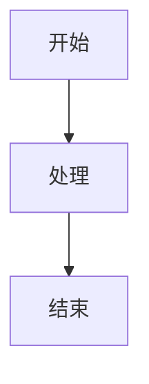

# AgentChat 文档网站

这是AgentChat项目的技术文档网站，基于VitePress构建，部署在GitHub Pages上。

## 🚀 快速开始

### 在线访问

访问 [https://shy2593666979.github.io/agentchat-docs/](https://shy2593666979.github.io/agentchat-docs/) 查看在线文档。

### 本地开发

1. **克隆仓库**
   ```bash
   git clone https://github.com/Shy2593666979/agentchat-docs.git
   cd agentchat-docs
   ```

2. **安装依赖**
   ```bash
   cd docs
   npm install
   ```

3. **启动开发服务器**
   ```bash
   npm run dev
   ```

4. **访问本地网站**
   
   打开浏览器访问 `http://localhost:5173`

### 构建生产版本

```bash
cd docs
npm run build
```

构建后的文件将生成在 `docs/.vitepress/dist` 目录中。

## 📁 项目结构

```
docs/
├── .vitepress/
│   ├── config.ts              # VitePress 配置文件
│   ├── theme/
│   │   ├── index.ts           # 自定义主题入口
│   │   └── style/
│   │       ├── custom.css     # 自定义样式
│   │       └── vars.css       # CSS 变量
├── public/
│   ├── favicon.ico            # 网站图标
│   └── logo.png              # 项目Logo
├── index.md                   # 首页
├── 系统概述.md                # 系统概述文档
├── 快速入门.md                # 快速入门指南
├── 技术栈.md                  # 技术栈介绍
├── 核心功能模块/              # 核心功能模块文档
├── API参考/                   # API参考文档
├── 数据库设计/                # 数据库设计文档
├── 项目目录结构/              # 项目结构文档
├── 开发指南/                  # 开发指南
├── 部署指南/                  # 部署指南
└── 安全考虑/                  # 安全相关文档
```

## 🛠️ 技术栈

- **静态站点生成器**: [VitePress](https://vitepress.dev/)
- **前端框架**: Vue 3
- **构建工具**: Vite
- **部署平台**: GitHub Pages
- **CI/CD**: GitHub Actions

## 📝 文档编写指南

### 添加新页面

1. 在相应目录下创建 `.md` 文件
2. 在 `.vitepress/config.ts` 中更新导航和侧边栏配置
3. 提交更改，GitHub Actions 会自动部署

### Markdown 语法

支持标准 Markdown 语法，以及以下扩展：

- **代码高亮**: 支持多种编程语言语法高亮
- **Mermaid 图表**: 支持流程图、时序图等
- **Vue 组件**: 可以在 Markdown 中使用 Vue 组件
- **自定义容器**: 支持提示、警告等容器

### 示例

#### 代码块
```javascript
function hello() {
  console.log('Hello, AgentChat!')
}
```

#### Mermaid 图表


#### 自定义容器
::: tip 提示
这是一个提示信息
:::

::: warning 警告
这是一个警告信息
:::

::: danger 危险
这是一个危险信息
:::

## 🔧 配置说明

### VitePress 配置

主要配置文件位于 `.vitepress/config.ts`，包含：

- **站点信息**: 标题、描述、base路径
- **主题配置**: 导航、侧边栏、搜索等
- **Markdown配置**: 代码高亮、插件等
- **构建配置**: 优化选项、输出目录等

### 自定义主题

- `theme/index.ts`: 主题入口文件
- `theme/style/vars.css`: CSS 变量定义
- `theme/style/custom.css`: 自定义样式

### GitHub Actions

自动部署配置位于 `.github/workflows/deploy.yml`：

- **触发条件**: 推送到 main 分支且 docs 目录有变更
- **构建环境**: Ubuntu + Node.js 18
- **部署目标**: GitHub Pages

## 🚀 部署说明

### 自动部署

当你推送代码到 main 分支时，GitHub Actions 会自动：

1. 检出代码
2. 安装依赖
3. 构建文档
4. 部署到 GitHub Pages

### 手动部署

如果需要手动触发部署：

1. 进入 GitHub 仓库
2. 点击 "Actions" 标签
3. 选择 "Deploy Documentation" 工作流
4. 点击 "Run workflow"

### GitHub Pages 设置

确保在仓库设置中：

1. 进入 Settings > Pages
2. Source 选择 "GitHub Actions"
3. 保存设置

## 🤝 贡献指南

### 文档贡献

1. **Fork 仓库**
2. **创建分支**: `git checkout -b feature/new-doc`
3. **编写文档**: 添加或修改 Markdown 文件
4. **本地测试**: `npm run dev` 预览效果
5. **提交更改**: `git commit -m "Add new documentation"`
6. **推送分支**: `git push origin feature/new-doc`
7. **创建 PR**: 在 GitHub 上创建 Pull Request

### 文档规范

- 使用清晰的标题层次结构
- 添加适当的代码示例
- 包含必要的图表和截图
- 保持内容的准确性和时效性
- 遵循统一的格式和风格

## 📞 支持与反馈

如果你在使用文档网站时遇到问题或有改进建议：

- 🐛 [报告 Bug](https://github.com/Shy2593666979/AgentChat/issues/new?template=bug_report.md)
- 💡 [功能建议](https://github.com/Shy2593666979/AgentChat/issues/new?template=feature_request.md)
- 📧 [联系我们](mailto:your-email@example.com)

## 📄 许可证

本项目基于 [MIT 许可证](LICENSE) 开源。

---

**享受使用 AgentChat 文档网站！** 🎉