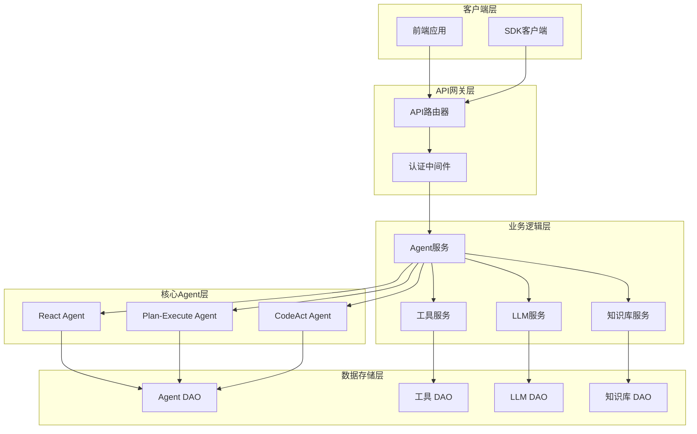
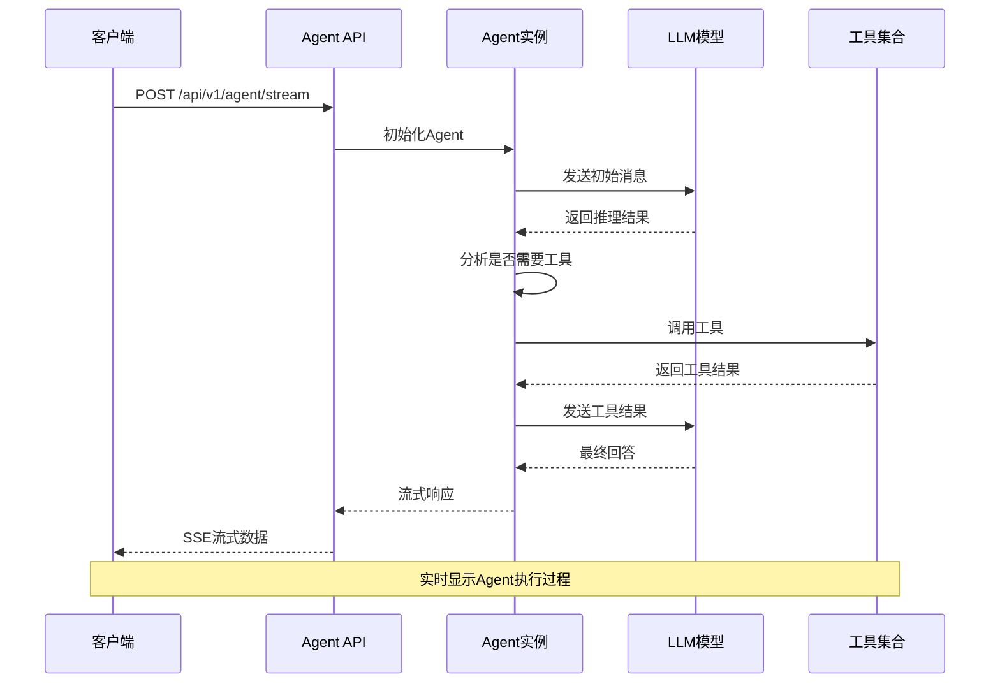

# Agent API 完整参考文档

## 目录
1. [简介](#简介)
2. [API架构概览](#api架构概览)
3. [核心端点详解](#核心端点详解)
4. [Agent配置模型](#agent配置模型)
5. [Agent执行与调试](#agent执行与调试)
6. [错误处理机制](#错误处理机制)
7. [完整示例](#完整示例)
8. [最佳实践](#最佳实践)
9. [故障排除指南](#故障排除指南)

## 简介

Agent API提供了完整的Agent生命周期管理功能，包括创建、读取、更新、删除（CRUD）操作，以及Agent的调试和执行接口。该API基于FastAPI框架构建，支持流式响应和实时调试功能。

### 主要特性
- **完整的CRUD操作**：支持Agent的全生命周期管理
- **流式执行**：实时返回Agent执行过程中的中间状态
- **多模态支持**：集成LLM模型、工具集、知识库和MCP服务器
- **内存机制**：可选的记忆功能支持上下文持久化
- **权限控制**：基于用户身份的访问控制

## API架构概览



**图表来源**
- [router.py](https://github.com/Shy2593666979/AgentChat/src/backend/agentchat/api/router.py#L1-L28)
- [agent.py](https://github.com/Shy2593666979/AgentChat/src/backend/agentchat/api/v1/agent.py#L1-L101)

**章节来源**
- [router.py](https://github.com/Shy2593666979/AgentChat/src/backend/agentchat/api/router.py#L1-L28)
- [agent.py](https://github.com/Shy2593666979/AgentChat/src/backend/agentchat/api/v1/agent.py#L1-L101)

## 核心端点详解

### 1. 创建Agent

**端点**: `POST /api/v1/agent`

**功能**: 创建新的Agent实例

**请求参数**:
- **请求体**: `CreateAgentRequest` 对象
- **认证**: 需要登录用户权限

**请求示例**:
```json
{
  "name": "联网搜索Agent",
  "description": "具备联网搜索能力的智能助手",
  "logo_url": "https://example.com/logo.png",
  "tool_ids": ["web_search", "crawl_web"],
  "llm_id": "gpt-4",
  "mcp_ids": [],
  "knowledge_ids": [],
  "enable_memory": true,
  "system_prompt": "你是一个专业的网络搜索助手，能够帮助用户查找最新的信息。",
  "enable_memory": true
}
```

**响应格式**:
```json
{
  "status_code": 200,
  "status_message": "SUCCESS",
  "data": null
}
```

**错误处理**:
- `400`: Agent名称重复
- `500`: 创建过程中出现系统错误

### 2. 获取Agent列表

**端点**: `GET /api/v1/agent`

**功能**: 获取当前用户的Agent列表

**响应数据**:
```json
{
  "status_code": 200,
  "status_message": "SUCCESS",
  "data": [
    {
      "agent_id": "uuid",
      "name": "联网搜索Agent",
      "description": "具备联网搜索能力的智能助手",
      "logo_url": "https://example.com/logo.png",
      "tool_ids": ["web_search", "crawl_web"],
      "llm_id": "gpt-4",
      "mcp_ids": [],
      "knowledge_ids": [],
      "enable_memory": true,
      "system_prompt": "你是一个专业的网络搜索助手...",
      "created_at": "2024-01-01T00:00:00Z"
    }
  ]
}
```

### 3. 更新Agent

**端点**: `PUT /api/v1/agent`

**功能**: 更新现有Agent的配置

**请求参数**:
- **请求体**: `UpdateAgentRequest` 对象
- **认证**: 需要Agent所有者权限

**请求示例**:
```json
{
  "agent_id": "uuid",
  "name": "更新后的Agent名称",
  "description": "更新后的描述",
  "tool_ids": ["web_search", "image2text"],
  "system_prompt": "更新后的系统提示词"
}
```

### 4. 删除Agent

**端点**: `DELETE /api/v1/agent`

**功能**: 删除指定的Agent及其相关对话记录

**请求参数**:
- **请求体**: 包含 `agent_id` 的JSON对象

**权限验证**: 只有Agent所有者或管理员可以删除

### 5. 搜索Agent

**端点**: `POST /api/v1/agent/search`

**功能**: 根据名称搜索用户的Agent

**请求参数**:
```json
{
  "name": "搜索关键词"
}
```

**响应**: 符合条件的Agent列表

**章节来源**
- [agent.py](https://github.com/Shy2593666979/AgentChat/src/backend/agentchat/api/v1/agent.py#L16-L101)
- [schemas.py](https://github.com/Shy2593666979/AgentChat/src/backend/agentchat/schema/schemas.py#L13-L28)

## Agent配置模型

### CreateAgentRequest 模型

Agent创建请求的核心数据结构：

| 字段名 | 类型 | 必填 | 描述 |
|--------|------|------|------|
| name | string | 是 | Agent名称，最大长度20字符 |
| description | string | 是 | Agent描述，最大长度200字符 |
| logo_url | string | 是 | Agent Logo URL |
| tool_ids | string[] | 否 | 绑定的工具ID列表 |
| llm_id | string | 否 | 绑定的LLM模型ID |
| mcp_ids | string[] | 否 | 绑定的MCP服务器ID列表 |
| knowledge_ids | string[] | 否 | 绑定的知识库ID列表 |
| enable_memory | boolean | 否 | 是否启用记忆功能（默认true） |
| system_prompt | string | 是 | Agent系统提示词 |

### UpdateAgentRequest 模型

Agent更新请求的数据结构：

| 字段名 | 类型 | 必填 | 描述 |
|--------|------|------|------|
| agent_id | string | 是 | 要更新的Agent ID |
| name | string? | 否 | Agent名称 |
| description | string? | 否 | Agent描述 |
| logo_url | string? | 否 | Logo URL |
| tool_ids | string[]? | 否 | 工具ID列表 |
| llm_id | string? | 否 | LLM模型ID |
| mcp_ids | string[]? | 否 | MCP服务器ID列表 |
| knowledge_ids | string[]? | 否 | 知识库ID列表 |
| enable_memory | boolean? | 否 | 是否启用记忆功能 |
| system_prompt | string? | 否 | 系统提示词 |

### 核心配置字段详解

#### LLM模型选择
- **作用**: 指定Agent使用的语言模型
- **支持类型**: GPT系列、Claude系列、本地模型等
- **配置方式**: 通过 `llm_id` 字段指定模型标识符

#### 提示词模板 (System Prompt)
- **作用**: 定义Agent的行为模式和角色定位
- **最佳实践**: 
  - 明确Agent的角色和职责
  - 提供具体的任务指导
  - 设定行为边界和限制

#### 工具集绑定 (Tools)
- **作用**: 为Agent添加外部能力
- **常见工具**:
  - `web_search`: 网络搜索
  - `crawl_web`: 网页爬取
  - `image2text`: 图像转文本
  - `text2image`: 文本转图像
  - `get_weather`: 天气查询

#### 记忆机制 (Memory)
- **作用**: 启用上下文记忆功能
- **实现方式**: 基于向量数据库的记忆存储
- **应用场景**: 长对话、个性化服务、上下文理解

**章节来源**
- [agent.py](https://github.com/Shy2593666979/AgentChat/src/backend/agentchat/schema/agent.py#L4-L26)
- [agent.py](https://github.com/Shy2593666979/AgentChat/src/backend/agentchat/api/services/agent.py#L11-L22)

## Agent执行与调试

### 流式执行接口

Agent API支持流式执行，能够实时返回执行过程中的中间状态：



**图表来源**
- [react_agent.py](https://github.com/Shy2593666979/AgentChat/src/backend/agentchat/core/agents/react_agent.py#L230-L278)

### 执行状态类型

Agent执行过程中会返回多种状态类型：

| 状态类型 | 描述 | 数据结构 |
|----------|------|----------|
| event | 执行事件 | 包含标题、状态、消息的事件数据 |
| response_chunk | 回答片段 | 流式返回的文本片段 |
| error | 错误信息 | 执行过程中的错误详情 |

### 调试功能

#### 实时事件监控
- **工具选择事件**: 显示Agent何时决定调用哪些工具
- **工具执行事件**: 展示工具调用的开始、结束和错误状态
- **模型推理事件**: 显示模型思考过程

#### 性能指标
- **响应时间**: 每个步骤的耗时统计
- **Token消耗**: 输入输出的Token数量
- **工具调用次数**: 工具被调用的总次数

**章节来源**
- [react_agent.py](https://github.com/Shy2593666979/AgentChat/src/backend/agentchat/core/agents/react_agent.py#L230-L278)

## 错误处理机制

### 常见错误类型

#### 1. 参数验证错误
```json
{
  "status_code": 400,
  "status_message": "BAD REQUEST",
  "data": null
}
```

**错误场景**:
- Agent名称为空或过长
- 工具ID不存在
- LLM模型不可用
- 知识库ID无效

#### 2. 权限错误
```json
{
  "status_code": 403,
  "status_message": "没有权限访问",
  "data": null
}
```

**错误场景**:
- 非所有者尝试修改Agent
- 尝试删除不存在的Agent

#### 3. 系统错误
```json
{
  "status_code": 500,
  "status_message": "系统内部错误",
  "data": null
}
```

**错误场景**:
- 数据库连接失败
- LLM服务不可用
- 工具调用超时

### 错误处理最佳实践

#### 1. 客户端处理
```typescript
// 前端错误处理示例
async function createAgentWithRetry(agentData: AgentCreateRequest) {
  try {
    const response = await createAgentAPI(agentData);
    if (response.data.status_code === 200) {
      return { success: true, agent: response.data };
    } else {
      throw new Error(response.data.status_message);
    }
  } catch (error) {
    if (error.response?.status === 400) {
      // 参数验证错误处理
      console.error('参数错误:', error.response.data);
    } else if (error.response?.status === 403) {
      // 权限错误处理
      console.error('权限不足');
    } else {
      // 其他错误处理
      console.error('系统错误:', error);
    }
    throw error;
  }
}
```

#### 2. 服务端错误处理
```python
# 服务端错误处理示例
@router.post("/agent")
async def create_agent(agent_request: CreateAgentRequest):
    try:
        # 参数验证
        if not agent_request.name or len(agent_request.name) > 20:
            return resp_500(message="Agent名称不能为空且不能超过20字符")
        
        # 业务逻辑处理
        await AgentService.create_agent(...)
        
        return resp_200()
    except ValueError as e:
        logger.error(f"Agent创建失败: {e}")
        return resp_500(message=str(e))
    except Exception as e:
        logger.error(f"系统错误: {e}")
        return resp_500(message="系统内部错误")
```

**章节来源**
- [schemas.py](https://github.com/Shy2593666979/AgentChat/src/backend/agentchat/schema/schemas.py#L19-L28)
- [agent.py](https://github.com/Shy2593666979/AgentChat/src/backend/agentchat/api/v1/agent.py#L16-L101)

## 完整示例

### 示例1: 创建具备联网搜索能力的Agent

**需求**: 创建一个能够进行网络搜索和网页爬取的Agent

**请求数据**:
```json
{
  "name": "智能搜索助手",
  "description": "能够进行网络搜索、网页爬取和信息整理的智能助手",
  "logo_url": "https://cdn.example.com/agents/search.png",
  "tool_ids": ["web_search", "tavily_search", "crawl_web"],
  "llm_id": "gpt-4-turbo",
  "mcp_ids": [],
  "knowledge_ids": [],
  "enable_memory": true,
  "system_prompt": "你是一个专业的信息收集助手。你的主要任务是帮助用户搜索最新信息、爬取网页内容并整理有用的信息。请保持客观、准确，避免传播虚假信息。当用户需要深入分析时，可以多次搜索和爬取。"
}
```

**预期响应**:
```json
{
  "status_code": 200,
  "status_message": "SUCCESS",
  "data": null
}
```

### 示例2: 创建具备知识库查询能力的Agent

**需求**: 创建一个能够访问知识库的Agent

**请求数据**:
```json
{
  "name": "知识问答助手",
  "description": "基于企业知识库的专业问答助手",
  "logo_url": "https://cdn.example.com/agents/knowledge.png",
  "tool_ids": [],
  "llm_id": "gpt-4",
  "mcp_ids": [],
  "knowledge_ids": ["kb_001", "kb_002"],
  "enable_memory": true,
  "system_prompt": "你是一个企业知识库问答助手。你的任务是帮助用户从企业知识库中检索准确的信息。请仔细阅读知识库内容，确保回答的准确性。如果知识库中没有相关信息，请明确告知用户。"
}
```

### 示例3: 创建复合能力Agent

**需求**: 创建一个同时具备搜索、工具调用和记忆能力的高级Agent

**请求数据**:
```json
{
  "name": "全能助手",
  "description": "具备综合能力的智能助手，能够进行搜索、工具调用和长期记忆",
  "logo_url": "https://cdn.example.com/agents/universal.png",
  "tool_ids": ["web_search", "image2text", "text2image", "send_email"],
  "llm_id": "gpt-4",
  "mcp_ids": ["mcp_calendar", "mcp_documents"],
  "knowledge_ids": ["corporate_kb"],
  "enable_memory": true,
  "system_prompt": "你是一个全能型智能助手。你的任务是帮助用户完成各种复杂任务，包括但不限于：网络搜索、文档处理、日程管理、邮件发送等。记住用户之前的需求和偏好，提供个性化的服务。始终保持专业和友好的态度。"
}
```

### 示例4: Agent调试流程

**调试步骤**:
1. **创建Agent**: 使用上述配置创建Agent
2. **发送消息**: 向Agent发送测试消息
3. **监控流式响应**: 实时查看Agent的执行过程
4. **分析结果**: 检查Agent的回答质量和执行过程

**调试响应示例**:
```json
{
  "type": "event",
  "timestamp": 1640995200.123456,
  "data": {
    "title": "开始分析和选择可用工具",
    "status": "START",
    "message": "正在分析需要使用的工具..."
  }
}

{
  "type": "event",
  "timestamp": 1640995200.234567,
  "data": {
    "title": "开始分析和选择可用工具",
    "status": "END",
    "message": "命中可用工具：web_search"
  }
}

{
  "type": "response_chunk",
  "timestamp": 1640995200.345678,
  "data": {
    "chunk": "根据您的需求，我将为您搜索相关信息...",
    "accumulated": "根据您的需求，我将为您搜索相关信息..."
  }
}
```

**章节来源**
- [agent.ts](https://github.com/Shy2593666979/AgentChat/src/frontend/src/apis/agent.ts#L4-L27)
- [agent.py](https://github.com/Shy2593666979/AgentChat/src/backend/agentchat/api/v1/agent.py#L16-L101)

## 最佳实践

### 1. Agent命名规范
- 使用描述性的名称
- 避免特殊字符
- 考虑团队协作的命名约定

### 2. 系统提示词编写
- 明确角色定位
- 设定行为边界
- 提供具体的工作流程

### 3. 工具选择策略
- 根据需求选择合适的工具
- 避免过度依赖外部工具
- 考虑工具的可用性和稳定性

### 4. 内存管理
- 合理启用记忆功能
- 定期清理不必要的历史记录
- 注意隐私保护

### 5. 错误处理
- 实现重试机制
- 提供有意义的错误信息
- 记录详细的错误日志

## 故障排除指南

### 常见问题及解决方案

#### 1. Agent创建失败
**症状**: 返回400错误，提示参数验证失败
**解决方法**:
- 检查Agent名称是否符合长度要求
- 验证提供的工具ID是否存在
- 确认LLM模型ID有效

#### 2. Agent执行异常
**症状**: Agent无法正常响应或频繁出错
**解决方法**:
- 检查工具配置是否正确
- 验证LLM服务连接状态
- 查看Agent的日志输出

#### 3. 权限问题
**症状**: 返回403错误，提示权限不足
**解决方法**:
- 确认用户身份验证
- 检查Agent的所有权关系
- 联系管理员获取相应权限

#### 4. 性能问题
**症状**: Agent响应缓慢或超时
**解决方法**:
- 优化系统提示词长度
- 减少不必要的工具调用
- 升级硬件资源配置

### 调试工具和技巧

#### 1. 日志分析
```bash
# 查看Agent服务日志
docker logs agentchat_backend

# 查看特定时间段的日志
docker logs agentchat_backend --since "2024-01-01T00:00:00"
```

#### 2. 性能监控
```python
# 监控Agent执行性能
import time
from loguru import logger

start_time = time.time()
try:
    result = await agent.execute(messages)
    execution_time = time.time() - start_time
    logger.info(f"Agent执行耗时: {execution_time:.2f}秒")
except Exception as e:
    logger.error(f"Agent执行失败: {e}")
```

#### 3. 网络诊断
```bash
# 检查LLM服务连接
curl -X GET "http://llm-service/status" \
     -H "Authorization: Bearer YOUR_TOKEN"

# 检查工具服务连接
curl -X GET "http://tool-service/ping"
```

**章节来源**
- [agent.py](https://github.com/Shy2593666979/AgentChat/src/backend/agentchat/api/services/agent.py#L11-L143)
- [settings.py](https://github.com/Shy2593666979/AgentChat/src/backend/agentchat/settings.py#L1-L62)
