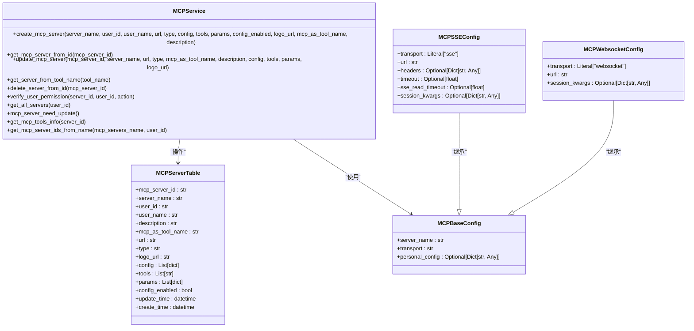

# MCP服务API

## 目录
1. [介绍](#介绍)
2. [项目结构](#项目结构)
3. [核心组件](#核心组件)
4. [架构概述](#架构概述)
5. [详细组件分析](#详细组件分析)
6. [依赖分析](#依赖分析)
7. [性能考虑](#性能考虑)
8. [故障排除指南](#故障排除指南)
9. [结论](#结论)

## 介绍

MCP（Modular Capability Provider）服务API是AgentChat系统的核心扩展机制，它允许通过模块化能力提供者来扩展Agent的功能边界。该系统通过标准化的API接口实现了MCP服务器的注册、发现和状态查询，支持通过mcp_chat端点与MCP Agent进行交互。系统内置了Lark-MCP和Weather-MCP等服务，并提供了灵活的配置流程和动态加载机制，使开发者能够轻松集成新的MCP服务。

**MCP协议**在系统中扮演着关键角色，它定义了能力提供者与主Agent之间的通信标准，使得各种外部服务能够以统一的方式被集成和调用。这种架构设计不仅提高了系统的可扩展性，还增强了功能的灵活性和可维护性。

## 项目结构

MCP服务在AgentChat项目中具有清晰的目录结构和组织方式，主要分布在`src/backend/agentchat/`目录下。系统采用分层架构设计，将API接口、服务逻辑、数据模型和具体实现分离，便于维护和扩展。


**图源**
- [v1/mcp_server.py](https://github.com/Shy2593666979/AgentChat/src/backend/agentchat/api/v1/mcp_server.py)
- [api/services/mcp_server.py](https://github.com/Shy2593666979/AgentChat/src/backend/agentchat/api/services/mcp_server.py)
- [services/mcp/manager.py](https://github.com/Shy2593666979/AgentChat/src/backend/agentchat/services/mcp/manager.py)
- [database/models/mcp_server.py](https://github.com/Shy2593666979/AgentChat/src/backend/agentchat/database/models/mcp_server.py)
- [schema/mcp.py](https://github.com/Shy2593666979/AgentChat/src/backend/agentchat/schema/mcp.py)
- [config/mcp_server.json](https://github.com/Shy2593666979/AgentChat/src/backend/agentchat/config/mcp_server.json)

**本节来源**
- [src/backend/agentchat/](https://github.com/Shy2593666979/AgentChat/src/backend/agentchat/)

## 核心组件

MCP服务API的核心组件包括MCP服务器管理、MCP聊天代理、MCP用户配置和MCP标准IO服务器等服务。这些组件共同构成了MCP系统的功能基础，实现了从服务注册到实际调用的完整流程。

MCP服务器管理服务（MCPService）负责处理MCP服务器的创建、更新、删除和查询操作，是MCP系统的核心管理组件。MCP聊天代理服务（MCPChatAgent）则负责与MCP服务器进行实际交互，处理用户的请求并返回结果。MCP用户配置服务（MCPUserConfigService）管理用户特定的配置信息，而MCP标准IO服务器服务（MCPServerService）则专门处理通过标准输入输出方式连接的MCP服务器。

**本节来源**
- [mcp_server.py](https://github.com/Shy2593666979/AgentChat/src/backend/agentchat/api/services/mcp_server.py)
- [mcp_chat.py](https://github.com/Shy2593666979/AgentChat/src/backend/agentchat/api/services/mcp_chat.py)
- [mcp_user_config.py](https://github.com/Shy2593666979/AgentChat/src/backend/agentchat/api/services/mcp_user_config.py)
- [mcp_stdio_server.py](https://github.com/Shy2593666979/AgentChat/src/backend/agentchat/api/services/mcp_stdio_server.py)

## 架构概述

MCP服务API采用分层架构设计，从上到下分为API接口层、服务逻辑层、核心管理层、数据模型层和MCP实现层。这种分层设计确保了系统的高内聚低耦合特性，使得各组件能够独立开发和维护。

```mermaid
graph TB
subgraph "前端"
A[用户界面]
end
subgraph "API接口层"
B[/mcp_server]
C[/mcp_chat]
D[/mcp_agent]
E[/mcp_stdio_server]
end
subgraph "服务逻辑层"
F[MCPService]
G[MCPChatAgent]
H[MCPAgentService]
I[MCPServerService]
end
subgraph "核心管理层"
J[MCPManager]
K[MultiServerMCPClient]
end
subgraph "数据访问层"
L[MCPServerDao]
M[MCPUserConfigDao]
end
subgraph "数据存储"
N[数据库]
end
subgraph "MCP实现"
O[Lark-MCP]
P[Weather-MCP]
Q[Arxiv-MCP]
end
A --> B
A --> C
A --> D
A --> E
B --> F
C --> G
D --> H
E --> I
F --> L
G --> J
H --> L
I --> L
F --> M
G --> M
H --> M
I --> M
J --> K
K --> O
K --> P
K --> Q
L --> N
M --> N
```

**图源**
- [v1/mcp_server.py](https://github.com/Shy2593666979/AgentChat/src/backend/agentchat/api/v1/mcp_server.py)
- [v1/mcp_chat.py](https://github.com/Shy2593666979/AgentChat/src/backend/agentchat/api/v1/mcp_chat.py)
- [v1/mcp_agent.py](https://github.com/Shy2593666979/AgentChat/src/backend/agentchat/api/v1/mcp_agent.py)
- [v1/mcp_stdio_server.py](https://github.com/Shy2593666979/AgentChat/src/backend/agentchat/api/v1/mcp_stdio_server.py)
- [api/services/mcp_server.py](https://github.com/Shy2593666979/AgentChat/src/backend/agentchat/api/services/mcp_server.py)
- [api/services/mcp_chat.py](https://github.com/Shy2593666979/AgentChat/src/backend/agentchat/api/services/mcp_chat.py)
- [api/services/mcp_agent.py](https://github.com/Shy2593666979/AgentChat/src/backend/agentchat/api/services/mcp_agent.py)
- [api/services/mcp_stdio_server.py](https://github.com/Shy2593666979/AgentChat/src/backend/agentchat/api/services/mcp_stdio_server.py)
- [services/mcp/manager.py](https://github.com/Shy2593666979/AgentChat/src/backend/agentchat/services/mcp/manager.py)
- [database/dao/mcp_server.py](https://github.com/Shy2593666979/AgentChat/src/backend/agentchat/database/dao/mcp_server.py)
- [database/dao/mcp_user_config.py](https://github.com/Shy2593666979/AgentChat/src/backend/agentchat/database/dao/mcp_user_config.py)

## 详细组件分析

### MCP服务器管理分析

MCP服务器管理组件提供了完整的CRUD（创建、读取、更新、删除）操作接口，允许用户注册、发现和管理MCP服务器。该组件通过`/api/v1/mcp_server`端点暴露RESTful API，支持服务器的注册、查询、更新和删除操作。



**图源**
- [mcp_server.py](https://github.com/Shy2593666979/AgentChat/src/backend/agentchat/api/services/mcp_server.py)
- [database/models/mcp_server.py](https://github.com/Shy2593666979/AgentChat/src/backend/agentchat/database/models/mcp_server.py)
- [schema/mcp.py](https://github.com/Shy2593666979/AgentChat/src/backend/agentchat/schema/mcp.py)

**本节来源**
- [mcp_server.py](https://github.com/Shy2593666979/AgentChat/src/backend/agentchat/api/services/mcp_server.py)
- [database/models/mcp_server.py](https://github.com/Shy2593666979/AgentChat/src/backend/agentchat/database/models/mcp_server.py)
- [schema/mcp.py](https://github.com/Shy2593666979/AgentChat/src/backend/agentchat/schema/mcp.py)

### MCP聊天代理分析

MCP聊天代理组件负责处理与MCP服务器的实际交互，通过`mcp_chat`端点接收用户请求，调用相应的MCP服务并返回结果。该组件利用MCPManager来管理多个MCP服务器的连接和调用，实现了对多个MCP服务的并发处理。


**图源**
- [v1/mcp_chat.py](https://github.com/Shy2593666979/AgentChat/src/backend/agentchat/api/v1/mcp_chat.py)
- [mcp_chat.py](https://github.com/Shy2593666979/AgentChat/src/backend/agentchat/api/services/mcp_chat.py)
- [services/mcp/manager.py](https://github.com/Shy2593666979/AgentChat/src/backend/agentchat/services/mcp/manager.py)
- [services/mcp/multi_client.py](https://github.com/Shy2593666979/AgentChat/src/backend/agentchat/services/mcp/multi_client.py)

**本节来源**
- [mcp_chat.py](https://github.com/Shy2593666979/AgentChat/src/backend/agentchat/api/services/mcp_chat.py)
- [v1/mcp_chat.py](https://github.com/Shy2593666979/AgentChat/src/backend/agentchat/api/v1/mcp_chat.py)

### MCP服务配置与动态加载机制

MCP服务的配置流程和动态加载机制是系统灵活性的关键。系统支持通过配置文件和API两种方式配置MCP服务，其中`config/mcp_server.json`文件定义了预置的MCP服务，而API则允许用户动态注册新的MCP服务。


**图源**
- [config/mcp_server.json](https://github.com/Shy2593666979/AgentChat/src/backend/agentchat/config/mcp_server.json)
- [services/mcp/manager.py](https://github.com/Shy2593666979/AgentChat/src/backend/agentchat/services/mcp/manager.py)
- [mcp_server.py](https://github.com/Shy2593666979/AgentChat/src/backend/agentchat/api/services/mcp_server.py)
- [v1/mcp_server.py](https://github.com/Shy2593666979/AgentChat/src/backend/agentchat/api/v1/mcp_server.py)

**本节来源**
- [config/mcp_server.json](https://github.com/Shy2593666979/AgentChat/src/backend/agentchat/config/mcp_server.json)
- [services/mcp/manager.py](https://github.com/Shy2593666979/AgentChat/src/backend/agentchat/services/mcp/manager.py)

### 内置MCP服务示例分析

系统提供了多个内置MCP服务示例，如Lark-MCP和Weather-MCP，这些示例展示了如何开发和集成MCP服务。这些服务遵循MCP协议标准，通过FastMCP框架实现，能够与主系统无缝集成。

#### Lark-MCP服务分析

Lark-MCP服务是一个典型的MCP实现，它通过飞书API提供日历、聊天、文档等企业协作功能。该服务使用Starlette框架构建Web应用，通过SSE（Server-Sent Events）协议与主系统通信。


**图源**
- [mcp_servers/lark_mcp/main.py](https://github.com/Shy2593666979/AgentChat/src/backend/agentchat/mcp_servers/lark_mcp/main.py)
- [mcp_servers/lark_mcp/mcp_server.py](https://github.com/Shy2593666979/AgentChat/src/backend/agentchat/mcp_servers/lark_mcp/mcp_server.py)

**本节来源**
- [mcp_servers/lark_mcp/main.py](https://github.com/Shy2593666979/AgentChat/src/backend/agentchat/mcp_servers/lark_mcp/main.py)

#### Weather-MCP服务分析

Weather-MCP服务是一个简单的天气查询服务，它展示了如何通过HTTP API调用外部服务并返回结构化结果。该服务使用标准输入输出（stdio）方式与主系统通信，适合运行在本地环境。


**图源**
- [mcp_servers/weather/mcp_weather.py](https://github.com/Shy2593666979/AgentChat/src/backend/agentchat/mcp_servers/weather/mcp_weather.py)

**本节来源**
- [mcp_servers/weather/mcp_weather.py](https://github.com/Shy2593666979/AgentChat/src/backend/agentchat/mcp_servers/weather/mcp_weather.py)

## 依赖分析

MCP服务API的组件之间存在复杂的依赖关系，这些依赖关系确保了系统的功能完整性和数据一致性。通过分析这些依赖，可以更好地理解系统的架构和工作原理。


**图源**
- [v1/mcp_server.py](https://github.com/Shy2593666979/AgentChat/src/backend/agentchat/api/v1/mcp_server.py)
- [v1/mcp_chat.py](https://github.com/Shy2593666979/AgentChat/src/backend/agentchat/api/v1/mcp_chat.py)
- [v1/mcp_agent.py](https://github.com/Shy2593666979/AgentChat/src/backend/agentchat/api/v1/mcp_agent.py)
- [v1/mcp_stdio_server.py](https://github.com/Shy2593666979/AgentChat/src/backend/agentchat/api/v1/mcp_stdio_server.py)
- [api/services/mcp_server.py](https://github.com/Shy2593666979/AgentChat/src/backend/agentchat/api/services/mcp_server.py)
- [api/services/mcp_chat.py](https://github.com/Shy2593666979/AgentChat/src/backend/agentchat/api/services/mcp_chat.py)
- [api/services/mcp_agent.py](https://github.com/Shy2593666979/AgentChat/src/backend/agentchat/api/services/mcp_agent.py)
- [api/services/mcp_stdio_server.py](https://github.com/Shy2593666979/AgentChat/src/backend/agentchat/api/services/mcp_stdio_server.py)
- [services/mcp/manager.py](https://github.com/Shy2593666979/AgentChat/src/backend/agentchat/services/mcp/manager.py)
- [services/mcp/multi_client.py](https://github.com/Shy2593666979/AgentChat/src/backend/agentchat/services/mcp/multi_client.py)
- [database/dao/mcp_server.py](https://github.com/Shy2593666979/AgentChat/src/backend/agentchat/database/dao/mcp_server.py)
- [database/dao/mcp_stdio_server.py](https://github.com/Shy2593666979/AgentChat/src/backend/agentchat/database/dao/mcp_stdio_server.py)
- [database/models/mcp_server.py](https://github.com/Shy2593666979/AgentChat/src/backend/agentchat/database/models/mcp_server.py)
- [mcp_servers/lark_mcp/main.py](https://github.com/Shy2593666979/AgentChat/src/backend/agentchat/mcp_servers/lark_mcp/main.py)
- [mcp_servers/weather/mcp_weather.py](https://github.com/Shy2593666979/AgentChat/src/backend/agentchat/mcp_servers/weather/mcp_weather.py)
- [config/mcp_server.json](https://github.com/Shy2593666979/AgentChat/src/backend/agentchat/config/mcp_server.json)

**本节来源**
- [src/backend/agentchat/api/v1/](https://github.com/Shy2593666979/AgentChat/src/backend/agentchat/api/v1/)
- [src/backend/agentchat/api/services/](https://github.com/Shy2593666979/AgentChat/src/backend/agentchat/api/services/)
- [src/backend/agentchat/services/mcp/](https://github.com/Shy2593666979/AgentChat/src/backend/agentchat/services/mcp/)
- [src/backend/agentchat/database/dao/](https://github.com/Shy2593666979/AgentChat/src/backend/agentchat/database/dao/)
- [src/backend/agentchat/database/models/](https://github.com/Shy2593666979/AgentChat/src/backend/agentchat/database/models/)
- [src/backend/agentchat/mcp_servers/](https://github.com/Shy2593666979/AgentChat/src/backend/agentchat/mcp_servers/)
- [src/backend/agentchat/config/](https://github.com/Shy2593666979/AgentChat/src/backend/agentchat/config/)

## 性能考虑

MCP服务API在设计时充分考虑了性能因素，采用了多种优化策略来确保系统的高效运行。系统通过异步IO和并发处理来提高响应速度，利用缓存机制减少重复计算，并通过连接池管理来优化资源使用。

在MCPManager中，系统使用`asyncio.gather`来并发执行多个MCP工具调用，这大大提高了多工具调用的效率。同时，系统还实现了工具列表的缓存，避免了每次调用都需要重新发现工具的开销。对于频繁访问的MCP服务器配置信息，系统也采用了内存缓存策略，减少了数据库查询的次数。

此外，系统支持SSE（Server-Sent Events）和WebSocket等流式传输协议，能够实现低延迟的实时通信。对于需要处理大量数据的场景，系统还提供了流式响应支持，避免了内存溢出的风险。

**本节来源**
- [services/mcp/manager.py](https://github.com/Shy2593666979/AgentChat/src/backend/agentchat/services/mcp/manager.py)
- [api/services/mcp_chat.py](https://github.com/Shy2593666979/AgentChat/src/backend/agentchat/api/services/mcp_chat.py)
- [v1/mcp_chat.py](https://github.com/Shy2593666979/AgentChat/src/backend/agentchat/api/v1/mcp_chat.py)

## 故障排除指南

在使用MCP服务API时，可能会遇到各种问题。以下是一些常见问题及其解决方案：

1. **MCP服务器注册失败**：检查URL是否正确，确保MCP服务器正在运行并可访问。如果需要认证，确保在配置中提供了正确的API密钥。

2. **MCP工具调用超时**：检查网络连接，确保MCP服务器响应时间在合理范围内。可以通过增加超时设置来解决此问题。

3. **权限错误**：确保用户具有操作MCP服务器的权限。普通用户只能管理自己创建的服务器，而管理员用户可以管理所有服务器。

4. **配置信息丢失**：检查`config/mcp_server.json`文件是否正确，确保所有必需的配置项都已提供。

5. **工具发现失败**：确保MCP服务器正确实现了MCP协议，暴露了正确的工具列表端点。

**本节来源**
- [mcp_server.py](https://github.com/Shy2593666979/AgentChat/src/backend/agentchat/api/services/mcp_server.py)
- [mcp_chat.py](https://github.com/Shy2593666979/AgentChat/src/backend/agentchat/api/services/mcp_chat.py)
- [mcp_user_config.py](https://github.com/Shy2593666979/AgentChat/src/backend/agentchat/api/services/mcp_user_config.py)

## 结论

MCP服务API为AgentChat系统提供了一个强大而灵活的扩展机制，通过模块化能力提供者的方式，极大地扩展了Agent的功能边界。该系统设计精良，具有清晰的分层架构和良好的可扩展性，支持多种通信协议和部署方式。

通过MCP协议，系统能够无缝集成各种外部服务，从企业协作工具到天气查询服务，再到学术文献检索，展现了其强大的适应能力。系统的配置流程和动态加载机制使得新服务的集成变得简单快捷，而丰富的内置服务示例则为开发者提供了良好的参考。

未来，可以进一步优化MCP服务的发现和注册机制，增加服务健康检查功能，并提供更完善的监控和日志系统，以提高系统的可靠性和可维护性。
