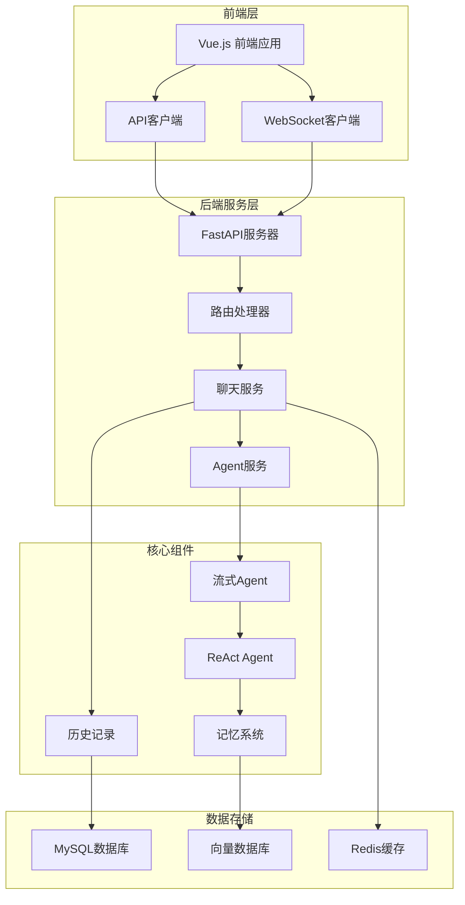
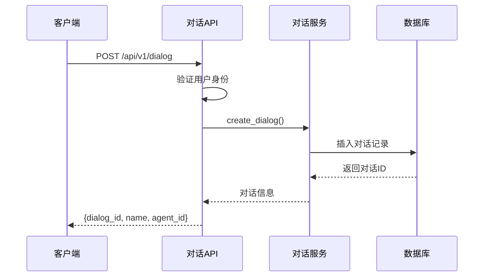
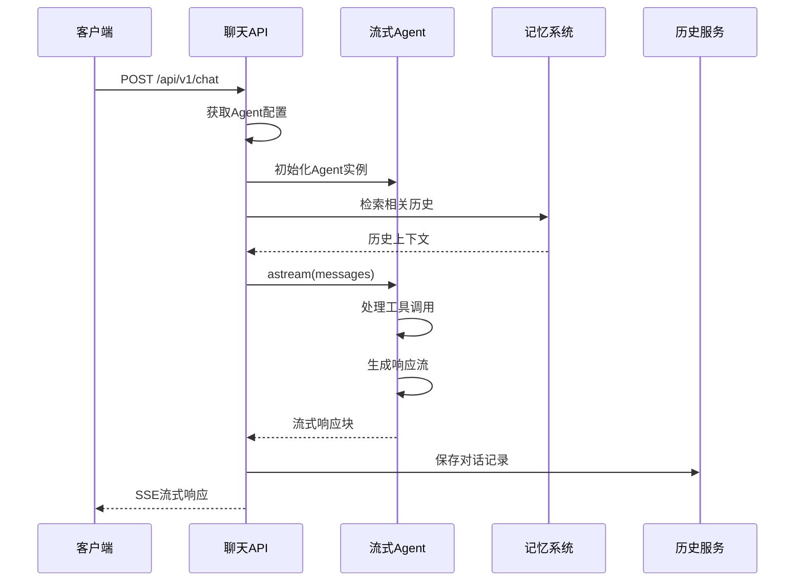
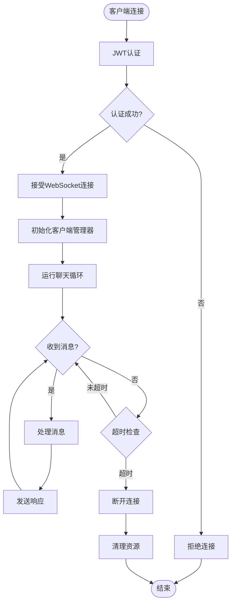
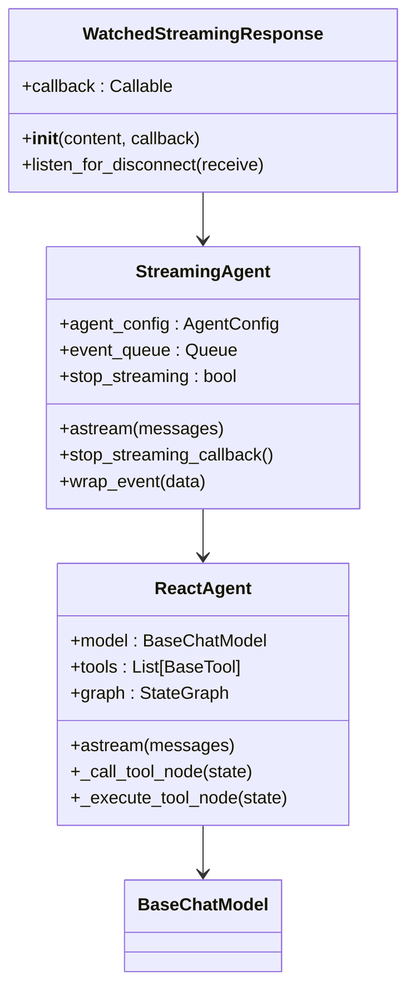
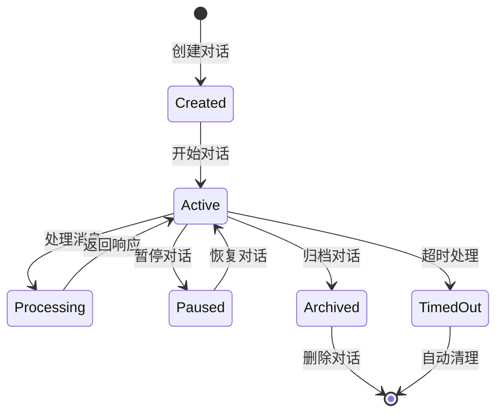
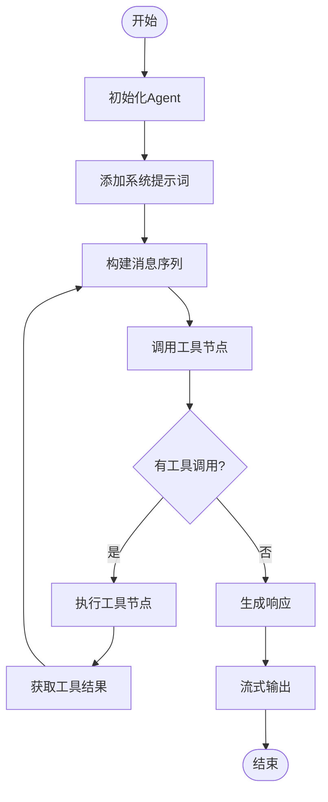
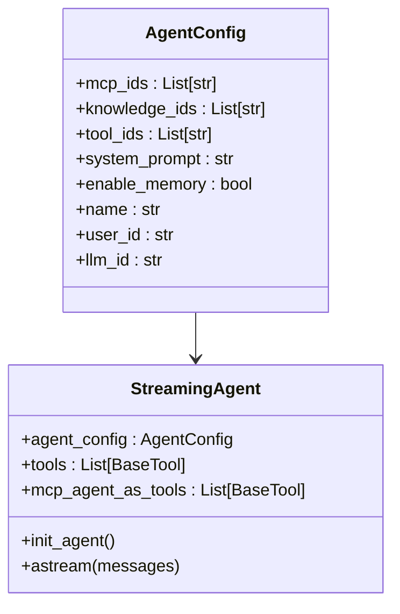
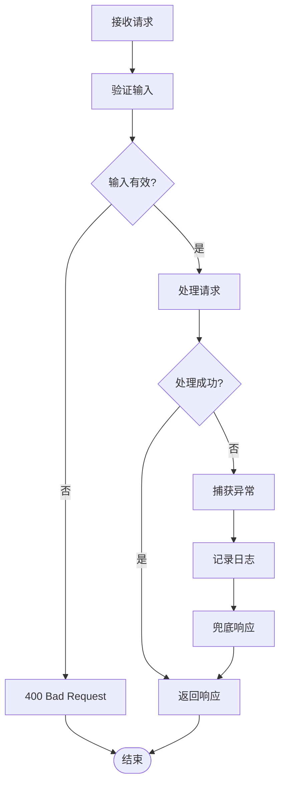

# 对话API技术文档

<cite>
**本文档引用的文件**
- [router.py](https://github.com/Shy2593666979/AgentChat/src/backend/agentchat/api/v1/router.py)
- [chat.py](https://github.com/Shy2593666979/AgentChat/src/backend/agentchat/api/v1/chat.py)
- [chat.py](https://github.com/Shy2593666979/AgentChat/src/backend/agentchat/api/services/chat.py)
- [chat.py](https://github.com/Shy2593666979/AgentChat/src/frontend/src/apis/chat.ts)
- [chatPage.vue](https://github.com/Shy2593666979/AgentChat/src/frontend/src/pages/conversation/chatPage/chatPage.vue)
- [dialog.py](https://github.com/Shy2593666979/AgentChat/src/backend/agentchat/api/v1/dialog.py)
- [dialog.py](https://github.com/Shy2593666979/AgentChat/src/backend/agentchat/api/services/dialog.py)
- [history.py](https://github.com/Shy2593666979/AgentChat/src/backend/agentchat/api/services/history.py)
- [react_agent.py](https://github.com/Shy2593666979/AgentChat/src/backend/agentchat/core/agents/react_agent.py)
- [build.py](https://github.com/Shy2593666979/AgentChat/src/backend/agentchat/services/autobuild/build.py)
- [manager.py](https://github.com/Shy2593666979/AgentChat/src/backend/agentchat/services/autobuild/manager.py)
</cite>

## 目录
1. [简介](#简介)
2. [项目架构概览](#项目架构概览)
3. [核心API端点](#核心api端点)
4. [WebSocket连接机制](#websocket连接机制)
5. [消息流式响应处理](#消息流式响应处理)
6. [对话管理](#对话管理)
7. [Agent执行流程](#agent执行流程)
8. [前端集成示例](#前端集成示例)
9. [错误处理与超时策略](#错误处理与超时策略)
10. [最佳实践](#最佳实践)

## 简介

AgentChat是一个基于FastAPI构建的实时对话交互平台，支持多种Agent类型和丰富的对话功能。本文档详细介绍了对话API的核心功能，包括发起新对话、发送消息、WebSocket连接建立以及消息流式响应处理等关键特性。

## 项目架构概览

系统采用前后端分离架构，后端基于FastAPI框架，前端使用Vue.js技术栈。



**图表来源**
- [router.py](https://github.com/Shy2593666979/AgentChat/src/backend/agentchat/api/v1/router.py#L1-L50)
- [chat.py](https://github.com/Shy2593666979/AgentChat/src/backend/agentchat/api/v1/chat.py#L1-L50)

## 核心API端点

### 发起新对话 (/api/v1/dialog)

创建新的对话会话，为用户分配唯一的对话ID。



**图表来源**
- [dialog.py](https://github.com/Shy2593666979/AgentChat/src/backend/agentchat/api/v1/dialog.py#L29-L37)
- [dialog.py](https://github.com/Shy2593666979/AgentChat/src/backend/agentchat/api/services/dialog.py#L12-L16)

**端点详情：**
- **路径**: `/api/v1/dialog`
- **方法**: `POST`
- **请求体**: 
  ```json
  {
    "name": "对话名称",
    "agent_id": "智能体ID",
    "agent_type": "Agent"
  }
  ```
- **响应**: 包含新创建对话的唯一标识符

**节来源**
- [dialog.py](https://github.com/Shy2593666979/AgentChat/src/backend/agentchat/api/v1/dialog.py#L29-L37)
- [dialog.py](https://github.com/Shy2593666979/AgentChat/src/backend/agentchat/api/services/dialog.py#L12-L16)

### 发送消息 (/api/v1/chat)

处理用户消息并返回流式响应。



**图表来源**
- [chat.py](https://github.com/Shy2593666979/AgentChat/src/backend/agentchat/api/v1/chat.py#L49-L121)
- [chat.py](https://github.com/Shy2593666979/AgentChat/src/backend/agentchat/api/services/chat.py#L229-L266)

**端点详情：**
- **路径**: `/api/v1/chat`
- **方法**: `POST`
- **请求体**: 
  ```json
  {
    "dialog_id": "对话ID",
    "user_input": "用户输入文本",
    "file_url": "文件URL（可选）"
  }
  ```

**节来源**
- [chat.py](https://github.com/Shy2593666979/AgentChat/src/backend/agentchat/api/v1/chat.py#L49-L121)
- [chat.py](https://github.com/Shy2593666979/AgentChat/src/frontend/src/apis/chat.ts#L16-L61)

## WebSocket连接机制

系统支持WebSocket连接，主要用于实时性要求更高的场景，如自动构建工具等。



**图表来源**
- [build.py](https://github.com/Shy2593666979/AgentChat/src/backend/agentchat/services/autobuild/build.py#L15-L40)
- [manager.py](https://github.com/Shy2593666979/AgentChat/src/backend/agentchat/services/autobuild/manager.py#L45-L67)

**WebSocket特性：**
- **认证**: 基于JWT的WebSocket认证
- **连接管理**: 自动化的连接生命周期管理
- **错误处理**: 完善的异常捕获和连接恢复机制

**节来源**
- [build.py](https://github.com/Shy2593666979/AgentChat/src/backend/agentchat/services/autobuild/build.py#L15-L40)
- [manager.py](https://github.com/Shy2593666979/AgentChat/src/backend/agentchat/services/autobuild/manager.py#L13-L67)

## 消息流式响应处理

系统采用Server-Sent Events (SSE) 实现流式响应，支持实时消息传输。



**图表来源**
- [chat.py](https://github.com/Shy2593666979/AgentChat/src/backend/agentchat/api/v1/chat.py#L25-L48)
- [chat.py](https://github.com/Shy2593666979/AgentChat/src/backend/agentchat/api/services/chat.py#L103-L267)
- [react_agent.py](https://github.com/Shy2593666979/AgentChat/src/backend/agentchat/core/agents/react_agent.py#L39-L279)

**流式响应格式：**
- **响应块**: `data: {"type": "response_chunk", "data": {"chunk": "文本片段"}}`
- **事件通知**: `data: {"type": "event", "data": {"title": "工具名称", "status": "START"}}`
- **错误处理**: 自动兜底机制，确保响应完整性

**节来源**
- [chat.py](https://github.com/Shy2593666979/AgentChat/src/backend/agentchat/api/v1/chat.py#L25-L48)
- [chat.py](https://github.com/Shy2593666979/AgentChat/src/backend/agentchat/api/services/chat.py#L229-L267)

## 对话管理

### 对话生命周期



### 对话历史管理

系统提供两种历史记录模式：
- **传统模式**: 基于数据库的历史记录查询
- **向量化模式**: 基于语义搜索的记忆检索

**历史记录特性：**
- **持久化**: 所有对话都保存到MySQL数据库
- **检索**: 支持基于相似度的上下文检索
- **清理**: 自动清理长时间未活动的对话

**节来源**
- [history.py](https://github.com/Shy2593666979/AgentChat/src/backend/agentchat/api/services/history.py#L17-L88)
- [dialog.py](https://github.com/Shy2593666979/AgentChat/src/backend/agentchat/api/services/dialog.py#L9-L64)

## Agent执行流程

### ReAct Agent工作流程



**图表来源**
- [react_agent.py](https://github.com/Shy2593666979/AgentChat/src/backend/agentchat/core/agents/react_agent.py#L82-L279)

### Agent配置结构



**图表来源**
- [chat.py](https://github.com/Shy2593666979/AgentChat/src/backend/agentchat/api/services/chat.py#L33-L42)
- [chat.py](https://github.com/Shy2593666979/AgentChat/src/backend/agentchat/api/services/chat.py#L103-L267)

**节来源**
- [react_agent.py](https://github.com/Shy2593666979/AgentChat/src/backend/agentchat/core/agents/react_agent.py#L39-L279)
- [chat.py](https://github.com/Shy2593666979/AgentChat/src/backend/agentchat/api/services/chat.py#L33-L42)

## 前端集成示例

### 使用fetchEventSource的集成

前端使用Microsoft提供的fetchEventSource库实现SSE连接：

```typescript
// 基本消息发送示例
function sendMessage(data: Chat, onmessage: any, onclose: any) {
  const ctrl = new AbortController();
  
  fetchEventSource('/api/v1/chat', {
    method: 'POST',
    headers: {
      'Content-Type': 'application/json',
      'Authorization': `Bearer ${localStorage.getItem('token') || ''}`
    },
    body: JSON.stringify({
      dialog_id: data.dialogId,
      user_input: data.userInput,
      file_url: data.fileUrl
    }),
    signal: ctrl.signal,
    openWhenHidden: true,
    onmessage(msg) {
      try {
        onmessage(msg);
      } catch (error) {
        console.error('处理消息时出错:', error);
      }
    },
    onclose() {
      onclose();
    },
    onerror(err) {
      console.error('聊天连接错误:', err);
      ctrl.abort();
      throw err;
    }
  });
  
  return ctrl;
}
```

### Vue.js组件集成

前端Vue组件展示了完整的对话界面实现：

**功能特性：**
- **实时消息流**: 支持增量消息显示
- **工具调用状态**: 实时显示工具执行状态
- **文件上传**: 支持附件消息
- **错误处理**: 完善的异常处理机制

**节来源**
- [chat.ts](https://github.com/Shy2593666979/AgentChat/src/frontend/src/apis/chat.ts#L16-L61)
- [chatPage.vue](https://github.com/Shy2593666979/AgentChat/src/frontend/src/pages/conversation/chatPage/chatPage.vue#L173-L200)

## 错误处理与超时策略

### 错误处理机制



### 超时与重试策略

- **连接超时**: WebSocket连接超时自动重连
- **处理超时**: Agent处理超时返回默认消息
- **内存清理**: 定期清理过期对话和缓存
- **降级处理**: 网络异常时的本地缓存回退

**节来源**
- [chat.py](https://github.com/Shy2593666979/AgentChat/src/backend/agentchat/api/v1/chat.py#L253-L262)
- [manager.py](https://github.com/Shy2593666979/AgentChat/src/backend/agentchat/services/autobuild/manager.py#L55-L67)

## 最佳实践

### API使用建议

1. **对话管理**
   - 始终使用有效的对话ID
   - 及时清理不需要的对话
   - 合理设置对话超时时间

2. **消息发送**
   - 控制单次消息长度
   - 处理文件上传的并发限制
   - 实现消息去重机制

3. **错误处理**
   - 实现优雅的降级策略
   - 提供清晰的错误信息
   - 记录详细的调试信息

4. **性能优化**
   - 使用连接池管理WebSocket连接
   - 实现消息缓冲和批处理
   - 合理使用缓存机制

### 安全考虑

- **身份验证**: 所有API请求都需要有效的JWT令牌
- **输入验证**: 严格验证用户输入内容
- **速率限制**: 实施API调用频率限制
- **数据保护**: 敏感数据加密存储

### 监控与维护

- **日志记录**: 完整的请求和响应日志
- **性能监控**: 关键指标的实时监控
- **健康检查**: 定期的服务健康状态检查
- **容量规划**: 基于使用情况的资源规划