# 工具API

<cite>
**本文档中引用的文件**
- [tool.py](https://github.com/Shy2593666979/AgentChat/src/backend/agentchat/api/v1/tool.py)
- [tool.py](https://github.com/Shy2593666979/AgentChat/src/backend/agentchat/api/services/tool.py)
- [tool.py](https://github.com/Shy2593666979/AgentChat/src/backend/agentchat/schema/tool.py)
- [tool.py](https://github.com/Shy2593666979/AgentChat/src/backend/agentchat/database/dao/tool.py)
- [tool.py](https://github.com/Shy2593666979/AgentChat/src/backend/agentchat/database/models/tool.py)
- [mcp_weather.py](https://github.com/Shy2593666979/AgentChat/src/backend/agentchat/mcp_servers/weather/mcp_weather.py)
- [action.py](https://github.com/Shy2593666979/AgentChat/src/backend/agentchat/tools/get_weather/action.py)
- [README.md](https://github.com/Shy2593666979/AgentChat/src/backend/agentchat/mcp_servers/README.md)
- [tool.ts](https://github.com/Shy2593666979/AgentChat/src/frontend/src/apis/tool.ts)
- [tool.vue](https://github.com/Shy2593666979/AgentChat/src/frontend/src/pages/tool/tool.vue)
- [__init__.py](https://github.com/Shy2593666979/AgentChat/src/backend/agentchat/tools/__init__.py)
- [tool.py](https://github.com/Shy2593666979/AgentChat/src/backend/agentchat/prompts/tool.py)
</cite>

## 目录
1. [简介](#简介)
2. [项目结构](#项目结构)
3. [核心组件](#核心组件)
4. [架构概览](#架构概览)
5. [详细组件分析](#详细组件分析)
6. [API端点文档](#api端点文档)
7. [工具元数据结构](#工具元数据结构)
8. [MCP协议集成](#mcp协议集成)
9. [工具函数编写规范](#工具函数编写规范)
10. [自定义工具扩展](#自定义工具扩展)
11. [故障排除指南](#故障排除指南)
12. [结论](#结论)

## 简介

AgentChat工具系统提供了一套完整的API接口，用于管理和配置Agent可用的工具集。该系统支持两种主要的工具类型：传统Python工具函数和基于Model Context Protocol (MCP) 的外部服务器工具。通过统一的API接口，开发者可以查询可用工具列表、创建自定义工具、配置工具参数，并将工具与Agent进行集成。

工具系统的核心设计理念是提供灵活的扩展机制，既支持内置的Python工具函数，也支持通过MCP协议集成外部服务。这种设计使得AgentChat能够无缝集成各种第三方服务，同时保持良好的可维护性和扩展性。

## 项目结构

工具系统的文件组织结构清晰地反映了其分层架构：

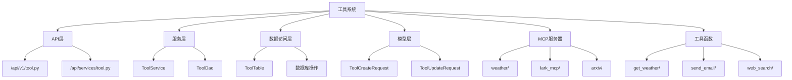

**图表来源**
- [tool.py](https://github.com/Shy2593666979/AgentChat/src/backend/agentchat/api/v1/tool.py#L1-L86)
- [tool.py](https://github.com/Shy2593666979/AgentChat/src/backend/agentchat/api/services/tool.py#L1-L124)
- [tool.py](https://github.com/Shy2593666979/AgentChat/src/backend/agentchat/database/dao/tool.py#L1-L104)

**章节来源**
- [tool.py](https://github.com/Shy2593666979/AgentChat/src/backend/agentchat/api/v1/tool.py#L1-L86)
- [tool.py](https://github.com/Shy2593666979/AgentChat/src/backend/agentchat/api/services/tool.py#L1-L124)

## 核心组件

工具系统由以下核心组件构成：

### API路由器
负责处理HTTP请求和响应，提供RESTful接口。

### 工具服务层
包含业务逻辑处理，提供工具的增删改查功能。

### 数据访问对象
封装数据库操作，提供数据持久化能力。

### 工具模型
定义工具的数据结构和验证规则。

### MCP服务器
支持外部服务集成，实现Model Context Protocol协议。

**章节来源**
- [tool.py](https://github.com/Shy2593666979/AgentChat/src/backend/agentchat/api/v1/tool.py#L10-L86)
- [tool.py](https://github.com/Shy2593666979/AgentChat/src/backend/agentchat/api/services/tool.py#L9-L124)
- [tool.py](https://github.com/Shy2593666979/AgentChat/src/backend/agentchat/database/dao/tool.py#L9-L104)

## 架构概览

工具系统采用分层架构设计，确保了良好的可维护性和扩展性：

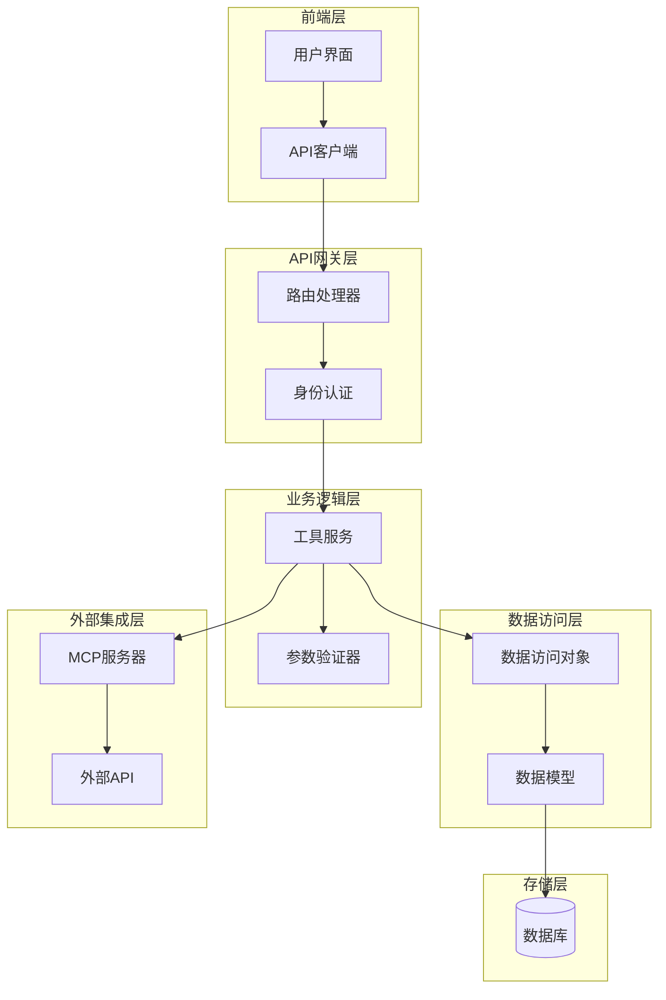

**图表来源**
- [tool.py](https://github.com/Shy2593666979/AgentChat/src/backend/agentchat/api/v1/tool.py#L10-L86)
- [tool.py](https://github.com/Shy2593666979/AgentChat/src/backend/agentchat/api/services/tool.py#L9-L124)
- [tool.py](https://github.com/Shy2593666979/AgentChat/src/backend/agentchat/database/dao/tool.py#L9-L104)

## 详细组件分析

### 工具API端点

工具系统提供了完整的RESTful API接口，支持工具的全生命周期管理：

#### GET /api/v1/tool/all
获取所有可用工具的列表。

#### POST /api/v1/tool/create
创建新的自定义工具。

#### POST /api/v1/tool/own
获取当前用户创建的个人工具。

#### POST /api/v1/tool/visible
获取当前用户可见的所有工具。

#### PUT /api/v1/tool/update
更新现有工具的配置信息。

#### DELETE /api/v1/tool/delete
删除指定的工具。

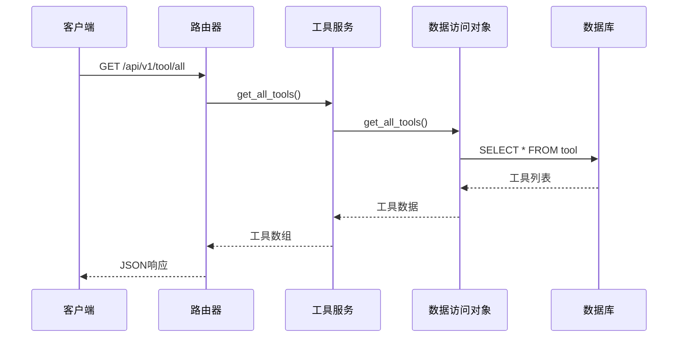

**图表来源**
- [tool.py](https://github.com/Shy2593666979/AgentChat/src/backend/agentchat/api/v1/tool.py#L27-L34)
- [tool.py](https://github.com/Shy2593666979/AgentChat/src/backend/agentchat/api/services/tool.py#L60-L65)
- [tool.py](https://github.com/Shy2593666979/AgentChat/src/backend/agentchat/database/dao/tool.py#L68-L72)

**章节来源**
- [tool.py](https://github.com/Shy2593666979/AgentChat/src/backend/agentchat/api/v1/tool.py#L27-L34)
- [tool.py](https://github.com/Shy2593666979/AgentChat/src/backend/agentchat/api/services/tool.py#L60-L65)

### 工具数据模型

工具系统使用SQLModel框架定义数据模型，确保数据的一致性和完整性：

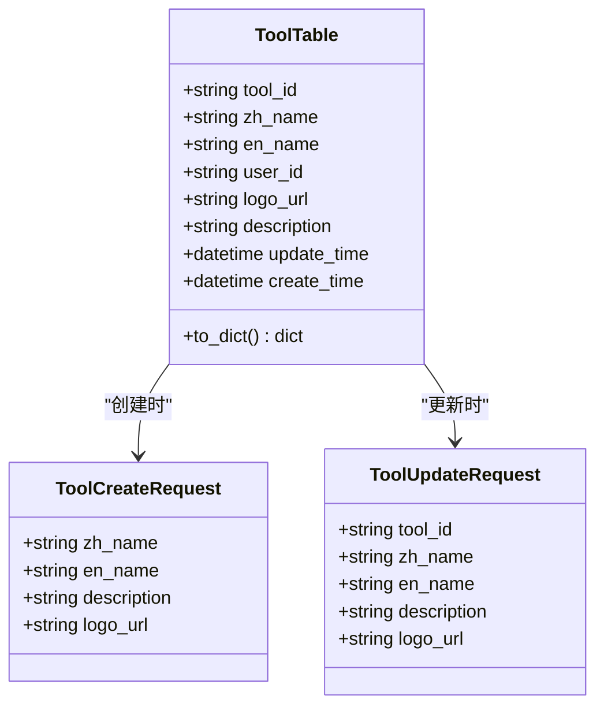

**图表来源**
- [tool.py](https://github.com/Shy2593666979/AgentChat/src/backend/agentchat/database/models/tool.py#L12-L36)
- [tool.py](https://github.com/Shy2593666979/AgentChat/src/backend/agentchat/schema/tool.py#L5-L16)

**章节来源**
- [tool.py](https://github.com/Shy2593666979/AgentChat/src/backend/agentchat/database/models/tool.py#L12-L36)
- [tool.py](https://github.com/Shy2593666979/AgentChat/src/backend/agentchat/schema/tool.py#L5-L16)

## API端点文档

### 查询所有工具

**端点**: `GET /api/v1/tool/all`

**功能**: 获取系统中所有可用工具的完整列表。

**请求参数**: 无

**响应格式**:
```json
{
  "status_code": 200,
  "status_message": "success",
  "data": [
    {
      "tool_id": "uuid",
      "zh_name": "天气查询",
      "en_name": "get_weather",
      "user_id": "0",
      "description": "查询指定城市的天气情况",
      "logo_url": "https://example.com/logo.png"
    }
  ]
}
```

**状态码**:
- `200`: 成功获取工具列表
- `500`: 服务器内部错误

### 创建自定义工具

**端点**: `POST /api/v1/tool/create`

**功能**: 创建新的自定义工具，供用户专用。

**请求体**:
```json
{
  "zh_name": "中文名称",
  "en_name": "english_name",
  "description": "工具描述",
  "logo_url": "https://example.com/logo.png"
}
```

**响应格式**:
```json
{
  "status_code": 200,
  "status_message": "success",
  "data": {
    "tool_id": "uuid"
  }
}
```

### 获取个人工具

**端点**: `POST /api/v1/tool/own`

**功能**: 获取当前登录用户创建的所有个人工具。

**响应格式**:
```json
{
  "status_code": 200,
  "status_message": "success",
  "data": [
    {
      "tool_id": "uuid",
      "zh_name": "个人工具",
      "en_name": "personal_tool",
      "user_id": "user_uuid",
      "description": "个人专用工具",
      "logo_url": "https://example.com/logo.png"
    }
  ]
}
```

### 获取可见工具

**端点**: `POST /api/v1/tool/visible`

**功能**: 获取当前用户可见的所有工具，包括系统工具和个人工具。

**响应格式**:
```json
{
  "status_code": 200,
  "status_message": "success",
  "data": [...]
}
```

### 更新工具配置

**端点**: `PUT /api/v1/tool/update`

**功能**: 更新现有工具的配置信息。

**请求体**:
```json
{
  "tool_id": "uuid",
  "zh_name": "新中文名称",
  "en_name": "new_english_name",
  "description": "新描述",
  "logo_url": "https://example.com/new_logo.png"
}
```

### 删除工具

**端点**: `DELETE /api/v1/tool/delete`

**功能**: 删除指定的工具，仅限工具创建者或管理员操作。

**请求参数**:
```json
{
  "tool_id": "uuid"
}
```

**章节来源**
- [tool.py](https://github.com/Shy2593666979/AgentChat/src/backend/agentchat/api/v1/tool.py#L27-L86)
- [tool.ts](https://github.com/Shy2593666979/AgentChat/src/frontend/src/apis/tool.ts#L1-L79)

## 工具元数据结构

工具系统定义了详细的元数据结构，用于描述工具的特性和行为：

### 基础元数据字段

| 字段名 | 类型 | 描述 | 必填 |
|--------|------|------|------|
| tool_id | string | 工具唯一标识符 | 是 |
| zh_name | string | 工具中文名称，显示给用户 | 是 |
| en_name | string | 工具英文名称，大模型调用 | 是 |
| user_id | string | 工具对应的创建用户ID | 是 |
| logo_url | string | 工具对应的Logo地址 | 是 |
| description | string | 大模型将根据此描述识别并调用该工具 | 是 |
| create_time | datetime | 创建时间 | 否 |
| update_time | datetime | 修改时间 | 否 |

### 输入参数Schema

工具系统支持复杂的输入参数Schema定义，用于描述工具的输入要求：

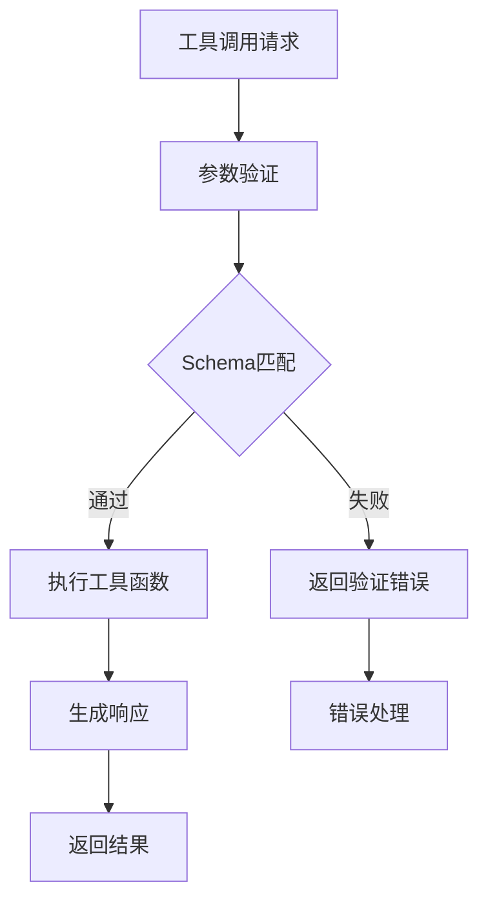

**图表来源**
- [tool.py](https://github.com/Shy2593666979/AgentChat/src/backend/agentchat/schema/tool.py#L5-L16)

**章节来源**
- [tool.py](https://github.com/Shy2593666979/AgentChat/src/backend/agentchat/database/models/tool.py#L12-L36)
- [tool.py](https://github.com/Shy2593666979/AgentChat/src/backend/agentchat/schema/tool.py#L5-L16)

## MCP协议集成

AgentChat工具系统深度集成了Model Context Protocol (MCP)，实现了与外部服务的无缝连接：

### MCP架构设计

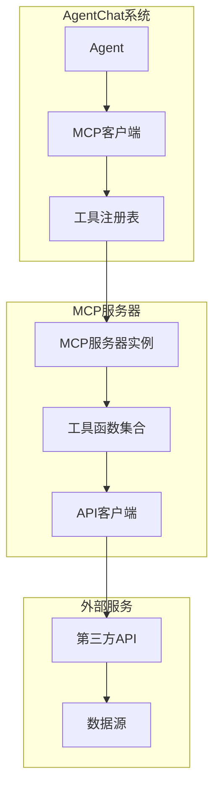

**图表来源**
- [mcp_weather.py](https://github.com/Shy2593666979/AgentChat/src/backend/agentchat/mcp_servers/weather/mcp_weather.py#L1-L63)
- [README.md](https://github.com/Shy2593666979/AgentChat/src/backend/agentchat/mcp_servers/README.md#L1-L136)

### MCP工具实现示例

以天气查询工具为例，展示MCP协议的实现方式：

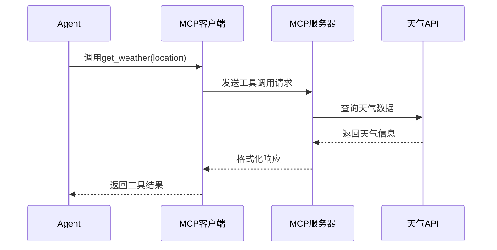

**图表来源**
- [mcp_weather.py](https://github.com/Shy2593666979/AgentChat/src/backend/agentchat/mcp_servers/weather/mcp_weather.py#L15-L48)

### MCP服务器类型

系统支持多种MCP传输协议：

| 协议类型 | 描述 | 使用场景 |
|----------|------|----------|
| stdio | 标准输入输出模式 | 简单的命令行工具集成 |
| websocket | WebSocket连接 | 实时双向通信 |
| streamable-http | HTTP流模式 | 异步数据传输 |

**章节来源**
- [mcp_weather.py](https://github.com/Shy2593666979/AgentChat/src/backend/agentchat/mcp_servers/weather/mcp_weather.py#L1-L63)
- [README.md](https://github.com/Shy2593666979/AgentChat/src/backend/agentchat/mcp_servers/README.md#L1-L136)

## 工具函数编写规范

AgentChat提供了标准化的工具函数编写规范，确保工具的一致性和可维护性：

### 工具函数模板

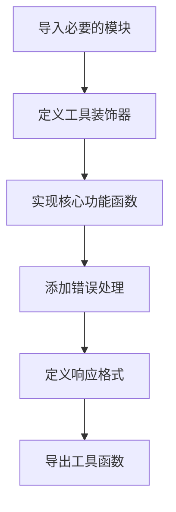

**图表来源**
- [action.py](https://github.com/Shy2593666979/AgentChat/src/backend/agentchat/tools/get_weather/action.py#L1-L54)

### 工具函数特征

1. **装饰器使用**: 使用`@tool(parse_docstring=True)`装饰器
2. **参数类型注解**: 明确的参数类型定义
3. **文档字符串**: 详细的函数说明和参数描述
4. **错误处理**: 完善的异常处理机制
5. **响应格式**: 标准化的返回值格式

### 工具函数示例

天气查询工具展示了完整的工具函数实现：

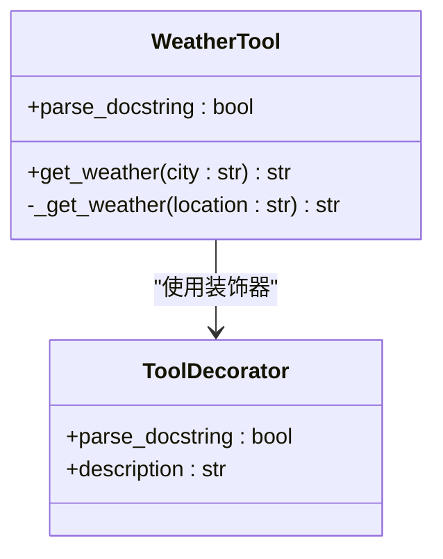

**图表来源**
- [action.py](https://github.com/Shy2593666979/AgentChat/src/backend/agentchat/tools/get_weather/action.py#L9-L54)

**章节来源**
- [action.py](https://github.com/Shy2593666979/AgentChat/src/backend/agentchat/tools/get_weather/action.py#L1-L54)
- [__init__.py](https://github.com/Shy2593666979/AgentChat/src/backend/agentchat/tools/__init__.py#L1-L48)

## 自定义工具扩展

### 内置工具扩展

系统提供了丰富的内置工具，涵盖了常见的业务场景：

| 工具类别 | 工具名称 | 功能描述 |
|----------|----------|----------|
| 信息查询 | get_weather | 查询指定城市的天气情况 |
| 搜索工具 | tavily_search | 基于Tavily的网页搜索 |
| 搜索工具 | google_search | Google搜索引擎集成 |
| 文档处理 | convert_to_pdf | 文档格式转换 |
| 文档处理 | convert_to_docx | Word文档处理 |
| 图像处理 | text_to_image | 文本转图像生成 |
| 图像处理 | image_to_text | 图像内容识别 |
| 邮件服务 | send_email | 邮件发送功能 |
| 物流查询 | get_delivery_info | 物流信息追踪 |

### 自定义工具开发流程

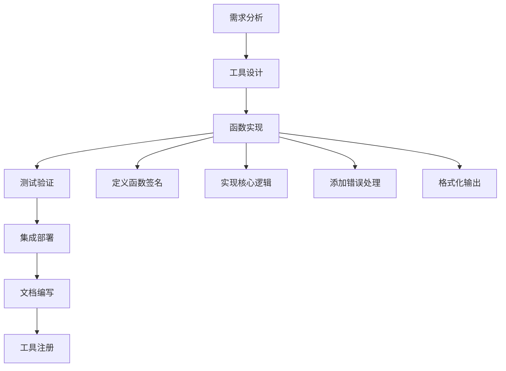

### 工具注册机制

系统通过模块导入自动发现和注册工具：

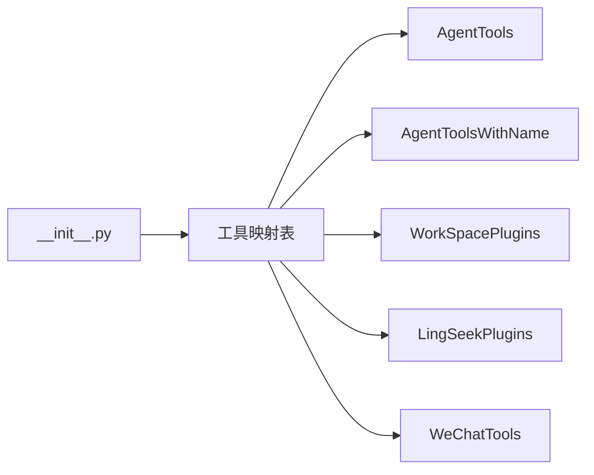

**图表来源**
- [__init__.py](https://github.com/Shy2593666979/AgentChat/src/backend/agentchat/tools/__init__.py#L1-L48)

**章节来源**
- [__init__.py](https://github.com/Shy2593666979/AgentChat/src/backend/agentchat/tools/__init__.py#L1-L48)

## 故障排除指南

### 常见问题及解决方案

#### 工具调用失败

**问题**: 工具调用返回错误或超时

**排查步骤**:
1. 检查工具函数的参数格式是否正确
2. 验证外部API的可用性和认证信息
3. 查看服务器日志获取详细错误信息
4. 确认网络连接和防火墙设置

#### MCP服务器连接问题

**问题**: 无法连接到MCP服务器

**排查步骤**:
1. 验证MCP服务器是否正常启动
2. 检查端口配置和网络可达性
3. 确认传输协议设置正确
4. 查看MCP服务器的日志输出

#### 权限验证失败

**问题**: 用户无法访问某些工具

**排查步骤**:
1. 检查用户的权限级别
2. 验证工具的创建者信息
3. 确认工具的可见性设置
4. 检查用户认证状态

### 性能优化建议

1. **缓存机制**: 对频繁调用的工具结果进行缓存
2. **异步处理**: 使用异步方式处理耗时的工具调用
3. **批量操作**: 尽可能使用批量API减少网络开销
4. **资源监控**: 监控工具的资源使用情况

**章节来源**
- [tool.py](https://github.com/Shy2593666979/AgentChat/src/backend/agentchat/api/services/tool.py#L26-L32)
- [tool.py](https://github.com/Shy2593666979/AgentChat/src/backend/agentchat/database/dao/tool.py#L29-L34)

## 结论

AgentChat工具系统提供了一个完整、灵活且可扩展的工具管理平台。通过统一的API接口，开发者可以轻松地查询、创建、配置和管理各种类型的工具。系统支持传统的Python工具函数和基于MCP协议的外部服务集成，为构建智能Agent提供了强大的基础设施。

工具系统的设计充分考虑了可维护性、可扩展性和易用性，通过清晰的分层架构和标准化的开发规范，确保了系统的稳定性和可靠性。无论是内置工具还是自定义扩展，都能通过统一的接口进行管理，大大简化了Agent的功能扩展过程。

随着AI技术的不断发展，工具系统将继续演进，支持更多的集成方式和更丰富的功能特性，为构建更加智能和实用的AI应用提供坚实的基础。