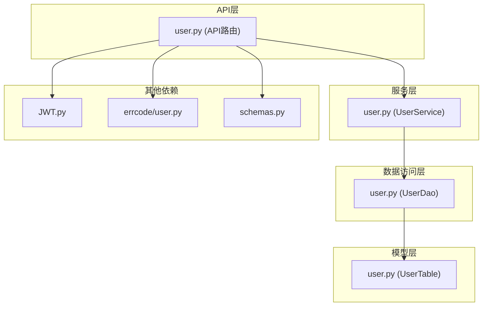
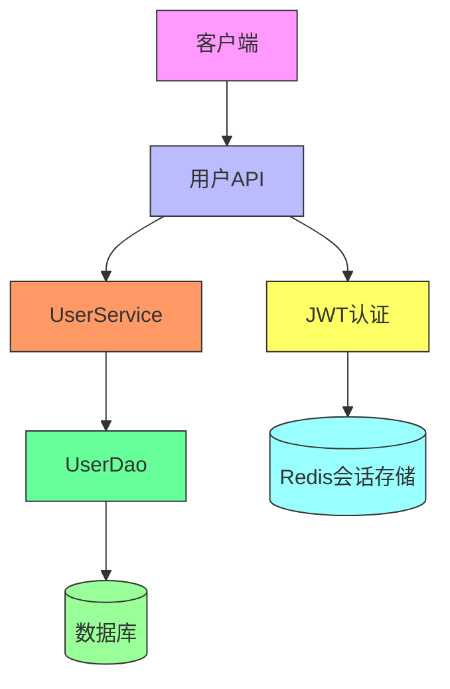
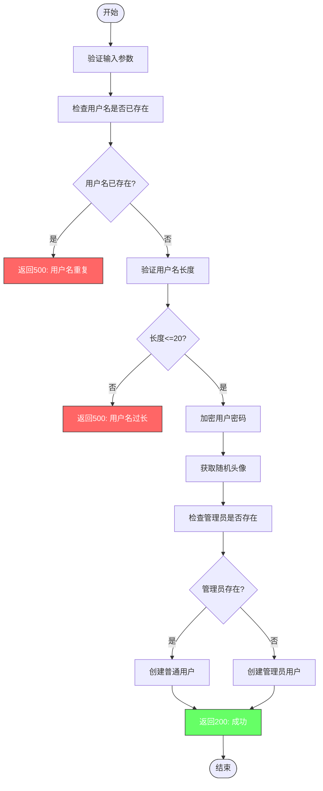
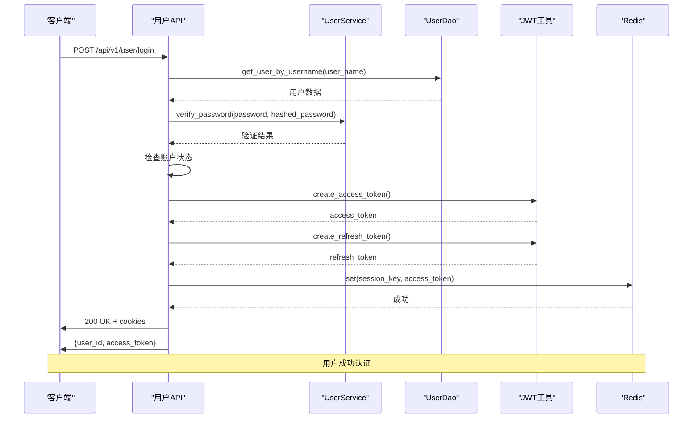
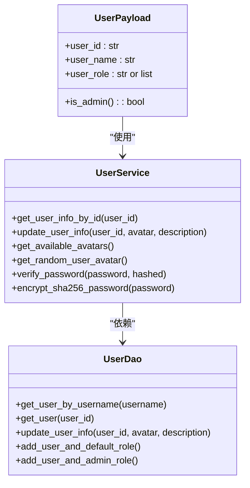
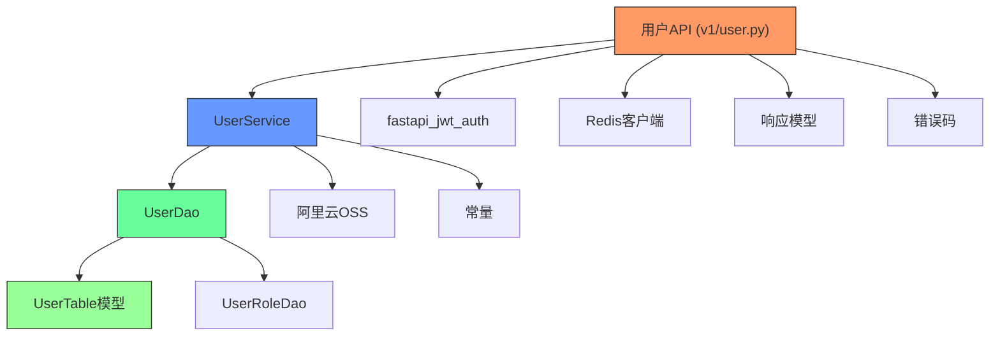
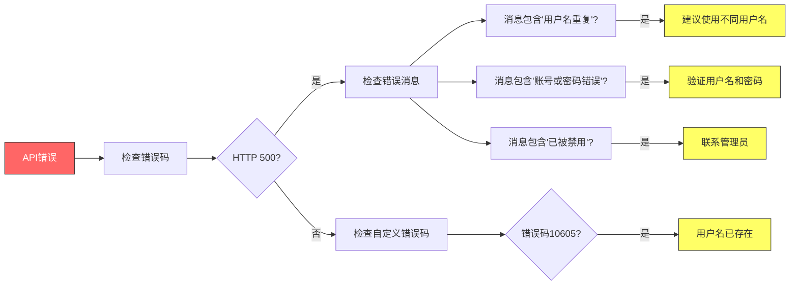

# 用户API

<cite>
**本文档中引用的文件**  
- [user.py](https://github.com/Shy2593666979/AgentChat/src/backend/agentchat/api/v1/user.py)
- [user.py](https://github.com/Shy2593666979/AgentChat/src/backend/agentchat/api/services/user.py)
- [user.py](https://github.com/Shy2593666979/AgentChat/src/backend/agentchat/api/errcode/user.py)
- [schemas.py](https://github.com/Shy2593666979/AgentChat/src/backend/agentchat/schema/schemas.py)
- [JWT.py](https://github.com/Shy2593666979/AgentChat/src/backend/agentchat/utils/JWT.py)
- [router.py](https://github.com/Shy2593666979/AgentChat/src/backend/agentchat/api/router.py)
- [user.py](https://github.com/Shy2593666979/AgentChat/src/backend/agentchat/database/dao/user.py)
- [user.py](https://github.com/Shy2593666979/AgentChat/src/backend/agentchat/database/models/user.py)
</cite>

## 目录
1. [简介](#简介)
2. [项目结构](#项目结构)
3. [核心组件](#核心组件)
4. [架构概述](#架构概述)
5. [详细组件分析](#详细组件分析)
6. [依赖分析](#依赖分析)
7. [性能考虑](#性能考虑)
8. [故障排除指南](#故障排除指南)
9. [结论](#结论)

## 简介
本文档详细描述了AgentChat系统的用户管理API，涵盖用户注册、登录、JWT令牌获取与刷新、用户信息获取与更新等端点。文档明确了每个端点的HTTP方法、URL路径、请求头要求、请求体结构和响应格式。同时详细说明了JWT认证流程，包括token过期处理和refresh token机制，并提供了curl示例展示实际调用过程。

## 项目结构
用户管理API位于`src/backend/agentchat/api/v1/`目录下，主要由`user.py`文件实现。该API依赖于服务层、数据库访问对象（DAO）、错误码定义和数据模型等多个模块。

**图示来源**  
- [user.py](https://github.com/Shy2593666979/AgentChat/src/backend/agentchat/api/v1/user.py)
- [user.py](https://github.com/Shy2593666979/AgentChat/src/backend/agentchat/api/services/user.py)
- [user.py](https://github.com/Shy2593666979/AgentChat/src/backend/agentchat/database/dao/user.py)
- [user.py](https://github.com/Shy2593666979/AgentChat/src/backend/agentchat/database/models/user.py)
- [JWT.py](https://github.com/Shy2593666979/AgentChat/src/backend/agentchat/utils/JWT.py)

**本节来源**  
- [user.py](https://github.com/Shy2593666979/AgentChat/src/backend/agentchat/api/v1/user.py)
- [router.py](https://github.com/Shy2593666979/AgentChat/src/backend/agentchat/api/router.py)

## 核心组件
用户管理API的核心组件包括用户注册、登录、信息更新和获取等功能。API使用JWT进行身份验证，并通过Redis存储会话信息。密码使用SHA-256算法加密存储，确保用户信息安全。

**本节来源**  
- [user.py](https://github.com/Shy2593666979/AgentChat/src/backend/agentchat/api/v1/user.py)
- [user.py](https://github.com/Shy2593666979/AgentChat/src/backend/agentchat/api/services/user.py)

## 架构概述
用户API采用分层架构设计，包括API路由层、服务层、数据访问层和模型层。API层处理HTTP请求和响应，服务层包含业务逻辑，DAO层负责数据库操作，模型层定义数据结构。

**图示来源**  
- [user.py](https://github.com/Shy2593666979/AgentChat/src/backend/agentchat/api/v1/user.py)
- [user.py](https://github.com/Shy2593666979/AgentChat/src/backend/agentchat/api/services/user.py)
- [user.py](https://github.com/Shy2593666979/AgentChat/src/backend/agentchat/database/dao/user.py)

## 详细组件分析

### 用户注册分析
用户注册端点处理新用户创建请求，验证用户名唯一性，并将用户信息存储到数据库。

**图示来源**  
- [user.py](https://github.com/Shy2593666979/AgentChat/src/backend/agentchat/api/v1/user.py#L21-L48)
- [user.py](https://github.com/Shy2593666979/AgentChat/src/backend/agentchat/api/services/user.py#L44-L60)

### 用户登录分析
用户登录端点验证用户凭据，生成JWT令牌，并设置相应的cookie。

**图示来源**  
- [user.py](https://github.com/Shy2593666979/AgentChat/src/backend/agentchat/api/v1/user.py#L51-L78)
- [user.py](https://github.com/Shy2593666979/AgentChat/src/backend/agentchat/api/services/user.py#L146-L157)
- [JWT.py](https://github.com/Shy2593666979/AgentChat/src/backend/agentchat/utils/JWT.py)

### 用户信息管理分析
用户信息管理功能允许更新和获取用户信息，包括头像和描述。

**图示来源**  
- [user.py](https://github.com/Shy2593666979/AgentChat/src/backend/agentchat/api/services/user.py)
- [user.py](https://github.com/Shy2593666979/AgentChat/src/backend/agentchat/database/dao/user.py)

## 依赖分析
用户API依赖于多个内部和外部组件，形成了清晰的依赖关系链。

**图示来源**  
- [user.py](https://github.com/Shy2593666979/AgentChat/src/backend/agentchat/api/v1/user.py)
- [user.py](https://github.com/Shy2593666979/AgentChat/src/backend/agentchat/api/services/user.py)
- [user.py](https://github.com/Shy2593666979/AgentChat/src/backend/agentchat/database/dao/user.py)

## 性能考虑
用户API在设计时考虑了性能因素，包括使用Redis缓存会话信息、批量获取头像资源和高效的数据库查询。JWT令牌的有效期设置为24小时（86400秒），平衡了安全性和用户体验。

**本节来源**  
- [JWT.py](https://github.com/Shy2593666979/AgentChat/src/backend/agentchat/utils/JWT.py)
- [user.py](https://github.com/Shy2593666979/AgentChat/src/backend/agentchat/api/v1/user.py)

## 故障排除指南
以下是用户API常见问题及解决方案：

| 错误码 | 错误信息 | 原因 | 解决方案 |
|--------|--------|------|----------|
| 500 | 用户名重复 | 用户名已存在于系统中 | 使用不同的用户名注册 |
| 500 | 账号或密码错误 | 用户名或密码不正确 | 检查输入的凭据是否正确 |
| 500 | 该账号已被禁用 | 用户账户被管理员禁用 | 联系管理员恢复账户 |
| 500 | 用户名长度不应该超过20 | 用户名过长 | 使用20个字符以内的用户名 |
| 10605 | 用户名已存在 | 用户名已存在（错误码） | 选择其他用户名 |

**本节来源**  
- [user.py](https://github.com/Shy2593666979/AgentChat/src/backend/agentchat/api/errcode/user.py)
- [user.py](https://github.com/Shy2593666979/AgentChat/src/backend/agentchat/api/v1/user.py)

## 结论
AgentChat的用户管理API提供了完整的用户生命周期管理功能，包括注册、登录、信息更新和安全认证。系统采用JWT进行身份验证，通过Redis管理会话，并实现了完善的错误处理机制。API设计遵循RESTful原则，具有良好的可扩展性和安全性。