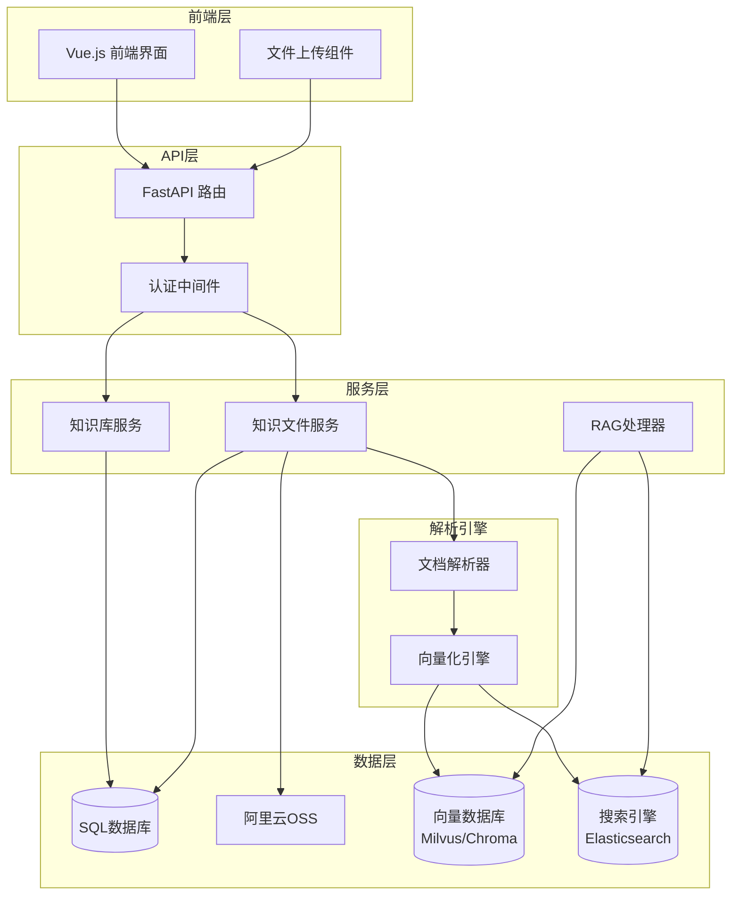
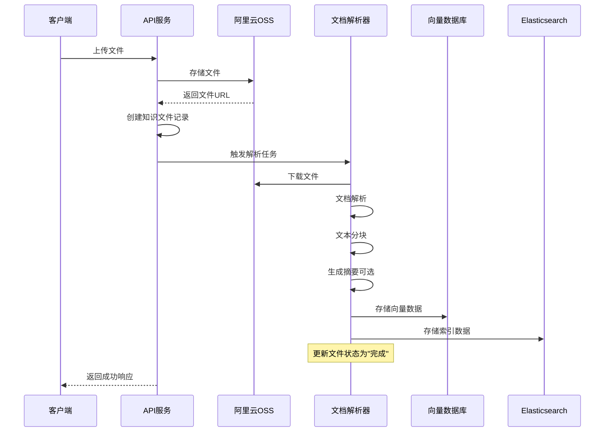
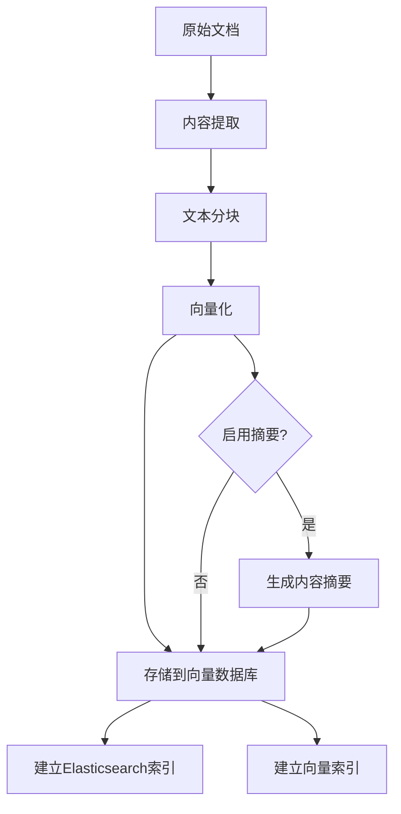
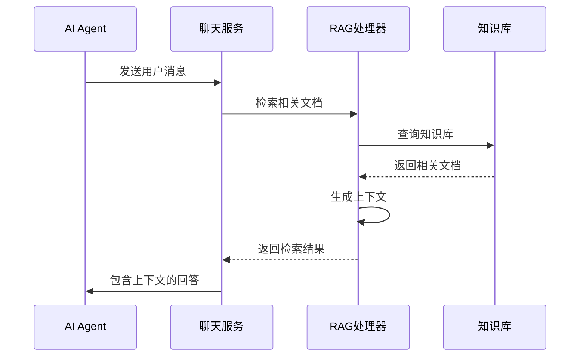

# 知识库API参考文档

<cite>
**本文档引用的文件**
- [knowledge.py](https://github.com/Shy2593666979/AgentChat/src/backend/agentchat/api/services/knowledge.py)
- [knowledge_file.py](https://github.com/Shy2593666979/AgentChat/src/backend/agentchat/api/services/knowledge_file.py)
- [knowledge.py](https://github.com/Shy2593666979/AgentChat/src/backend/agentchat/api/v1/knowledge.py)
- [knowledge_file.py](https://github.com/Shy2593666979/AgentChat/src/backend/agentchat/api/v1/knowledge_file.py)
- [upload.py](https://github.com/Shy2593666979/AgentChat/src/backend/agentchat/api/v1/upload.py)
- [router.py](https://github.com/Shy2593666979/AgentChat/src/backend/agentchat/api/router.py)
- [knowledge.py](https://github.com/Shy2593666979/AgentChat/src/frontend/src/apis/knowledge.ts)
- [knowledge-file.ts](https://github.com/Shy2593666979/AgentChat/src/frontend/src/apis/knowledge-file.ts)
- [parser.py](https://github.com/Shy2593666979/AgentChat/src/backend/agentchat/services/rag/parser.py)
- [rag_handler.py](https://github.com/Shy2593666979/AgentChat/src/backend/agentchat/services/rag_handler.py)
- [knowledge.py](https://github.com/Shy2593666979/AgentChat/src/backend/agentchat/database/models/knowledge.py)
- [knowledge_file.py](https://github.com/Shy2593666979/AgentChat/src/backend/agentchat/database/models/knowledge_file.py)
</cite>

## 目录
1. [简介](#简介)
2. [项目架构概览](#项目架构概览)
3. [知识库API](#知识库api)
4. [知识文件API](#知识文件api)
5. [文件上传处理流程](#文件上传处理流程)
6. [向量化和存储](#向量化和存储)
7. [Agent知识库关联](#agent知识库关联)
8. [错误处理和状态管理](#错误处理和状态管理)
9. [前端集成指南](#前端集成指南)
10. [最佳实践](#最佳实践)

## 简介

AgentChat的知识库系统提供了完整的RAG（检索增强生成）解决方案，支持知识库和知识文件的管理。系统采用现代化的架构设计，集成了多种文档解析器、向量化引擎和多模态检索能力，为AI Agent提供强大的知识支撑。

### 核心特性
- **多格式文档支持**：PDF、DOCX、PPTX、TXT、Markdown、图片等
- **智能文档解析**：自动提取文本内容并进行结构化处理
- **向量化存储**：支持Chroma和Milvus向量数据库
- **全文检索**：结合Elasticsearch实现关键词搜索
- **实时状态监控**：文件上传和解析进度跟踪
- **权限控制**：基于用户的细粒度访问控制

## 项目架构概览



**图表来源**
- [router.py](https://github.com/Shy2593666979/AgentChat/src/backend/agentchat/api/router.py#L1-L28)
- [knowledge.py](https://github.com/Shy2593666979/AgentChat/src/backend/agentchat/api/services/knowledge.py#L1-L84)
- [knowledge_file.py](https://github.com/Shy2593666979/AgentChat/src/backend/agentchat/api/services/knowledge_file.py#L1-L64)

## 知识库API

### 创建知识库

**端点**: `POST /api/v1/knowledge/create`

创建新的知识库实例，用于组织和管理相关文档。

#### 请求参数
| 参数名 | 类型 | 必需 | 描述 | 长度限制 |
|--------|------|------|------|----------|
| knowledge_name | string | 是 | 知识库名称 | 2-10字符 |
| knowledge_desc | string | 否 | 知识库描述 | 10-200字符 |

#### 响应格式
```json
{
  "status_code": 200,
  "status_message": "操作成功",
  "data": null
}
```

#### 错误码
- `400`: 参数验证失败
- `500`: 数据库操作异常

**章节来源**
- [knowledge.py](https://github.com/Shy2593666979/AgentChat/src/backend/agentchat/api/v1/knowledge.py#L14-L23)
- [knowledge.py](https://github.com/Shy2593666979/AgentChat/src/frontend/src/apis/knowledge.ts#L56-L61)

### 列出知识库

**端点**: `GET /api/v1/knowledge/select`

获取当前用户的所有知识库列表，包括每个知识库的文件统计信息。

#### 响应格式
```json
{
  "status_code": 200,
  "status_message": "操作成功",
  "data": [
    {
      "id": "k_1234567890abcdef",
      "name": "产品文档",
      "description": "公司产品相关文档",
      "user_id": "user_001",
      "create_time": "2024-01-15T10:30:00Z",
      "update_time": "2024-01-15T14:45:00Z",
      "count": 15,
      "file_size": "2.3GB"
    }
  ]
}
```

#### 响应字段说明
| 字段名 | 类型 | 描述 |
|--------|------|------|
| id | string | 知识库唯一标识符 |
| name | string | 知识库名称 |
| description | string | 知识库描述 |
| count | integer | 包含的文件数量 |
| file_size | string | 总文件大小（已格式化） |

**章节来源**
- [knowledge.py](https://github.com/Shy2593666979/AgentChat/src/backend/agentchat/api/v1/knowledge.py#L26-L33)
- [knowledge.py](https://github.com/Shy2593666979/AgentChat/src/frontend/src/apis/knowledge.ts#L48-L52)

### 更新知识库

**端点**: `PUT /api/v1/knowledge/update`

更新现有知识库的基本信息。

#### 请求参数
| 参数名 | 类型 | 必需 | 描述 |
|--------|------|------|------|
| knowledge_id | string | 是 | 知识库ID |
| knowledge_name | string | 否 | 新的名称 |
| knowledge_desc | string | 否 | 新的描述 |

#### 权限验证
系统会验证当前用户是否有权限修改指定的知识库。

**章节来源**
- [knowledge.py](https://github.com/Shy2593666979/AgentChat/src/backend/agentchat/api/v1/knowledge.py#L36-L49)

### 删除知识库

**端点**: `DELETE /api/v1/knowledge/delete`

删除指定的知识库及其所有关联的文件。

#### 请求参数
| 参数名 | 类型 | 必需 | 描述 |
|--------|------|------|------|
| knowledge_id | string | 是 | 知识库ID |

#### 删除影响
- 删除知识库记录
- 清理所有关联的文件记录
- 从向量数据库中移除对应文档
- 从Elasticsearch中删除索引

**章节来源**
- [knowledge.py](https://github.com/Shy2593666979/AgentChat/src/backend/agentchat/api/v1/knowledge.py#L52-L63)

### 知识库检索

**端点**: `POST /api/v1/knowledge/retrieval`

基于用户问题从知识库中检索相关信息。

#### 请求参数
| 参数名 | 类型 | 必需 | 描述 |
|--------|------|------|------|
| query | string | 是 | 用户问题 |
| knowledge_id | string/array | 是 | 知识库ID或ID数组 |

#### 检索流程
1. 查询重写：生成多个相关查询变体
2. 多模态检索：同时从向量数据库和搜索引擎检索
3. 结果合并：去重并按相关性排序
4. 重排序：使用交叉编码器优化排序
5. 结果过滤：应用分数阈值和数量限制

#### 响应格式
```json
{
  "status_code": 200,
  "status_message": "操作成功",
  "data": "检索到的相关文档内容...\n\n这些内容来自知识库中的多个文档片段..."
}
```

**章节来源**
- [knowledge.py](https://github.com/Shy2593666979/AgentChat/src/backend/agentchat/api/v1/knowledge.py#L65-L73)

## 知识文件API

### 文件上传

**端点**: `POST /api/v1/knowledge_file/create`

通过文件URL创建知识文件记录，触发后台解析流程。

#### 请求参数
| 参数名 | 类型 | 必需 | 描述 |
|--------|------|------|------|
| knowledge_id | string | 是 | 目标知识库ID |
| file_url | string | 是 | 文件上传后返回的URL |

#### 上传流程
1. 下载文件到本地临时目录
2. 验证文件类型和大小
3. 创建知识文件记录
4. 触发后台解析任务

#### 响应格式
```json
{
  "status_code": 200,
  "status_message": "操作成功",
  "data": null
}
```

**章节来源**
- [knowledge_file.py](https://github.com/Shy2593666979/AgentChat/src/backend/agentchat/api/v1/knowledge_file.py#L15-L37)

### 文件列表查询

**端点**: `GET /api/v1/knowledge_file/select`

获取指定知识库中的所有文件列表。

#### 请求参数
| 参数名 | 类型 | 必需 | 描述 |
|--------|------|------|------|
| knowledge_id | string | 是 | 知识库ID |

#### 响应格式
```json
{
  "status_code": 200,
  "status_message": "操作成功",
  "data": [
    {
      "id": "f_1234567890abcdef",
      "file_name": "产品手册.pdf",
      "knowledge_id": "k_1234567890abcdef",
      "status": "✅ 完成",
      "user_id": "user_001",
      "oss_url": "https://bucket.oss-cn-beijing.aliyuncs.com/documents/product_manual.pdf",
      "file_size": 2097152,
      "create_time": "2024-01-15T10:30:00Z",
      "update_time": "2024-01-15T10:35:00Z"
    }
  ]
}
```

#### 状态枚举
- `❌ 失败`: 解析失败
- `🚀 进行中`: 正在解析
- `✅ 完成`: 解析成功

**章节来源**
- [knowledge_file.py](https://github.com/Shy2593666979/AgentChat/src/backend/agentchat/api/v1/knowledge_file.py#L40-L49)

### 文件状态查询

**端点**: `GET /api/v1/knowledge_file/status`

获取单个知识文件的详细状态信息。

#### 请求参数
| 参数名 | 类型 | 必需 | 描述 |
|--------|------|------|------|
| knowledge_file_id | string | 是 | 文件ID |

#### 响应字段
除了基础文件信息外，还包括：
- 解析进度百分比
- 当前处理阶段
- 错误详情（如有）

**章节来源**
- [knowledge_file.py](https://github.com/Shy2593666979/AgentChat/src/backend/agentchat/api/v1/knowledge_file.py#L65-L74)

### 文件删除

**端点**: `DELETE /api/v1/knowledge_file/delete`

删除指定的知识文件。

#### 请求参数
| 参数名 | 类型 | 必需 | 描述 |
|--------|------|------|------|
| knowledge_file_id | string | 是 | 文件ID |

#### 删除操作
1. 从向量数据库中删除对应文档
2. 从Elasticsearch中删除索引
3. 删除数据库记录
4. 清理OSS存储中的文件

**章节来源**
- [knowledge_file.py](https://github.com/Shy2593666979/AgentChat/src/backend/agentchat/api/v1/knowledge_file.py#L53-L62)

## 文件上传处理流程

### 支持的文件类型

系统支持以下文件格式：

| 格式类别 | 支持的格式 | 扩展名 | 大小限制 |
|----------|------------|--------|----------|
| 文档类 | PDF | .pdf | 100MB |
| 文档类 | Word | .docx | 100MB |
| 文档类 | PowerPoint | .pptx | 100MB |
| 文档类 | Excel | .xlsx | 100MB |
| 文本类 | 纯文本 | .txt | 100MB |
| 文本类 | Markdown | .md | 100MB |
| 图片类 | JPEG | .jpg, .jpeg | 50MB |
| 图片类 | PNG | .png | 50MB |
| 图片类 | GIF | .gif | 50MB |

### 上传接口

**端点**: `POST /api/v1/upload`

直接上传文件到阿里云OSS。

#### 请求格式
```http
POST /api/v1/upload
Content-Type: multipart/form-data

file: [文件二进制数据]
```

#### 响应格式
```json
{
  "status_code": 200,
  "status_message": "操作成功",
  "data": "https://bucket.oss-cn-beijing.aliyuncs.com/uploads/filename_1234567890.pdf"
}
```

**章节来源**
- [upload.py](https://github.com/Shy2593666979/AgentChat/src/backend/agentchat/api/v1/upload.py#L12-L27)

### 后台处理流程



**图表来源**
- [knowledge_file.py](https://github.com/Shy2593666979/AgentChat/src/backend/agentchat/api/services/knowledge_file.py#L23-L42)
- [parser.py](https://github.com/Shy2593666979/AgentChat/src/backend/agentchat/services/rag/parser.py#L16-L37)

## 向量化和存储

### 文档解析

系统支持多种文档格式的智能解析：

#### 解析器类型
- **PDF解析器**: 提取文本、表格、图像内容
- **DOCX解析器**: 处理富文本格式
- **PPTX解析器**: 提取幻灯片内容
- **Markdown解析器**: 保持结构化格式
- **文本解析器**: 基础纯文本处理

#### 文本分块策略
- **固定长度分块**: 每块1000字符
- **语义分块**: 基于句子边界分割
- **标题感知**: 保留章节结构信息

### 向量化处理



**图表来源**
- [parser.py](https://github.com/Shy2593666979/AgentChat/src/backend/agentchat/services/rag/parser.py#L16-L37)
- [rag_handler.py](https://github.com/Shy2593666979/AgentChat/src/backend/agentchat/services/rag_handler.py#L18-L24)

### 向量数据库配置

系统支持两种向量数据库：

| 数据库类型 | 特点 | 适用场景 |
|------------|------|----------|
| Milvus | 分布式、高性能 | 大规模知识库 |
| Chroma | 轻量级、易部署 | 小规模测试 |

### 检索机制

#### 多模态检索
1. **向量相似度检索**: 基于语义匹配
2. **关键词检索**: 基于Elasticsearch
3. **混合检索**: 结合两种方法的优势

#### 排序和过滤
- **交叉编码器重排序**: 提升相关性准确性
- **分数阈值过滤**: 移除低质量结果
- **数量限制**: 控制返回结果数量

**章节来源**
- [rag_handler.py](https://github.com/Shy2593666979/AgentChat/src/backend/agentchat/services/rag_handler.py#L26-L91)

## Agent知识库关联

### 关联方式

Agent可以通过以下方式与知识库建立关联：

#### 1. 配置文件关联
```json
{
  "agent_id": "agent_001",
  "knowledge_ids": ["k_1234567890abcdef", "k_0987654321fedcba"]
}
```

#### 2. 动态检索
Agent在运行时动态从知识库中检索相关信息。

### 检索集成



**图表来源**
- [chat.py](https://github.com/Shy2593666979/AgentChat/src/backend/agentchat/api/services/chat.py#L216-L224)

### RAG增强问答

Agent利用知识库信息提供更准确的回答：

#### 检索流程
1. **查询理解**: 分析用户意图
2. **知识检索**: 从关联知识库中查找相关信息
3. **上下文构建**: 整合检索到的文档
4. **答案生成**: 基于上下文生成回答

#### 示例
```python
# Agent配置示例
agent_config = {
    "knowledge_ids": ["k_product_docs", "k_faq"],
    "retrieval_threshold": 0.7,
    "max_context_length": 4000
}
```

**章节来源**
- [knowledge.py](https://github.com/Shy2593666979/AgentChat/src/backend/agentchat/api/v1/knowledge.py#L65-L73)

## 错误处理和状态管理

### 状态枚举

知识文件具有以下状态：

| 状态 | 描述 | 处理动作 |
|------|------|----------|
| `fail` | 解析失败 | 显示错误信息，允许重新上传 |
| `process` | 正在处理 | 显示进度条，定期更新状态 |
| `success` | 处理完成 | 可正常使用 |

### 错误类型

#### 文件上传错误
- **文件过大**: 超过100MB限制
- **格式不支持**: 不在支持的格式列表中
- **网络超时**: 上传过程中断

#### 解析错误
- **格式损坏**: 文件无法正常打开
- **内容为空**: 文件无有效文本内容
- **解析失败**: 内部解析器异常

### 状态监控

前端通过轮询机制监控文件处理状态：

```typescript
// 状态轮询示例
async function pollFileStatus(fileId: string) {
  while (true) {
    const response = await getKnowledgeFileStatus(fileId);
    if (response.data.status !== '🚀 进行中') {
      break;
    }
    await new Promise(resolve => setTimeout(resolve, 2000));
  }
}
```

**章节来源**
- [knowledge-file.ts](https://github.com/Shy2593666979/AgentChat/src/frontend/src/apis/knowledge-file.ts#L11-L15)

## 前端集成指南

### 安装依赖

```bash
npm install axios
# 或
yarn add axios
```

### 基础API调用

```typescript
import { createKnowledgeAPI, getKnowledgeListAPI } from '@/apis/knowledge';

// 创建知识库
const createKnowledge = async () => {
  try {
    const response = await createKnowledgeAPI({
      knowledge_name: '新产品文档',
      knowledge_desc: '包含新产品功能介绍和使用指南'
    });
    console.log('知识库创建成功:', response);
  } catch (error) {
    console.error('创建失败:', error);
  }
};

// 获取知识库列表
const loadKnowledgeBases = async () => {
  try {
    const response = await getKnowledgeListAPI();
    return response.data;
  } catch (error) {
    console.error('加载失败:', error);
  }
};
```

### 文件上传组件

```vue
<template>
  <div class="file-upload">
    <el-upload
      :action="uploadUrl"
      :before-upload="beforeUpload"
      :on-success="handleSuccess"
      :on-error="handleError"
      :headers="authHeaders"
    >
      <el-button type="primary">上传文件</el-button>
    </el-upload>
  </div>
</template>

<script>
export default {
  methods: {
    beforeUpload(file) {
      // 文件类型检查
      const isValidType = this.checkFileType(file);
      if (!isValidType) {
        this.$message.error('不支持的文件类型');
        return false;
      }
      
      // 文件大小检查
      const isValidSize = this.checkFileSize(file);
      if (!isValidSize) {
        this.$message.error('文件大小不能超过100MB');
        return false;
      }
      
      return true;
    },
    
    async handleSuccess(response, file) {
      try {
        // 创建知识文件记录
        await createKnowledgeFileAPI({
          knowledge_id: this.selectedKnowledgeId,
          file_url: response.data
        });
        this.$message.success('文件上传成功');
        this.refreshFileList();
      } catch (error) {
        this.$message.error('创建文件记录失败');
      }
    }
  }
}
</script>
```

### 状态展示

```vue
<template>
  <div class="file-list">
    <el-table :data="files">
      <el-table-column prop="file_name" label="文件名" />
      <el-table-column prop="status" label="状态">
        <template #default="{ row }">
          <span :class="getStatusClass(row.status)">
            {{ getStatusText(row.status) }}
          </span>
        </template>
      </el-table-column>
      <el-table-column prop="file_size" label="大小" />
      <el-table-column prop="create_time" label="上传时间" />
    </el-table>
  </div>
</template>

<script>
export default {
  methods: {
    getStatusClass(status) {
      switch (status) {
        case '✅ 完成': return 'status-success';
        case '🚀 进行中': return 'status-processing';
        case '❌ 失败': return 'status-failed';
        default: return '';
      }
    },
    
    getStatusText(status) {
      const translations = {
        '✅ 完成': '已完成',
        '🚀 进行中': '处理中',
        '❌ 失败': '失败'
      };
      return translations[status] || status;
    }
  }
}
</script>
```

**章节来源**
- [knowledge.ts](https://github.com/Shy2593666979/AgentChat/src/frontend/src/apis/knowledge.ts#L48-L89)
- [knowledge-file.ts](https://github.com/Shy2593666979/AgentChat/src/frontend/src/apis/knowledge-file.ts#L42-L55)

## 最佳实践

### 知识库设计原则

1. **主题明确**: 每个知识库专注于特定领域
2. **结构清晰**: 按时间顺序或逻辑关系组织文档
3. **命名规范**: 使用有意义的名称和描述

### 文件管理建议

1. **定期清理**: 删除不再需要的旧版本文档
2. **版本控制**: 对重要文档进行版本管理
3. **格式统一**: 优先使用标准格式（PDF、DOCX）

### 性能优化

1. **批量操作**: 对大量文件使用批量处理
2. **异步处理**: 利用异步机制提升用户体验
3. **缓存策略**: 缓存频繁访问的检索结果

### 安全考虑

1. **权限控制**: 确保用户只能访问自己的知识库
2. **数据加密**: 敏感文档在传输和存储时加密
3. **访问审计**: 记录所有知识库访问操作

### 监控和维护

1. **状态监控**: 实时监控文件处理状态
2. **性能指标**: 跟踪检索响应时间和成功率
3. **容量规划**: 监控存储空间使用情况

通过遵循这些最佳实践，可以确保知识库系统的稳定运行和高效使用，为AI Agent提供可靠的知识支撑。