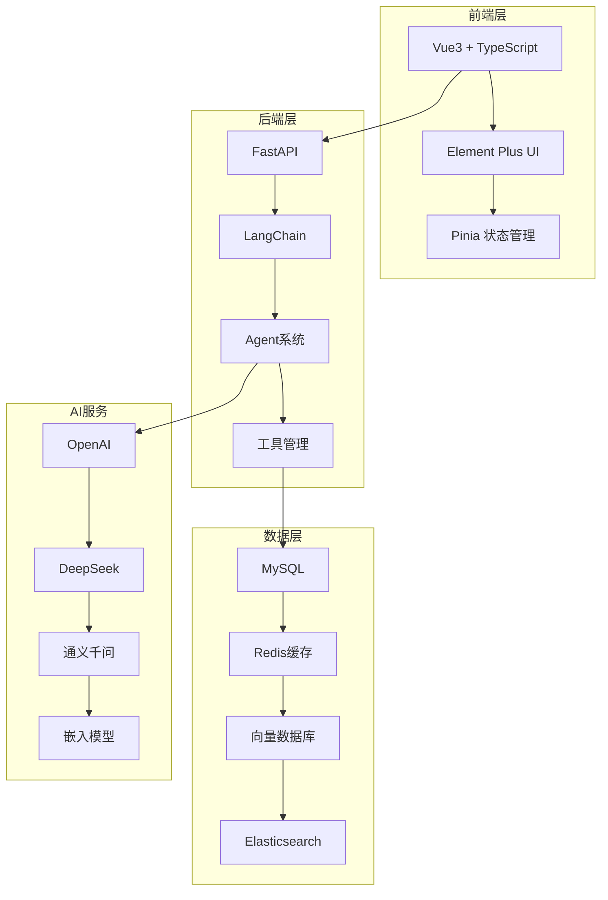

## 🌟 核心特性

### 🎯 智能对话引擎
- **多模型支持**: 集成OpenAI、DeepSeek、通义千问等主流大语言模型
- **流式响应**: 实时显示生成内容，提供流畅的对话体验
- **上下文记忆**: 支持长对话历史，智能理解对话上下文
- **思考可视化**: 深度思考面板，展示AI推理过程

### 🔄 多Agent系统
- **智能协作**: 多个Agent协同工作，分工明确
- **任务编排**: 可视化工作流设计和执行
- **能力配置**: 灵活的Agent能力定义和管理
- **执行监控**: 实时监控Agent执行状态和结果

### 📖 知识库与RAG
- **多格式支持**: PDF、Word、Excel、Markdown等文档格式
- **智能分块**: 语义级别的文档分割和处理
- **混合检索**: 结合向量检索和关键词检索
- **精准问答**: 基于检索增强生成的准确回答

### 🛠️ MCP协议集成
- **标准化接口**: 支持Model Context Protocol服务器
- **插件生态**: 丰富的第三方工具和服务集成
- **自定义扩展**: 轻松开发和集成自定义工具
- **并发调用**: 支持多工具并发执行

## 🏗️ 技术架构



## 🚀 快速开始

### Docker 一键部署

```bash
# 克隆项目
git clone https://github.com/Shy2593666979/AgentChat.git
cd AgentChat

# 配置环境变量
cp docker/docker.env.example docker/docker.env
# 编辑 docker.env 文件，填入你的API密钥

# 启动服务
cd docker
docker-compose up -d
```

### 本地开发部署

```bash
# 后端服务
cd src/backend
pip install -r requirements.txt
uvicorn agentchat.main:app --port 7860

# 前端服务
cd src/frontend
npm install
npm run dev
```

访问 `http://localhost:8090` 开始使用！

## 📊 应用场景

| 场景 | 描述 | 核心功能 |
|------|------|----------|
| **企业智能客服** | 基于知识库的智能客服系统 | RAG问答、多轮对话、工具调用 |
| **文档助手** | 智能文档分析和问答 | 文档解析、语义检索、内容生成 |
| **代码助手** | 编程辅助和代码生成 | 代码理解、调试建议、文档生成 |
| **教育培训** | 智能答疑和学习辅导 | 知识问答、学习路径、个性化推荐 |
| **创意设计** | 内容创作和设计辅助 | 文本生成、创意建议、多模态交互 |

## 🤝 参与贡献

我们欢迎所有形式的贡献！无论是：

- 🐛 报告Bug
- 💡 提出新功能建议  
- 📝 改进文档
- 🔧 提交代码

请查看我们的 [贡献指南](https://github.com/Shy2593666979/AgentChat/blob/main/CONTRIBUTING.md) 了解详细信息。

## 📄 许可证

本项目基于 [MIT 许可证](https://github.com/Shy2593666979/AgentChat/blob/main/LICENSE) 开源。

---

<div style="text-align: center; margin-top: 2rem; padding: 2rem; background: linear-gradient(135deg, #667eea 0%, #764ba2 100%); border-radius: 12px; color: white;">
  <h3 style="margin: 0 0 1rem 0; color: white;">🎉 开始你的AI之旅</h3>
  <p style="margin: 0; opacity: 0.9;">加入AgentChat社区，探索AI对话系统的无限可能</p>
</div>