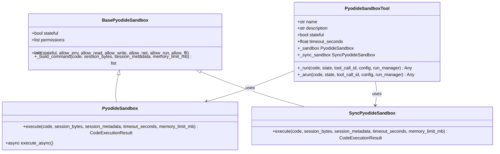
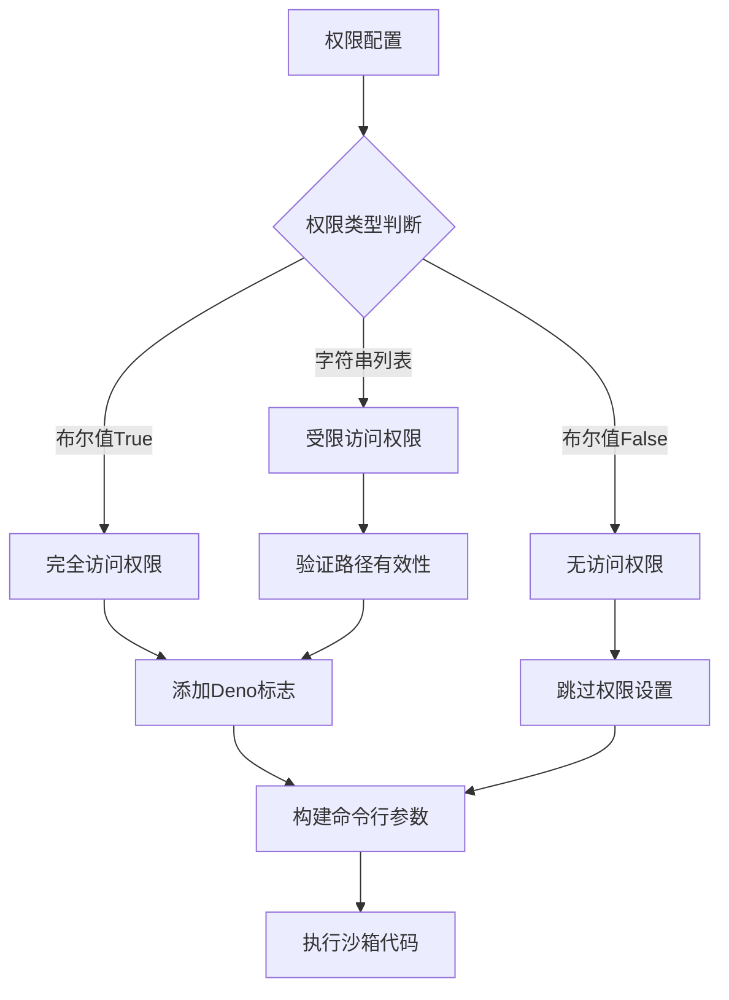
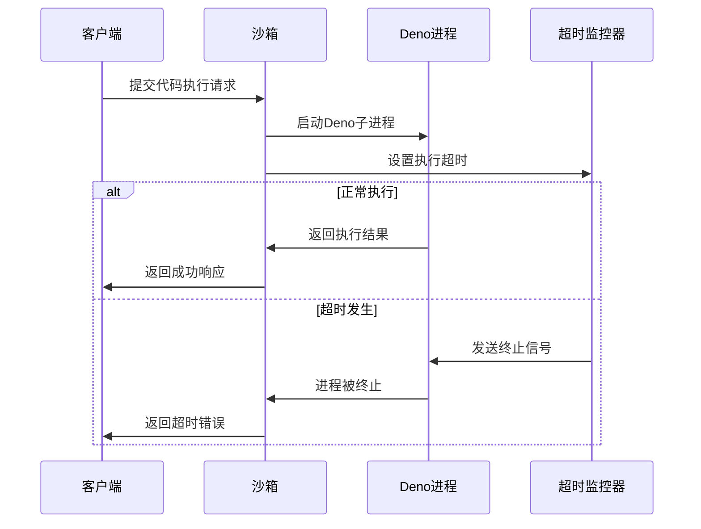
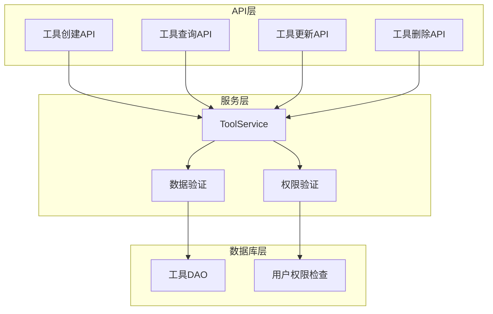
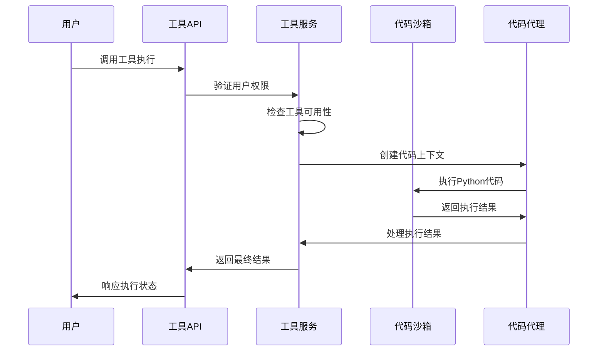
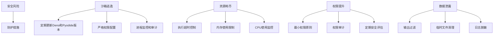

# AgentChat API安全架构文档

## 目录
1. [概述](#概述)
2. [沙箱执行环境架构](#沙箱执行环境架构)
3. [权限控制系统](#权限控制系统)
4. [资源限制机制](#资源限制机制)
5. [工具调用API安全](#工具调用api安全)
6. [安全风险与缓解措施](#安全风险与缓解措施)
7. [最佳实践指南](#最佳实践指南)
8. [总结](#总结)

## 概述

AgentChat采用了一套完整的API安全架构来保护系统免受恶意代码执行攻击。核心安全机制围绕着基于Deno子进程和WebAssembly技术的Pyodide沙箱环境构建，提供了细粒度的权限控制和资源限制功能。

该安全架构的主要特点包括：
- 基于Deno的多层安全隔离
- 细粒度的权限控制系统
- 执行时间和内存限制
- 状态化和非状态化两种执行模式
- 完整的错误处理和监控机制

## 沙箱执行环境架构

### PyodideSandbox类设计

AgentChat的核心安全机制由`PyodideSandbox`类实现，该类提供了异步和同步两种执行模式：



**图表来源**
- [pyodide.py](https://github.com/Shy2593666979/AgentChat/tree/main/src/backend/agentchat/services/sandbox/pyodide.py#L66-L737)

### Deno子进程安全模型

沙箱通过以下方式确保安全性：

1. **进程隔离**：每个代码执行都在独立的Deno进程中进行
2. **WebAssembly边界**：Python代码运行在Pyodide的WebAssembly环境中
3. **权限边界**：Deno的安全模型限制了进程可以访问的资源

**章节来源**
- [pyodide.py](https://github.com/Shy2593666979/AgentChat/tree/main/src/backend/agentchat/services/sandbox/pyodide.py#L67-L88)

## 权限控制系统

### 核心权限参数

PyodideSandbox提供了六个主要的权限控制参数：

| 权限类型 | 参数名 | 默认值 | 安全级别 | 用途 |
|---------|--------|--------|----------|------|
| 环境变量访问 | allow_env | False | 最高 | 控制对系统环境变量的访问 |
| 文件读取权限 | allow_read | False | 高 | 限制文件系统读取操作 |
| 文件写入权限 | allow_write | False | 高 | 限制文件系统写入操作 |
| 网络访问 | allow_net | False | 中等 | 控制网络连接能力 |
| 子进程执行 | allow_run | False | 低 | 阻止新进程启动 |
| 外部函数接口 | allow_ffi | False | 极低 | 禁止系统级库调用 |

### 权限配置机制



**图表来源**
- [pyodide.py](https://github.com/Shy2593666979/AgentChat/tree/main/src/backend/agentchat/services/sandbox/pyodide.py#L42-L63)

### 默认权限策略

系统采用了最小权限原则，默认情况下所有权限都被禁用：

- **文件系统权限**：默认允许访问`node_modules`目录
- **网络权限**：默认完全禁用
- **环境变量**：默认完全禁用
- **子进程**：默认完全禁用
- **FFI**：默认完全禁用

**章节来源**
- [pyodide.py](https://github.com/Shy2593666979/AgentChat/tree/main/src/backend/agentchat/services/sandbox/pyodide.py#L177-L196)

## 资源限制机制

### 执行超时控制

系统实现了多层次的超时控制机制：



**图表来源**
- [pyodide.py](https://github.com/Shy2593666979/AgentChat/tree/main/src/backend/agentchat/services/sandbox/pyodide.py#L296-L336)

### 内存限制机制

通过V8引擎的内存管理实现：

1. **V8标志配置**：使用`--max-old-space-size`参数限制内存使用
2. **动态调整**：支持运行时动态设置内存限制
3. **强制回收**：超过限制时触发垃圾回收机制

**章节来源**
- [pyodide.py](https://github.com/Shy2593666979/AgentChat/tree/main/src/backend/agentchat/services/sandbox/pyodide.py#L227-L228)

## 工具调用API安全

### 工具服务架构

AgentChat提供了完整的工具管理API，包含以下安全特性：



**图表来源**
- [tool.py](https://github.com/Shy2593666979/AgentChat/tree/main/src/backend/agentchat/api/services/tool.py#L9-L124)
- [tool.py](https://github.com/Shy2593666979/AgentChat/tree/main/src/backend/agentchat/api/v1/tool.py#L1-L86)

### 用户权限验证

系统实现了严格的权限控制：

1. **管理员权限**：系统管理员拥有最高权限
2. **用户权限**：普通用户只能操作自己的工具
3. **权限继承**：系统工具对所有用户可见但受权限控制

**章节来源**
- [tool.py](https://github.com/Shy2593666979/AgentChat/tree/main/src/backend/agentchat/api/services/tool.py#L27-L31)

### 代码执行流程



**图表来源**
- [codeact_agent.py](https://github.com/Shy2593666979/AgentChat/tree/main/src/backend/agentchat/core/agents/codeact_agent.py#L100-L136)

**章节来源**
- [codeact_agent.py](https://github.com/Shy2593666979/AgentChat/tree/main/src/backend/agentchat/core/agents/codeact_agent.py#L100-L136)

## 安全风险与缓解措施

### 主要安全风险

1. **沙箱逃逸攻击**
   - 利用Deno或Pyodide的漏洞突破隔离
   - 通过精心构造的代码尝试访问受限资源

2. **资源耗尽攻击**
   - 无限循环导致CPU占用过高
   - 内存泄漏导致系统内存耗尽

3. **权限提升攻击**
   - 利用默认权限配置尝试获取更高权限
   - 社会工程学诱导获得敏感权限

4. **数据泄露风险**
   - 敏感信息意外输出到标准输出
   - 临时文件中的敏感数据残留

### 缓解措施



### 安全监控机制

1. **执行时间监控**：实时跟踪代码执行时间
2. **内存使用监控**：监控内存消耗趋势
3. **异常检测**：识别可疑的执行模式
4. **审计日志**：记录所有沙箱操作

**章节来源**
- [pyodide.py](https://github.com/Shy2593666979/AgentChat/tree/main/src/backend/agentchat/services/sandbox/pyodide.py#L283-L336)

## 最佳实践指南

### 沙箱配置最佳实践

1. **权限最小化原则**
   ```python
   # 推荐：仅开放必要的权限
   sandbox = PyodideSandbox(
       allow_read=["/safe/path"],
       allow_net=["api.example.com"],
       timeout_seconds=30
   )
   
   # 不推荐：过度开放权限
   sandbox = PyodideSandbox(allow_read=True, allow_net=True)
   ```

2. **合理设置超时时间**
   - 简单计算：5-10秒
   - 复杂算法：30-60秒
   - 数据处理：60-120秒

3. **内存限制建议**
   - 小型脚本：64MB-128MB
   - 中等复杂度：256MB-512MB
   - 大型应用：1GB以上

### 开发安全规范

1. **输入验证**
   - 验证所有用户输入
   - 过滤危险字符和序列
   - 限制输入长度

2. **输出控制**
   - 使用print()显式输出
   - 避免f-string格式化
   - 注意敏感信息泄露

3. **错误处理**
   - 捕获并处理所有异常
   - 提供有意义的错误信息
   - 记录安全相关事件

### 部署安全建议

1. **环境隔离**
   - 在专用容器中运行
   - 使用非root用户权限
   - 网络隔离配置

2. **定期更新**
   - 及时更新Deno和Pyodide
   - 应用安全补丁
   - 监控安全公告

3. **监控和审计**
   - 实施全面的日志记录
   - 设置告警机制
   - 定期安全审查

**章节来源**
- [pyodide.py](https://github.com/Shy2593666979/AgentChat/tree/main/src/backend/agentchat/services/sandbox/pyodide.py#L508-L520)

## 总结

AgentChat的API安全架构通过多层次的安全控制机制，为不受信任的代码执行提供了可靠的保护。核心优势包括：

1. **完善的权限控制**：六层权限体系确保最小权限原则
2. **有效的资源限制**：超时和内存限制防止资源耗尽攻击
3. **灵活的执行模式**：支持状态化和非状态化两种模式
4. **完整的工具管理**：提供安全的工具生命周期管理
5. **强大的监控机制**：实时监控和审计所有操作

这套安全架构不仅保护了系统免受恶意攻击，还为开发者提供了安全可靠的代码执行环境。通过遵循最佳实践和持续的安全改进，AgentChat能够安全地支持各种复杂的代码执行需求。
