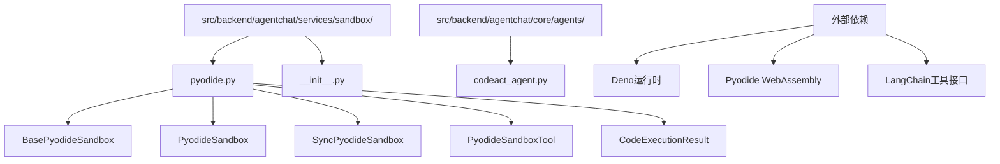
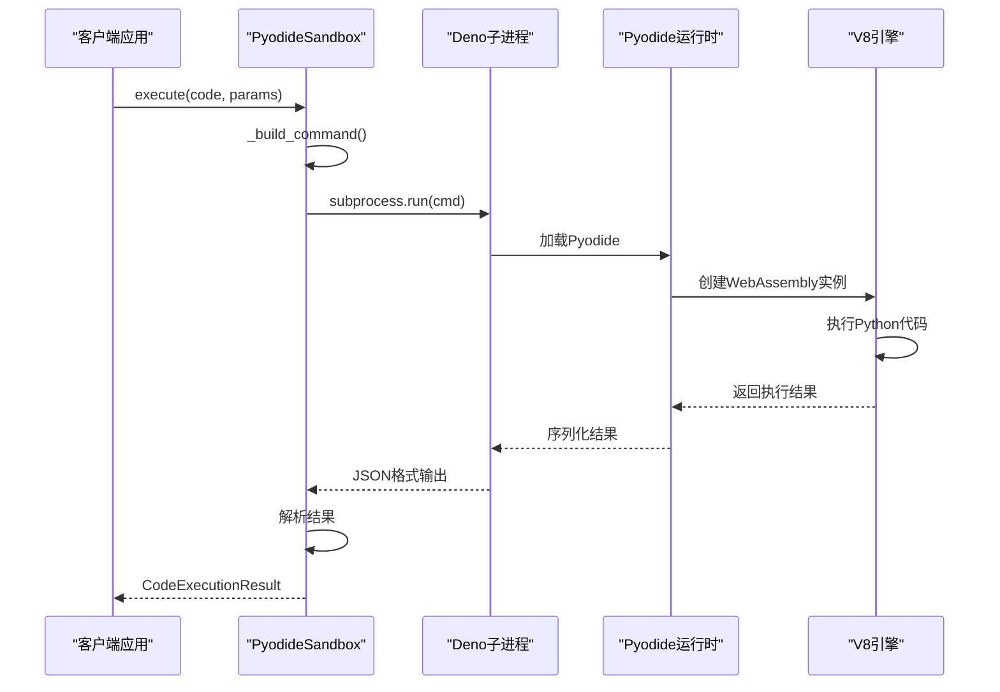
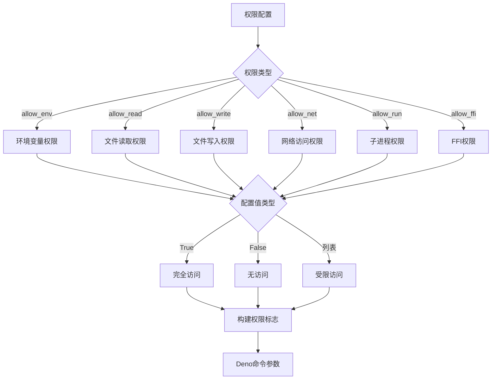
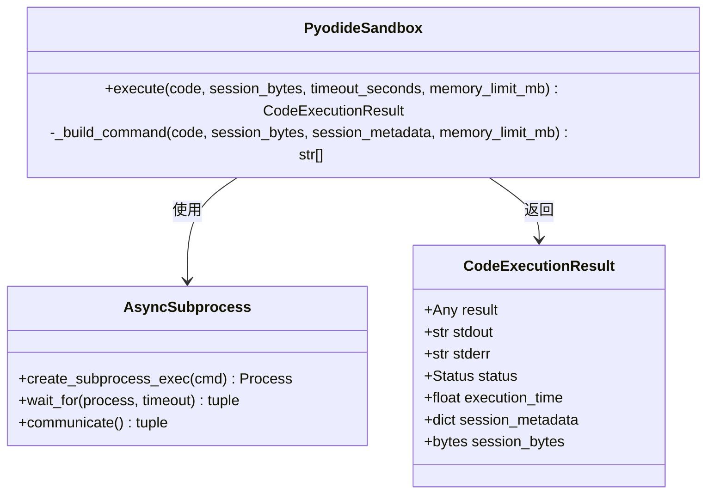
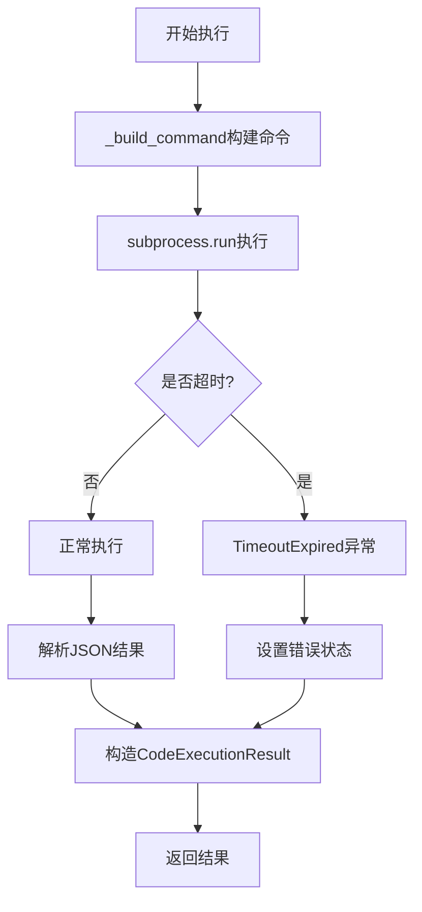
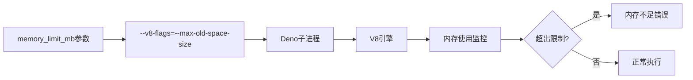
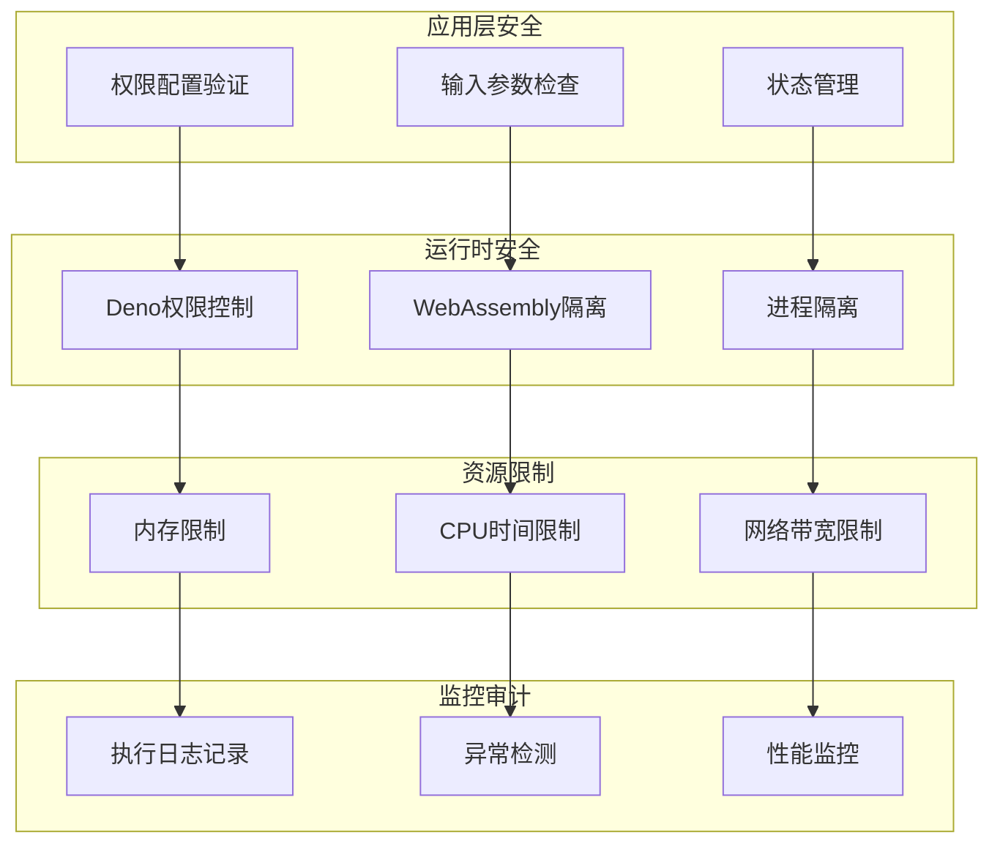

# 沙箱执行安全

<cite>
**本文档引用的文件**
- [pyodide.py](https://github.com/Shy2593666979/AgentChat/src/backend/agentchat/services/sandbox/pyodide.py)
- [__init__.py](https://github.com/Shy2593666979/AgentChat/src/backend/agentchat/services/sandbox/__init__.py)
- [codeact_agent.py](https://github.com/Shy2593666979/AgentChat/src/backend/agentchat/core/agents/codeact_agent.py)
</cite>

## 目录
1. [简介](#简介)
2. [项目结构](#项目结构)
3. [核心组件](#核心组件)
4. [架构概览](#架构概览)
5. [详细组件分析](#详细组件分析)
6. [安全机制分析](#安全机制分析)
7. [性能考虑](#性能考虑)
8. [故障排除指南](#故障排除指南)
9. [结论](#结论)

## 简介

AgentChat中的Pyodide沙箱是一个基于Deno和WebAssembly的安全代码执行环境，专门设计用于在受控环境中执行用户提供的Python代码。该系统通过多层安全机制确保代码执行的安全性，包括细粒度的权限控制、资源限制和执行监控。

本文档深入分析了BasePyodideSandbox类如何通过Deno的权限控制系统实现细粒度的访问控制，以及PyodideSandbox和SyncPyodideSandbox两个类如何分别提供异步和同步的代码执行能力。同时探讨了内存限制、执行超时等安全防护措施，以及潜在的沙箱逃逸风险和缓解策略。

## 项目结构

AgentChat的沙箱系统位于以下目录结构中：



**图表来源**
- [pyodide.py](https://github.com/Shy2593666979/AgentChat/src/backend/agentchat/services/sandbox/pyodide.py#L1-L737)
- [__init__.py](https://github.com/Shy2593666979/AgentChat/src/backend/agentchat/services/sandbox/__init__.py#L1-L11)

**章节来源**
- [pyodide.py](https://github.com/Shy2593666979/AgentChat/src/backend/agentchat/services/sandbox/pyodide.py#L1-L50)
- [__init__.py](https://github.com/Shy2593666979/AgentChat/src/backend/agentchat/services/sandbox/__init__.py#L1-L11)

## 核心组件

### BasePyodideSandbox基础类

BasePyodideSandbox是所有沙箱实现的基础类，提供了通用的初始化和配置逻辑。它定义了六个主要的安全权限参数：

- **allow_env**: 控制环境变量访问权限
- **allow_read**: 控制文件系统读取权限  
- **allow_write**: 控制文件系统写入权限
- **allow_net**: 控制网络访问权限
- **allow_run**: 控制子进程执行权限
- **allow_ffi**: 控制外部函数接口权限

### PyodideSandbox和SyncPyodideSandbox

这两个类分别提供异步和同步的代码执行能力：

- **PyodideSandbox**: 基于asyncio的异步实现，适合高并发场景
- **SyncPyodideSandbox**: 同步阻塞实现，适合传统应用

### CodeExecutionResult结果容器

CodeExecutionResult类封装了代码执行的所有结果信息，包括：
- 执行状态(status)
- 输出结果(stdout/stderr)
- 执行时间(execution_time)
- 会话元数据(session_metadata/session_bytes)

**章节来源**
- [pyodide.py](https://github.com/Shy2593666979/AgentChat/src/backend/agentchat/services/sandbox/pyodide.py#L66-L248)
- [pyodide.py](https://github.com/Shy2593666979/AgentChat/src/backend/agentchat/services/sandbox/pyodide.py#L250-L442)

## 架构概览

AgentChat的沙箱执行架构采用分层设计，通过Deno作为中间层实现安全隔离：



**图表来源**
- [pyodide.py](https://github.com/Shy2593666979/AgentChat/src/backend/agentchat/services/sandbox/pyodide.py#L296-L346)
- [pyodide.py](https://github.com/Shy2593666979/AgentChat/src/backend/agentchat/services/sandbox/pyodide.py#L392-L442)

## 详细组件分析

### BasePyodideSandbox权限控制系统

BasePyodideSandbox通过build_permission_flag函数实现细粒度的权限控制：



**图表来源**
- [pyodide.py](https://github.com/Shy2593666979/AgentChat/src/backend/agentchat/services/sandbox/pyodide.py#L42-L64)
- [pyodide.py](https://github.com/Shy2593666979/AgentChat/src/backend/agentchat/services/sandbox/pyodide.py#L90-L159)

#### 权限配置详解

1. **allow_env环境变量控制**
   - False: 完全禁止访问环境变量（最安全）
   - True: 允许访问所有环境变量
   - 列表: 仅允许特定环境变量访问

2. **allow_read文件读取控制**
   - 默认情况下自动允许node_modules目录访问
   - 可以限制到特定路径
   - 防止恶意代码访问敏感文件系统

3. **allow_write文件写入控制**
   - 默认允许写入node_modules目录
   - 可以限制到特定输出目录
   - 防止恶意代码修改系统文件

4. **allow_net网络访问控制**
   - 支持域名/IP白名单
   - 可以防止恶意网络通信
   - 特别适用于需要网络但要限制访问的场景

5. **allow_run子进程控制**
   - False: 完全禁止子进程执行
   - True: 允许执行任何命令
   - 列表: 仅允许特定命令执行

6. **allow_ffi外部函数接口控制**
   - 严格限制外部库访问
   - 防止直接调用系统级API
   - 保护底层系统安全

**章节来源**
- [pyodide.py](https://github.com/Shy2593666979/AgentChat/src/backend/agentchat/services/sandbox/pyodide.py#L116-L155)

### 异步执行机制

PyodideSandbox类实现了基于asyncio的异步代码执行：



**图表来源**
- [pyodide.py](https://github.com/Shy2593666979/AgentChat/src/backend/agentchat/services/sandbox/pyodide.py#L250-L346)

#### 异步执行流程

1. **命令构建**: _build_command方法构建Deno执行命令
2. **进程启动**: asyncio.create_subprocess_exec启动子进程
3. **超时控制**: asyncio.wait_for设置执行超时
4. **结果解析**: 解析JSON格式的执行结果
5. **异常处理**: 处理超时和取消异常

**章节来源**
- [pyodide.py](https://github.com/Shy2593666979/AgentChat/src/backend/agentchat/services/sandbox/pyodide.py#L257-L346)

### 同步执行机制

SyncPyodideSandbox提供同步阻塞的代码执行能力：



**图表来源**
- [pyodide.py](https://github.com/Shy2593666979/AgentChat/src/backend/agentchat/services/sandbox/pyodide.py#L349-L442)

#### 同步执行特点

1. **阻塞特性**: 调用期间会阻塞当前线程
2. **简单可靠**: 不涉及复杂的异步调度
3. **资源管理**: 自动处理进程生命周期
4. **异常处理**: 明确的超时和错误处理

**章节来源**
- [pyodide.py](https://github.com/Shy2593666979/AgentChat/src/backend/agentchat/services/sandbox/pyodide.py#L355-L442)

### 内存和执行限制

#### 内存限制机制

系统通过V8引擎的--max-old-space-size标志实现内存限制：



**图表来源**
- [pyodide.py](https://github.com/Shy2593666979/AgentChat/src/backend/agentchat/services/sandbox/pyodide.py#L226-L228)

#### 执行超时控制

两种执行模式都支持超时控制：

- **异步模式**: 使用asyncio.wait_for设置超时
- **同步模式**: 使用subprocess.run的timeout参数
- **统一处理**: 超时后都会终止进程并返回错误信息

**章节来源**
- [pyodide.py](https://github.com/Shy2593666979/AgentChat/src/backend/agentchat/services/sandbox/pyodide.py#L226-L229)
- [pyodide.py](https://github.com/Shy2593666979/AgentChat/src/backend/agentchat/services/sandbox/pyodide.py#L304-L332)
- [pyodide.py](https://github.com/Shy2593666979/AgentChat/src/backend/agentchat/services/sandbox/pyodide.py#L401-L430)

## 安全机制分析

### 多层安全防护

AgentChat的沙箱系统实现了多层安全防护机制：



### 沙箱逃逸风险与缓解

#### 潜在逃逸风险

1. **权限提升**: 通过恶意代码尝试获取更高权限
2. **资源耗尽**: 通过无限循环或大量内存分配导致系统崩溃
3. **信息泄露**: 通过侧信道攻击获取敏感信息
4. **拒绝服务**: 通过恶意代码消耗系统资源

#### 缓解措施

1. **严格的权限控制**: 默认禁用所有权限，按需启用
2. **资源限制**: 设置内存和执行时间上限
3. **进程隔离**: 使用独立的Deno子进程
4. **输入验证**: 对传入代码进行基本的安全检查
5. **输出过滤**: 过滤敏感信息的输出

### 最佳实践配置

#### 生产环境推荐配置

```python
# 最高安全性配置
sandbox = PyodideSandbox(
    stateful=False,
    allow_env=False,
    allow_read=False,
    allow_write=False,
    allow_net=False,
    allow_run=False,
    allow_ffi=False,
    timeout_seconds=30,
    memory_limit_mb=64
)

# 中等安全性配置（允许网络访问）
sandbox = PyodideSandbox(
    stateful=False,
    allow_env=["PATH"],
    allow_read=["./data"],
    allow_write=["./output"],
    allow_net=["api.example.com"],
    allow_run=False,
    allow_ffi=False,
    timeout_seconds=60,
    memory_limit_mb=128
)

# 开发环境配置
sandbox = PyodideSandbox(
    stateful=True,
    allow_env=True,
    allow_read=True,
    allow_write=True,
    allow_net=True,
    allow_run=True,
    allow_ffi=True,
    timeout_seconds=120,
    memory_limit_mb=256
)
```

#### 安全配置原则

1. **最小权限原则**: 只授予必要的最小权限
2. **深度防御**: 多层安全措施协同工作
3. **监控审计**: 记录所有执行活动
4. **定期更新**: 及时更新安全补丁
5. **备份恢复**: 建立安全的备份和恢复机制

**章节来源**
- [pyodide.py](https://github.com/Shy2593666979/AgentChat/src/backend/agentchat/services/sandbox/pyodide.py#L67-L88)
- [pyodide.py](https://github.com/Shy2593666979/AgentChat/src/backend/agentchat/services/sandbox/pyodide.py#L90-L160)

## 性能考虑

### 执行性能优化

1. **进程复用**: stateful模式可以复用Deno进程
2. **内存管理**: 合理设置内存限制避免频繁GC
3. **超时控制**: 设置合适的超时时间平衡安全性和性能
4. **并发控制**: 在高并发场景下合理使用异步模式

### 资源使用监控

系统提供了详细的执行时间统计，有助于性能优化：

- **execution_time**: 从开始到结束的总执行时间
- **内存使用**: 通过V8内存限制监控
- **进程开销**: 子进程启动和销毁的开销

### 性能调优建议

1. **合理设置超时**: 根据代码复杂度调整timeout_seconds
2. **内存优化**: 根据实际需求设置memory_limit_mb
3. **状态管理**: 在需要保持状态时使用stateful模式
4. **并发控制**: 在高负载场景下使用异步版本

## 故障排除指南

### 常见问题及解决方案

#### Deno安装问题

**问题**: RuntimeError: Deno is not installed or not in PATH
**解决方案**: 
- 确保Deno已正确安装
- 将Deno添加到系统PATH
- 或者设置skip_deno_check=True跳过检查

#### 权限配置问题

**问题**: 代码无法访问所需资源
**解决方案**:
- 检查权限配置是否正确
- 添加必要的allow_*参数
- 确认路径和域名配置准确

#### 内存不足问题

**问题**: 执行过程中出现内存不足错误
**解决方案**:
- 增加memory_limit_mb设置
- 优化代码减少内存使用
- 检查是否存在内存泄漏

#### 执行超时问题

**问题**: 代码执行超过设定时间
**解决方案**:
- 增加timeout_seconds设置
- 优化代码逻辑提高执行效率
- 分解复杂任务为多个小任务

### 调试技巧

1. **启用详细日志**: 检查stderr输出获取详细错误信息
2. **简化测试**: 使用简单的代码片段测试沙箱功能
3. **权限测试**: 逐步增加权限配置定位问题
4. **资源监控**: 监控内存和CPU使用情况

**章节来源**
- [pyodide.py](https://github.com/Shy2593666979/AgentChat/src/backend/agentchat/services/sandbox/pyodide.py#L164-L174)
- [pyodide.py](https://github.com/Shy2593666979/AgentChat/src/backend/agentchat/services/sandbox/pyodide.py#L328-L332)
- [pyodide.py](https://github.com/Shy2593666979/AgentChat/src/backend/agentchat/services/sandbox/pyodide.py#L428-L430)

## 结论

AgentChat的Pyodide沙箱系统通过多层次的安全机制，为Python代码执行提供了一个安全可靠的环境。系统的核心优势包括：

1. **细粒度权限控制**: 通过六个主要权限参数实现精确的访问控制
2. **双重执行模式**: 同时支持异步和同步两种执行方式
3. **强大的资源限制**: 内存和执行时间的双重保护
4. **完善的错误处理**: 全面的异常捕获和错误报告机制
5. **灵活的状态管理**: 支持有状态和无状态两种执行模式

该系统特别适用于需要安全执行用户代码的AI应用场景，如代码生成、数据分析和自动化任务等。通过合理的配置和使用，可以在保证安全性的同时提供良好的用户体验和执行性能。

在实际部署中，建议根据具体的应用场景选择合适的配置参数，并建立完善的监控和审计机制，以确保系统的长期稳定运行。