# 输入验证与防注入安全机制

## 目录
1. [简介](#简介)
2. [系统架构概览](#系统架构概览)
3. [Pydantic模型验证机制](#pydantic模型验证机制)
4. [白名单中间件安全控制](#白名单中间件安全控制)
5. [沙箱安全隔离机制](#沙箱安全隔离机制)
6. [代码执行安全防护](#代码执行安全防护)
7. [常见攻击防护策略](#常见攻击防护策略)
8. [最佳实践指南](#最佳实践指南)
9. [总结](#总结)

## 简介

AgentChat系统是一个复杂的AI代理平台，其中工具调用API的安全性至关重要。本文档深入分析了系统中针对工具调用API的输入验证与防注入安全机制，包括结构化验证、权限控制、沙箱隔离等多个层面的安全防护措施。

## 系统架构概览

AgentChat系统采用分层安全架构，通过多道防线确保代码执行的安全性：

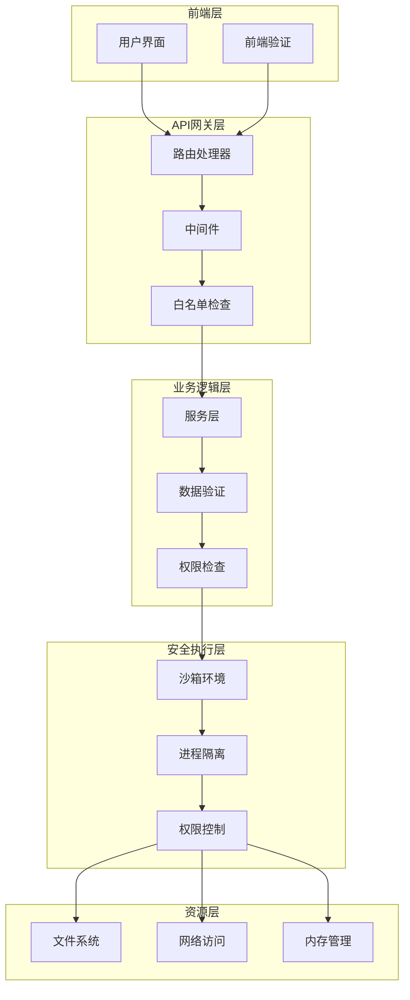

**图表来源**
- [tool.py](https://github.com/Shy2593666979/AgentChat/src/backend/agentchat/api/v1/tool.py#L1-L86)
- [white_list_middleware.py](https://github.com/Shy2593666979/AgentChat/src/backend/agentchat/middleware/white_list_middleware.py#L1-L50)
- [pyodide.py](https://github.com/Shy2593666979/AgentChat/src/backend/agentchat/services/sandbox/pyodide.py#L1-L737)

## Pydantic模型验证机制

### 结构化输入验证

系统通过Pydantic模型对用户提交的工具创建和更新请求进行严格的结构化验证：

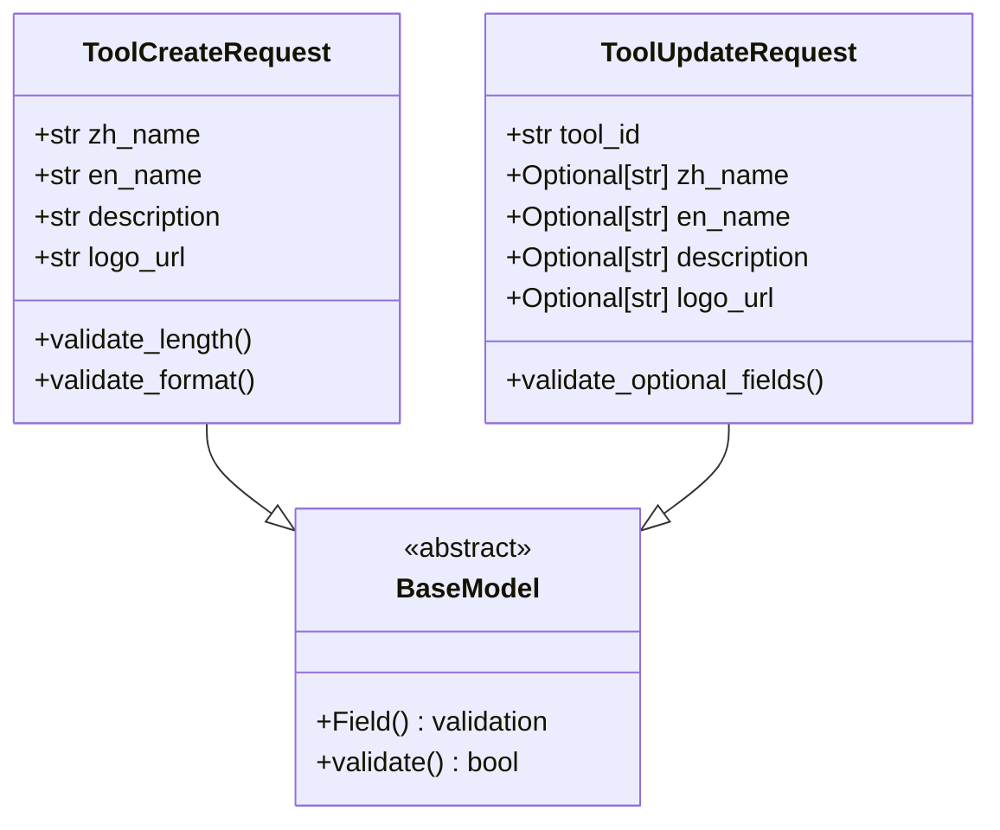

**图表来源**
- [tool.py](https://github.com/Shy2593666979/AgentChat/src/backend/agentchat/schema/tool.py#L5-L16)

### 验证规则详解

| 字段 | 验证规则 | 安全目的 |
|------|----------|----------|
| zh_name | min_length=2, max_length=10 | 限制中文名称长度，防止缓冲区溢出 |
| en_name | min_length=2, max_length=10 | 限制英文名称长度，确保格式一致性 |
| description | max_length=300 | 控制描述长度，防止超长输入 |
| logo_url | 无特殊限制 | URL验证由FastAPI自动处理 |

**节来源**
- [tool.py](https://github.com/Shy2593666979/AgentChat/src/backend/agentchat/schema/tool.py#L5-L16)

### 服务层验证逻辑

工具服务层实现了完整的权限验证和数据验证流程：

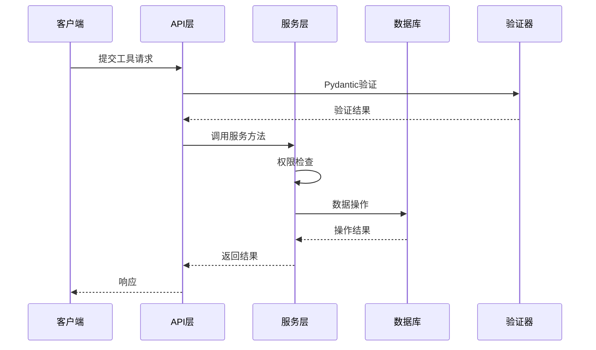

**图表来源**
- [tool.py](https://github.com/Shy2593666979/AgentChat/src/backend/agentchat/api/services/tool.py#L12-L40)
- [tool.py](https://github.com/Shy2593666979/AgentChat/src/backend/agentchat/api/v1/tool.py#L13-L86)

**节来源**
- [tool.py](https://github.com/Shy2593666979/AgentChat/src/backend/agentchat/api/services/tool.py#L12-L124)
- [tool.py](https://github.com/Shy2593666979/AgentChat/src/backend/agentchat/api/v1/tool.py#L13-L86)

## 白名单中间件安全控制

### IP过滤机制

白名单中间件提供了基于路径的访问控制机制：

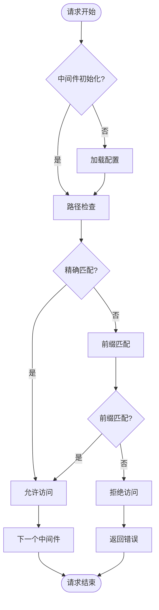

**图表来源**
- [white_list_middleware.py](https://github.com/Shy2593666979/AgentChat/src/backend/agentchat/middleware/white_list_middleware.py#L23-L30)

### 路径匹配策略

白名单中间件支持多种路径匹配模式：

| 匹配类型 | 示例 | 用途 |
|----------|------|------|
| 精确匹配 | `/api/v1/tool/create` | 关键API端点保护 |
| 前缀匹配 | `/api/v1/tool/*` | 整个工具模块保护 |
| 通配符匹配 | `/api/v1/*/create` | 动态路径保护 |

**节来源**
- [white_list_middleware.py](https://github.com/Shy2593666979/AgentChat/src/backend/agentchat/middleware/white_list_middleware.py#L7-L31)

### 中间件配置

中间件通过应用设置动态加载白名单配置：

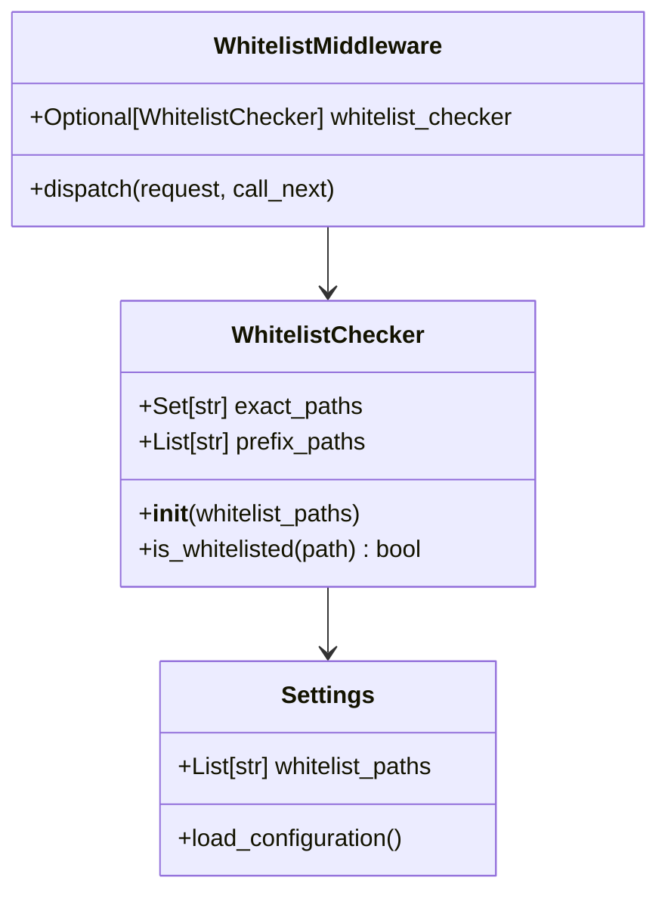

**图表来源**
- [white_list_middleware.py](https://github.com/Shy2593666979/AgentChat/src/backend/agentchat/middleware/white_list_middleware.py#L7-L50)
- [settings.py](https://github.com/Shy2593666979/AgentChat/src/backend/agentchat/settings.py#L14)

**节来源**
- [white_list_middleware.py](https://github.com/Shy2593666979/AgentChat/src/backend/agentchat/middleware/white_list_middleware.py#L33-L50)
- [settings.py](https://github.com/Shy2593666979/AgentChat/src/backend/agentchat/settings.py#L14)

## 沙箱安全隔离机制

### Deno沙箱架构

AgentChat系统采用Deno作为Python代码执行的沙箱环境，提供强大的安全隔离能力：

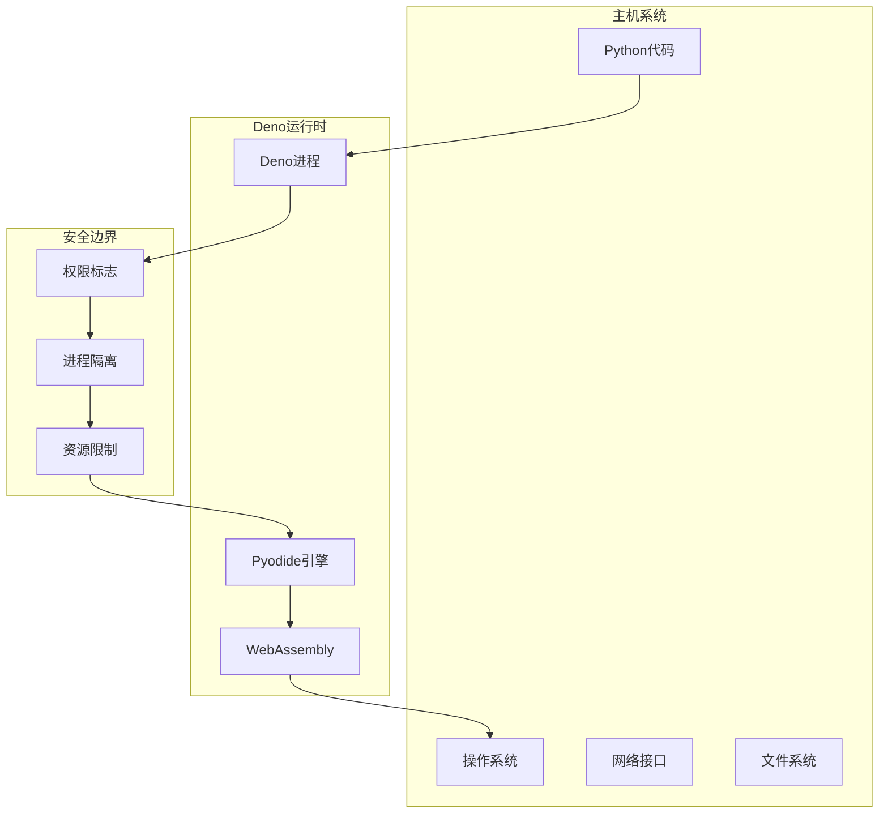

**图表来源**
- [pyodide.py](https://github.com/Shy2593666979/AgentChat/src/backend/agentchat/services/sandbox/pyodide.py#L67-L88)

### 权限控制系统

沙箱提供了细粒度的权限控制机制：

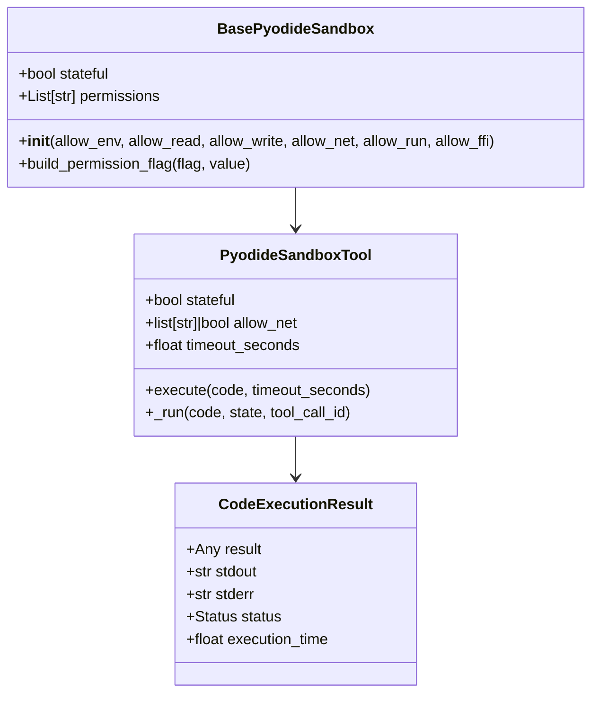

**图表来源**
- [pyodide.py](https://github.com/Shy2593666979/AgentChat/src/backend/agentchat/services/sandbox/pyodide.py#L66-L159)
- [pyodide.py](https://github.com/Shy2593666979/AgentChat/src/backend/agentchat/services/sandbox/pyodide.py#L508-L532)

### 默认安全配置

系统采用最小权限原则，默认禁用所有危险权限：

| 权限类型 | 默认配置 | 安全级别 |
|----------|----------|----------|
| allow_env | False | 最高安全 |
| allow_read | ["node_modules"] | 受限访问 |
| allow_write | ["node_modules"] | 受限访问 |
| allow_net | False | 禁用网络 |
| allow_run | False | 禁用子进程 |
| allow_ffi | False | 禁用FFI |

**节来源**
- [pyodide.py](https://github.com/Shy2593666979/AgentChat/src/backend/agentchat/services/sandbox/pyodide.py#L177-L186)

## 代码执行安全防护

### 执行时间限制

系统为代码执行设置了严格的时间限制：

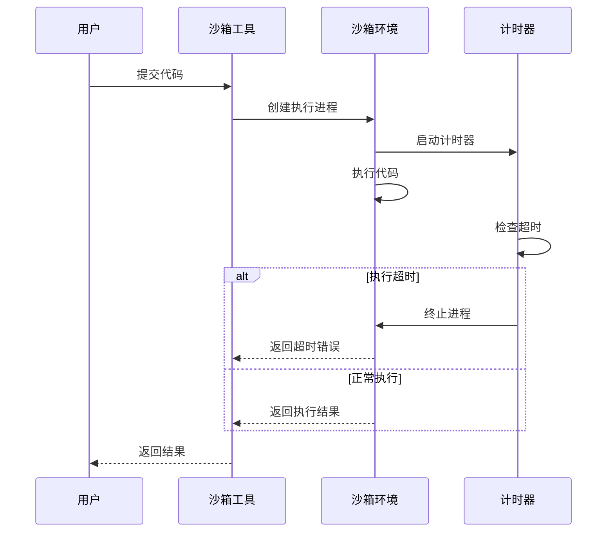

**图表来源**
- [pyodide.py](https://github.com/Shy2593666979/AgentChat/src/backend/agentchat/services/sandbox/pyodide.py#L296-L337)

### 内存使用监控

沙箱环境支持内存使用限制：

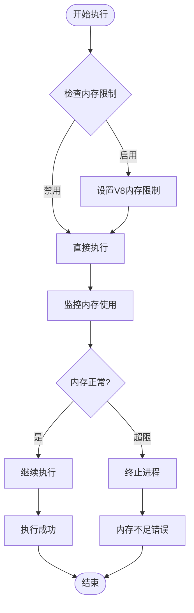

**图表来源**
- [pyodide.py](https://github.com/Shy2593666979/AgentChat/src/backend/agentchat/services/sandbox/pyodide.py#L226-L229)

**节来源**
- [pyodide.py](https://github.com/Shy2593666979/AgentChat/src/backend/agentchat/services/sandbox/pyodide.py#L257-L346)
- [pyodide.py](https://github.com/Shy2593666979/AgentChat/src/backend/agentchat/services/sandbox/pyodide.py#L355-L442)

## 常见攻击防护策略

### 命令注入防护

系统通过以下机制防止命令注入攻击：

1. **进程隔离**：使用子进程执行代码，避免直接调用系统命令
2. **权限限制**：默认禁用`allow_run`权限
3. **参数验证**：严格验证所有输入参数

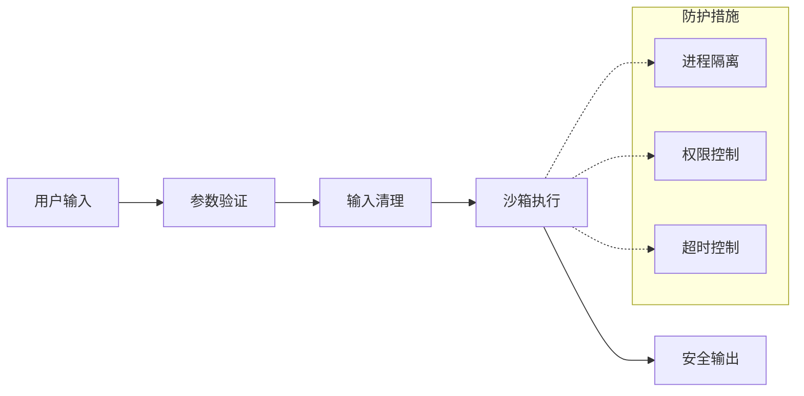

**图表来源**
- [pyodide.py](https://github.com/Shy2593666979/AgentChat/src/backend/agentchat/services/sandbox/pyodide.py#L394-L403)

### XSS防护策略

虽然主要关注后端安全，但前端也实现了相应的防护措施：

| 防护层级 | 实现方式 | 安全效果 |
|----------|----------|----------|
| 前端验证 | JSON解析优化 | 防止恶意脚本注入 |
| 后端验证 | Pydantic模型 | 结构化数据验证 |
| 中间件过滤 | 白名单机制 | 访问控制 |
| 沙箱隔离 | 进程隔离 | 代码执行隔离 |

**节来源**
- [pyodide.py](https://github.com/Shy2593666979/AgentChat/src/backend/agentchat/services/sandbox/pyodide.py#L394-L403)

### 网络安全防护

对于网络访问控制，系统提供了灵活的配置选项：

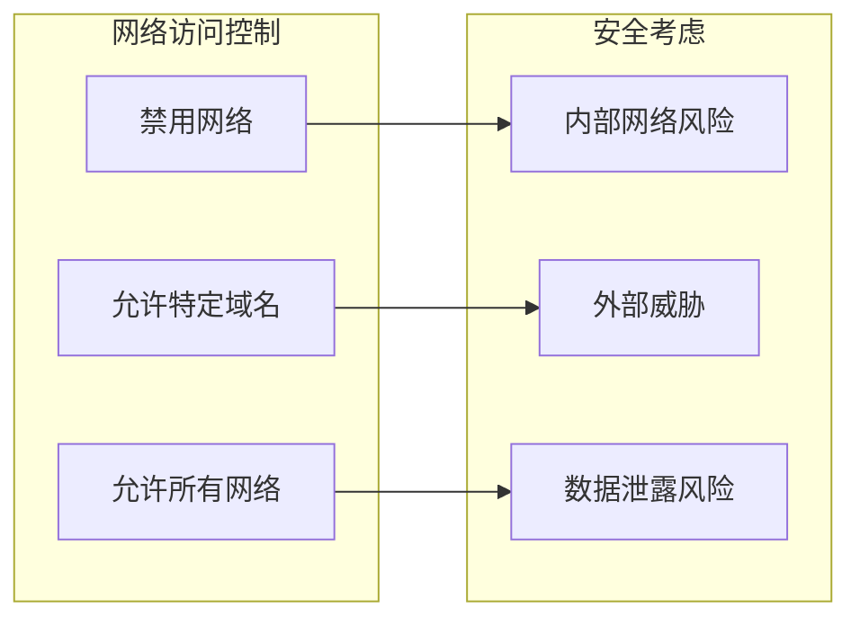

**图表来源**
- [pyodide.py](https://github.com/Shy2593666979/AgentChat/src/backend/agentchat/services/sandbox/pyodide.py#L138-L143)

**节来源**
- [pyodide.py](https://github.com/Shy2593666979/AgentChat/src/backend/agentchat/services/sandbox/pyodide.py#L549-L554)

## 最佳实践指南

### 开发阶段安全实践

1. **输入验证**
   - 使用Pydantic模型进行结构化验证
   - 设置合理的长度和格式限制
   - 实施类型检查和范围验证

2. **权限设计**
   - 遵循最小权限原则
   - 明确区分不同级别的访问权限
   - 实施细粒度的权限控制

3. **代码审查**
   - 定期审查安全配置
   - 测试边界条件和异常情况
   - 验证权限控制的有效性

### 运维阶段安全实践

1. **监控和审计**
   - 监控异常访问模式
   - 记录和分析安全事件
   - 定期评估安全配置

2. **更新和维护**
   - 及时更新依赖组件
   - 应用最新的安全补丁
   - 优化性能和安全性

3. **应急响应**
   - 制定安全事件响应计划
   - 建立快速修复机制
   - 进行定期安全演练

### 配置安全建议

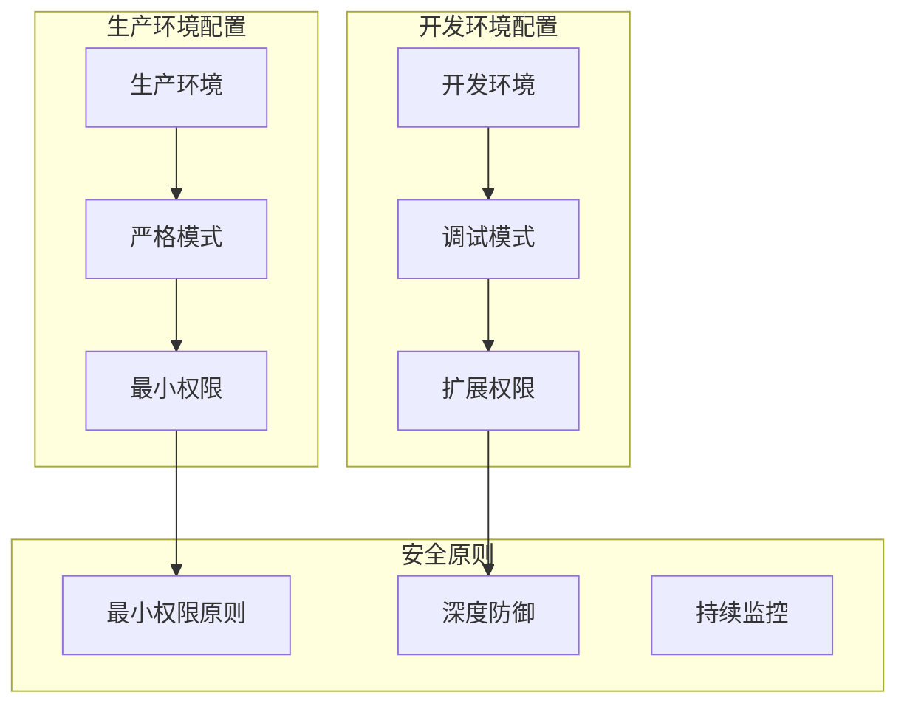

**节来源**
- [pyodide.py](https://github.com/Shy2593666979/AgentChat/src/backend/agentchat/services/sandbox/pyodide.py#L103-L159)
- [white_list_middleware.py](https://github.com/Shy2593666979/AgentChat/src/backend/agentchat/middleware/white_list_middleware.py#L33-L50)

## 总结

AgentChat系统的输入验证与防注入安全机制体现了多层次、全方位的安全防护理念。通过Pydantic模型验证确保输入数据的结构化安全，白名单中间件提供访问控制，沙箱环境实现代码执行隔离，这些措施共同构建了一个安全可靠的工具调用API系统。

系统的设计充分考虑了安全性与可用性的平衡，在保证功能完整性的同时，最大限度地降低了安全风险。通过持续的安全监控和配置优化，可以进一步提升系统的整体安全水平。
