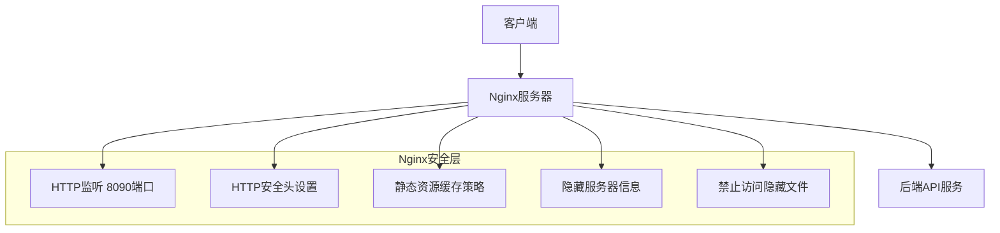
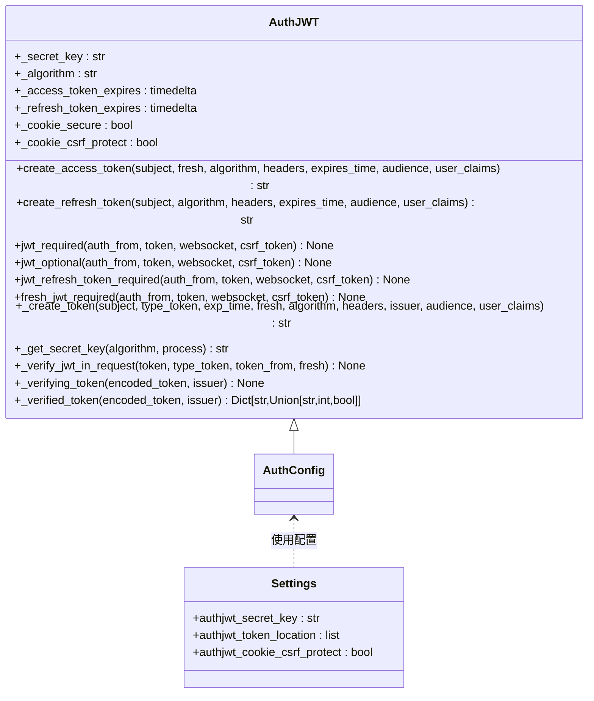
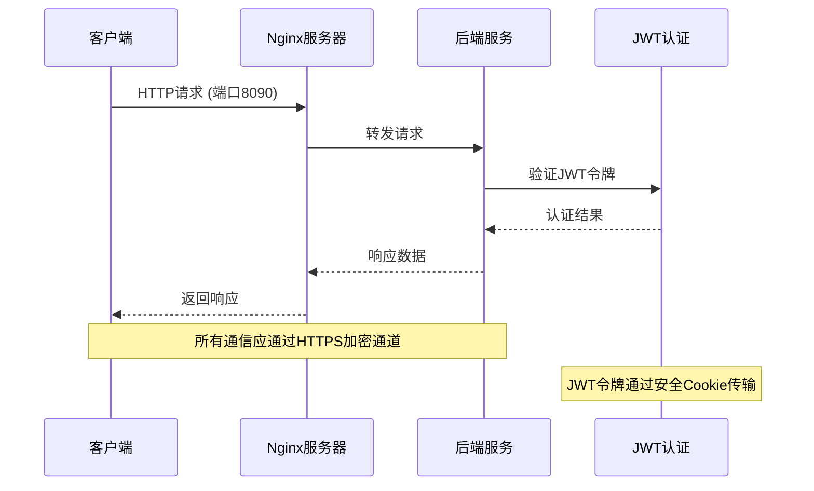
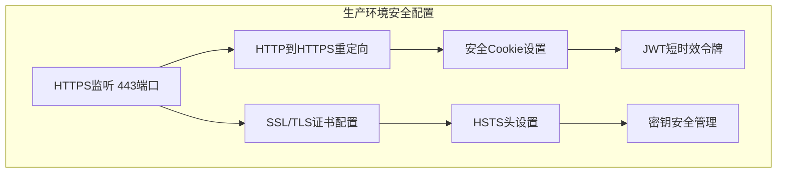

# 传输安全

## 目录
1. [引言](#引言)
2. [Nginx传输层安全配置](#nginx传输层安全配置)
3. [JWT令牌安全机制](#jwt令牌安全机制)
4. [HTTPS与JWT协同安全策略](#https与jwt协同安全策略)
5. [安全通信配置示例](#安全通信配置示例)
6. [安全审计检查清单](#安全审计检查清单)

## 引言
AgentChat系统通过Nginx反向代理和JWT令牌认证机制共同构建了完整的传输层安全体系。本系统采用Nginx作为前端反向代理服务器，负责处理所有客户端的HTTP/HTTPS请求，并通过JWT（JSON Web Token）实现用户身份认证和会话管理。尽管当前配置文件中未直接体现HTTPS强制重定向和SSL/TLS证书配置，但系统通过多层安全机制确保通信安全。本文将深入解析系统的传输层安全机制，包括Nginx的安全配置、JWT令牌的安全保障措施以及两者协同工作的安全策略。

## Nginx传输层安全配置



**图示来源**
- [nginx.conf](https://github.com/Shy2593666979/AgentChat/docker/nginx.conf#L1-L101)

**本节来源**
- [nginx.conf](https://github.com/Shy2593666979/AgentChat/docker/nginx.conf#L1-L101)
- [docker-compose.yml](https://github.com/Shy2593666979/AgentChat/docker/docker-compose.yml#L101-L103)

AgentChat系统的Nginx配置实现了多层安全防护机制，确保前端通信的安全性。Nginx服务器监听8090端口处理所有前端请求，通过一系列安全配置保护系统免受常见Web攻击。

Nginx配置中包含了多项关键安全设置：通过`server_tokens off`指令隐藏服务器版本信息，防止攻击者利用已知漏洞；设置`X-Frame-Options DENY`防止点击劫持攻击；通过`X-Content-Type-Options nosniff`防止MIME类型嗅探攻击；配置`X-XSS-Protection "1; mode=block"`启用浏览器的XSS过滤功能。这些HTTP安全头的设置构成了第一道安全防线。

在文件访问控制方面，Nginx配置了`location ~ /\.`规则，拒绝所有以点开头的隐藏文件访问，防止敏感配置文件（如.git、.env等）被意外暴露。同时，系统配置了健康检查端点`/health`，用于服务状态监控，该端点禁用了访问日志记录，减少日志文件的敏感信息暴露。

对于静态资源，Nginx实施了精细化的缓存策略：JavaScript、CSS、图片等静态资源设置1年的过期时间并标记为不可变，提高前端性能；而HTML文件则配置为不缓存，确保用户始终获取最新版本的应用程序。这种差异化的缓存策略在保证性能的同时，也确保了应用更新的及时性。

值得注意的是，当前Nginx配置仅监听HTTP端口8090，未配置HTTPS监听和HTTP到HTTPS的强制重定向。在生产环境中，建议补充SSL/TLS证书配置，启用HTTPS并设置HTTP到HTTPS的301重定向，以确保所有通信都通过加密通道进行。

## JWT令牌安全机制



**图示来源**
- [auth_jwt.py](https://github.com/Shy2593666979/AgentChat/src/backend/fastapi_jwt_auth/auth_jwt.py#L1-L849)
- [config.py](https://github.com/Shy2593666979/AgentChat/src/backend/fastapi_jwt_auth/config.py#L1-L85)
- [JWT.py](https://github.com/Shy2593666979/AgentChat/src/backend/agentchat/api/JWT.py#L1-L7)

**本节来源**
- [auth_jwt.py](https://github.com/Shy2593666979/AgentChat/src/backend/fastapi_jwt_auth/auth_jwt.py#L1-L849)
- [config.py](https://github.com/Shy2593666979/AgentChat/src/backend/fastapi_jwt_auth/config.py#L1-L85)
- [JWT.py](https://github.com/Shy2593666979/AgentChat/src/backend/agentchat/api/JWT.py#L1-L7)

AgentChat系统使用`fastapi-jwt-auth`库实现JWT令牌认证机制，通过多层安全措施保障令牌在传输过程中的安全性。JWT（JSON Web Token）是一种开放标准（RFC 7519），用于在各方之间安全地传输信息作为JSON对象。

系统采用HS256（HMAC SHA-256）作为默认的签名算法，这是一种对称加密算法，使用相同的密钥进行令牌的签名和验证。在`src/backend/fastapi_jwt_auth/config.py`文件中，`authjwt_algorithm`配置项默认设置为"HS256"，确保令牌的完整性和防篡改性。HS256算法通过密钥对令牌进行签名，任何对令牌内容的修改都会导致签名验证失败，从而防止令牌被篡改。

密钥管理是JWT安全的核心。系统通过`authjwt_secret_key`配置项管理签名密钥，在`src/backend/agentchat/api/JWT.py`文件中，该密钥默认设置为'secret'，但在生产环境中应通过环境变量或安全的密钥管理系统进行配置。在`docker-compose.yml`文件中，JWT密钥通过环境变量`JWT_SECRET_KEY`传递，其默认值为"your-super-secret-jwt-key-change-in-production"，明确提示在生产环境中必须更改此密钥。密钥的保密性至关重要，任何泄露都会导致整个认证系统的安全性崩溃。

令牌有效期控制是防止令牌长期暴露的关键机制。系统设置了合理的令牌过期时间：访问令牌（access token）默认有效期为15分钟，刷新令牌（refresh token）默认有效期为30天。这种短时效的访问令牌设计遵循了最小权限原则，即使令牌被截获，攻击者也只有很短的时间窗口可以利用。当访问令牌过期后，客户端可以使用刷新令牌获取新的访问令牌，而无需用户重新登录，平衡了安全性和用户体验。

为防止重放攻击，系统实现了多项防护策略。首先，每个令牌都包含唯一的JWT ID（jti）声明，通过`_get_jwt_identifier()`方法生成UUID，可用于实现令牌吊销机制。其次，系统支持CSRF（跨站请求伪造）保护，当`authjwt_cookie_csrf_protect`设置为True时，会在令牌中添加CSRF声明，并在Cookie中设置相应的CSRF令牌，防止跨站请求伪造攻击。此外，系统还支持令牌吊销列表（denylist），可通过`authjwt_denylist_enabled`配置启用，允许主动吊销已签发的令牌。

JWT在用户认证中的作用流程如下：用户登录成功后，服务器生成包含用户标识（subject）的访问令牌和刷新令牌，通过安全的HTTP Only Cookie返回给客户端；后续请求中，客户端在Cookie或Authorization头中携带访问令牌；服务器验证令牌的签名、有效期和声明，确认用户身份；当访问令牌过期时，客户端使用刷新令牌获取新的访问令牌；用户登出时，服务器将令牌加入吊销列表，确保令牌立即失效。

## HTTPS与JWT协同安全策略



**图示来源**
- [nginx.conf](https://github.com/Shy2593666979/AgentChat/docker/nginx.conf#L67-L70)
- [auth_jwt.py](https://github.com/Shy2593666979/AgentChat/src/backend/fastapi_jwt_auth/auth_jwt.py#L340-L352)
- [docker-compose.yml](https://github.com/Shy2593666979/AgentChat/docker/docker-compose.yml#L58-L59)

**本节来源**
- [nginx.conf](https://github.com/Shy2593666979/AgentChat/docker/nginx.conf#L67-L70)
- [auth_jwt.py](https://github.com/Shy2593666979/AgentChat/src/backend/fastapi_jwt_auth/auth_jwt.py#L340-L352)
- [docker-compose.yml](https://github.com/Shy2593666979/AgentChat/docker/docker-compose.yml#L58-L59)

AgentChat系统的安全架构依赖于Nginx和JWT的协同工作，共同构建了完整的传输层安全体系。尽管当前配置存在安全改进空间，但系统设计体现了多层防御的安全理念。

在理想的安全配置中，Nginx应作为HTTPS终止点，负责SSL/TLS加密解密，将所有HTTP请求重定向到HTTPS，并通过安全的HTTP头强化通信安全。然而，当前`nginx.conf`配置仅监听HTTP端口8090，未配置HTTPS监听和重定向规则。这是一个显著的安全隐患，因为所有通信（包括JWT令牌）都以明文形式传输，极易受到中间人攻击（Man-in-the-Middle Attack）。

中间人攻击是未加密通信的主要威胁。攻击者可以在客户端和服务器之间拦截通信，窃取JWT令牌，然后冒充合法用户访问系统。为防止此类攻击，必须确保所有通信都通过HTTPS加密通道进行。在生产环境中，应在Nginx配置中添加HTTPS监听（通常为443端口），配置SSL/TLS证书，并设置HTTP到HTTPS的301重定向。

JWT令牌的安全传输依赖于HTTPS加密。在当前配置中，JWT令牌通过Cookie传输，`auth_jwt.py`中的`set_access_cookies`方法设置了`httponly=True`属性，防止JavaScript访问Cookie，抵御XSS攻击。然而，`_cookie_secure`配置项默认为False，这意味着Cookie可以在非HTTPS连接上传输。在安全配置中，必须将此选项设置为True，确保Cookie仅通过安全的HTTPS连接传输。

系统还应实施HTTP安全头来增强安全性。虽然当前Nginx配置已设置了`X-Frame-Options`、`X-Content-Type-Options`和`X-XSS-Protection`，但缺少`Strict-Transport-Security`（HSTS）头。HSTS头指示浏览器只能通过HTTPS与服务器通信，即使用户手动输入HTTP地址也会自动转换为HTTPS，有效防止SSL剥离攻击。

在部署架构上，`docker-compose.yml`文件显示前端服务监听8090端口，后端API服务监听7860端口。这种分离架构允许Nginx专注于前端请求处理和安全防护，而后端服务专注于业务逻辑。但在生产环境中，建议将Nginx配置为HTTPS终止点，后端服务与Nginx之间的通信可以使用内部网络或更轻量级的安全机制。

## 安全通信配置示例



**图示来源**
- [nginx.conf](https://github.com/Shy2593666979/AgentChat/docker/nginx.conf#L67-L70)
- [auth_jwt.py](https://github.com/Shy2593666979/AgentChat/src/backend/fastapi_jwt_auth/auth_jwt.py#L349-L351)
- [config.py](https://github.com/Shy2593666979/AgentChat/src/backend/fastapi_jwt_auth/config.py#L35-L36)

**本节来源**
- [nginx.conf](https://github.com/Shy2593666979/AgentChat/docker/nginx.conf#L67-L70)
- [auth_jwt.py](https://github.com/Shy2593666979/AgentChat/src/backend/fastapi_jwt_auth/auth_jwt.py#L349-L351)
- [config.py](https://github.com/Shy2593666979/AgentChat/src/backend/fastapi_jwt_auth/config.py#L35-L36)

以下是AgentChat系统推荐的生产环境安全通信配置示例，结合了Nginx和JWT的最佳实践：

**Nginx HTTPS配置示例：**
```nginx
server {
    listen 80;
    server_name agentchat.example.com;
    return 301 https://$server_name$request_uri;
}

server {
    listen 443 ssl http2;
    server_name agentchat.example.com;
    
    ssl_certificate /etc/nginx/ssl/agentchat.crt;
    ssl_certificate_key /etc/nginx/ssl/agentchat.key;
    
    ssl_protocols TLSv1.2 TLSv1.3;
    ssl_ciphers ECDHE-RSA-AES256-GCM-SHA512:DHE-RSA-AES256-GCM-SHA512;
    ssl_prefer_server_ciphers off;
    
    add_header Strict-Transport-Security "max-age=31536000; includeSubDomains" always;
    add_header X-Frame-Options DENY;
    add_header X-Content-Type-Options nosniff;
    add_header X-XSS-Protection "1; mode=block";
    
    location / {
        proxy_pass http://backend:7860;
        proxy_set_header Host $host;
        proxy_set_header X-Real-IP $remote_addr;
        proxy_set_header X-Forwarded-For $proxy_add_x_forwarded_for;
        proxy_set_header X-Forwarded-Proto $scheme;
    }
}
```

**JWT安全配置示例：**
```python
class Settings(BaseSettings):
    authjwt_secret_key: str = os.getenv('JWT_SECRET_KEY', 'strong-secret-key-change-in-production')
    authjwt_token_location: list = ['cookies']
    authjwt_cookie_csrf_protect: bool = True
    authjwt_cookie_secure: bool = True
    authjwt_cookie_samesite: str = 'lax'
    authjwt_algorithm: str = 'HS256'
    authjwt_access_token_expires: int = 900  # 15分钟
    authjwt_refresh_token_expires: int = 2592000  # 30天
```

**Docker环境变量配置：**
```yaml
environment:
  JWT_SECRET_KEY: ${JWT_SECRET_KEY}
  # 其他安全相关环境变量
```

此配置示例实现了全面的安全防护：HTTP到HTTPS的强制重定向确保所有通信都通过加密通道；TLSv1.2+协议和强加密套件防止降级攻击；HSTS头防止SSL剥离；安全Cookie设置（Secure、HttpOnly、SameSite）防止令牌泄露；合理的令牌有效期平衡安全与用户体验；密钥通过环境变量管理，避免硬编码。

## 安全审计检查清单

**本节来源**
- [nginx.conf](https://github.com/Shy2593666979/AgentChat/docker/nginx.conf#L1-L101)
- [auth_jwt.py](https://github.com/Shy2593666979/AgentChat/src/backend/fastapi_jwt_auth/auth_jwt.py#L1-L849)
- [config.py](https://github.com/Shy2593666979/AgentChat/src/backend/fastapi_jwt_auth/config.py#L1-L85)
- [docker-compose.yml](https://github.com/Shy2593666979/AgentChat/docker/docker-compose.yml#L69-L70)

以下是AgentChat系统传输层安全的审计检查清单，用于评估和验证系统的安全性：

### Nginx配置审计
- [ ] 是否配置了HTTPS监听（443端口）？
- [ ] 是否设置了HTTP到HTTPS的301重定向？
- [ ] 是否正确配置了SSL/TLS证书和私钥？
- [ ] 是否使用了安全的TLS协议版本（TLSv1.2或更高）？
- [ ] 是否配置了强加密套件（如ECDHE-RSA-AES256-GCM-SHA512）？
- [ ] 是否设置了HSTS头（Strict-Transport-Security）？
- [ ] 是否隐藏了服务器版本信息（server_tokens off）？
- [ ] 是否设置了X-Frame-Options防止点击劫持？
- [ ] 是否设置了X-Content-Type-Options防止MIME嗅探？
- [ ] 是否设置了X-XSS-Protection启用XSS过滤？
- [ ] 是否禁止了隐藏文件的访问？
- [ ] 是否对静态资源实施了适当的缓存策略？

### JWT配置审计
- [ ] JWT密钥是否通过环境变量或安全密钥管理系统配置？
- [ ] JWT密钥是否足够长且随机（建议至少32字符）？
- [ ] 是否使用了安全的签名算法（如HS256、RS256）？
- [ ] 访问令牌有效期是否合理（建议15-30分钟）？
- [ ] 刷新令牌有效期是否合理（建议7-30天）？
- [ ] 是否启用了令牌吊销机制？
- [ ] Cookie是否设置了Secure属性（仅HTTPS传输）？
- [ ] Cookie是否设置了HttpOnly属性（防止JavaScript访问）？
- [ ] Cookie是否设置了SameSite属性（建议Lax或Strict）？
- [ ] 是否启用了CSRF保护机制？
- [ ] 是否验证了令牌的签发者（issuer）和受众（audience）？
- [ ] 是否实现了适当的错误处理和日志记录？

### 部署与运维审计
- [ ] 生产环境是否使用了独立的、强随机的JWT密钥？
- [ ] 是否定期轮换JWT密钥？
- [ ] 是否监控和记录认证相关的安全事件？
- [ ] 是否定期更新和修补Nginx和依赖库？
- [ ] 是否实施了网络隔离，限制后端服务的直接访问？
- [ ] 是否配置了适当的防火墙规则？
- [ ] 是否实施了入侵检测和防御系统？
- [ ] 是否定期进行安全审计和渗透测试？

通过系统性地检查以上项目，可以确保AgentChat系统的传输层安全达到生产环境的要求，有效防止中间人攻击、会话劫持和其他常见的Web安全威胁。
