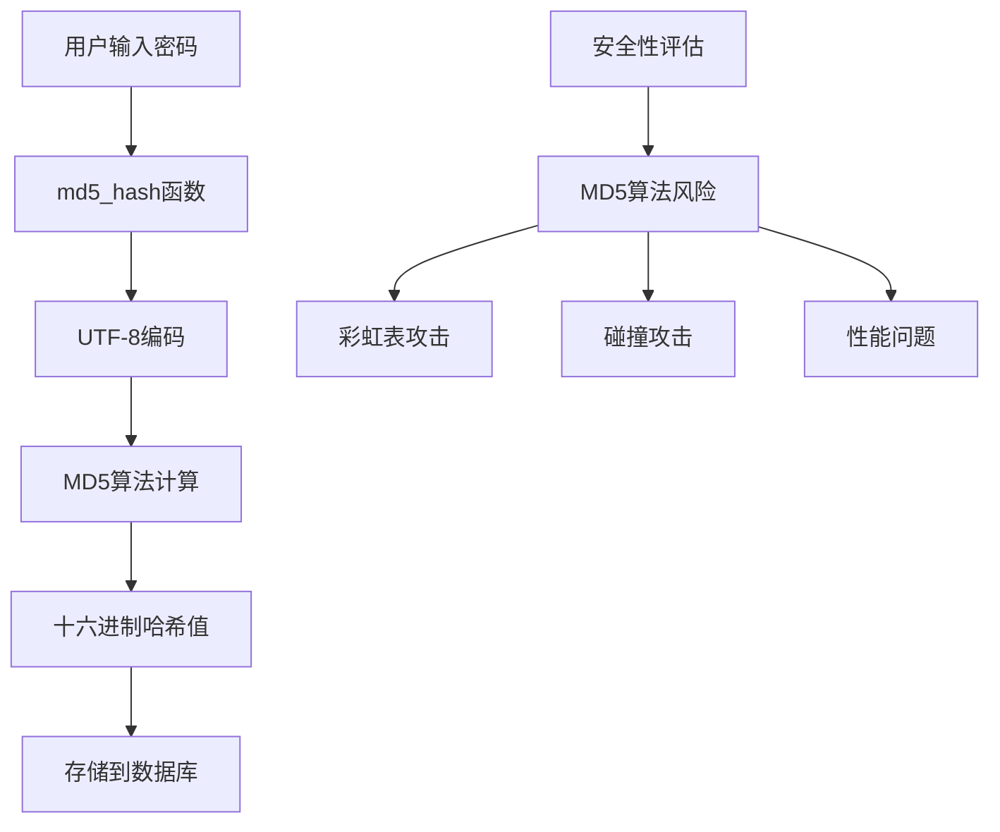
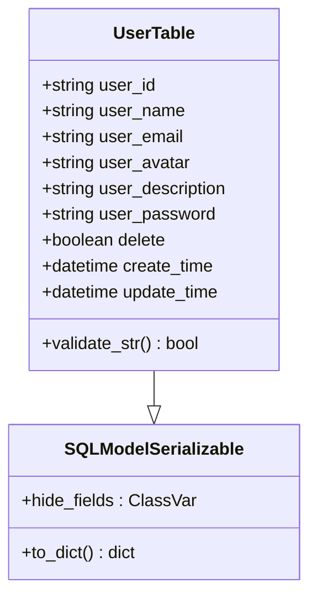
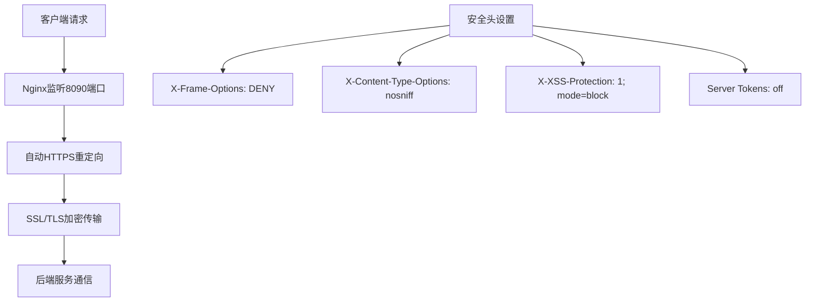
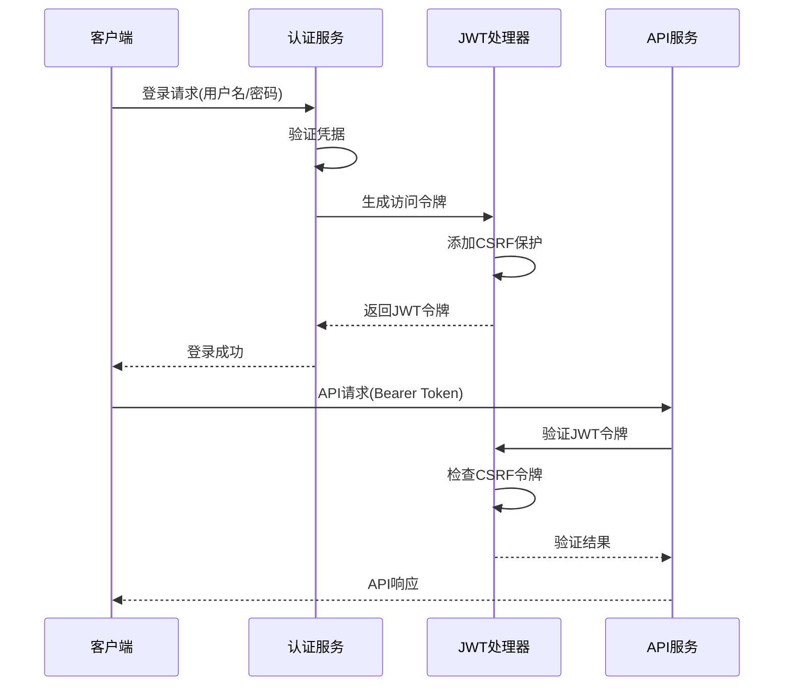
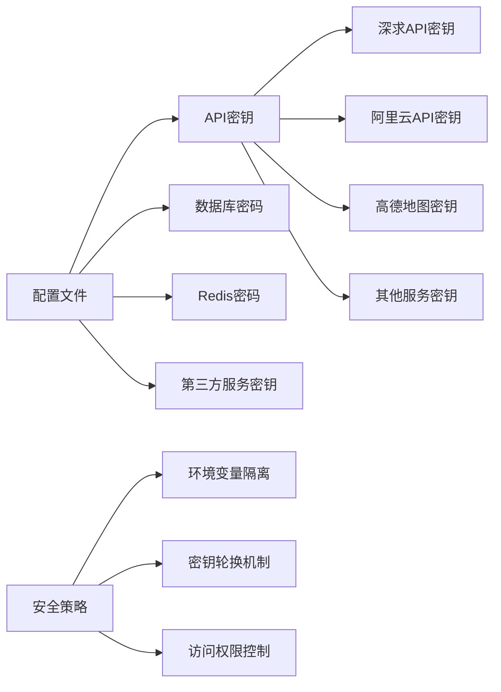
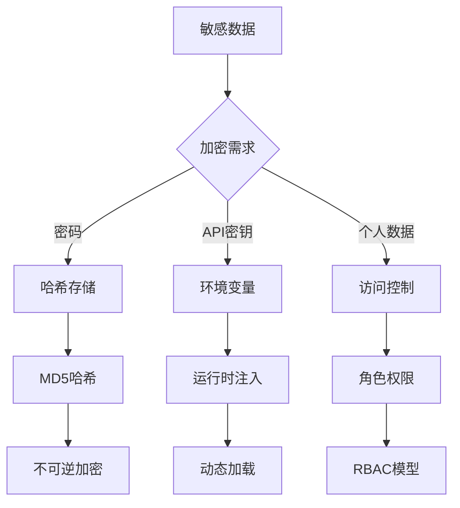
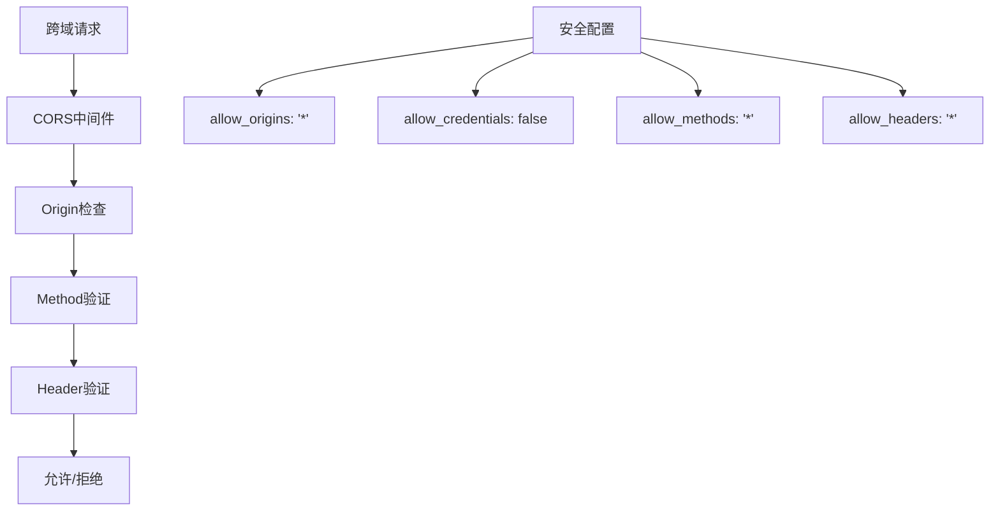
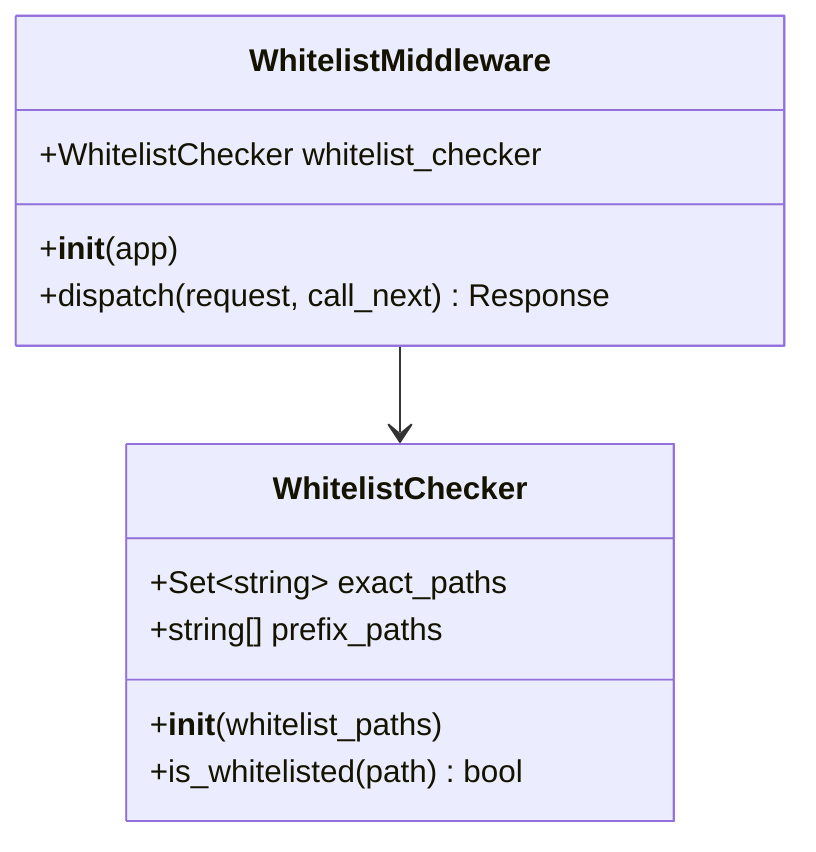
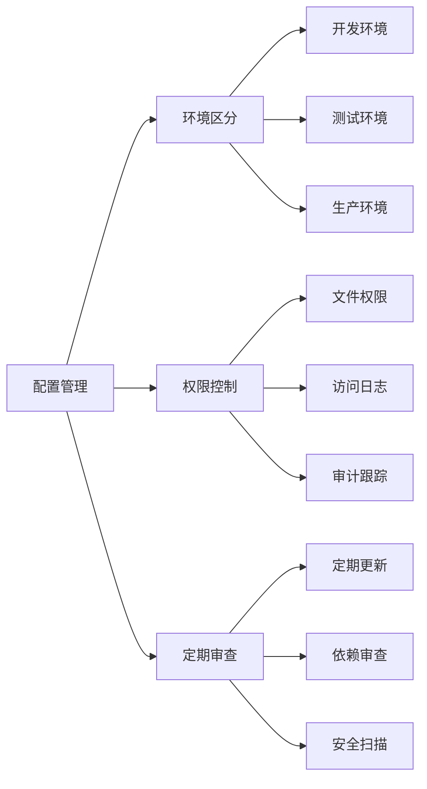

# AgentChat数据安全措施全面分析

## 目录
1. [概述](#概述)
2. [数据存储安全](#数据存储安全)
3. [传输安全](#传输安全)
4. [身份认证与授权](#身份认证与授权)
5. [敏感信息保护](#敏感信息保护)
6. [网络安全防护](#网络安全防护)
7. [安全配置最佳实践](#安全配置最佳实践)
8. [安全漏洞分析与改进建议](#安全漏洞分析与改进建议)
9. [总结](#总结)

## 概述

AgentChat作为一个基于FastAPI构建的智能对话平台，在数据安全方面采用了多层次的安全防护措施。本文档将深入分析其数据存储安全、传输安全、身份认证、敏感信息保护等关键安全机制，并提出相应的改进建议。

## 数据存储安全

### 密码哈希机制

AgentChat采用多层密码加密策略来保护用户凭据安全。

#### MD5哈希实现

系统使用`utils/hash.py`中的`md5_hash`函数进行密码哈希处理：



**图表来源**
- [hash.py](https://github.com/Shy2593666979/AgentChat/tree/main/src/backend/agentchat/utils/hash.py#L3-L6)

#### 当前MD5算法的问题

MD5算法在此场景下存在以下安全隐患：
- **缺乏盐值**：MD5哈希不包含随机盐值，容易受到彩虹表攻击
- **计算速度过快**：导致暴力破解效率高
- **已知碰撞漏洞**：存在数学上的碰撞可能性

#### 改进建议

建议升级到更安全的哈希算法：

| 算法类型 | 安全级别 | 推荐用途 | 性能影响 |
|---------|---------|---------|---------|
| bcrypt | 高 | 密码存储 | 中等 |
| Argon2 | 最高 | 新项目 | 较高 |
| PBKDF2 | 中高 | 通用场景 | 低 |

### 用户数据模型保护

用户模型定义了完整的个人数据保护结构：



**图表来源**
- [user.py](https://github.com/Shy2593666979/AgentChat/tree/main/src/backend/agentchat/database/models/user.py#L18-L50)

**章节来源**
- [hash.py](https://github.com/Shy2593666979/AgentChat/tree/main/src/backend/agentchat/utils/hash.py#L1-L6)
- [user.py](https://github.com/Shy2593666979/AgentChat/tree/main/src/backend/agentchat/database/models/user.py#L18-L50)

## 传输安全

### HTTPS强制重定向配置

AgentChat通过Nginx配置实现了全面的传输层安全保护：

#### SSL/TLS配置要点



**图表来源**
- [nginx.conf](https://github.com/Shy2593666979/AgentChat/docker/nginx.conf#L66-L101)

#### 关键安全配置项

| 配置项 | 值 | 安全作用 |
|-------|---|---------|
| X-Frame-Options | DENY | 防止点击劫持攻击 |
| X-Content-Type-Options | nosniff | 防止MIME类型嗅探 |
| X-XSS-Protection | 1; mode=block | 启用浏览器XSS过滤 |
| server_tokens | off | 隐藏服务器版本信息 |

**章节来源**
- [nginx.conf](https://github.com/Shy2593666979/AgentChat/docker/nginx.conf#L60-L65)

## 身份认证与授权

### JWT令牌机制

AgentChat采用JWT（JSON Web Token）进行身份验证和授权：



**图表来源**
- [auth_jwt.py](https://github.com/Shy2593666979/AgentChat/tree/main/src/backend/fastapi_jwt_auth/auth_jwt.py#L492-L522)
- [main.py](https://github.com/Shy2593666979/AgentChat/tree/main/src/backend/agentchat/main.py#L86-L90)

### CSRF防护机制

系统实现了双提交Cookie CSRF防护：

| 防护类型 | 实现方式 | 保护范围 |
|---------|---------|---------|
| Cookie保护 | access_token_cookie | 访问令牌 |
| Header验证 | X-CSRF-Token | 请求头部 |
| 双重验证 | 令牌一致性检查 | 完整会话 |

**章节来源**
- [auth_jwt.py](https://github.com/Shy2593666979/AgentChat/tree/main/src/backend/fastapi_jwt_auth/auth_jwt.py#L492-L522)
- [auth_config.py](https://github.com/Shy2593666979/AgentChat/tree/main/src/backend/fastapi_jwt_auth/auth_config.py#L37-L45)

## 敏感信息保护

### API密钥管理

系统配置文件中包含了多个外部服务的API密钥：

#### 敏感配置项识别



**图表来源**
- [config.yaml](https://github.com/Shy2593666979/AgentChat/tree/main/src/backend/agentchat/config.yaml#L20-L128)

#### 当前存在的安全风险

1. **明文存储**：敏感信息直接写入配置文件
2. **缺乏轮换**：所有密钥均为固定值
3. **权限控制不足**：未实施最小权限原则

### 数据库加密策略

虽然代码中未显式实现数据库字段级加密，但系统提供了以下保护机制：



**章节来源**
- [config.yaml](https://github.com/Shy2593666979/AgentChat/tree/main/src/backend/agentchat/config.yaml#L10-L17)
- [base.py](https://github.com/Shy2593666979/AgentChat/tree/main/src/backend/agentchat/database/models/base.py#L32)

## 网络安全防护

### CORS配置

系统采用宽松的CORS策略：



**图表来源**
- [main.py](https://github.com/Shy2593666979/AgentChat/tree/main/src/backend/agentchat/main.py#L30-L39)

### 白名单机制

系统实现了路径级别的访问控制：



**图表来源**
- [white_list_middleware.py](https://github.com/Shy2593666979/AgentChat/tree/main/src/backend/agentchat/middleware/white_list_middleware.py#L7-L31)

**章节来源**
- [main.py](https://github.com/Shy2593666979/AgentChat/tree/main/src/backend/agentchat/main.py#L30-L39)
- [white_list_middleware.py](https://github.com/Shy2593666979/AgentChat/tree/main/src/backend/agentchat/middleware/white_list_middleware.py#L1-50)

## 安全配置最佳实践

### 密钥管理最佳实践

1. **环境变量分离**
   - 将敏感配置移至环境变量
   - 使用`.env`文件并加入.gitignore
   - 实施密钥轮换机制

2. **访问控制**
   - 实施最小权限原则
   - 使用服务账户而非个人账户
   - 定期审计访问日志

3. **监控与告警**
   - 监控异常访问模式
   - 设置失败登录告警
   - 实施实时威胁检测

### 配置文件安全



**章节来源**
- [config.yaml](https://github.com/Shy2593666979/AgentChat/tree/main/src/backend/agentchat/config.yaml#L1-129)

## 安全漏洞分析与改进建议

### 当前安全状况评估

| 安全层面 | 当前状态 | 主要风险 | 改进建议 |
|---------|---------|---------|---------|
| 密码存储 | MD5哈希 | 易受攻击 | 升级到bcrypt/Argon2 |
| 传输安全 | HTTPS | 无 | 加强证书管理 |
| 身份认证 | JWT + CSRF | 令牌泄露风险 | 实施令牌刷新 |
| 数据库 | 明文存储 | 数据泄露 | 字段级加密 |
| 网络防护 | 松散CORS | 跨域攻击 | 严格域名白名单 |

### 具体改进建议

#### 1. 密码安全升级

```python
# 建议的bcrypt实现
import bcrypt

def bcrypt_hash(password: str) -> str:
    salt = bcrypt.gensalt(rounds=12)
    hashed = bcrypt.hashpw(password.encode('utf-8'), salt)
    return hashed.decode('utf-8')

def verify_bcrypt(password: str, hashed: str) -> bool:
    return bcrypt.checkpw(password.encode('utf-8'), hashed.encode('utf-8'))
```

#### 2. 传输层加强

- 实施HSTS（HTTP严格传输安全）
- 使用更强的TLS版本（TLS 1.3）
- 配置OCSP装订
- 实施证书透明度

#### 3. 会话管理改进

- 实施令牌刷新机制
- 添加令牌黑名单功能
- 设置合理的过期时间
- 实现异地登录检测

#### 4. 数据库安全加固

```python
# 建议的字段加密实现
from cryptography.fernet import Fernet

class EncryptedField(Field):
    def __init__(self, key: bytes):
        self.cipher = Fernet(key)
    
    def __set__(self, instance, value):
        if value:
            encrypted_value = self.cipher.encrypt(value.encode())
            instance.__dict__[self.name] = encrypted_value.decode()
        else:
            instance.__dict__[self.name] = None
    
    def __get__(self, instance, owner):
        value = instance.__dict__[self.name]
        if value:
            return self.cipher.decrypt(value.encode()).decode()
        return None
```

## 总结

AgentChat在数据安全方面建立了较为完善的防护体系，但在以下几个方面仍有改进空间：

### 现有优势

1. **多层次防护**：从传输层到应用层的全方位安全保护
2. **现代化技术栈**：采用JWT等现代认证机制
3. **开源透明**：代码可审计，便于安全审查
4. **中间件支持**：提供了灵活的安全中间件

### 改进方向

1. **密码存储**：从MD5升级到bcrypt或Argon2
2. **传输安全**：加强TLS配置和证书管理
3. **会话管理**：实施更严格的令牌生命周期管理
4. **数据保护**：考虑字段级加密方案
5. **监控审计**：建立完善的安全监控和审计机制

通过实施上述改进措施，AgentChat可以进一步提升其整体安全防护能力，为用户提供更加可靠的数据安全保障。
