# AgentChat中JWT令牌的完整生命周期管理

## 目录
1. [简介](#简介)
2. [项目架构概览](#项目架构概览)
3. [核心组件分析](#核心组件分析)
4. [令牌生成机制](#令牌生成机制)
5. [令牌验证流程](#令牌验证流程)
6. [用户登录流程](#用户登录流程)
7. [令牌刷新与失效处理](#令牌刷新与失效处理)
8. [异常处理策略](#异常处理策略)
9. [性能考虑](#性能考虑)
10. [故障排除指南](#故障排除指南)
11. [总结](#总结)

## 简介

AgentChat采用基于JWT（JSON Web Token）的身份认证机制，为用户提供安全可靠的会话管理。系统实现了完整的JWT生命周期管理，包括令牌生成、验证、刷新和失效处理，确保用户在使用平台功能时的安全性和连续性。

本文档深入解析AgentChat中JWT令牌的完整生命周期管理，涵盖从用户登录到会话结束的全过程，详细说明AuthJWT类的核心功能、令牌结构设计、验证机制以及异常处理策略。

## 项目架构概览

AgentChat的JWT认证系统采用分层架构设计，主要包含以下层次：

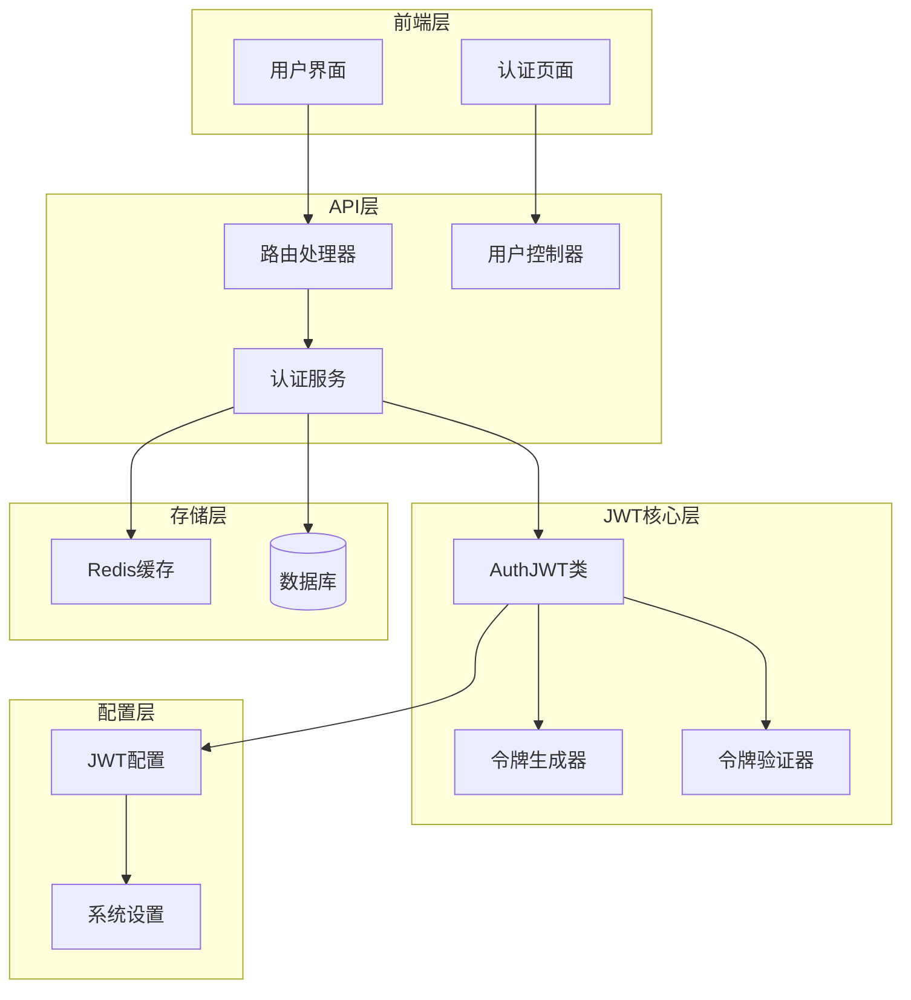

**图表来源**
- [auth_jwt.py](https://github.com/Shy2593666979/AgentChat/src/backend/fastapi_jwt_auth/auth_jwt.py#L18-L30)
- [user.py](https://github.com/Shy2593666979/AgentChat/src/backend/agentchat/api/v1/user.py#L1-L20)

## 核心组件分析

### AuthJWT类架构

AuthJWT类是JWT认证系统的核心，继承自AuthConfig，提供了完整的令牌管理功能：

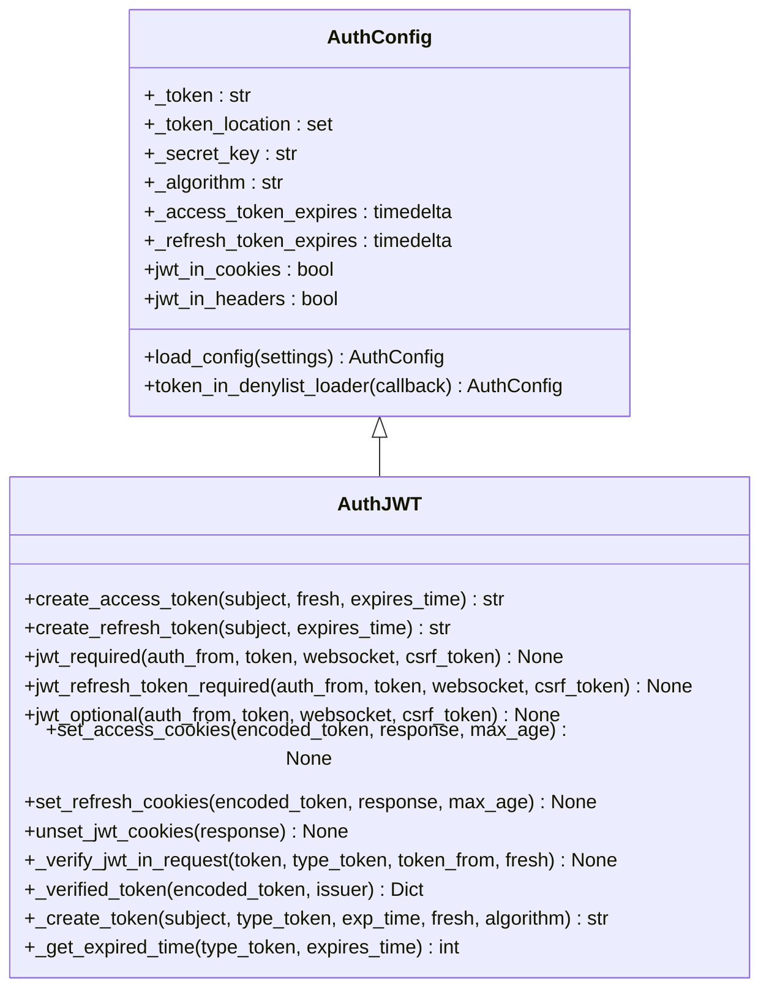

**图表来源**
- [auth_jwt.py](https://github.com/Shy2593666979/AgentChat/src/backend/fastapi_jwt_auth/auth_jwt.py#L18-L30)
- [auth_config.py](https://github.com/Shy2593666979/AgentChat/src/backend/fastapi_jwt_auth/auth_config.py#L6-L54)

### 配置参数详解

系统支持丰富的配置选项，主要包括：

| 配置项 | 默认值 | 描述 |
|--------|--------|------|
| authjwt_secret_key | 'secret' | 对称加密密钥 |
| authjwt_token_location | ['cookies', 'headers'] | 令牌存储位置 |
| authjwt_cookie_csrf_protect | False | CSRF保护开关 |
| authjwt_access_token_expires | timedelta(minutes=15) | 访问令牌过期时间 |
| authjwt_refresh_token_expires | timedelta(days=30) | 刷新令牌过期时间 |

**节来源**
- [auth_config.py](https://github.com/Shy2593666979/AgentChat/src/backend/fastapi_jwt_auth/auth_config.py#L6-L54)
- [JWT.py](https://github.com/Shy2593666979/AgentChat/src/backend/agentchat/utils/JWT.py#L7-L18)

## 令牌生成机制

### 访问令牌生成

访问令牌（Access Token）用于保护API端点，具有较短的过期时间：

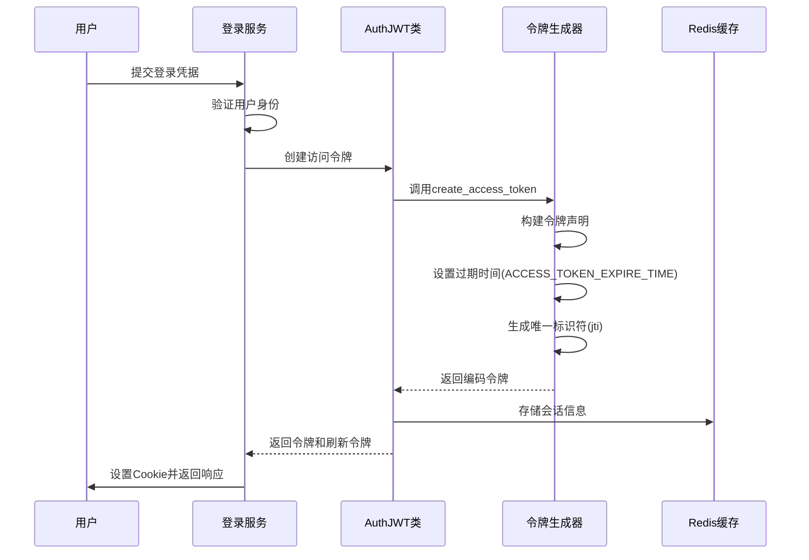

**图表来源**
- [user.py](https://github.com/Shy2593666979/AgentChat/src/backend/agentchat/api/services/user.py#L146-L157)
- [auth_jwt.py](https://github.com/Shy2593666979/AgentChat/src/backend/fastapi_jwt_auth/auth_jwt.py#L254-L280)

### 刷新令牌生成

刷新令牌（Refresh Token）用于在访问令牌过期后获取新的访问令牌：

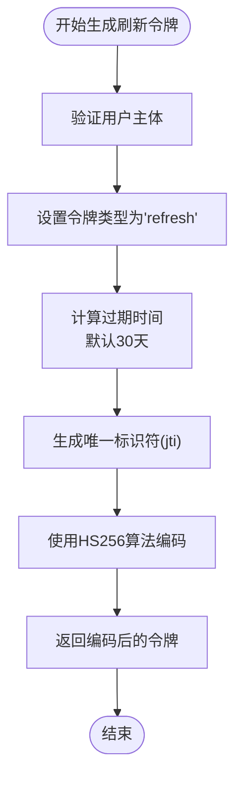

**图表来源**
- [auth_jwt.py](https://github.com/Shy2593666979/AgentChat/src/backend/fastapi_jwt_auth/auth_jwt.py#L282-L305)

### 令牌声明结构

JWT令牌包含以下关键声明：

| 声明名称 | 类型 | 描述 |
|----------|------|------|
| sub | string/int | 用户标识符 |
| iat | integer | 发行时间戳 |
| nbf | integer | 生效时间戳 |
| exp | integer | 过期时间戳 |
| jti | string | 唯一标识符 |
| type | string | 令牌类型(access/refresh) |
| fresh | boolean | 是否为新鲜令牌 |
| csrf | string | CSRF保护令牌 |

**节来源**
- [auth_jwt.py](https://github.com/Shy2593666979/AgentChat/src/backend/fastapi_jwt_auth/auth_jwt.py#L159-L181)

## 令牌验证流程

### 核心验证方法

系统提供了多个验证方法来确保令牌的有效性：

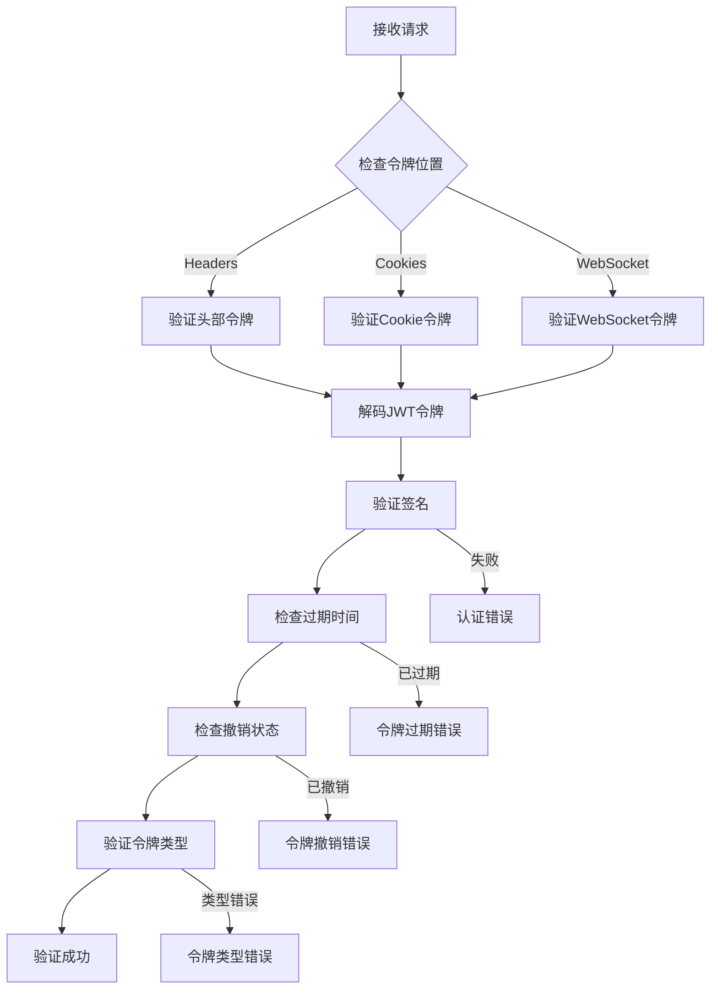

**图表来源**
- [auth_jwt.py](https://github.com/Shy2593666979/AgentChat/src/backend/fastapi_jwt_auth/auth_jwt.py#L587-L627)
- [auth_jwt.py](https://github.com/Shy2593666979/AgentChat/src/backend/fastapi_jwt_auth/auth_jwt.py#L627-L669)

### _verify_jwt_in_request方法

这是核心的令牌验证方法，负责完整的验证流程：

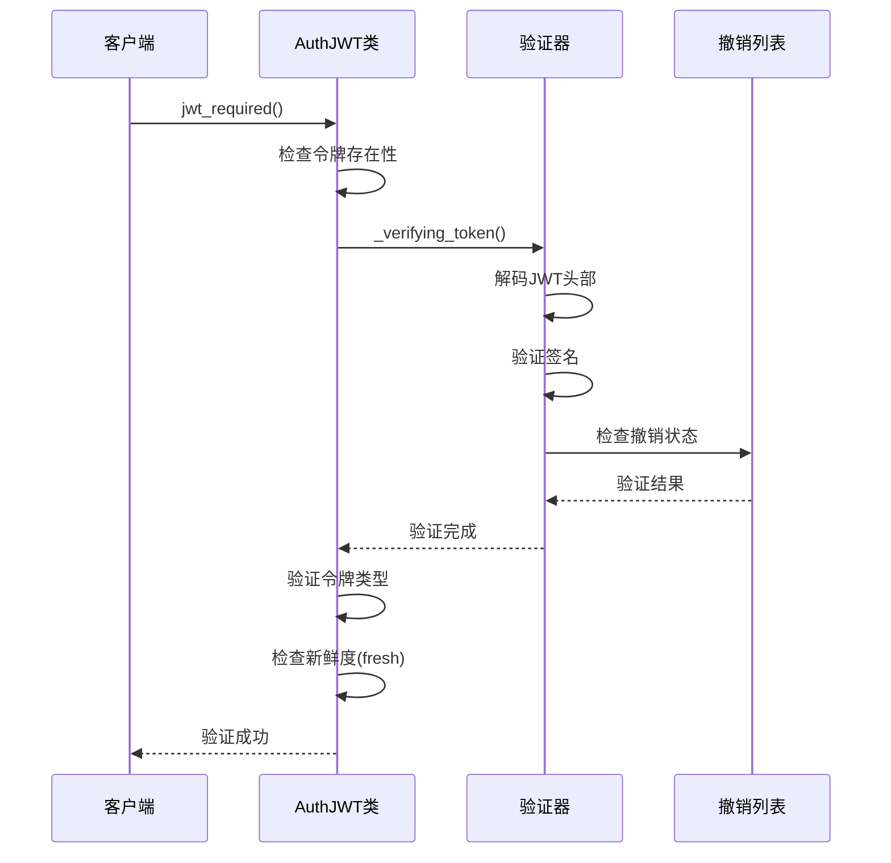

**图表来源**
- [auth_jwt.py](https://github.com/Shy2593666979/AgentChat/src/backend/fastapi_jwt_auth/auth_jwt.py#L587-L627)

**节来源**
- [auth_jwt.py](https://github.com/Shy2593666979/AgentChat/src/backend/fastapi_jwt_auth/auth_jwt.py#L587-L627)

## 用户登录流程

### 登录过程详解

用户登录时的完整流程如下：

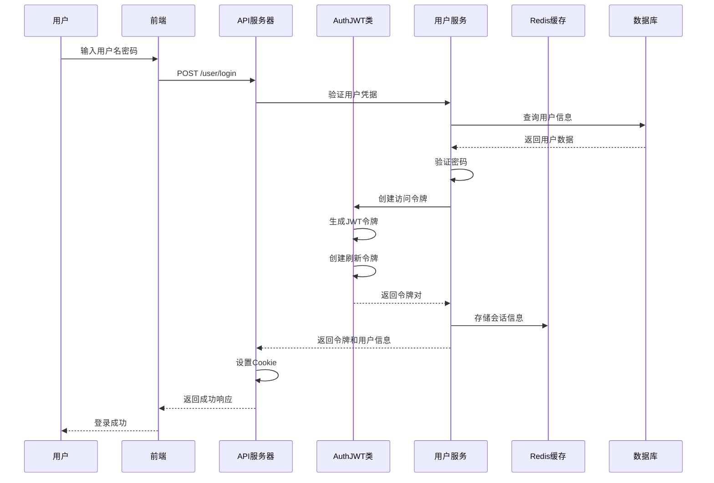

**图表来源**
- [user.py](https://github.com/Shy2593666979/AgentChat/src/backend/agentchat/api/v1/user.py#L51-L77)
- [user.py](https://github.com/Shy2593666979/AgentChat/src/backend/agentchat/api/services/user.py#L146-L157)

### 令牌设置机制

登录成功后，系统自动设置JWT Cookie：

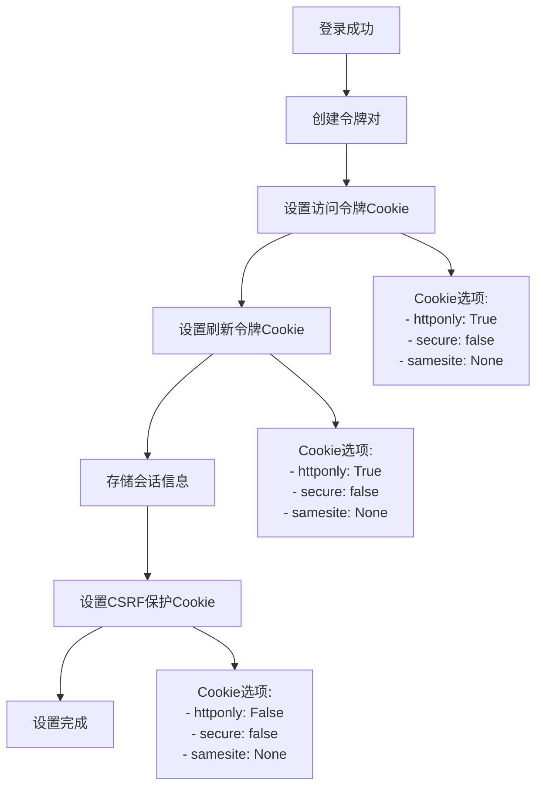

**图表来源**
- [auth_jwt.py](https://github.com/Shy2593666979/AgentChat/src/backend/fastapi_jwt_auth/auth_jwt.py#L316-L417)

**节来源**
- [user.py](https://github.com/Shy2593666979/AgentChat/src/backend/agentchat/api/v1/user.py#L51-L77)
- [auth_jwt.py](https://github.com/Shy2593666979/AgentChat/src/backend/fastapi_jwt_auth/auth_jwt.py#L316-L417)

## 令牌刷新与失效处理

### 令牌刷新机制

当访问令牌即将过期时，客户端可以使用刷新令牌获取新的访问令牌：

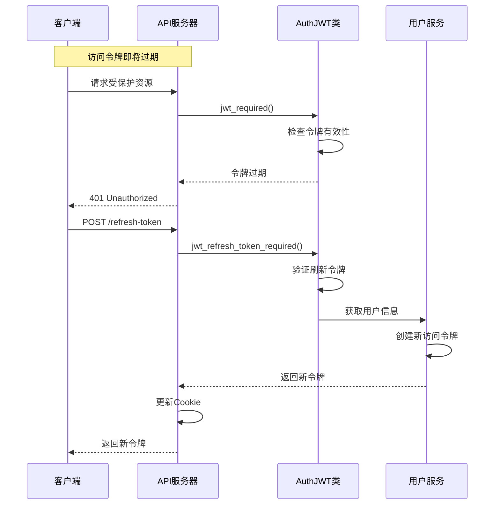

**图表来源**
- [auth_jwt.py](https://github.com/Shy2593666979/AgentChat/src/backend/fastapi_jwt_auth/auth_jwt.py#L739-L771)

### 令牌失效处理

系统提供了多种令牌失效处理机制：

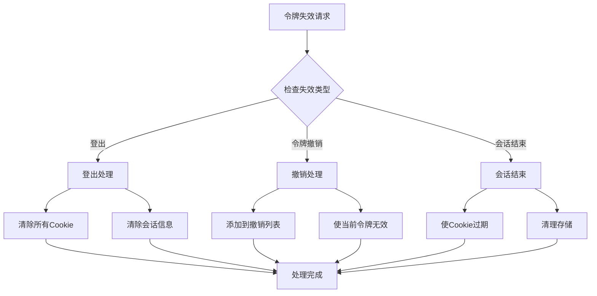

**图表来源**
- [auth_jwt.py](https://github.com/Shy2593666979/AgentChat/src/backend/fastapi_jwt_auth/auth_jwt.py#L418-L484)

**节来源**
- [auth_jwt.py](https://github.com/Shy2593666979/AgentChat/src/backend/fastapi_jwt_auth/auth_jwt.py#L418-L484)

## 异常处理策略

### JWT异常类型

系统定义了多种JWT相关的异常类型：

| 异常类型 | 状态码 | 描述 |
|----------|--------|------|
| MissingTokenError | 401/1008 | 缺少必需的令牌 |
| InvalidHeaderError | 422 | 无效的头部格式 |
| JWTDecodeError | 422 | JWT解码失败 |
| AccessTokenRequired | 422 | 需要访问令牌 |
| RefreshTokenRequired | 422 | 需要刷新令牌 |
| FreshTokenRequired | 401 | 需要新鲜令牌 |
| RevokedTokenError | 401 | 令牌已被撤销 |
| CSRFError | 401 | CSRF令牌不匹配 |

**节来源**
- [exceptions.py](https://github.com/Shy2593666979/AgentChat/src/backend/fastapi_jwt_auth/exceptions.py#L47-L72)

### 异常处理流程

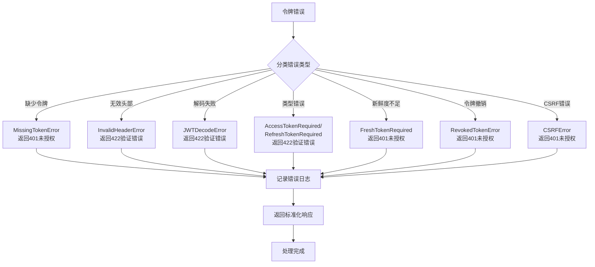

**图表来源**
- [auth_jwt.py](https://github.com/Shy2593666979/AgentChat/src/backend/fastapi_jwt_auth/auth_jwt.py#L587-L627)

## 性能考虑

### 令牌验证优化

为了提高性能，系统采用了以下优化策略：

1. **缓存机制**：频繁访问的令牌信息存储在Redis中
2. **异步验证**：使用异步方式处理令牌验证
3. **批量检查**：对多个令牌进行批量验证
4. **智能过期**：动态计算过期时间，避免不必要的验证

### 内存管理

系统在内存使用方面进行了优化：
- 及时释放不再使用的令牌对象
- 使用弱引用避免循环引用
- 定期清理过期的缓存数据

## 故障排除指南

### 常见问题及解决方案

| 问题 | 可能原因 | 解决方案 |
|------|----------|----------|
| 令牌验证失败 | 密钥不匹配 | 检查authjwt_secret_key配置 |
| 令牌过期 | 时间同步问题 | 同步服务器时间 |
| CSRF错误 | 双重提交令牌不匹配 | 检查CSRF保护配置 |
| Cookie设置失败 | 安全设置冲突 | 调整Cookie安全选项 |
| 令牌撤销错误 | 撤销列表配置错误 | 检查denylist回调函数 |

### 调试技巧

1. **启用调试模式**：设置DEBUG=True查看详细日志
2. **检查配置**：验证所有JWT相关配置项
3. **监控性能**：使用性能监控工具跟踪令牌验证时间
4. **日志分析**：分析错误日志定位问题根源

**节来源**
- [auth_jwt.py](https://github.com/Shy2593666979/AgentChat/src/backend/fastapi_jwt_auth/auth_jwt.py#L627-L669)

## 总结

AgentChat的JWT认证系统提供了完整、安全、高效的令牌生命周期管理。通过AuthJWT类的精心设计，系统实现了：

1. **完整的令牌管理**：从生成到失效的全流程控制
2. **灵活的配置选项**：支持多种部署场景和安全需求
3. **强大的验证机制**：多层次的安全验证保障
4. **优雅的异常处理**：清晰的错误信息和恢复策略
5. **优秀的性能表现**：优化的验证流程和缓存机制

该系统不仅满足了当前的功能需求，还为未来的扩展和升级预留了充足的空间，是构建现代Web应用认证系统的优秀范例。
