# 令牌生成机制

<cite>
**本文档中引用的文件**
- [JWT.py](https://github.com/Shy2593666979/AgentChat/src/backend/agentchat/api/JWT.py)
- [JWT.py](https://github.com/Shy2593666979/AgentChat/src/backend/agentchat/utils/JWT.py)
- [user.py](https://github.com/Shy2593666979/AgentChat/src/backend/agentchat/api/services/user.py)
- [user.py](https://github.com/Shy2593666979/AgentChat/src/backend/agentchat/api/v1/user.py)
- [auth_jwt.py](https://github.com/Shy2593666979/AgentChat/src/backend/fastapi_jwt_auth/auth_jwt.py)
- [config.py](https://github.com/Shy2593666979/AgentChat/src/backend/fastapi_jwt_auth/config.py)
- [auth_config.py](https://github.com/Shy2593666979/AgentChat/src/backend/fastapi_jwt_auth/auth_config.py)
- [login.vue](https://github.com/Shy2593666979/AgentChat/src/frontend/src/pages/login/login.vue)
</cite>

## 目录
1. [简介](#简介)
2. [项目架构概览](#项目架构概览)
3. [核心组件分析](#核心组件分析)
4. [JWT配置系统](#jwt配置系统)
5. [令牌生成流程详解](#令牌生成流程详解)
6. [用户登录接口实现](#用户登录接口实现)
7. [安全机制与最佳实践](#安全机制与最佳实践)
8. [性能考虑](#性能考虑)
9. [故障排除指南](#故障排除指南)
10. [总结](#总结)

## 简介

AgentChat采用基于JWT（JSON Web Token）的身份验证机制来管理用户会话。该系统实现了完整的访问令牌和刷新令牌生成、验证和管理流程，支持Cookie和Header两种令牌存储方式，并集成了CSRF保护机制以确保安全性。

本文档深入解析了AgentChat中JWT令牌的生成过程，重点关注`get_user_jwt`函数的工作原理，访问令牌的过期时间配置，以及令牌签名机制的实现细节。

## 项目架构概览

AgentChat的JWT认证系统采用分层架构设计，主要包含以下层次：

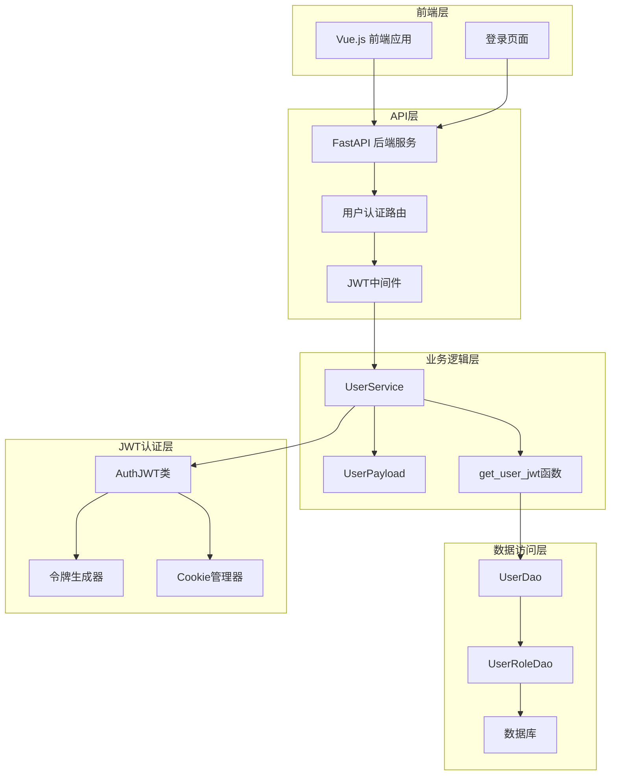

**图表来源**
- [user.py](https://github.com/Shy2593666979/AgentChat/src/backend/agentchat/api/v1/user.py#L50-L77)
- [user.py](https://github.com/Shy2593666979/AgentChat/src/backend/agentchat/api/services/user.py#L145-L157)
- [auth_jwt.py](https://github.com/Shy2593666979/AgentChat/src/backend/fastapi_jwt_auth/auth_jwt.py#L17-L847)

## 核心组件分析

### AuthJWT类架构

`AuthJWT`类是JWT认证系统的核心组件，继承自`AuthConfig`类，提供了完整的JWT令牌生成功能：

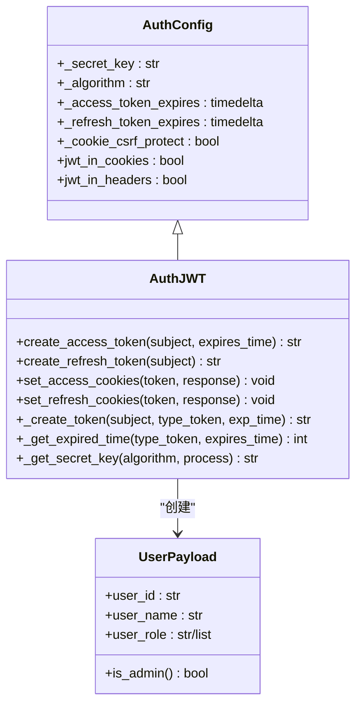

**图表来源**
- [auth_jwt.py](https://github.com/Shy2593666979/AgentChat/src/backend/fastapi_jwt_auth/auth_jwt.py#L17-L847)
- [user.py](https://github.com/Shy2593666979/AgentChat/src/backend/agentchat/api/services/user.py#L23-L41)

### 令牌生成流程

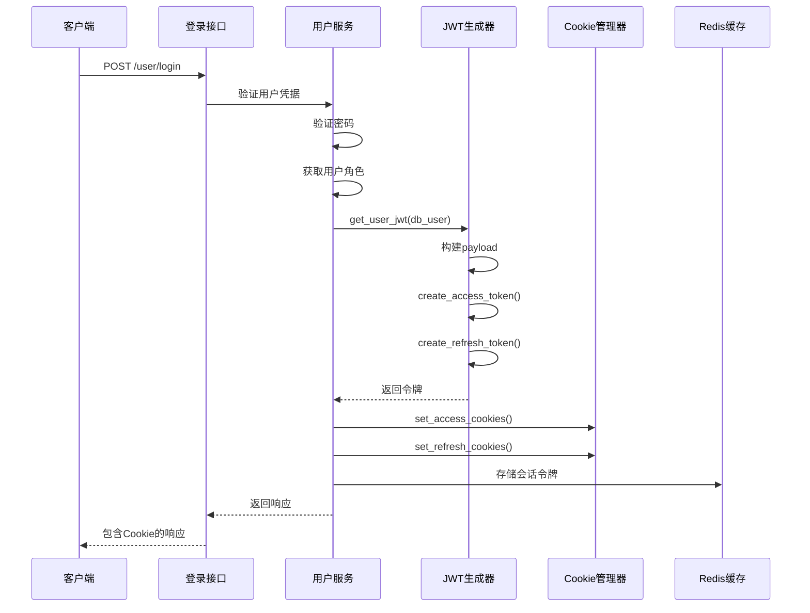

**图表来源**
- [user.py](https://github.com/Shy2593666979/AgentChat/src/backend/agentchat/api/v1/user.py#L51-L77)
- [user.py](https://github.com/Shy2593666979/AgentChat/src/backend/agentchat/api/services/user.py#L145-L157)

**章节来源**
- [user.py](https://github.com/Shy2593666979/AgentChat/src/backend/agentchat/api/v1/user.py#L51-L77)
- [user.py](https://github.com/Shy2593666979/AgentChat/src/backend/agentchat/api/services/user.py#L145-L157)
- [auth_jwt.py](https://github.com/Shy2593666979/AgentChat/src/backend/fastapi_jwt_auth/auth_jwt.py#L253-L304)

## JWT配置系统

### 配置参数详解

AgentChat的JWT配置系统提供了灵活的参数定制能力：

| 配置项 | 默认值 | 描述 | 安全影响 |
|--------|--------|------|----------|
| `authjwt_secret_key` | 'secret' | JWT签名密钥 | 密钥强度直接影响令牌安全性 |
| `authjwt_algorithm` | 'HS256' | 签名算法 | 对称加密算法，性能较好但安全性较低 |
| `authjwt_access_token_expires` | timedelta(minutes=15) | 访问令牌过期时间 | 过短影响用户体验，过长增加风险 |
| `authjwt_refresh_token_expires` | timedelta(days=30) | 刷新令牌过期时间 | 长期有效，需配合撤销机制 |
| `authjwt_cookie_csrf_protect` | False | CSRF保护开关 | 启用后增加安全性但复杂度 |
| `authjwt_token_location` | ['cookies', 'headers'] | 令牌存储位置 | 多种存储方式提高可用性 |

### 访问令牌过期时间配置

在AgentChat中，访问令牌的过期时间通过常量`ACCESS_TOKEN_EXPIRE_TIME`进行配置：

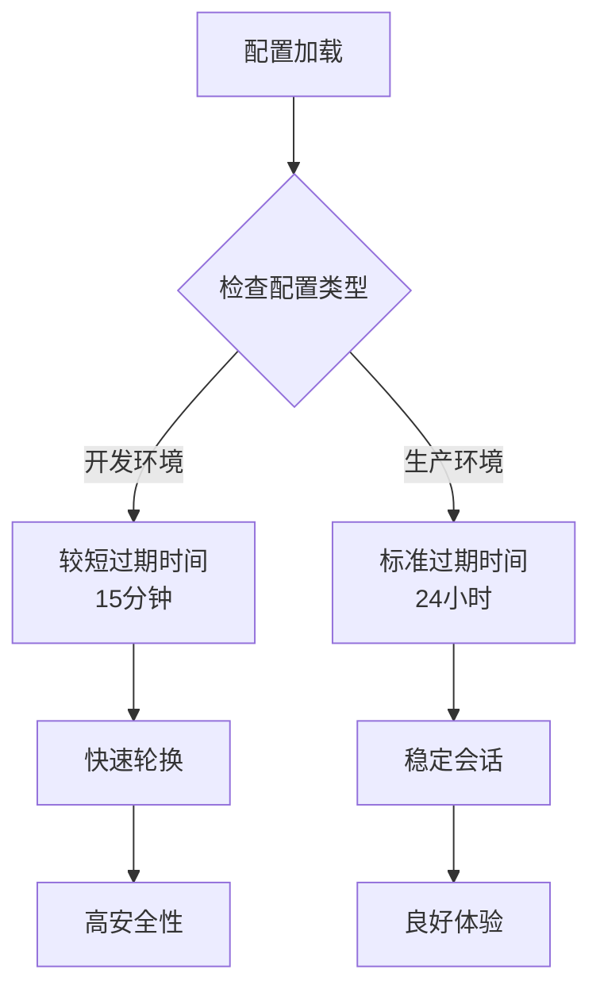

**图表来源**
- [JWT.py](https://github.com/Shy2593666979/AgentChat/src/backend/agentchat/utils/JWT.py#L7-L7)
- [config.py](https://github.com/Shy2593666979/AgentChat/src/backend/fastapi_jwt_auth/config.py#L25-L25)

**章节来源**
- [JWT.py](https://github.com/Shy2593666979/AgentChat/src/backend/agentchat/utils/JWT.py#L7-L7)
- [config.py](https://github.com/Shy2593666979/AgentChat/src/backend/fastapi_jwt_auth/config.py#L25-L25)
- [auth_config.py](https://github.com/Shy2593666979/AgentChat/src/backend/fastapi_jwt_auth/auth_config.py#L60-L97)

## 令牌生成流程详解

### get_user_jwt函数实现

`get_user_jwt`函数是JWT令牌生成的核心入口，负责从数据库用户对象中提取用户信息并构建JWT主题：

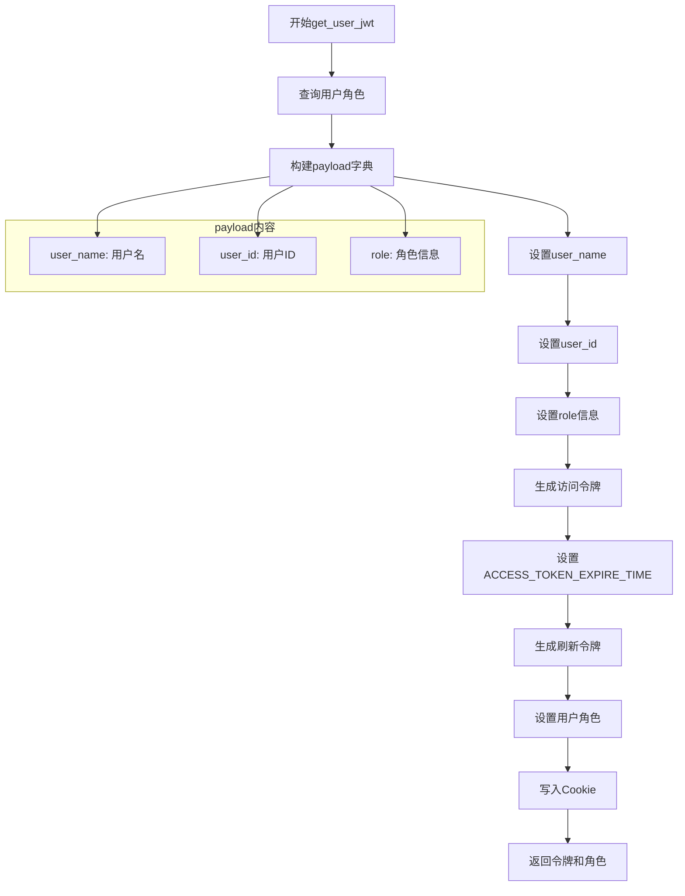

**图表来源**
- [user.py](https://github.com/Shy2593666979/AgentChat/src/backend/agentchat/api/services/user.py#L145-L157)

### JWT主题构建过程

JWT主题（payload）包含了用户身份验证所需的关键信息：

| 字段名 | 数据类型 | 来源 | 安全考虑 |
|--------|----------|------|----------|
| `user_name` | string | db_user.user_name | 显示名称，可公开 |
| `user_id` | string | db_user.user_id | 唯一标识符，必须保密 |
| `role` | string/array | get_user_role() | 权限控制，需验证 |

### 令牌签名机制

AgentChat使用对称加密算法进行令牌签名：

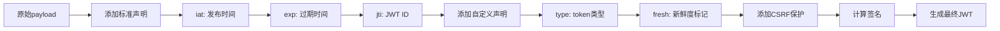

**图表来源**
- [auth_jwt.py](https://github.com/Shy2593666979/AgentChat/src/backend/fastapi_jwt_auth/auth_jwt.py#L118-L193)

**章节来源**
- [user.py](https://github.com/Shy2593666979/AgentChat/src/backend/agentchat/api/services/user.py#L145-L157)
- [auth_jwt.py](https://github.com/Shy2593666979/AgentChat/src/backend/fastapi_jwt_auth/auth_jwt.py#L118-L193)

## 用户登录接口实现

### 登录流程架构

用户登录接口实现了完整的认证流程，包括凭据验证、令牌生成和Cookie设置：

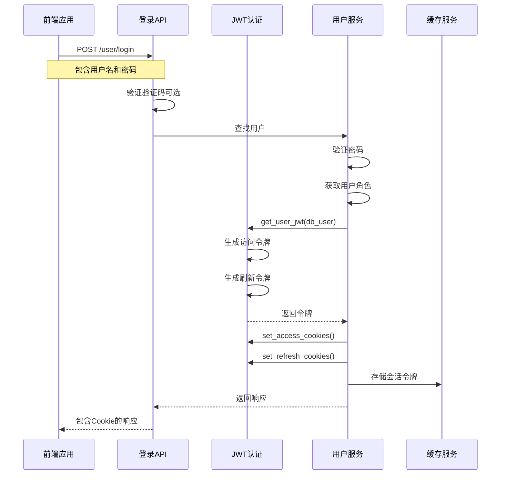

**图表来源**
- [user.py](https://github.com/Shy2593666979/AgentChat/src/backend/agentchat/api/v1/user.py#L51-L77)

### Cookie设置机制

登录成功后，系统通过`set_access_cookies`和`set_refresh_cookies`方法将令牌写入HTTP响应：

| Cookie属性 | 访问令牌 | 刷新令牌 | CSRF保护 |
|------------|----------|----------|----------|
| 名称 | access_token_cookie | refresh_token_cookie | csrf_access_token/csrf_refresh_token |
| 路径 | / | / | / |
| 安全标志 | httponly=True | httponly=True | httponly=False |
| 同源策略 | SameSite=None | SameSite=None | SameSite=None |
| 最大年龄 | ACCESS_TOKEN_EXPIRE_TIME | 30天 | 30天 |

### 会话管理

登录过程中还包含了会话管理机制：

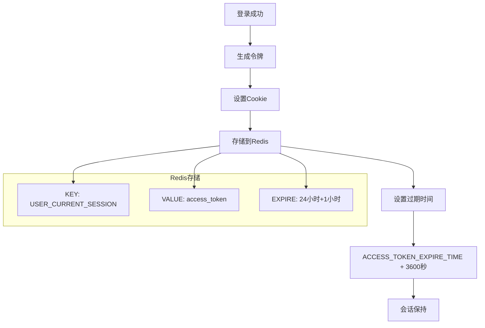

**图表来源**
- [user.py](https://github.com/Shy2593666979/AgentChat/src/backend/agentchat/api/v1/user.py#L74-L77)

**章节来源**
- [user.py](https://github.com/Shy2593666979/AgentChat/src/backend/agentchat/api/v1/user.py#L51-L77)
- [auth_jwt.py](https://github.com/Shy2593666979/AgentChat/src/backend/fastapi_jwt_auth/auth_jwt.py#L316-L415)

## 安全机制与最佳实践

### 敏感信息最小化原则

AgentChat严格遵循敏感信息最小化原则，在JWT payload中只包含必要的用户信息：

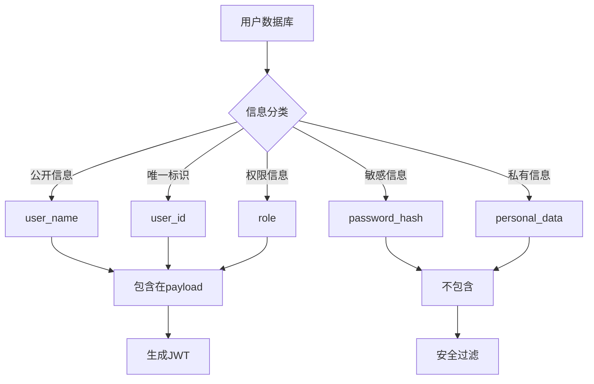

### CSRF保护机制

系统提供了双重CSRF保护机制：

| 保护层级 | 实现方式 | 适用场景 | 安全级别 |
|----------|----------|----------|----------|
| 第一层 | Cookie SameSite属性 | 现代浏览器 | 中等 |
| 第二层 | CSRF Token验证 | 所有请求 | 高 |

### 令牌轮换策略

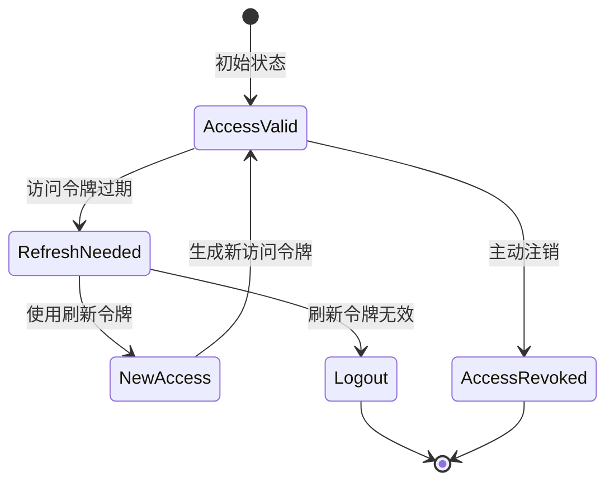

### 密钥管理最佳实践

| 密钥类型 | 长度要求 | 生成方式 | 安全建议 |
|----------|----------|----------|----------|
| Secret Key | ≥256位 | 随机生成 | 使用强随机数生成器 |
| Private Key | ≥2048位 | RSA生成 | 定期轮换 |
| Salt值 | ≥128位 | 时间戳+随机数 | 每次生成不同 |

**章节来源**
- [auth_jwt.py](https://github.com/Shy2593666979/AgentChat/src/backend/fastapi_jwt_auth/auth_jwt.py#L118-L193)
- [config.py](https://github.com/Shy2593666979/AgentChat/src/backend/fastapi_jwt_auth/config.py#L37-L44)

## 性能考虑

### 令牌生成性能优化

JWT令牌生成涉及多个计算步骤，系统通过以下方式优化性能：

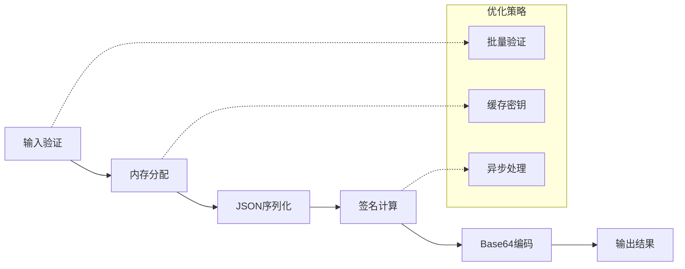

### 内存使用优化

| 优化方面 | 实现方式 | 性能提升 |
|----------|----------|----------|
| 字符串处理 | 使用字符串池 | 减少内存分配 |
| JSON序列化 | 流式处理 | 降低内存峰值 |
| 密钥缓存 | 单例模式 | 避免重复加载 |
| 过期检查 | 时间窗口 | 减少CPU开销 |

### 并发处理

系统支持高并发令牌操作：

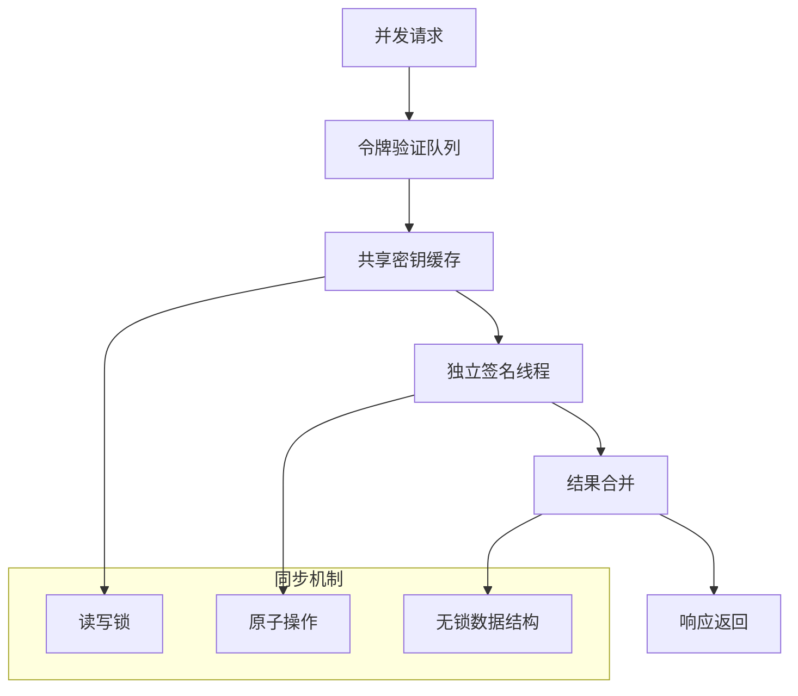

## 故障排除指南

### 常见问题诊断

| 问题类型 | 症状 | 可能原因 | 解决方案 |
|----------|------|----------|----------|
| 令牌无效 | 401未授权 | 密钥不匹配 | 检查SECRET_KEY配置 |
| 过期错误 | 401过期 | 时间同步问题 | 校准服务器时间 |
| CSRF失败 | 401 CSRF错误 | Token缺失 | 启用CSRF保护 |
| Cookie问题 | 无法保存 | SameSite设置 | 调整Cookie配置 |

### 调试工具

系统提供了多种调试工具帮助排查问题：

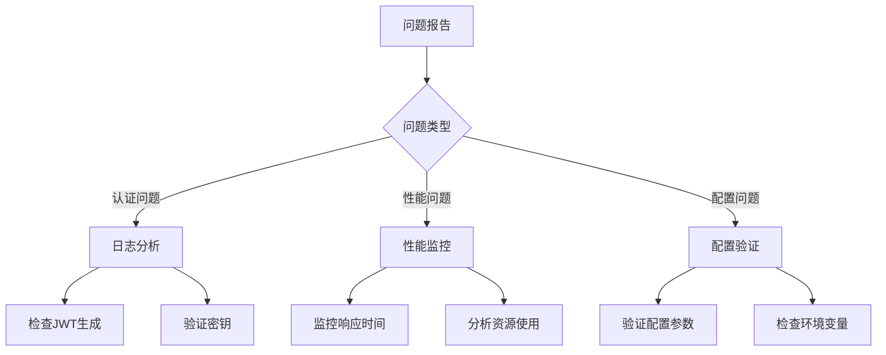

### 错误处理机制

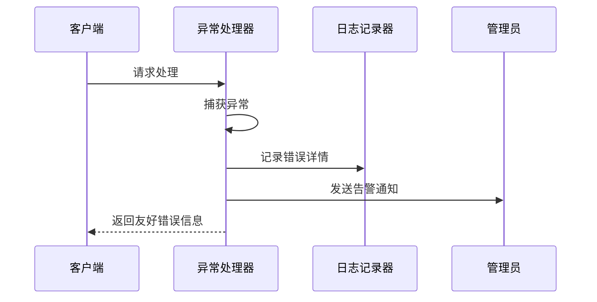

**章节来源**
- [auth_jwt.py](https://github.com/Shy2593666979/AgentChat/src/backend/fastapi_jwt_auth/auth_jwt.py#L118-L193)
- [config.py](https://github.com/Shy2593666979/AgentChat/src/backend/fastapi_jwt_auth/config.py#L25-L44)

## 总结

AgentChat的JWT令牌生成机制体现了现代Web应用安全性和可用性的平衡。通过`get_user_jwt`函数的精心设计，系统实现了：

1. **安全性**：采用对称加密算法，支持CSRF保护，严格遵循最小化原则
2. **可用性**：支持多种令牌存储方式，提供灵活的配置选项
3. **性能**：优化的令牌生成流程，支持高并发处理
4. **可维护性**：清晰的代码结构，完善的错误处理机制

该系统为AgentChat提供了可靠的用户认证基础设施，支持大规模用户会话管理，同时保持了良好的开发体验和运维便利性。通过持续的安全审计和性能优化，该机制能够满足企业级应用的安全需求。