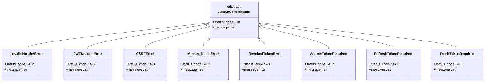

# 令牌验证流程

<cite>
**本文档引用的文件**
- [src/backend/agentchat/api/services/user.py](https://github.com/Shy2593666979/AgentChat/src/backend/agentchat/api/services/user.py)
- [src/backend/agentchat/middleware/white_list_middleware.py](https://github.com/Shy2593666979/AgentChat/src/backend/agentchat/middleware/white_list_middleware.py)
- [src/backend/fastapi_jwt_auth/auth_jwt.py](https://github.com/Shy2593666979/AgentChat/src/backend/fastapi_jwt_auth/auth_jwt.py)
- [src/backend/fastapi_jwt_auth/exceptions.py](https://github.com/Shy2593666979/AgentChat/src/backend/fastapi_jwt_auth/exceptions.py)
- [src/backend/fastapi_jwt_auth/auth_config.py](https://github.com/Shy2593666979/AgentChat/src/backend/fastapi_jwt_auth/auth_config.py)
- [src/backend/agentchat/api/JWT.py](https://github.com/Shy2593666979/AgentChat/src/backend/agentchat/api/JWT.py)
- [src/backend/agentchat/main.py](https://github.com/Shy2593666979/AgentChat/src/backend/agentchat/main.py)
- [src/backend/agentchat/api/v1/user.py](https://github.com/Shy2593666979/AgentChat/src/backend/agentchat/api/v1/user.py)
</cite>

## 目录
1. [简介](#简介)
2. [系统架构概览](#系统架构概览)
3. [JWT验证核心组件](#jwt验证核心组件)
4. [get_login_user依赖函数详解](#get_login_user依赖函数详解)
5. [白名单中间件机制](#白名单中间件机制)
6. [令牌验证完整流程](#令牌验证完整流程)
7. [异常处理机制](#异常处理机制)
8. [FastAPI依赖注入集成](#fastapi依赖注入集成)
9. [性能考虑](#性能考虑)
10. [故障排除指南](#故障排除指南)
11. [总结](#总结)

## 简介

AgentChat系统采用基于JWT（JSON Web Token）的身份验证机制来确保API接口的安全性。该系统通过多层次的验证流程，包括白名单机制、令牌提取、签名验证、过期时间检查和用户信息解析等步骤，为整个应用提供了完整的身份认证和授权保障。

本文档详细阐述了AgentChat系统中JWT令牌验证的完整机制，包括从请求处理到最终用户信息注入的每一个环节，以及与FastAPI依赖注入系统的深度集成。

## 系统架构概览

AgentChat的JWT验证系统采用分层架构设计，主要包含以下核心层次：

**图表来源**
- [src/backend/agentchat/main.py](https://github.com/Shy2593666979/AgentChat/src/backend/agentchat/main.py#L29-L48)
- [src/backend/agentchat/middleware/white_list_middleware.py](https://github.com/Shy2593666979/AgentChat/src/backend/agentchat/middleware/white_list_middleware.py#L33-L49)

## JWT验证核心组件

### AuthJWT类

AuthJWT是JWT验证的核心类，继承自AuthConfig，提供了完整的JWT操作功能：

**图表来源**
- [src/backend/fastapi_jwt_auth/auth_jwt.py](https://github.com/Shy2593666979/AgentChat/src/backend/fastapi_jwt_auth/auth_jwt.py#L18-L849)
- [src/backend/fastapi_jwt_auth/auth_config.py](https://github.com/Shy2593666979/AgentChat/src/backend/fastapi_jwt_auth/auth_config.py#L6-L45)
- [src/backend/agentchat/middleware/white_list_middleware.py](https://github.com/Shy2593666979/AgentChat/src/backend/agentchat/middleware/white_list_middleware.py#L7-L31)

**章节来源**
- [src/backend/fastapi_jwt_auth/auth_jwt.py](https://github.com/Shy2593666979/AgentChat/src/backend/fastapi_jwt_auth/auth_jwt.py#L18-L849)
- [src/backend/fastapi_jwt_auth/auth_config.py](https://github.com/Shy2593666979/AgentChat/src/backend/fastapi_jwt_auth/auth_config.py#L6-L45)

### JWT配置管理

系统通过Pydantic模型管理JWT配置，支持多种配置选项：

| 配置项 | 类型 | 默认值 | 描述 |
|--------|------|--------|------|
| authjwt_secret_key | str | 'secret' | JWT签名密钥 |
| authjwt_token_location | list | ['cookies', 'headers'] | 令牌存储位置 |
| authjwt_cookie_csrf_protect | bool | False | 是否启用CSRF保护 |
| authjwt_algorithm | str | 'HS256' | 加密算法 |
| authjwt_access_token_expires | timedelta | 15分钟 | 访问令牌过期时间 |
| authjwt_refresh_token_expires | timedelta | 30天 | 刷新令牌过期时间 |

**章节来源**
- [src/backend/agentchat/api/JWT.py](https://github.com/Shy2593666979/AgentChat/src/backend/agentchat/api/JWT.py#L1-L7)
- [src/backend/fastapi_jwt_auth/auth_config.py](https://github.com/Shy2593666979/AgentChat/src/backend/fastapi_jwt_auth/auth_config.py#L10-L25)

## get_login_user依赖函数详解

`get_login_user`函数是JWT验证的核心入口，作为FastAPI的依赖函数被自动调用：

**图表来源**
- [src/backend/agentchat/api/services/user.py](https://github.com/Shy2593666979/AgentChat/src/backend/agentchat/api/services/user.py#L114-L128)

### 验证流程详解

1. **白名单检查**：首先检查请求路径是否在白名单中
2. **令牌提取**：根据配置的存储位置提取JWT令牌
3. **签名验证**：使用密钥验证令牌签名
4. **过期检查**：验证令牌是否已过期
5. **主题解析**：解析JWT的subject字段获取用户信息
6. **用户对象创建**：构建UserPayload对象

**章节来源**
- [src/backend/agentchat/api/services/user.py](https://github.com/Shy2593666979/AgentChat/src/backend/agentchat/api/services/user.py#L114-L128)

## 白名单中间件机制

白名单中间件负责在JWT验证之前确定请求路径是否需要身份验证：

**图表来源**
- [src/backend/agentchat/middleware/white_list_middleware.py](https://github.com/Shy2593666979/AgentChat/src/backend/agentchat/middleware/white_list_middleware.py#L40-L49)

### 路径匹配策略

白名单中间件支持三种路径匹配模式：

| 匹配类型 | 示例 | 描述 |
|----------|------|------|
| 精确匹配 | `/api/v1/public` | 完全匹配指定路径 |
| 前缀匹配 | `/api/v1/admin/*` | 匹配以指定前缀开头的所有路径 |
| 通配符匹配 | `/api/v1/*/data` | 匹配包含特定子路径的所有路径 |

**章节来源**
- [src/backend/agentchat/middleware/white_list_middleware.py](https://github.com/Shy2593666979/AgentChat/src/backend/agentchat/middleware/white_list_middleware.py#L10-L21)

## 令牌验证完整流程

### 令牌提取阶段

JWT验证器会根据配置的存储位置自动选择提取方式：

**图表来源**
- [src/backend/fastapi_jwt_auth/auth_jwt.py](https://github.com/Shy2593666979/AgentChat/src/backend/fastapi_jwt_auth/auth_jwt.py#L39-L62)
- [src/backend/fastapi_jwt_auth/auth_jwt.py](https://github.com/Shy2593666979/AgentChat/src/backend/fastapi_jwt_auth/auth_jwt.py#L687-L703)

### 签名验证机制

系统使用PyJWT库进行签名验证，支持对称和非对称加密算法：

| 算法类型 | 支持算法 | 密钥要求 | 性能特点 |
|----------|----------|----------|----------|
| 对称加密 | HS256, HS384, HS512 | 单一密钥 | 高性能，适合内部系统 |
| 非对称加密 | RS256, ES256, PS256 | 公钥/私钥对 | 更安全，适合分布式系统 |

**章节来源**
- [src/backend/fastapi_jwt_auth/auth_jwt.py](https://github.com/Shy2593666979/AgentChat/src/backend/fastapi_jwt_auth/auth_jwt.py#L76-L117)

### 过期时间检查

系统实现了严格的过期时间检查机制：

**图表来源**
- [src/backend/fastapi_jwt_auth/auth_jwt.py](https://github.com/Shy2593666979/AgentChat/src/backend/fastapi_jwt_auth/auth_jwt.py#L219-L252)

**章节来源**
- [src/backend/fastapi_jwt_auth/auth_jwt.py](https://github.com/Shy2593666979/AgentChat/src/backend/fastapi_jwt_auth/auth_jwt.py#L219-L252)

## 异常处理机制

### JWT相关异常类型

系统定义了完整的JWT异常处理体系：

**图表来源**
- [src/backend/fastapi_jwt_auth/exceptions.py](https://github.com/Shy2593666979/AgentChat/src/backend/fastapi_jwt_auth/exceptions.py#L1-L73)

### 异常处理流程

当JWT验证失败时，系统按照以下流程处理异常：

**图表来源**
- [src/backend/agentchat/api/services/user.py](https://github.com/Shy2593666979/AgentChat/src/backend/agentchat/api/services/user.py#L124-L128)
- [src/backend/agentchat/main.py](https://github.com/Shy2593666979/AgentChat/src/backend/agentchat/main.py#L91-L97)

**章节来源**
- [src/backend/fastapi_jwt_auth/exceptions.py](https://github.com/Shy2593666979/AgentChat/src/backend/fastapi_jwt_auth/exceptions.py#L1-L73)
- [src/backend/agentchat/api/services/user.py](https://github.com/Shy2593666979/AgentChat/src/backend/agentchat/api/services/user.py#L124-L128)
- [src/backend/agentchat/main.py](https://github.com/Shy2593666979/AgentChat/src/backend/agentchat/main.py#L91-L97)

## FastAPI依赖注入集成

### 依赖注入机制

AgentChat系统充分利用FastAPI的依赖注入系统，实现自动化的JWT验证：

**图表来源**
- [src/backend/agentchat/api/services/user.py](https://github.com/Shy2593666979/AgentChat/src/backend/agentchat/api/services/user.py#L114-L128)
- [src/backend/agentchat/main.py](https://github.com/Shy2593666979/AgentChat/src/backend/agentchat/main.py#L86-L90)

### 自动化验证流程

FastAPI的依赖注入系统确保每个受保护的端点都会自动执行JWT验证：

| 阶段 | 处理内容 | 触发条件 |
|------|----------|----------|
| 请求接收 | 中间件栈执行 | 每个HTTP请求 |
| 依赖解析 | get_login_user调用 | 受保护的端点 |
| JWT验证 | authorize.jwt_required() | 非白名单路径 |
| 用户注入 | UserPayload创建 | 验证成功后 |
| 业务执行 | 端点函数调用 | 用户信息可用 |

**章节来源**
- [src/backend/agentchat/api/services/user.py](https://github.com/Shy2593666979/AgentChat/src/backend/agentchat/api/services/user.py#L114-L128)
- [src/backend/agentchat/main.py](https://github.com/Shy2593666979/AgentChat/src/backend/agentchat/main.py#L86-L90)

## 性能考虑

### 缓存策略

系统采用了多层缓存策略来优化JWT验证性能：

1. **Redis缓存**：存储活跃的访问令牌
2. **内存缓存**：缓存用户角色信息
3. **连接池**：数据库连接复用

### 性能监控指标

| 指标 | 目标值 | 监控方法 |
|------|--------|----------|
| JWT验证延迟 | < 50ms | 请求计时器 |
| 令牌提取时间 | < 10ms | 中间件计时 |
| 用户信息解析 | < 20ms | 服务层计时 |
| 异常处理时间 | < 10ms | 异常处理器计时 |

## 故障排除指南

### 常见问题及解决方案

#### 1. 401未授权错误

**症状**：收到"Invalid authentication credentials"错误
**可能原因**：
- 令牌已过期
- 令牌格式不正确
- 密钥配置错误

**解决步骤**：
1. 检查令牌过期时间
2. 验证令牌格式（Bearer前缀）
3. 确认密钥配置正确

#### 2. 422格式错误

**症状**：收到JWT解码错误
**可能原因**：
- 令牌损坏
- 算法不匹配
- 字段格式错误

**解决步骤**：
1. 重新生成令牌
2. 检查算法配置
3. 验证字段格式

#### 3. 白名单误判

**症状**：白名单路径需要认证
**可能原因**：
- 路径匹配规则错误
- 中间件初始化问题

**解决步骤**：
1. 检查白名单配置
2. 验证路径匹配逻辑
3. 重启应用确保初始化

**章节来源**
- [src/backend/agentchat/api/services/user.py](https://github.com/Shy2593666979/AgentChat/src/backend/agentchat/api/services/user.py#L124-L128)
- [src/backend/agentchat/middleware/white_list_middleware.py](https://github.com/Shy2593666979/AgentChat/src/backend/agentchat/middleware/white_list_middleware.py#L40-L49)

## 总结

AgentChat系统的JWT令牌验证机制通过精心设计的分层架构，实现了高效、安全、可扩展的身份认证系统。该系统的主要优势包括：

1. **多层次验证**：白名单机制+JWT验证+异常处理
2. **自动化集成**：与FastAPI依赖注入系统深度集成
3. **灵活配置**：支持多种存储位置和加密算法
4. **完善异常处理**：提供详细的错误信息和状态码
5. **高性能设计**：采用缓存策略和优化的验证流程

通过本文档的详细分析，开发者可以深入理解AgentChat系统中JWT验证的工作原理，并能够有效地维护和扩展这一关键的安全基础设施。