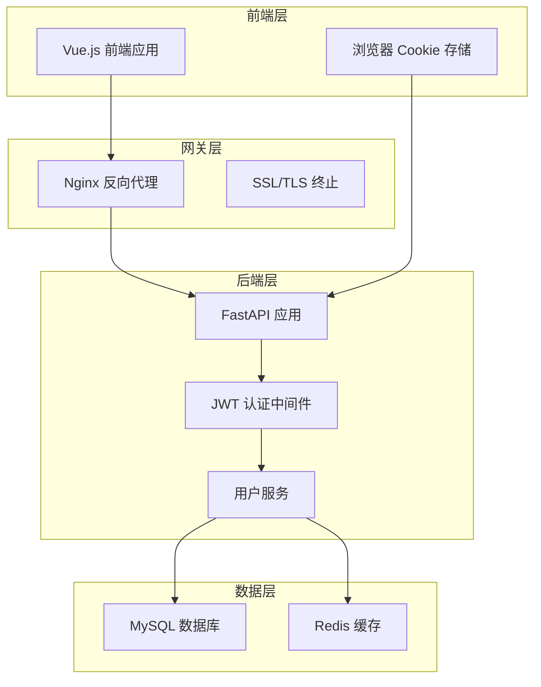
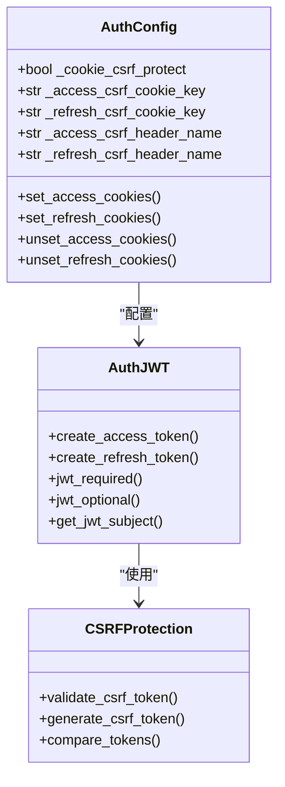
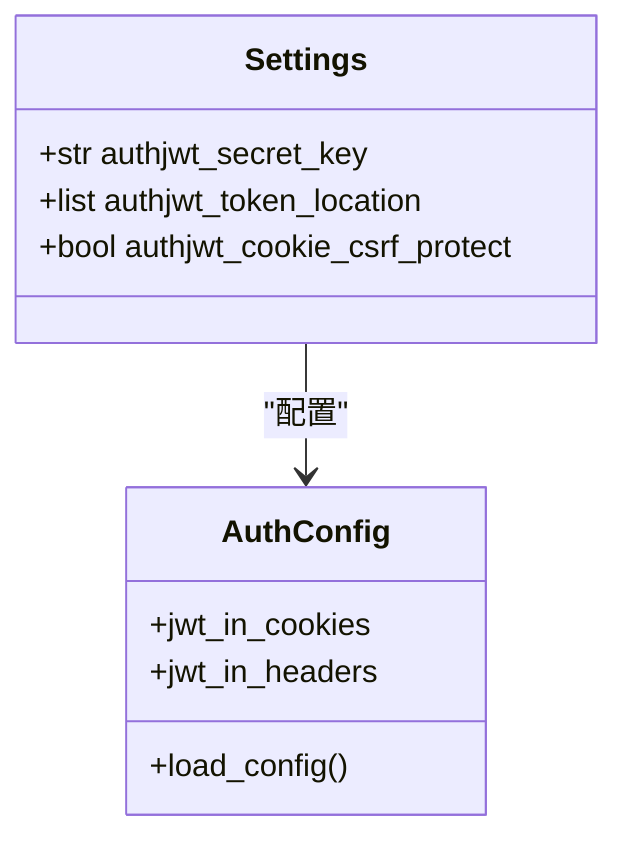
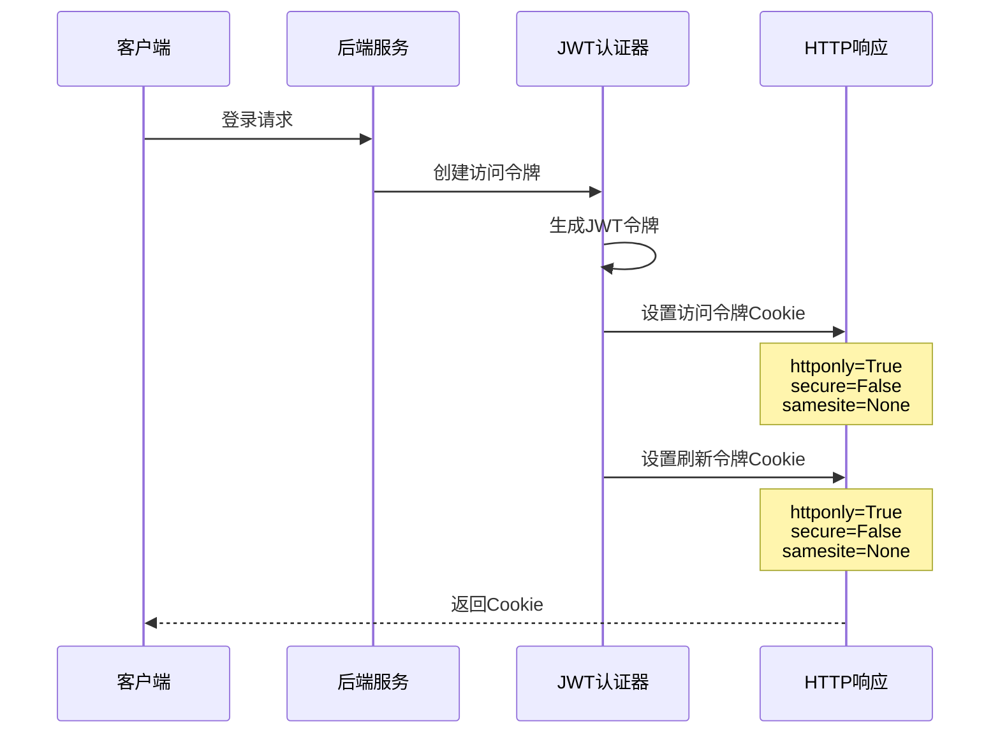
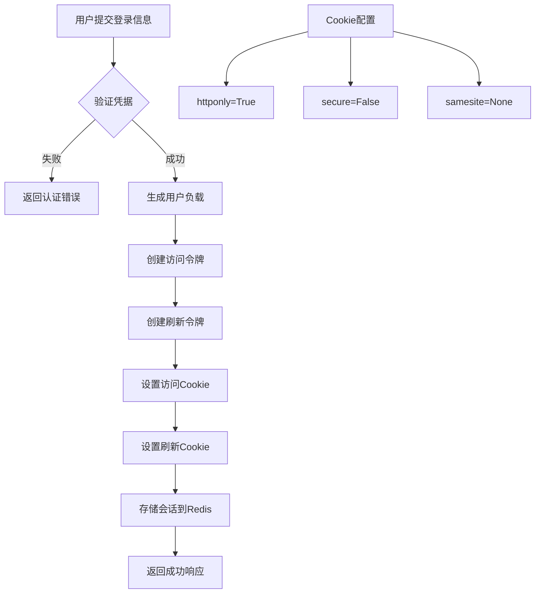
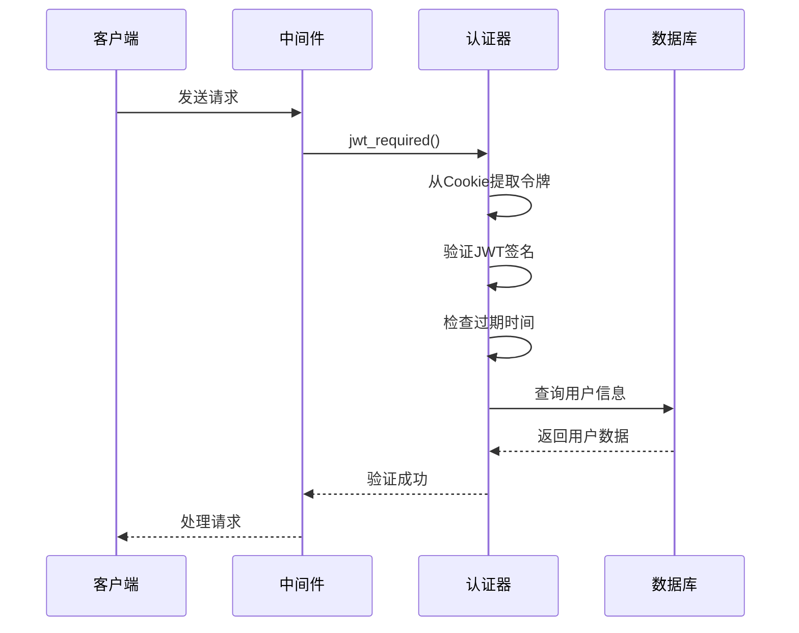
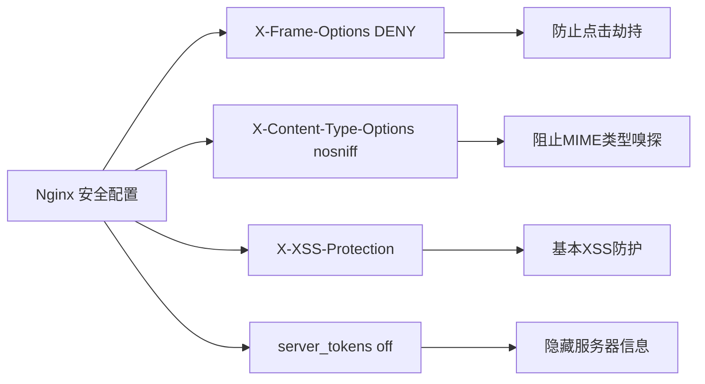
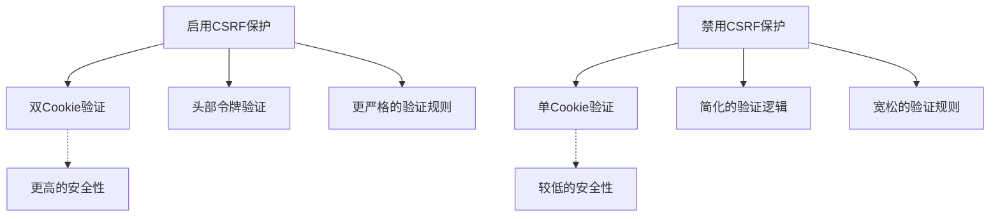
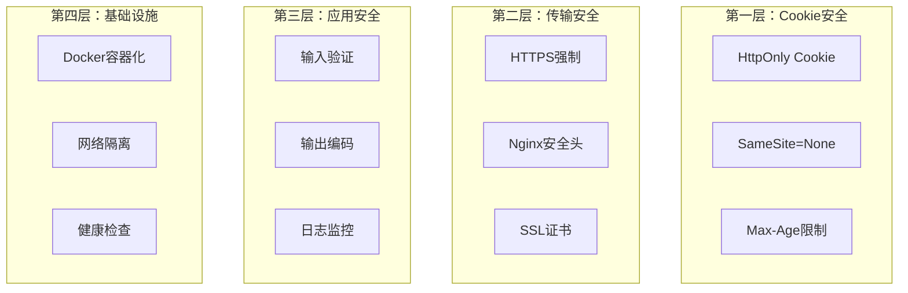

# CSRF策略

## 目录
1. [简介](#简介)
2. [项目架构概览](#项目架构概览)
3. [CSRF保护机制设计](#csrf保护机制设计)
4. [核心组件分析](#核心组件分析)
5. [JWT认证流程](#jwt认证流程)
6. [安全配置分析](#安全配置分析)
7. [设计决策评估](#设计决策评估)
8. [风险分析与补偿措施](#风险分析与补偿措施)
9. [最佳实践建议](#最佳实践建议)
10. [总结](#总结)

## 简介

AgentChat项目采用了基于JWT（JSON Web Token）的身份认证机制，并在fastapi_jwt_auth库的支持下实现了CSRF（跨站请求伪造）保护。然而，在实际部署中，项目通过设置`authjwt_cookie_csrf_protect=False`显式禁用了CSRF双提交保护功能。这种设计选择引发了关于API安全性的深入讨论，需要从多个维度分析其合理性、潜在风险以及相应的补偿控制措施。

## 项目架构概览

AgentChat采用前后端分离的架构模式，后端基于FastAPI框架构建，前端使用Vue.js技术栈。整个系统的认证授权机制围绕JWT令牌展开，通过Cookie存储和HTTP头部传递相结合的方式实现身份验证。



**图表来源**
- [main.py](https://github.com/Shy2593666979/AgentChat/src/backend/agentchat/main.py#L78-L108)
- [docker-compose.yml](https://github.com/Shy2593666979/AgentChat/docker/docker-compose.yml#L50-L93)

## CSRF保护机制设计

### fastapi_jwt_auth库的CSRF保护架构

fastapi_jwt_auth库提供了完整的CSRF保护机制，包括双提交Cookie模式和头部令牌验证：



**图表来源**
- [auth_config.py](https://github.com/Shy2593666979/AgentChat/src/backend/fastapi_jwt_auth/auth_config.py#L37-L45)
- [auth_jwt.py](https://github.com/Shy2593666979/AgentChat/src/backend/fastapi_jwt_auth/auth_jwt.py#L316-L416)

### 默认CSRF保护配置

根据fastapi_jwt_auth库的默认配置，CSRF保护机制包含以下关键特性：

| 配置项 | 默认值 | 说明 |
|--------|--------|------|
| `_cookie_csrf_protect` | `True` | 是否启用CSRF双提交保护 |
| `_access_csrf_cookie_key` | `"csrf_access_token"` | 访问令牌CSRF Cookie键名 |
| `_refresh_csrf_cookie_key` | `"csrf_refresh_token"` | 刷新令牌CSRF Cookie键名 |
| `_csrf_methods` | `{'POST','PUT','PATCH','DELETE'}` | 需要CSRF验证的HTTP方法 |
| `httponly` | `False` | CSRF Cookie是否设置HttpOnly |

**节来源**
- [auth_config.py](https://github.com/Shy2593666979/AgentChat/src/backend/fastapi_jwt_auth/auth_config.py#L37-L45)
- [config.py](https://github.com/Shy2593666979/AgentChat/src/backend/fastapi_jwt_auth/config.py#L37-L45)

## 核心组件分析

### JWT配置类分析

AgentChat项目通过自定义配置类覆盖了fastapi_jwt_auth的默认设置：



**图表来源**
- [JWT.py](https://github.com/Shy2593666979/AgentChat/src/backend/agentchat/api/JWT.py#L4-L7)
- [main.py](https://github.com/Shy2593666979/AgentChat/src/backend/agentchat/main.py#L86-L90)

### Cookie设置机制

当CSRF保护被禁用时，JWT令牌的设置过程发生了显著变化：



**图表来源**
- [auth_jwt.py](https://github.com/Shy2593666979/AgentChat/src/backend/fastapi_jwt_auth/auth_jwt.py#L342-L402)
- [user.py](https://github.com/Shy2593666979/AgentChat/src/backend/agentchat/api/v1/user.py#L70-L72)

**节来源**
- [auth_jwt.py](https://github.com/Shy2593666979/AgentChat/src/backend/fastapi_jwt_auth/auth_jwt.py#L342-L402)
- [user.py](https://github.com/Shy2593666979/AgentChat/src/backend/agentchat/api/v1/user.py#L70-L72)

## JWT认证流程

### 用户登录流程

用户登录过程展示了JWT令牌的完整生命周期：



**图表来源**
- [user.py](https://github.com/Shy2593666979/AgentChat/src/backend/agentchat/api/v1/user.py#L68-L77)
- [user.py](https://github.com/Shy2593666979/AgentChat/src/backend/agentchat/api/services/user.py#L146-L157)

### 令牌验证流程



**图表来源**
- [user.py](https://github.com/Shy2593666979/AgentChat/src/backend/agentchat/api/services/user.py#L114-L128)

**节来源**
- [user.py](https://github.com/Shy2593666979/AgentChat/src/backend/agentchat/api/v1/user.py#L68-L77)
- [user.py](https://github.com/Shy2593666979/AgentChat/src/backend/agentchat/api/services/user.py#L114-L128)

## 安全配置分析

### Cookie安全属性

AgentChat项目的Cookie配置展现了特定的安全策略：

| Cookie属性 | 当前配置 | 安全影响 |
|------------|----------|----------|
| `httponly` | `True` | 防止XSS攻击读取Cookie |
| `secure` | `False` | 不强制HTTPS传输 |
| `samesite` | `None` | 跨站请求可能携带Cookie |
| `max-age` | `None` | 会话Cookie，浏览器关闭时失效 |

### Nginx安全配置

生产环境的Nginx配置提供了额外的安全保护：



**图表来源**
- [nginx.conf](https://github.com/Shy2593666979/AgentChat/docker/nginx.conf#L61-L65)

**节来源**
- [nginx.conf](https://github.com/Shy2593666979/AgentChat/docker/nginx.conf#L61-L65)
- [docker-compose.yml](https://github.com/Shy2593666979/AgentChat/docker/docker-compose.yml#L69)

## 设计决策评估

### 禁用CSRF保护的原因分析

项目选择禁用CSRF保护的主要考虑因素包括：

1. **用户体验优化**：避免CSRF令牌验证带来的复杂性
2. **移动端适配**：简化移动应用的认证流程
3. **内部系统定位**：系统主要面向企业内部使用
4. **替代安全措施**：依赖其他安全机制提供保护

### 技术实现层面的影响

禁用CSRF保护导致以下技术变化：



**节来源**
- [auth_config.py](https://github.com/Shy2593666979/AgentChat/src/backend/fastapi_jwt_auth/auth_config.py#L37-L45)
- [JWT.py](https://github.com/Shy2593666979/AgentChat/src/backend/agentchat/api/JWT.py#L7)

## 风险分析与补偿措施

### 潜在安全风险

禁用CSRF保护引入了以下安全风险：

1. **跨站请求伪造攻击**
   - 攻击者可诱导用户执行恶意操作
   - 特别是在用户已登录状态下

2. **会话固定攻击**
   - 攻击者可能固定用户的会话标识

3. **令牌泄露风险**
   - 如果存在XSS漏洞，攻击者可窃取JWT令牌

### 补偿控制措施

AgentChat项目实施了多层次的安全补偿措施：



**图表来源**
- [auth_jwt.py](https://github.com/Shy2593666979/AgentChat/src/backend/fastapi_jwt_auth/auth_jwt.py#L349-L351)
- [nginx.conf](https://github.com/Shy2593666979/AgentChat/docker/nginx.conf#L61-L65)

### 具体补偿措施分析

| 补偿措施 | 实现方式 | 安全效果 |
|----------|----------|----------|
| HttpOnly Cookie | `httponly=True` | 防止JavaScript访问Cookie |
| 输入验证 | FastAPI内置验证 | 防止恶意输入注入 |
| 输出编码 | Vue.js模板引擎 | 防止XSS攻击 |
| 日志监控 | Loguru框架 | 追踪异常行为 |
| 健康检查 | Docker健康检查 | 确保服务可用性 |

**节来源**
- [auth_jwt.py](https://github.com/Shy2593666979/AgentChat/src/backend/fastapi_jwt_auth/auth_jwt.py#L349-L351)
- [main.py](https://github.com/Shy2593666979/AgentChat/src/backend/agentchat/main.py#L24-L27)

## 最佳实践建议

### 针对当前配置的改进建议

1. **启用HTTPS传输**
   ```python
   # 在生产环境中应设置为True
   authjwt_cookie_secure: bool = True
   ```

2. **配置SameSite策略**
   ```python
   # 推荐设置为'lax'或'strict'
   authjwt_cookie_samesite: str = "lax"
   ```

3. **添加令牌黑名单**
   ```python
   # 启用令牌撤销功能
   authjwt_denylist_enabled: bool = True
   ```

### 安全监控建议

1. **实施实时监控**
   - 监控异常登录行为
   - 检测暴力破解尝试
   - 跟踪令牌使用模式

2. **定期安全审计**
   - 检查配置变更
   - 评估第三方依赖安全性
   - 更新安全策略

3. **应急响应计划**
   - 制定令牌泄露应对方案
   - 建立快速响应机制
   - 准备系统恢复程序

## 总结

AgentChat项目在CSRF保护策略上的设计体现了对安全性和可用性之间平衡的考量。通过显式禁用fastapi_jwt_auth的CSRF双提交保护，项目简化了认证流程并提升了用户体验，特别是在移动端应用方面。然而，这种设计选择也带来了相应的安全风险，需要通过多层次的安全补偿措施来 mitigating。

项目实施的补偿控制措施包括：
- HttpOnly Cookie设置防止XSS攻击
- Nginx安全头提供额外的防护层
- 输入验证和输出编码防止注入攻击
- Docker容器化提供基础设施安全

这种混合安全策略在保证系统可用性的同时，维持了合理的安全水平。对于企业内部系统而言，这种权衡是合理的，但随着系统暴露面的扩大或面临更高安全要求时，建议重新评估CSRF保护的必要性，并考虑启用完整的CSRF防护机制。
