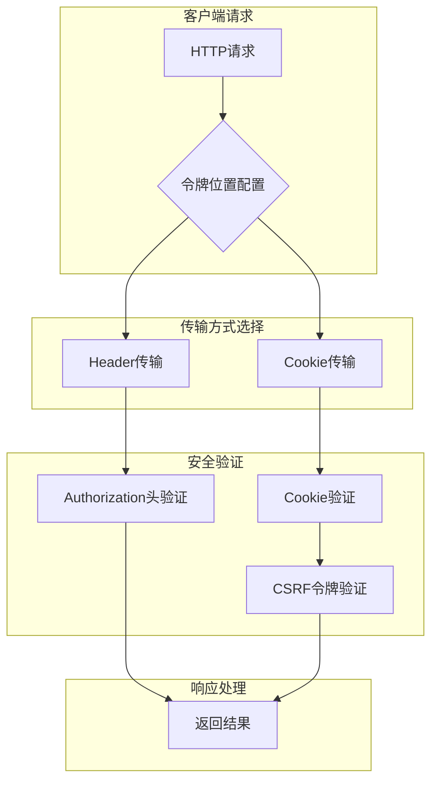
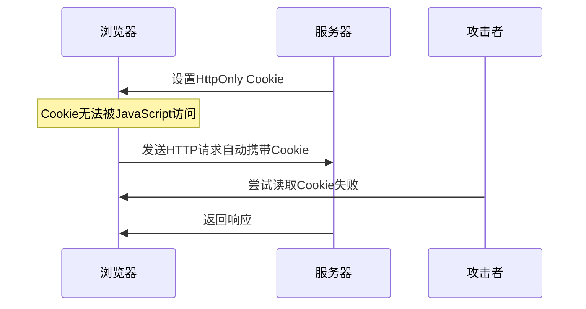
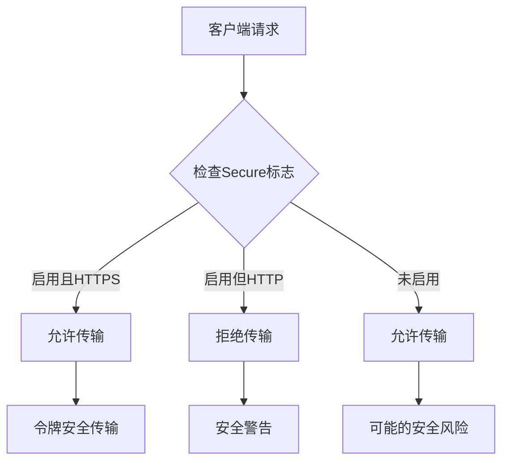
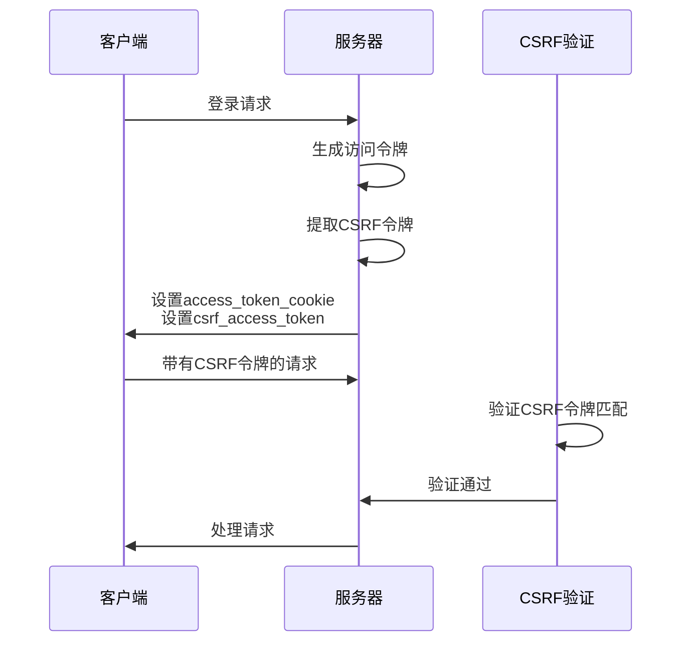
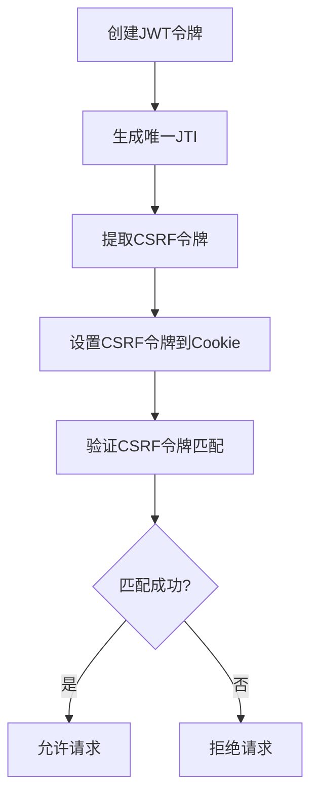
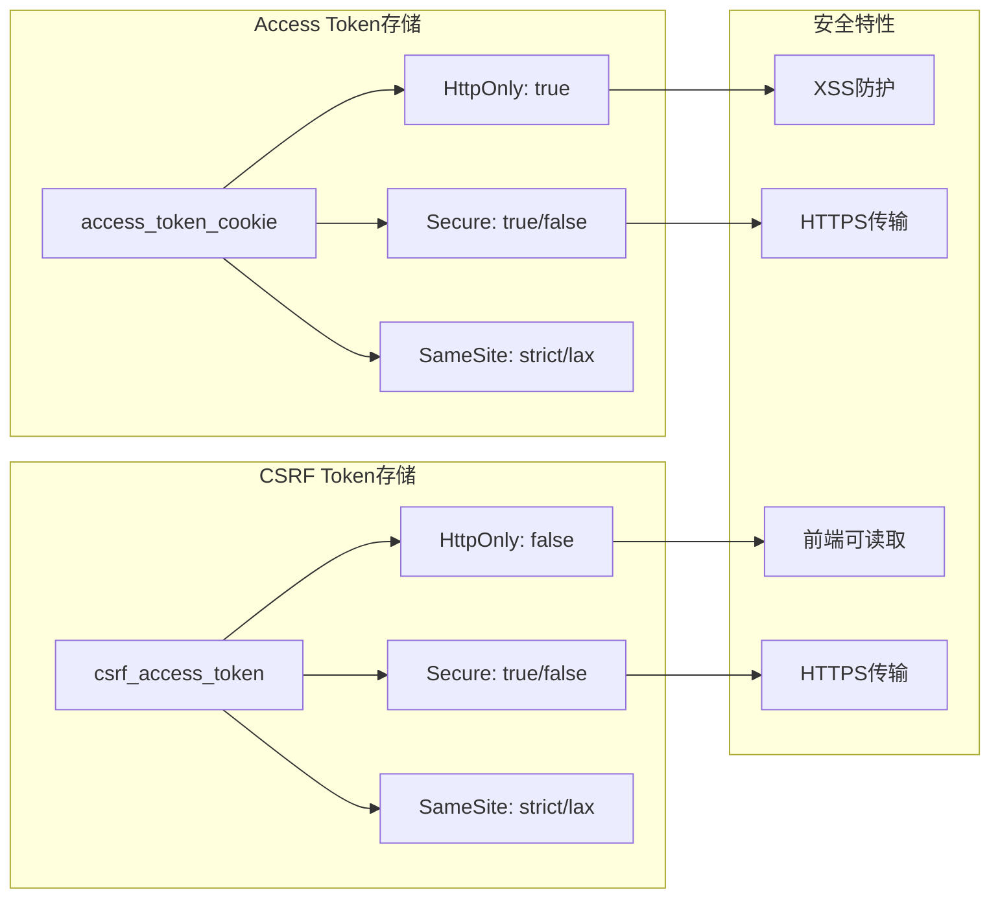
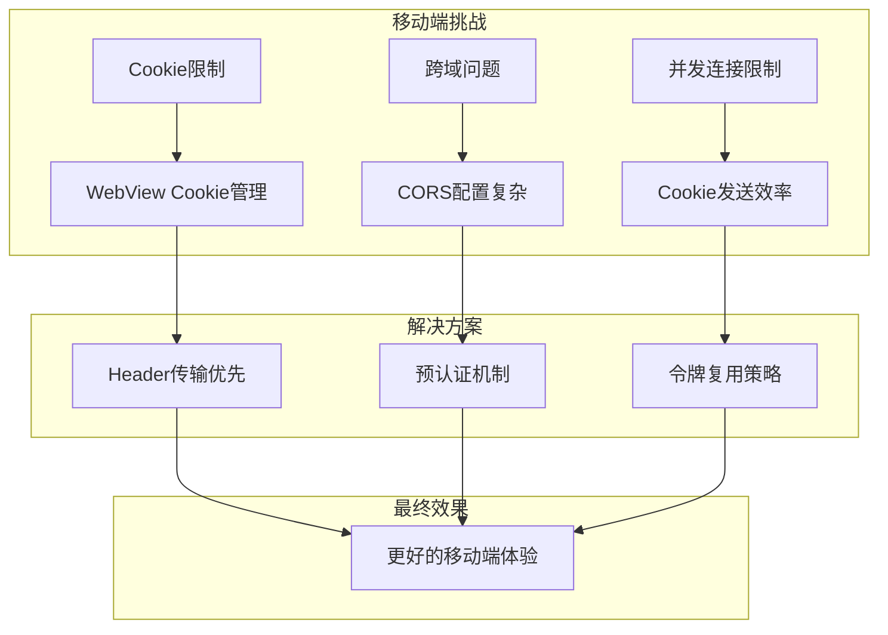
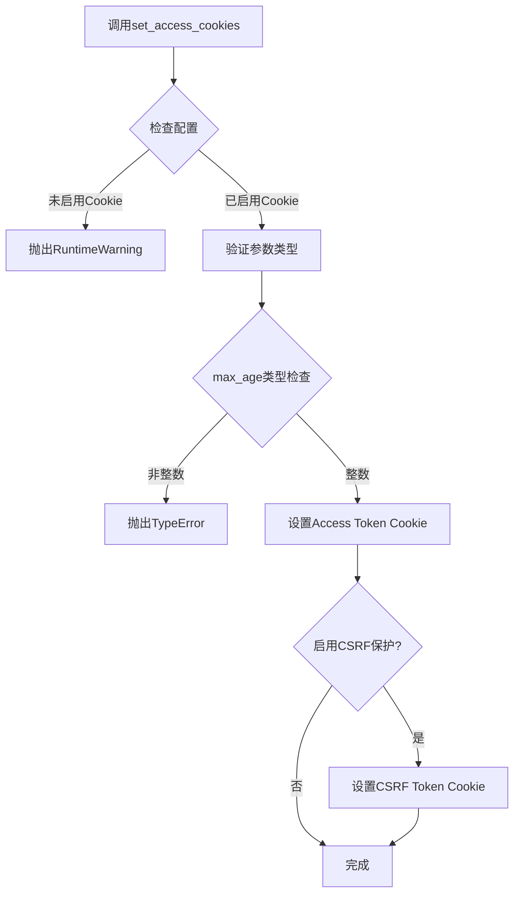
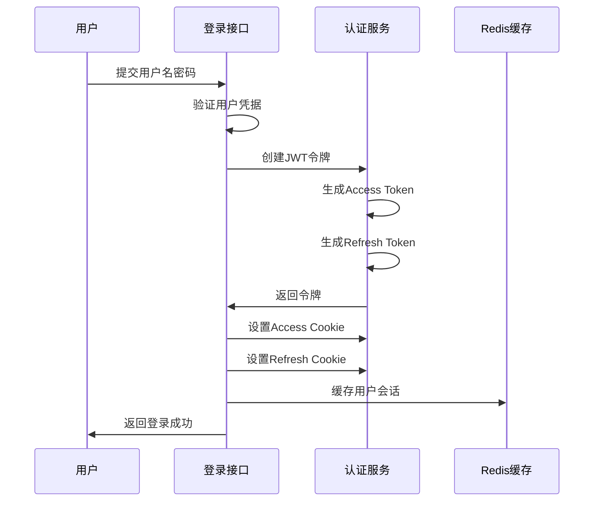

# AgentChat JWT令牌传输安全策略

## 目录
1. [概述](#概述)
2. [双重传输机制设计](#双重传输机制设计)
3. [Cookie安全配置详解](#cookie安全配置详解)
4. [CSRF保护机制](#csrf保护机制)
5. [令牌存储策略](#令牌存储策略)
6. [安全性权衡分析](#安全性权衡分析)
7. [实际代码示例](#实际代码示例)
8. [最佳实践建议](#最佳实践建议)

## 概述

AgentChat采用了先进的JWT令牌传输安全策略，通过Cookie与Header双重传输机制，在保证安全性的同时兼顾了跨域兼容性和移动端适配性。该系统的核心设计理念是在不同场景下选择最优的令牌传输方式，并通过多层次的安全防护机制确保令牌的安全性。

## 双重传输机制设计

### 架构概览

AgentChat的JWT认证系统支持两种主要的令牌传输方式：



**图表来源**
- [auth_jwt.py](https://github.com/Shy2593666979/AgentChat/tree/main/src/backend/fastapi_jwt_auth/auth_jwt.py#L687-L702)
- [auth_config.py](https://github.com/Shy2593666979/AgentChat/tree/main/src/backend/fastapi_jwt_auth/auth_config.py#L47-L53)

### 传输方式对比

| 特性 | Header传输 | Cookie传输 |
|------|------------|------------|
| **安全性** | 高（无XSS风险） | 中等（需HttpOnly） |
| **跨域支持** | 需CORS配置 | 自动携带（同源） |
| **移动端兼容** | 需手动设置 | 原生支持 |
| **浏览器兼容性** | 完全支持 | 完全支持 |
| **CSRF防护** | 需额外措施 | 内置双提交机制 |

**章节来源**
- [auth_jwt.py](https://github.com/Shy2593666979/AgentChat/tree/main/src/backend/fastapi_jwt_auth/auth_jwt.py#L687-L702)
- [auth_config.py](https://github.com/Shy2593666979/AgentChat/tree/main/src/backend/fastapi_jwt_auth/auth_config.py#L47-L53)

## Cookie安全配置详解

### HttpOnly标志的关键作用

AgentChat在Cookie配置中强制启用了HttpOnly标志，这是防止XSS攻击的重要安全措施：



**图表来源**
- [auth_jwt.py](https://github.com/Shy2593666979/AgentChat/tree/main/src/backend/fastapi_jwt_auth/auth_jwt.py#L350)
- [auth_jwt.py](https://github.com/Shy2593666979/AgentChat/tree/main/src/backend/fastapi_jwt_auth/auth_jwt.py#L401)

### Secure标志的HTTPS传输保障

系统通过Secure标志确保令牌仅通过HTTPS传输：



**图表来源**
- [auth_config.py](https://github.com/Shy2593666979/AgentChat/tree/main/src/backend/fastapi_jwt_auth/auth_config.py#L34)
- [auth_config.py](https://github.com/Shy2593666979/AgentChat/tree/main/src/backend/fastapi_jwt_auth/auth_config.py#L83)

### SameSite属性的安全控制

AgentChat支持多种SameSite配置，提供不同级别的安全保护：

| SameSite值 | 安全级别 | 适用场景 |
|------------|----------|----------|
| **Strict** | 最高 | 高度敏感操作 |
| **Lax** | 中等 | 标准Web应用 |
| **None** | 较低 | 跨域需求 |

**章节来源**
- [auth_config.py](https://github.com/Shy2593666979/AgentChat/tree/main/src/backend/fastapi_jwt_auth/auth_config.py#L35)
- [auth_config.py](https://github.com/Shy2593666979/AgentChat/tree/main/src/backend/fastapi_jwt_auth/auth_config.py#L795-L797)

## CSRF保护机制

### 双提交Cookie模式

AgentChat实现了CSRF保护的双提交Cookie模式，这是防御CSRF攻击的有效方法：



**图表来源**
- [auth_jwt.py](https://github.com/Shy2593666979/AgentChat/tree/main/src/backend/fastapi_jwt_auth/auth_jwt.py#L316-L365)
- [auth_jwt.py](https://github.com/Shy2593666979/AgentChat/tree/main/src/backend/fastapi_jwt_auth/auth_jwt.py#L498-L522)

### CSRF令牌生成与验证

系统在每个JWT令牌中嵌入唯一的CSRF令牌：



**图表来源**
- [auth_jwt.py](https://github.com/Shy2593666979/AgentChat/tree/main/src/backend/fastapi_jwt_auth/auth_jwt.py#L172-L174)
- [auth_jwt.py](https://github.com/Shy2593666979/AgentChat/tree/main/src/backend/fastapi_jwt_auth/auth_jwt.py#L307-L314)

**章节来源**
- [auth_jwt.py](https://github.com/Shy2593666979/AgentChat/tree/main/src/backend/fastapi_jwt_auth/auth_jwt.py#L316-L365)
- [auth_jwt.py](https://github.com/Shy2593666979/AgentChat/tree/main/src/backend/fastapi_jwt_auth/auth_jwt.py#L498-L522)

## 令牌存储策略

### Access Token与CSRF Token分离存储

AgentChat采用了创新的令牌分离存储策略，将access_token和csrf_token分别存储在不同的Cookie中：



**图表来源**
- [auth_jwt.py](https://github.com/Shy2593666979/AgentChat/tree/main/src/backend/fastapi_jwt_auth/auth_jwt.py#L343-L352)
- [auth_jwt.py](https://github.com/Shy2593666979/AgentChat/tree/main/src/backend/fastapi_jwt_auth/auth_jwt.py#L356-L365)

### 存储策略的设计考量

这种分离存储的设计具有以下优势：

1. **安全性隔离**：CSRF令牌不包含敏感信息
2. **访问灵活性**：前端可以读取CSRF令牌用于后续请求
3. **验证完整性**：双重验证机制提高安全性
4. **兼容性平衡**：既支持现代浏览器又保持向后兼容

**章节来源**
- [auth_jwt.py](https://github.com/Shy2593666979/AgentChat/tree/main/src/backend/fastapi_jwt_auth/auth_jwt.py#L316-L365)
- [auth_config.py](https://github.com/Shy2593666979/AgentChat/tree/main/src/backend/fastapi_jwt_auth/auth_config.py#L38-L44)

## 安全性权衡分析

### 传输方式的安全性对比

| 维度 | Header传输 | Cookie传输 |
|------|------------|------------|
| **XSS防护** | 完全依赖应用层防护 | HttpOnly提供基础防护 |
| **CSRF防护** | 需要额外CSRF Token | 内置双提交机制 |
| **跨域支持** | 需要CORS配置 | 自动处理 |
| **移动端开发** | 需要手动设置 | 原生支持 |
| **性能影响** | 无额外开销 | Cookie自动携带 |
| **调试难度** | 较难追踪 | 易于调试 |

### 移动端兼容性考虑

AgentChat在移动端兼容性方面做了特别优化：



**章节来源**
- [auth_jwt.py](https://github.com/Shy2593666979/AgentChat/tree/main/src/backend/fastapi_jwt_auth/auth_jwt.py#L687-L702)
- [auth_config.py](https://github.com/Shy2593666979/AgentChat/tree/main/src/backend/fastapi_jwt_auth/auth_config.py#L47-L53)

## 实际代码示例

### set_access_cookies方法详解

以下是AgentChat中set_access_cookies方法的详细实现分析：



**图表来源**
- [auth_jwt.py](https://github.com/Shy2593666979/AgentChat/tree/main/src/backend/fastapi_jwt_auth/auth_jwt.py#L316-L365)

### 登录流程中的令牌设置

在用户登录过程中，AgentChat会同时设置Access Token和Refresh Token：



**图表来源**
- [user.py](https://github.com/Shy2593666979/AgentChat/tree/main/src/backend/agentchat/api/v1/user.py#L51-L77)
- [services/user.py](https://github.com/Shy2593666979/AgentChat/tree/main/src/backend/agentchat/api/services/user.py#L146-L157)

**章节来源**
- [auth_jwt.py](https://github.com/Shy2593666979/AgentChat/tree/main/src/backend/fastapi_jwt_auth/auth_jwt.py#L316-L365)
- [user.py](https://github.com/Shy2593666979/AgentChat/tree/main/src/backend/agentchat/api/v1/user.py#L51-L77)

## 最佳实践建议

### 生产环境配置建议

1. **Cookie安全配置**
   ```python
   # 推荐的生产环境配置
   authjwt_cookie_secure = True      # 启用HTTPS传输
   authjwt_cookie_httponly = True    # 启用HttpOnly
   authjwt_cookie_samesite = "strict" # 最高安全级别
   ```

2. **CSRF保护配置**
   - 始终启用`authjwt_cookie_csrf_protect`
   - 定期轮换CSRF令牌
   - 实施令牌生命周期管理

3. **令牌过期策略**
   - Access Token：15分钟（短期）
   - Refresh Token：30天（长期）
   - 实施令牌刷新机制

### 监控与审计

建议实施以下监控措施：
- 令牌生成和验证的日志记录
- 异常访问模式的检测
- CSRF攻击尝试的监控
- Cookie安全配置的定期检查

### 故障排除指南

常见问题及解决方案：

| 问题 | 原因 | 解决方案 |
|------|------|----------|
| Cookie被浏览器阻止 | SameSite配置不当 | 调整SameSite设置 |
| CSRF验证失败 | 前端未正确传递CSRF令牌 | 检查CSRF令牌传递逻辑 |
| 令牌验证失败 | 时间同步问题 | 检查服务器时间配置 |
| 跨域问题 | CORS配置缺失 | 正确配置CORS策略 |

**章节来源**
- [auth_config.py](https://github.com/Shy2593666979/AgentChat/tree/main/src/backend/fastapi_jwt_auth/auth_config.py#L34-L44)
- [auth_jwt.py](https://github.com/Shy2593666979/AgentChat/tree/main/src/backend/fastapi_jwt_auth/auth_jwt.py#L316-L365)

## 结论

AgentChat的JWT令牌传输安全策略体现了现代Web应用安全的最佳实践。通过Cookie与Header双重传输机制、HttpOnly标志的XSS防护、Secure标志的HTTPS保障、以及CSRF双提交保护机制，系统在安全性、兼容性和易用性之间取得了良好的平衡。

这种设计不仅满足了企业级应用的安全要求，也为不同类型的客户端提供了灵活的适配方案。随着Web安全威胁的不断演进，AgentChat的安全策略也为其他项目提供了有价值的参考和借鉴。
