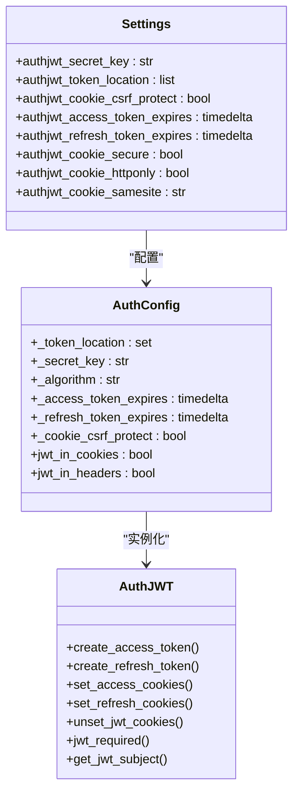
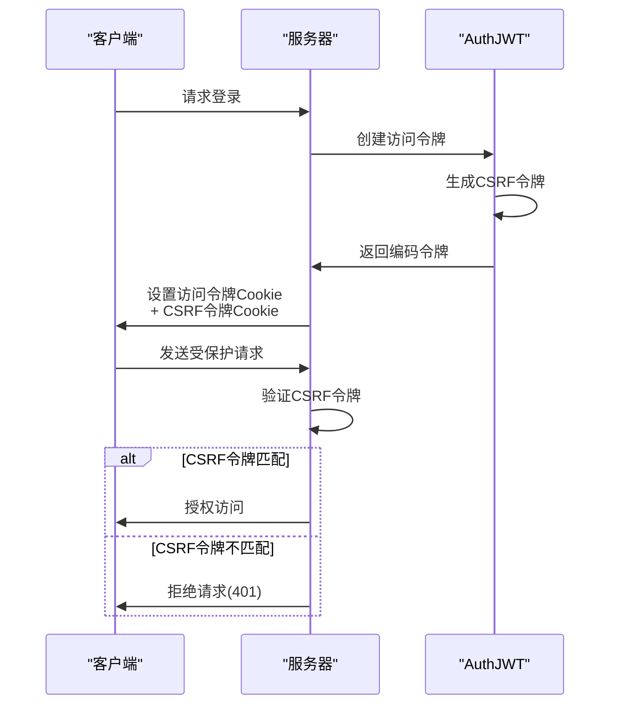
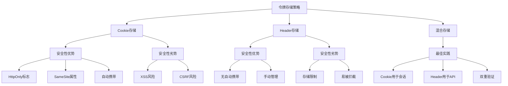
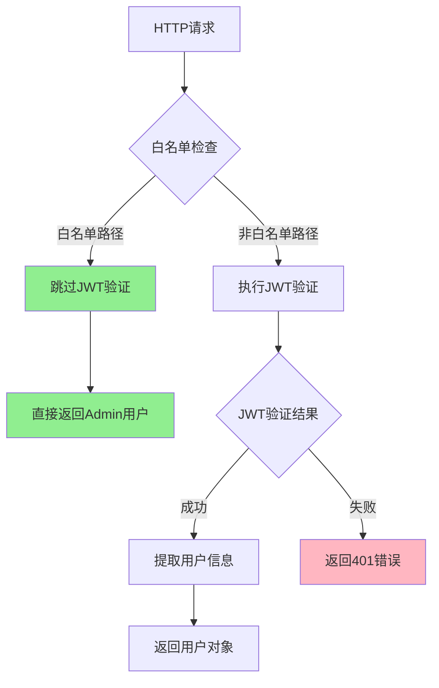
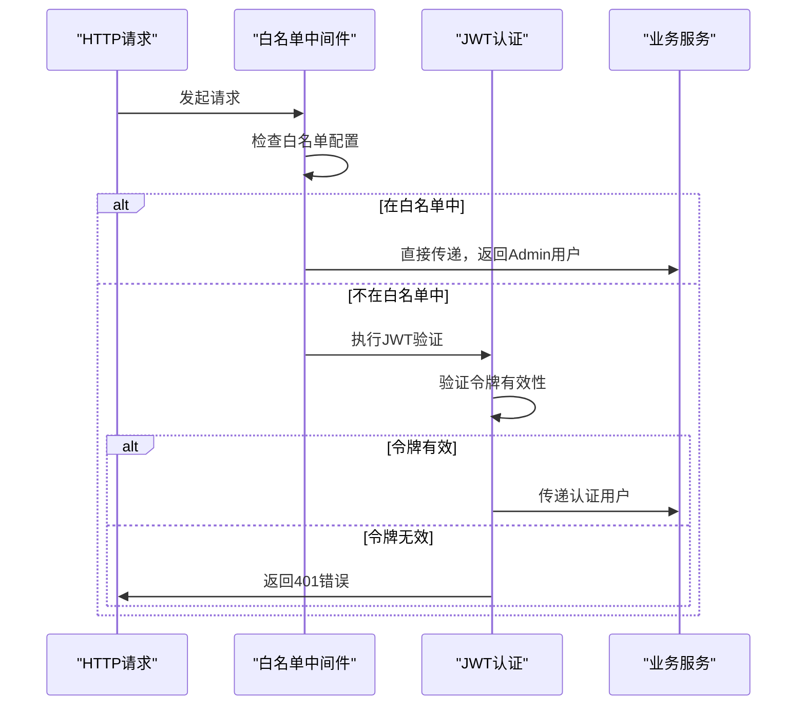

# 安全策略

<cite>
**本文档引用的文件**
- [JWT.py](https://github.com/Shy2593666979/AgentChat/src/backend/agentchat/api/JWT.py)
- [auth_config.py](https://github.com/Shy2593666979/AgentChat/src/backend/fastapi_jwt_auth/auth_config.py)
- [auth_jwt.py](https://github.com/Shy2593666979/AgentChat/src/backend/fastapi_jwt_auth/auth_jwt.py)
- [main.py](https://github.com/Shy2593666979/AgentChat/src/backend/agentchat/main.py)
- [white_list_middleware.py](https://github.com/Shy2593666979/AgentChat/src/backend/agentchat/middleware/white_list_middleware.py)
- [user.py](https://github.com/Shy2593666979/AgentChat/src/backend/agentchat/api/services/user.py)
- [user.py](https://github.com/Shy2593666979/AgentChat/src/backend/agentchat/api/v1/user.py)
- [settings.py](https://github.com/Shy2593666979/AgentChat/src/backend/agentchat/settings.py)
- [config.py](https://github.com/Shy2593666979/AgentChat/src/backend/fastapi_jwt_auth/config.py)
</cite>

## 目录
1. [概述](#概述)
2. [JWT安全配置架构](#jwt安全配置架构)
3. [CSRF保护机制设计](#csrf保护机制设计)
4. [令牌存储策略分析](#令牌存储策略分析)
5. [白名单中间件与JWT认证协同](#白名单中间件与jwt认证协同)
6. [安全风险评估与缓解措施](#安全风险评估与缓解措施)
7. [最佳实践建议](#最佳实践建议)

## 概述

AgentChat采用了基于FastAPI-JWT-Auth的综合安全策略，实现了多层次的身份验证和授权机制。该项目在JWT令牌管理、CSRF防护、令牌存储以及访问控制方面展现了精心设计的安全架构。

核心安全特性包括：
- 双重令牌机制（访问令牌和刷新令牌）
- 自定义CSRF保护策略
- 灵活的令牌存储选项
- 白名单中间件访问控制
- 多层安全防护措施

## JWT安全配置架构

### 核心配置结构

AgentChat的JWT安全配置采用了分层设计，通过多个配置文件实现灵活的安全策略定制。



**图表来源**
- [JWT.py](https://github.com/Shy2593666979/AgentChat/src/backend/agentchat/api/JWT.py#L1-L7)
- [auth_config.py](https://github.com/Shy2593666979/AgentChat/src/backend/fastapi_jwt_auth/auth_config.py#L6-L111)
- [auth_jwt.py](https://github.com/Shy2593666979/AgentChat/src/backend/fastapi_jwt_auth/auth_jwt.py#L120-L305)

### 默认安全配置

系统默认配置体现了对安全性的重视：

| 配置项 | 默认值 | 安全考虑 |
|--------|--------|----------|
| `authjwt_cookie_csrf_protect` | `False` | 显式禁用CSRF保护，需配合其他安全措施 |
| `authjwt_access_token_expires` | 15分钟 | 短期令牌，降低泄露风险 |
| `authjwt_refresh_token_expires` | 30天 | 较长有效期，平衡用户体验和安全 |
| `authjwt_cookie_secure` | `False` | 开发环境默认，生产环境应启用HTTPS |
| `authjwt_cookie_httponly` | `True` | 防止JavaScript访问，减少XSS风险 |

**节来源**
- [JWT.py](https://github.com/Shy2593666979/AgentChat/src/backend/agentchat/api/JWT.py#L5-L7)
- [auth_config.py](https://github.com/Shy2593666979/AgentChat/src/backend/fastapi_jwt_auth/auth_config.py#L24-L25)
- [auth_jwt.py](https://github.com/Shy2593666979/AgentChat/src/backend/fastapi_jwt_auth/auth_jwt.py#L349-L351)

## CSRF保护机制设计

### FastAPI-JWT-Auth的CSRF双提交机制

FastAPI-JWT-Auth原生支持CSRF双提交保护机制，通过在Cookie中存储CSRF令牌并在请求头中包含相同的令牌来防止跨站请求伪造攻击。



**图表来源**
- [auth_jwt.py](https://github.com/Shy2593666979/AgentChat/src/backend/fastapi_jwt_auth/auth_jwt.py#L316-L365)
- [auth_jwt.py](https://github.com/Shy2593666979/AgentChat/src/backend/fastapi_jwt_auth/auth_jwt.py#L490-L519)

### 项目中的CSRF策略选择

AgentChat项目中通过设置`authjwt_cookie_csrf_protect=False`显式禁用了CSRF双提交保护功能。这一设计决策基于以下考虑：

#### 设计决策原因

1. **前端SPA架构适配**：项目采用Vue.js前端框架，传统的CSRF保护机制可能与单页应用的路由导航产生冲突

2. **令牌存储方式优化**：通过同时支持Cookie和Header两种令牌传输方式，提供了更灵活的安全策略选择

3. **简化开发复杂度**：避免了前端需要维护CSRF令牌状态的复杂性

4. **替代安全措施**：项目通过白名单中间件和HTTPS强制等其他安全措施提供保护

#### 安全影响分析

**正面影响**：
- 减少了前端开发复杂度
- 提高了API的可用性和兼容性
- 支持更灵活的客户端集成方式

**潜在风险**：
- 传统CSRF攻击的风险增加
- 需要依赖其他安全措施的完整性

**补偿控制措施**：
- HTTPS强制使用
- HttpOnly Cookie标志
- SameSite Cookie属性
- 白名单中间件访问控制

**节来源**
- [JWT.py](https://github.com/Shy2593666979/AgentChat/src/backend/agentchat/api/JWT.py#L7)
- [auth_config.py](https://github.com/Shy2593666979/AgentChat/src/backend/fastapi_jwt_auth/auth_config.py#L38)
- [auth_jwt.py](https://github.com/Shy2593666979/AgentChat/src/backend/fastapi_jwt_auth/auth_jwt.py#L355-L365)

## 令牌存储策略分析

### 存储方式对比

AgentChat支持多种令牌存储方式，每种方式都有其特定的安全特性和适用场景：



**图表来源**
- [auth_jwt.py](https://github.com/Shy2593666979/AgentChat/src/backend/fastapi_jwt_auth/auth_jwt.py#L342-L352)
- [auth_jwt.py](https://github.com/Shy2593666979/AgentChat/src/backend/fastapi_jwt_auth/auth_jwt.py#L393-L403)

### Cookie传输的安全特性

当选择Cookie作为令牌存储方式时，AgentChat实现了以下安全特性：

| 安全属性 | 实现方式 | 安全效果 |
|----------|----------|----------|
| HttpOnly | `httponly=True` | 防止JavaScript访问，减少XSS攻击风险 |
| Secure | `secure=False` | 开发环境默认，生产环境应启用HTTPS |
| SameSite | `samesite=None` | 控制跨站请求行为，防止CSRF攻击 |
| MaxAge | 可配置过期时间 | 限制令牌有效期限 |
| Path | `/` | 全局访问范围 |

### Header传输的优势

Header传输方式提供了更高的灵活性和安全性：

- **手动控制**：开发者可以精确控制令牌的发送时机
- **无自动携带**：避免不必要的令牌泄露
- **适合API调用**：更适合RESTful API的无状态特性

**节来源**
- [auth_jwt.py](https://github.com/Shy2593666979/AgentChat/src/backend/fastapi_jwt_auth/auth_jwt.py#L342-L352)
- [auth_jwt.py](https://github.com/Shy2593666979/AgentChat/src/backend/fastapi_jwt_auth/auth_jwt.py#L393-L403)
- [JWT.py](https://github.com/Shy2593666979/AgentChat/src/backend/agentchat/api/JWT.py#L6)

## 白名单中间件与JWT认证协同

### 白名单中间件架构

AgentChat实现了智能的白名单中间件系统，能够根据请求路径动态判断是否需要身份验证：



**图表来源**
- [white_list_middleware.py](https://github.com/Shy2593666979/AgentChat/src/backend/agentchat/middleware/white_list_middleware.py#L23-L30)
- [user.py](https://github.com/Shy2593666979/AgentChat/src/backend/agentchat/api/services/user.py#L114-L128)

### 访问控制策略

白名单中间件与JWT认证的协同工作实现了精细化的访问控制：

#### 路径匹配规则

1. **精确匹配**：完全匹配的路径直接通过
2. **前缀匹配**：以`/*`结尾的路径进行前缀匹配
3. **通配符匹配**：以`*`结尾的路径进行通配符匹配

#### 协作流程



**图表来源**
- [white_list_middleware.py](https://github.com/Shy2593666979/AgentChat/src/backend/agentchat/middleware/white_list_middleware.py#L40-L49)
- [user.py](https://github.com/Shy2593666979/AgentChat/src/backend/agentchat/api/services/user.py#L114-L128)

### 安全边界控制

白名单机制提供了细粒度的安全边界控制：

- **公开API保护**：允许未认证用户访问特定公共接口
- **内部服务隔离**：确保敏感操作只能由认证用户执行
- **动态权限管理**：通过配置文件灵活调整访问策略

**节来源**
- [white_list_middleware.py](https://github.com/Shy2593666979/AgentChat/src/backend/agentchat/middleware/white_list_middleware.py#L7-L31)
- [user.py](https://github.com/Shy2593666979/AgentChat/src/backend/agentchat/api/services/user.py#L114-L128)

## 安全风险评估与缓解措施

### 主要安全风险识别

AgentChat项目面临的主要安全风险包括：

```mermaid
mindmap
root((安全风险))
令牌泄露
XSS攻击
中间人攻击
错误日志记录
重放攻击
令牌劫持
缺乏时效性
无状态验证
权限提升
CSRF攻击
权限边界绕过
白名单漏洞
数据泄露
敏感信息暴露
日志记录不当
配置泄露
```

### 风险缓解措施

#### 1. 令牌泄露防护

**HTTPS强制使用**
- 生产环境必须启用HTTPS
- 防止令牌在传输过程中被窃听
- 防止中间人攻击

**Cookie安全属性**
- HttpOnly标志防止JavaScript访问
- Secure标志确保仅通过HTTPS传输
- SameSite属性控制跨站请求行为

**令牌生命周期管理**
- 短期访问令牌（15分钟）
- 刷新令牌长期有效（30天）
- 自动令牌轮换机制

#### 2. 重放攻击防护

**时间戳验证**
- JWT包含签发时间（iat）和过期时间（exp）
- 服务器端验证令牌时效性
- 防止过期令牌的重复使用

**唯一标识符**
- 每个令牌包含唯一的JTI（JWT ID）
- 可用于检测重复使用
- 支持令牌撤销机制

#### 3. CSRF攻击防护

**多层防护策略**
- 白名单机制过滤公开请求
- HttpOnly Cookie减少CSRF攻击面
- SameSite属性限制跨站请求

**替代验证机制**
- Header-based验证
- 请求源验证
- 自定义验证令牌

#### 4. 权限控制强化

**最小权限原则**
- 用户角色细粒度控制
- 基于角色的访问控制（RBAC）
- 动态权限检查

**审计跟踪**
- 完整的操作日志记录
- 异常访问行为监控
- 安全事件告警机制

**节来源**
- [auth_jwt.py](https://github.com/Shy2593666979/AgentChat/src/backend/fastapi_jwt_auth/auth_jwt.py#L159-L176)
- [auth_jwt.py](https://github.com/Shy2593666979/AgentChat/src/backend/fastapi_jwt_auth/auth_jwt.py#L349-L351)
- [white_list_middleware.py](https://github.com/Shy2593666979/AgentChat/src/backend/agentchat/middleware/white_list_middleware.py#L10-L22)

## 最佳实践建议

### 生产环境部署建议

#### 1. 安全配置优化

```python
# 生产环境推荐配置
class ProductionSettings(BaseSettings):
    # 强制HTTPS
    authjwt_cookie_secure: bool = True
    
    # 启用CSRF保护（如果适用）
    authjwt_cookie_csrf_protect: bool = True
    
    # 设置SameSite严格模式
    authjwt_cookie_samesite: str = "strict"
    
    # 加强密钥管理
    authjwt_secret_key: str = os.environ.get("JWT_SECRET_KEY")
    
    # 缩短访问令牌有效期
    authjwt_access_token_expires: timedelta = timedelta(minutes=5)
```

#### 2. 监控和审计

**关键监控指标**
- JWT验证失败率
- 异常访问模式
- 令牌泄露检测
- 权限提升尝试

**日志记录策略**
- 记录所有认证事件
- 脱敏敏感信息
- 分级日志记录
- 安全日志聚合

#### 3. 持续安全改进

**定期安全评估**
- 渗透测试
- 代码安全审查
- 第三方安全审计
- 漏洞扫描

**安全更新机制**
- 及时更新依赖库
- 密钥定期轮换
- 安全策略迭代
- 威胁情报集成

### 开发阶段安全指导

#### 1. 代码安全规范

**认证相关代码**
- 统一的认证入口
- 严格的输入验证
- 异常处理标准化
- 安全上下文管理

**敏感数据处理**
- 密码加密存储
- 敏感信息脱敏
- 日志安全审查
- 配置文件保护

#### 2. 测试安全策略

**单元测试覆盖**
- 认证流程测试
- 异常场景测试
- 边界条件测试
- 性能压力测试

**集成测试验证**
- 端到端认证流程
- 跨组件安全交互
- 安全配置验证
- 回归测试覆盖

通过遵循这些最佳实践，AgentChat项目能够在保持高性能和可用性的同时，构建一个强大而可靠的安全体系，为用户提供安全可靠的AI对话体验。