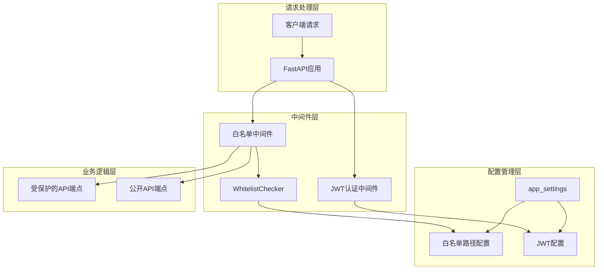
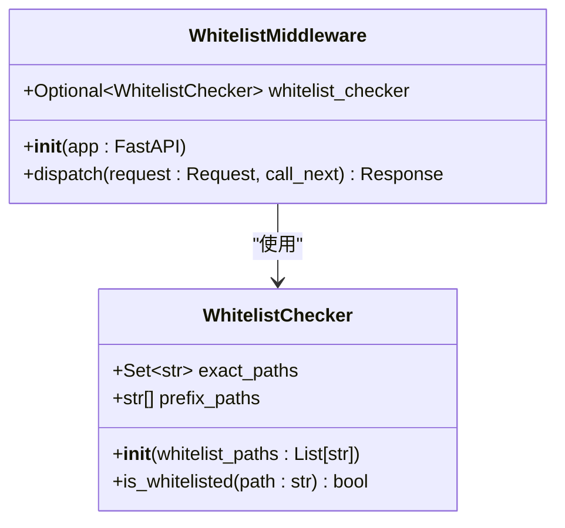
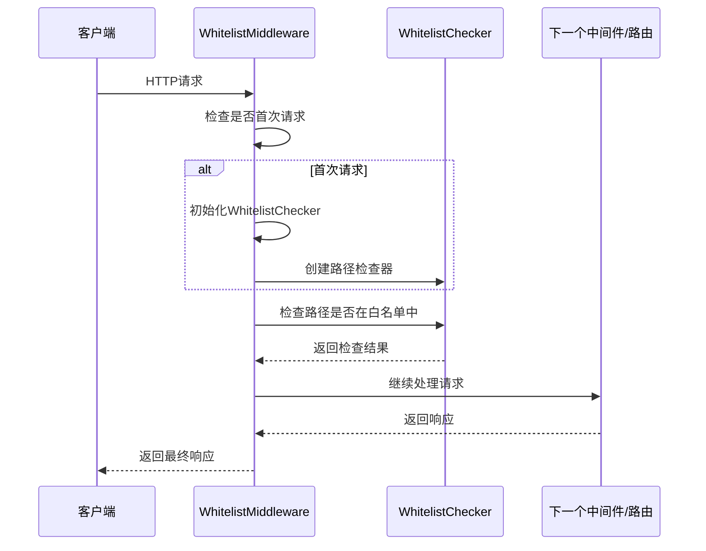
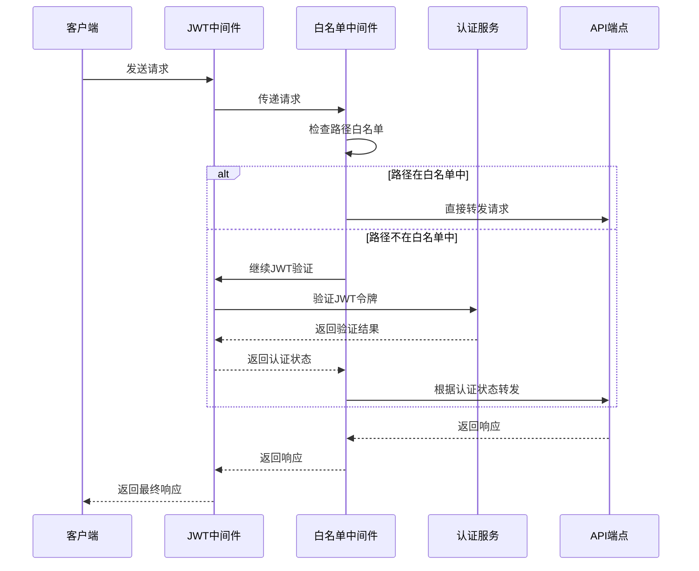
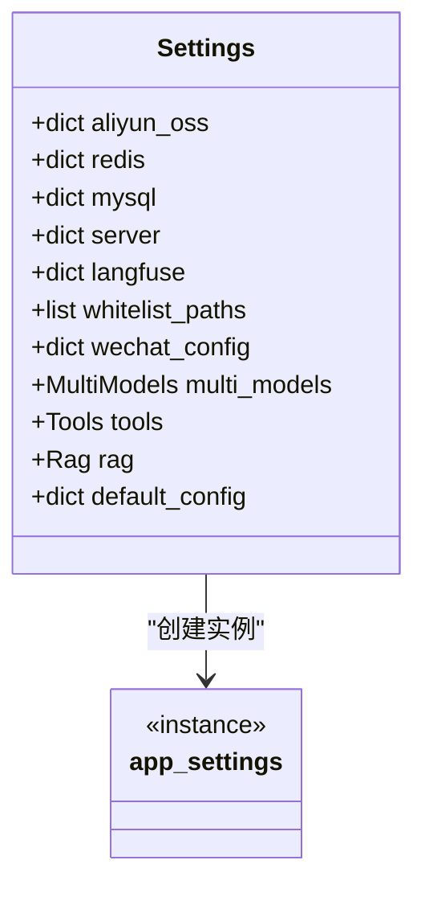
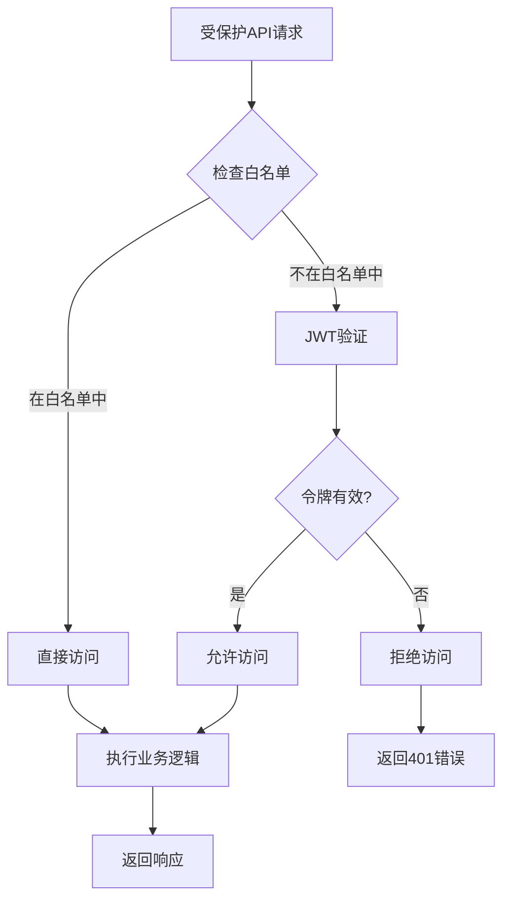

# 访问控制

<cite>
**本文档引用的文件**
- [white_list_middleware.py](https://github.com/Shy2593666979/AgentChat/src/backend/agentchat/middleware/white_list_middleware.py)
- [settings.py](https://github.com/Shy2593666979/AgentChat/src/backend/agentchat/settings.py)
- [main.py](https://github.com/Shy2593666979/AgentChat/src/backend/agentchat/main.py)
- [JWT.py](https://github.com/Shy2593666979/AgentChat/src/backend/agentchat/api/JWT.py)
- [auth_jwt.py](https://github.com/Shy2593666979/AgentChat/src/backend/fastapi_jwt_auth/auth_jwt.py)
- [config.py](https://github.com/Shy2593666979/AgentChat/src/backend/fastapi_jwt_auth/config.py)
- [auth_config.py](https://github.com/Shy2593666979/AgentChat/src/backend/fastapi_jwt_auth/auth_config.py)
- [router.py](https://github.com/Shy2593666979/AgentChat/src/backend/agentchat/api/router.py)
- [user.py](https://github.com/Shy2593666979/AgentChat/src/backend/agentchat/api/v1/user.py)
- [chat.py](https://github.com/Shy2593666979/AgentChat/src/backend/agentchat/api/v1/chat.py)
</cite>

## 目录
1. [简介](#简介)
2. [系统架构概览](#系统架构概览)
3. [白名单中间件核心组件](#白名单中间件核心组件)
4. [JWT认证机制](#jwt认证机制)
5. [中间件协同工作机制](#中间件协同工作机制)
6. [配置管理](#配置管理)
7. [实际应用场景](#实际应用场景)
8. [性能优化考虑](#性能优化考虑)
9. [故障排除指南](#故障排除指南)
10. [总结](#总结)

## 简介

AgentChat采用了一套完善的访问控制系统，通过白名单中间件（WhitelistMiddleware）与JWT认证机制的协同工作，实现了对API访问的精细化控制。该系统支持多种路径匹配模式，包括精确匹配和前缀匹配，并能够灵活地处理公开API、健康检查端点等无需认证的路径。

## 系统架构概览

AgentChat的访问控制系统采用了分层架构设计，主要包含以下核心组件：



**图表来源**
- [main.py](https://github.com/Shy2593666979/AgentChat/src/backend/agentchat/main.py#L29-L48)
- [white_list_middleware.py](https://github.com/Shy2593666979/AgentChat/src/backend/agentchat/middleware/white_list_middleware.py#L33-L50)

## 白名单中间件核心组件

### WhitelistChecker类设计

WhitelistChecker是白名单中间件的核心检查器类，负责实现路径匹配逻辑：



**图表来源**
- [white_list_middleware.py](https://github.com/Shy2593666979/AgentChat/src/backend/agentchat/middleware/white_list_middleware.py#L7-L50)

#### 路径匹配算法

WhitelistChecker实现了两种路径匹配模式：

1. **精确匹配**：直接比较路径字符串
2. **前缀匹配**：使用`startswith()`方法进行前缀匹配

匹配优先级：
- 首先检查精确匹配集合
- 如果未命中，再检查前缀匹配列表

**章节来源**
- [white_list_middleware.py](https://github.com/Shy2593666979/AgentChat/src/backend/agentchat/middleware/white_list_middleware.py#L10-L31)

### WhitelistMiddleware中间件实现

WhitelistMiddleware继承自FastAPI的BaseHTTPMiddleware，实现了请求拦截和路径检查功能：



**图表来源**
- [white_list_middleware.py](https://github.com/Shy2593666979/AgentChat/src/backend/agentchat/middleware/white_list_middleware.py#L40-L50)

**章节来源**
- [white_list_middleware.py](https://github.com/Shy2593666979/AgentChat/src/backend/agentchat/middleware/white_list_middleware.py#L33-L50)

## JWT认证机制

### JWT配置体系

AgentChat使用fastapi_jwt_auth库提供JWT认证功能，支持多种配置选项：

| 配置项 | 默认值 | 描述 |
|--------|--------|------|
| authjwt_token_location | ['headers'] | Token存储位置（headers或cookies） |
| authjwt_secret_key | 'secret' | 对称加密密钥 |
| authjwt_algorithm | 'HS256' | 加密算法 |
| authjwt_access_token_expires | timedelta(minutes=15) | 访问令牌过期时间 |
| authjwt_refresh_token_expires | timedelta(days=30) | 刷新令牌过期时间 |
| authjwt_cookie_csrf_protect | True | 是否启用CSRF保护 |

**章节来源**
- [config.py](https://github.com/Shy2593666979/AgentChat/src/backend/fastapi_jwt_auth/config.py#L11-L85)
- [auth_config.py](https://github.com/Shy2593666979/AgentChat/src/backend/fastapi_jwt_auth/auth_config.py#L6-L45)

### JWT认证装饰器

系统提供了三种主要的认证装饰器：

1. **@jwt_required**：要求必须提供有效的访问令牌
2. **@jwt_optional**：允许无令牌访问，但可以获取令牌信息
3. **@fresh_jwt_required**：要求新鲜的访问令牌（通常用于敏感操作）

```mermaid
flowchart TD
A[API请求] --> B{检查认证装饰器}
B --> |@jwt_required| C[验证访问令牌]
B --> |@jwt_optional| D[尝试验证访问令牌]
B --> |@fresh_jwt_required| E[验证新鲜访问令牌]
C --> F{令牌有效?}
D --> G{令牌存在?}
E --> H{令牌新鲜?}
F --> |是| I[允许访问]
F --> |否| J[拒绝访问]
G --> |是| K[允许访问，可获取用户信息]
G --> |否| L[允许访问，无用户信息]
H --> |是| M[允许访问]
H --> |否| N[拒绝访问]
```

**图表来源**
- [auth_jwt.py](https://github.com/Shy2593666979/AgentChat/src/backend/fastapi_jwt_auth/auth_jwt.py#L671-L806)

**章节来源**
- [auth_jwt.py](https://github.com/Shy2593666979/AgentChat/src/backend/fastapi_jwt_auth/auth_jwt.py#L671-L806)

## 中间件协同工作机制

### 请求处理流程

当JWT认证中间件与白名单中间件协同工作时，请求处理遵循以下流程：



**图表来源**
- [main.py](https://github.com/Shy2593666979/AgentChat/src/backend/agentchat/main.py#L29-L48)
- [white_list_middleware.py](https://github.com/Shy2593666979/AgentChat/src/backend/agentchat/middleware/white_list_middleware.py#L40-L50)

### 中间件注册顺序

中间件的注册顺序至关重要：

1. **CORS中间件**：处理跨域请求
2. **TraceID中间件**：添加请求追踪标识
3. **白名单中间件**：执行路径检查
4. **JWT中间件**：处理认证逻辑

**章节来源**
- [main.py](https://github.com/Shy2593666979/AgentChat/src/backend/agentchat/main.py#L29-L48)

## 配置管理

### 应用设置结构

AgentChat使用Pydantic的BaseSettings类管理配置：



**图表来源**
- [settings.py](https://github.com/Shy2593666979/AgentChat/src/backend/agentchat/settings.py#L8-L24)

### 白名单配置加载机制

白名单路径通过以下方式加载：

1. **初始化阶段**：在应用启动时通过`initialize_app_settings()`函数加载配置
2. **动态加载**：白名单中间件在首次请求时动态读取已初始化的配置
3. **默认处理**：如果配置为空，自动使用空列表避免报错

**章节来源**
- [settings.py](https://github.com/Shy2593666979/AgentChat/src/backend/agentchat/settings.py#L26-L62)
- [white_list_middleware.py](https://github.com/Shy2593666979/AgentChat/src/backend/agentchat/middleware/white_list_middleware.py#L44-L46)

## 实际应用场景

### 健康检查端点豁免

系统通过白名单机制为健康检查端点提供豁免：

```python
# 在main.py中定义的健康检查端点
@app.get("/health")
def check_health():
    return {'status': 'OK'}
```

这个端点不需要任何认证，因为它是公开的监控接口。

**章节来源**
- [main.py](https://github.com/Shy2593666979/AgentChat/src/backend/agentchat/main.py#L23-L27)

### 公开API处理

对于不需要认证的公开API，可以通过配置白名单路径来实现：

```python
# 示例配置（假设在配置文件中）
whitelist_paths = [
    "/health",           # 健康检查
    "/api/v1/user/login", # 用户登录
    "/api/v1/user/register" # 用户注册
]
```

### 受保护API的认证流程

对于需要认证的API，系统会自动进行JWT验证：



**章节来源**
- [user.py](https://github.com/Shy2593666979/AgentChat/src/backend/agentchat/api/v1/user.py#L51-L78)
- [chat.py](https://github.com/Shy2593666979/AgentChat/src/backend/agentchat/api/v1/chat.py#L49-L52)

## 性能优化考虑

### 延迟初始化策略

白名单中间件采用延迟初始化策略，只有在首次请求时才创建WhitelistChecker实例，这样可以确保app_settings已经完全初始化。

### 路径匹配优化

- **精确匹配优先**：使用Python的Set数据结构进行O(1)时间复杂度的精确匹配
- **前缀匹配缓存**：将前缀路径预处理为列表，减少重复计算
- **早期退出**：一旦找到匹配项就立即返回结果

### 内存使用优化

- **单例模式**：WhitelistChecker实例在整个应用生命周期内只创建一次
- **惰性加载**：配置信息只在需要时才从app_settings中读取

## 故障排除指南

### 常见问题及解决方案

1. **白名单不生效**
   - 检查配置文件中的whitelist_paths设置
   - 确认中间件注册顺序正确
   - 验证路径格式是否符合预期

2. **JWT认证失败**
   - 检查JWT配置参数
   - 验证令牌格式和签名
   - 确认令牌未过期

3. **中间件冲突**
   - 检查中间件注册顺序
   - 确认没有重复的中间件配置
   - 验证请求处理链的完整性

### 调试技巧

1. **启用日志记录**：在中间件中添加调试日志
2. **检查配置加载**：确认app_settings正确加载
3. **测试路径匹配**：单独测试WhitelistChecker的匹配逻辑

**章节来源**
- [white_list_middleware.py](https://github.com/Shy2593666979/AgentChat/src/backend/agentchat/middleware/white_list_middleware.py#L42-L46)

## 总结

AgentChat的访问控制系统通过白名单中间件与JWT认证机制的完美结合，实现了灵活而安全的API访问控制。该系统的主要优势包括：

1. **灵活性**：支持精确匹配和前缀匹配两种路径模式
2. **安全性**：与JWT认证深度集成，提供多层次的安全保障
3. **可扩展性**：配置驱动的设计使得系统易于扩展和维护
4. **性能**：优化的匹配算法和延迟初始化策略确保良好的性能表现

通过合理的配置和使用，这套访问控制系统能够满足大多数企业级应用的安全需求，同时保持良好的开发体验和运维便利性。