# 认证与授权

<cite>
**本文档引用的文件**
- [src/backend/agentchat/api/JWT.py](https://github.com/Shy2593666979/AgentChat/src/backend/agentchat/api/JWT.py)
- [src/backend/agentchat/utils/JWT.py](https://github.com/Shy2593666979/AgentChat/src/backend/agentchat/utils/JWT.py)
- [src/backend/agentchat/settings.py](https://github.com/Shy2593666979/AgentChat/src/backend/agentchat/settings.py)
- [src/backend/agentchat/api/services/user.py](https://github.com/Shy2593666979/AgentChat/src/backend/agentchat/api/services/user.py)
- [src/backend/agentchat/api/v1/user.py](https://github.com/Shy2593666979/AgentChat/src/backend/agentchat/api/v1/user.py)
- [src/backend/agentchat/main.py](https://github.com/Shy2593666979/AgentChat/src/backend/agentchat/main.py)
- [src/backend/fastapi_jwt_auth/auth_jwt.py](https://github.com/Shy2593666979/AgentChat/src/backend/fastapi_jwt_auth/auth_jwt.py)
- [src/backend/fastapi_jwt_auth/auth_config.py](https://github.com/Shy2593666979/AgentChat/src/backend/fastapi_jwt_auth/auth_config.py)
- [src/backend/fastapi_jwt_auth/exceptions.py](https://github.com/Shy2593666979/AgentChat/src/backend/fastapi_jwt_auth/exceptions.py)
- [src/backend/fastapi_jwt_auth/config.py](https://github.com/Shy2593666979/AgentChat/src/backend/fastapi_jwt_auth/config.py)
- [src/backend/agentchat/api/errcode/user.py](https://github.com/Shy2593666979/AgentChat/src/backend/agentchat/api/errcode/user.py)
</cite>

## 目录
1. [简介](#简介)
2. [系统架构概览](#系统架构概览)
3. [JWT配置与设置](#jwt配置与设置)
4. [用户登录流程](#用户登录流程)
5. [JWT中间件与验证](#jwt中间件与验证)
6. [令牌生成与刷新](#令牌生成与刷新)
7. [错误处理机制](#错误处理机制)
8. [安全最佳实践](#安全最佳实践)
9. [故障排除指南](#故障排除指南)
10. [总结](#总结)

## 简介

AgentChat采用基于JWT（JSON Web Token）的认证与授权机制，为用户提供安全可靠的访问控制。系统集成了fastapi_jwt_auth库，提供了完整的JWT生命周期管理，包括令牌生成、验证、刷新和撤销等功能。

该认证系统的核心特性包括：
- 支持从cookies和headers两种位置提取JWT令牌
- 默认令牌有效期为86400秒（24小时）
- 可配置的密钥管理和算法选择
- CSRF保护机制（可选禁用）
- 完善的错误处理和异常管理

## 系统架构概览

AgentChat的JWT认证系统采用分层架构设计，确保了安全性和可维护性：

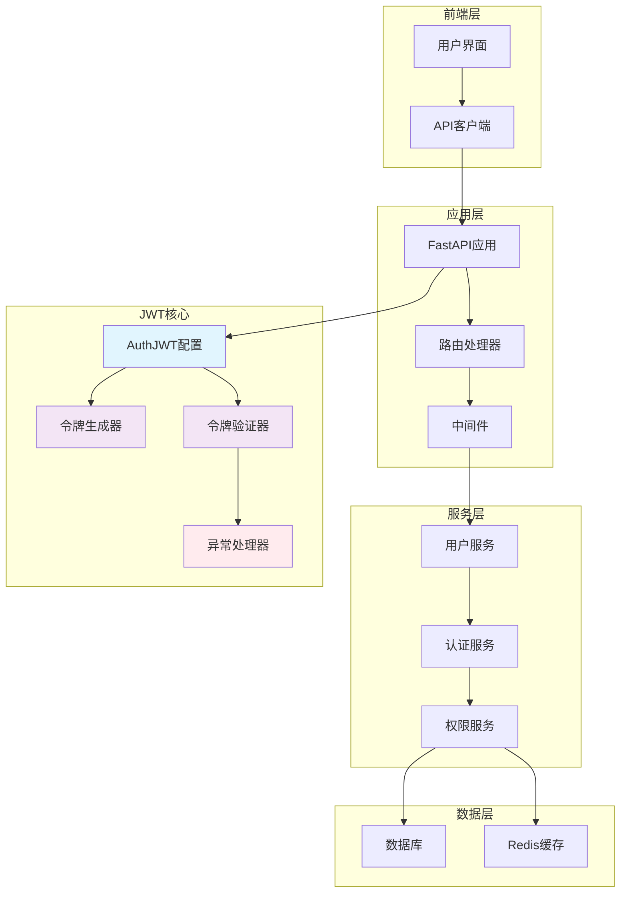
```mermaid
graph TB
subgraph "前端层"
A[用户界面]
B[API客户端]
end
subgraph "应用层"
C[FastAPI应用]
D[路由处理器]
E[中间件]
end
subgraph "服务层"
F[用户服务]
G[认证服务]
H[权限服务]
end
subgraph "数据层"
I[数据库]
J[Redis缓存]
end
subgraph "JWT核心"
K[AuthJWT配置]
L[令牌生成器]
M[令牌验证器]
N[异常处理器]
end
A --> B
B --> C
C --> D
D --> E
E --> F
F --> G
G --> H
H --> I
H --> J
C --> K
K --> L
K --> M
M --> N
style K fill:#e1f5fe
style L fill:#f3e5f5
style M fill:#f3e5f5
style N fill:#ffebee
```

**图表来源**
- [src/backend/agentchat/main.py](https://github.com/Shy2593666979/AgentChat/src/backend/agentchat/main.py#L77-L107)
- [src/backend/agentchat/api/services/user.py](https://github.com/Shy2593666979/AgentChat/src/backend/agentchat/api/services/user.py#L1-L157)

## JWT配置与设置

### Settings类定义

AgentChat在两个不同的位置定义了JWT配置Settings类，分别服务于不同的需求：

#### api/JWT.py中的配置

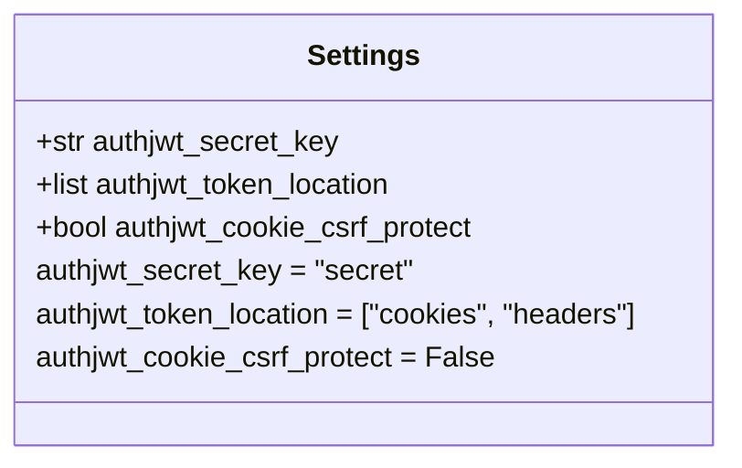
```mermaid
classDiagram
class Settings {
+str authjwt_secret_key
+list authjwt_token_location
+bool authjwt_cookie_csrf_protect
}
Settings : authjwt_secret_key = "secret"
Settings : authjwt_token_location = ["cookies", "headers"]
Settings : authjwt_cookie_csrf_protect = False
```

**图表来源**
- [src/backend/agentchat/api/JWT.py](https://github.com/Shy2593666979/AgentChat/src/backend/agentchat/api/JWT.py#L4-L7)

#### utils/JWT.py中的配置

```mermaid
classDiagram
class Settings {
+str authjwt_secret_key
+str[] authjwt_token_location
+bool authjwt_cookie_csrf_protect
}
Settings : authjwt_secret_key = "secret"
Settings : authjwt_token_location = ["cookies", "headers"]
Settings : authjwt_cookie_csrf_protect = False
```

**图表来源**
- [src/backend/agentchat/utils/JWT.py](https://github.com/Shy2593666979/AgentChat/src/backend/agentchat/utils/JWT.py#L10-L15)

### 关键配置项说明

| 配置项 | 类型 | 默认值 | 描述 |
|--------|------|--------|------|
| authjwt_secret_key | str | 'secret' | JWT签名密钥，用于验证令牌完整性 |
| authjwt_token_location | list | ['cookies', 'headers'] | 令牌存储位置，支持cookies和headers |
| authjwt_cookie_csrf_protect | bool | False | 是否启用CSRF保护（已禁用） |

### 令牌有效期配置

系统在多个地方定义了令牌的有效期：

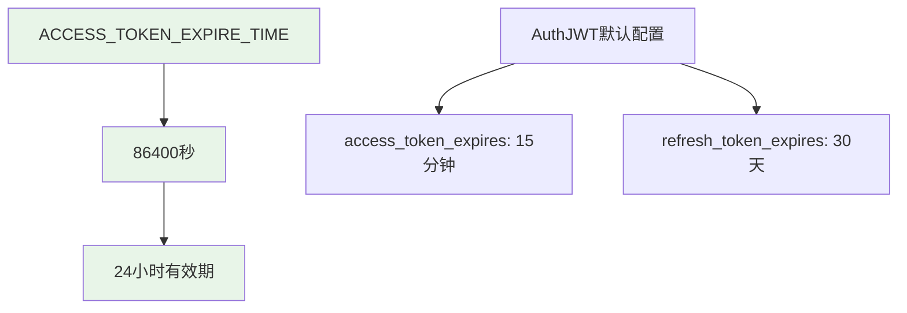
```mermaid
flowchart TD
A[ACCESS_TOKEN_EXPIRE_TIME] --> B[86400秒]
B --> C[24小时有效期]
D[AuthJWT默认配置] --> E[access_token_expires: 15分钟]
D --> F[refresh_token_expires: 30天]
style A fill:#e8f5e8
style B fill:#e8f5e8
style C fill:#e8f5e8
```

**图表来源**
- [src/backend/agentchat/utils/JWT.py](https://github.com/Shy2593666979/AgentChat/src/backend/agentchat/utils/JWT.py#L7-L8)
- [src/backend/fastapi_jwt_auth/auth_config.py](https://github.com/Shy2593666979/AgentChat/src/backend/fastapi_jwt_auth/auth_config.py#L24-L25)

**章节来源**
- [src/backend/agentchat/api/JWT.py](https://github.com/Shy2593666979/AgentChat/src/backend/agentchat/api/JWT.py#L1-L7)
- [src/backend/agentchat/utils/JWT.py](https://github.com/Shy2593666979/AgentChat/src/backend/agentchat/utils/JWT.py#L1-L18)

## 用户登录流程

### 登录请求处理流程

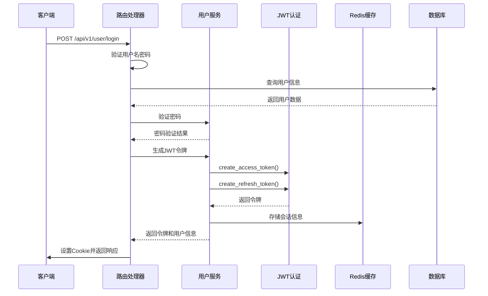
```mermaid
sequenceDiagram
participant Client as 客户端
participant Router as 路由处理器
participant UserService as 用户服务
participant AuthJWT as JWT认证
participant Redis as Redis缓存
participant DB as 数据库
Client->>Router : POST /api/v1/user/login
Router->>Router : 验证用户名密码
Router->>DB : 查询用户信息
DB-->>Router : 返回用户数据
Router->>UserService : 验证密码
UserService-->>Router : 密码验证结果
Router->>UserService : 生成JWT令牌
UserService->>AuthJWT : create_access_token()
UserService->>AuthJWT : create_refresh_token()
AuthJWT-->>UserService : 返回令牌
UserService->>Redis : 存储会话信息
UserService-->>Router : 返回令牌和用户信息
Router->>Client : 设置Cookie并返回响应
```

**图表来源**
- [src/backend/agentchat/api/v1/user.py](https://github.com/Shy2593666979/AgentChat/src/backend/agentchat/api/v1/user.py#L51-L77)
- [src/backend/agentchat/api/services/user.py](https://github.com/Shy2593666979/AgentChat/src/backend/agentchat/api/services/user.py#L146-L157)

### 密码验证机制

系统采用多层密码安全策略：

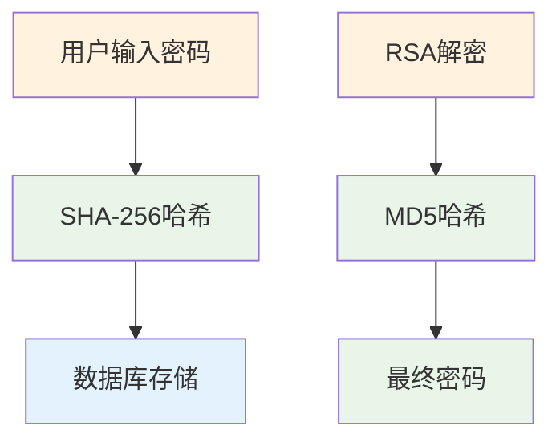
```mermaid
flowchart TD
A[用户输入密码] --> B[SHA-256哈希]
B --> C[数据库存储]
D[RSA解密] --> E[MD5哈希]
E --> F[最终密码]
style A fill:#fff3e0
style B fill:#e8f5e8
style C fill:#e3f2fd
style D fill:#fff3e0
style E fill:#e8f5e8
style F fill:#e8f5e8
```

**图表来源**
- [src/backend/agentchat/api/services/user.py](https://github.com/Shy2593666979/AgentChat/src/backend/agentchat/api/services/user.py#L45-L65)

### 用户角色权限模型

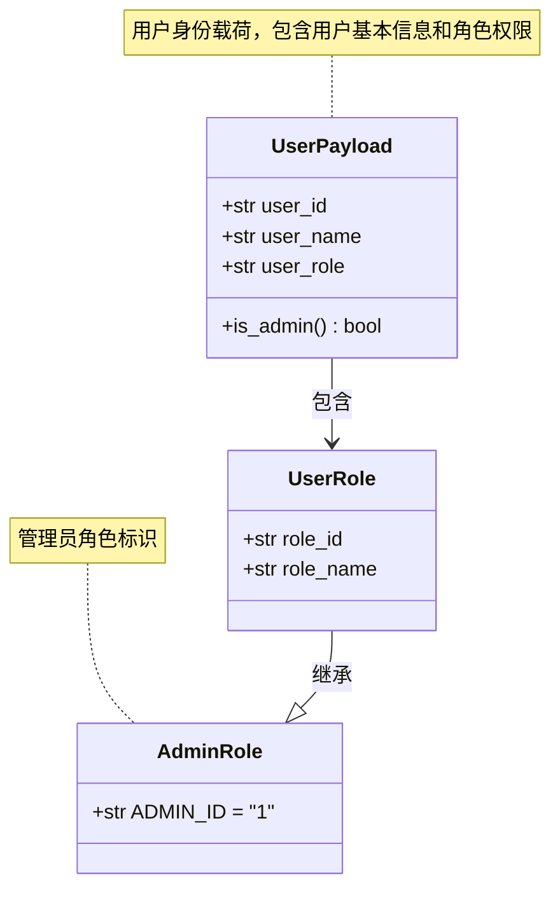
```mermaid
classDiagram
class UserPayload {
+str user_id
+str user_name
+str user_role
+is_admin() bool
}
class UserRole {
+str role_id
+str role_name
}
class AdminRole {
+str ADMIN_ID = "1"
}
UserPayload --> UserRole : 包含
UserRole --|> AdminRole : 继承
note for UserPayload "用户身份载荷，包含用户基本信息和角色权限"
note for AdminRole "管理员角色标识"
```

**图表来源**
- [src/backend/agentchat/api/services/user.py](https://github.com/Shy2593666979/AgentChat/src/backend/agentchat/api/services/user.py#L23-L40)

**章节来源**
- [src/backend/agentchat/api/v1/user.py](https://github.com/Shy2593666979/AgentChat/src/backend/agentchat/api/v1/user.py#L51-L77)
- [src/backend/agentchat/api/services/user.py](https://github.com/Shy2593666979/AgentChat/src/backend/agentchat/api/services/user.py#L146-L157)

## JWT中间件与验证

### 中间件配置与初始化

系统在应用启动时配置JWT中间件：

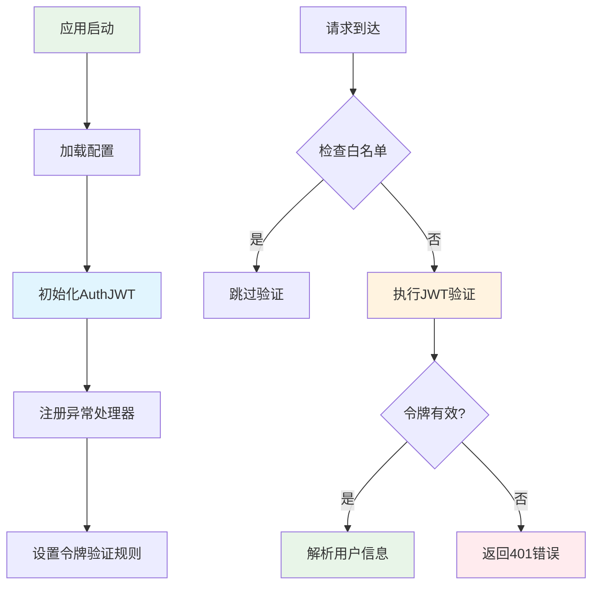
```mermaid
flowchart TD
A[应用启动] --> B[加载配置]
B --> C[初始化AuthJWT]
C --> D[注册异常处理器]
D --> E[设置令牌验证规则]
F[请求到达] --> G{检查白名单}
G --> |是| H[跳过验证]
G --> |否| I[执行JWT验证]
I --> J{令牌有效?}
J --> |是| K[解析用户信息]
J --> |否| L[返回401错误]
style A fill:#e8f5e8
style C fill:#e1f5fe
style I fill:#fff3e0
style K fill:#e8f5e8
style L fill:#ffebee
```

**图表来源**
- [src/backend/agentchat/main.py](https://github.com/Shy2593666979/AgentChat/src/backend/agentchat/main.py#L86-L97)
- [src/backend/agentchat/api/services/user.py](https://github.com/Shy2593666979/AgentChat/src/backend/agentchat/api/services/user.py#L114-L128)

### 令牌提取机制

系统支持从多种位置提取JWT令牌：

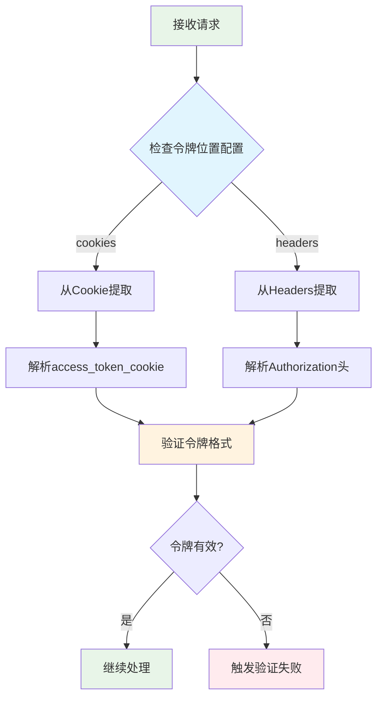
```mermaid
flowchart TD
A[接收请求] --> B{检查令牌位置配置}
B --> |cookies| C[从Cookie提取]
B --> |headers| D[从Headers提取]
C --> E[解析access_token_cookie]
D --> F[解析Authorization头]
E --> G[验证令牌格式]
F --> G
G --> H{令牌有效?}
H --> |是| I[继续处理]
H --> |否| J[触发验证失败]
style A fill:#e8f5e8
style B fill:#e1f5fe
style G fill:#fff3e0
style I fill:#e8f5e8
style J fill:#ffebee
```

**图表来源**
- [src/backend/fastapi_jwt_auth/auth_jwt.py](https://github.com/Shy2593666979/AgentChat/src/backend/fastapi_jwt_auth/auth_jwt.py#L35-L38)

### 白名单机制

系统实现了智能的白名单机制来区分受保护资源和公开资源：

```mermaid
flowchart TD
A[请求处理] --> B{检查白名单状态}
B --> |is_whitelisted=true| C[直接返回Admin用户]
B --> |is_whitelisted=false| D[执行JWT验证]
C --> E[UserPayload(user_id="1", user_name="Admin")]
D --> F[authorize.jwt_required()]
F --> G{验证成功?}
G --> |是| H[解析JWT载荷]
G --> |否| I[抛出HTTPException 401]
style A fill:#e8f5e8
style C fill:#e8f5e8
style E fill:#e8f5e8
style D fill:#fff3e0
style H fill:#e8f5e8
style I fill:#ffebee
```

**图表来源**
- [src/backend/agentchat/api/services/user.py](https://github.com/Shy2593666979/AgentChat/src/backend/agentchat/api/services/user.py#L118-L128)

**章节来源**
- [src/backend/agentchat/main.py](https://github.com/Shy2593666979/AgentChat/src/backend/agentchat/main.py#L86-L97)
- [src/backend/agentchat/api/services/user.py](https://github.com/Shy2593666979/AgentChat/src/backend/agentchat/api/services/user.py#L114-L128)

## 令牌生成与刷新

### 令牌生成流程

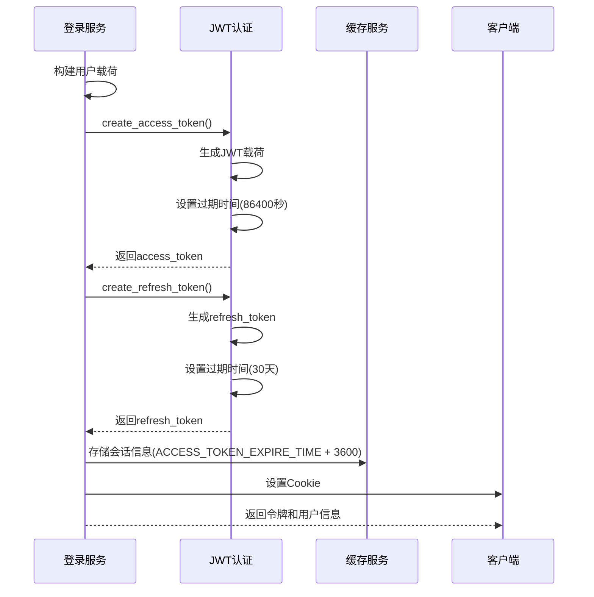
```mermaid
sequenceDiagram
participant Login as 登录服务
participant AuthJWT as JWT认证
participant Redis as 缓存服务
participant Client as 客户端
Login->>Login : 构建用户载荷
Login->>AuthJWT : create_access_token()
AuthJWT->>AuthJWT : 生成JWT载荷
AuthJWT->>AuthJWT : 设置过期时间(86400秒)
AuthJWT-->>Login : 返回access_token
Login->>AuthJWT : create_refresh_token()
AuthJWT->>AuthJWT : 生成refresh_token
AuthJWT->>AuthJWT : 设置过期时间(30天)
AuthJWT-->>Login : 返回refresh_token
Login->>Redis : 存储会话信息(ACCESS_TOKEN_EXPIRE_TIME + 3600)
Login->>Client : 设置Cookie
Login-->>Client : 返回令牌和用户信息
```

**图表来源**
- [src/backend/agentchat/api/services/user.py](https://github.com/Shy2593666979/AgentChat/src/backend/agentchat/api/services/user.py#L146-L157)

### 令牌载荷结构

JWT令牌包含以下关键信息：

| 字段名 | 类型 | 描述 | 示例值 |
|--------|------|------|--------|
| user_id | string | 用户唯一标识符 | "12345" |
| user_name | string | 用户名 | "admin" |
| role | string/array | 用户角色或角色列表 | "admin" 或 ["1", "2"] |
| iat | integer | 发布时间戳 | 1640995200 |
| exp | integer | 过期时间戳 | 1641081600 |
| jti | string | JWT标识符 | "uuid-string" |

### 刷新令牌机制

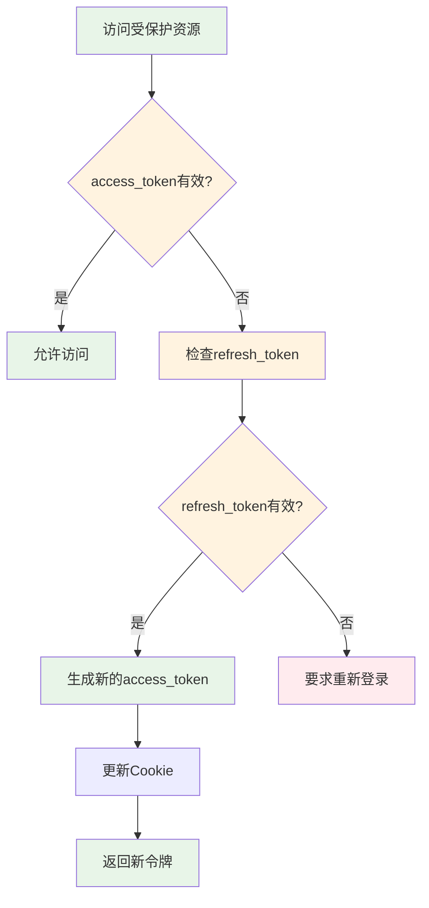
```mermaid
flowchart TD
A[访问受保护资源] --> B{access_token有效?}
B --> |是| C[允许访问]
B --> |否| D[检查refresh_token]
D --> E{refresh_token有效?}
E --> |是| F[生成新的access_token]
E --> |否| G[要求重新登录]
F --> H[更新Cookie]
H --> I[返回新令牌]
style A fill:#e8f5e8
style B fill:#fff3e0
style C fill:#e8f5e8
style D fill:#fff3e0
style E fill:#fff3e0
style F fill:#e8f5e8
style G fill:#ffebee
style I fill:#e8f5e8
```

**章节来源**
- [src/backend/agentchat/api/services/user.py](https://github.com/Shy2593666979/AgentChat/src/backend/agentchat/api/services/user.py#L146-L157)

## 错误处理机制

### 异常类型与处理

AgentChat实现了完善的JWT异常处理体系：

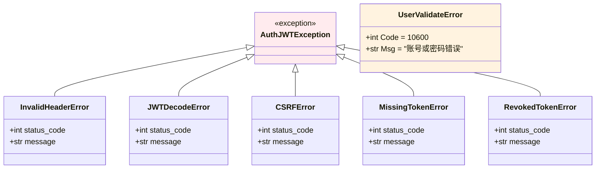
```mermaid
classDiagram
class AuthJWTException {
<<exception>>
}
class InvalidHeaderError {
+int status_code
+str message
}
class JWTDecodeError {
+int status_code
+str message
}
class CSRFError {
+int status_code
+str message
}
class MissingTokenError {
+int status_code
+str message
}
class RevokedTokenError {
+int status_code
+str message
}
class UserValidateError {
+int Code = 10600
+str Msg = "账号或密码错误"
}
AuthJWTException <|-- InvalidHeaderError
AuthJWTException <|-- JWTDecodeError
AuthJWTException <|-- CSRFError
AuthJWTException <|-- MissingTokenError
AuthJWTException <|-- RevokedTokenError
style AuthJWTException fill : #ffebee
style UserValidateError fill : #fff3e0
```

**图表来源**
- [src/backend/fastapi_jwt_auth/exceptions.py](https://github.com/Shy2593666979/AgentChat/src/backend/fastapi_jwt_auth/exceptions.py#L1-L72)
- [src/backend/agentchat/api/errcode/user.py](https://github.com/Shy2593666979/AgentChat/src/backend/agentchat/api/errcode/user.py#L5-L8)

### 错误响应处理流程

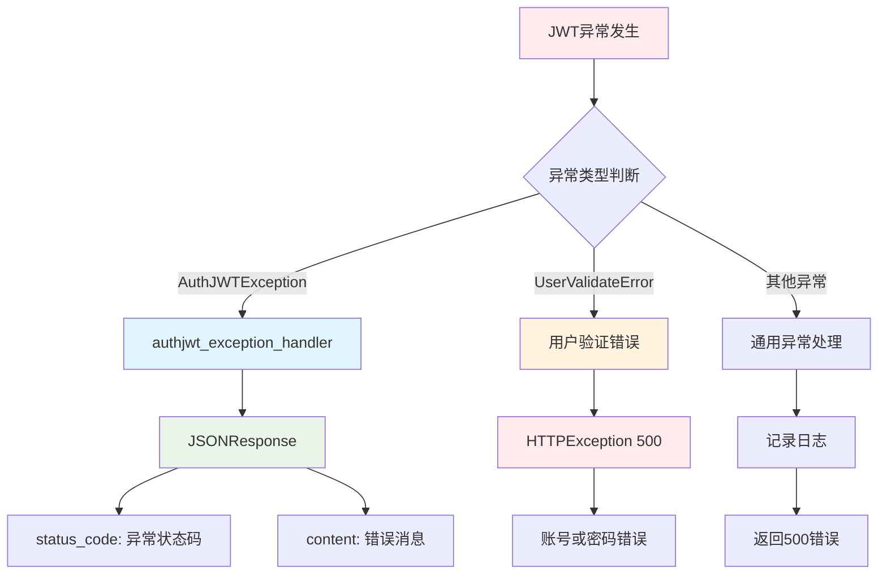
```mermaid
flowchart TD
A[JWT异常发生] --> B{异常类型判断}
B --> |AuthJWTException| C[authjwt_exception_handler]
B --> |UserValidateError| D[用户验证错误]
B --> |其他异常| E[通用异常处理]
C --> F[JSONResponse]
F --> G[status_code: 异常状态码]
F --> H[content: 错误消息]
D --> I[HTTPException 500]
I --> J[账号或密码错误]
E --> K[记录日志]
K --> L[返回500错误]
style A fill:#ffebee
style C fill:#e1f5fe
style D fill:#fff3e0
style F fill:#e8f5e8
style I fill:#ffebee
```

**图表来源**
- [src/backend/agentchat/main.py](https://github.com/Shy2593666979/AgentChat/src/backend/agentchat/main.py#L92-L97)

### 常见错误场景

| 错误类型 | HTTP状态码 | 错误消息 | 解决方案 |
|----------|------------|----------|----------|
| 无效令牌 | 401 | Invalid authentication credentials | 重新登录获取新令牌 |
| 令牌过期 | 401 | Token has expired | 使用refresh_token刷新 |
| 缺少令牌 | 401 | No authorization token found | 在请求中包含有效的JWT |
| 密码错误 | 500 | 账号或密码错误 | 检查用户名和密码 |
| 用户被禁用 | 500 | 该账号已被禁用 | 联系管理员 |

**章节来源**
- [src/backend/agentchat/main.py](https://github.com/Shy2593666979/AgentChat/src/backend/agentchat/main.py#L92-L97)
- [src/backend/agentchat/api/errcode/user.py](https://github.com/Shy2593666979/AgentChat/src/backend/agentchat/api/errcode/user.py#L1-L43)

## 安全最佳实践

### CSRF保护设计决策

AgentChat选择禁用CSRF保护的原因和安全影响：

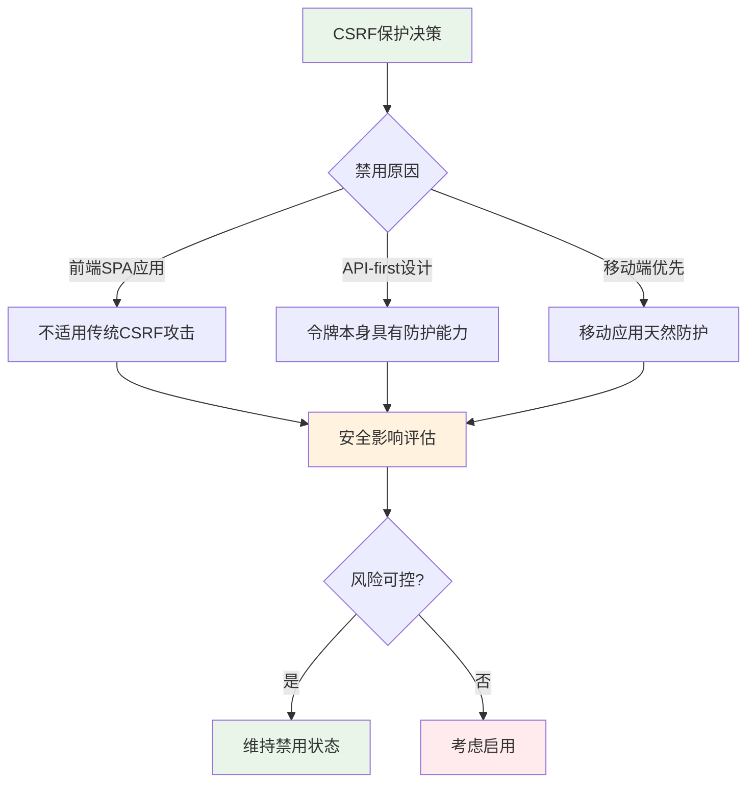
```mermaid
flowchart TD
A[CSRF保护决策] --> B{禁用原因}
B --> |前端SPA应用| C[不适用传统CSRF攻击]
B --> |API-first设计| D[令牌本身具有防护能力]
B --> |移动端优先| E[移动应用天然防护]
C --> F[安全影响评估]
D --> F
E --> F
F --> G{风险可控?}
G --> |是| H[维持禁用状态]
G --> |否| I[考虑启用]
style A fill:#e8f5e8
style F fill:#fff3e0
style H fill:#e8f5e8
style I fill:#ffebee
```

### 密钥管理最佳实践

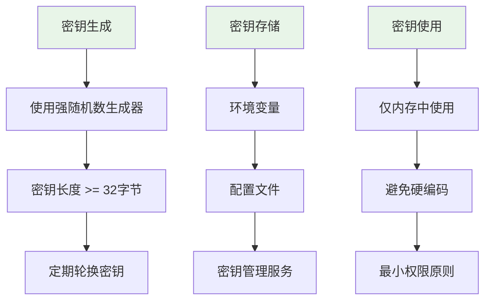
```mermaid
flowchart TD
A[密钥生成] --> B[使用强随机数生成器]
B --> C[密钥长度 >= 32字节]
C --> D[定期轮换密钥]
E[密钥存储] --> F[环境变量]
F --> G[配置文件]
G --> H[密钥管理服务]
I[密钥使用] --> J[仅内存中使用]
J --> K[避免硬编码]
K --> L[最小权限原则]
style A fill:#e8f5e8
style E fill:#e8f5e8
style I fill:#e8f5e8
```

### 传输安全措施

| 安全措施 | 实现方式 | 安全级别 |
|----------|----------|----------|
| HTTPS强制 | 生产环境必须启用 | 高 |
| Secure Cookie | 设置Secure标志 | 高 |
| HttpOnly Cookie | 防止XSS攻击 | 高 |
| SameSite属性 | 防止跨站请求 | 中 |
| 令牌过期时间 | 短期访问令牌 | 中 |

### 权限控制策略

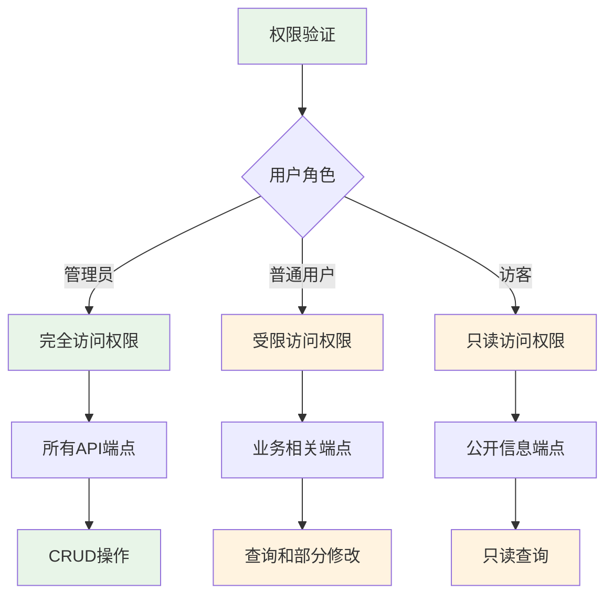
```mermaid
flowchart TD
A[权限验证] --> B{用户角色}
B --> |管理员| C[完全访问权限]
B --> |普通用户| D[受限访问权限]
B --> |访客| E[只读访问权限]
C --> F[所有API端点]
D --> G[业务相关端点]
E --> H[公开信息端点]
F --> I[CRUD操作]
G --> J[查询和部分修改]
H --> K[只读查询]
style A fill:#e8f5e8
style C fill:#e8f5e8
style D fill:#fff3e0
style E fill:#fff3e0
style I fill:#e8f5e8
style J fill:#fff3e0
style K fill:#fff3e0
```

**章节来源**
- [src/backend/agentchat/api/JWT.py](https://github.com/Shy2593666979/AgentChat/src/backend/agentchat/api/JWT.py#L6-L7)
- [src/backend/agentchat/utils/JWT.py](https://github.com/Shy2593666979/AgentChat/src/backend/agentchat/utils/JWT.py#L14-L15)

## 故障排除指南

### 常见问题诊断

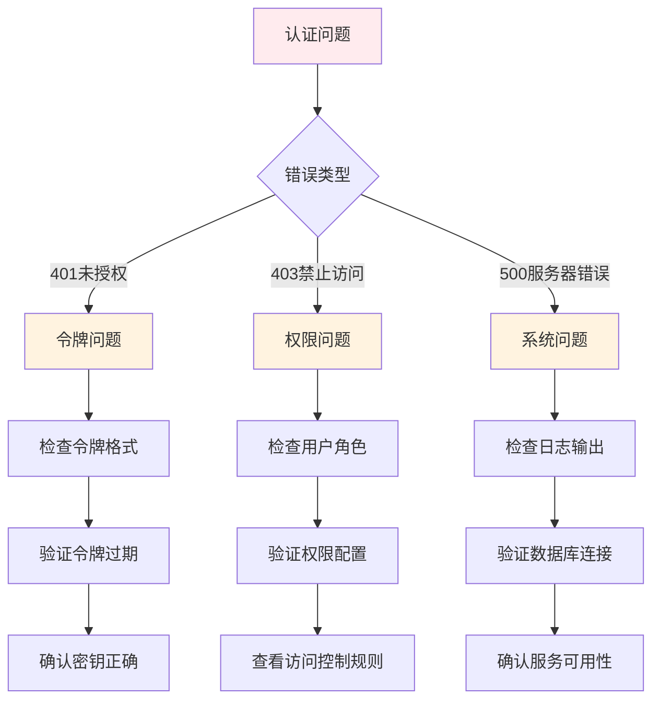
```mermaid
flowchart TD
A[认证问题] --> B{错误类型}
B --> |401未授权| C[令牌问题]
B --> |403禁止访问| D[权限问题]
B --> |500服务器错误| E[系统问题]
C --> F[检查令牌格式]
F --> G[验证令牌过期]
G --> H[确认密钥正确]
D --> I[检查用户角色]
I --> J[验证权限配置]
J --> K[查看访问控制规则]
E --> L[检查日志输出]
L --> M[验证数据库连接]
M --> N[确认服务可用性]
style A fill:#ffebee
style C fill:#fff3e0
style D fill:#fff3e0
style E fill:#fff3e0
```

### 调试步骤

1. **检查令牌有效性**
   - 验证JWT格式是否正确
   - 确认令牌未过期
   - 检查签名密钥是否匹配

2. **验证用户状态**
   - 确认用户账户未被禁用
   - 检查用户角色权限
   - 验证会话状态

3. **网络连接检查**
   - 确认HTTPS连接正常
   - 检查Cookie设置
   - 验证CORS配置

### 性能监控指标

| 指标名称 | 正常范围 | 监控方法 |
|----------|----------|----------|
| 认证响应时间 | < 100ms | 应用日志 |
| 令牌验证成功率 | > 99% | 监控告警 |
| 并发认证请求数 | 根据负载调整 | 负载测试 |
| 内存使用量 | < 512MB | 系统监控 |

**章节来源**
- [src/backend/agentchat/main.py](https://github.com/Shy2593666979/AgentChat/src/backend/agentchat/main.py#L92-L97)

## 总结

AgentChat的JWT认证与授权机制提供了完整、安全且易于使用的解决方案。系统的主要优势包括：

### 核心特性
- **灵活的配置选项**：支持多种令牌存储位置和自定义配置
- **完善的安全机制**：多层次的身份验证和权限控制
- **优秀的用户体验**：自动化的令牌刷新和错误处理
- **高度可扩展性**：模块化设计便于功能扩展

### 安全保障
- **强密钥管理**：支持多种密钥生成和存储方式
- **智能CSRF防护**：根据应用场景选择合适的防护策略
- **全面的错误处理**：清晰的错误信息和优雅的降级处理
- **实时监控能力**：完善的日志记录和性能监控

### 最佳实践建议
1. **生产环境部署**：使用强密钥，启用HTTPS，定期轮换密钥
2. **监控告警**：建立完善的监控体系，及时发现和处理异常
3. **安全审计**：定期审查认证逻辑，确保符合最新的安全标准
4. **用户教育**：向用户说明安全注意事项和最佳实践

通过合理配置和持续优化，AgentChat的JWT认证系统能够为用户提供安全可靠的服务体验，同时保持良好的开发效率和运维便利性。