# AgentChat JWT认证配置机制详细文档

## 目录
1. [概述](#概述)
2. [Settings类架构](#settings类架构)
3. [核心配置参数详解](#核心配置参数详解)
4. [配置加载机制](#配置加载机制)
5. [双位置令牌支持](#双位置令牌支持)
6. [配置示例与最佳实践](#配置示例与最佳实践)
7. [部署环境配置](#部署环境配置)
8. [故障排除指南](#故障排除指南)
9. [总结](#总结)

## 概述

AgentChat采用基于Pydantic的JWT认证系统，提供了灵活且安全的身份验证机制。该系统通过Settings类管理认证配置，支持从环境变量或配置文件加载参数，并实现了双位置令牌存储（cookies和headers）以适应不同的应用场景。

### 系统特点

- **双重配置层**：API层和工具层分别定义Settings类
- **灵活的令牌存储**：支持cookies和headers两种传输方式
- **CSRF保护**：可选的双提交Cookie CSRF保护机制
- **环境变量支持**：通过Pydantic BaseSettings自动加载配置
- **多环境适配**：支持开发、测试、生产环境的不同配置需求

## Settings类架构

AgentChat在两个不同的模块中定义了Settings类，每个都有其特定的用途和配置重点。

### API层Settings类

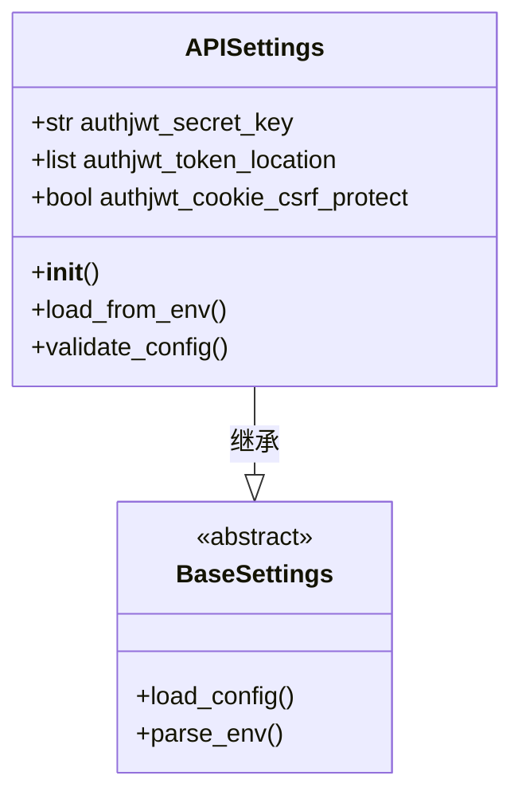

**图表来源**
- [JWT.py](https://github.com/Shy2593666979/AgentChat/src/backend/agentchat/api/JWT.py#L4-L7)

API层的Settings类位于[`api/JWT.py`](https://github.com/Shy2593666979/AgentChat/src/backend/agentchat/api/JWT.py#L4-L7)，专门用于FastAPI JWT Auth库的配置：

- **authjwt_secret_key**: JWT签名密钥，默认值为'very-secret'
- **authjwt_token_location**: 令牌存储位置，默认为['cookies', 'headers']
- **authjwt_cookie_csrf_protect**: CSRF保护开关，默认为False

### 工具层Settings类

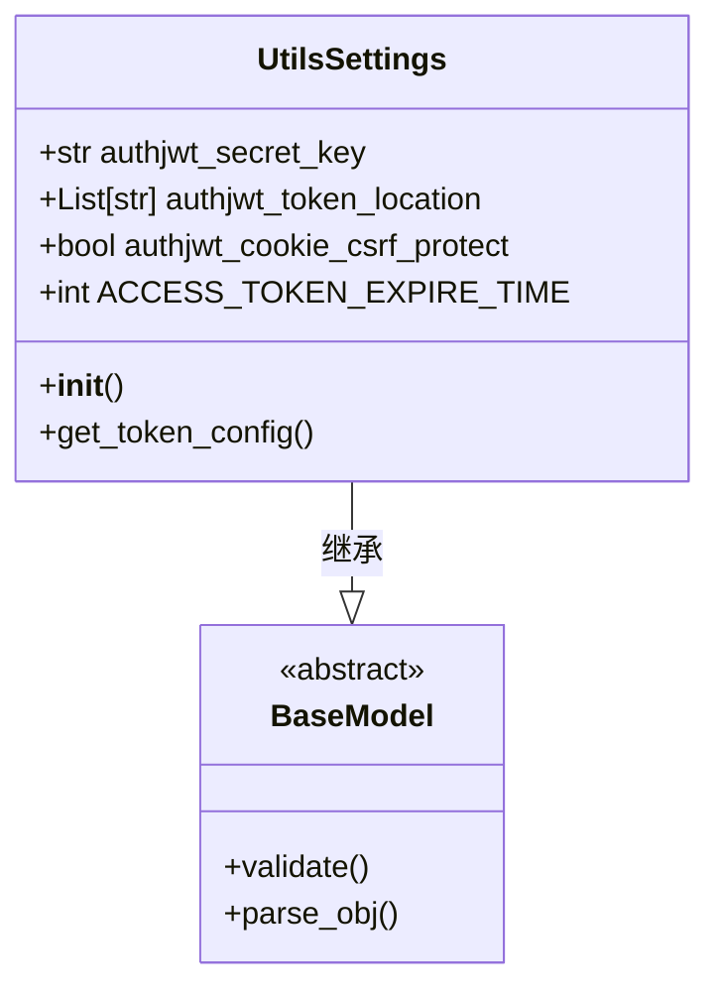

**图表来源**
- [JWT.py](https://github.com/Shy2593666979/AgentChat/src/backend/agentchat/utils/JWT.py#L10-L15)

工具层的Settings类位于[`utils/JWT.py`](https://github.com/Shy2593666979/AgentChat/src/backend/agentchat/utils/JWT.py#L10-L15)，主要用于内部工具和服务：

- **authjwt_secret_key**: JWT签名密钥，默认值为'secret'
- **authjwt_token_location**: 令牌存储位置，默认为['cookies', 'headers']
- **authjwt_cookie_csrf_protect**: CSRF保护开关，默认为False
- **ACCESS_TOKEN_EXPIRE_TIME**: 访问令牌过期时间，默认为86400秒（24小时）

**章节来源**
- [JWT.py](https://github.com/Shy2593666979/AgentChat/src/backend/agentchat/api/JWT.py#L1-L7)
- [JWT.py](https://github.com/Shy2593666979/AgentChat/src/backend/agentchat/utils/JWT.py#L1-L18)

## 核心配置参数详解

### authjwt_secret_key

**用途**: JWT令牌的签名密钥，用于验证令牌的真实性和完整性。

**默认值**: 
- API层: 'very-secret'
- 工具层: 'secret'

**安全建议**:
- 在生产环境中必须使用强随机密钥
- 密钥长度建议至少32字符
- 使用环境变量而非硬编码存储密钥

### authjwt_token_location

**用途**: 指定JWT令牌的存储位置，支持多种组合。

**可用选项**:
- `'headers'`: HTTP头部（默认Bearer Token）
- `'cookies'`: HTTP Cookie

**默认配置**:
- 双位置支持：`['cookies', 'headers']`
- 单位置支持：仅包含一个选项

**设计考虑**:
- **cookies**: 适合Web应用，自动处理令牌传递
- **headers**: 适合API调用，更符合RESTful规范
- **双位置**: 提供最大的兼容性

### authjwt_cookie_csrf_protect

**用途**: 启用双提交Cookie CSRF保护机制。

**默认值**: False（API层）/ False（工具层）

**CSRF保护机制**:
1. **Access Token**: 包含CSRF标识符的令牌
2. **CSRF Cookie**: 存储CSRF令牌的Cookie
3. **验证流程**: 前端同时发送令牌和CSRF Cookie，后端验证匹配

**安全优势**:
- 防止跨站请求伪造攻击
- 无需额外的CSRF Token字段
- 自动处理令牌刷新时的CSRF更新

**章节来源**
- [JWT.py](https://github.com/Shy2593666979/AgentChat/src/backend/agentchat/api/JWT.py#L5-L7)
- [JWT.py](https://github.com/Shy2593666979/AgentChat/src/backend/agentchat/utils/JWT.py#L11-L15)

## 配置加载机制

AgentChat使用Pydantic的BaseSettings从多个来源加载配置，确保灵活性和安全性。

### 配置优先级

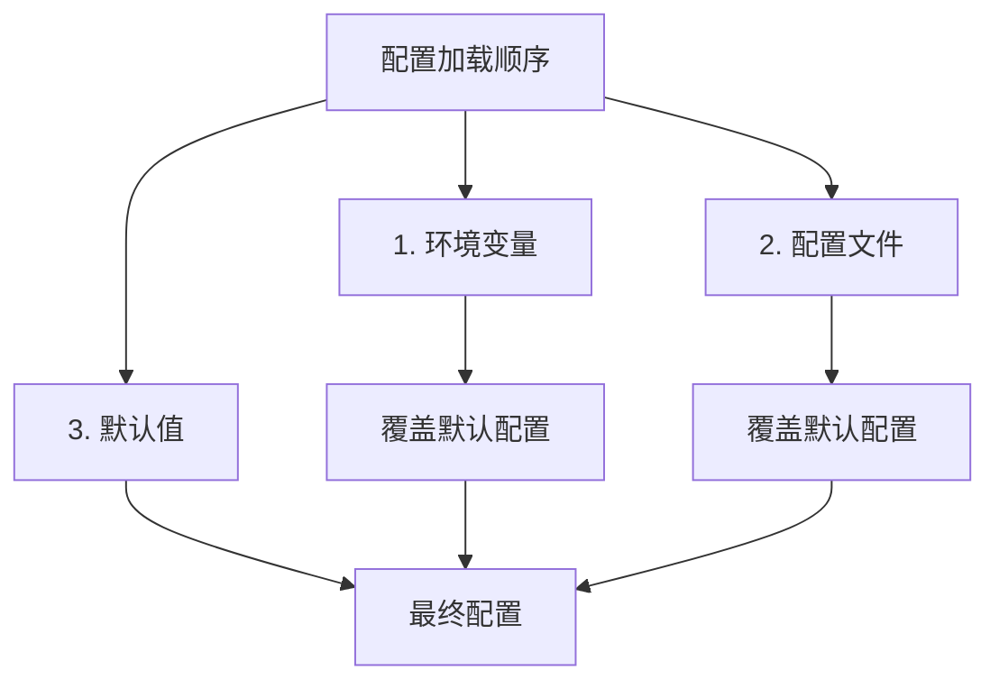

### 环境变量配置

系统支持通过环境变量覆盖所有配置参数：

```bash
# 基础认证配置
AUTHJWT_SECRET_KEY=your-strong-secret-key
AUTHJWT_TOKEN_LOCATION=cookies,headers
AUTHJWT_COOKIE_CSRF_PROTECT=true

# 令牌过期时间配置
ACCESS_TOKEN_EXPIRE_TIME=3600
REFRESH_TOKEN_EXPIRE_TIME=86400

# Cookie配置
AUTHJWT_ACCESS_COOKIE_KEY=my_access_token
AUTHJWT_REFRESH_COOKIE_KEY=my_refresh_token
```

### 配置文件加载

系统通过[`settings.py`](https://github.com/Shy2593666979/AgentChat/src/backend/agentchat/settings.py#L26-L61)模块加载YAML配置文件：

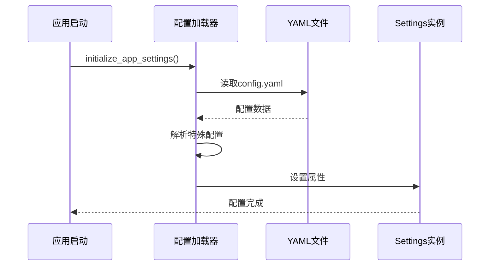

**图表来源**
- [settings.py](https://github.com/Shy2593666979/AgentChat/src/backend/agentchat/settings.py#L26-L61)

**配置文件结构**:
- 支持嵌套配置对象
- 自动类型转换和验证
- 错误处理和日志记录

### 配置验证

系统使用Pydantic进行配置验证，确保所有参数的正确性：

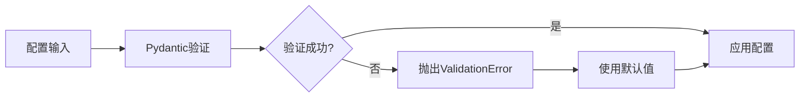

**章节来源**
- [settings.py](https://github.com/Shy2593666979/AgentChat/src/backend/agentchat/settings.py#L1-L62)

## 双位置令牌支持

AgentChat的核心创新在于支持双位置令牌存储，这种设计解决了现代Web应用中身份验证的复杂需求。

### 架构设计

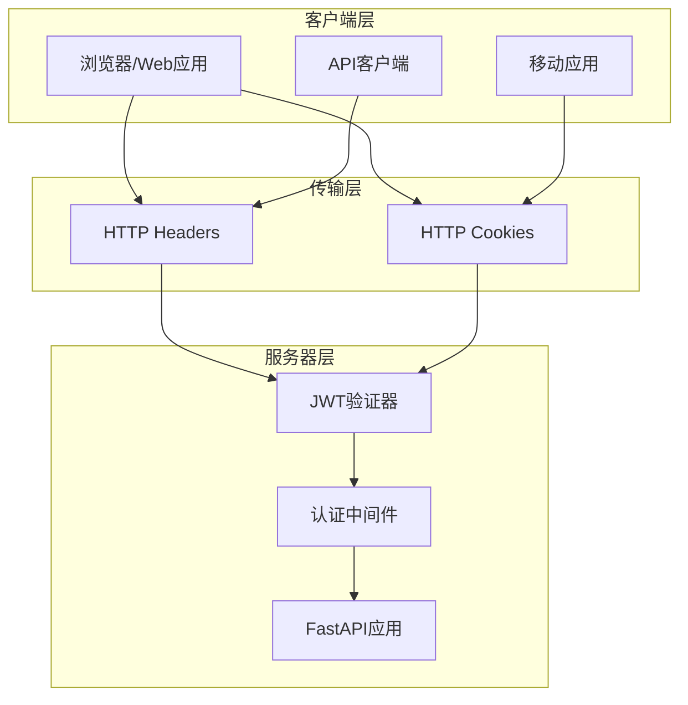

### 传输方式对比

| 特性 | Headers传输 | Cookies传输 |
|------|-------------|-------------|
| **安全性** | 更高（无XSS风险） | 中等（需CSRF保护） |
| **易用性** | 需手动设置 | 自动处理 |
| **缓存控制** | 不会被缓存 | 可设置缓存策略 |
| **跨域支持** | 需CORS配置 | 自动处理 |
| **移动端** | 需额外处理 | 原生支持 |

### 实现机制

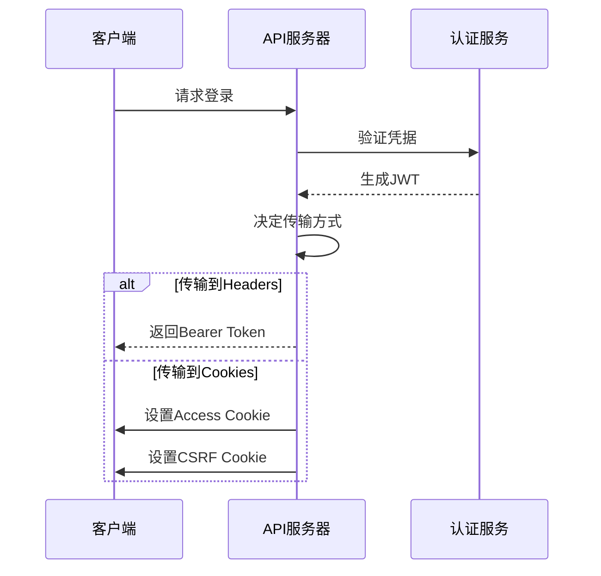

### 前后端交互影响

**前端注意事项**:
- Headers方式需要手动设置Authorization头
- Cookies方式需要处理CSRF保护
- 双位置支持需要统一的认证状态管理

**后端处理逻辑**:
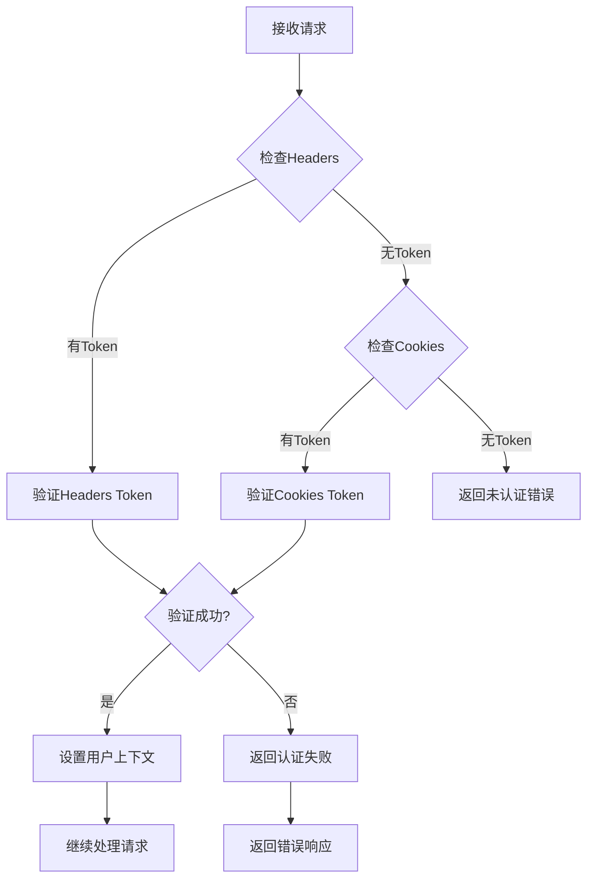

**章节来源**
- [auth_jwt.py](https://github.com/Shy2593666979/AgentChat/src/backend/fastapi_jwt_auth/auth_jwt.py#L18-L38)
- [auth_jwt.py](https://github.com/Shy2593666979/AgentChat/src/backend/fastapi_jwt_auth/auth_jwt.py#L485-L522)

## 配置示例与最佳实践

### 基础配置示例

#### 开发环境配置

```yaml
# config.yaml
server:
  host: "127.0.0.1"
  port: 7860

# 开发环境使用简单配置
authjwt_secret_key: "dev-secret-key"
authjwt_token_location: ["headers"]
authjwt_cookie_csrf_protect: false
```

#### 生产环境配置

```yaml
# config.yaml
server:
  host: "0.0.0.0"
  port: 8000

# 生产环境使用强密钥和完整保护
authjwt_secret_key: "${AUTHJWT_SECRET_KEY}"
authjwt_token_location: ["cookies", "headers"]
authjwt_cookie_csrf_protect: true

# Cookie安全配置
authjwt_access_cookie_secure: true
authjwt_access_cookie_samesite: "strict"
authjwt_cookie_domain: ".yourdomain.com"
```

### 高级配置示例

#### 自定义令牌过期时间

```python
# 在Settings类中自定义
class AdvancedSettings(BaseSettings):
    # 访问令牌配置（1小时）
    authjwt_access_token_expires: timedelta = timedelta(hours=1)
    
    # 刷新令牌配置（30天）
    authjwt_refresh_token_expires: timedelta = timedelta(days=30)
    
    # Cookie配置
    authjwt_access_cookie_path: str = "/api"
    authjwt_refresh_cookie_path: str = "/api/auth"
```

#### 多环境配置管理

```python
# 环境特定配置
class DevSettings(Settings):
    authjwt_secret_key: str = "dev-secret"
    authjwt_cookie_csrf_protect: bool = False

class ProdSettings(Settings):
    authjwt_secret_key: str = "${PROD_JWT_SECRET}"
    authjwt_cookie_csrf_protect: bool = True
    authjwt_access_cookie_secure: bool = True
    authjwt_cookie_samesite: str = "strict"
```

### 修改令牌有效期

#### 通过配置文件修改

```yaml
# config.yaml
# 访问令牌有效期：2小时
authjwt_access_token_expires: 7200

# 刷新令牌有效期：7天
authjwt_refresh_token_expires: 604800
```

#### 通过代码动态修改

```python
# 在应用初始化时修改
from datetime import timedelta

# 修改访问令牌有效期为30分钟
app_settings.authjwt_access_token_expires = timedelta(minutes=30)

# 修改刷新令牌有效期为7天
app_settings.authjwt_refresh_token_expires = timedelta(days=7)
```

### 密钥管理最佳实践

#### 环境变量密钥

```bash
# 设置强随机密钥
export AUTHJWT_SECRET_KEY=$(openssl rand -hex 32)

# 或使用Python生成
python -c "import secrets; print(secrets.token_hex(32))"
```

#### 密钥轮换策略

```python
# 定期轮换密钥的示例
import os
from datetime import datetime, timedelta

class KeyRotationManager:
    def __init__(self):
        self.current_key = os.getenv('AUTHJWT_SECRET_KEY')
        self.rotation_interval = timedelta(days=90)
        self.last_rotation = datetime.now()
    
    def should_rotate(self):
        return datetime.now() - self.last_rotation > self.rotation_interval
    
    def rotate_key(self):
        new_key = self.generate_new_key()
        # 更新配置
        os.environ['AUTHJWT_SECRET_KEY'] = new_key
        self.current_key = new_key
        self.last_rotation = datetime.now()
```

**章节来源**
- [config.yaml](https://github.com/Shy2593666979/AgentChat/src/backend/agentchat/config.yaml#L1-L129)
- [config.py](https://github.com/Shy2593666979/AgentChat/src/backend/fastapi_jwt_auth/config.py#L11-L85)

## 部署环境配置

AgentChat支持多种部署环境，每种环境都有其特定的配置要求和最佳实践。

### 开发环境配置

开发环境注重便利性和调试能力：

```yaml
# dev-config.yaml
server:
  host: "127.0.0.1"
  port: 7860
  debug: true

# 开发环境配置
authjwt_secret_key: "development-secret-key"
authjwt_token_location: ["headers"]
authjwt_cookie_csrf_protect: false

# 调试友好配置
authjwt_header_name: "Authorization"
authjwt_header_type: "Bearer"
```

### 测试环境配置

测试环境需要模拟生产环境的行为：

```yaml
# test-config.yaml
server:
  host: "0.0.0.0"
  port: 8000
  debug: false

# 测试环境配置
authjwt_secret_key: "${TEST_JWT_SECRET}"
authjwt_token_location: ["cookies", "headers"]
authjwt_cookie_csrf_protect: true

# 测试专用配置
authjwt_access_token_expires: 300  # 5分钟
authjwt_refresh_token_expires: 3600  # 1小时
```

### 生产环境配置

生产环境强调安全性和性能：

```yaml
# prod-config.yaml
server:
  host: "0.0.0.0"
  port: 8000
  workers: 4

# 生产环境配置
authjwt_secret_key: "${PROD_JWT_SECRET}"
authjwt_token_location: ["cookies", "headers"]
authjwt_cookie_csrf_protect: true

# 安全配置
authjwt_access_cookie_secure: true
authjwt_access_cookie_samesite: "strict"
authjwt_cookie_domain: ".yourdomain.com"
authjwt_cookie_max_age: 86400  # 24小时

# 性能优化
authjwt_access_token_expires: 3600  # 1小时
authjwt_refresh_token_expires: 604800  # 7天
```

### Docker环境配置

```dockerfile
# Dockerfile
FROM python:3.11-slim

# 设置环境变量
ENV AUTHJWT_SECRET_KEY=""
ENV AUTHJWT_TOKEN_LOCATION="cookies,headers"
ENV AUTHJWT_COOKIE_CSRF_PROTECT="true"

# 复制配置文件
COPY config.yaml /app/config.yaml

# 启动命令
CMD ["python", "main.py"]
```

### Kubernetes配置

```yaml
# kubernetes-secrets.yaml
apiVersion: v1
kind: Secret
metadata:
  name: jwt-config
type: Opaque
data:
  authjwt-secret-key: $(echo -n "your-secret-key" | base64)
  authjwt-token-location: Y29va2llcyxIZWFkZXJz  # base64 for "cookies,headers"
```

### 配置继承和覆盖机制

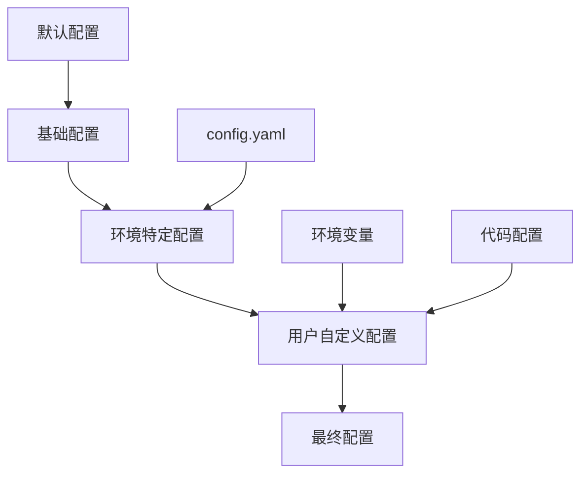

**配置优先级**: 代码配置 > 环境变量 > 配置文件 > 默认值

### 环境变量映射表

| 配置参数 | 环境变量名 | 默认值 | 示例 |
|----------|------------|--------|------|
| authjwt_secret_key | AUTHJWT_SECRET_KEY | "secret" | "abc123..." |
| authjwt_token_location | AUTHJWT_TOKEN_LOCATION | ["headers"] | "cookies,headers" |
| authjwt_cookie_csrf_protect | AUTHJWT_COOKIE_CSRF_PROTECT | false | "true" |
| authjwt_access_token_expires | AUTHJWT_ACCESS_TOKEN_EXPIRES | 900 | "3600" |
| authjwt_refresh_token_expires | AUTHJWT_REFRESH_TOKEN_EXPIRES | 2592000 | "604800" |

**章节来源**
- [config.yaml](https://github.com/Shy2593666979/AgentChat/src/backend/agentchat/config.yaml#L1-L129)
- [auth_config.py](https://github.com/Shy2593666979/AgentChat/src/backend/fastapi_jwt_auth/auth_config.py#L56-L97)

## 故障排除指南

### 常见问题及解决方案

#### 1. 认证失败问题

**症状**: 用户登录成功但后续请求返回401错误

**排查步骤**:
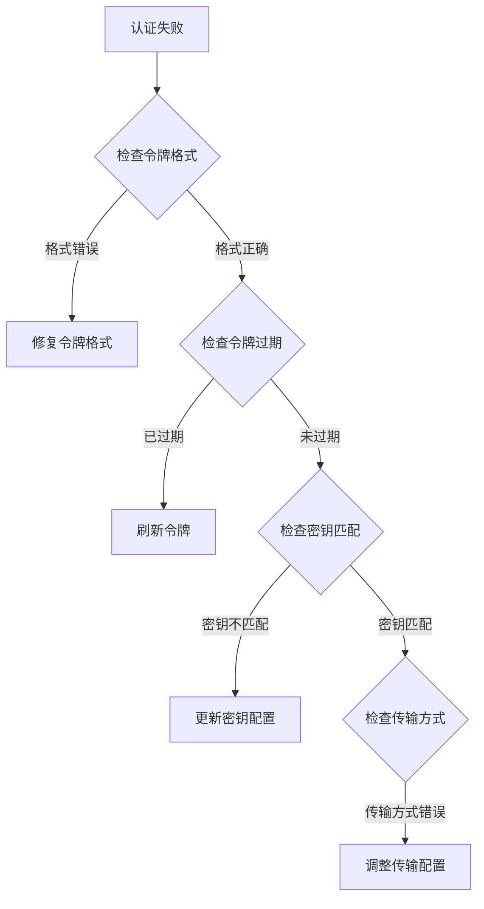

**解决方案**:
```python
# 检查配置一致性
def validate_jwt_config():
    # 验证密钥
    if not app_settings.authjwt_secret_key:
        raise ValueError("JWT密钥不能为空")
    
    # 验证令牌位置
    if not app_settings.authjwt_token_location:
        raise ValueError("令牌位置不能为空")
    
    # 验证CSRF保护
    if app_settings.authjwt_cookie_csrf_protect and 'cookies' not in app_settings.authjwt_token_location:
        raise ValueError("启用CSRF保护时必须包含cookies位置")
```

#### 2. CSRF保护问题

**症状**: POST/PUT/PATCH/DELETE请求被拒绝

**原因分析**:
- CSRF保护已启用但缺少CSRF令牌
- CSRF Cookie与令牌不匹配
- 前端未正确发送CSRF令牌

**解决方法**:
```javascript
// 前端解决方案
const csrfToken = document.cookie
    .split('; ')
    .find(row => row.startsWith('csrf_access_token='))
    ?.split('=')[1];

fetch('/api/endpoint', {
    method: 'POST',
    headers: {
        'Content-Type': 'application/json',
        'X-CSRF-Token': csrfToken
    },
    body: JSON.stringify(data)
});
```

#### 3. 令牌传输问题

**症状**: 令牌在某些情况下丢失

**排查清单**:
- [ ] 检查Cookie SameSite设置
- [ ] 验证Cookie Domain配置
- [ ] 确认HTTPS环境下的Secure标志
- [ ] 检查代理服务器的Cookie处理

#### 4. 配置加载问题

**症状**: 配置未按预期生效

**诊断步骤**:
```python
# 配置验证脚本
def diagnose_config():
    print("当前JWT配置:")
    print(f"密钥: {'*' * len(app_settings.authjwt_secret_key)}")
    print(f"令牌位置: {app_settings.authjwt_token_location}")
    print(f"CSRF保护: {app_settings.authjwt_cookie_csrf_protect}")
    print(f"访问令牌过期时间: {app_settings.authjwt_access_token_expires}")
    print(f"刷新令牌过期时间: {app_settings.authjwt_refresh_token_expires}")
```

### 性能监控

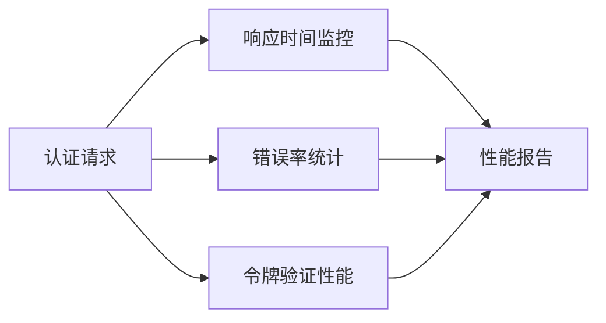

### 日志记录

```python
# 认证事件日志
import logging

logger = logging.getLogger(__name__)

def log_authentication_event(event_type, user_id=None, success=True, error=None):
    extra = {
        'event_type': event_type,
        'user_id': user_id,
        'success': success,
        'error': error
    }
    
    if success:
        logger.info("认证事件", extra=extra)
    else:
        logger.error("认证失败", extra=extra)
```

**章节来源**
- [auth_jwt.py](https://github.com/Shy2593666979/AgentChat/src/backend/fastapi_jwt_auth/auth_jwt.py#L1-L200)
- [auth_config.py](https://github.com/Shy2593666979/AgentChat/src/backend/fastapi_jwt_auth/auth_config.py#L56-L97)

## 总结

AgentChat的JWT认证配置机制提供了全面而灵活的身份验证解决方案。通过双位置令牌支持、完善的配置管理和强大的安全特性，该系统能够满足从简单开发环境到复杂生产部署的各种需求。

### 关键优势

1. **灵活性**: 支持多种配置方式和传输协议
2. **安全性**: 内置CSRF保护和多种安全机制
3. **可扩展性**: 易于扩展和定制
4. **易用性**: 简单的配置和使用方式

### 最佳实践总结

1. **生产环境**: 必须启用CSRF保护，使用强随机密钥
2. **开发环境**: 可适当简化配置以提高开发效率
3. **配置管理**: 使用环境变量管理敏感配置
4. **监控告警**: 建立完善的认证事件监控体系

通过合理配置和遵循最佳实践，AgentChat的JWT认证系统能够为用户提供安全、可靠的身份验证服务，同时保持良好的开发体验和运维效率。
