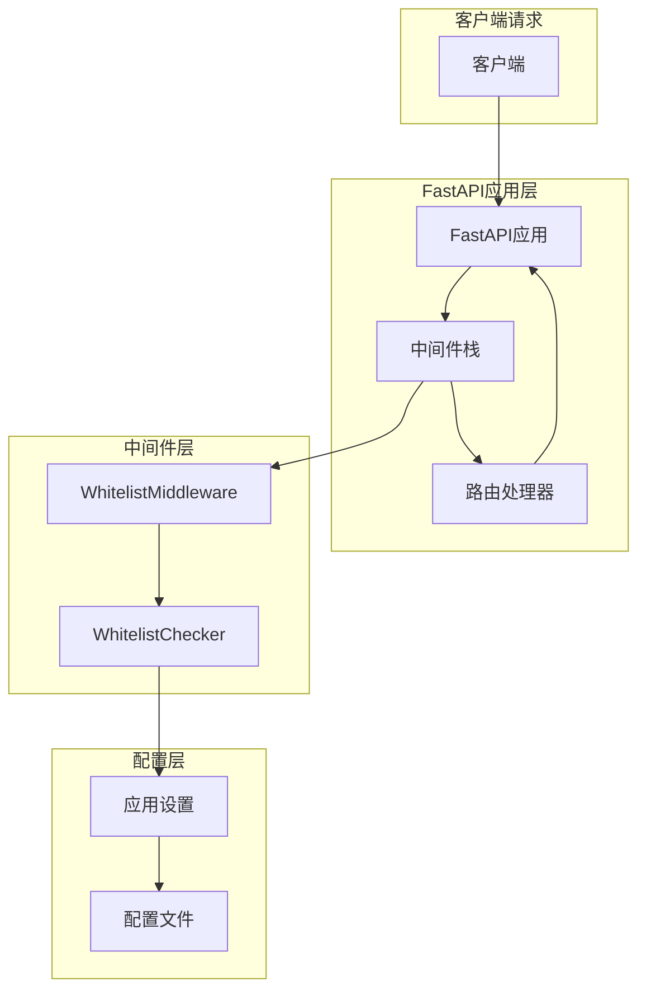
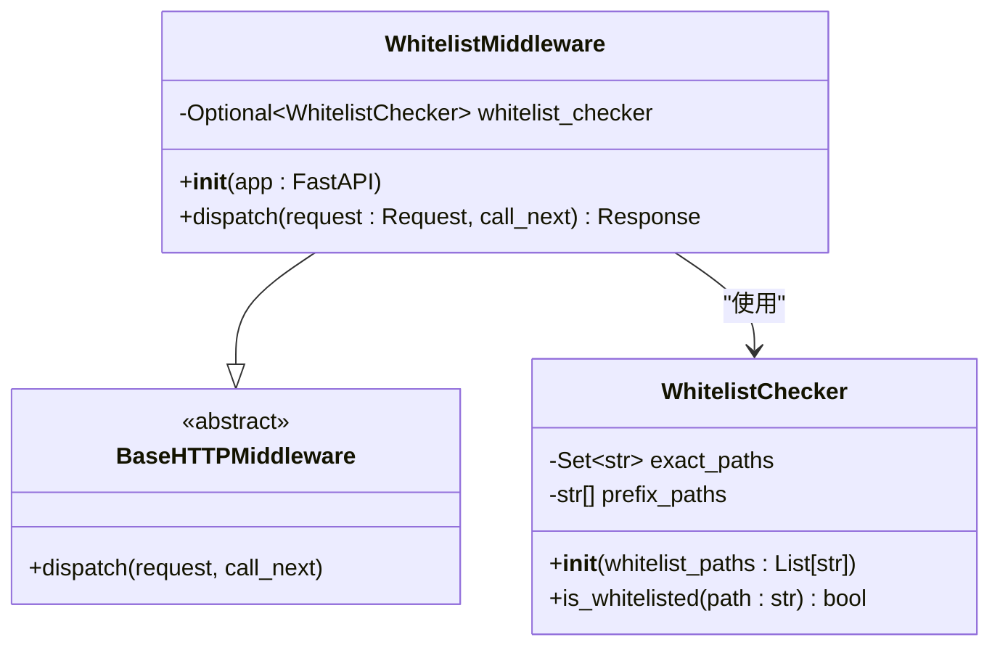
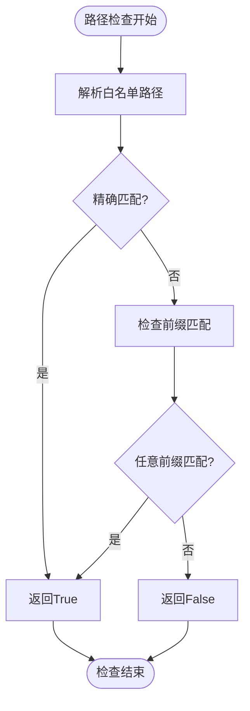
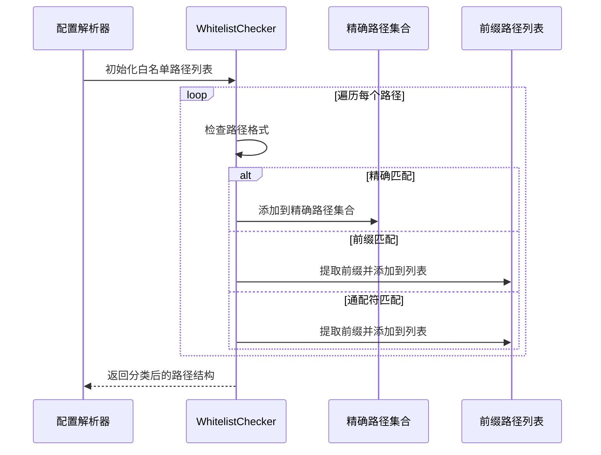
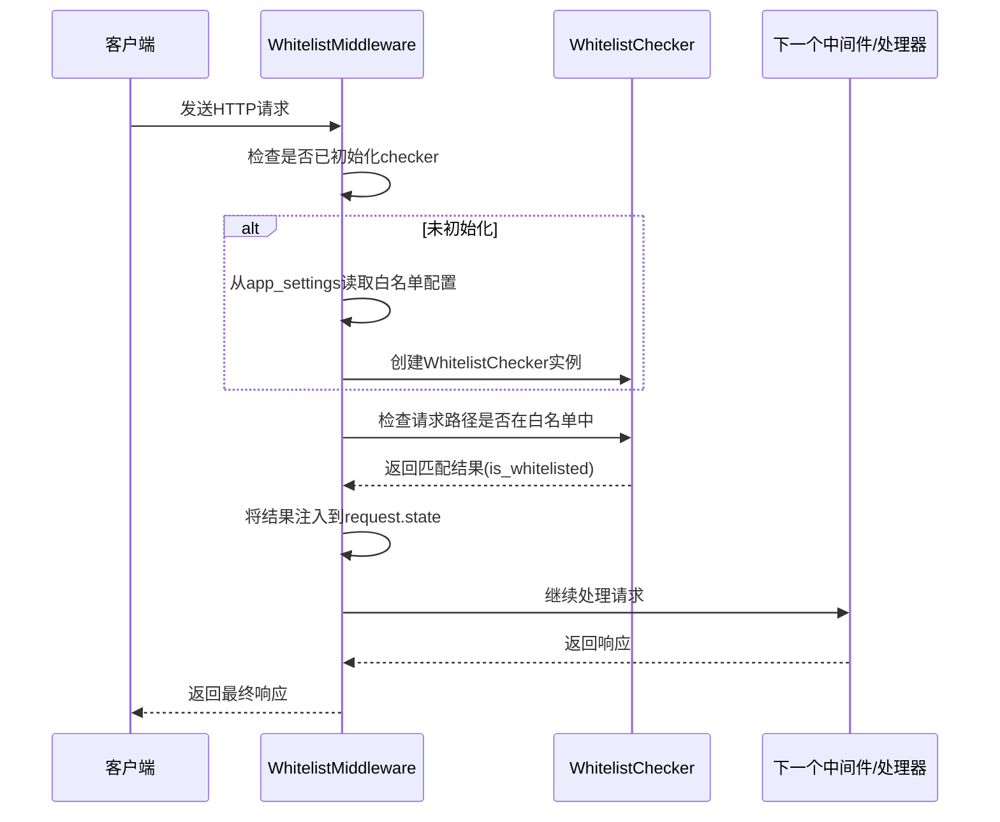
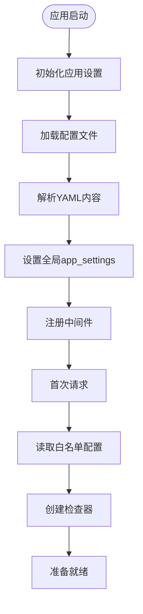
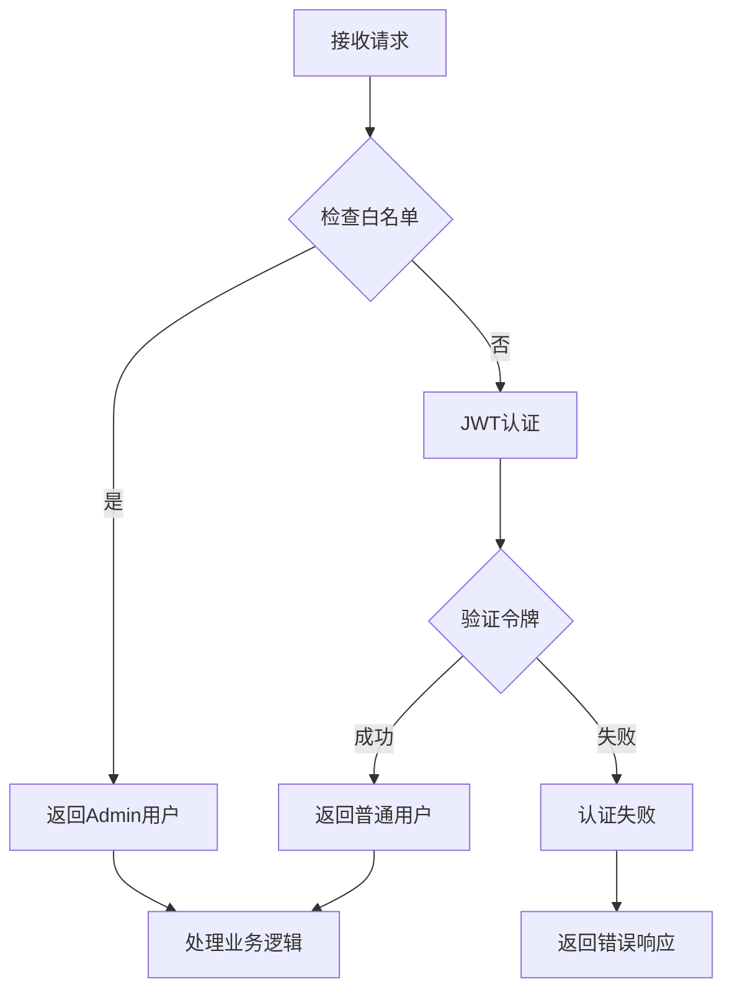

# 访问控制

## 目录
1. [简介](#简介)
2. [系统架构概览](#系统架构概览)
3. [核心组件分析](#核心组件分析)
4. [白名单路径解析机制](#白名单路径解析机制)
5. [中间件工作流程](#中间件工作流程)
6. [配置与动态加载](#配置与动态加载)
7. [实际应用场景](#实际应用场景)
8. [性能考虑](#性能考虑)
9. [故障排除指南](#故障排除指南)
10. [总结](#总结)

## 简介

AgentChat的IP白名单访问控制系统是一个基于FastAPI的中间件机制，专门用于保护敏感的API端点。该系统通过WhitelistMiddleware中间件实现了灵活的路径匹配策略，支持精确匹配、前缀匹配和通配符匹配三种模式，确保只有授权的请求能够访问关键的管理接口。

该访问控制系统的核心价值在于：
- **安全防护**：保护敏感的管理接口免受未经授权的访问
- **灵活配置**：支持多种路径匹配模式，适应不同的安全需求
- **动态加载**：运行时动态读取配置，无需重启服务
- **透明集成**：无缝集成到现有的FastAPI应用架构中

## 系统架构概览



**图表来源**
- [main.py](https://github.com/Shy2593666979/AgentChat/tree/main/src/backend/agentchat/main.py#L45)
- [white_list_middleware.py](https://github.com/Shy2593666979/AgentChat/tree/main/src/backend/agentchat/core/middleware/white_list_middleware.py#L33-L50)

**章节来源**
- [main.py](https://github.com/Shy2593666979/AgentChat/tree/main/src/backend/agentchat/main.py#L40-L46)
- [white_list_middleware.py](https://github.com/Shy2593666979/AgentChat/tree/main/src/backend/agentchat/core/middleware/white_list_middleware.py#L1-L50)

## 核心组件分析

### WhitelistMiddleware中间件

WhitelistMiddleware是整个访问控制系统的核心组件，继承自FastAPI的BaseHTTPMiddleware基类，提供了请求拦截和路径检查功能。



**图表来源**
- [white_list_middleware.py](https://github.com/Shy2593666979/AgentChat/tree/main/src/backend/agentchat/core/middleware/white_list_middleware.py#L33-L50)
- [white_list_middleware.py](https://github.com/Shy2593666979/AgentChat/tree/main/src/backend/agentchat/core/middleware/white_list_middleware.py#L7-L31)

#### 中间件特性

1. **延迟初始化**：首次请求时才创建WhitelistChecker实例，避免不必要的资源消耗
2. **动态配置**：运行时从app_settings读取白名单配置，支持热更新
3. **状态注入**：将检查结果注入到request.state中，供后续中间件和处理器使用

### WhitelistChecker检查器

WhitelistChecker负责具体的路径匹配逻辑，实现了三种不同的匹配模式：



**图表来源**
- [white_list_middleware.py](https://github.com/Shy2593666979/AgentChat/tree/main/src/backend/agentchat/core/middleware/white_list_middleware.py#L23-L30)

**章节来源**
- [white_list_middleware.py](https://github.com/Shy2593666979/AgentChat/tree/main/src/backend/agentchat/core/middleware/white_list_middleware.py#L7-L50)

## 白名单路径解析机制

### 路径匹配模式

WhitelistChecker支持三种路径匹配模式，每种模式都有其特定的应用场景：

| 匹配模式 | 示例 | 描述 | 使用场景 |
|---------|------|------|----------|
| 精确匹配 | `/api/v1/login` | 完全匹配指定路径 | 登录接口、认证端点 |
| 前缀匹配 | `/api/v1/admin/*` | 匹配以指定前缀开头的所有路径 | 管理后台接口组 |
| 通配符匹配 | `/api/v1/*` | 匹配任何路径下的所有子路径 | 敏感API组 |

### 路径解析算法



**图表来源**
- [white_list_middleware.py](https://github.com/Shy2593666979/AgentChat/tree/main/src/backend/agentchat/core/middleware/white_list_middleware.py#L10-L21)

### 匹配优先级

路径匹配遵循严格的优先级顺序：
1. **精确匹配**：完全相同的路径字符串
2. **前缀匹配**：以指定前缀开头的路径
3. **通配符匹配**：作为最后的备选方案

这种设计确保了最具体、最安全的匹配规则优先执行。

**章节来源**
- [white_list_middleware.py](https://github.com/Shy2593666979/AgentChat/tree/main/src/backend/agentchat/core/middleware/white_list_middleware.py#L10-L31)

## 中间件工作流程

### 请求处理流程

WhitelistMiddleware的dispatch方法实现了完整的请求处理流程：



**图表来源**
- [white_list_middleware.py](https://github.com/Shy2593666979/AgentChat/tree/main/src/backend/agentchat/core/middleware/white_list_middleware.py#L40-L49)

### 动态初始化机制

中间件采用延迟初始化策略，只有在首次请求时才会创建WhitelistChecker实例：

```python
# 关键代码路径
if not self.whitelist_checker:
    # 动态读取已初始化的白名单路径，默认空列表避免报错
    whitelist_paths = app_settings.whitelist_paths or []
    self.whitelist_checker = WhitelistChecker(whitelist_paths)
```

这种设计的优势包括：
- **内存效率**：未使用时不占用内存资源
- **配置灵活性**：支持运行时配置更新
- **启动速度**：减少应用启动时间

**章节来源**
- [white_list_middleware.py](https://github.com/Shy2593666979/AgentChat/tree/main/src/backend/agentchat/core/middleware/white_list_middleware.py#L40-L49)

## 配置与动态加载

### 配置文件结构

白名单配置通过YAML配置文件进行管理，位于`agentchat/config.yaml`：

```yaml
# 接口白名单路径
whitelist_paths: ["/api/v1/login"]
```

### 配置加载机制



**图表来源**
- [settings.py](https://github.com/Shy2593666979/AgentChat/tree/main/src/backend/agentchat/settings.py#L26-L62)
- [main.py](https://github.com/Shy2593666979/AgentChat/tree/main/src/backend/agentchat/main.py#L67-L72)

### 动态配置更新

由于中间件采用运行时读取配置的方式，支持以下动态更新场景：

1. **配置文件修改**：修改config.yaml后，下次请求自动使用新配置
2. **环境变量覆盖**：通过环境变量动态调整白名单
3. **程序化配置**：通过API动态修改app_settings.whitelist_paths

**章节来源**
- [settings.py](https://github.com/Shy2593666979/AgentChat/tree/main/src/backend/agentchat/settings.py#L14)
- [config.yaml](https://github.com/Shy2593666979/AgentChat/tree/main/src/backend/agentchat/config.yaml#L128-L129)

## 实际应用场景

### 敏感API端点保护

白名单系统主要用于保护以下类型的敏感API端点：

#### 用户认证相关接口
- `/api/v1/login` - 用户登录接口
- `/api/v1/register` - 用户注册接口
- `/api/v1/user/info` - 用户信息查询接口

#### 管理后台接口
- `/api/v1/admin/*` - 管理员专用接口组
- `/api/v1/workspace/*` - 工作空间管理接口
- `/api/v1/agent/*` - AI代理管理接口

#### 知识库管理接口
- `/api/v1/knowledge/*` - 知识库增删改查接口
- `/api/v1/upload/*` - 文件上传相关接口

### 权限验证集成

白名单检查结果被广泛应用于权限验证流程中：



**图表来源**
- [user.py](https://github.com/Shy2593666979/AgentChat/tree/main/src/backend/agentchat/api/services/user.py#L117-L120)

### 实际匹配场景分析

以下是常见的路径匹配场景：

| 请求路径 | 白名单配置 | 匹配结果 | 说明 |
|---------|-----------|---------|------|
| `/api/v1/login` | `["/api/v1/login"]` | ✅ 精确匹配 | 完全匹配，允许访问 |
| `/api/v1/user/info` | `["/api/v1/user/*"]` | ✅ 前缀匹配 | 以"/api/v1/user/"开头 |
| `/api/v1/admin/dashboard` | `["/api/v1/admin/*"]` | ✅ 前缀匹配 | 管理后台接口 |
| `/api/v1/stats` | `["/api/v1/*"]` | ✅ 通配符匹配 | 任意子路径 |
| `/api/v1/public/data` | `[]` | ❌ 不匹配 | 未配置在白名单中 |

**章节来源**
- [user.py](https://github.com/Shy2593666979/AgentChat/tree/main/src/backend/agentchat/api/services/user.py#L117-L129)

## 性能考虑

### 内存优化策略

1. **延迟初始化**：仅在首次请求时创建检查器实例
2. **集合优化**：精确匹配使用Python的set数据结构，提供O(1)查找性能
3. **列表缓存**：前缀匹配使用预处理的列表，避免重复计算

### 时间复杂度分析

| 操作 | 时间复杂度 | 说明 |
|------|-----------|------|
| 精确匹配 | O(1) | 使用set的哈希查找 |
| 前缀匹配 | O(n) | n为前缀列表长度 |
| 路径解析 | O(m) | m为路径数量 |

### 性能监控建议

为了确保系统的高性能运行，建议监控以下指标：

- **中间件响应时间**：监控WhitelistMiddleware的处理时间
- **内存使用情况**：跟踪WhitelistChecker实例的内存占用
- **匹配命中率**：分析不同匹配模式的使用频率

## 故障排除指南

### 常见问题及解决方案

#### 1. 白名单不生效

**症状**：配置了白名单路径但仍然需要认证

**排查步骤**：
1. 检查配置文件路径是否正确
2. 验证配置文件语法是否正确
3. 确认中间件是否正确注册

**解决方案**：
```python
# 检查配置是否正确加载
print(app_settings.whitelist_paths)
```

#### 2. 路径匹配错误

**症状**：预期应该匹配的路径没有被识别

**排查步骤**：
1. 检查路径格式是否正确
2. 验证匹配模式是否符合预期
3. 确认路径大小写敏感性

**解决方案**：
```python
# 测试路径匹配
checker = WhitelistChecker(["/api/v1/test/*"])
print(checker.is_whitelisted("/api/v1/test/subpath"))  # 应该返回True
```

#### 3. 中间件初始化失败

**症状**：应用启动时报中间件相关错误

**排查步骤**：
1. 检查依赖包是否正确安装
2. 验证FastAPI版本兼容性
3. 确认配置文件存在且可读

**解决方案**：
```python
# 添加调试日志
import logging
logging.basicConfig(level=logging.DEBUG)
```

### 调试技巧

1. **启用详细日志**：在开发环境中启用中间件的详细日志记录
2. **路径测试工具**：编写专门的路径匹配测试脚本
3. **配置验证**：在应用启动时验证配置文件的完整性

**章节来源**
- [white_list_middleware.py](https://github.com/Shy2593666979/AgentChat/tree/main/src/backend/agentchat/core/middleware/white_list_middleware.py#L42-L49)

## 总结

AgentChat的IP白名单访问控制系统是一个设计精良的安全机制，具有以下核心优势：

### 技术特点
- **模块化设计**：清晰的职责分离，易于维护和扩展
- **灵活匹配**：支持多种路径匹配模式，适应不同安全需求
- **动态配置**：运行时加载配置，支持热更新
- **性能优化**：采用延迟初始化和高效的数据结构

### 安全价值
- **纵深防御**：与JWT认证系统协同工作，提供多层安全保护
- **细粒度控制**：支持精确到单个API端点的访问控制
- **审计友好**：完整的访问日志记录，便于安全审计

### 应用建议
1. **合理规划白名单**：根据业务需求和安全等级规划白名单路径
2. **定期审查配置**：定期审查和更新白名单配置
3. **监控异常访问**：建立异常访问监控和告警机制
4. **文档化管理**：维护详细的白名单配置文档

该访问控制系统为AgentChat应用提供了坚实的安全基础，有效保护了敏感的管理接口，同时保持了良好的性能和可维护性。通过合理的配置和使用，可以显著提升应用的整体安全性。
