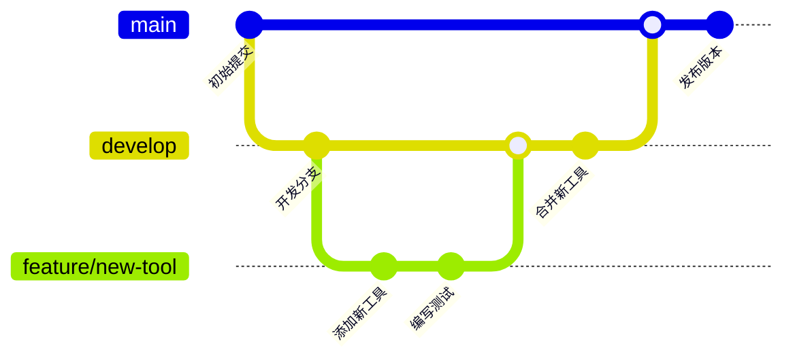
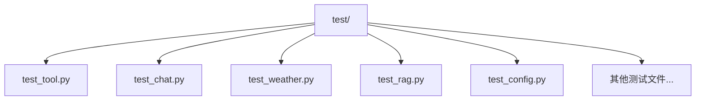
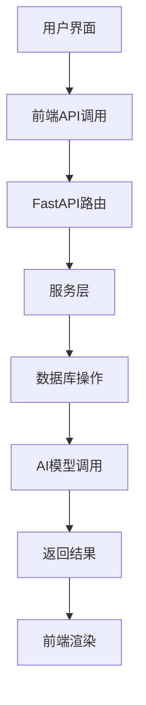
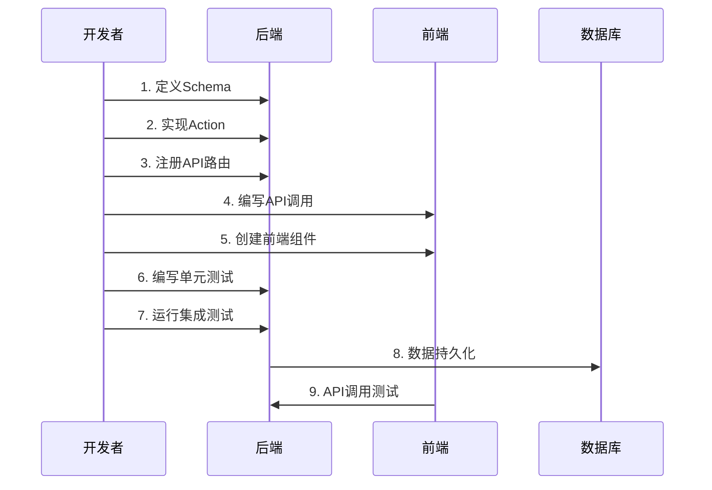

# 开发指南

## 目录
1. [项目简介](#项目简介)
2. [开发环境搭建](#开发环境搭建)
3. [代码贡献流程](#代码贡献流程)
4. [调试技巧](#调试技巧)
5. [测试策略](#测试策略)
6. [新功能开发示例](#新功能开发示例)
7. [最佳实践](#最佳实践)

## 项目简介

AgentChat是一个现代化的智能对话系统，基于大语言模型构建，提供了丰富的AI对话功能。系统采用前后端分离架构，支持多种AI模型、知识库检索、工具调用、MCP服务器集成等高级功能。

### 核心技术栈

**后端技术栈：**
- **框架**: FastAPI (Python 3.12+)
- **AI集成**: LangChain, OpenAI, Anthropic
- **数据库**: MySQL 8.0, Redis 7.0
- **向量数据库**: ChromaDB, Milvus
- **搜索引擎**: Elasticsearch
- **文档处理**: PyMuPDF, Unstructured

**前端技术栈：**
- **框架**: Vue 3.4+ (Composition API)
- **UI组件**: Element Plus
- **状态管理**: Pinia
- **路由**: Vue Router 4
- **构建工具**: Vite 5
- **开发语言**: TypeScript
- **样式**: SCSS

## 开发环境搭建

### 系统要求

| 组件 | 版本要求 | 说明 |
|:---:|:---:|:---|
| Python | 3.12+ | 后端运行环境 |
| Node.js | 18+ | 前端构建环境 |
| MySQL | 8.0+ | 主数据库 |
| Redis | 7.0+ | 缓存和会话存储 |
| Docker | 20.10+ | 容器化部署（推荐） |

### 方式一：Docker一键部署（推荐）

```bash
# 1. 克隆项目
git clone https://github.com/Shy2593666979/AgentChat.git
cd AgentChat

# 2. 配置API密钥
cp src/backend/agentchat/config.yaml.example src/backend/agentchat/config.yaml
# 编辑配置文件，填入你的API密钥

# 3. 一键启动
cd docker
docker-compose up --build -d
```

### 方式二：本地开发环境

#### 后端环境搭建

```bash
# 1. 克隆项目
git clone https://github.com/Shy2593666979/AgentChat.git
cd AgentChat

# 2. 创建Python虚拟环境
python -m venv venv
source venv/bin/activate  # Windows: venv\Scripts\activate

# 3. 安装依赖
pip install -e .
```

#### 前端环境搭建

```bash
# 1. 进入前端目录
cd src/frontend

# 2. 安装依赖
npm install

# 3. 启动开发服务器
npm run dev
```

#### 数据库初始化

系统使用SQLModel作为ORM，数据库初始化通过以下方式完成：

```bash
# 后端服务启动时自动初始化数据库
cd src/backend
uvicorn agentchat.main:app --port 7860 --host 0.0.0.0
```

### 配置文件设置

创建并编辑配置文件 `src/backend/agentchat/config.yaml`：

```yaml
# 示例配置
server:
  project_name: "AgentChat"
  version: "v2.2.0"

mysql:
  host: "localhost"
  port: 3306
  database: "agentchat"
  user: "agentchat_user"
  password: "123456"

redis:
  host: "localhost"
  port: 6379
  db: 0

multi_models:
  openai:
    api_key: "your-openai-api-key"
    base_url: "https://api.openai.com/v1"
  anthropic:
    api_key: "your-anthropic-api-key"
    base_url: "https://api.anthropic.com"

tools:
  web_search:
    enabled: true
  get_weather:
    enabled: true
  text2image:
    enabled: true
```

**章节来源**
- [README.md](https://github.com/Shy2593666979/AgentChat/README.md#L570-L662)
- [pyproject.toml](https://github.com/Shy2593666979/AgentChat/pyproject.toml#L1-L43)
- [src/frontend/package.json](https://github.com/Shy2593666979/AgentChat/src/frontend/package.json#L1-L41)
- [docker/docker-compose.yml](https://github.com/Shy2593666979/AgentChat/docker/docker-compose.yml#L1-L126)

## 代码贡献流程

### 分支策略

项目采用 **Git Flow** 分支策略：



**分支命名规范：**
- `feature/*`: 功能开发分支
- `bugfix/*`: Bug修复分支  
- `hotfix/*`: 紧急修复分支
- `release/*`: 发布准备分支

### 代码风格规范

#### Python代码风格

使用 **Black** 和 **isort** 进行代码格式化：

```bash
# 安装开发依赖
pip install black isort

# 格式化Python代码
black src/backend/
isort src/backend/

# 检查格式但不修改
black --check src/backend/
isort --check src/backend/
```

#### TypeScript/JavaScript代码风格

使用 **ESLint** 和 **Prettier**：

```bash
# 前端目录下运行
npm run lint
```

#### 前端代码风格配置

```typescript
// vite.config.ts
export default defineConfig({
  server: {
    proxy: {
      '/api': {
        target: 'http://localhost:7860/',
        changeOrigin: true,
      }
    },
  },
})
```

### 提交规范

使用 **Conventional Commits** 规范：

```
<type>(<scope>): <subject>

<body>

<footer>
```

**提交类型：**
- `feat`: 新功能
- `fix`: Bug修复
- `docs`: 文档更新
- `style`: 代码格式调整
- `refactor`: 代码重构
- `test`: 测试相关
- `chore`: 构建过程或辅助工具变动

**示例：**
```
feat(api): 添加新的工具API接口

- 实现工具注册功能
- 添加工具验证逻辑
- 更新API文档

Closes #123
```

### Pull Request审查要求

1. **代码质量**：通过所有自动化测试
2. **文档更新**：更新相关API文档
3. **测试覆盖**：新增功能必须有对应测试
4. **向前兼容**：避免破坏性变更
5. **性能影响**：评估对系统性能的影响

**章节来源**
- [src/frontend/vite.config.ts](https://github.com/Shy2593666979/AgentChat/src/frontend/vite.config.ts#L1-L31)
- [src/backend/agentchat/main.py](https://github.com/Shy2593666979/AgentChat/src/backend/agentchat/main.py#L1-L108)

## 调试技巧

### FastAPI热重载

系统使用 **Uvicorn** 提供热重载功能：

```bash
# 后端热重载启动
cd src/backend
uvicorn agentchat.main:app --port 7860 --host 0.0.0.0 --reload
```

### 前端Vue Devtools

1. 安装浏览器扩展：Vue Devtools
2. 打开开发者工具
3. 在Vue选项卡中查看组件状态和状态树

### 后端日志调试

系统实现了 **TraceID中间件**，提供完整的请求链路追踪：

```python
# trace_id_middleware.py
class TraceIDMiddleware(BaseHTTPMiddleware):
    async def dispatch(self, request: Request, call_next: RequestResponseEndpoint):
        trace_id = request.headers.get("x-b3-traceid", str(uuid4()))
        set_trace_id_context(trace_id)
        
        with logger.contextualize(trace_id=trace_id):
            response = await call_next(request)
            logger.info(
                f'{request.method} {request.url.path} {response.status_code} '
                f'time_cost={(time() - start_time) * 1000:.3f}ms'
            )
            return response
```

**日志使用示例：**

```python
from loguru import logger

logger.info("开始处理请求")
logger.error("发生错误: {}", error)
logger.debug("调试信息: {}", debug_info)
```

### 脚本调试

项目提供了专门的调试脚本：

```bash
# 启动开发环境脚本
python scripts/start.py
```

该脚本：
- 自动安装依赖
- 并发启动后端和前端服务
- 提供统一的开发环境入口

### 前端调试指南

参考 [DEBUGGING_GUIDE.md](https://github.com/Shy2593666979/AgentChat/src/frontend/DEBUGGING_GUIDE.md)，重点关注：

1. **API接口调试**：使用浏览器开发者工具Network标签
2. **状态管理调试**：使用Pinia插件查看状态变化
3. **组件调试**：使用Vue Devtools检查组件属性和事件

### 常见调试场景

#### 1. API接口无法获取数据

```bash
# 检查后端服务状态
curl http://localhost:7860/health

# 检查前端代理配置
# vite.config.ts 中的 proxy 设置
```

#### 2. 认证问题

```bash
# 检查localStorage中的token
console.log(localStorage.getItem('token'))

# 手动测试API认证
curl -X GET \
  -H "Authorization: Bearer YOUR_TOKEN" \
  http://localhost:7860/api/v1/agent
```

#### 3. 数据库连接问题

```bash
# 检查数据库服务状态
docker-compose ps | grep mysql

# 查看数据库日志
docker-compose logs mysql
```

**章节来源**
- [src/backend/agentchat/middleware/trace_id_middleware.py](https://github.com/Shy2593666979/AgentChat/src/backend/agentchat/middleware/trace_id_middleware.py#L1-L32)
- [src/frontend/DEBUGGING_GUIDE.md](https://github.com/Shy2593666979/AgentChat/src/frontend/DEBUGGING_GUIDE.md#L1-L107)
- [scripts/start.py](https://github.com/Shy2593666979/AgentChat/scripts/start.py#L1-L125)

## 测试策略

### 测试框架

系统使用 **pytest** 作为Python测试框架，配合 **Vitest** 进行前端测试。

### 单元测试

#### 后端单元测试

```bash
# 运行所有后端测试
cd src/backend
pytest agentchat/test/

# 运行特定模块测试
pytest agentchat/test/test_tool.py
pytest agentchat/test/test_chat.py
```

**测试文件结构：**



#### 前端单元测试

```bash
# 前端测试
cd src/frontend
npm test
```

### 集成测试

系统包含多个集成测试模块：

1. **工具集成测试** (`test_tool.py`)
2. **聊天功能测试** (`test_chat.py`)  
3. **天气工具测试** (`test_weather.py`)
4. **RAG系统测试** (`test_rag.py`)
5. **配置测试** (`test_config.py`)

### E2E测试

系统提供完整的端到端测试覆盖：



### 测试最佳实践

1. **测试隔离**：每个测试独立运行
2. **模拟依赖**：使用mock减少外部依赖
3. **测试覆盖率**：保持高测试覆盖率
4. **持续集成**：自动化测试流程

**章节来源**
- [src/backend/agentchat/test/test_tool.py](https://github.com/Shy2593666979/AgentChat/src/backend/agentchat/test/test_tool.py#L1-L124)
- [src/backend/agentchat/test/test_chat.py](https://github.com/Shy2593666979/AgentChat/src/backend/agentchat/test/test_chat.py#L1-L100)

## 新功能开发示例

### 添加一个新工具

以下是添加新工具的完整流程，以"天气查询工具"为例：

#### 1. 定义Schema

```python
# src/backend/agentchat/schema/tool.py
from pydantic import BaseModel
from typing import Optional, List

class WeatherToolSchema(BaseModel):
    city: str
    days: Optional[int] = 1
    unit: Optional[str] = "celsius"
```

#### 2. 实现Action

```python
# src/backend/agentchat/tools/get_weather/action.py
from agentchat.tools.base import BaseTool
from agentchat.schema.tool import WeatherToolSchema
from typing import Dict, Any

class WeatherTool(BaseTool):
    name = "weather_tool"
    description = "查询指定城市的天气信息"
    
    async def execute(self, params: Dict[str, Any]) -> Dict[str, Any]:
        schema = WeatherToolSchema(**params)
        # 实现天气查询逻辑
        weather_data = await self._fetch_weather(schema.city, schema.days)
        return {
            "success": True,
            "data": weather_data,
            "message": f"获取{schema.city}的天气信息成功"
        }
    
    async def _fetch_weather(self, city: str, days: int) -> Dict[str, Any]:
        # 实现具体的天气API调用
        pass
```

#### 3. 注册API路由

```python
# src/backend/agentchat/api/v1/tool.py
from fastapi import APIRouter, Depends
from agentchat.api.services.tool import ToolService
from agentchat.auth.jwt_auth import get_current_user

router = APIRouter(prefix="/tool")

@router.post("/register")
async def register_tool(tool_data: dict, current_user: dict = Depends(get_current_user)):
    """注册新工具"""
    result = await ToolService.register_tool(tool_data, current_user["user_id"])
    return {"code": 200, "message": "工具注册成功", "data": result}

@router.get("/list")
async def list_tools(current_user: dict = Depends(get_current_user)):
    """获取工具列表"""
    tools = await ToolService.get_available_tools(current_user["user_id"])
    return {"code": 200, "message": "获取成功", "data": tools}
```

#### 4. 编写前端调用

```typescript
// src/frontend/src/apis/tool.ts
import { request } from "../utils/request"

// 工具类型定义
export interface Tool {
  tool_id: string
  name: string
  description: string
  logo_url: string
  enabled: boolean
}

// 注册工具
export function registerToolAPI(toolData: any) {
  return request({
    url: '/api/v1/tool/register',
    method: 'POST',
    data: toolData
  })
}

// 获取工具列表
export function getToolsAPI() {
  return request<ApiResponse<Tool[]>>({
    url: '/api/v1/tool/list',
    method: 'GET'
  })
}
```

#### 5. 前端组件集成

```vue
<!-- src/frontend/src/pages/tool/tool.vue -->
<script setup lang="ts">
import { ref, onMounted } from 'vue'
import { getToolsAPI, registerToolAPI } from '../../apis/tool'

const tools = ref<Tool[]>([])
const loading = ref(false)

const fetchTools = async () => {
  loading.value = true
  try {
    const response = await getToolsAPI()
    if (response.data.code === 200) {
      tools.value = response.data.data
    }
  } catch (error) {
    console.error('获取工具列表失败:', error)
  } finally {
    loading.value = false
  }
}

const registerNewTool = async () => {
  try {
    await registerToolAPI({
      name: 'weather_tool',
      description: '天气查询工具',
      logo_url: '/icons/weather.svg'
    })
    await fetchTools()
  } catch (error) {
    console.error('注册工具失败:', error)
  }
}
</script>
```

### 完整开发流程图



### 开发检查清单

- [ ] Schema定义完整
- [ ] Action逻辑正确
- [ ] API路由注册
- [ ] 前端API调用实现
- [ ] 前端组件集成
- [ ] 单元测试覆盖
- [ ] 集成测试验证
- [ ] 文档更新
- [ ] 性能测试

**章节来源**
- [src/backend/agentchat/api/services/tool.py](https://github.com/Shy2593666979/AgentChat/src/backend/agentchat/api/services/tool.py#L1-L124)
- [src/backend/agentchat/api/router.py](https://github.com/Shy2593666979/AgentChat/src/backend/agentchat/api/router.py#L1-L28)
- [src/frontend/src/pages/agent/agent.vue](https://github.com/Shy2593666979/AgentChat/src/frontend/src/pages/agent/agent.vue#L1-L800)
- [src/frontend/src/apis/agent.ts](https://github.com/Shy2593666979/AgentChat/src/frontend/src/apis/agent.ts#L1-L163)

## 最佳实践

### 代码组织原则

1. **模块化设计**：按功能划分模块
2. **单一职责**：每个类和函数只负责一个功能
3. **依赖注入**：使用依赖注入管理组件关系
4. **错误处理**：完善的异常处理机制

### 性能优化

1. **数据库优化**：合理使用索引和查询优化
2. **缓存策略**：Redis缓存常用数据
3. **异步处理**：使用异步编程提高并发性能
4. **资源管理**：及时释放数据库连接和文件句柄

### 安全考虑

1. **输入验证**：严格验证用户输入
2. **权限控制**：细粒度的权限管理
3. **数据加密**：敏感数据加密存储
4. **API安全**：HTTPS和JWT认证

### 监控和运维

1. **日志记录**：详细的结构化日志
2. **性能监控**：关键指标监控
3. **错误追踪**：异常错误追踪
4. **健康检查**：服务健康状态监控

通过遵循这些最佳实践，可以确保代码质量和系统的稳定性，为用户提供优秀的使用体验。
