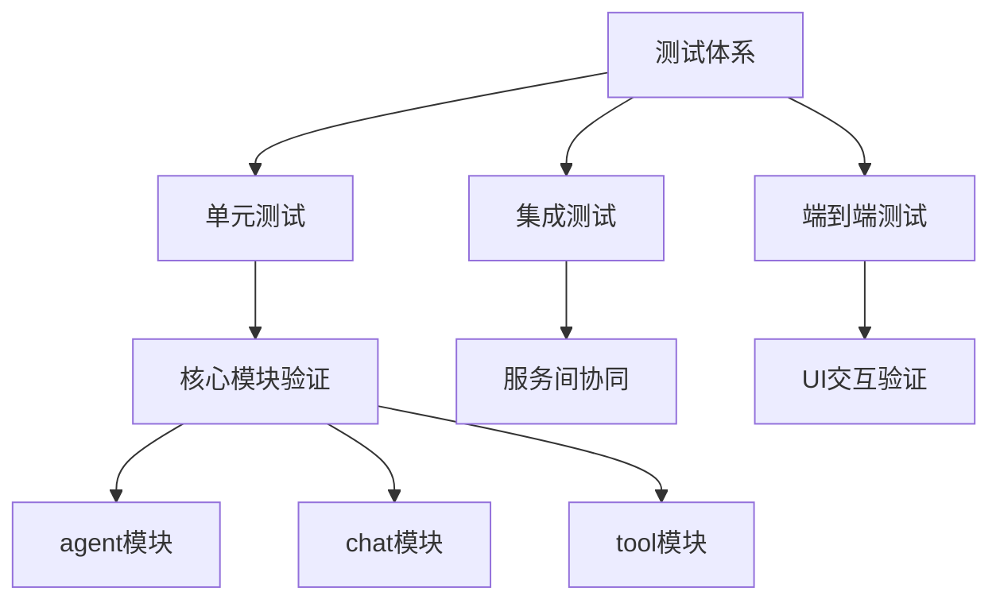
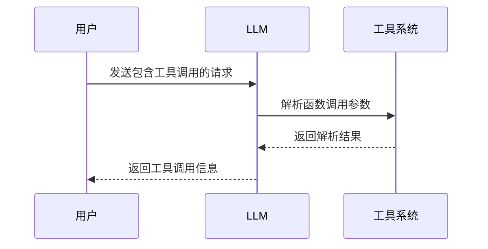
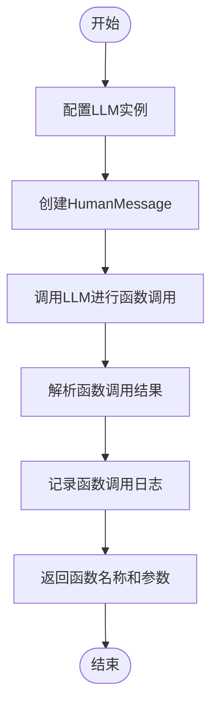
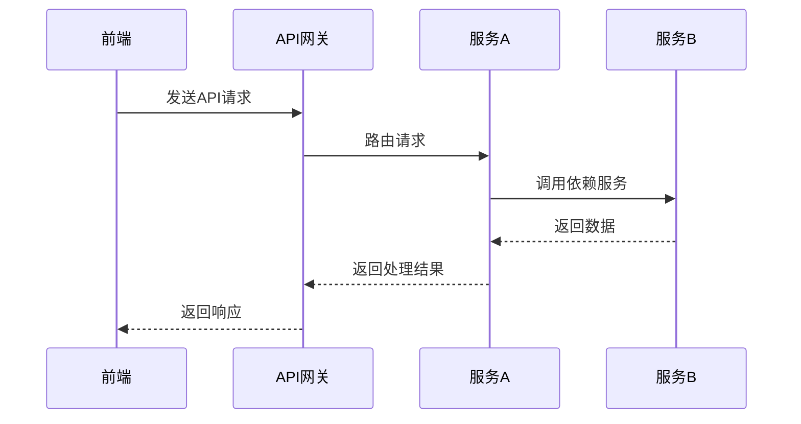
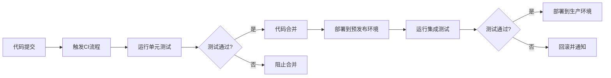
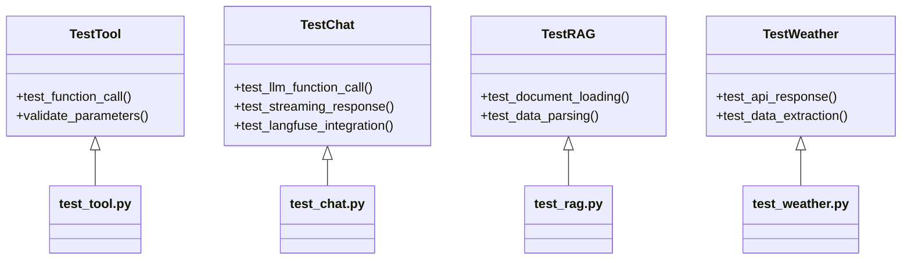

# 测试策略

<cite>
**本文档引用的文件**  
- [test_tool.py](https://github.com/Shy2593666979/AgentChat/src/backend/agentchat/test/test_tool.py)
- [test_chat.py](https://github.com/Shy2593666979/AgentChat/src/backend/agentchat/test/test_chat.py)
- [test_rag.py](https://github.com/Shy2593666979/AgentChat/src/backend/agentchat/test/test_rag.py)
- [test_weather.py](https://github.com/Shy2593666979/AgentChat/src/backend/agentchat/test/test_weather.py)
- [pyproject.toml](https://github.com/Shy2593666979/AgentChat/pyproject.toml)
</cite>

## 目录
1. [简介](#简介)
2. [测试体系架构](#测试体系架构)
3. [单元测试](#单元测试)
4. [集成测试](#集成测试)
5. [端到端测试](#端到端测试)
6. [测试运行与执行](#测试运行与执行)
7. [测试覆盖率与CI/CD](#测试覆盖率与cicd)
8. [测试文件结构分析](#测试文件结构分析)
9. [结论](#结论)

## 简介
本项目采用多层次的测试策略，确保AgentChat系统的稳定性与可靠性。测试体系涵盖单元测试、集成测试和端到端测试，覆盖核心模块如agent、chat、tool等。所有测试均遵循严格的代码质量标准，并在CI/CD流程中自动执行，以保障新功能的正确性和系统的整体健壮性。

## 测试体系架构
AgentChat项目构建了一个分层的测试体系，包含三个主要层级：单元测试、集成测试和端到端测试。这种分层架构确保了从最小代码单元到完整用户交互流程的全面验证。



**Diagram sources**
- [test_tool.py](https://github.com/Shy2593666979/AgentChat/src/backend/agentchat/test/test_tool.py)
- [test_chat.py](https://github.com/Shy2593666979/AgentChat/src/backend/agentchat/test/test_chat.py)

## 单元测试
单元测试使用pytest框架实现，主要位于`src/backend/agentchat/test/`目录下，针对各个核心模块进行细粒度的功能验证。每个测试文件专注于特定功能模块的逻辑正确性。

### 工具模块测试
`test_tool.py`文件验证工具调用逻辑，特别是函数调用参数的解析和处理。测试通过模拟LLM（大语言模型）的函数调用行为，验证系统能否正确识别和解析工具调用请求。



**Diagram sources**
- [test_tool.py](https://github.com/Shy2593666979/AgentChat/src/backend/agentchat/test/test_tool.py#L1-L76)

**Section sources**
- [test_tool.py](https://github.com/Shy2593666979/AgentChat/src/backend/agentchat/test/test_tool.py#L1-L76)

### 聊天模块测试
`test_chat.py`文件验证聊天功能的核心逻辑，包括消息流处理、函数调用监控和Langfuse集成。测试重点关注异步流式响应的生成和处理机制。



**Diagram sources**
- [test_chat.py](https://github.com/Shy2593666979/AgentChat/src/backend/agentchat/test/test_chat.py#L1-L140)

**Section sources**
- [test_chat.py](https://github.com/Shy2593666979/AgentChat/src/backend/agentchat/test/test_chat.py#L1-L140)

## 集成测试
集成测试模拟API端到端流程，确保不同服务组件之间的协同工作正常。虽然具体的集成测试文件未在当前上下文中显示，但根据项目结构可以推断存在相应的测试用例来验证服务间的交互。

集成测试重点关注：
- API接口的正确性
- 服务间的数据传递
- 错误处理机制
- 认证和授权流程



**Section sources**
- [test_a2a](https://github.com/Shy2593666979/AgentChat/src/backend/agentchat/test/test_a2a)

## 端到端测试
前端端到端测试可结合Cypress或Playwright进行UI交互验证。这些测试模拟真实用户操作，验证整个应用的工作流程，包括页面导航、表单提交和动态内容更新。

端到端测试覆盖的关键场景包括：
- 用户登录和身份验证
- 聊天界面交互
- 工具配置和使用
- 对话历史管理

## 测试运行与执行
测试可以通过多种方式运行，支持灵活的测试执行策略。

### 运行命令
```bash
poetry run pytest
```
或直接使用：
```bash
pytest
```

### 按模块筛选测试
支持按特定模块运行测试，提高开发效率：
```bash
pytest test_tool.py
pytest test_chat.py
```

**Section sources**
- [pyproject.toml](https://github.com/Shy2593666979/AgentChat/pyproject.toml#L1-L43)

## 测试覆盖率与CI/CD
项目强调测试覆盖率要求，所有新功能必须附带相应的测试用例。测试覆盖率是代码质量的重要指标，确保代码变更不会引入意外的回归问题。

### CI/CD集成
测试在CI/CD流程中自动执行，包括：
- 代码提交时的预提交检查
- Pull Request的自动化测试
- 部署前的完整测试套件执行

这种自动化流程确保只有通过所有测试的代码才能进入生产环境，大大降低了生产问题的风险。



**Section sources**
- [pyproject.toml](https://github.com/Shy2593666979/AgentChat/pyproject.toml)

## 测试文件结构分析
项目测试文件组织清晰，遵循模块化原则，便于维护和扩展。

### 测试目录结构
```
src/backend/agentchat/test/
├── chat_version_0_1/        # 聊天模块历史版本测试
├── database_version_0_1/    # 数据库模块历史版本测试
├── test_a2a/               # agent到agent通信测试
├── test_tool.py            # 工具模块测试
├── test_chat.py            # 聊天模块测试
├── test_rag.py             # RAG功能测试
├── test_weather.py         # 天气工具测试
└── 其他模块测试...
```

这种结构化的组织方式使得测试文件易于查找和维护，同时也支持按版本管理不同阶段的测试用例。



**Diagram sources**
- [test_tool.py](https://github.com/Shy2593666979/AgentChat/src/backend/agentchat/test/test_tool.py)
- [test_chat.py](https://github.com/Shy2593666979/AgentChat/src/backend/agentchat/test/test_chat.py)
- [test_rag.py](https://github.com/Shy2593666979/AgentChat/src/backend/agentchat/test/test_rag.py)
- [test_weather.py](https://github.com/Shy2593666979/AgentChat/src/backend/agentchat/test/test_weather.py)

**Section sources**
- [test_tool.py](https://github.com/Shy2593666979/AgentChat/src/backend/agentchat/test/test_tool.py)
- [test_chat.py](https://github.com/Shy2593666979/AgentChat/src/backend/agentchat/test/test_chat.py)
- [test_rag.py](https://github.com/Shy2593666979/AgentChat/src/backend/agentchat/test/test_rag.py)
- [test_weather.py](https://github.com/Shy2593666979/AgentChat/src/backend/agentchat/test/test_weather.py)

## 结论
AgentChat项目的测试体系设计全面，覆盖了从单元测试到端到端测试的各个层面。通过使用pytest框架和CI/CD自动化，确保了代码质量和系统稳定性。建议继续保持高测试覆盖率，并定期审查和更新测试用例，以适应项目的发展和变化。