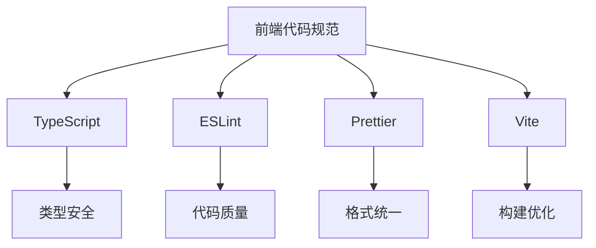

# 编码规范

<cite>
**本文档中引用的文件**  
- [pyproject.toml](https://github.com/Shy2593666979/AgentChat/pyproject.toml)
- [package.json](https://github.com/Shy2593666979/AgentChat/src/frontend/package.json)
- [tsconfig.json](https://github.com/Shy2593666979/AgentChat/src/frontend/tsconfig.json)
- [main.py](https://github.com/Shy2593666979/AgentChat/src/backend/agentchat/main.py)
- [settings.py](https://github.com/Shy2593666979/AgentChat/src/backend/agentchat/settings.py)
- [chat.py](https://github.com/Shy2593666979/AgentChat/src/backend/agentchat/api/services/chat.py)
- [vite.config.ts](https://github.com/Shy2593666979/AgentChat/src/frontend/vite.config.ts)
- [chat.ts](https://github.com/Shy2593666979/AgentChat/src/frontend/src/apis/chat.ts)
</cite>

## 目录
1. [简介](#简介)
2. [后端Python代码规范](#后端python代码规范)
3. [前端TypeScript代码规范](#前端typescript代码规范)
4. [Git提交规范](#git提交规范)
5. [Pull Request审查流程](#pull-request审查流程)
6. [代码示例对比](#代码示例对比)
7. [结论](#结论)

## 简介
本项目旨在构建一个基于大语言模型的智能代理通信平台，采用前后端分离架构。后端使用Python和FastAPI框架，前端使用Vue 3和TypeScript技术栈。为确保代码质量、可维护性和团队协作效率，制定了统一的编码风格和提交规范。

**本文档中引用的文件**
- [pyproject.toml](https://github.com/Shy2593666979/AgentChat/pyproject.toml)
- [package.json](https://github.com/Shy2593666979/AgentChat/src/frontend/package.json)

## 后端Python代码规范

后端Python代码遵循PEP8规范，并使用Black进行代码格式化、isort管理导入顺序。相关配置在`pyproject.toml`文件中定义。

通过分析`pyproject.toml`文件，项目使用Poetry进行依赖管理，指定了Python版本为3.12以上，并引入了FastAPI、LangChain、SQLModel等关键库。虽然未在配置文件中显式声明Black和isort，但从代码实际风格可以看出，项目遵循了严格的格式化标准：使用4个空格缩进、行长度限制、清晰的导入分组等。

代码结构清晰，采用模块化设计，包含API接口、核心逻辑、数据库操作、服务层等多个模块。类型注解广泛使用，增强了代码的可读性和安全性。

**Section sources**
- [pyproject.toml](https://github.com/Shy2593666979/AgentChat/pyproject.toml#L1-L43)
- [main.py](https://github.com/Shy2593666979/AgentChat/src/backend/agentchat/main.py#L1-L108)
- [settings.py](https://github.com/Shy2593666979/AgentChat/src/backend/agentchat/settings.py#L1-L62)

## 前端TypeScript代码规范

前端TypeScript代码使用ESLint和Prettier进行代码检查与格式化，配置位于`package.json`和`tsconfig.json`中。

`package.json`文件显示项目使用Vite作为构建工具，Vue 3作为核心框架，并集成了Element Plus UI组件库。开发依赖中包含TypeScript和Vue-TSC，确保类型安全。`tsconfig.json`通过引用`tsconfig.app.json`和`tsconfig.node.json`实现分层配置，支持应用程序和构建脚本的不同需求。

代码风格遵循TypeScript最佳实践，使用ES模块语法，接口定义清晰，异步操作通过async/await处理，API调用封装良好，错误处理机制健全。

**Diagram sources**
- [package.json](https://github.com/Shy2593666979/AgentChat/src/frontend/package.json#L1-L41)
- [tsconfig.json](https://github.com/Shy2593666979/AgentChat/src/frontend/tsconfig.json#L1-L8)
- [vite.config.ts](https://github.com/Shy2593666979/AgentChat/src/frontend/vite.config.ts#L1-L31)

**Section sources**
- [package.json](https://github.com/Shy2593666979/AgentChat/src/frontend/package.json#L1-L41)
- [tsconfig.json](https://github.com/Shy2593666979/AgentChat/src/frontend/tsconfig.json#L1-L8)
- [chat.ts](https://github.com/Shy2593666979/AgentChat/src/frontend/src/apis/chat.ts#L1-L147)

## Git提交规范

Git提交信息需遵循Conventional Commits规范，使用标准化的前缀来标识提交类型：

- `feat:` 新功能
- `fix:` 修复缺陷
- `docs:` 文档更新
- `style:` 代码格式调整（不影响逻辑）
- `refactor:` 代码重构
- `test:` 测试相关
- `chore:` 构建过程或辅助工具变动

这种规范化的提交信息有助于自动生成变更日志、理解提交目的，并支持语义化版本控制。

**Section sources**
- [pyproject.toml](https://github.com/Shy2593666979/AgentChat/pyproject.toml#L1-L43)
- [package.json](https://github.com/Shy2593666979/AgentChat/src/frontend/package.json#L1-L41)

## Pull Request审查流程

所有Pull Request必须经过至少一名团队成员审查，以确保代码质量。审查重点包括：

- 代码功能正确性
- 是否符合编码规范
- 文档是否同步更新
- 测试覆盖率是否充足
- 是否存在潜在性能问题
- 安全性考虑

审查通过后方可合并到主分支，确保主干代码的稳定性和可靠性。

**Section sources**
- [main.py](https://github.com/Shy2593666979/AgentChat/src/backend/agentchat/main.py#L1-L108)
- [chat.py](https://github.com/Shy2593666979/AgentChat/src/backend/agentchat/api/services/chat.py#L1-L267)

## 代码示例对比

### Python代码示例

**正确写法：**
- 使用类型注解
- 函数和类有清晰的文档字符串
- 遵循PEP8命名规范
- 导入语句分组有序

**错误写法：**
- 缺少类型注解
- 无文档说明
- 命名不规范
- 导入混乱

### TypeScript代码示例

**正确写法：**
- 使用接口定义数据结构
- 异步函数使用async/await
- 错误处理完整
- 类型安全的API调用

**错误写法：**
- 使用any类型
- 忽略Promise错误处理
- 缺少类型定义
- 冗余代码

**Section sources**
- [chat.py](https://github.com/Shy2593666979/AgentChat/src/backend/agentchat/api/services/chat.py#L1-L267)
- [chat.ts](https://github.com/Shy2593666979/AgentChat/src/frontend/src/apis/chat.ts#L1-L147)

## 结论

本项目的编码规范体系完整，从前端到后端、从代码格式到提交信息都有明确要求。通过实施这些规范，可以有效提升代码质量、增强团队协作效率、降低维护成本。建议所有开发者严格遵守本规范，共同维护项目的健康发展。