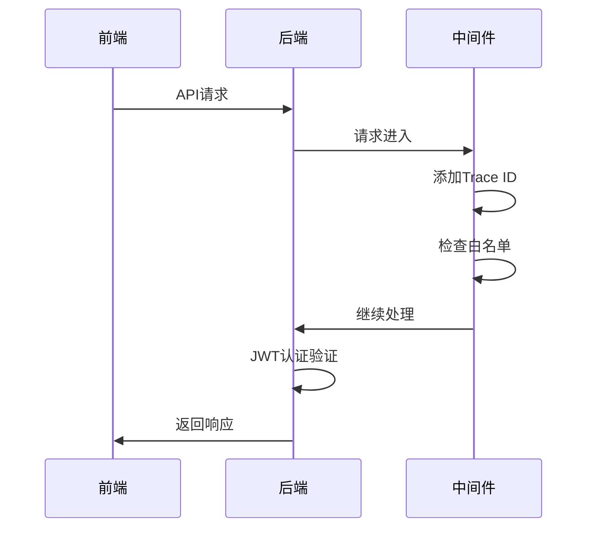
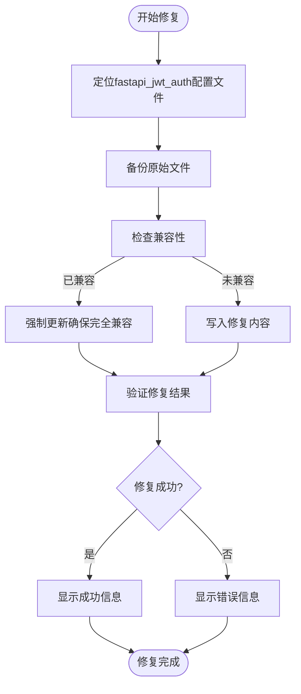

# 调试技巧

<cite>
**本文档中引用的文件**   
- [vite.config.ts](https://github.com/Shy2593666979/AgentChat/src/frontend/vite.config.ts)
- [DEBUGGING_GUIDE.md](https://github.com/Shy2593666979/AgentChat/src/frontend/DEBUGGING_GUIDE.md)
- [fix_fastapi_jwt_auth.py](https://github.com/Shy2593666979/AgentChat/scripts/fix_fastapi_jwt_auth.py)
- [main.py](https://github.com/Shy2593666979/AgentChat/src/backend/agentchat/main.py)
- [settings.py](https://github.com/Shy2593666979/AgentChat/src/backend/agentchat/settings.py)
- [JWT.py](https://github.com/Shy2593666979/AgentChat/src/backend/agentchat/api/JWT.py)
- [trace_id_middleware.py](https://github.com/Shy2593666979/AgentChat/src/backend/agentchat/middleware/trace_id_middleware.py)
- [white_list_middleware.py](https://github.com/Shy2593666979/AgentChat/src/backend/agentchat/middleware/white_list_middleware.py)
- [AgentDebug.vue](https://github.com/Shy2593666979/AgentChat/src/frontend/src/pages/agent/AgentDebug.vue)
</cite>

## 目录
1. [引言](#引言)
2. [前端调试方法](#前端调试方法)
3. [后端调试方法](#后端调试方法)
4. [常见错误排查路径](#常见错误排查路径)
5. [调试工具与脚本](#调试工具与脚本)
6. [综合调试流程](#综合调试流程)

## 引言
本指南旨在为AgentChat项目提供系统化的调试方法。通过结合前端和后端的调试工具与技术，开发者可以高效地定位和解决开发过程中遇到的问题。文档涵盖了从环境配置检查到具体错误代码的完整排查路径。

**Section sources**
- [DEBUGGING_GUIDE.md](https://github.com/Shy2593666979/AgentChat/src/frontend/DEBUGGING_GUIDE.md)

## 前端调试方法

### Vue Devtools监控
使用Vue Devtools可以实时监控组件状态和事件流，这对于理解应用的数据流动和组件交互至关重要。通过检查组件的props、data和events，可以快速识别状态管理问题。

### 浏览器开发者工具
结合浏览器开发者工具的Network和Console面板进行调试：

- **Network面板**：分析API请求与响应，检查请求头、响应状态码和数据格式
- **Console面板**：查看JavaScript错误、警告和调试输出
- **Application面板**：检查localStorage中的认证token等持久化数据

### 代理配置检查
在`vite.config.ts`中确认代理设置是否正确，确保前端开发服务器能够正确转发API请求到后端服务：

```typescript
proxy: {
  '/api': {
    target: 'http://localhost:7860/',
    changeOrigin: true,
  }
}
```

**Section sources**
- [vite.config.ts](https://github.com/Shy2593666979/AgentChat/src/frontend/vite.config.ts)
- [AgentDebug.vue](https://github.com/Shy2593666979/AgentChat/src/frontend/src/pages/agent/AgentDebug.vue)

## 后端调试方法

### FastAPI热重载
利用FastAPI的热重载功能，在代码变更时自动重启服务，实时查看变更效果。启动命令如下：

```bash
python -m agentchat.main
```

服务默认运行在 `http://localhost:7860`。

### 日志追踪
通过loguru日志和trace_id_middleware追踪请求链路：

- **loguru日志**：提供结构化的日志输出，便于问题定位
- **trace_id_middleware**：为每个请求分配唯一的trace ID，实现跨组件的请求追踪

### 认证与白名单
后端通过JWT进行认证，并使用白名单中间件控制访问权限：

- **JWT认证**：基于`fastapi-jwt-auth`实现，配置在`api/JWT.py`
- **白名单中间件**：`white_list_middleware.py`实现了路径白名单检查机制



**Diagram sources**
- [main.py](https://github.com/Shy2593666979/AgentChat/src/backend/agentchat/main.py)
- [trace_id_middleware.py](https://github.com/Shy2593666979/AgentChat/src/backend/agentchat/middleware/trace_id_middleware.py)
- [white_list_middleware.py](https://github.com/Shy2593666979/AgentChat/src/backend/agentchat/middleware/white_list_middleware.py)

**Section sources**
- [main.py](https://github.com/Shy2593666979/AgentChat/src/backend/agentchat/main.py)
- [settings.py](https://github.com/Shy2593666979/AgentChat/src/backend/agentchat/settings.py)
- [JWT.py](https://github.com/Shy2593666979/AgentChat/src/backend/agentchat/api/JWT.py)

## 常见错误排查路径

### 401 Unauthorized
- **原因**：token无效或未提供
- **排查步骤**：
  1. 检查localStorage中是否存在token
  2. 确认token是否过期
  3. 检查Authorization请求头格式是否正确
  4. 验证JWT配置是否正确

### 404 Not Found
- **原因**：API路径错误或后端服务未启动
- **排查步骤**：
  1. 确认后端服务是否正在运行
  2. 检查路由配置是否正确
  3. 验证代理配置是否将请求正确转发
  4. 确认API端点是否存在

### 500 Internal Server Error
- **原因**：后端代码错误或数据库问题
- **排查步骤**：
  1. 查看后端控制台日志
  2. 检查数据库连接状态
  3. 验证配置文件加载是否成功
  4. 检查依赖服务是否可用

### CORS错误
- **原因**：跨域请求被阻止
- **排查步骤**：
  1. 检查后端CORS配置
  2. 确认前端请求的origin是否被允许
  3. 验证代理配置是否正确处理跨域

**Section sources**
- [DEBUGGING_GUIDE.md](https://github.com/Shy2593666979/AgentChat/src/frontend/DEBUGGING_GUIDE.md)

## 调试工具与脚本

### AgentDebug.vue调试页面
项目提供了专门的`AgentDebug.vue`调试页面，用于测试智能体API：

- 显示当前URL和token状态
- 提供API测试按钮
- 实时显示调试日志输出
- 支持网络连接测试

### 修复脚本
`scripts/`目录下的修复脚本辅助诊断复杂问题：

#### JWT兼容性修复
`fix_fastapi_jwt_auth.py`脚本解决FastAPI JWT Auth与Pydantic 2的兼容性问题：

- 自动定位fastapi_jwt_auth配置文件
- 备份原始配置文件
- 写入Pydantic 2兼容的配置内容
- 提供恢复机制



**Diagram sources**
- [fix_fastapi_jwt_auth.py](https://github.com/Shy2593666979/AgentChat/scripts/fix_fastapi_jwt_auth.py)

**Section sources**
- [fix_fastapi_jwt_auth.py](https://github.com/Shy2593666979/AgentChat/scripts/fix_fastapi_jwt_auth.py)
- [AgentDebug.vue](https://github.com/Shy2593666979/AgentChat/src/frontend/src/pages/agent/AgentDebug.vue)

## 综合调试流程

### 系统化调试步骤
1. **环境检查**：确认前后端服务均已启动
2. **代理验证**：检查vite.config.ts中的代理配置
3. **认证状态**：验证localStorage中的token
4. **API测试**：使用curl或Postman手动测试API
5. **日志分析**：查看后端控制台和日志输出
6. **数据库检查**：确认相关数据表存在且有数据

### 调试最佳实践
- 使用`AgentDebug.vue`页面进行初步测试
- 在Network面板中复制请求为curl命令进行测试
- 利用trace ID追踪完整请求链路
- 定期检查配置文件的正确性
- 使用修复脚本处理已知兼容性问题

**Section sources**
- [DEBUGGING_GUIDE.md](https://github.com/Shy2593666979/AgentChat/src/frontend/DEBUGGING_GUIDE.md)