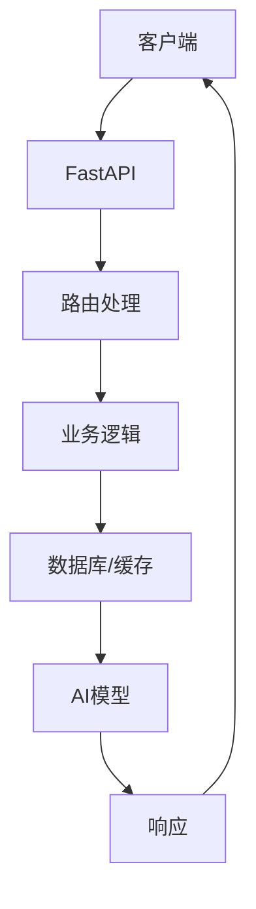
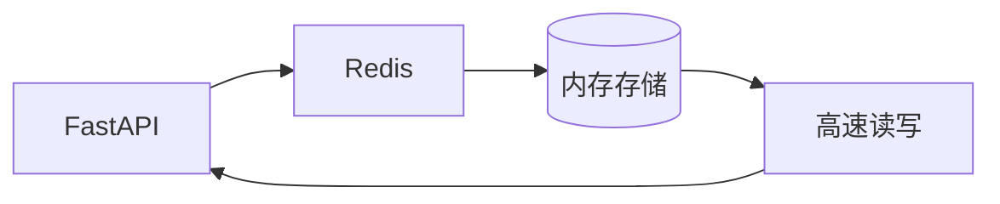
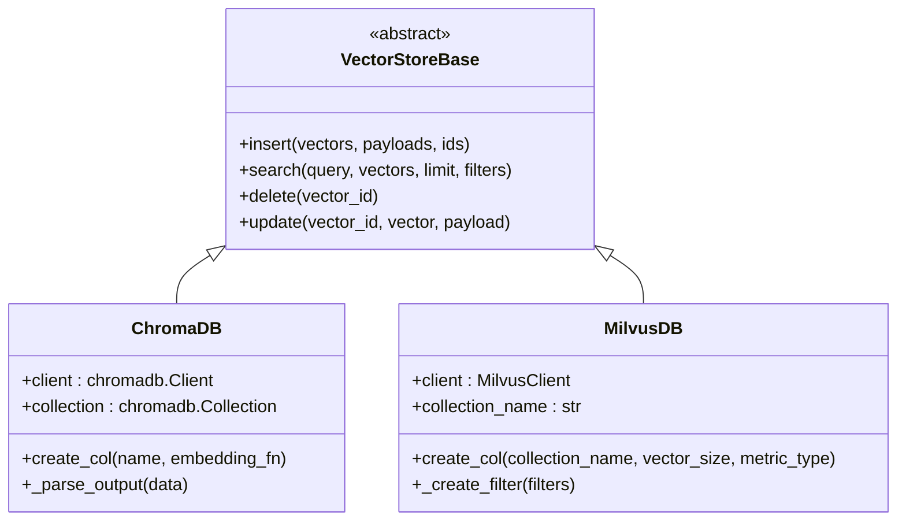
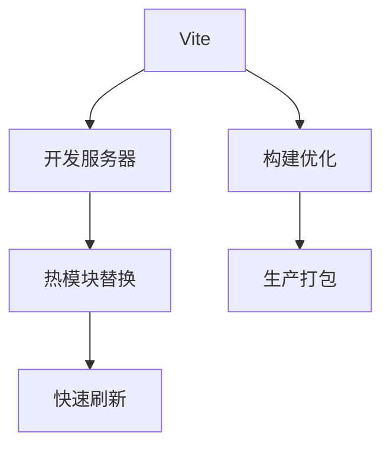
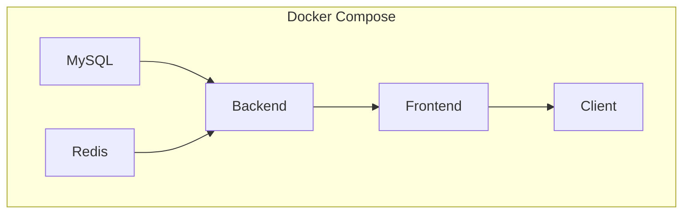
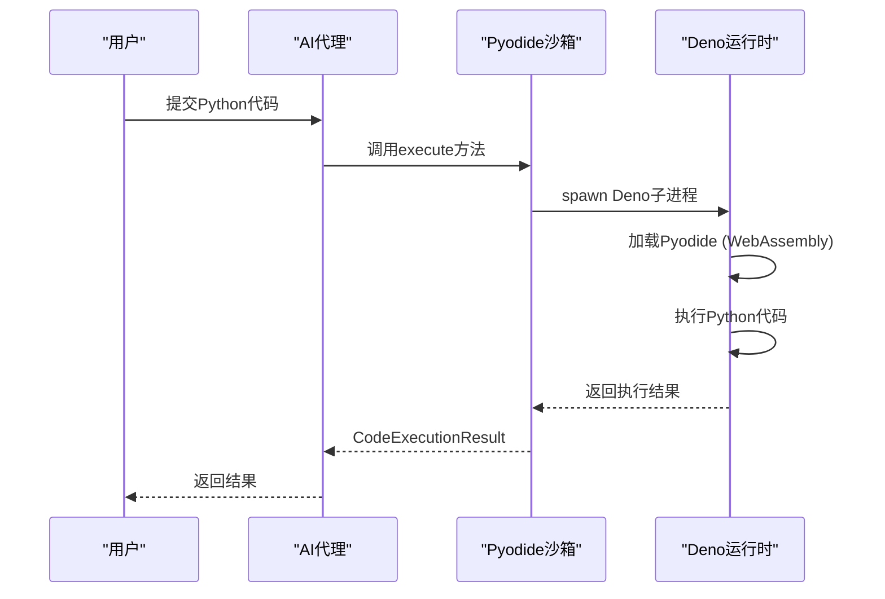

# 技术栈

## 目录
1. [引言](#引言)
2. [后端技术栈](#后端技术栈)
   - [FastAPI](#fastapi)
   - [SQLModel](#sqlmodel)
   - [LangChain](#langchain)
   - [Redis](#redis)
   - [ChromaDB/Milvus](#chromadbmilvus)
   - [Elasticsearch](#elasticsearch)
3. [前端技术栈](#前端技术栈)
   - [Vue3](#vue3)
   - [TypeScript](#typescript)
   - [Vite](#vite)
   - [Element Plus](#element-plus)
4. [开发与部署工具](#开发与部署工具)
   - [Docker](#docker)
   - [docker-compose](#docker-compose)
   - [Nginx](#nginx)
   - [Pyodide](#pyodide)
5. [兼容性说明与升级建议](#兼容性说明与升级建议)
6. [新开发者学习路径建议](#新开发者学习路径建议)
7. [结论](#结论)

## 引言

AgentChat项目是一个基于大语言模型（LLM）的智能代理通信平台，采用现代化的技术栈构建。本技术文档详细阐述了项目所采用的技术架构，分为后端、前端和开发工具三个主要部分。通过分析项目配置文件和核心代码，我们将深入探讨每项技术选型的原因及其在系统中的角色，为开发者提供全面的技术理解。

**Section sources**
- [pyproject.toml](https://github.com/Shy2593666979/AgentChat/pyproject.toml#L1-L43)
- [src/frontend/package.json](https://github.com/Shy2593666979/AgentChat/src/frontend/package.json#L1-L41)

## 后端技术栈

### FastAPI

FastAPI是AgentChat后端的核心框架，用于构建RESTful API和WebSocket服务。项目在`pyproject.toml`中明确依赖`fastapi = "^0.121.0"`，并在`src/backend/agentchat/main.py`中作为主要导入使用。FastAPI的异步特性极大地提升了API性能，能够高效处理大量并发请求，这对于实时聊天和AI代理交互至关重要。其基于Pydantic的自动数据验证和OpenAPI文档生成功能，简化了API开发和维护。

**Diagram sources**
- [src/backend/agentchat/main.py](https://github.com/Shy2593666979/AgentChat/src/backend/agentchat/main.py#L3-L108)

**Section sources**
- [pyproject.toml](https://github.com/Shy2593666979/AgentChat/pyproject.toml#L18)
- [src/backend/agentchat/main.py](https://github.com/Shy2593666979/AgentChat/src/backend/agentchat/main.py#L3)

### SQLModel

SQLModel作为ORM（对象关系映射）工具，负责后端与MySQL数据库的交互。它在`pyproject.toml`中被列为依赖`sqlmodel = "^0.0.27"`。SQLModel结合了SQLAlchemy的强大功能和Pydantic的数据验证能力，使数据库操作既安全又高效。项目通过`src/backend/agentchat/database/models/`目录下的模型定义，实现了数据表与Python类的映射，简化了数据持久化操作。

**Section sources**
- [pyproject.toml](https://github.com/Shy2593666979/AgentChat/pyproject.toml#L19)
- [src/backend/agentchat/database/models/](https://github.com/Shy2593666979/AgentChat/src/backend/agentchat/database/models/)

### LangChain

LangChain是项目AI能力的核心，用于实现AI链式调用和复杂代理逻辑。`pyproject.toml`中列出了`langchain = "^1.0.3"`等系列依赖。LangChain提供了构建LLM应用的模块化组件，如链（Chains）、代理（Agents）和工具（Tools），使开发者能够轻松构建复杂的AI工作流。在`src/backend/agentchat/core/agents/`目录下，可以看到多种代理（如React Agent、Plan-Execute Agent）的实现，这些都依赖于LangChain框架。

**Section sources**
- [pyproject.toml](https://github.com/Shy2593666979/AgentChat/pyproject.toml#L10-L11)
- [src/backend/agentchat/core/agents/](https://github.com/Shy2593666979/AgentChat/src/backend/agentchat/core/agents/)

### Redis

Redis在项目中扮演缓存管理的角色，用于存储会话数据、临时结果和系统状态。`pyproject.toml`中依赖`redis = "^7.0.1"`，`docker-compose.yml`中也定义了Redis服务。通过Redis，系统可以快速访问频繁使用的数据，显著降低数据库负载，提升响应速度。在`src/backend/agentchat/services/redis.py`中，可以找到Redis客户端的封装和使用。

**Diagram sources**
- [docker-compose.yml](https://github.com/Shy2593666979/AgentChat/docker-compose.yml#L31-L49)
- [src/backend/agentchat/services/redis.py](https://github.com/Shy2593666979/AgentChat/src/backend/agentchat/services/redis.py)

**Section sources**
- [pyproject.toml](https://github.com/Shy2593666979/AgentChat/pyproject.toml#L21)
- [docker-compose.yml](https://github.com/Shy2593666979/AgentChat/docker-compose.yml#L31-L49)

### ChromaDB/Milvus

ChromaDB和Milvus作为向量存储系统，用于存储和检索AI模型生成的向量嵌入。`pyproject.toml`中同时依赖`chromadb = "^1.3.4"`和`pymilvus = "^2.6.3"`。这两个系统支持相似性搜索，是实现RAG（检索增强生成）功能的关键。项目在`src/backend/agentchat/services/memory/vector_stores/`目录下分别实现了ChromaDB和Milvus的适配器，允许系统根据配置灵活选择向量数据库。

**Diagram sources**
- [src/backend/agentchat/services/memory/vector_stores/base.py](https://github.com/Shy2593666979/AgentChat/src/backend/agentchat/services/memory/vector_stores/base.py)
- [src/backend/agentchat/services/memory/vector_stores/chroma.py](https://github.com/Shy2593666979/AgentChat/src/backend/agentchat/services/memory/vector_stores/chroma.py)
- [src/backend/agentchat/services/memory/vector_stores/milvus.py](https://github.com/Shy2593666979/AgentChat/src/backend/agentchat/services/memory/vector_stores/milvus.py)

**Section sources**
- [pyproject.toml](https://github.com/Shy2593666979/AgentChat/pyproject.toml#L28-L29)
- [src/backend/agentchat/services/memory/vector_stores/](https://github.com/Shy2593666979/AgentChat/src/backend/agentchat/services/memory/vector_stores/)

### Elasticsearch

Elasticsearch用于全文检索，为知识库和文档提供高效的搜索能力。`pyproject.toml`中依赖`elasticsearch = "^9.2.0"`。它与向量数据库形成互补，Elasticsearch处理关键词匹配，而向量数据库处理语义相似性搜索。这种混合检索策略（Hybrid Search）能提供更全面和准确的搜索结果。项目在`src/backend/agentchat/services/rag/es_client.py`中封装了Elasticsearch客户端。

**Section sources**
- [pyproject.toml](https://github.com/Shy2593666979/AgentChat/pyproject.toml#L24)
- [src/backend/agentchat/services/rag/es_client.py](https://github.com/Shy2593666979/AgentChat/src/backend/agentchat/services/rag/es_client.py)

## 前端技术栈

### Vue3

Vue3是前端的UI框架，采用组件化开发模式。`package.json`中依赖`vue": "^3.4.21"`。Vue3的Composition API和响应式系统优化了用户体验，使界面能够高效地响应数据变化。项目在`src/frontend/src/components/`和`src/frontend/src/pages/`目录下组织了大量Vue组件，如`agentCard.vue`、`chatPage.vue`等，实现了模块化的UI设计。

**Section sources**
- [src/frontend/package.json](https://github.com/Shy2593666979/AgentChat/src/frontend/package.json#L26)
- [src/frontend/src/components/](https://github.com/Shy2593666979/AgentChat/src/frontend/src/components/)
- [src/frontend/src/pages/](https://github.com/Shy2593666979/AgentChat/src/frontend/src/pages/)

### TypeScript

TypeScript为前端提供了类型安全，`package.json`中依赖`typescript": "^5.4.3"`。它帮助开发者在开发阶段捕获潜在的错误，提高代码质量和可维护性。项目通过`src/frontend/src/type.ts`等文件定义了数据类型，确保前后端数据交互的准确性。

**Section sources**
- [src/frontend/package.json](https://github.com/Shy2593666979/AgentChat/src/frontend/package.json#L34)
- [src/frontend/src/type.ts](https://github.com/Shy2593666979/AgentChat/src/frontend/src/type.ts)

### Vite

Vite作为前端构建工具，`package.json`中依赖`vite": "^5.2.8"`。它利用现代浏览器的ES模块支持，提供了极快的冷启动和热更新速度，极大地提升了开发效率。`src/frontend/vite.config.ts`文件配置了开发服务器、代理和插件。

**Diagram sources**
- [src/frontend/vite.config.ts](https://github.com/Shy2593666979/AgentChat/src/frontend/vite.config.ts#L1-L31)

**Section sources**
- [src/frontend/package.json](https://github.com/Shy2593666979/AgentChat/src/frontend/package.json#L37)
- [src/frontend/vite.config.ts](https://github.com/Shy2593666979/AgentChat/src/frontend/vite.config.ts)

### Element Plus

Element Plus是项目采用的UI库，`package.json`中依赖`element-plus": "^2.7.0"`。它提供了一套高质量的Vue3组件，如按钮、表单、对话框等，加速了用户界面的开发。项目在`src/frontend/src/main.ts`中引入了Element Plus，并在多个组件中使用其样式和功能。

**Section sources**
- [src/frontend/package.json](https://github.com/Shy2593666979/AgentChat/src/frontend/package.json#L17)
- [src/frontend/src/main.ts](https://github.com/Shy2593666979/AgentChat/src/frontend/src/main.ts#L8-L9)

## 开发与部署工具

### Docker

Docker用于容器化应用，`docker/Dockerfile`文件定义了后端服务的构建过程。它基于`python:3.12-slim`镜像，安装依赖并复制代码，确保了开发、测试和生产环境的一致性。Dockerfile中的`CMD`指令启动Uvicorn服务器，运行FastAPI应用。

**Section sources**
- [docker/Dockerfile](https://github.com/Shy2593666979/AgentChat/docker/Dockerfile#L1-L39)

### docker-compose

docker-compose用于服务编排，`docker/docker-compose.yml`文件定义了MySQL、Redis、后端和前端四个服务。它通过网络配置使服务间能够通信，并通过健康检查确保服务依赖的正确启动顺序。这种编排方式简化了多服务应用的部署和管理。

**Diagram sources**
- [docker/docker-compose.yml](https://github.com/Shy2593666979/AgentChat/docker/docker-compose.yml#L1-L126)

**Section sources**
- [docker/docker-compose.yml](https://github.com/Shy2593666979/AgentChat/docker/docker-compose.yml#L1-L126)

### Nginx

Nginx在部署中作为反向代理，虽然在`docker-compose.yml`中未直接定义，但通常在生产环境中用于代理前端静态资源和后端API，提供负载均衡和SSL终止等功能。

### Pyodide

Pyodide用于在浏览器中执行Python代码，作为沙箱执行环境。`src/backend/agentchat/services/sandbox/pyodide.py`文件实现了基于Deno和Pyodide的沙箱，利用Deno的安全模型来执行不受信任的代码。这对于需要在安全环境中运行用户代码的AI代理功能至关重要。

**Diagram sources**
- [src/backend/agentchat/services/sandbox/pyodide.py](https://github.com/Shy2593666979/AgentChat/src/backend/agentchat/services/sandbox/pyodide.py#L1-L737)

**Section sources**
- [src/backend/agentchat/services/sandbox/pyodide.py](https://github.com/Shy2593666979/AgentChat/src/backend/agentchat/services/sandbox/pyodide.py)

## 兼容性说明与升级建议

根据`pyproject.toml`和`package.json`中的依赖版本，项目当前使用的技术栈版本如下：
- Python 3.12
- FastAPI 0.121.0
- SQLModel 0.0.27
- LangChain 1.0.3
- Vue3 3.4.21
- Vite 5.2.8

这些版本之间具有良好的兼容性。升级建议：
1. **FastAPI**: 可以安全升级到最新版本，其向后兼容性良好。
2. **LangChain**: 由于其API可能频繁变化，升级前需仔细阅读变更日志并进行充分测试。
3. **Vue3**: 可以考虑升级到最新稳定版，利用其性能改进和新特性。
4. **TypeScript**: 建议保持与Vite和Vue3的兼容版本同步升级。

**Section sources**
- [pyproject.toml](https://github.com/Shy2593666979/AgentChat/pyproject.toml#L9-L43)
- [src/frontend/package.json](https://github.com/Shy2593666979/AgentChat/src/frontend/package.json#L1-L41)

## 新开发者学习路径建议

对于新加入的开发者，建议按以下路径学习：
1. **基础环境**: 首先掌握Docker和docker-compose，能够成功部署和运行整个项目。
2. **前端入门**: 学习Vue3和TypeScript基础，理解`src/frontend/src`下的组件结构和路由配置。
3. **后端核心**: 深入学习FastAPI，理解`src/backend/agentchat/main.py`中的应用生命周期和中间件。
4. **数据交互**: 掌握SQLModel和数据库模型，了解`src/backend/agentchat/database/`下的DAO模式。
5. **AI集成**: 学习LangChain文档，理解`src/backend/agentchat/core/agents/`中代理的工作原理。
6. **高级特性**: 研究向量数据库（ChromaDB/Milvus）和全文检索（Elasticsearch）的集成方式。
7. **安全沙箱**: 最后学习Pyodide沙箱的实现，理解如何安全地执行不受信任的代码。

**Section sources**
- [docker/docker-compose.yml](https://github.com/Shy2593666979/AgentChat/docker/docker-compose.yml)
- [src/frontend/src/main.ts](https://github.com/Shy2593666979/AgentChat/src/frontend/src/main.ts)
- [src/backend/agentchat/main.py](https://github.com/Shy2593666979/AgentChat/src/backend/agentchat/main.py)

## 结论

AgentChat项目构建了一个现代化、高性能的智能代理平台，其技术栈选型合理，各组件协同工作良好。后端采用FastAPI、SQLModel、LangChain等技术，提供了强大的API和AI处理能力；前端使用Vue3、TypeScript和Vite，保证了优秀的用户体验和开发效率；开发与部署工具如Docker、docker-compose和Pyodide，确保了系统的可维护性和安全性。该技术架构为未来的功能扩展和性能优化奠定了坚实的基础。
