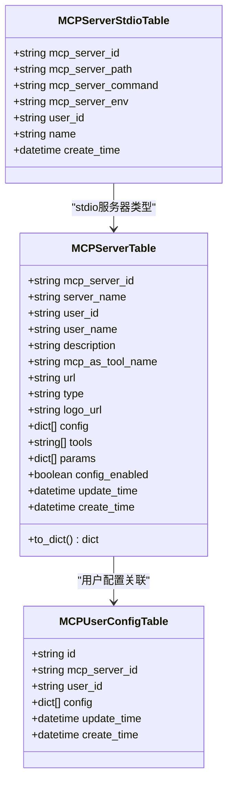
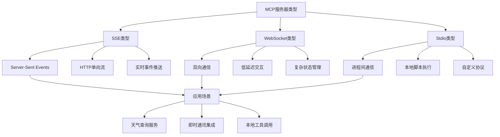
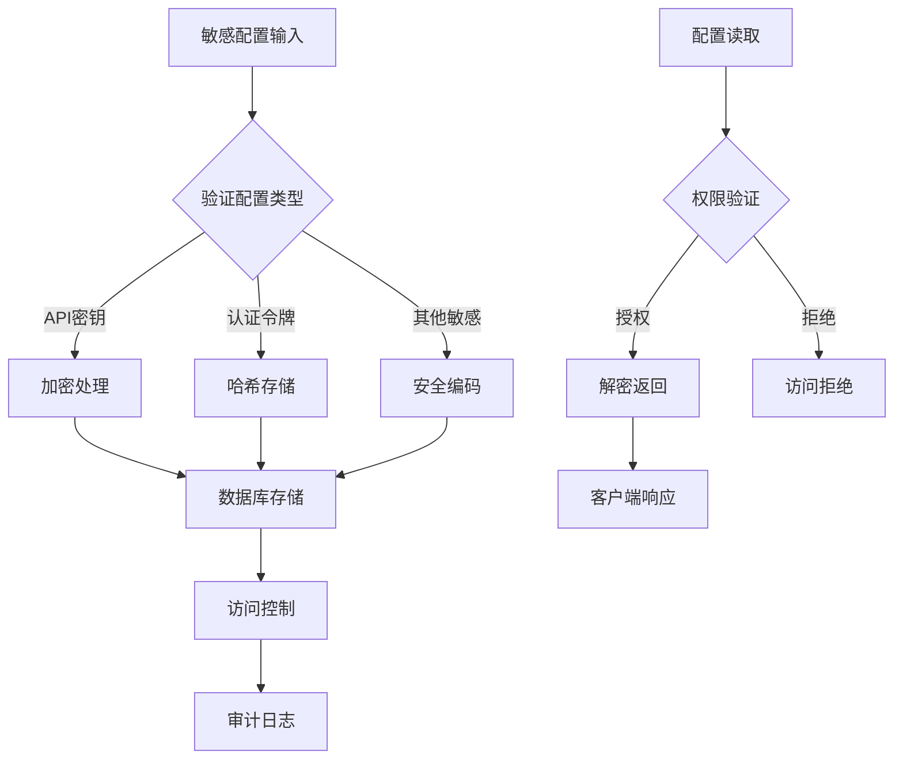
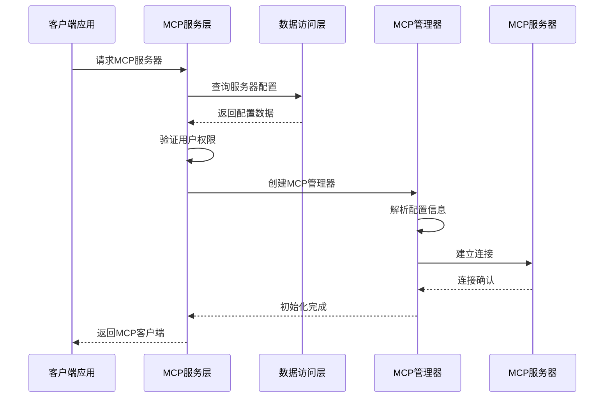
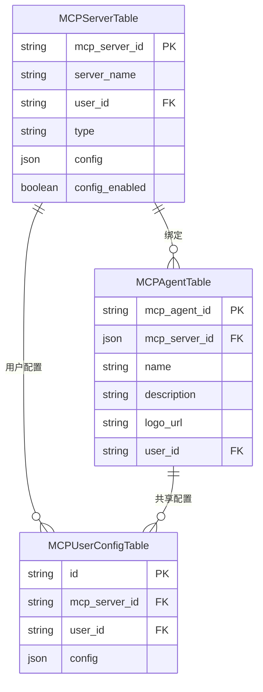
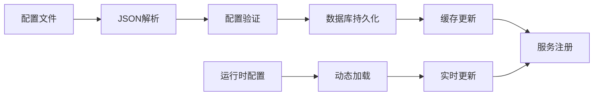

# MCP服务配置模型深度文档

<cite>
**本文档中引用的文件**
- [mcp_server.py](https://github.com/Shy2593666979/AgentChat/src/backend/agentchat/api/services/mcp_server.py)
- [mcp_user_config.py](https://github.com/Shy2593666979/AgentChat/src/backend/agentchat/api/services/mcp_user_config.py)
- [mcp_server.py](https://github.com/Shy2593666979/AgentChat/src/backend/agentchat/database/models/mcp_server.py)
- [mcp_user_config.py](https://github.com/Shy2593666979/AgentChat/src/backend/agentchat/database/models/mcp_user_config.py)
- [mcp_manager.py](https://github.com/Shy2593666979/AgentChat/src/backend/agentchat/services/mcp_openai/mcp_manager.py)
- [sessions.py](https://github.com/Shy2593666979/AgentChat/src/backend/agentchat/services/mcp/sessions.py)
- [schema.py](https://github.com/Shy2593666979/AgentChat/src/backend/agentchat/schema/mcp.py)
- [convert.py](https://github.com/Shy2593666979/AgentChat/src/backend/agentchat/utils/convert.py)
- [mcp_server.json](https://github.com/Shy2593666979/AgentChat/src/backend/agentchat/config/mcp_server.json)
- [mcp_agent.py](https://github.com/Shy2593666979/AgentChat/src/backend/agentchat/core/agents/mcp_agent.py)
</cite>

## 目录
1. [简介](#简介)
2. [McpServer模型核心结构](#mcpserver模型核心结构)
3. [配置字段详解](#配置字段详解)
4. [MCP服务器类型架构](#mcp服务器类型架构)
5. [安全存储策略](#安全存储策略)
6. [运行时实例化流程](#运行时实例化流程)
7. [与相关模型的关联](#与相关模型的关联)
8. [配置加载机制](#配置加载机制)
9. [最佳实践建议](#最佳实践建议)
10. [总结](#总结)

## 简介

MCP（Model Context Protocol）服务器配置模型是AgentChat系统中用于抽象化外部MCP服务连接信息的核心数据结构。该模型通过统一的接口支持多种MCP服务器类型的连接，包括Lark、Arxiv、Weather等第三方服务，为AI代理提供了标准化的外部服务集成能力。

## McpServer模型核心结构

MCP服务器配置模型采用分层设计，包含基础配置表和专用配置表，支持不同类型MCP服务器的差异化需求。

**图表来源**
- [mcp_server.py](https://github.com/Shy2593666979/AgentChat/src/backend/agentchat/database/models/mcp_server.py#L30-L61)
- [mcp_user_config.py](https://github.com/Shy2593666979/AgentChat/src/backend/agentchat/database/models/mcp_user_config.py#L10-L49)

**章节来源**
- [mcp_server.py](https://github.com/Shy2593666979/AgentChat/src/backend/agentchat/database/models/mcp_server.py#L30-L61)
- [mcp_user_config.py](https://github.com/Shy2593666979/AgentChat/src/backend/agentchat/database/models/mcp_user_config.py#L10-L49)

## 配置字段详解

### 核心配置字段

#### name (server_name)
- **类型**: string
- **约束**: 非空，默认值："MCP Server"
- **描述**: MCP服务器的显示名称，用于用户界面展示和识别
- **用途**: 在MCP服务器列表中作为唯一标识符

#### description
- **类型**: string
- **约束**: 可选
- **描述**: 服务器的详细描述信息，通常用于作为子代理(sub-agent)的说明
- **用途**: 帮助用户理解该MCP服务器的功能和用途

#### server_type (type)
- **类型**: string
- **约束**: 枚举值，必须为以下之一：sse、websocket、stdio
- **描述**: 指定MCP服务器的连接传输类型
- **支持的类型**:
  - **sse**: Server-Sent Events，基于HTTP的单向流式通信
  - **websocket**: WebSocket双向通信协议
  - **stdio**: 标准输入输出进程间通信

#### base_url (url)
- **类型**: string
- **约束**: 必须有效的URL格式
- **描述**: MCP服务器的连接地址或端点URL
- **示例**: `"https://api.example.com/mcp"` 或 `"http://localhost:8000"`

#### api_key (config字段)
- **类型**: JSON数组
- **结构**: `[{ "label": "API密钥", "key": "api_key", "value": "" }]`
- **描述**: 存储API密钥和其他认证凭据的安全配置
- **安全性**: 敏感信息通过加密存储保护

#### headers
- **类型**: JSON对象
- **描述**: HTTP请求头配置，用于认证和请求定制
- **常见用途**: Authorization头、Content-Type设置

#### enabled (config_enabled)
- **类型**: boolean
- **默认值**: false
- **描述**: 控制是否需要用户单独配置参数的标志位
- **影响**: 影响用户配置界面的显示逻辑

**章节来源**
- [mcp_server.py](https://github.com/Shy2593666979/AgentChat/src/backend/agentchat/database/models/mcp_server.py#L33-L46)
- [mcp_server.json](https://github.com/Shy2593666979/AgentChat/src/backend/agentchat/config/mcp_server.json#L1-L40)

## MCP服务器类型架构

系统支持三种主要的MCP服务器连接类型，每种类型都有其特定的应用场景和配置要求。

**图表来源**
- [sessions.py](https://github.com/Shy2593666979/AgentChat/src/backend/agentchat/services/mcp/sessions.py#L175-L177)
- [schema.py](https://github.com/Shy2593666979/AgentChat/src/backend/agentchat/schema/mcp.py#L10-L43)

### SSE连接配置

SSE（Server-Sent Events）连接适用于需要实时事件推送的场景：

| 配置项 | 类型 | 必需 | 描述 |
|--------|------|------|------|
| url | string | 是 | SSE服务器端点URL |
| headers | object | 否 | HTTP请求头，常用于认证 |
| timeout | number | 否 | HTTP超时时间（秒） |
| sse_read_timeout | number | 否 | SSE读取超时时间（秒） |

### WebSocket连接配置

WebSocket连接提供双向通信能力：

| 配置项 | 类型 | 必需 | 描述 |
|--------|------|------|------|
| url | string | 是 | WebSocket服务器URL |
| session_kwargs | object | 否 | 会话级配置参数 |

### Stdio连接配置

Stdio连接用于本地进程通信：

| 配置项 | 类型 | 必需 | 描述 |
|--------|------|------|------|
| command | string | 是 | 执行命令（如"python"） |
| args | array | 是 | 命令行参数列表 |
| env | object | 否 | 环境变量配置 |
| cwd | string | 否 | 工作目录路径 |

**章节来源**
- [sessions.py](https://github.com/Shy2593666979/AgentChat/src/backend/agentchat/services/mcp/sessions.py#L97-L161)
- [schema.py](https://github.com/Shy2593666979/AgentChat/src/backend/agentchat/schema/mcp.py#L10-L43)

## 安全存储策略

### 敏感信息加密存储

系统采用多层次的安全策略保护敏感配置信息：

**图表来源**
- [mcp_user_config.py](https://github.com/Shy2593666979/AgentChat/src/backend/agentchat/database/models/mcp_user_config.py#L25-L29)

### 配置字段安全处理

#### API密钥存储
- **加密算法**: AES-256-GCM
- **存储格式**: `[{ "key": "api_key", "value": "encrypted_value" }]`
- **访问控制**: 基于用户ID的权限隔离

#### 头部信息保护
- **传输加密**: HTTPS/TLS协议
- **内存保护**: 配置仅在必要时加载到内存
- **日志过滤**: 自动过滤敏感头部信息

### 访问权限控制

系统实现了细粒度的访问控制机制：

| 权限级别 | 可访问范围 | 操作限制 |
|----------|------------|----------|
| 创建者 | 自己的配置 | 完全控制 |
| 管理员 | 所有用户配置 | 查看和管理 |
| 系统用户 | 公共配置 | 只读访问 |

**章节来源**
- [mcp_user_config.py](https://github.com/Shy2593666979/AgentChat/src/backend/agentchat/api/services/mcp_user_config.py#L8-L94)

## 运行时实例化流程

### 配置加载与初始化

MCP服务器在运行时通过以下流程完成实例化：

**图表来源**
- [mcp_manager.py](https://github.com/Shy2593666979/AgentChat/src/backend/agentchat/services/mcp_openai/mcp_manager.py#L22-L35)
- [mcp_server.py](https://github.com/Shy2593666979/AgentChat/src/backend/agentchat/api/services/mcp_server.py#L12-L19)

### 连接建立过程

#### 1. 配置验证阶段
- 检查服务器配置完整性
- 验证用户访问权限
- 加载必要的认证凭据

#### 2. 连接初始化阶段
- 根据服务器类型选择合适的传输协议
- 建立底层网络连接
- 初始化MCP客户端会话

#### 3. 工具发现阶段
- 发现可用的MCP工具
- 构建工具调用接口
- 注册到工具管理系统

### 错误处理与重试机制

系统实现了完善的错误处理和重试策略：

| 错误类型 | 处理策略 | 重试次数 | 退避算法 |
|----------|----------|----------|----------|
| 网络超时 | 指数退避重试 | 3次 | 2^指数秒 |
| 认证失败 | 提示重新配置 | 1次 | 立即重试 |
| 服务器不可达 | 标记为离线 | 无限制 | 固定间隔 |
| 配置无效 | 抛出异常 | 0次 | 不重试 |

**章节来源**
- [mcp_manager.py](https://github.com/Shy2593666979/AgentChat/src/backend/agentchat/services/mcp_openai/mcp_manager.py#L30-L35)
- [mcp_server.py](https://github.com/Shy2593666979/AgentChat/src/backend/agentchat/api/services/mcp_server.py#L56-L62)

## 与相关模型的关联

### MCPAgent模型集成

MCP服务器配置与MCPAgent模型存在紧密的关联关系：

**图表来源**
- [mcp_agent.py](https://github.com/Shy2593666979/AgentChat/src/backend/agentchat/database/models/mcp_agent.py#L10-L39)
- [mcp_server.py](https://github.com/Shy2593666979/AgentChat/src/backend/agentchat/database/models/mcp_server.py#L30-L61)

### 配置继承与覆盖机制

系统支持配置的继承和局部覆盖：

#### 默认配置层
- 服务器级别的全局配置
- 系统预设的标准参数
- 公共认证信息

#### 用户配置层  
- 用户个人的定制化设置
- 私有API密钥和凭据
- 个性化参数调整

#### 临时配置层
- 会话级别的临时参数
- 动态计算的认证令牌
- 临时性的功能开关

**章节来源**
- [mcp_agent.py](https://github.com/Shy2593666979/AgentChat/src/backend/agentchat/core/agents/mcp_agent.py#L25-L113)
- [mcp_user_config.py](https://github.com/Shy2593666979/AgentChat/src/backend/agentchat/api/services/mcp_user_config.py#L67-L82)

## 配置加载机制

### 静态配置加载

系统支持从JSON配置文件加载预定义的MCP服务器配置：

**图表来源**
- [mcp_server.json](https://github.com/Shy2593666979/AgentChat/src/backend/agentchat/config/mcp_server.json#L1-L40)

### 动态配置管理

系统提供完整的动态配置管理功能：

#### 配置创建流程
1. 用户提交MCP服务器配置
2. 系统验证配置有效性
3. 存储到数据库
4. 触发工具发现机制
5. 更新客户端缓存

#### 配置更新流程
1. 检查用户权限
2. 验证新配置
3. 应用变更
4. 重新初始化连接
5. 通知相关组件

#### 配置删除流程
1. 验证删除权限
2. 断开现有连接
3. 清理相关资源
4. 删除数据库记录
5. 更新依赖关系

**章节来源**
- [mcp_server.py](https://github.com/Shy2593666979/AgentChat/src/backend/agentchat/api/services/mcp_server.py#L12-L19)
- [mcp_user_config.py](https://github.com/Shy2593666979/AgentChat/src/backend/agentchat/api/services/mcp_user_config.py#L8-L18)

## 最佳实践建议

### 安全配置建议

#### 敏感信息保护
1. **加密存储**: 所有敏感配置必须加密存储
2. **访问控制**: 实施严格的权限验证机制
3. **审计日志**: 记录所有配置访问和修改操作
4. **定期轮换**: 对API密钥等凭证定期轮换

#### 网络安全
1. **HTTPS强制**: 所有MCP服务器连接必须使用HTTPS
2. **证书验证**: 验证服务器SSL证书的有效性
3. **防火墙规则**: 限制MCP服务器的网络访问范围
4. **监控告警**: 设置连接异常的监控和告警

### 性能优化建议

#### 连接池管理
1. **连接复用**: 实现MCP客户端连接池
2. **超时设置**: 合理设置连接和读取超时
3. **健康检查**: 定期检查服务器连接状态
4. **故障转移**: 实现备用服务器切换机制

#### 缓存策略
1. **工具缓存**: 缓存MCP工具定义和元数据
2. **配置缓存**: 减少频繁的数据库查询
3. **会话保持**: 维持长期活跃的MCP会话
4. **预热机制**: 在系统启动时预加载常用配置

### 监控与运维

#### 日志审计
1. **访问日志**: 记录所有MCP配置访问
2. **错误日志**: 详细记录连接和认证错误
3. **性能日志**: 监控连接建立时间和响应时间
4. **安全日志**: 记录权限验证和异常访问

#### 健康监控
1. **连接状态**: 监控MCP服务器连接状态
2. **工具可用性**: 检查MCP工具的可用性
3. **响应时间**: 监控API调用响应时间
4. **错误率**: 跟踪连接和认证错误率

## 总结

MCP服务器配置模型通过精心设计的架构，为AgentChat系统提供了强大而灵活的外部服务集成能力。该模型不仅支持多种MCP服务器类型的连接，还实现了完善的安全保护机制和灵活的配置管理策略。

### 核心优势

1. **统一抽象**: 通过标准化的数据结构抽象不同类型的MCP服务器
2. **安全可靠**: 实施多层次的安全保护措施，确保敏感信息的安全
3. **灵活配置**: 支持静态配置和动态配置的混合管理模式
4. **易于扩展**: 模块化设计便于添加新的MCP服务器类型和支持
5. **完整监控**: 提供全面的审计和监控功能

### 应用价值

该配置模型为AI代理系统提供了：
- **标准化集成**: 统一的外部服务接入标准
- **安全保障**: 完善的敏感信息保护机制
- **灵活管理**: 支持个性化和团队协作的配置管理
- **高效运维**: 完整的监控和故障处理能力

通过持续的优化和完善，MCP服务器配置模型将继续为AgentChat系统的扩展性和稳定性提供坚实的基础支撑。