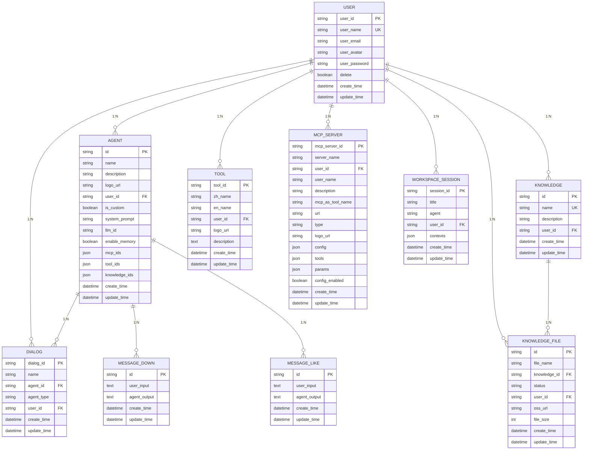

# 关系型数据模型

## 目录
1. [简介](#简介)
2. [核心数据模型](#核心数据模型)
3. [模型关系与ER图](#模型关系与er图)
4. [ORM映射与序列化机制](#orm映射与序列化机制)
5. [查询性能优化建议](#查询性能优化建议)
6. [总结](#总结)

## 简介
本项目采用SQLModel作为ORM框架，构建了一个完整的智能对话系统后端数据模型。模型涵盖了用户管理、智能体配置、对话会话、消息记录、知识库管理、工具定义、MCP服务配置和工作区会话等核心功能模块。所有模型均继承自`SQLModelSerializable`基类，实现了统一的序列化行为和敏感字段过滤机制。

## 核心数据模型

### 用户模型 (UserTable)
用户表存储系统用户的基本信息和认证数据。

**字段说明：**
- `user_id`: 用户唯一标识符，主键
- `user_name`: 用户名，唯一索引
- `user_email`: 用户邮箱
- `user_avatar`: 用户头像URL
- `user_description`: 用户描述
- `user_password`: 加密后的密码（敏感信息）
- `delete`: 软删除标记
- `create_time`: 创建时间，默认当前时间戳
- `update_time`: 更新时间，自动更新为当前时间戳

**约束：**
- 主键：`user_id`
- 唯一索引：`user_name`
- 时间字段默认值：`CURRENT_TIMESTAMP`

**业务含义：**
系统支持普通用户和管理员用户，通过`user_id`为'0'或'1'进行区分。密码字段经过加密处理，确保用户认证安全。

**Section sources**
- [user.py](https://github.com/Shy2593666979/AgentChat/src/backend/agentchat/database/models/user.py#L18-L34)

### 智能体模型 (AgentTable)
智能体表存储Agent的配置信息和元数据。

**字段说明：**
- `id`: Agent唯一标识符，主键
- `name`: Agent名称
- `description`: Agent描述
- `logo_url`: Agent图标URL
- `user_id`: 绑定的用户ID，索引
- `is_custom`: 是否为用户自定义Agent
- `system_prompt`: 系统提示词
- `llm_id`: 绑定的LLM模型ID
- `enable_memory`: 是否开启记忆功能
- `mcp_ids`: 绑定的MCP服务列表（JSON存储）
- `tool_ids`: 绑定的工具列表（JSON存储）
- `knowledge_ids`: 绑定的知识库列表（JSON存储）
- `update_time`: 修改时间
- `create_time`: 创建时间

**约束：**
- 主键：`id`
- 索引：`user_id`
- JSON字段：`mcp_ids`, `tool_ids`, `knowledge_ids`

**业务含义：**
每个用户可以创建多个自定义Agent，Agent可绑定多个工具、知识库和MCP服务。`is_custom`字段区分系统预设Agent和用户自定义Agent。

**Section sources**
- [agent.py](https://github.com/Shy2593666979/AgentChat/src/backend/agentchat/database/models/agent.py#L11-L47)

### 对话模型 (DialogTable)
对话表存储用户与Agent的会话信息。

**字段说明：**
- `dialog_id`: 对话唯一标识符，主键
- `name`: 对话名称（绑定的Agent名称）
- `agent_id`: 绑定的Agent ID
- `agent_type`: Agent类型（Agent/MCPAgent）
- `user_id`: 用户ID
- `update_time`: 修改时间
- `create_time`: 创建时间

**约束：**
- 主键：`dialog_id`
- 无额外索引

**业务含义：**
每个对话代表用户与特定Agent的一次会话。`agent_type`字段支持区分不同类型的智能体。

**Section sources**
- [dialog.py](https://github.com/Shy2593666979/AgentChat/src/backend/agentchat/database/models/dialog.py#L12-L36)

### 消息模型 (MessageDownTable & MessageLikeTable)
消息表存储用户与Agent的交互记录。

**字段说明：**
- `id`: 消息唯一标识符，主键
- `user_input`: 用户输入内容（Text类型）
- `agent_output`: Agent输出内容（Text类型）
- `update_time`: 修改时间
- `create_time`: 创建时间

**约束：**
- 主键：`id`
- 文本字段：`user_input`, `agent_output`使用Text类型存储长文本

**业务含义：**
系统记录用户点赞和点踩的消息，用于反馈学习和模型优化。两个表结构相同，分别存储不同类型的反馈。

**Section sources**
- [message.py](https://github.com/Shy2593666979/AgentChat/src/backend/agentchat/database/models/message.py#L13-L58)

### 知识库模型 (KnowledgeTable)
知识库表存储知识库的元信息。

**字段说明：**
- `id`: 知识库唯一标识符，主键
- `name`: 知识库名称，唯一索引
- `description`: 知识库描述
- `user_id`: 创建用户ID，索引
- `update_time`: 修改时间
- `create_time`: 创建时间

**约束：**
- 主键：`id`
- 唯一索引：`name`
- 索引：`user_id`

**业务含义：**
每个用户可以创建多个知识库，知识库名称全局唯一。`id`由`get_knowledge_id()`函数生成，格式为"t_"前缀加16位十六进制字符串。

**Section sources**
- [knowledge.py](https://github.com/Shy2593666979/AgentChat/src/backend/agentchat/database/models/knowledge.py#L14-L37)

### 知识文件模型 (KnowledgeFileTable)
知识文件表存储知识库中文件的元数据。

**字段说明：**
- `id`: 文件唯一标识符，主键
- `file_name`: 文件名称，索引
- `knowledge_id`: 所属知识库ID，索引
- `status`: 文件解析状态（success/process/fail）
- `user_id`: 用户ID，索引
- `oss_url`: 文件在OSS中的存储路径
- `file_size`: 文件大小（字节）
- `update_time`: 修改时间
- `create_time`: 创建时间

**约束：**
- 主键：`id`
- 索引：`file_name`, `knowledge_id`, `user_id`

**业务含义：**
知识库可包含多个文件，每个文件有独立的解析状态。系统使用OSS存储原始文件，`status`字段跟踪文件处理进度。

**Section sources**
- [knowledge_file.py](https://github.com/Shy2593666979/AgentChat/src/backend/agentchat/database/models/knowledge_file.py#L16-L41)

### 工具模型 (ToolTable)
工具表存储可调用工具的定义。

**字段说明：**
- `tool_id`: 工具唯一标识符，主键
- `zh_name`: 工具中文名称（显示给用户）
- `en_name`: 工具英文名称（大模型调用）
- `user_id`: 创建用户ID
- `logo_url`: 工具图标URL
- `description`: 工具描述（大模型调用依据）
- `update_time`: 修改时间
- `create_time`: 创建时间

**约束：**
- 主键：`tool_id`

**业务含义：**
工具由用户创建，支持中英文双语名称。大模型根据`description`字段决定是否调用该工具。

**Section sources**
- [tool.py](https://github.com/Shy2593666979/AgentChat/src/backend/agentchat/database/models/tool.py#L12-L36)

### MCP服务模型 (MCPServerTable)
MCP服务表存储MCP服务的配置信息。

**字段说明：**
- `mcp_server_id`: MCP服务唯一标识符，主键
- `server_name`: 服务名称
- `user_id`: 创建用户ID
- `user_name`: 创建者名称
- `description`: 服务描述
- `mcp_as_tool_name`: 作为子Agent使用时的名称
- `url`: 服务连接地址
- `type`: 连接类型（sse/websocket/stdio）
- `logo_url`: 服务图标URL
- `config`: 配置信息（JSON存储，如API密钥）
- `tools`: 工具列表（JSON存储）
- `params`: 输入参数（JSON存储）
- `config_enabled`: 是否需要用户单独配置参数
- `update_time`: 修改时间
- `create_time`: 创建时间

**约束：**
- 主键：`mcp_server_id`
- `type`字段：VARCHAR(255)，非空

**业务含义：**
MCP服务可作为子Agent集成到系统中，支持多种连接类型。`config`字段存储敏感配置信息。

**Section sources**
- [mcp_server.py](https://github.com/Shy2593666979/AgentChat/src/backend/agentchat/database/models/mcp_server.py#L30-L62)

### 工作区会话模型 (WorkSpaceSession)
工作区会话表存储工作区的会话状态。

**字段说明：**
- `session_id`: 会话唯一标识符，主键
- `title`: 会话标题
- `agent`: 选用的智能体
- `user_id`: 用户ID
- `contexts`: 结构化对话上下文（JSON存储，包含tasks、questions、answers、guide_prompts）
- `update_time`: 修改时间
- `create_time`: 创建时间

**约束：**
- 主键：`session_id`

**业务含义：**
工作区会话支持复杂的多轮对话和任务管理，`contexts`字段以JSON格式存储结构化的对话上下文。

**Section sources**
- [workspace_session.py](https://github.com/Shy2593666979/AgentChat/src/backend/agentchat/database/models/workspace_session.py#L22-L42)

## 模型关系与ER图



**Diagram sources**
- [user.py](https://github.com/Shy2593666979/AgentChat/src/backend/agentchat/database/models/user.py)
- [agent.py](https://github.com/Shy2593666979/AgentChat/src/backend/agentchat/database/models/agent.py)
- [dialog.py](https://github.com/Shy2593666979/AgentChat/src/backend/agentchat/database/models/dialog.py)
- [message.py](https://github.com/Shy2593666979/AgentChat/src/backend/agentchat/database/models/message.py)
- [knowledge.py](https://github.com/Shy2593666979/AgentChat/src/backend/agentchat/database/models/knowledge.py)
- [knowledge_file.py](https://github.com/Shy2593666979/AgentChat/src/backend/agentchat/database/models/knowledge_file.py)
- [tool.py](https://github.com/Shy2593666979/AgentChat/src/backend/agentchat/database/models/tool.py)
- [mcp_server.py](https://github.com/Shy2593666979/AgentChat/src/backend/agentchat/database/models/mcp_server.py)
- [workspace_session.py](https://github.com/Shy2593666979/AgentChat/src/backend/agentchat/database/models/workspace_session.py)

## ORM映射与序列化机制

### SQLModelSerializable基类
所有模型均继承自`SQLModelSerializable`基类，该类提供了统一的序列化行为。

```python
class SQLModelSerializable(SQLModel):
    model_config = ConfigDict(from_attributes=True)
    hide_fields: ClassVar[list[str]] = []

    def to_dict(self):
        result = self.model_dump(exclude=self.hide_fields)
        for column in result:
            value = getattr(self, column)
            if isinstance(value, datetime):
                value = value.isoformat()
            result[column] = value
        return result
```

**关键特性：**
- `model_config`: 启用`from_attributes=True`，支持从ORM对象直接创建模型实例
- `hide_fields`: 类变量，定义需要在序列化时隐藏的敏感字段
- `to_dict()`: 自定义序列化方法，自动排除`hide_fields`中的字段，并将`datetime`对象转换为ISO格式字符串

**Section sources**
- [base.py](https://github.com/Shy2593666979/AgentChat/src/backend/agentchat/database/models/base.py#L28-L43)

### 敏感信息过滤机制
系统通过`hide_fields`字段实现敏感信息过滤。虽然在当前代码中该字段为空，但设计上支持在子类中定义需要隐藏的字段。

**实现方式：**
1. 在`to_dict()`方法中调用`model_dump(exclude=self.hide_fields)`
2. 动态排除`hide_fields`列表中的所有字段
3. 特殊类型（如`datetime`）进行格式化处理

**潜在应用：**
- 在`UserTable`中设置`hide_fields = ["user_password"]`
- 在`MCPServerTable`中设置`hide_fields = ["config"]`
- 在`AgentTable`中设置`hide_fields = ["system_prompt"]`

## 查询性能优化建议

### 索引策略
根据当前模型定义和业务查询模式，建议以下索引优化：

**现有索引：**
- `user.user_name`: 唯一索引，用于用户登录验证
- `agent.user_id`: 普通索引，用于查询用户的所有Agent
- `knowledge.name`: 唯一索引，确保知识库名称唯一
- `knowledge.user_id`: 普通索引，用于查询用户的知识库
- `knowledge_file.file_name`: 普通索引，用于文件名搜索
- `knowledge_file.knowledge_id`: 普通索引，用于查询知识库的文件
- `knowledge_file.user_id`: 普通索引，用于查询用户的文件

**建议新增索引：**
- `dialog.user_id`: 添加索引，优化用户对话列表查询
- `dialog.agent_id`: 添加索引，优化Agent对话统计
- `workspace_session.user_id`: 添加索引，优化用户工作区会话查询
- `message_down.create_time`: 添加索引，优化按时间查询消息
- `message_like.create_time`: 添加索引，优化按时间查询消息

### 数据分区建议
对于高增长的表，建议实施数据分区策略：

**按时间分区：**
- `message_down` 和 `message_like` 表：按月分区
- `dialog` 表：按周分区
- `workspace_session` 表：按月分区

**分区键选择：**
- 使用`create_time`作为分区键
- 分区粒度根据数据量和查询模式确定

### JSON字段查询优化
对于存储JSON数据的字段（`mcp_ids`, `tool_ids`, `knowledge_ids`, `contexts`, `config`, `tools`, `params`），建议：

1. **避免全表扫描：** 在查询JSON字段时，结合其他索引字段使用
2. **使用JSON索引：** 在支持的数据库中为常用查询路径创建GIN索引
3. **限制JSON大小：** 设置合理的JSON字段大小限制，避免过大对象影响性能

### 查询模式优化
**常见查询场景优化：**
1. **用户相关查询：** 确保所有`user_id`字段都有索引
2. **最近活动查询：** 为`create_time`和`update_time`字段创建索引
3. **列表查询：** 使用分页和适当的ORDER BY子句
4. **关联查询：** 避免N+1查询问题，使用JOIN或批量查询

## 总结
本数据模型设计合理，覆盖了智能对话系统的核心功能需求。通过SQLModel实现了清晰的ORM映射，`SQLModelSerializable`基类提供了统一的序列化机制。模型间关系明确，支持用户与Agent的1:N关系、知识库与知识文件的1:N关系等业务需求。

建议在后续开发中：
1. 完善`hide_fields`机制，保护敏感信息
2. 优化索引策略，提升查询性能
3. 考虑大数据量下的分区策略
4. 规范JSON字段的使用和查询

整体架构具备良好的扩展性和维护性，为系统的稳定运行提供了坚实的数据基础。
