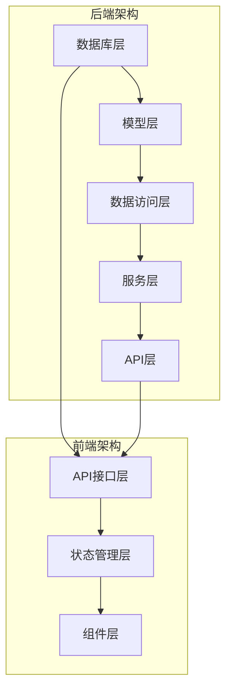
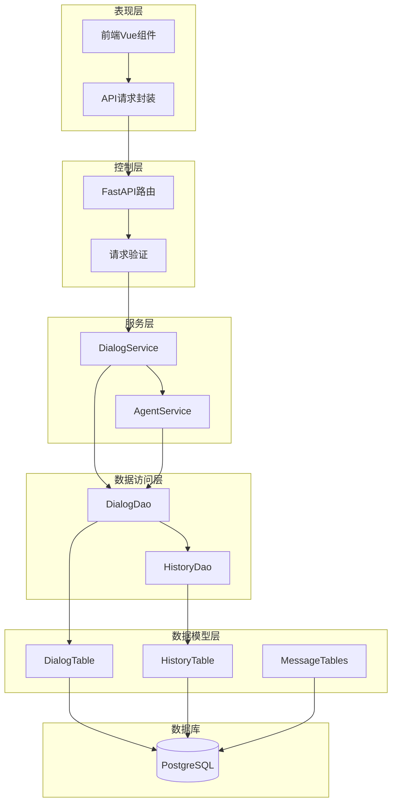
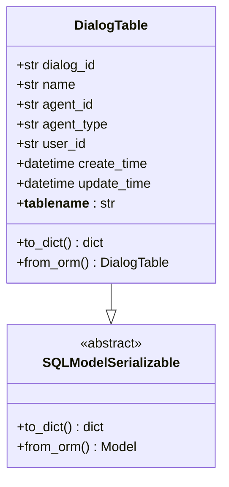
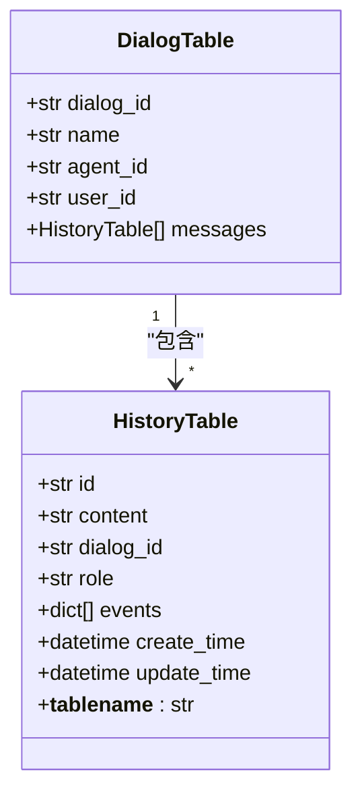
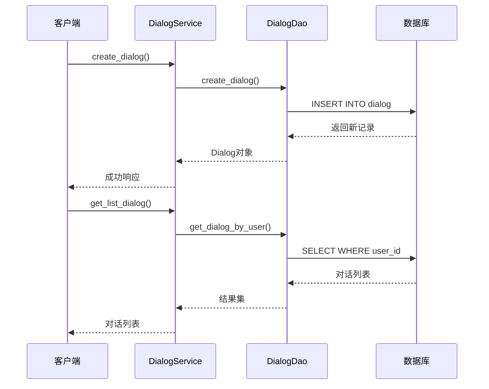
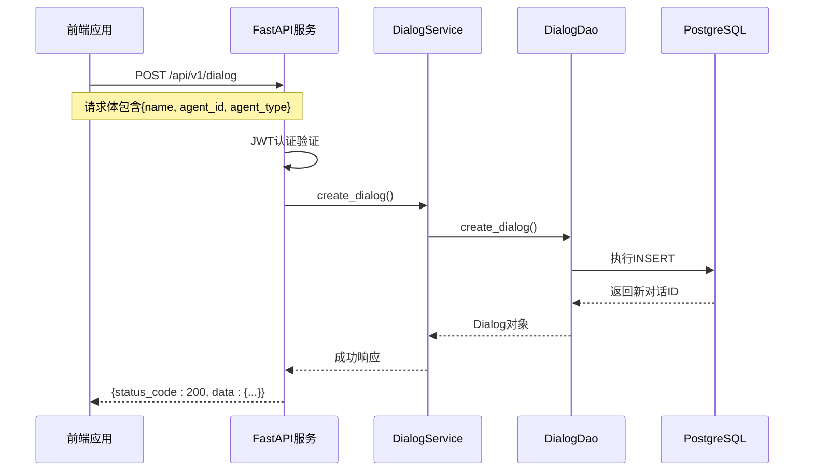
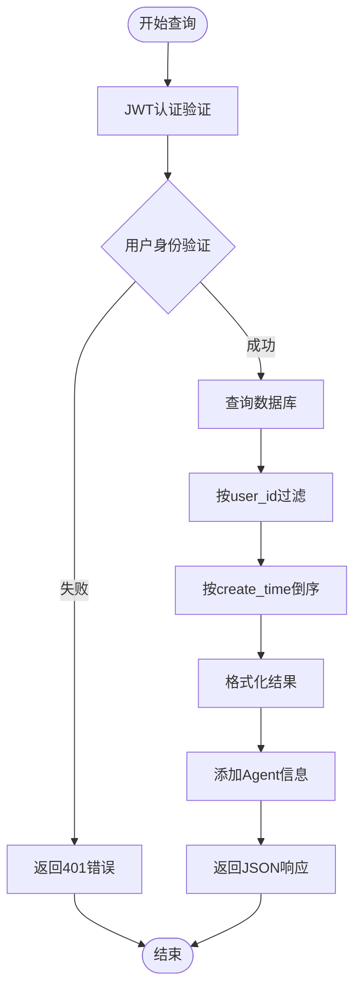
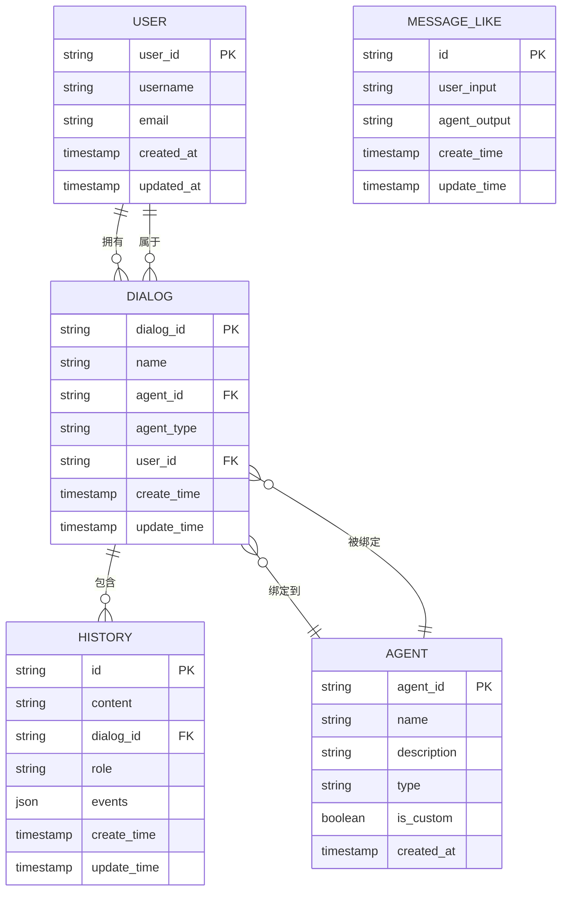

# 对话会话数据模型

## 目录
1. [简介](#简介)
2. [项目结构概览](#项目结构概览)
3. [核心数据模型](#核心数据模型)
4. [架构概览](#架构概览)
5. [详细组件分析](#详细组件分析)
6. [API接口设计](#api接口设计)
7. [数据关系映射](#数据关系映射)
8. [性能优化建议](#性能优化建议)
9. [故障排除指南](#故障排除指南)
10. [总结](#总结)

## 简介

对话会话数据模型是AgentChat系统的核心组成部分，负责管理用户与智能体之间的对话历史和交互记录。该模型采用分层架构设计，通过SQLModel ORM框架实现数据持久化，支持复杂的对话场景和个性化用户体验。

本文档详细阐述了Dialog模型的核心字段定义、与其他模型的关系、API操作流程以及性能优化策略，为开发者提供全面的技术参考。

## 项目结构概览

AgentChat项目采用模块化架构，对话会话相关的组件分布在以下目录结构中：



**图表来源**
- [src/backend/agentchat/database/models/dialog.py](https://github.com/Shy2593666979/AgentChat/tree/main/src/backend/agentchat/database/models/dialog.py#L1-L36)
- [src/backend/agentchat/api/v1/dialog.py](https://github.com/Shy2593666979/AgentChat/tree/main/src/backend/agentchat/api/v1/dialog.py#L1-L54)

**章节来源**
- [src/backend/agentchat/database/models/dialog.py](https://github.com/Shy2593666979/AgentChat/tree/main/src/backend/agentchat/database/models/dialog.py#L1-L36)
- [src/backend/agentchat/api/v1/dialog.py](https://github.com/Shy2593666979/AgentChat/tree/main/src/backend/agentchat/api/v1/dialog.py#L1-L54)

## 核心数据模型

### Dialog模型核心字段

Dialog模型作为对话容器，定义了以下关键字段：

| 字段名 | 类型 | 描述 | 约束条件 |
|--------|------|------|----------|
| dialog_id | str | 对话唯一标识符 | 主键，UUID格式 |
| name | str | 对话绑定的Agent名称 | 必填，描述性字段 |
| agent_id | str | 绑定的智能体ID | 外键，关联Agent表 |
| agent_type | str | 智能体类型 | 枚举值：Agent或MCPAgent |
| user_id | str | 用户ID | 外键，关联用户表 |
| create_time | datetime | 创建时间 | 自动设置，UTC时间戳 |
| update_time | datetime | 更新时间 | 自动更新，UTC时间戳 |

### 字段详细说明

#### dialog_id
- **类型**: UUID字符串
- **作用**: 唯一标识每个对话会话
- **生成方式**: 使用uuid4()生成全局唯一标识
- **业务意义**: 支持分布式系统中的对话追踪

#### name
- **类型**: 字符串
- **作用**: 显示在对话列表中的友好名称
- **业务意义**: 提供用户友好的对话标识

#### agent_id & agent_type
- **作用**: 建立对话与智能体的绑定关系
- **agent_id**: 指向具体智能体实例
- **agent_type**: 区分普通Agent和MCPAgent类型
- **业务意义**: 支持多种类型的智能体交互模式

#### user_id
- **作用**: 建立对话与用户的绑定关系
- **业务意义**: 实现个性化对话历史管理
- **安全考虑**: 用于权限验证和数据隔离

#### 时间戳字段
- **create_time**: 对话创建时的时间戳
- **update_time**: 最后一次更新的时间戳
- **自动维护**: 数据库触发器自动更新

**章节来源**
- [src/backend/agentchat/database/models/dialog.py](https://github.com/Shy2593666979/AgentChat/tree/main/src/backend/agentchat/database/models/dialog.py#L15-L35)

## 架构概览

对话会话系统采用经典的分层架构，确保数据一致性和业务逻辑清晰分离：



**图表来源**
- [src/backend/agentchat/api/v1/dialog.py](https://github.com/Shy2593666979/AgentChat/tree/main/src/backend/agentchat/api/v1/dialog.py#L1-L54)
- [src/backend/agentchat/api/services/dialog.py](https://github.com/Shy2593666979/AgentChat/tree/main/src/backend/agentchat/api/services/dialog.py#L1-L64)
- [src/backend/agentchat/database/dao/dialog.py](https://github.com/Shy2593666979/AgentChat/tree/main/src/backend/agentchat/database/dao/dialog.py#L1-L73)

## 详细组件分析

### 数据模型层

#### DialogTable类设计

DialogTable继承自SQLModelSerializable，实现了对话会话的核心数据结构：



**图表来源**
- [src/backend/agentchat/database/models/dialog.py](https://github.com/Shy2593666979/AgentChat/tree/main/src/backend/agentchat/database/models/dialog.py#L12-L35)

#### HistoryTable模型

HistoryTable作为对话消息的历史记录，与Dialog模型形成一对多关系：



**图表来源**
- [src/backend/agentchat/database/models/history.py](https://github.com/Shy2593666979/AgentChat/tree/main/src/backend/agentchat/database/models/history.py#L12-L36)

### 数据访问层

#### DialogDao类方法

DialogDao提供了完整的CRUD操作接口：



**图表来源**
- [src/backend/agentchat/api/services/dialog.py](https://github.com/Shy2593666979/AgentChat/tree/main/src/backend/agentchat/api/services/dialog.py#L11-L64)
- [src/backend/agentchat/database/dao/dialog.py](https://github.com/Shy2593666979/AgentChat/tree/main/src/backend/agentchat/database/dao/dialog.py#L14-L73)

### 服务层

#### DialogService业务逻辑

DialogService封装了对话会话的业务规则和流程控制：

| 方法名 | 功能描述 | 参数 | 返回值 |
|--------|----------|------|--------|
| create_dialog | 创建新的对话会话 | name, agent_id, agent_type, user_id | Dialog对象 |
| get_list_dialog | 获取用户的所有对话 | user_id | 对话列表 |
| select_dialog | 查询指定对话 | dialog_id | 对话详情 |
| delete_dialog | 删除对话会话 | dialog_id | 操作结果 |
| verify_user_permission | 权限验证 | dialog_id, user_id | 验证结果 |

**章节来源**
- [src/backend/agentchat/api/services/dialog.py](https://github.com/Shy2593666979/AgentChat/tree/main/src/backend/agentchat/api/services/dialog.py#L11-L64)

## API接口设计

### RESTful API规范

系统提供了标准的RESTful API接口，支持对话会话的完整生命周期管理：

#### 对话创建接口



**图表来源**
- [src/backend/agentchat/api/v1/dialog.py](https://github.com/Shy2593666979/AgentChat/tree/main/src/backend/agentchat/api/v1/dialog.py#L29-L39)

#### 对话列表查询

对话列表接口支持按用户ID过滤，并按创建时间倒序排列：



**图表来源**
- [src/backend/agentchat/api/v1/dialog.py](https://github.com/Shy2593666979/AgentChat/tree/main/src/backend/agentchat/api/v1/dialog.py#L13-L26)

### 请求响应格式

#### 创建对话请求格式

| 字段名 | 类型 | 必填 | 描述 |
|--------|------|------|------|
| name | string | 是 | 对话名称 |
| agent_id | string | 是 | 智能体ID |
| agent_type | string | 否 | 智能体类型，默认"Agent" |

#### 响应格式

成功的创建对话请求返回：
```json
{
  "status_code": 200,
  "message": "success",
  "data": {
    "dialog_id": "uuid_string",
    "name": "对话名称",
    "agent_id": "agent_uuid",
    "agent_type": "Agent",
    "user_id": "user_uuid",
    "create_time": "2024-01-01T12:00:00Z",
    "update_time": "2024-01-01T12:00:00Z"
  }
}
```

**章节来源**
- [src/backend/agentchat/schema/dialog.py](https://github.com/Shy2593666979/AgentChat/tree/main/src/backend/agentchat/schema/dialog.py#L5-L15)
- [src/backend/agentchat/api/v1/dialog.py](https://github.com/Shy2593666979/AgentChat/tree/main/src/backend/agentchat/api/v1/dialog.py#L29-L39)

## 数据关系映射

### 一对一和一对多关系

对话会话系统建立了清晰的数据关系模型：



**图表来源**
- [src/backend/agentchat/database/models/dialog.py](https://github.com/Shy2593666979/AgentChat/tree/main/src/backend/agentchat/database/models/dialog.py#L12-L35)
- [src/backend/agentchat/database/models/history.py](https://github.com/Shy2593666979/AgentChat/tree/main/src/backend/agentchat/database/models/history.py#L12-L36)

### 外键约束和级联操作

系统通过外键约束确保数据完整性：

| 外键字段 | 关联表 | 级联操作 | 业务含义 |
|----------|--------|----------|----------|
| user_id | user | RESTRICT | 用户删除时阻止对话删除 |
| agent_id | agent | SET NULL | 智能体删除时保留对话但断开连接 |
| dialog_id | dialog | CASCADE | 对话删除时自动删除相关历史记录 |

**章节来源**
- [src/backend/agentchat/database/dao/dialog.py](https://github.com/Shy2593666979/AgentChat/tree/main/src/backend/agentchat/database/dao/dialog.py#L52-L57)
- [src/backend/agentchat/database/dao/history.py](https://github.com/Shy2593666979/AgentChat/tree/main/src/backend/agentchat/database/dao/history.py#L42-L46)

## 性能优化建议

### 数据库索引策略

为了提升查询性能，建议在以下字段上建立索引：

| 表名 | 索引字段 | 索引类型 | 用途 |
|------|----------|----------|------|
| dialog | user_id | 单列索引 | 用户对话列表查询 |
| dialog | agent_id | 单列索引 | 智能体对话统计 |
| history | dialog_id | 单列索引 | 对话历史查询 |
| history | create_time | 单列索引 | 时间范围查询 |
| history | dialog_id, create_time | 复合索引 | 对话历史分页查询 |

### 分区策略

对于大规模部署，建议采用基于user_id的分区策略：

```sql
-- 基于user_id的范围分区
CREATE TABLE dialog_partitioned (
    dialog_id VARCHAR PRIMARY KEY,
    name VARCHAR,
    agent_id VARCHAR,
    agent_type VARCHAR,
    user_id VARCHAR,
    create_time TIMESTAMP,
    update_time TIMESTAMP
) PARTITION BY HASH(user_id);

-- 基于create_time的范围分区
CREATE TABLE history_partitioned (
    id VARCHAR PRIMARY KEY,
    content TEXT,
    dialog_id VARCHAR,
    role VARCHAR,
    events JSONB,
    create_time TIMESTAMP,
    update_time TIMESTAMP
) PARTITION BY RANGE (create_time);
```

### 查询优化技巧

#### 对话列表查询优化

```sql
-- 优化前：全表扫描
SELECT * FROM dialog WHERE user_id = ? ORDER BY create_time DESC;

-- 优化后：利用索引
EXPLAIN ANALYZE 
SELECT * FROM dialog 
WHERE user_id = ? 
ORDER BY create_time DESC 
LIMIT 50 OFFSET 0;
```

#### 历史记录查询优化

```sql
-- 利用复合索引优化分页查询
SELECT * FROM history 
WHERE dialog_id = ? 
ORDER BY create_time ASC 
LIMIT 100 OFFSET 0;
```

### 缓存策略

建议在以下场景实施缓存：

1. **对话列表缓存**: 用户对话列表可缓存30分钟
2. **智能体信息缓存**: Agent基本信息可缓存1小时
3. **热门对话缓存**: 访问频率高的对话可长期缓存

**章节来源**
- [src/backend/agentchat/database/dao/dialog.py](https://github.com/Shy2593666979/AgentChat/tree/main/src/backend/agentchat/database/dao/dialog.py#L30-L35)
- [src/backend/agentchat/database/dao/history.py](https://github.com/Shy2593666979/AgentChat/tree/main/src/backend/agentchat/database/dao/history.py#L21-L32)

## 故障排除指南

### 常见问题及解决方案

#### 对话创建失败

**问题症状**: 创建对话时返回500错误

**可能原因**:
1. 外键约束违反（不存在的agent_id）
2. 用户权限不足
3. 数据库连接异常

**排查步骤**:
```python
# 1. 验证agent_id是否存在
result = await DialogDao.check_dialog_iscustom(dialog_id)
if not result:
    raise ValueError("智能体不存在")

# 2. 验证用户权限
await DialogService.verify_user_permission(dialog_id, user_id)

# 3. 检查数据库连接状态
try:
    with session_getter() as session:
        session.execute("SELECT 1")
except Exception as e:
    logger.error(f"数据库连接失败: {e}")
```

#### 对话列表为空

**问题症状**: 查询用户对话列表时返回空数组

**可能原因**:
1. 用户ID不匹配
2. 对话已被删除
3. 查询条件错误

**解决方案**:
```python
# 添加调试日志
logger.info(f"查询用户对话列表: user_id={user_id}")
results = await DialogDao.get_dialog_by_user(user_id=user_id)
logger.info(f"查询结果数量: {len(results)}")
```

#### 历史记录丢失

**问题症状**: 对话历史记录不完整

**排查方法**:
1. 检查HistoryDao的删除操作
2. 验证外键约束设置
3. 检查数据库事务处理

**章节来源**
- [src/backend/agentchat/api/services/dialog.py](https://github.com/Shy2593666979/AgentChat/tree/main/src/backend/agentchat/api/services/dialog.py#L58-L64)
- [src/backend/agentchat/database/dao/dialog.py](https://github.com/Shy2593666979/AgentChat/tree/main/src/backend/agentchat/database/dao/dialog.py#L52-L57)

## 总结

对话会话数据模型是AgentChat系统的核心基础设施，通过精心设计的分层架构和数据关系，实现了高效、可靠、可扩展的对话管理功能。

### 关键特性

1. **数据完整性**: 通过外键约束和业务规则确保数据一致性
2. **性能优化**: 支持索引、分区和缓存策略
3. **安全性**: 实现用户权限验证和数据隔离
4. **可扩展性**: 模块化设计支持功能扩展

### 最佳实践

1. **索引设计**: 在高频查询字段上建立适当索引
2. **事务管理**: 正确处理数据库事务以保证数据一致性
3. **错误处理**: 实现完善的异常处理和日志记录
4. **性能监控**: 建立性能指标监控体系

该模型为构建高质量的对话系统奠定了坚实基础，支持未来的功能扩展和技术演进。
