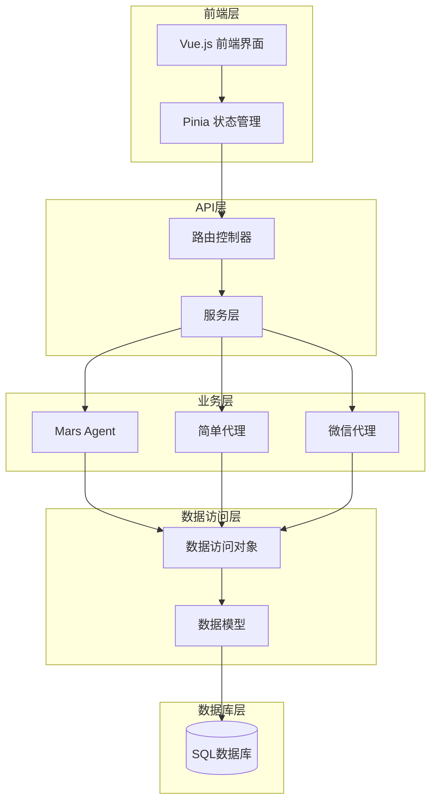
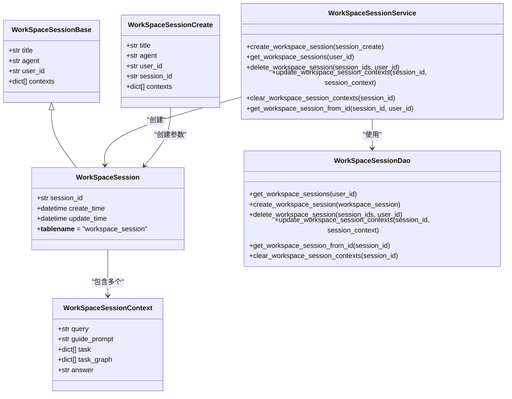
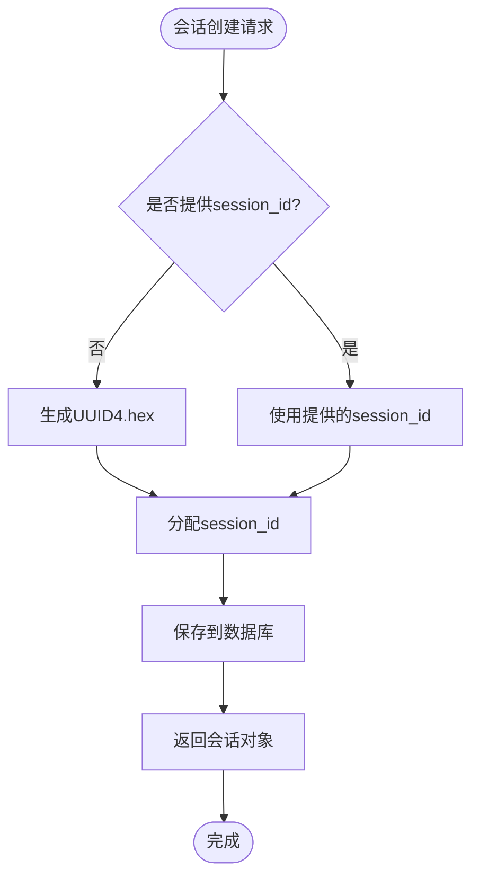
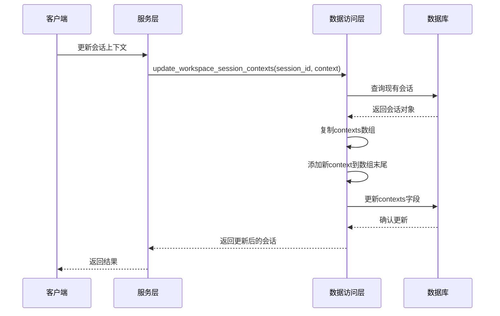
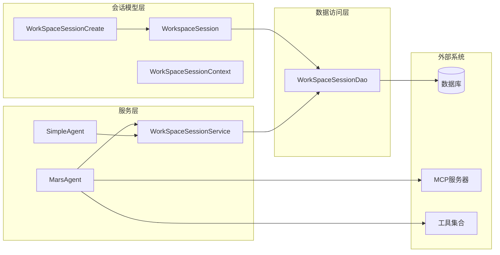

# 工作区会话模型

## 目录
1. [简介](#简介)
2. [项目结构](#项目结构)
3. [核心组件](#核心组件)
4. [架构概览](#架构概览)
5. [详细组件分析](#详细组件分析)
6. [依赖关系分析](#依赖关系分析)
7. [性能考虑](#性能考虑)
8. [故障排除指南](#故障排除指南)
9. [结论](#结论)

## 简介

WorkspaceSession模型是AgentChat系统中负责管理复杂工作流的核心组件，特别是在Mars Agent任务编排场景中发挥关键作用。该模型作为长期运行会话的状态容器，提供了完整的会话生命周期管理功能，包括会话创建、状态跟踪、上下文保存与恢复、以及自动清理机制。

该模型的设计充分考虑了现代AI应用的需求，支持多种智能体类型的工作会话管理，能够处理复杂的多步骤任务编排，并提供可靠的状态持久化和恢复能力。

## 项目结构

AgentChat项目采用分层架构设计，工作区会话模型分布在多个层次中：

**图表来源**
- [workspace.vue](https://github.com/Shy2593666979/AgentChat/src/frontend/src/pages/workspace/workspace.vue#L1-L50)
- [workspace_session.py](https://github.com/Shy2593666979/AgentChat/src/backend/agentchat/api/services/workspace_session.py#L1-L41)
- [mars_agent.py](https://github.com/Shy2593666979/AgentChat/src/backend/agentchat/services/mars/mars_agent.py#L1-L50)

**章节来源**
- [workspace_session.py](https://github.com/Shy2593666979/AgentChat/src/backend/agentchat/database/models/workspace_session.py#L1-L57)
- [workspace_session.py](https://github.com/Shy2593666979/AgentChat/src/backend/agentchat/database/dao/workspace_session.py#L1-L66)

## 核心组件

### WorkspaceSession 数据模型

WorkspaceSession模型是整个会话管理系统的核心数据结构，包含以下关键字段：

| 字段名 | 类型 | 描述 | 默认值 |
|--------|------|------|--------|
| session_id | str | 唯一会话标识符 | 自动生成UUID |
| title | str | 会话标题 | 必填字段 |
| agent | str | 使用的智能体类型 | 必填字段 |
| user_id | str | 用户标识符 | 必填字段 |
| contexts | List[dict] | 对话上下文数组 | [] |
| create_time | datetime | 创建时间 | 数据库默认CURRENT_TIMESTAMP |
| update_time | datetime | 最后更新时间 | 数据库默认CURRENT_TIMESTAMP |

### 会话状态管理

会话状态通过数据库层面的自动更新机制进行管理：
- **create_time**: 记录会话创建的确切时间戳
- **update_time**: 自动维护，每次会话更新时自动更新
- **contexts**: 结构化的对话上下文存储，支持复杂的工作流状态

**章节来源**
- [workspace_session.py](https://github.com/Shy2593666979/AgentChat/src/backend/agentchat/database/models/workspace_session.py#L22-L57)

## 架构概览

工作区会话模型采用三层架构设计，确保了良好的分离关注点和可扩展性：

**图表来源**
- [workspace_session.py](https://github.com/Shy2593666979/AgentChat/src/backend/agentchat/database/models/workspace_session.py#L11-L57)
- [workspace_session.py](https://github.com/Shy2593666979/AgentChat/src/backend/agentchat/api/services/workspace_session.py#L7-L41)
- [workspace_session.py](https://github.com/Shy2593666979/AgentChat/src/backend/agentchat/database/dao/workspace_session.py#L8-L66)

## 详细组件分析

### 会话ID生成策略

会话ID采用UUID v4算法生成，确保全局唯一性：

**图表来源**
- [workspace_session.py](https://github.com/Shy2593666979/AgentChat/src/backend/agentchat/database/dao/workspace_session.py#L18-L26)

### 上下文管理机制

会话上下文采用增量追加的方式进行管理，支持复杂的工作流状态保存：

**图表来源**
- [workspace_session.py](https://github.com/Shy2593666979/AgentChat/src/backend/agentchat/database/dao/workspace_session.py#L38-L48)

### 智能体集成

系统支持多种智能体类型的会话管理：

#### Mars Agent 会话管理
Mars Agent专门用于复杂任务编排，具有以下特点：
- 支持多工具链协同工作
- 提供推理模型和对话模型的双重处理能力
- 支持异步工具调用和流式响应
- 集成令牌使用统计记录

#### 简单代理会话管理
简单代理适用于常规对话场景：
- 专注于工具调用和MCP工具集成
- 支持插件函数和MCP服务器的动态配置
- 提供非阻塞的异步执行能力

**章节来源**
- [mars_agent.py](https://github.com/Shy2593666979/AgentChat/src/backend/agentchat/services/mars/mars_agent.py#L32-L193)
- [simple_agent.py](https://github.com/Shy2593666979/AgentChat/src/backend/agentchat/services/workspace/simple_agent.py#L35-L65)

### 前端会话管理

前端采用Vue.js框架实现会话管理界面，提供以下功能：

#### 会话列表管理
- 实时获取用户会话列表
- 按最后更新时间排序
- 支持会话搜索和过滤
- 提供会话状态可视化

#### 会话操作
- 一键创建新会话
- 会话删除确认机制
- 会话切换和导航
- 会话状态同步

**章节来源**
- [workspace.vue](https://github.com/Shy2593666979/AgentChat/src/frontend/src/pages/workspace/workspace.vue#L51-L130)
- [defaultPage.vue](https://github.com/Shy2593666979/AgentChat/src/frontend/src/pages/workspace/defaultPage/defaultPage.vue#L334-L366)

## 依赖关系分析

工作区会话模型与其他系统组件存在密切的依赖关系：

**图表来源**
- [workspace_session.py](https://github.com/Shy2593666979/AgentChat/src/backend/agentchat/api/services/workspace_session.py#L1-L6)
- [mars_agent.py](https://github.com/Shy2593666979/AgentChat/src/backend/agentchat/services/mars/mars_agent.py#L1-L20)

**章节来源**
- [workspace_session.py](https://github.com/Shy2593666979/AgentChat/src/backend/agentchat/database/models/workspace_session.py#L1-L57)
- [workspace_session.py](https://github.com/Shy2593666979/AgentChat/src/backend/agentchat/database/dao/workspace_session.py#L1-L66)

## 性能考虑

### 大规模会话管理优化

为了支持大规模会话管理，系统采用了以下优化策略：

#### 基于时间的自动清理机制
- **last_active字段利用**: 通过update_time字段实现会话活跃度监控
- **定期清理策略**: 基于会话最后活动时间进行批量清理
- **内存优化**: 只加载活跃会话到内存中

#### 状态持久化策略
- **增量更新**: 只更新变更的上下文部分，减少I/O开销
- **批量操作**: 支持批量会话操作，提高数据库效率
- **连接池管理**: 使用异步连接池优化数据库访问

#### 前端性能优化
- **虚拟滚动**: 大量会话列表的高效渲染
- **懒加载**: 按需加载会话详情和历史记录
- **状态缓存**: 使用Pinia进行状态持久化和缓存

### 并发处理优化

系统采用异步编程模型处理并发请求：
- **异步数据库操作**: 使用async/await模式避免阻塞
- **队列管理**: Mars Agent使用队列管理工具调用结果
- **事件驱动**: 基于事件的会话状态更新机制

## 故障排除指南

### 常见问题及解决方案

#### 会话创建失败
**症状**: 创建会话时返回错误
**可能原因**:
- 用户ID验证失败
- 数据库连接问题
- 会话ID冲突

**解决方案**:
1. 检查用户认证状态
2. 验证数据库连接
3. 查看日志获取具体错误信息

#### 会话上下文丢失
**症状**: 会话状态无法正确保存或恢复
**可能原因**:
- 数据库事务失败
- 上下文序列化问题
- 并发写入冲突

**解决方案**:
1. 检查数据库事务日志
2. 验证上下文数据格式
3. 实现重试机制

#### 性能问题
**症状**: 会话列表加载缓慢
**可能原因**:
- 数据库查询效率低
- 前端渲染性能瓶颈
- 内存泄漏

**解决方案**:
1. 优化数据库索引
2. 实现前端分页
3. 使用性能分析工具

**章节来源**
- [workspace_session.py](https://github.com/Shy2593666979/AgentChat/src/backend/agentchat/database/dao/workspace_session.py#L18-L26)
- [workspace_session.py](https://github.com/Shy2593666979/AgentChat/src/backend/agentchat/api/services/workspace_session.py#L10-L12)

## 结论

WorkspaceSession模型作为AgentChat系统的核心组件，成功实现了复杂工作流的会话管理需求。通过精心设计的架构和优化策略，该模型具备以下优势：

### 技术优势
- **高可用性**: 基于异步架构的可靠会话管理
- **可扩展性**: 支持多种智能体类型和工作流场景
- **性能优化**: 多层次的性能优化策略
- **数据安全**: 完整的会话状态保护机制

### 应用价值
- **Mars Agent任务编排**: 为复杂AI任务提供稳定的工作环境
- **多智能体协作**: 支持不同智能体间的无缝协作
- **用户体验**: 提供直观的会话管理和操作界面
- **系统集成**: 与MCP服务器和各种工具的良好集成

该模型的成功实施为构建现代化AI应用平台奠定了坚实基础，其设计理念和实现方案对类似系统具有重要的参考价值。
