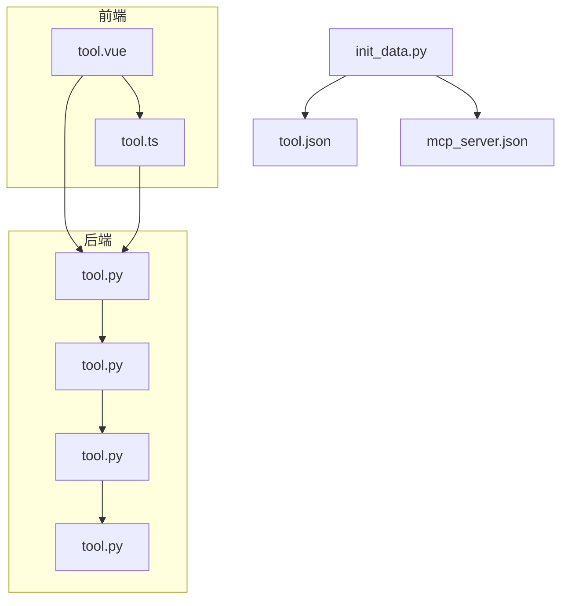
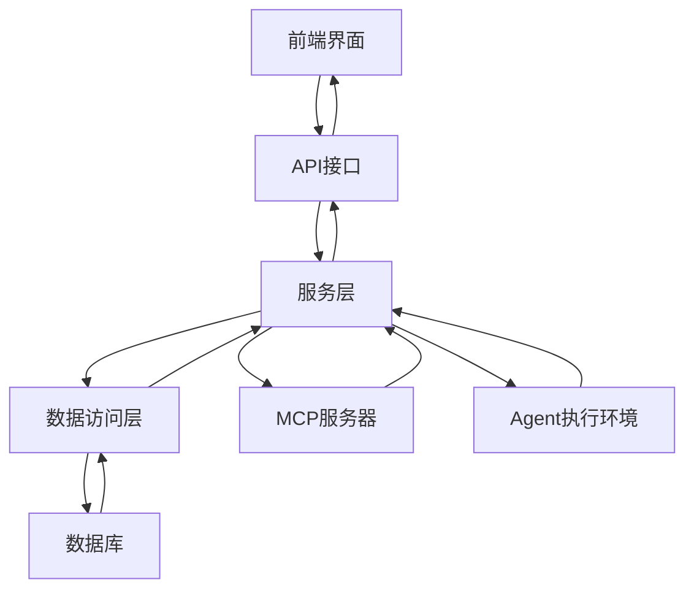
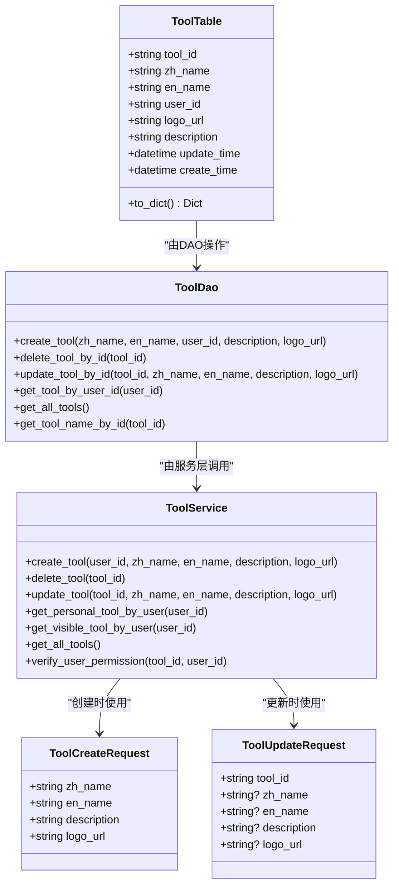
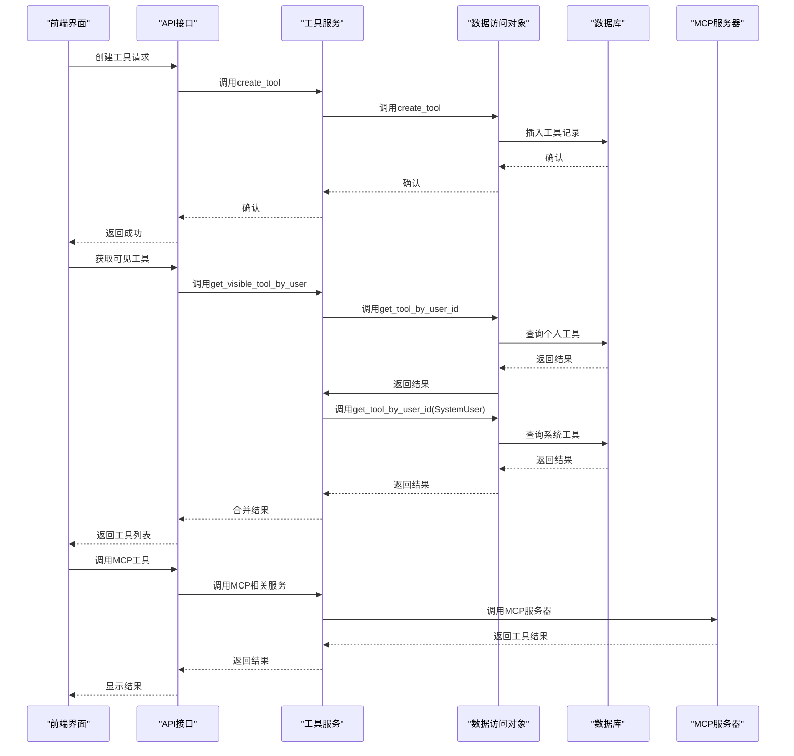
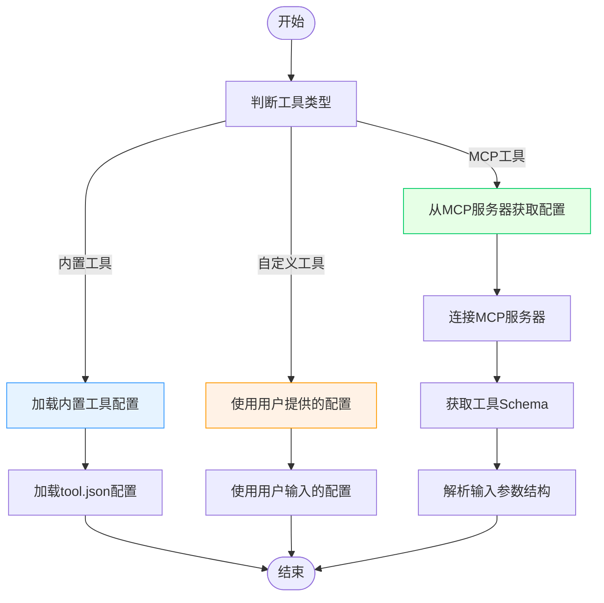

# 工具定义数据模型

## 目录
1. [简介](#简介)
2. [项目结构](#项目结构)
3. [核心组件](#核心组件)
4. [架构概述](#架构概述)
5. [详细组件分析](#详细组件分析)
6. [依赖分析](#依赖分析)
7. [性能考虑](#性能考虑)
8. [故障排除指南](#故障排除指南)
9. [结论](#结论)

## 简介
本文件全面介绍了AgentChat系统中的工具定义数据模型。该模型是系统的核心组成部分，用于管理各种类型的工具，包括内置工具、自定义工具和MCP（Model Context Protocol）工具。文档详细阐述了工具模型的字段组成、权限控制机制、配置差异以及工具调用流程。通过分析后端数据库模型、服务层逻辑和前端交互，本文档为开发人员和系统管理员提供了完整的工具管理视角，包括工具的创建、查询、更新和删除操作，以及如何将工具集成到Agent执行环境中。

## 项目结构
工具相关的代码分布在项目的多个目录中，形成了清晰的分层架构。后端数据库模型定义了工具的持久化结构，服务层处理业务逻辑，API层提供REST接口，而前端则实现了用户界面交互。



**图示来源**
- [tool.py](https://github.com/Shy2593666979/AgentChat/tree/main/src/backend/agentchat/database/models/tool.py#L1-L36)
- [tool.py](https://github.com/Shy2593666979/AgentChat/tree/main/src/backend/agentchat/api/services/tool.py#L1-L124)
- [tool.py](https://github.com/Shy2593666979/AgentChat/tree/main/src/backend/agentchat/database/dao/tool.py#L1-L69)
- [tool.py](https://github.com/Shy2593666979/AgentChat/tree/main/src/backend/agentchat/schema/tool.py#L1-L16)
- [tool.ts](https://github.com/Shy2593666979/AgentChat/tree/main/src/frontend/src/apis/tool.ts#L1-L79)
- [tool.vue](https://github.com/Shy2593666979/AgentChat/tree/main/src/frontend/src/pages/tool/tool.vue#L1-L200)
- [init_data.py](https://github.com/Shy2593666979/AgentChat/tree/main/src/backend/agentchat/database/init_data.py#L159-L169)
- [tool.json](https://github.com/Shy2593666979/AgentChat/tree/main/src/backend/agentchat/config/tool.json)
- [mcp_server.json](https://github.com/Shy2593666979/AgentChat/tree/main/src/backend/agentchat/config/mcp_server.json)

**本节来源**
- [tool.py](https://github.com/Shy2593666979/AgentChat/tree/main/src/backend/agentchat/database/models/tool.py#L1-L36)
- [tool.py](https://github.com/Shy2593666979/AgentChat/tree/main/src/backend/agentchat/api/services/tool.py#L1-L124)

## 核心组件
工具定义数据模型的核心由数据库模型、数据访问对象（DAO）、服务层和API接口组成。`ToolTable`类定义了工具的数据库结构，包含工具ID、中英文名称、用户ID、描述和创建时间等字段。`ToolDao`类提供了对工具数据的CRUD操作，而`ToolService`类则在DAO的基础上添加了业务逻辑和权限验证。API层通过FastAPI路由暴露这些功能，使前端能够通过HTTP请求与工具系统交互。

**本节来源**
- [tool.py](https://github.com/Shy2593666979/AgentChat/tree/main/src/backend/agentchat/database/models/tool.py#L1-L36)
- [tool.py](https://github.com/Shy2593666979/AgentChat/tree/main/src/backend/agentchat/database/dao/tool.py#L1-L69)
- [tool.py](https://github.com/Shy2593666979/AgentChat/tree/main/src/backend/agentchat/api/services/tool.py#L1-L124)
- [tool.py](https://github.com/Shy2593666979/AgentChat/tree/main/src/backend/agentchat/api/v1/tool.py#L1-L86)

## 架构概述
工具系统的架构遵循典型的分层模式，从数据库到前端形成了清晰的数据流。数据库层存储工具的元数据，DAO层提供数据访问接口，服务层处理业务逻辑，API层暴露REST接口，最后前端通过API与后端交互。



**图示来源**
- [tool.py](https://github.com/Shy2593666979/AgentChat/tree/main/src/backend/agentchat/database/models/tool.py#L1-L36)
- [tool.py](https://github.com/Shy2593666979/AgentChat/tree/main/src/backend/agentchat/api/services/tool.py#L1-L124)
- [tool.py](https://github.com/Shy2593666979/AgentChat/tree/main/src/backend/agentchat/database/dao/tool.py#L1-L69)
- [tool.py](https://github.com/Shy2593666979/AgentChat/tree/main/src/backend/agentchat/api/v1/tool.py#L1-L86)
- [mcp_manager.py](https://github.com/Shy2593666979/AgentChat/tree/main/src/backend/agentchat/services/mcp/manager.py#L1-L74)

## 详细组件分析

### 工具模型分析
工具模型是系统中管理各种功能工具的核心数据结构。它不仅存储了工具的基本信息，还通过与其他系统的集成支持了复杂的工具调用流程。

#### 工具模型类图


**图示来源**
- [tool.py](https://github.com/Shy2593666979/AgentChat/tree/main/src/backend/agentchat/database/models/tool.py#L1-L36)
- [tool.py](https://github.com/Shy2593666979/AgentChat/tree/main/src/backend/agentchat/database/dao/tool.py#L1-L69)
- [tool.py](https://github.com/Shy2593666979/AgentChat/tree/main/src/backend/agentchat/api/services/tool.py#L1-L124)
- [tool.py](https://github.com/Shy2593666979/AgentChat/tree/main/src/backend/agentchat/schema/tool.py#L1-L16)

#### 工具调用流程序列图


**图示来源**
- [tool.py](https://github.com/Shy2593666979/AgentChat/tree/main/src/backend/agentchat/api/v1/tool.py#L1-L86)
- [tool.py](https://github.com/Shy2593666979/AgentChat/tree/main/src/backend/agentchat/api/services/tool.py#L1-L124)
- [tool.py](https://github.com/Shy2593666979/AgentChat/tree/main/src/backend/agentchat/database/dao/tool.py#L1-L69)
- [mcp_server.py](https://github.com/Shy2593666979/AgentChat/tree/main/src/backend/agentchat/api/v1/mcp_server.py#L29-L60)
- [mcp_manager.py](https://github.com/Shy2593666979/AgentChat/tree/main/src/backend/agentchat/services/mcp/manager.py#L1-L74)

**本节来源**
- [tool.py](https://github.com/Shy2593666979/AgentChat/tree/main/src/backend/agentchat/database/models/tool.py#L1-L36)
- [tool.py](https://github.com/Shy2593666979/AgentChat/tree/main/src/backend/agentchat/database/dao/tool.py#L1-L69)
- [tool.py](https://github.com/Shy2593666979/AgentChat/tree/main/src/backend/agentchat/api/services/tool.py#L1-L124)
- [tool.py](https://github.com/Shy2593666979/AgentChat/tree/main/src/backend/agentchat/schema/tool.py#L1-L16)
- [tool.py](https://github.com/Shy2593666979/AgentChat/tree/main/src/backend/agentchat/api/v1/tool.py#L1-L86)

### 工具类型与配置分析
系统支持多种类型的工具，包括内置工具、自定义工具和MCP工具。每种工具类型有不同的配置方式和使用场景。

#### 工具类型配置流程图


**图示来源**
- [init_data.py](https://github.com/Shy2593666979/AgentChat/tree/main/src/backend/agentchat/database/init_data.py#L159-L169)
- [tool.json](https://github.com/Shy2593666979/AgentChat/tree/main/src/backend/agentchat/config/tool.json)
- [mcp_server.json](https://github.com/Shy2593666979/AgentChat/tree/main/src/backend/agentchat/config/mcp_server.json)
- [mcp_manager.py](https://github.com/Shy2593666979/AgentChat/tree/main/src/backend/agentchat/services/mcp/manager.py#L1-L74)
- [mcp_langchain.py](https://github.com/Shy2593666979/AgentChat/tree/main/src/backend/agentchat/services/mcp_openai/mcp_langchain.py#L34-L70)

**本节来源**
- [init_data.py](https://github.com/Shy2593666979/AgentChat/tree/main/src/backend/agentchat/database/init_data.py#L159-L169)
- [tool.json](https://github.com/Shy2593666979/AgentChat/tree/main/src/backend/agentchat/config/tool.json)
- [mcp_server.json](https://github.com/Shy2593666979/AgentChat/tree/main/src/backend/agentchat/config/mcp_server.json)
- [mcp_manager.py](https://github.com/Shy2593666979/AgentChat/tree/main/src/backend/agentchat/services/mcp/manager.py#L1-L74)

## 依赖分析
工具系统依赖于多个其他组件和服务，形成了复杂的依赖网络。这些依赖关系确保了工具能够被正确创建、管理和调用。

```mermaid
graph TD
ToolModel --> SQLModel : "继承"
ToolModel --> SQLModelSerializable : "继承"
ToolDao --> ToolTable : "操作"
ToolDao --> session_getter : "使用"
ToolService --> ToolDao : "调用"
ToolService --> SystemUser : "引用"
ToolService --> AdminUser : "引用"
ToolAPI --> ToolService : "调用"
ToolAPI --> get_login_user : "依赖"
FrontendAPI --> ToolAPI : "HTTP调用"
FrontendComponent --> FrontendAPI : "调用"
MCPManager --> MCPBaseConfig : "使用"
MCPManager --> MultiServerMCPClient : "使用"
ToolModel --> datetime : "使用"
ToolModel --> uuid4 : "使用"
ToolModel --> pytz : "使用"
```

**图示来源**
- [tool.py](https://github.com/Shy2593666979/AgentChat/tree/main/src/backend/agentchat/database/models/tool.py#L1-L36)
- [tool.py](https://github.com/Shy2593666979/AgentChat/tree/main/src/backend/agentchat/database/dao/tool.py#L1-L69)
- [tool.py](https://github.com/Shy2593666979/AgentChat/tree/main/src/backend/agentchat/api/services/tool.py#L1-L124)
- [tool.py](https://github.com/Shy2593666979/AgentChat/tree/main/src/backend/agentchat/api/v1/tool.py#L1-L86)
- [mcp_manager.py](https://github.com/Shy2593666979/AgentChat/tree/main/src/backend/agentchat/services/mcp/manager.py#L1-L74)
- [base.py](https://github.com/Shy2593666979/AgentChat/tree/main/src/backend/agentchat/database/models/base.py#L1-L43)

**本节来源**
- [tool.py](https://github.com/Shy2593666979/AgentChat/tree/main/src/backend/agentchat/database/models/tool.py#L1-L36)
- [tool.py](https://github.com/Shy2593666979/AgentChat/tree/main/src/backend/agentchat/database/dao/tool.py#L1-L69)
- [tool.py](https://github.com/Shy2593666979/AgentChat/tree/main/src/backend/agentchat/api/services/tool.py#L1-L124)
- [tool.py](https://github.com/Shy2593666979/AgentChat/tree/main/src/backend/agentchat/api/v1/tool.py#L1-L86)
- [mcp_manager.py](https://github.com/Shy2593666979/AgentChat/tree/main/src/backend/agentchat/services/mcp/manager.py#L1-L74)

## 性能考虑
为了确保工具系统的高性能，需要考虑以下几个方面：

1. **数据库索引**：在`tool`表的`user_id`和`tool_id`字段上建立索引，以加快查询速度。
2. **缓存机制**：对于频繁访问的工具列表，可以使用Redis等缓存系统来减少数据库查询。
3. **批量操作**：在处理大量工具数据时，使用批量插入和更新操作，减少数据库交互次数。
4. **异步处理**：对于耗时的操作，如调用外部MCP服务器，使用异步处理以避免阻塞主线程。
5. **连接池**：使用数据库连接池来管理数据库连接，提高连接复用率。

**本节来源**
- [tool.py](https://github.com/Shy2593666979/AgentChat/tree/main/src/backend/agentchat/database/models/tool.py#L1-L36)
- [tool.py](https://github.com/Shy2593666979/AgentChat/tree/main/src/backend/agentchat/database/dao/tool.py#L1-L69)

## 故障排除指南
在使用工具系统时可能会遇到一些常见问题，以下是故障排除建议：

1. **工具创建失败**：检查用户权限和输入参数是否符合要求，特别是中英文名称的长度限制。
2. **工具调用超时**：检查MCP服务器的网络连接和响应时间，适当增加超时设置。
3. **权限错误**：确认用户ID与工具的创建者匹配，或用户具有管理员权限。
4. **配置加载失败**：检查`tool.json`和`mcp_server.json`文件的路径和格式是否正确。
5. **前端显示异常**：检查API返回的数据结构是否与前端期望的格式匹配。

**本节来源**
- [tool.py](https://github.com/Shy2593666979/AgentChat/tree/main/src/backend/agentchat/api/services/tool.py#L1-L124)
- [tool.py](https://github.com/Shy2593666979/AgentChat/tree/main/src/backend/agentchat/database/dao/tool.py#L1-L69)
- [tool.py](https://github.com/Shy2593666979/AgentChat/tree/main/src/backend/agentchat/api/v1/tool.py#L1-L86)

## 结论
工具定义数据模型是AgentChat系统的核心组成部分，它通过清晰的分层架构和完善的API接口，实现了对各种类型工具的统一管理。模型支持内置工具、自定义工具和MCP工具，通过用户ID和权限控制机制实现了工具的私有化和共享。系统通过异步处理和缓存机制确保了高性能，同时提供了详细的错误处理和日志记录功能。未来可以进一步优化索引策略和缓存机制，以支持更大规模的工具管理和更复杂的调用场景。
