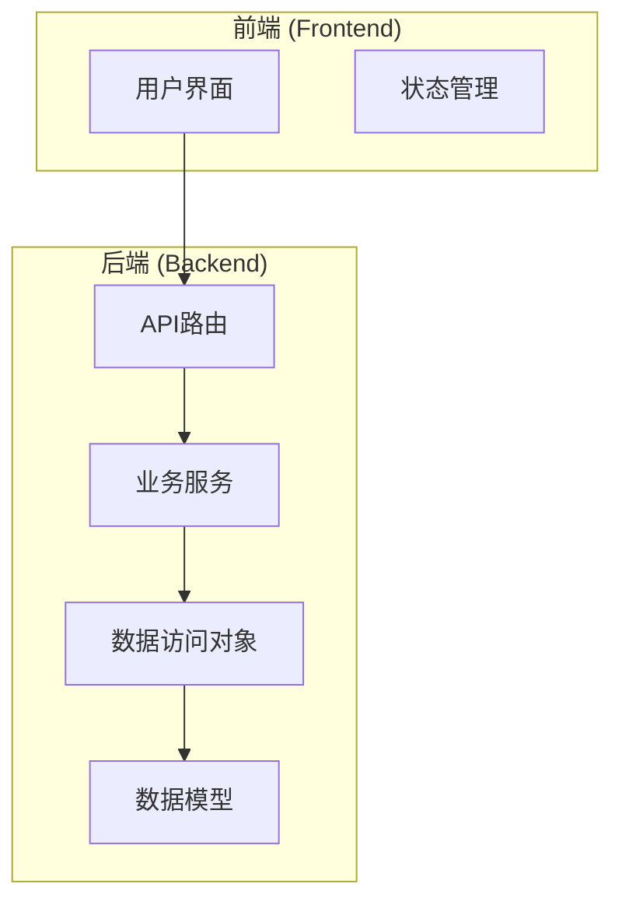
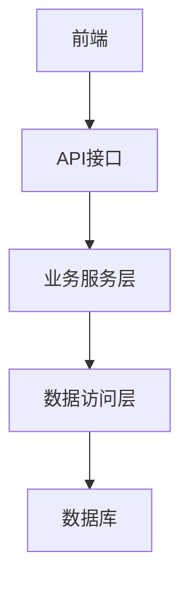
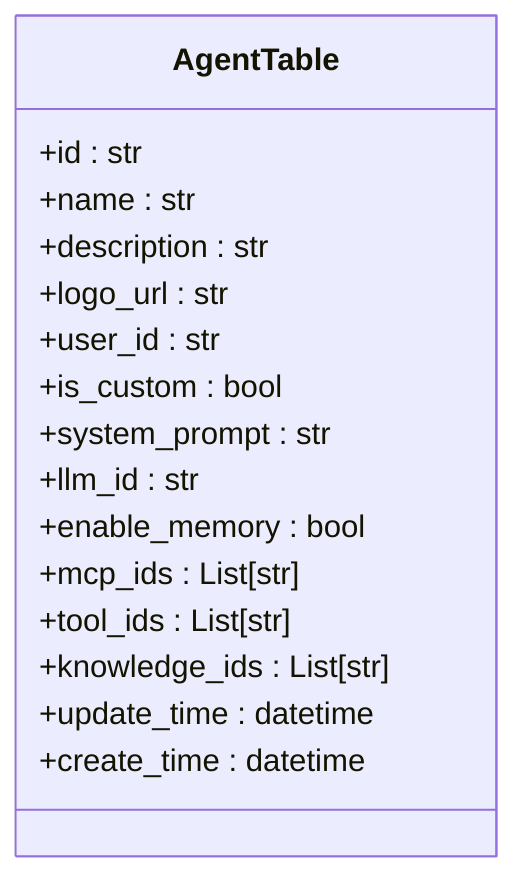
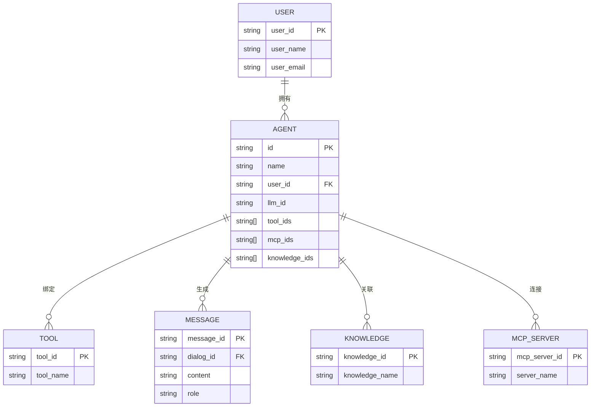
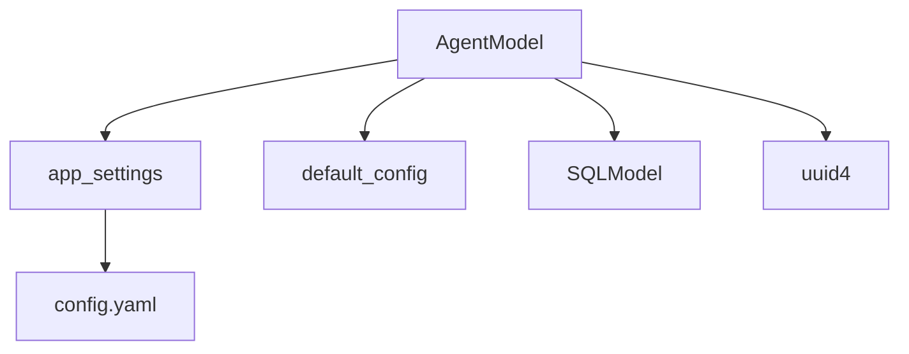

# 智能体数据模型

## 目录
1. [简介](#简介)
2. [项目结构](#项目结构)
3. [核心组件](#核心组件)
4. [架构概述](#架构概述)
5. [详细组件分析](#详细组件分析)
6. [依赖分析](#依赖分析)
7. [性能考虑](#性能考虑)
8. [故障排除指南](#故障排除指南)
9. [结论](#结论)
10. [附录](#附录)（如有必要）

## 简介
本文档详细阐述了AgentChat项目中的智能体（Agent）数据模型。该模型是系统的核心实体，代表了可配置的AI智能体实例，能够与用户交互、调用工具并执行任务。文档将深入解析Agent模型的各个字段定义、技术实现、业务用途以及与其他实体的关系。

## 项目结构
Agent模型的实现分布在项目的多个层级中，遵循典型的分层架构。核心数据定义位于`database/models`目录，数据访问操作在`database/dao`目录，API请求的输入输出规范在`schema`目录，而业务逻辑则在`services`和`api/v1`目录中处理。

**Diagram sources**
- [agent.py](https://github.com/Shy2593666979/AgentChat/src/backend/agentchat/database/models/agent.py)
- [agent_dao.py](https://github.com/Shy2593666979/AgentChat/src/backend/agentchat/database/dao/agent.py)

**Section sources**
- [agent.py](https://github.com/Shy2593666979/AgentChat/src/backend/agentchat/database/models/agent.py)
- [agent_dao.py](https://github.com/Shy2593666979/AgentChat/src/backend/agentchat/database/dao/agent.py)

## 核心组件
智能体数据模型的核心在于`AgentTable`类，它定义了智能体的所有属性和行为。该模型通过SQLModel与数据库交互，支持JSON格式的复杂字段，并通过DAO层提供完整的CRUD操作。

**Section sources**
- [agent.py](https://github.com/Shy2593666979/AgentChat/src/backend/agentchat/database/models/agent.py)
- [agent_dao.py](https://github.com/Shy2593666979/AgentChat/src/backend/agentchat/database/dao/agent.py)

## 架构概述
系统采用分层架构，将数据模型、数据访问、业务逻辑和API接口清晰分离。这种设计提高了代码的可维护性和可测试性。

**Diagram sources**
- [agent.py](https://github.com/Shy2593666979/AgentChat/src/backend/agentchat/database/models/agent.py)
- [agent_dao.py](https://github.com/Shy2593666979/AgentChat/src/backend/agentchat/database/dao/agent.py)

## 详细组件分析

### Agent模型字段分析
`AgentTable`模型定义了智能体的所有持久化属性。

#### 字段定义与业务用途

**Diagram sources**
- [agent.py](https://github.com/Shy2593666979/AgentChat/src/backend/agentchat/database/models/agent.py)

**Section sources**
- [agent.py](https://github.com/Shy2593666979/AgentChat/src/backend/agentchat/database/models/agent.py)

#### 字段技术实现
- **name**: 智能体的名称，字符串类型，不能为空。
- **description**: 智能体的描述，字符串类型，用于说明其功能。
- **config**: 一个JSON格式的字段，用于存储智能体的动态配置。在代码中，`mcp_ids`、`tool_ids`和`knowledge_ids`等列表字段都存储为JSON，这使得可以灵活地存储和查询复杂的数据结构。
- **prompt**: 系统提示词（`system_prompt`），定义了智能体的行为准则和角色。
- **llm_config**: 通过`llm_id`字段关联到具体的LLM模型配置，实现了模型的动态绑定。
- **tool_ids**: 存储为JSON的字符串列表，记录了该智能体可以调用的工具ID，实现了智能体与工具的多对多关系。
- **user_id**: 外键，关联到`UserTable`，标识了智能体的拥有者。

### Agent与User、Tool、Message的关系分析
智能体模型通过外键和关联字段与其他核心实体建立关系。

**Diagram sources**
- [agent.py](https://github.com/Shy2593666979/AgentChat/src/backend/agentchat/database/models/agent.py)
- [user.py](https://github.com/Shy2593666979/AgentChat/src/backend/agentchat/database/models/user.py)
- [tool.py](https://github.com/Shy2593666979/AgentChat/src/backend/agentchat/database/models/tool.py)

**Section sources**
- [agent.py](https://github.com/Shy2593666979/AgentChat/src/backend/agentchat/database/models/agent.py)

## 依赖分析
Agent模型依赖于多个外部配置和核心服务。

**Diagram sources**
- [agent.py](https://github.com/Shy2593666979/AgentChat/src/backend/agentchat/database/models/agent.py)
- [settings.py](https://github.com/Shy2593666979/AgentChat/src/backend/agentchat/settings.py)
- [config.yaml](https://github.com/Shy2593666979/AgentChat/src/backend/agentchat/config.yaml)

**Section sources**
- [agent.py](https://github.com/Shy2593666979/AgentChat/src/backend/agentchat/database/models/agent.py)
- [settings.py](https://github.com/Shy2593666979/AgentChat/src/backend/agentchat/settings.py)

## 性能考虑
- **索引**: `user_id`字段被设置为索引，确保根据用户ID查询其所有智能体时具有高性能。
- **默认值**: 许多字段（如`logo_url`、`enable_memory`）都设置了默认值，减少了数据库的空值检查，并确保了数据的一致性。
- **时间戳**: `create_time`和`update_time`字段由数据库自动管理，保证了时间数据的准确性和一致性，避免了应用层时钟不同步的问题。

## 故障排除指南
- **创建失败**: 检查`name`是否重复，可通过`check_repeat_name`方法验证。
- **权限错误**: 确保操作的`user_id`与智能体的`user_id`匹配。
- **配置丢失**: 确认`config.yaml`文件已正确加载，`app_settings`已初始化。

**Section sources**
- [agent_dao.py](https://github.com/Shy2593666979/AgentChat/src/backend/agentchat/database/dao/agent.py)
- [settings.py](https://github.com/Shy2593666979/AgentChat/src/backend/agentchat/settings.py)

## 结论
Agent模型是AgentChat系统的核心，它通过清晰的字段定义、灵活的JSON配置和严谨的分层架构，实现了智能体的可配置化和可扩展性。理解其数据结构和关系对于系统的开发和维护至关重要。
