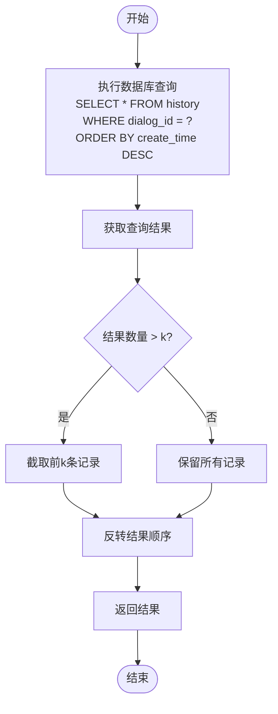

# 消息记录数据模型

## 目录
1. [引言](#引言)
2. [核心数据结构](#核心数据结构)
3. [字段语义与技术细节](#字段语义与技术细节)
4. [与对话模型的关联](#与对话模型的关联)
5. [文本存储与Token计数](#文本存储与token计数)
6. [大规模存储性能挑战](#大规模存储性能挑战)
7. [DAO层实现与查询机制](#dao层实现与查询机制)
8. [索引优化建议](#索引优化建议)
9. [结论](#结论)

## 引言
在AgentChat系统中，消息记录是对话历史的基本单元，承载着用户与AI代理之间的交互内容。本文件深入阐述Message模型的设计与实现，重点分析其作为对话历史基本单元的重要性，以及如何通过`dialog_id`与Dialog模型建立强关联。我们将探讨`content`字段的文本存储策略、`token_count`的计算时机与用途（如成本统计），并分析大规模消息存储下的性能挑战。结合DAO层实现，说明分页查询、按对话加载历史消息的实现方式，并提供索引优化建议。

## 核心数据结构
消息记录在系统中主要通过`HistoryTable`类来表示，该类定义了消息的核心属性和行为。`HistoryTable`继承自`SQLModelSerializable`，并映射到数据库中的`history`表。每个消息实例都包含角色、内容、对话ID、事件信息以及创建和更新时间戳等关键字段。

```mermaid
classDiagram
class HistoryTable {
+str id
+str content
+str dialog_id
+str role
+List[dict] events
+Optional[datetime] update_time
+Optional[datetime] create_time
+__tablename__ : str
}
HistoryTable : id : str
HistoryTable : content : str
HistoryTable : dialog_id : str
HistoryTable : role : str
HistoryTable : events : List[dict]
HistoryTable : update_time : Optional[datetime]
HistoryTable : create_time : Optional[datetime]
HistoryTable : __tablename__ : str
```

**图示来源**
- [history.py](https://github.com/Shy2593666979/AgentChat/tree/main/src/backend/agentchat/database/models/history.py#L11-L36)

**本节来源**
- [history.py](https://github.com/Shy2593666979/AgentChat/tree/main/src/backend/agentchat/database/models/history.py#L11-L36)

## 字段语义与技术细节
### 角色字段 (role)
`role`字段用于标识消息的发送者类型，其值限定为"assistant"、"system"或"user"三种字面量之一。这一设计确保了消息来源的明确性，便于后续处理和展示。在服务层，通过常量`Assistant_Role`和`User_Role`来引用这些值，提高了代码的可读性和维护性。

### 内容字段 (content)
`content`字段存储消息的实际文本内容，使用`Text`类型进行数据库列定义，支持大文本存储。该字段被设计为可变长度文本，能够容纳用户输入和AI生成的长篇回复。在应用层面，内容字段直接映射到LangChain框架中的`BaseMessage`对象，实现了与外部组件的无缝集成。

### 对话ID字段 (dialog_id)
`dialog_id`字段是消息模型与对话模型建立关联的关键。每个消息都必须归属于一个特定的对话，通过`dialog_id`外键引用`dialog`表的主键。这种设计实现了消息的组织化存储，使得按对话查询历史记录成为可能。

### 创建时间字段 (created_at)
`create_time`字段记录消息的创建时间，使用`DateTime`类型存储，并设置了数据库级别的默认值`CURRENT_TIMESTAMP`。该字段对于实现时间序列查询、按时间排序消息历史等功能至关重要。同时，它也是计算对话活跃度、统计用户行为等分析任务的基础数据。

## 与对话模型的关联
消息模型与对话模型之间存在明确的一对多关系，即一个对话可以包含多条消息，而每条消息只能属于一个对话。这种关系通过`HistoryTable`中的`dialog_id`字段与`DialogTable`中的`dialog_id`主键建立。


**图示来源**
- [history.py](https://github.com/Shy2593666979/AgentChat/tree/main/src/backend/agentchat/database/models/history.py#L11-L36)
- [dialog.py](https://github.com/Shy2593666979/AgentChat/tree/main/src/backend/agentchat/database/models/dialog.py#L11-L36)

**本节来源**
- [history.py](https://github.com/Shy2593666979/AgentChat/tree/main/src/backend/agentchat/database/models/history.py#L11-L36)
- [dialog.py](https://github.com/Shy2593666979/AgentChat/tree/main/src/backend/agentchat/database/models/dialog.py#L11-L36)

## 文本存储与Token计数
### 文本存储策略
`content`字段采用`Text`类型存储，能够支持大容量文本内容。数据库层面通过`sa_column=Column(Text)`配置，确保了对长文本的良好支持。这种设计允许系统处理复杂的对话内容，包括代码片段、长篇回答等。

### Token计数的计算时机与用途
虽然当前代码中未直接体现`token_count`字段，但其计算逻辑隐含在消息处理流程中。通常，Token计数会在消息创建时或AI生成响应后进行计算，主要用于成本统计和资源管理。例如，在调用LLM API时，可以根据输入和输出的Token数量来计算服务成本。此外，Token计数还可用于限制单次请求的长度，防止超出模型的最大上下文窗口。

## 大规模存储性能挑战
随着系统使用时间的增长，消息表将积累大量数据，可能达到数百万甚至更多记录。这带来了以下几个主要性能挑战：
1. **查询性能下降**：全表扫描或复杂查询的执行时间会显著增加。
2. **索引维护成本**：大型表的索引更新和维护需要更多资源。
3. **存储空间压力**：大量文本数据会快速消耗存储空间。
4. **备份与恢复时间**：数据库备份和恢复操作的时间会大幅延长。

为应对这些挑战，系统采用了分页查询和按对话加载的策略，避免一次性加载过多数据。

## DAO层实现与查询机制
### 分页查询实现
DAO层通过`select_history_from_time`方法实现了基于时间的分页查询。该方法接收`dialog_id`和`k`参数，返回指定对话的最近`k`条消息。查询结果首先按创建时间降序排列，然后截取前`k`条记录，最后反转顺序以保持从旧到新的时间序列。



**图示来源**
- [history.py](https://github.com/Shy2593666979/AgentChat/tree/main/src/backend/agentchat/database/dao/history.py#L21-L32)

**本节来源**
- [history.py](https://github.com/Shy2593666979/AgentChat/tree/main/src/backend/agentchat/database/dao/history.py#L21-L32)

### 按对话加载历史消息
服务层的`get_dialog_history`方法提供了按对话加载完整历史消息的功能。该方法调用DAO层的对应实现，返回指定对话的所有消息记录，并按创建时间升序排列，确保消息的时序正确性。

## 索引优化建议
为了优化大规模消息存储下的查询性能，建议在以下字段上建立复合索引：
- **(dialog_id, create_time)**：此复合索引能显著加速按对话ID和时间范围查询消息的操作。由于大多数查询都是针对特定对话的历史记录，且通常需要按时间排序，该索引能有效减少查询扫描的数据量。
- **create_time**：单独在创建时间字段上建立索引，有助于全局时间序列分析和统计查询。

```sql
-- 建议的索引创建语句
CREATE INDEX idx_dialog_time ON history (dialog_id, create_time DESC);
CREATE INDEX idx_create_time ON history (create_time DESC);
```

这些索引将大大提高`select_history_from_time`和`get_dialog_history`等关键查询的性能，特别是在数据量庞大的情况下。

## 结论
Message模型作为AgentChat系统中对话历史的基本单元，其设计充分考虑了功能性、性能和可扩展性。通过`dialog_id`与Dialog模型建立的强关联，实现了消息的组织化存储和高效查询。`content`字段的文本存储策略支持大容量内容，而潜在的Token计数机制为成本统计和资源管理提供了基础。面对大规模存储的性能挑战，系统通过分页查询和按对话加载的策略进行应对，并建议通过复合索引进一步优化查询性能。整体设计体现了良好的数据建模实践，为系统的稳定运行和未来发展奠定了坚实基础。
