# 用户数据模型

## 目录
1. [简介](#简介)
2. [项目结构](#项目结构)
3. [核心组件](#核心组件)
4. [架构概览](#架构概览)
5. [详细组件分析](#详细组件分析)
6. [依赖关系分析](#依赖关系分析)
7. [性能考虑](#性能考虑)
8. [故障排除指南](#故障排除指南)
9. [结论](#结论)

## 简介

本文档详细描述了AgentChat项目中的用户数据模型实现，重点分析User模型的结构设计、字段定义、外键关系以及在权限控制系统中的作用。该系统采用SQLModel框架构建，提供了完整的用户管理功能，包括用户认证、权限控制、数据序列化等核心特性。

## 项目结构

AgentChat项目采用分层架构设计，用户数据模型分布在多个模块中：

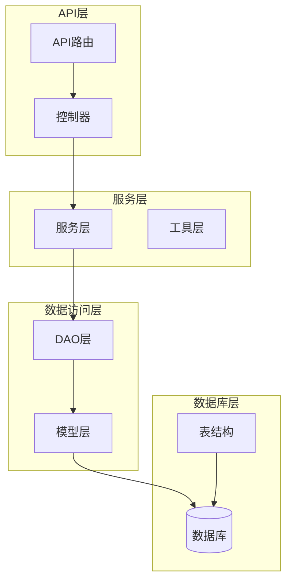

**图表来源**
- [user.py](https://github.com/Shy2593666979/AgentChat/tree/main/src/backend/agentchat/database/models/user.py#L18-L35)
- [user.py](https://github.com/Shy2593666979/AgentChat/tree/main/src/backend/agentchat/database/dao/user.py#L7-L34)

**章节来源**
- [user.py](https://github.com/Shy2593666979/AgentChat/tree/main/src/backend/agentchat/database/models/user.py#L1-L111)
- [base.py](https://github.com/Shy2593666979/AgentChat/tree/main/src/backend/agentchat/database/models/base.py#L1-L43)

## 核心组件

### UserTable模型定义

UserTable是系统中的核心用户实体模型，继承自SQLModelSerializable基类，提供了完整的用户数据结构和序列化功能。

#### 主要字段定义

| 字段名 | 数据类型 | 约束条件 | 业务含义 | 默认值 |
|--------|----------|----------|----------|--------|
| user_id | str | 主键，非空 | 用户唯一标识符 | 自动生成UUID |
| user_name | str | 唯一索引，非空 | 用户名 | - |
| user_email | str | 可选 | 用户邮箱 | None |
| user_avatar | str | - | 用户头像URL | - |
| user_description | str | - | 用户个人描述 | "该用户很懒，没有留下一片云彩" |
| user_password | str | - | 加密后的用户密码 | - |
| delete | bool | 默认值False | 用户是否已删除 | False |
| create_time | datetime | 索引，服务器默认值 | 用户创建时间 | CURRENT_TIMESTAMP |
| update_time | datetime | 索引，服务器默认值 | 最后更新时间 | CURRENT_TIMESTAMP |

#### 字段验证机制

系统实现了严格的字段验证机制，确保数据完整性：

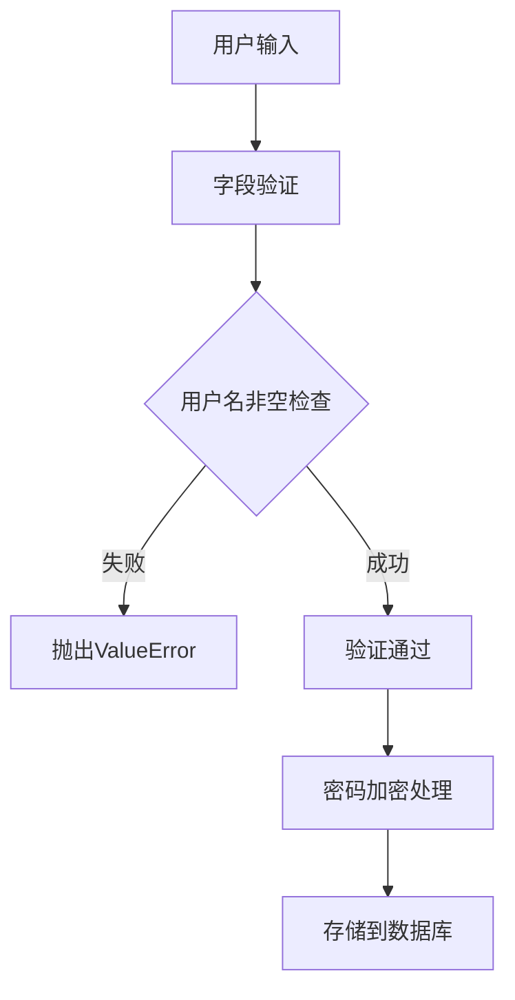

**图表来源**
- [user.py](https://github.com/Shy2593666979/AgentChat/tree/main/src/backend/agentchat/database/models/user.py#L36-L41)

**章节来源**
- [user.py](https://github.com/Shy2593666979/AgentChat/tree/main/src/backend/agentchat/database/models/user.py#L18-L35)

## 架构概览

### 用户模型层次结构

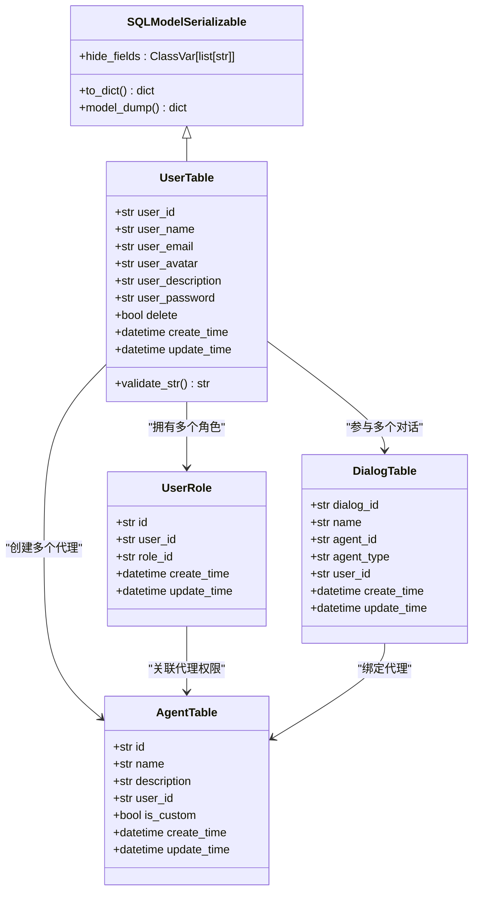

**图表来源**
- [base.py](https://github.com/Shy2593666979/AgentChat/tree/main/src/backend/agentchat/database/models/base.py#L28-L42)
- [user.py](https://github.com/Shy2593666979/AgentChat/tree/main/src/backend/agentchat/database/models/user.py#L18-L35)
- [user_role.py](https://github.com/Shy2593666979/AgentChat/tree/main/src/backend/agentchat/database/models/user_role.py#L23-L26)
- [agent.py](https://github.com/Shy2593666979/AgentChat/tree/main/src/backend/agentchat/database/models/agent.py#L11-L25)
- [dialog.py](https://github.com/Shy2593666979/AgentChat/tree/main/src/backend/agentchat/database/models/dialog.py#L12-L27)

### 外键关系设计

系统通过外键关系建立了用户与其他实体之间的关联：

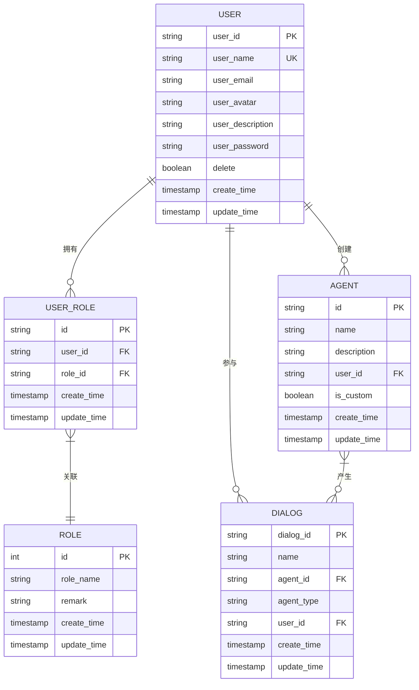

**图表来源**
- [user.py](https://github.com/Shy2593666979/AgentChat/tree/main/src/backend/agentchat/database/models/user.py#L18-L35)
- [user_role.py](https://github.com/Shy2593666979/AgentChat/tree/main/src/backend/agentchat/database/models/user_role.py#L10-L26)
- [agent.py](https://github.com/Shy2593666979/AgentChat/tree/main/src/backend/agentchat/database/models/agent.py#L14-L18)
- [dialog.py](https://github.com/Shy2593666979/AgentChat/tree/main/src/backend/agentchat/database/models/dialog.py#L15-L19)

**章节来源**
- [user_role.py](https://github.com/Shy2593666979/AgentChat/tree/main/src/backend/agentchat/database/models/user_role.py#L10-L26)
- [agent.py](https://github.com/Shy2593666979/AgentChat/tree/main/src/backend/agentchat/database/models/agent.py#L14-L25)
- [dialog.py](https://github.com/Shy2593666979/AgentChat/tree/main/src/backend/agentchat/database/models/dialog.py#L15-L27)

## 详细组件分析

### SQLModelSerializable基类

SQLModelSerializable是所有数据模型的基类，提供了统一的序列化和数据处理功能：

#### 序列化机制

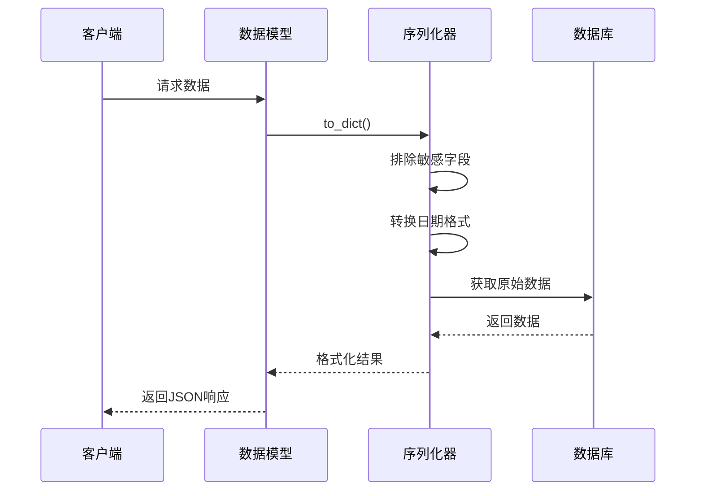

**图表来源**
- [base.py](https://github.com/Shy2593666979/AgentChat/tree/main/src/backend/agentchat/database/models/base.py#L34-L42)

#### 敏感字段过滤机制

系统通过hide_fields类变量实现敏感字段的自动过滤：

| 过滤字段 | 类型 | 用途 | 安全级别 |
|----------|------|------|----------|
| api_key | str | API密钥 | 高 |
| user_password | str | 用户密码 | 极高 |
| secret_token | str | 秘密令牌 | 高 |

**章节来源**
- [base.py](https://github.com/Shy2593666979/AgentChat/tree/main/src/backend/agentchat/database/models/base.py#L28-L42)

### 用户认证与密码管理

#### 密码加密流程

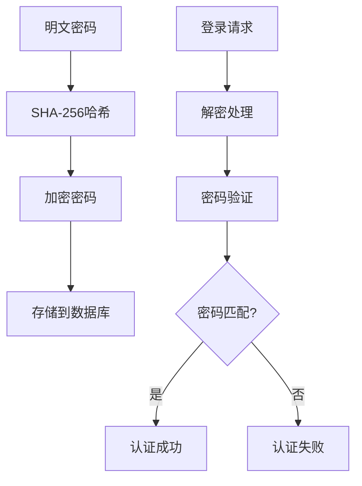

**图表来源**
- [user.py](https://github.com/Shy2593666979/AgentChat/tree/main/src/backend/agentchat/api/services/user.py#L45-L65)

#### 认证服务实现

UserService类提供了完整的用户认证功能：

| 方法名 | 功能描述 | 安全特性 |
|--------|----------|----------|
| encrypt_sha256_password | SHA-256密码加密 | 单向加密 |
| verify_password | 密码验证 | 时间安全比较 |
| decrypt_md5_password | MD5密码解密 | RSA+MD5双重保护 |

**章节来源**
- [user.py](https://github.com/Shy2593666979/AgentChat/tree/main/src/backend/agentchat/api/services/user.py#L42-L65)

### 权限控制系统

#### 角色层次结构

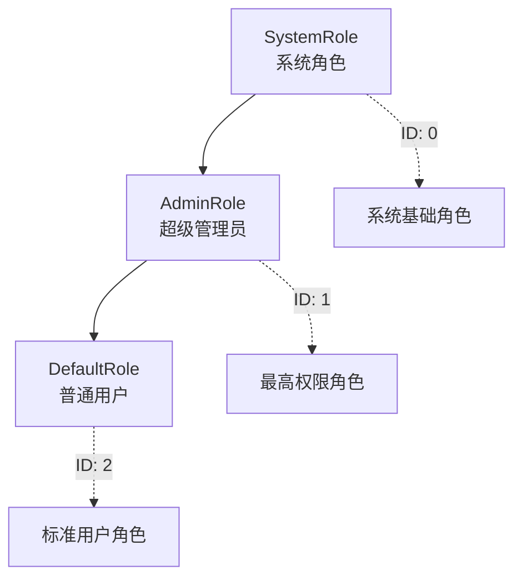

**图表来源**
- [role.py](https://github.com/Shy2593666979/AgentChat/tree/main/src/backend/agentchat/database/models/role.py#L7-L11)

#### 权限验证流程

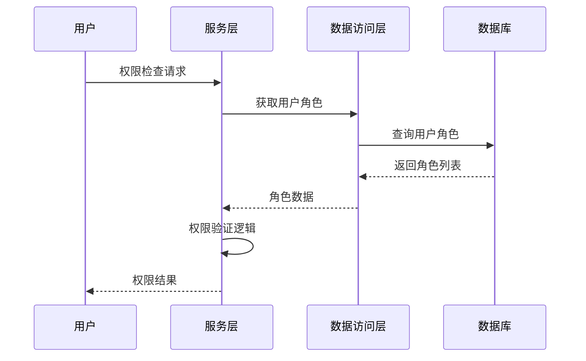

**图表来源**
- [user.py](https://github.com/Shy2593666979/AgentChat/tree/main/src/backend/agentchat/api/services/user.py#L23-L41)

**章节来源**
- [role.py](https://github.com/Shy2593666979/AgentChat/tree/main/src/backend/agentchat/database/models/role.py#L7-L11)
- [user_role.py](https://github.com/Shy2593666979/AgentChat/tree/main/src/backend/agentchat/database/models/user_role.py#L10-L26)

### 数据访问层(DAO)

#### DAO模式实现

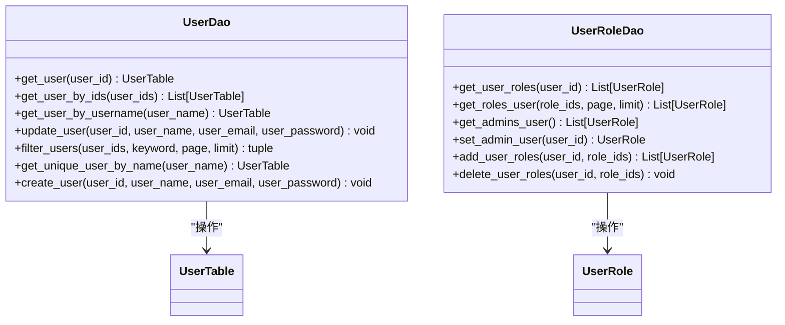

**图表来源**
- [user.py](https://github.com/Shy2593666979/AgentChat/tree/main/src/backend/agentchat/database/dao/user.py#L7-L34)
- [user_role.py](https://github.com/Shy2593666979/AgentChat/tree/main/src/backend/agentchat/database/dao/user_role.py#L10-L68)

#### 查询优化策略

| 查询类型 | 优化策略 | 性能特点 |
|----------|----------|----------|
| 单用户查询 | user_id主键索引 | O(1)复杂度 |
| 用户名查询 | user_name唯一索引 | O(log n)复杂度 |
| 批量查询 | IN子句优化 | 支持多用户同时查询 |
| 分页查询 | OFFSET/LIMIT优化 | 内存友好分页 |

**章节来源**
- [user.py](https://github.com/Shy2593666979/AgentChat/tree/main/src/backend/agentchat/database/dao/user.py#L10-L34)

### API接口层

#### 用户管理API

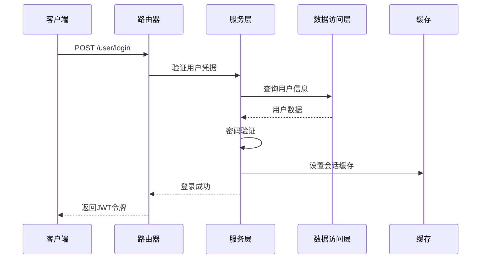

**图表来源**
- [user.py](https://github.com/Shy2593666979/AgentChat/tree/main/src/backend/agentchat/api/v1/user.py#L51-L77)

#### 实际查询示例

##### 用户认证查询

```python
# 用户名密码登录查询
statement = select(UserTable).where(UserTable.user_name == username)
# 结果：单个UserTable对象或None
```

##### 用户权限校验流程

```python
# 获取用户角色
roles = UserRoleDao.get_user_roles(user_id)
# 权限验证逻辑
if user_role == 'admin' or any(role == AdminRole for role in roles):
    # 具有管理员权限
    pass
```

**章节来源**
- [user.py](https://github.com/Shy2593666979/AgentChat/tree/main/src/backend/agentchat/api/v1/user.py#L51-L77)
- [user.py](https://github.com/Shy2593666979/AgentChat/tree/main/src/backend/agentchat/api/services/user.py#L23-L41)

## 依赖关系分析

### 模块依赖图

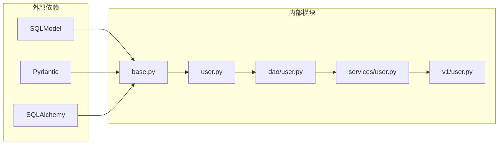

**图表来源**
- [base.py](https://github.com/Shy2593666979/AgentChat/tree/main/src/backend/agentchat/database/models/base.py#L1-L10)
- [user.py](https://github.com/Shy2593666979/AgentChat/tree/main/src/backend/agentchat/database/models/user.py#L1-L10)

### 数据库连接管理

系统采用会话管理模式确保数据库操作的一致性和性能：

| 组件 | 功能 | 特点 |
|------|------|------|
| session_getter | 同步会话管理 | 自动事务处理 |
| async_session_getter | 异步会话管理 | 非阻塞操作 |
| 事务回滚 | 错误恢复 | 数据一致性保障 |

**章节来源**
- [session.py](https://github.com/Shy2593666979/AgentChat/tree/main/src/backend/agentchat/database/session.py#L12-L36)

## 性能考虑

### 索引优化策略

#### 关键字段索引设计

| 字段 | 索引类型 | 用途 | 性能影响 |
|------|----------|------|----------|
| user_id | 主键索引 | 唯一标识查询 | O(1) |
| user_name | 唯一索引 | 用户名查找 | O(log n) |
| create_time | 普通索引 | 时间排序查询 | O(log n) |
| update_time | 普通索引 | 更新时间查询 | O(log n) |
| user_id (外键) | 外键索引 | 关联查询优化 | O(log n) |

#### 查询性能优化建议

1. **登录查询优化**
   ```sql
   -- 优化前：全表扫描
   SELECT * FROM user WHERE user_name = ?;
   
   -- 优化后：利用唯一索引
   EXPLAIN SELECT * FROM user WHERE user_name = ?;
   ```

2. **批量查询优化**
   ```python
   # 推荐：使用IN子句
   users = UserDao.get_user_by_ids(user_ids)
   
   # 避免：多次单独查询
   users = [UserDao.get_user_by_id(id) for id in user_ids]
   ```

3. **分页查询优化**
   ```python
   # 使用OFFSET/LIMIT进行内存友好的分页
   users, total = UserDao.filter_users(user_ids, keyword, page, limit)
   ```

### 缓存策略

#### Redis缓存集成

| 缓存键格式 | 数据内容 | 过期时间 | 用途 |
|------------|----------|----------|------|
| user_current_session:{user_id} | JWT令牌 | ACCESS_TOKEN_EXPIRE_TIME + 1小时 | 会话管理 |
| user_password_error:{username} | 错误次数 | 30分钟 | 登录防护 |
| rsa_{key} | RSA密钥对 | 24小时 | 密码解密 |

**章节来源**
- [user.py](https://github.com/Shy2593666979/AgentChat/tree/main/src/backend/agentchat/api/v1/user.py#L74-L76)
- [constants.py](https://github.com/Shy2593666979/AgentChat/tree/main/src/backend/agentchat/utils/constants.py#L11-L12)

## 故障排除指南

### 常见问题及解决方案

#### 用户认证失败

**问题症状**：用户登录时返回认证错误

**排查步骤**：
1. 检查用户名是否存在：`UserDao.get_user_by_username(username)`
2. 验证密码加密方式：确认使用SHA-256算法
3. 检查用户状态：确认用户未被禁用(`delete=False`)
4. 查看Redis缓存状态：检查会话缓存是否正确设置

**解决方案**：
```python
# 重新设置用户密码
encrypted_password = UserService.encrypt_sha256_password(new_password)
UserDao.update_user_password(user_id, encrypted_password)
```

#### 权限验证异常

**问题症状**：用户权限检查失败

**排查步骤**：
1. 检查用户角色分配：`UserRoleDao.get_user_roles(user_id)`
2. 验证角色ID有效性：确认使用正确的角色常量
3. 检查权限逻辑：确认AdminRole判断正确

**解决方案**：
```python
# 重新分配用户角色
UserRoleDao.add_user_roles(user_id, [DefaultRole])
```

#### 数据库查询性能问题

**问题症状**：用户查询响应缓慢

**排查步骤**：
1. 检查索引使用情况：`EXPLAIN`查询计划
2. 分析查询频率：识别热点查询
3. 检查数据量：评估表大小和索引效率

**优化建议**：
```python
# 添加复合索引（如果需要）
CREATE INDEX idx_user_name_delete ON user(user_name, delete);
```

**章节来源**
- [user.py](https://github.com/Shy2593666979/AgentChat/tree/main/src/backend/agentchat/api/services/user.py#L66-L75)
- [user.py](https://github.com/Shy2593666979/AgentChat/tree/main/src/backend/agentchat/database/dao/user.py#L22-L25)

## 结论

AgentChat的用户数据模型设计体现了现代Web应用的最佳实践，通过以下关键特性实现了高效、安全、可扩展的用户管理系统：

### 设计优势

1. **安全性**：采用多层加密机制，敏感字段自动过滤，防止数据泄露
2. **性能**：合理的索引设计和查询优化，支持高并发用户场景
3. **可维护性**：清晰的分层架构，遵循单一职责原则
4. **扩展性**：灵活的角色权限系统，支持复杂的业务需求

### 技术亮点

- **SQLModel框架**：结合ORM和Pydantic的优势，提供强类型支持
- **序列化过滤**：智能的敏感字段处理机制
- **异步支持**：完整的异步数据库操作支持
- **缓存集成**：Redis缓存提升系统性能

### 最佳实践建议

1. **定期备份**：建立完善的数据库备份策略
2. **监控告警**：实施性能监控和异常告警
3. **安全审计**：定期审查权限分配和访问日志
4. **版本升级**：及时跟进SQLModel和相关依赖的安全更新

该用户数据模型为AgentChat平台提供了坚实的基础，支撑着整个系统的用户管理和权限控制功能，是构建可信、高效AI助手生态系统的重要组成部分。
