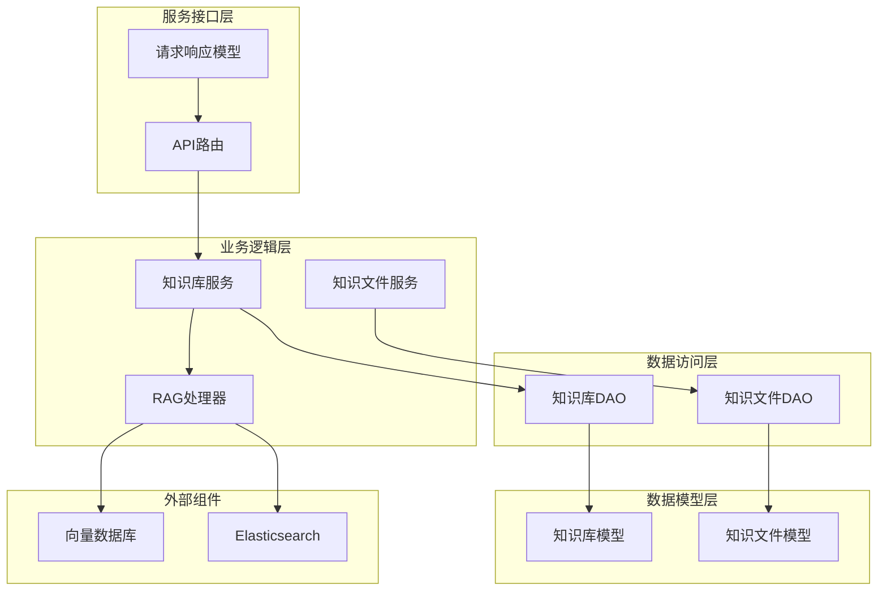
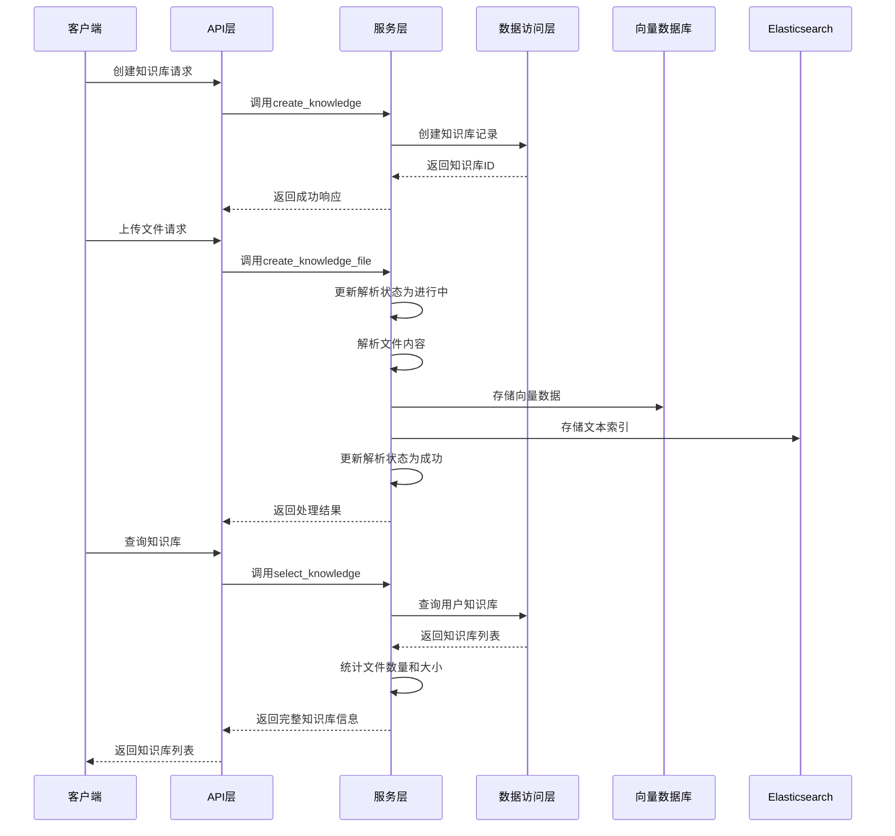
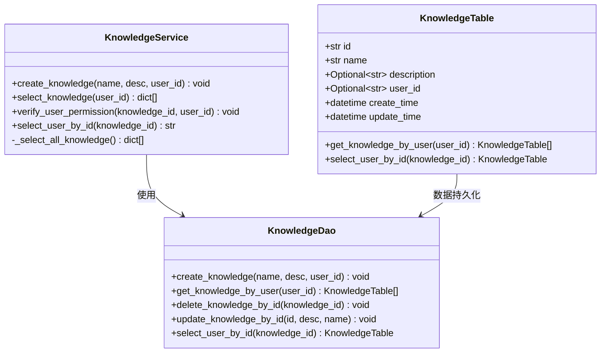
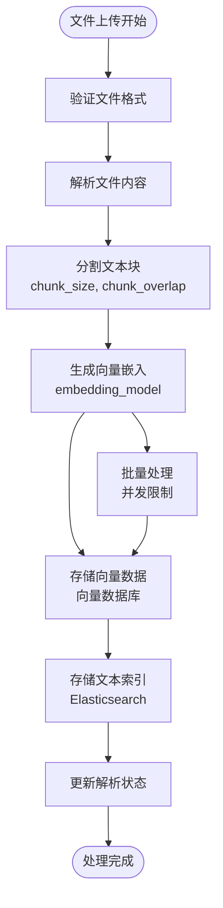
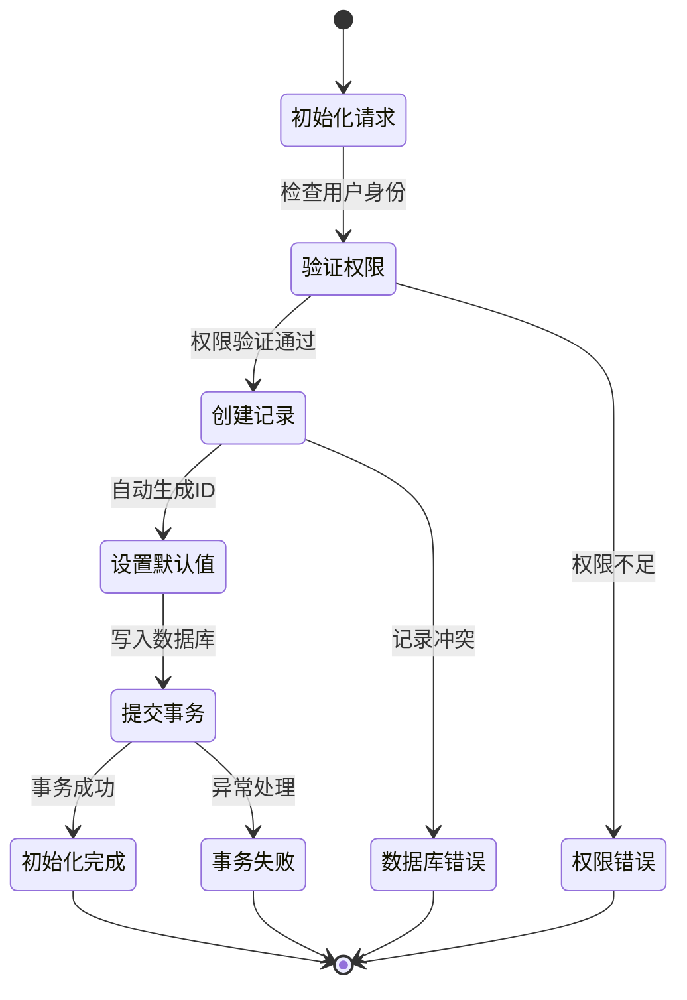
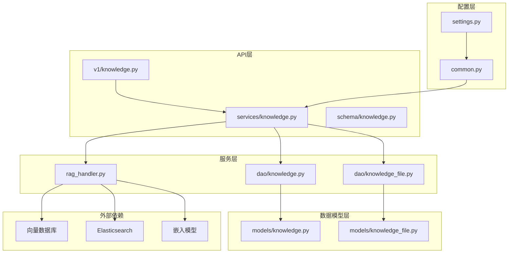

# 知识库数据模型

## 目录
1. [简介](#简介)
2. [项目结构概览](#项目结构概览)
3. [核心数据模型](#核心数据模型)
4. [架构概览](#架构概览)
5. [详细组件分析](#详细组件分析)
6. [依赖关系分析](#依赖关系分析)
7. [性能考虑](#性能考虑)
8. [故障排除指南](#故障排除指南)
9. [结论](#结论)

## 简介

本文档详细介绍了AgentChat系统中知识库实体的数据模型设计，重点阐述了Knowledge模型作为RAG（检索增强生成）系统核心元数据的作用。该模型不仅包含了基本的知识库信息，还实现了多租户隔离机制，并与向量数据库紧密集成，支持大规模知识库场景下的高效管理和查询。

## 项目结构概览

AgentChat系统采用分层架构设计，知识库模块位于数据访问层（DAO）、业务逻辑层（Service）和服务接口层（API）之间，形成了完整的数据流转体系。

**图表来源**
- [knowledge.py](https://github.com/Shy2593666979/AgentChat/tree/main/src/backend/agentchat/api/v1/knowledge.py#L1-L74)
- [knowledge.py](https://github.com/Shy2593666979/AgentChat/tree/main/src/backend/agentchat/api/services/knowledge.py#L1-L84)
- [rag_handler.py](https://github.com/Shy2593666979/AgentChat/tree/main/src/backend/agentchat/services/rag_handler.py#L1-L152)

## 核心数据模型

### Knowledge模型字段结构

Knowledge模型是整个知识库系统的核心实体，其字段设计体现了RAG系统的功能需求和多租户架构特点。

| 字段名 | 类型 | 约束条件 | 描述 | 用途 |
|--------|------|----------|------|------|
| id | str | 主键，唯一 | 知识库唯一标识符 | 系统内部识别和关联 |
| name | str | 非空，索引，唯一 | 知识库名称 | 用户可见的标识 |
| description | Optional[str] | 最大长度1024 | 知识库描述信息 | 详细说明和分类 |
| user_id | Optional[str] | 索引 | 用户ID | 实现多租户隔离 |
| create_time | datetime | 自动设置 | 创建时间戳 | 数据审计和统计 |
| update_time | datetime | 自动更新 | 更新时间戳 | 数据版本控制 |

**章节来源**
- [knowledge.py](https://github.com/Shy2593666979/AgentChat/tree/main/src/backend/agentchat/database/models/knowledge.py#L14-L37)

### KnowledgeFile模型字段结构

KnowledgeFile模型记录了知识库中每个文件的详细信息，支持多种文件格式的解析和管理。

| 字段名 | 类型 | 约束条件 | 描述 | 用途 |
|--------|------|----------|------|------|
| id | str | 主键，UUID | 文件唯一标识符 | 系统内部管理 |
| file_name | str | 非空，索引 | 文件原始名称 | 用户界面显示 |
| knowledge_id | str | 非空，索引 | 关联的知识库ID | 一对多关系维护 |
| status | str | 默认success | 解析状态 | 处理进度跟踪 |
| user_id | str | 非空，索引 | 文件所属用户ID | 权限控制 |
| oss_url | str | 默认空字符串 | OSS存储路径 | 文件存储位置 |
| file_size | int | 默认0 | 文件大小（字节） | 存储空间统计 |
| create_time | datetime | 自动设置 | 创建时间戳 | 数据生命周期管理 |
| update_time | datetime | 自动更新 | 更新时间戳 | 状态变更追踪 |

**章节来源**
- [knowledge_file.py](https://github.com/Shy2593666979/AgentChat/tree/main/src/backend/agentchat/database/models/knowledge_file.py#L16-L41)

## 架构概览

知识库系统采用事件驱动的异步架构，支持高并发的文件处理和查询操作。

**图表来源**
- [knowledge.py](https://github.com/Shy2593666979/AgentChat/tree/main/src/backend/agentchat/api/v1/knowledge.py#L14-L74)
- [knowledge_file.py](https://github.com/Shy2593666979/AgentChat/tree/main/src/backend/agentchat/api/services/knowledge_file.py#L23-L64)
- [rag_handler.py](https://github.com/Shy2593666979/AgentChat/tree/main/src/backend/agentchat/services/rag_handler.py#L18-L35)

## 详细组件分析

### 多租户隔离机制

Knowledge模型通过user_id字段实现了完整的多租户隔离，确保不同用户的知识库数据相互独立。

**图表来源**
- [knowledge.py](https://github.com/Shy2593666979/AgentChat/tree/main/src/backend/agentchat/database/models/knowledge.py#L14-L37)
- [knowledge.py](https://github.com/Shy2593666979/AgentChat/tree/main/src/backend/agentchat/api/services/knowledge.py#L9-L84)
- [knowledge.py](https://github.com/Shy2593666979/AgentChat/tree/main/src/backend/agentchat/database/dao/knowledge.py#L7-L63)

### 向量化处理流程

embedding_model字段虽然在当前模型中未显式定义，但通过配置系统支持动态选择嵌入模型，影响整个向量化处理流程。

**图表来源**
- [embedding.py](https://github.com/Shy2593666979/AgentChat/tree/main/src/backend/agentchat/services/rag/embedding.py#L11-L49)
- [knowledge_file.py](https://github.com/Shy2593666979/AgentChat/tree/main/src/backend/agentchat/api/services/knowledge_file.py#L23-L64)

### 知识库创建初始化过程

知识库创建涉及多个步骤的协调，确保数据一致性和系统稳定性。

**章节来源**
- [knowledge.py](https://github.com/Shy2593666979/AgentChat/tree/main/src/backend/agentchat/api/services/knowledge.py#L11-L17)
- [knowledge.py](https://github.com/Shy2593666979/AgentChat/tree/main/src/backend/agentchat/database/dao/knowledge.py#L10-L14)

### 向量数据库协同机制

系统支持多种向量数据库后端，通过统一的接口实现无缝切换和扩展。

| 组件 | 功能 | 配置参数 | 性能特点 |
|------|------|----------|----------|
| ChromaDB | 本地向量存储 | collection_name, persist_directory | 轻量级，易于部署 |
| Milvus | 分布式向量数据库 | host, port, collection_name | 高性能，可扩展 |
| Elasticsearch | 全文搜索引擎 | index_name, mapping | 结构化搜索，全文匹配 |

**章节来源**
- [settings.py](https://github.com/Shy2593666979/AgentChat/tree/main/src/backend/agentchat/settings.py#L1-L62)
- [common.py](https://github.com/Shy2593666979/AgentChat/tree/main/src/backend/agentchat/schema/common.py#L57-L66)

## 依赖关系分析

知识库系统的依赖关系体现了清晰的分层架构和模块化设计。

**图表来源**
- [knowledge.py](https://github.com/Shy2593666979/AgentChat/tree/main/src/backend/agentchat/api/v1/knowledge.py#L1-L74)
- [knowledge.py](https://github.com/Shy2593666979/AgentChat/tree/main/src/backend/agentchat/api/services/knowledge.py#L1-L84)
- [rag_handler.py](https://github.com/Shy2593666979/AgentChat/tree/main/src/backend/agentchat/services/rag_handler.py#L1-L152)

**章节来源**
- [knowledge.py](https://github.com/Shy2593666979/AgentChat/tree/main/src/backend/agentchat/database/models/knowledge.py#L1-L37)
- [knowledge_file.py](https://github.com/Shy2593666979/AgentChat/tree/main/src/backend/agentchat/database/models/knowledge_file.py#L1-L41)

## 性能考虑

### 大规模知识库场景优化

针对大规模知识库场景，系统采用了以下优化策略：

1. **索引优化**：在user_id和knowledge_id字段上建立索引，加速查询性能
2. **分页查询**：实现分页机制，避免大量数据一次性加载
3. **缓存策略**：对频繁访问的知识库元数据实施缓存
4. **并发控制**：通过信号量限制向量嵌入的并发数量
5. **批量操作**：支持批量插入和更新操作，提高吞吐量

### 元数据查询优化方案

| 优化技术 | 实现方式 | 性能提升 | 适用场景 |
|----------|----------|----------|----------|
| 索引优化 | 在关键字段建立复合索引 | 10-100倍 | 频繁查询场景 |
| 查询缓存 | Redis缓存查询结果 | 5-50倍 | 重复查询场景 |
| 分页查询 | 限制单次查询结果数量 | 内存使用减少80% | 大数据集查询 |
| 批量操作 | 合并多个小操作 | IO减少70% | 批量数据处理 |

## 故障排除指南

### 常见问题及解决方案

1. **知识库创建失败**
   - 检查user_id权限验证
   - 验证name字段唯一性约束
   - 确认数据库连接状态

2. **文件解析异常**
   - 检查文件格式支持情况
   - 验证OSS存储权限
   - 查看解析状态日志

3. **向量检索性能问题**
   - 优化chunk_size和chunk_overlap参数
   - 检查向量数据库连接
   - 调整检索阈值设置

**章节来源**
- [knowledge.py](https://github.com/Shy2593666979/AgentChat/tree/main/src/backend/agentchat/api/services/knowledge.py#L56-L66)
- [knowledge_file.py](https://github.com/Shy2593666979/AgentChat/tree/main/src/backend/agentchat/api/services/knowledge_file.py#L38-L42)

## 结论

AgentChat的知识库数据模型设计充分体现了现代RAG系统的架构特点，通过精心设计的字段结构、完善的多租户隔离机制和高效的向量化处理流程，为大规模知识管理提供了坚实的技术基础。系统的模块化设计和灵活的配置机制，使其能够适应不同的部署环境和业务需求，是构建智能知识管理系统的重要参考。
