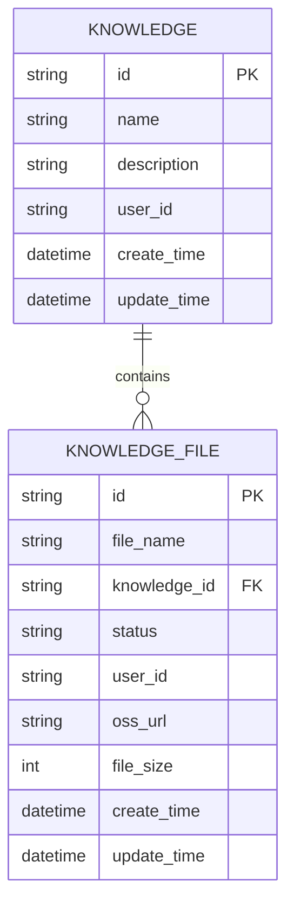
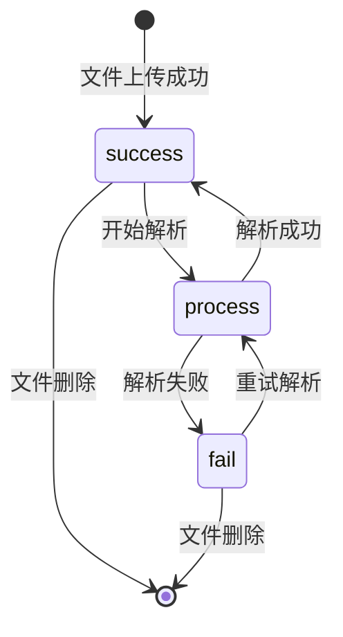
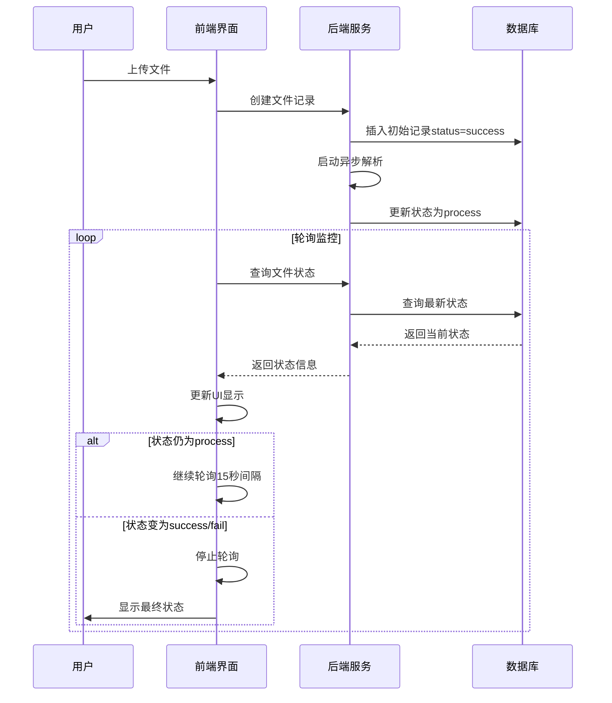
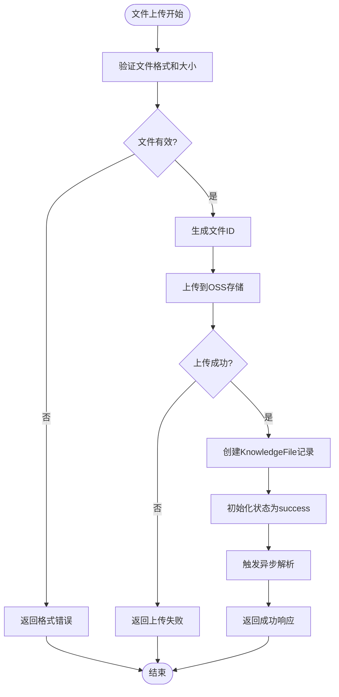
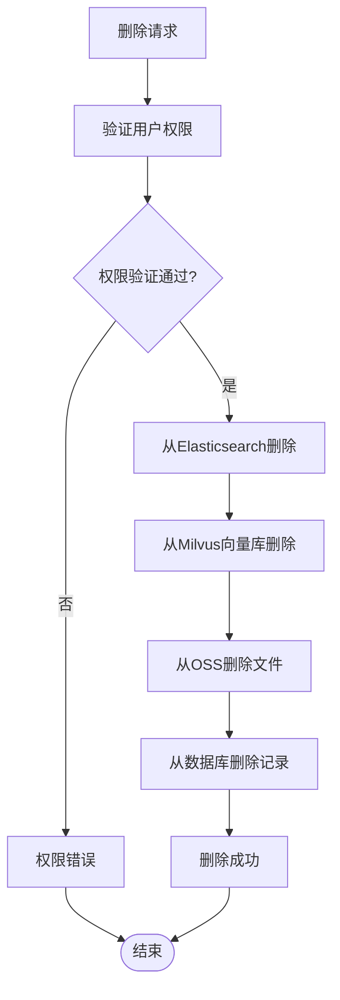
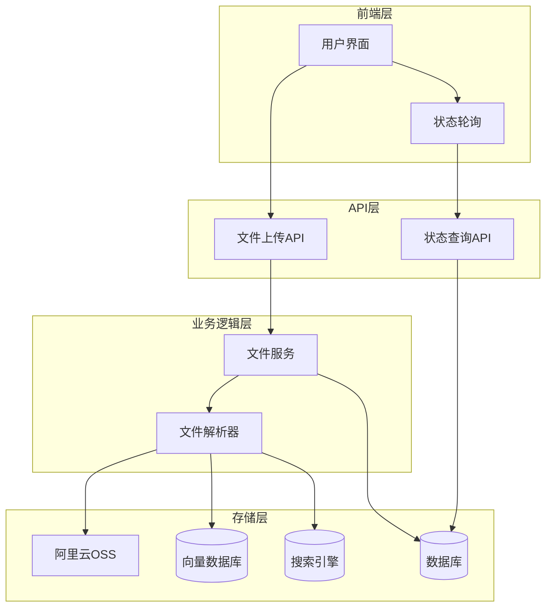
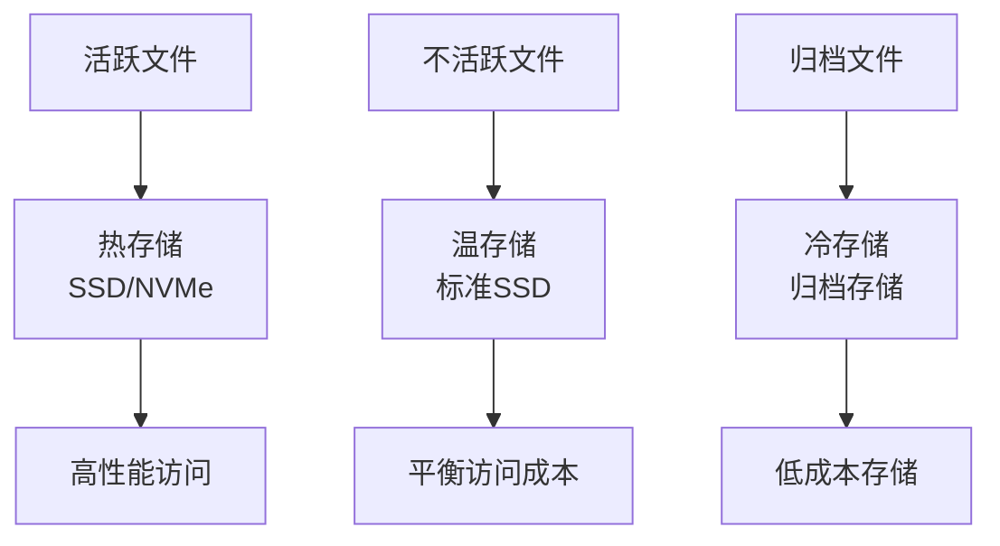

# 知识文件数据模型技术文档

## 目录
1. [概述](#概述)
2. [模型架构](#模型架构)
3. [核心字段详解](#核心字段详解)
4. [状态机设计](#状态机设计)
5. [文件生命周期管理](#文件生命周期管理)
6. [知识库关联机制](#知识库关联机制)
7. [异步处理流程](#异步处理流程)
8. [存储与归档策略](#存储与归档策略)
9. [性能优化建议](#性能优化建议)
10. [故障排除指南](#故障排除指南)

## 概述

KnowledgeFile模型是AgentChat系统中知识库文件管理的核心数据结构，负责记录上传文件的元信息、处理状态以及与知识库的关联关系。该模型采用SQLModel框架构建，支持异步文件解析处理，并提供完整的文件生命周期管理功能。

### 主要特性

- **元信息记录**：完整记录文件的基本属性和存储信息
- **状态机管理**：通过Status枚举实现文件处理状态的严格控制
- **知识库关联**：通过knowledge_id字段建立与Knowledge模型的一对多关系
- **异步处理**：支持文件解析的异步执行和状态跟踪
- **存储集成**：与阿里云OSS存储无缝集成，支持大文件处理

## 模型架构



**图表来源**
- [knowledge_file.py](https://github.com/Shy2593666979/AgentChat/src/backend/agentchat/database/models/knowledge_file.py#L16-L41)
- [knowledge.py](https://github.com/Shy2593666979/AgentChat/src/backend/agentchat/database/models/knowledge.py#L14-L37)

**章节来源**
- [knowledge_file.py](https://github.com/Shy2593666979/AgentChat/src/backend/agentchat/database/models/knowledge_file.py#L1-L41)
- [knowledge.py](https://github.com/Shy2593666979/AgentChat/src/backend/agentchat/database/models/knowledge.py#L1-L37)

## 核心字段详解

### 基础标识字段

#### id
- **类型**：字符串（UUID hex格式）
- **约束**：主键，自动生成
- **用途**：唯一标识每个知识文件记录
- **生成方式**：使用uuid4().hex生成全局唯一ID

#### file_name
- **类型**：字符串
- **约束**：索引字段
- **用途**：存储原始文件名称，用于用户界面展示
- **特点**：支持中文文件名，最长可达数据库字符限制

#### knowledge_id
- **类型**：字符串
- **约束**：外键，索引字段
- **用途**：关联到所属的知识库
- **关系**：与Knowledge模型建立一对多关系

#### user_id
- **类型**：字符串
- **约束**：索引字段
- **用途**：记录文件上传者用户ID
- **安全**：用于权限验证和访问控制

### 存储与状态字段

#### status
- **类型**：字符串
- **默认值**："success"
- **状态枚举**：
  - `"fail"`：解析失败
  - `"process"`：正在解析中
  - `"success"`：解析成功
- **用途**：跟踪文件处理状态，支持异步状态查询

#### oss_url
- **类型**：字符串
- **默认值**：空字符串
- **用途**：存储文件在阿里云OSS中的访问URL
- **特点**：支持直接下载和预览

#### file_size
- **类型**：整数
- **默认值**：0
- **单位**：字节
- **用途**：记录文件的实际大小，用于容量管理和优化

### 时间戳字段

#### create_time
- **类型**：日期时间
- **默认值**：服务器当前时间
- **用途**：记录文件记录的创建时间
- **特点**：自动设置，不可手动修改

#### update_time
- **类型**：日期时间
- **默认值**：服务器当前时间
- **用途**：记录最后更新时间
- **特点**：自动更新，支持状态变更追踪

**章节来源**
- [knowledge_file.py](https://github.com/Shy2593666979/AgentChat/src/backend/agentchat/database/models/knowledge_file.py#L16-L41)

## 状态机设计

### 状态流转图



**图表来源**
- [knowledge_file.py](https://github.com/Shy2593666979/AgentChat/src/backend/agentchat/api/services/knowledge_file.py#L26-L42)

### 状态枚举定义

Status枚举提供了清晰的状态定义：

- **success**：文件解析完成，可正常使用
- **process**：文件正在后台解析中
- **fail**：文件解析失败，需要重新上传或修复

### 状态监控机制

前端通过轮询机制实时监控文件状态变化：



**图表来源**
- [knowledge_file.py](https://github.com/Shy2593666979/AgentChat/src/backend/agentchat/api/services/knowledge_file.py#L26-L42)
- [knowledge-file.vue](https://github.com/Shy2593666979/AgentChat/src/frontend/src/pages/knowledge/knowledge-file.vue#L102-L115)

**章节来源**
- [knowledge_file.py](https://github.com/Shy2593666979/AgentChat/src/backend/agentchat/database/models/knowledge_file.py#L11-L15)
- [knowledge-file.vue](https://github.com/Shy2593666979/AgentChat/src/frontend/src/pages/knowledge/knowledge-file.vue#L45-L70)

## 文件生命周期管理

### 创建阶段

文件上传和记录创建遵循以下流程：



**图表来源**
- [knowledge_file.py](https://github.com/Shy2593666979/AgentChat/src/backend/agentchat/api/v1/knowledge_file.py#L15-L35)
- [knowledge_file.py](https://github.com/Shy2593666979/AgentChat/src/backend/agentchat/api/services/knowledge_file.py#L23-L42)

### 异步解析处理

解析过程采用异步模式，避免阻塞主线程：

1. **状态初始化**：创建记录时立即设置为"success"状态
2. **异步启动**：调用`update_parsing_status`方法更新为"process"
3. **文件解析**：根据文件类型调用相应的解析器
4. **结果更新**：解析完成后更新为"success"或"fail"

### 删除阶段

文件删除涉及多个层面的数据清理：



**图表来源**
- [knowledge_file.py](https://github.com/Shy2593666979/AgentChat/src/backend/agentchat/api/services/knowledge_file.py#L44-L50)

**章节来源**
- [knowledge_file.py](https://github.com/Shy2593666979/AgentChat/src/backend/agentchat/api/v1/knowledge_file.py#L15-L35)
- [knowledge_file.py](https://github.com/Shy2593666979/AgentChat/src/backend/agentchat/api/services/knowledge_file.py#L44-L50)

## 知识库关联机制

### 外键关系设计

KnowledgeFile模型通过knowledge_id字段与Knowledge模型建立外键关系：

- **关系类型**：一对多（一个知识库可以包含多个文件）
- **级联操作**：支持级联删除，确保数据一致性
- **查询优化**：knowledge_id字段建立索引，支持高效查询

### 关联查询示例

```python
# 查询特定知识库的所有文件
results = await KnowledgeFileDao.select_knowledge_file(knowledge_id)

# 查询单个文件详情
file = await KnowledgeFileDao.select_knowledge_file_by_id(file_id)

# 更新文件状态
await KnowledgeFileDao.update_parsing_status(knowledge_file_id, new_status)
```

### 权限控制

系统实现了基于知识库的权限控制：

- **用户权限验证**：确保只有知识库创建者或授权用户才能操作文件
- **文件级权限**：每个文件都有明确的归属关系
- **批量操作**：支持按知识库进行批量文件管理

**章节来源**
- [knowledge_file.py](https://github.com/Shy2593666979/AgentChat/src/backend/agentchat/database/dao/knowledge_file.py#L22-L42)
- [knowledge_file.py](https://github.com/Shy2593666979/AgentChat/src/backend/agentchat/api/services/knowledge_file.py#L57-L61)

## 异步处理流程

### 文件解析架构

系统采用异步处理架构，支持大规模文件处理：



**图表来源**
- [knowledge_file.py](https://github.com/Shy2593666979/AgentChat/src/backend/agentchat/api/services/knowledge_file.py#L23-L42)
- [parser.py](https://github.com/Shy2593666979/AgentChat/src/backend/agentchat/services/rag/parser.py#L13-L33)

### 并发处理机制

解析器支持并发处理，提高大文件处理效率：

- **并发限制**：通过信号量控制最大并发任务数
- **资源管理**：合理分配系统资源，避免过载
- **错误隔离**：单个文件解析失败不影响其他文件

### 错误恢复策略

系统具备完善的错误恢复机制：

1. **重试机制**：解析失败时自动重试
2. **状态回滚**：失败时恢复到初始状态
3. **日志记录**：详细记录错误信息便于排查

**章节来源**
- [knowledge_file.py](https://github.com/Shy2593666979/AgentChat/src/backend/agentchat/api/services/knowledge_file.py#L23-L42)
- [parser.py](https://github.com/Shy2593666979/AgentChat/src/backend/agentchat/services/rag/parser.py#L13-L33)

## 存储与归档策略

### 对象存储集成

系统与阿里云OSS深度集成，提供可靠的文件存储解决方案：

- **自动上传**：文件上传后自动存储到OSS
- **URL管理**：生成永久访问链接
- **版本控制**：支持文件版本管理
- **CDN加速**：利用OSS CDN提升访问速度

### 海量文件管理

针对海量文件存储需求，建议实施以下策略：

#### 分层存储策略



#### 存储优化建议

1. **文件分类**：
   - 按访问频率分类存储
   - 按文件类型优化存储格式
   - 实施智能缓存策略

2. **容量规划**：
   - 监控存储使用趋势
   - 实施配额管理
   - 设置自动清理规则

3. **备份策略**：
   - 多地域备份
   - 版本控制
   - 定期完整性检查

### 清理策略

建议实施以下文件清理策略：

- **定期清理**：删除超过保留期限的文件
- **空间回收**：当存储空间不足时自动清理
- **用户主动清理**：提供用户手动删除选项
- **智能归档**：将长期不访问的文件归档到低成本存储

**章节来源**
- [aliyun_oss.py](https://github.com/Shy2593666979/AgentChat/src/backend/agentchat/services/aliyun_oss.py#L39-L45)
- [knowledge-file.vue](https://github.com/Shy2593666979/AgentChat/src/frontend/src/pages/knowledge/knowledge-file.vue#L53-L56)

## 性能优化建议

### 查询优化

1. **索引策略**：
   - 在knowledge_id字段建立复合索引
   - 为常用查询字段添加索引
   - 定期分析查询性能

2. **分页查询**：
   - 大量文件列表采用分页加载
   - 实施懒加载机制
   - 使用游标分页减少内存消耗

### 缓存策略

1. **状态缓存**：
   - 缓存文件状态信息
   - 实施状态变更通知机制
   - 减少数据库查询次数

2. **元数据缓存**：
   - 缓存文件基本信息
   - 实施分布式缓存
   - 设置合理的缓存过期时间

### 异步处理优化

1. **任务队列**：
   - 使用消息队列解耦文件处理
   - 实施任务优先级管理
   - 监控任务执行状态

2. **资源池管理**：
   - 合理配置解析线程池
   - 实施资源使用监控
   - 动态调整并发度

## 故障排除指南

### 常见问题诊断

#### 文件上传失败

**症状**：文件上传后状态显示为"失败"

**排查步骤**：
1. 检查文件格式是否支持
2. 验证文件大小是否超出限制
3. 确认网络连接稳定性
4. 查看OSS存储权限配置

**解决方案**：
- 支持的文件格式：PDF、DOCX、TXT、MD、XLSX、PPTX
- 文件大小限制：根据系统配置确定
- 网络超时：增加超时时间配置

#### 解析状态异常

**症状**：文件状态卡在"进行中"或频繁切换

**排查步骤**：
1. 检查异步处理服务状态
2. 验证解析器配置
3. 查看系统资源使用情况
4. 检查数据库连接状态

**解决方案**：
- 重启解析服务
- 清理僵尸进程
- 优化数据库连接池
- 增加系统资源

#### 权限访问问题

**症状**：无法访问或删除文件

**排查步骤**：
1. 验证用户身份认证
2. 检查知识库权限设置
3. 确认文件所有权关系
4. 查看权限配置

**解决方案**：
- 重新登录系统
- 联系知识库管理员
- 检查权限配置规则
- 联系技术支持

### 监控指标

建议监控以下关键指标：

- **文件上传成功率**
- **解析处理时间**
- **存储空间使用率**
- **系统资源占用率**
- **错误发生频率**

### 日志分析

系统提供详细的日志记录，便于问题定位：

- **访问日志**：记录所有文件操作
- **错误日志**：详细记录异常信息
- **性能日志**：记录处理时间和资源使用
- **审计日志**：记录权限变更和重要操作

**章节来源**
- [knowledge-file.vue](https://github.com/Shy2593666979/AgentChat/src/frontend/src/pages/knowledge/knowledge-file.vue#L333-L351)
- [knowledge-file.vue](https://github.com/Shy2593666979/AgentChat/src/frontend/src/pages/knowledge/knowledge-file.vue#L140-L152)

## 总结

KnowledgeFile模型作为AgentChat系统的核心组件，提供了完整的文件生命周期管理功能。通过精心设计的字段结构、状态机机制和异步处理流程，系统能够高效地处理大量文件，同时保证数据一致性和用户体验。

该模型的主要优势包括：

1. **完整的元信息记录**：涵盖文件的基本属性和处理状态
2. **灵活的状态管理**：支持异步处理和状态跟踪
3. **强关联性**：与知识库模型紧密集成
4. **可扩展性**：支持多种文件格式和处理方式
5. **可靠性**：具备完善的错误处理和恢复机制

通过合理的存储策略和性能优化，该模型能够支撑大规模文件管理需求，为用户提供稳定可靠的知识库文件管理服务。
