# Elasticsearch配置详细文档

## 目录
1. [简介](#简介)
2. [项目结构概览](#项目结构概览)
3. [核心配置类分析](#核心配置类分析)
4. [Elasticsearch客户端架构](#elasticsearch客户端架构)
5. [索引配置详解](#索引配置详解)
6. [查询操作分析](#查询操作分析)
7. [RAG系统中的角色](#rag系统中的角色)
8. [性能调优建议](#性能调优建议)
9. [故障排除指南](#故障排除指南)
10. [总结](#总结)

## 简介

本文档详细介绍了AgentChat项目中Elasticsearch的配置和使用，重点分析了`es_index.py`中定义的索引配置和`es_client.py`中实现的客户端功能。Elasticsearch在该系统中扮演着关键角色，作为元数据存储和混合检索的重要组成部分，支持全文检索、模糊匹配和智能查询等功能。

## 项目结构概览

项目的Elasticsearch相关组件分布在以下目录结构中：

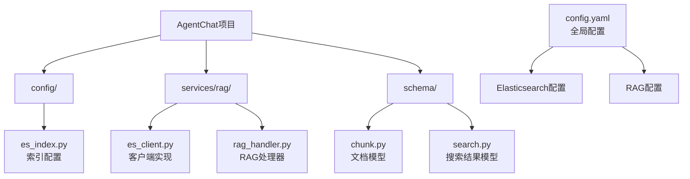

**图表来源**
- [es_index.py](https://github.com/Shy2593666979/AgentChat/src/backend/agentchat/config/es_index.py#L1-L84)
- [es_client.py](https://github.com/Shy2593666979/AgentChat/src/backend/agentchat/services/rag/es_client.py#L1-L199)
- [config.yaml](https://github.com/Shy2593666979/AgentChat/src/backend/agentchat/config.yaml#L76-L98)

## 核心配置类分析

### ESIndex类结构

ESIndex类是Elasticsearch配置的核心容器，包含了完整的索引定义和查询模板：

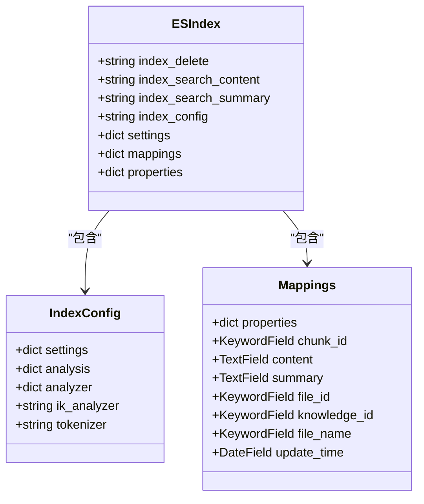

**图表来源**
- [es_index.py](https://github.com/Shy2593666979/AgentChat/src/backend/agentchat/config/es_index.py#L1-L84)

**章节来源**
- [es_index.py](https://github.com/Shy2593666979/AgentChat/src/backend/agentchat/config/es_index.py#L1-L84)

### 字段映射分析

ESIndex类定义了完整的字段映射结构：

| 字段名 | 类型 | 分析器 | 描述 |
|--------|------|--------|------|
| chunk_id | keyword | - | 块唯一标识符 |
| content | text | ik_analyzer | 主要内容字段，使用ik_smart分词器 |
| summary | text | ik_analyzer | 摘要字段，使用ik_smart分词器 |
| file_id | keyword | - | 文件唯一标识符 |
| knowledge_id | keyword | - | 知识库标识符 |
| file_name | keyword | - | 文件名称 |
| update_time | date | - | 更新时间戳 |

**章节来源**
- [es_index.py](https://github.com/Shy2593666979/AgentChat/src/backend/agentchat/config/es_index.py#L56-L80)

## Elasticsearch客户端架构

### ESClient类设计

ESClient类提供了完整的Elasticsearch操作接口：

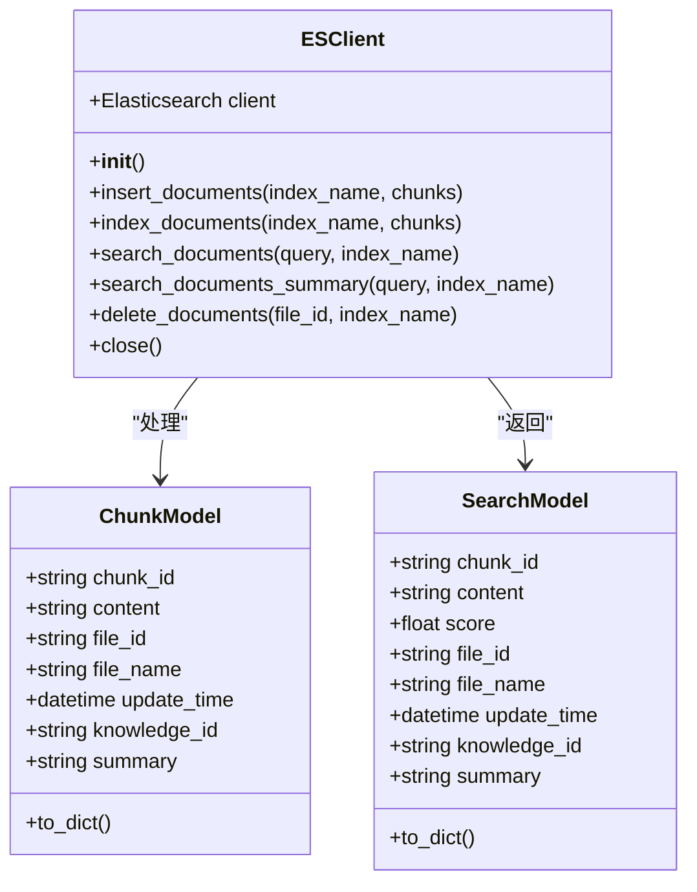

**图表来源**
- [es_client.py](https://github.com/Shy2593666979/AgentChat/src/backend/agentchat/services/rag/es_client.py#L12-L199)
- [chunk.py](https://github.com/Shy2593666979/AgentChat/src/backend/agentchat/schema/chunk.py#L1-L20)
- [search.py](https://github.com/Shy2593666979/AgentChat/src/backend/agentchat/schema/search.py#L1-L23)

**章节来源**
- [es_client.py](https://github.com/Shy2593666979/AgentChat/src/backend/agentchat/services/rag/es_client.py#L12-L199)

### 客户端初始化流程

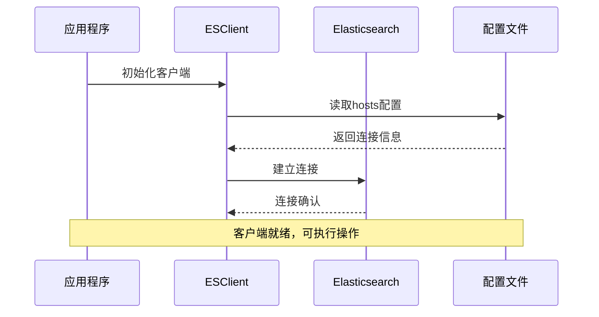

**图表来源**
- [es_client.py](https://github.com/Shy2593666979/AgentChat/src/backend/agentchat/services/rag/es_client.py#L13-L14)
- [config.yaml](https://github.com/Shy2593666979/AgentChat/src/backend/agentchat/config.yaml#L91-L91)

## 索引配置详解

### ik_smart分词器配置

系统使用ik_smart分词器进行中文文本处理：

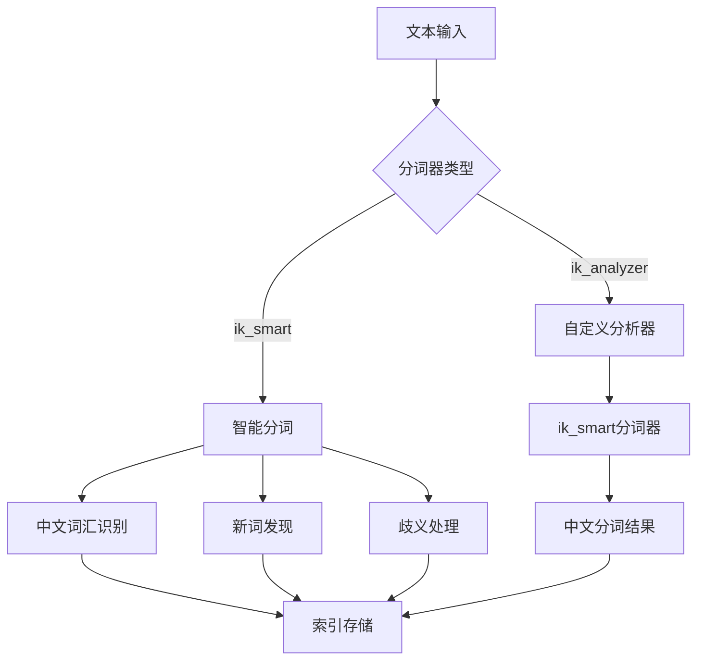

**图表来源**
- [es_index.py](https://github.com/Shy2593666979/AgentChat/src/backend/agentchat/config/es_index.py#L44-L54)

### 动态模板设置

虽然当前配置中没有显式的动态模板，但通过字段映射实现了类似的功能：

| 字段属性 | 配置项 | 作用 |
|----------|--------|------|
| content | analyzer: ik_analyzer | 中文全文检索 |
| summary | analyzer: ik_analyzer | 摘要检索 |
| chunk_id | type: keyword | 精确匹配查询 |
| file_id | type: keyword | 文件关联查询 |
| update_time | type: date | 时间范围查询 |

**章节来源**
- [es_index.py](https://github.com/Shy2593666979/AgentChat/src/backend/agentchat/config/es_index.py#L44-L83)

## 查询操作分析

### 全文检索查询

系统支持两种主要的全文检索模式：

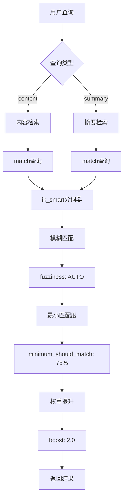

**图表来源**
- [es_index.py](https://github.com/Shy2593666979/AgentChat/src/backend/agentchat/config/es_index.py#L10-L25)
- [es_index.py](https://github.com/Shy2593666979/AgentChat/src/backend/agentchat/config/es_index.py#L27-L42)

### 查询参数详解

| 参数 | 值 | 作用 |
|------|-----|------|
| size | 10 | 返回最多10个结果 |
| timeout | 3s | 查询超时时间 |
| operator | and | 必须满足所有关键词 |
| minimum_should_match | 75% | 至少匹配75%的关键词 |
| fuzziness | AUTO | 自动模糊匹配 |
| boost | 2.0 | 权重提升因子 |

**章节来源**
- [es_index.py](https://github.com/Shy2593666979/AgentChat/src/backend/agentchat/config/es_index.py#L10-L42)

### 删除操作实现

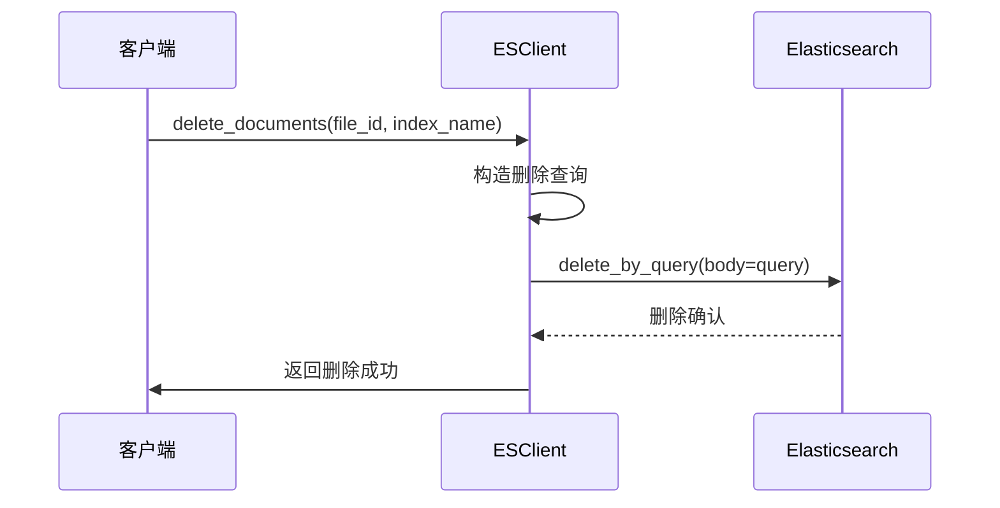

**图表来源**
- [es_client.py](https://github.com/Shy2593666979/AgentChat/src/backend/agentchat/services/rag/es_client.py#L86-L94)

**章节来源**
- [es_client.py](https://github.com/Shy2593666979/AgentChat/src/backend/agentchat/services/rag/es_client.py#L86-L94)

## RAG系统中的角色

### 混合检索架构

Elasticsearch在RAG系统中作为关键词检索层，与向量数据库协同工作：

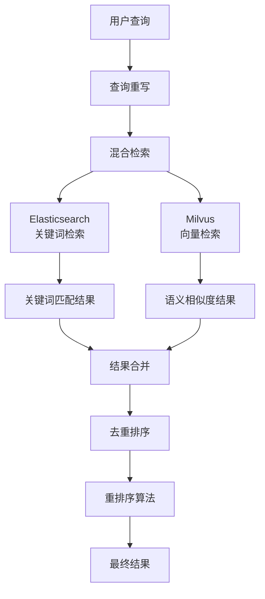

**图表来源**
- [rag_handler.py](https://github.com/Shy2593666979/AgentChat/src/backend/agentchat/services/rag_handler.py#L26-L51)

### RAG处理器集成

RagHandler类展示了Elasticsearch在RAG流程中的具体应用：

| 阶段 | Elasticsearch作用 | 操作 |
|------|-------------------|------|
| 文档索引 | 建立索引结构 | `index_es_documents()` |
| 查询检索 | 关键词匹配 | `search_documents()` |
| 结果合并 | 多源结果融合 | `mix_retrival_documents()` |
| 删除清理 | 批量删除文档 | `delete_documents()` |

**章节来源**
- [rag_handler.py](https://github.com/Shy2593666979/AgentChat/src/backend/agentchat/services/rag_handler.py#L17-L24)
- [rag_handler.py](https://github.com/Shy2593666979/AgentChat/src/backend/agentchat/services/rag_handler.py#L26-L51)

## 性能调优建议

### 分片策略配置

基于系统需求，建议的分片配置：

| 配置项 | 推荐值 | 说明 |
|--------|--------|------|
| number_of_shards | 3-5 | 根据数据量调整 |
| number_of_replicas | 1 | 高可用性保证 |
| refresh_interval | 30s | 平衡实时性和性能 |
| index.translog.durability | async | 异步日志持久化 |

### 刷新间隔优化

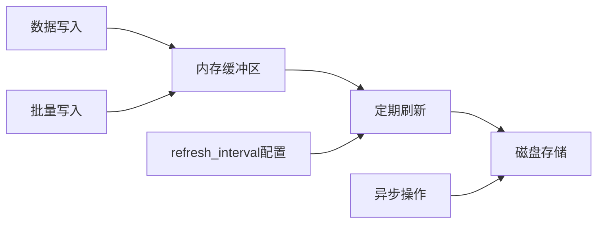

### 查询性能优化

| 优化策略 | 实现方式 | 效果 |
|----------|----------|------|
| 缓存热点查询 | Elasticsearch缓存 | 减少重复计算 |
| 查询超时控制 | timeout参数 | 防止长时间阻塞 |
| 结果集限制 | size参数 | 控制内存使用 |
| 分页查询 | scroll API | 大数据集处理 |

**章节来源**
- [es_index.py](https://github.com/Shy2593666979/AgentChat/src/backend/agentchat/config/es_index.py#L11-L12)
- [es_client.py](https://github.com/Shy2593666979/AgentChat/src/backend/agentchat/services/rag/es_client.py#L43-L43)

## 故障排除指南

### 常见问题诊断

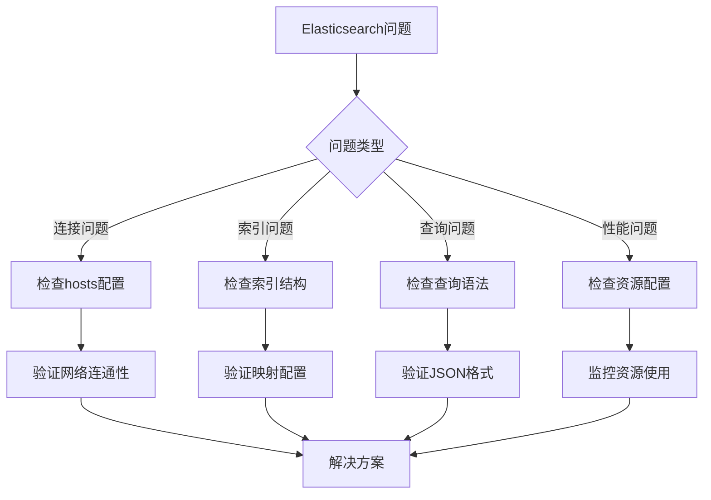

### 错误处理机制

ESClient类实现了完善的错误处理：

| 错误类型 | 处理方式 | 日志级别 |
|----------|----------|----------|
| 连接失败 | 异常捕获 | ERROR |
| 索引创建失败 | ValueError抛出 | ERROR |
| 查询超时 | 超时异常处理 | WARNING |
| 数据插入失败 | 异常记录 | ERROR |

**章节来源**
- [es_client.py](https://github.com/Shy2593666979/AgentChat/src/backend/agentchat/services/rag/es_client.py#L22-L37)
- [es_client.py](https://github.com/Shy2593666979/AgentChat/src/backend/agentchat/services/rag/es_client.py#L47-L61)

### 配置验证

系统配置验证流程：

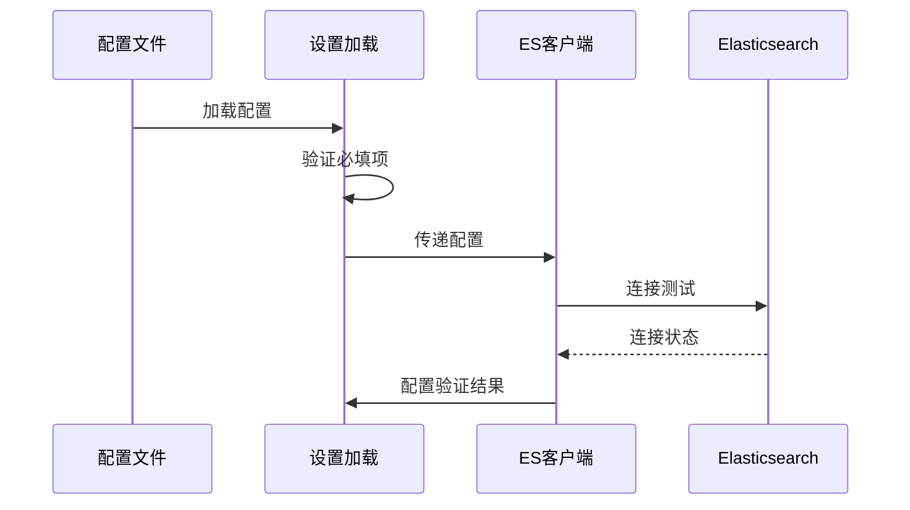

**图表来源**
- [settings.py](https://github.com/Shy2593666979/AgentChat/src/backend/agentchat/settings.py#L26-L61)
- [config.yaml](https://github.com/Shy2593666979/AgentChat/src/backend/agentchat/config.yaml#L79-L80)

## 总结

本文档全面分析了AgentChat项目中Elasticsearch的配置和使用，涵盖了从基础配置到高级优化的各个方面。主要特点包括：

1. **完整的索引配置**：通过ESIndex类实现了标准化的索引定义，支持中文分词和字段映射
2. **灵活的客户端设计**：ESClient类提供了丰富的操作接口，支持异步和同步两种模式
3. **智能查询功能**：实现了全文检索、模糊匹配和最小匹配度控制
4. **RAG系统集成**：作为混合检索的重要组成部分，与向量数据库协同工作
5. **性能优化建议**：提供了分片策略、刷新间隔和查询优化的具体建议

通过合理的配置和优化，Elasticsearch在AgentChat系统中能够高效地支持大规模文档检索和智能问答功能，为用户提供优质的检索体验。
