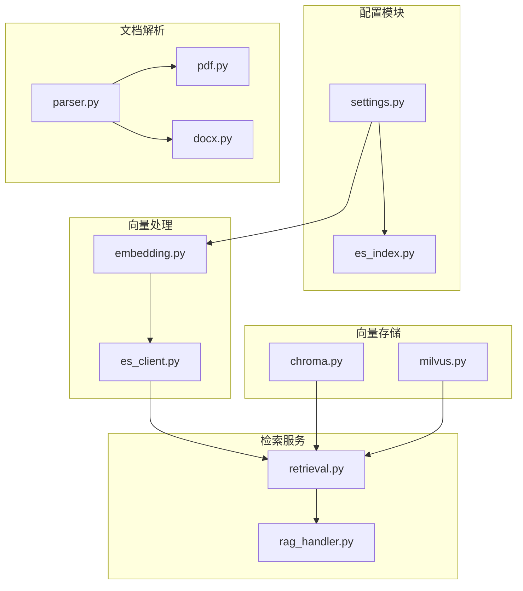
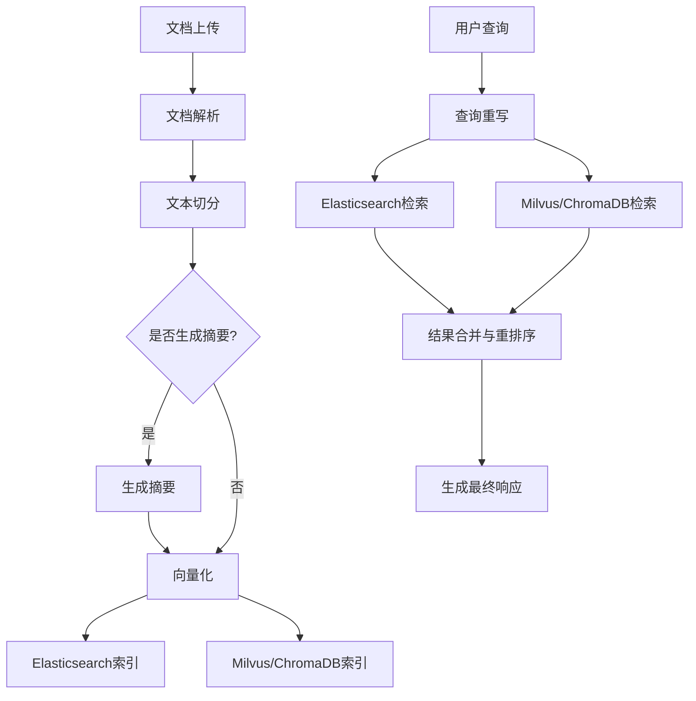
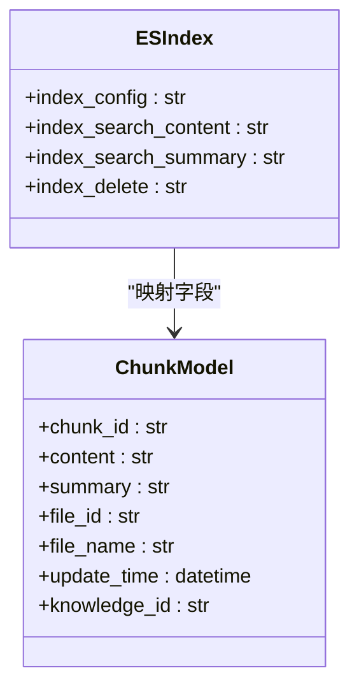
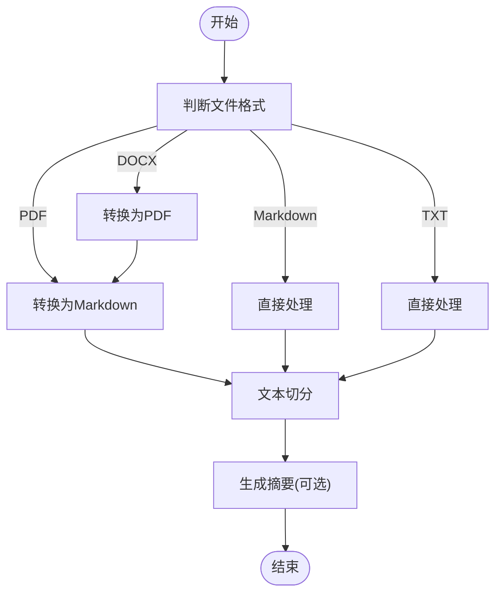
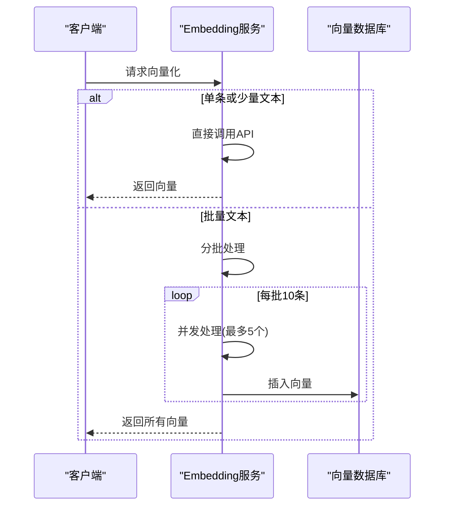
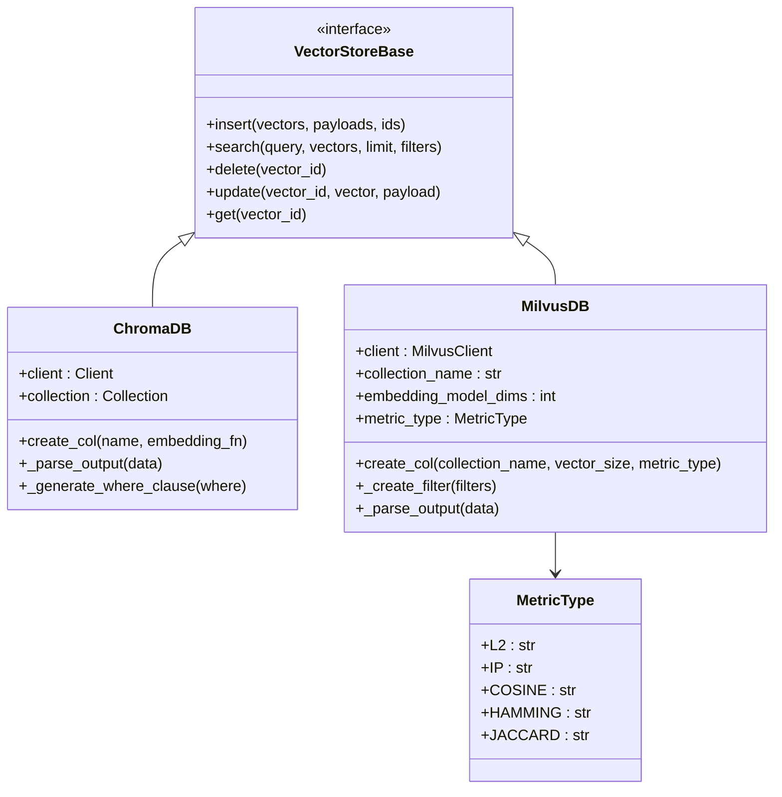
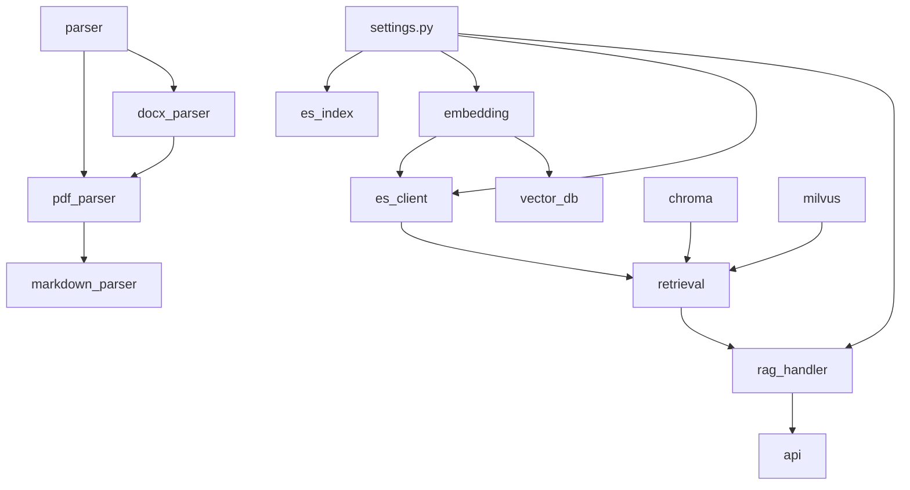

# 向量存储架构

<cite>
**本文档引用的文件**  
- [es_index.py](https://github.com/Shy2593666979/AgentChat/src/backend/agentchat/config/es_index.py)
- [embedding.py](https://github.com/Shy2593666979/AgentChat/src/backend/agentchat/services/rag/embedding.py)
- [es_client.py](https://github.com/Shy2593666979/AgentChat/src/backend/agentchat/services/rag/es_client.py)
- [parser.py](https://github.com/Shy2593666979/AgentChat/src/backend/agentchat/services/rag/parser.py)
- [doc_parser/pdf.py](https://github.com/Shy2593666979/AgentChat/src/backend/agentchat/services/rag/doc_parser/pdf.py)
- [doc_parser/docx.py](https://github.com/Shy2593666979/AgentChat/src/backend/agentchat/services/rag/doc_parser/docx.py)
- [chroma.py](https://github.com/Shy2593666979/AgentChat/src/backend/agentchat/services/memory/vector_stores/chroma.py)
- [milvus.py](https://github.com/Shy2593666979/AgentChat/src/backend/agentchat/services/memory/vector_stores/milvus.py)
- [chunk.py](https://github.com/Shy2593666979/AgentChat/src/backend/agentchat/schema/chunk.py)
- [search.py](https://github.com/Shy2593666979/AgentChat/src/backend/agentchat/schema/search.py)
- [retrieval.py](https://github.com/Shy2593666979/AgentChat/src/backend/agentchat/services/retrieval.py)
- [rag_handler.py](https://github.com/Shy2593666979/AgentChat/src/backend/agentchat/services/rag_handler.py)
- [settings.py](https://github.com/Shy2593666979/AgentChat/src/backend/agentchat/settings.py)
</cite>

## 目录
1. [简介](#简介)
2. [项目结构](#项目结构)
3. [核心组件](#核心组件)
4. [架构概述](#架构概述)
5. [详细组件分析](#详细组件分析)
6. [依赖分析](#依赖分析)
7. [性能考虑](#性能考虑)
8. [故障排除指南](#故障排除指南)
9. [结论](#结论)

## 简介
本文档详细描述了基于Elasticsearch和向量数据库（ChromaDB/Milvus）的非结构化数据存储与检索架构。系统支持PDF、DOCX等文档的解析、切分、向量化和混合检索，广泛应用于RAG（检索增强生成）系统中。文档涵盖索引配置、分词器设置、文档解析流程、向量生成机制、向量存储结构及混合检索策略。

## 项目结构
系统采用模块化设计，主要分为配置、核心服务、向量存储、文档解析和检索处理等模块。文档解析与向量处理分离，支持多种文件格式的统一处理流程。



**图示来源**  
- [es_index.py](https://github.com/Shy2593666979/AgentChat/src/backend/agentchat/config/es_index.py)
- [embedding.py](https://github.com/Shy2593666979/AgentChat/src/backend/agentchat/services/rag/embedding.py)
- [parser.py](https://github.com/Shy2593666979/AgentChat/src/backend/agentchat/services/rag/parser.py)
- [chroma.py](https://github.com/Shy2593666979/AgentChat/src/backend/agentchat/services/memory/vector_stores/chroma.py)
- [milvus.py](https://github.com/Shy2593666979/AgentChat/src/backend/agentchat/services/memory/vector_stores/milvus.py)

**本节来源**  
- [es_index.py](https://github.com/Shy2593666979/AgentChat/src/backend/agentchat/config/es_index.py)
- [embedding.py](https://github.com/Shy2593666979/AgentChat/src/backend/agentchat/services/rag/embedding.py)
- [parser.py](https://github.com/Shy2593666979/AgentChat/src/backend/agentchat/services/rag/parser.py)

## 核心组件
系统核心组件包括Elasticsearch索引配置、文档解析器、向量生成器、向量数据库客户端和混合检索处理器。Elasticsearch用于全文检索，向量数据库用于语义相似度检索，两者结合实现高效的混合检索。

**本节来源**  
- [es_index.py](https://github.com/Shy2593666979/AgentChat/src/backend/agentchat/config/es_index.py#L1-L84)
- [embedding.py](https://github.com/Shy2593666979/AgentChat/src/backend/agentchat/services/rag/embedding.py#L1-L50)
- [es_client.py](https://github.com/Shy2593666979/AgentChat/src/backend/agentchat/services/rag/es_client.py#L1-L199)

## 架构概述
系统采用分层架构，从文档上传到最终检索结果生成，经过文档解析、文本切分、摘要生成、向量化、索引存储和混合检索等多个阶段。Elasticsearch和向量数据库并行工作，通过RAG处理器协调检索结果。



**图示来源**  
- [parser.py](https://github.com/Shy2593666979/AgentChat/src/backend/agentchat/services/rag/parser.py#L1-L58)
- [embedding.py](https://github.com/Shy2593666979/AgentChat/src/backend/agentchat/services/rag/embedding.py#L1-L50)
- [es_client.py](https://github.com/Shy2593666979/AgentChat/src/backend/agentchat/services/rag/es_client.py#L1-L199)
- [milvus.py](https://github.com/Shy2593666979/AgentChat/src/backend/agentchat/services/memory/vector_stores/milvus.py#L1-L262)

## 详细组件分析

### Elasticsearch索引配置分析
Elasticsearch索引配置定义了字段映射、分词器设置和查询模板。系统使用ik_smart中文分词器，支持全文检索、模糊匹配和最小匹配度控制。



**图示来源**  
- [es_index.py](https://github.com/Shy2593666979/AgentChat/src/backend/agentchat/config/es_index.py#L44-L83)
- [chunk.py](https://github.com/Shy2593666979/AgentChat/src/backend/agentchat/schema/chunk.py#L1-L20)

**本节来源**  
- [es_index.py](https://github.com/Shy2593666979/AgentChat/src/backend/agentchat/config/es_index.py#L1-L84)
- [chunk.py](https://github.com/Shy2593666979/AgentChat/src/backend/agentchat/schema/chunk.py#L1-L20)

### 文档解析流程分析
文档解析流程支持多种文件格式，包括PDF、DOCX、Markdown和纯文本。系统将DOCX文件转换为PDF，再统一转换为Markdown格式进行处理。



**图示来源**  
- [parser.py](https://github.com/Shy2593666979/AgentChat/src/backend/agentchat/services/rag/parser.py#L13-L37)
- [pdf.py](https://github.com/Shy2593666979/AgentChat/src/backend/agentchat/services/rag/doc_parser/pdf.py#L18-L49)
- [docx.py](https://github.com/Shy2593666979/AgentChat/src/backend/agentchat/services/rag/doc_parser/docx.py#L5-L14)

**本节来源**  
- [parser.py](https://github.com/Shy2593666979/AgentChat/src/backend/agentchat/services/rag/parser.py#L1-L58)
- [pdf.py](https://github.com/Shy2593666979/AgentChat/src/backend/agentchat/services/rag/doc_parser/pdf.py#L1-L80)
- [docx.py](https://github.com/Shy2593666979/AgentChat/src/backend/agentchat/services/rag/doc_parser/docx.py#L1-L66)

### 向量生成与存储分析
向量生成使用异步OpenAI客户端，支持批量处理和并发控制。系统为每个文本块生成向量嵌入，并存储到向量数据库中。



**图示来源**  
- [embedding.py](https://github.com/Shy2593666979/AgentChat/src/backend/agentchat/services/rag/embedding.py#L11-L43)
- [chroma.py](https://github.com/Shy2593666979/AgentChat/src/backend/agentchat/services/memory/vector_stores/chroma.py#L113-L128)
- [milvus.py](https://github.com/Shy2593666979/AgentChat/src/backend/agentchat/services/memory/vector_stores/milvus.py#L99-L109)

**本节来源**  
- [embedding.py](https://github.com/Shy2593666979/AgentChat/src/backend/agentchat/services/rag/embedding.py#L1-L50)
- [chroma.py](https://github.com/Shy2593666979/AgentChat/src/backend/agentchat/services/memory/vector_stores/chroma.py#L1-L255)
- [milvus.py](https://github.com/Shy2593666979/AgentChat/src/backend/agentchat/services/memory/vector_stores/milvus.py#L1-L262)

### 向量数据库结构分析
系统支持ChromaDB和Milvus两种向量数据库。ChromaDB适用于轻量级应用，Milvus适用于大规模向量检索。



**图示来源**  
- [chroma.py](https://github.com/Shy2593666979/AgentChat/src/backend/agentchat/services/memory/vector_stores/chroma.py#L23-L255)
- [milvus.py](https://github.com/Shy2593666979/AgentChat/src/backend/agentchat/services/memory/vector_stores/milvus.py#L39-L262)
- [base.py](https://github.com/Shy2593666979/AgentChat/src/backend/agentchat/services/memory/vector_stores/base.py)

**本节来源**  
- [chroma.py](https://github.com/Shy2593666979/AgentChat/src/backend/agentchat/services/memory/vector_stores/chroma.py#L1-L255)
- [milvus.py](https://github.com/Shy2593666979/AgentChat/src/backend/agentchat/services/memory/vector_stores/milvus.py#L1-L262)

### 混合检索机制分析
系统采用混合检索策略，结合Elasticsearch的关键词检索和向量数据库的语义检索，通过重排序和结果合并提高检索质量。

```mermaid
flowchart TD
A[用户查询] --> B[查询重写]
B --> C{是否启用ES?}
C --> |是| D[Elasticsearch检索]
C --> |否| E[Milvus检索]
D --> F[结果排序]
E --> G[结果排序]
F --> H[结果合并]
G --> H
H --> I[去重(保留高分)]
I --> J[重排序]
J --> K[结果过滤]
K --> L[生成最终响应]
```

**图示来源**  
- [retrieval.py](https://github.com/Shy2593666979/AgentChat/src/backend/agentchat/services/retrieval.py#L5-L45)
- [rag_handler.py](https://github.com/Shy2593666979/AgentChat/src/backend/agentchat/services/rag_handler.py#L10-L151)
- [es_client.py](https://github.com/Shy2593666979/AgentChat/src/backend/agentchat/services/rag/es_client.py#L43-L63)

**本节来源**  
- [retrieval.py](https://github.com/Shy2593666979/AgentChat/src/backend/agentchat/services/retrieval.py#L1-L46)
- [rag_handler.py](https://github.com/Shy2593666979/AgentChat/src/backend/agentchat/services/rag_handler.py#L1-L151)

## 依赖分析
系统各组件之间存在清晰的依赖关系。文档解析模块依赖于文件转换工具，向量生成模块依赖于大模型API，检索模块依赖于存储模块。配置模块为所有组件提供参数支持。



**图示来源**  
- [settings.py](https://github.com/Shy2593666979/AgentChat/src/backend/agentchat/settings.py#L1-L62)
- [parser.py](https://github.com/Shy2593666979/AgentChat/src/backend/agentchat/services/rag/parser.py#L1-L58)
- [embedding.py](https://github.com/Shy2593666979/AgentChat/src/backend/agentchat/services/rag/embedding.py#L1-L50)
- [retrieval.py](https://github.com/Shy2593666979/AgentChat/src/backend/agentchat/services/retrieval.py#L1-L46)

**本节来源**  
- [settings.py](https://github.com/Shy2593666979/AgentChat/src/backend/agentchat/settings.py#L1-L62)
- [retrieval.py](https://github.com/Shy2593666979/AgentChat/src/backend/agentchat/services/retrieval.py#L1-L46)

## 性能考虑
系统在多个层面进行了性能优化。向量生成采用批量处理和并发控制，文档检索支持混合查询，结果处理包含去重和排序优化。建议根据数据规模选择合适的向量索引类型。

**本节来源**  
- [embedding.py](https://github.com/Shy2593666979/AgentChat/src/backend/agentchat/services/rag/embedding.py#L25-L43)
- [rag_handler.py](https://github.com/Shy2593666979/AgentChat/src/backend/agentchat/services/rag_handler.py#L30-L51)
- [milvus.py](https://github.com/Shy2593666979/AgentChat/src/backend/agentchat/services/memory/vector_stores/milvus.py#L94-L97)

## 故障排除指南
常见问题包括向量数据库连接失败、文档解析错误和检索结果不准确。检查配置文件中的连接参数，确保大模型API可用，验证文件格式兼容性。

**本节来源**  
- [es_client.py](https://github.com/Shy2593666979/AgentChat/src/backend/agentchat/services/rag/es_client.py#L25-L27)
- [chroma.py](https://github.com/Shy2593666979/AgentChat/src/backend/agentchat/services/memory/vector_stores/chroma.py#L6-L10)
- [milvus.py](https://github.com/Shy2593666979/AgentChat/src/backend/agentchat/services/memory/vector_stores/milvus.py#L9-L12)

## 结论
该向量存储架构结合了Elasticsearch和向量数据库的优势，实现了高效的非结构化数据存储与检索。通过模块化设计和混合检索策略，系统在准确性和性能之间取得了良好平衡，适用于各种RAG应用场景。