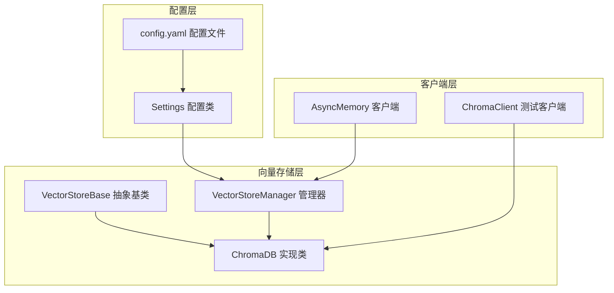
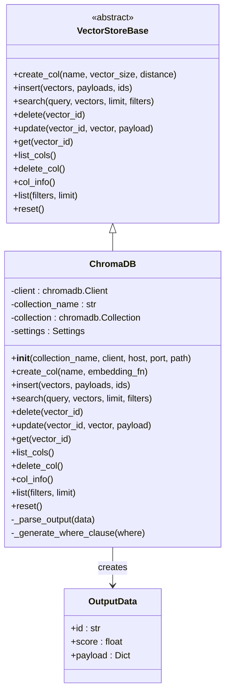
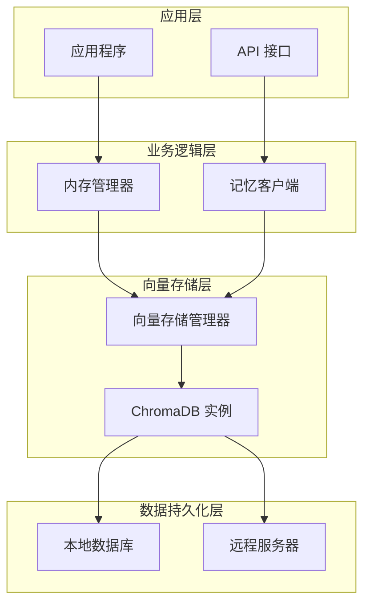
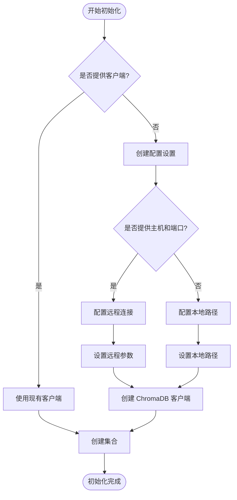
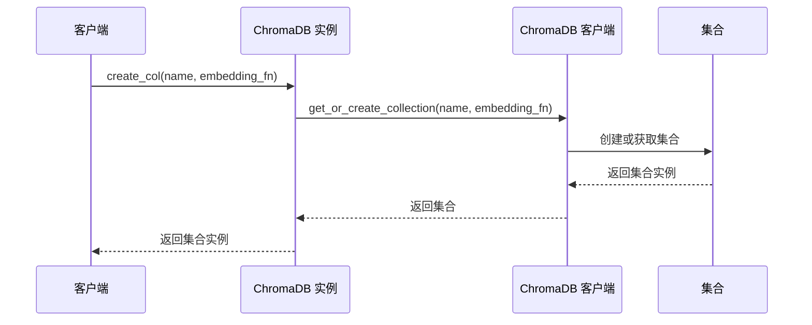
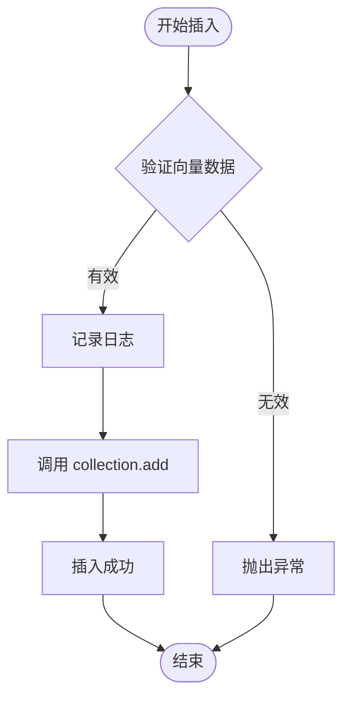
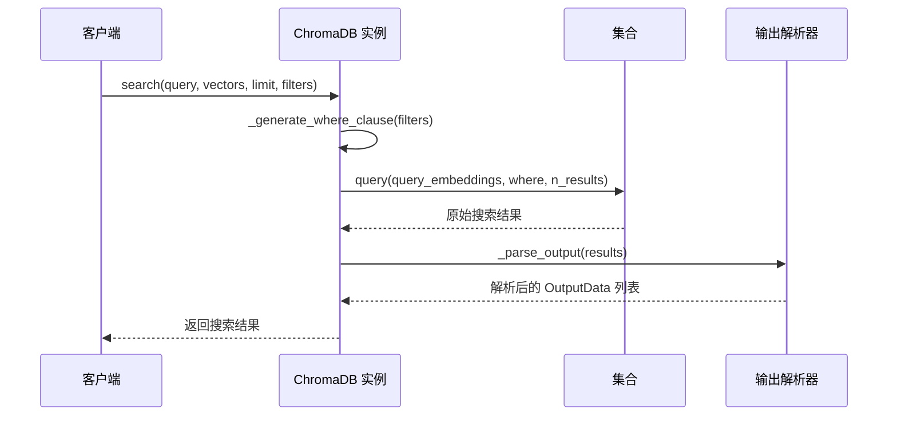
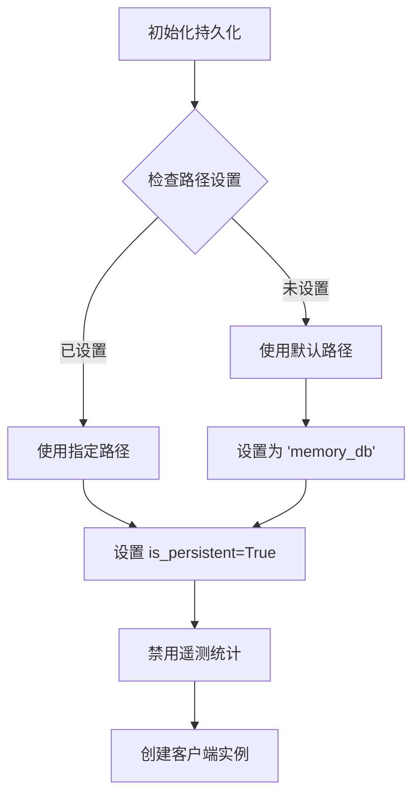
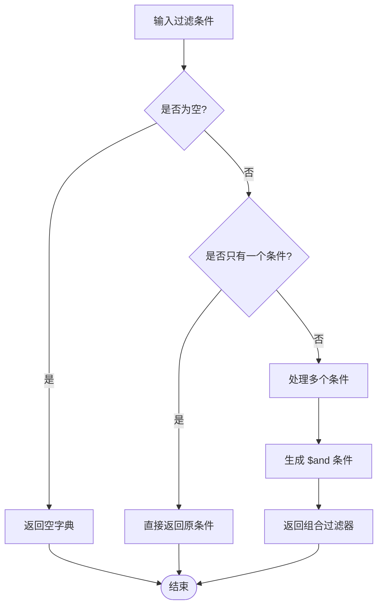
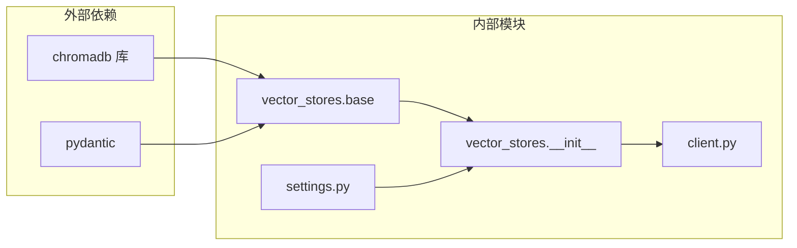

# ChromaDB 集成

## 目录
1. [简介](#简介)
2. [项目结构](#项目结构)
3. [核心组件](#核心组件)
4. [架构概览](#架构概览)
5. [详细组件分析](#详细组件分析)
6. [依赖关系分析](#依赖关系分析)
7. [性能考虑](#性能考虑)
8. [故障排除指南](#故障排除指南)
9. [结论](#结论)

## 简介

ChromaDB 是一个开源的向量数据库，专为机器学习应用程序设计。在 AgentChat 系统中，ChromaDB 作为 VectorStoreBase 的具体实现，提供了强大的向量存储和检索功能。该集成支持本地持久化存储和远程服务器连接，具备完整的集合管理和向量操作能力。

## 项目结构

ChromaDB 集成在 AgentChat 系统中的组织结构如下：



**图表来源**
- [base.py](https://github.com/Shy2593666979/AgentChat/tree/main/src/backend/agentchat/services/memory/vector_stores/base.py#L4-L58)
- [chroma.py](https://github.com/Shy2593666979/AgentChat/tree/main/src/backend/agentchat/services/memory/vector_stores/chroma.py#L23-L255)
- [__init__.py](https://github.com/Shy2593666979/AgentChat/tree/main/src/backend/agentchat/services/memory/vector_stores/__init__.py#L4-L14)

**章节来源**
- [base.py](https://github.com/Shy2593666979/AgentChat/tree/main/src/backend/agentchat/services/memory/vector_stores/base.py#L1-L59)
- [chroma.py](https://github.com/Shy2593666979/AgentChat/tree/main/src/backend/agentchat/services/memory/vector_stores/chroma.py#L1-L255)

## 核心组件

### VectorStoreBase 抽象基类

VectorStoreBase 定义了向量存储的标准接口，包含以下核心方法：

| 方法名 | 描述 | 参数 |
|--------|------|------|
| create_col | 创建新的集合 | name, vector_size, distance |
| insert | 插入向量到集合 | vectors, payloads=None, ids=None |
| search | 搜索相似向量 | query, vectors, limit=5, filters=None |
| delete | 删除指定ID的向量 | vector_id |
| update | 更新向量及其载荷 | vector_id, vector=None, payload=None |
| get | 通过ID检索向量 | vector_id |
| list_cols | 列出所有集合 | 无 |
| delete_col | 删除集合 | 无 |
| col_info | 获取集合信息 | 无 |
| list | 列出集合中的所有向量 | filters=None, limit=None |
| reset | 重置索引 | 无 |

### ChromaDB 类实现

ChromaDB 是 VectorStoreBase 的具体实现，提供了完整的向量存储功能：



**图表来源**
- [base.py](https://github.com/Shy2593666979/AgentChat/tree/main/src/backend/agentchat/services/memory/vector_stores/base.py#L4-L58)
- [chroma.py](https://github.com/Shy2593666979/AgentChat/tree/main/src/backend/agentchat/services/memory/vector_stores/chroma.py#L23-L255)

**章节来源**
- [base.py](https://github.com/Shy2593666979/AgentChat/tree/main/src/backend/agentchat/services/memory/vector_stores/base.py#L1-L59)
- [chroma.py](https://github.com/Shy2593666979/AgentChat/tree/main/src/backend/agentchat/services/memory/vector_stores/chroma.py#L1-L255)

## 架构概览

ChromaDB 集成采用分层架构设计，确保了良好的可扩展性和维护性：



**图表来源**
- [client.py](https://github.com/Shy2593666979/AgentChat/tree/main/src/backend/agentchat/services/memory/client.py#L118-L130)
- [__init__.py](https://github.com/Shy2593666979/AgentChat/tree/main/src/backend/agentchat/services/memory/vector_stores/__init__.py#L4-L14)

## 详细组件分析

### 初始化过程

ChromaDB 支持两种初始化方式：

#### 1. 本地持久化初始化

当没有提供现有客户端时，系统会创建本地持久化实例：



**图表来源**
- [chroma.py](https://github.com/Shy2593666979/AgentChat/tree/main/src/backend/agentchat/services/memory/vector_stores/chroma.py#L24-L61)

#### 2. 远程服务器连接

支持通过主机和端口连接到远程 ChromaDB 服务器：

| 配置参数 | 类型 | 描述 | 默认值 |
|----------|------|------|--------|
| host | str | 服务器主机地址 | None |
| port | int | 服务器端口号 | None |
| chroma_server_host | str | ChromaDB 服务器主机 | host 值 |
| chroma_server_http_port | int | ChromaDB HTTP 端口 | port 值 |
| chroma_api_impl | str | API 实现类型 | "chromadb.api.fastapi.FastAPI" |

### 集合管理

#### create_col 方法

创建或获取集合，支持自定义嵌入函数：



**图表来源**
- [chroma.py](https://github.com/Shy2593666979/AgentChat/tree/main/src/backend/agentchat/services/memory/vector_stores/chroma.py#L96-L111)

#### 集合操作方法

| 方法名 | 功能描述 | 返回类型 |
|--------|----------|----------|
| list_cols | 列出所有可用集合 | List[chromadb.Collection] |
| delete_col | 删除当前集合 | None |
| col_info | 获取集合详细信息 | Dict |
| delete | 删除指定ID的向量 | None |

### 向量操作

#### insert 方法

批量插入向量数据：



**图表来源**
- [chroma.py](https://github.com/Shy2593666979/AgentChat/tree/main/src/backend/agentchat/services/memory/vector_stores/chroma.py#L113-L128)

#### search 方法

执行相似度搜索：



**图表来源**
- [chroma.py](https://github.com/Shy2593666979/AgentChat/tree/main/src/backend/agentchat/services/memory/vector_stores/chroma.py#L130-L148)

#### 元数据处理

ChromaDB 使用 OutputData 模型封装搜索结果：

| 字段名 | 类型 | 描述 |
|--------|------|------|
| id | str | 向量唯一标识符 |
| score | float | 相似度分数（距离） |
| payload | Dict | 元数据载荷 |

### 持久化机制

#### persist_directory 设置

系统支持灵活的持久化配置：



**图表来源**
- [chroma.py](https://github.com/Shy2593666979/AgentChat/tree/main/src/backend/agentchat/services/memory/vector_stores/chroma.py#L45-L57)

### 相似度搜索实现

#### _generate_where_clause 方法

处理过滤条件的格式化：



**图表来源**
- [chroma.py](https://github.com/Shy2593666979/AgentChat/tree/main/src/backend/agentchat/services/memory/vector_stores/chroma.py#L233-L255)

**章节来源**
- [chroma.py](https://github.com/Shy2593666979/AgentChat/tree/main/src/backend/agentchat/services/memory/vector_stores/chroma.py#L24-L255)

## 依赖关系分析

### 主要依赖关系



**图表来源**
- [chroma.py](https://github.com/Shy2593666979/AgentChat/tree/main/src/backend/agentchat/services/memory/vector_stores/chroma.py#L1-L12)
- [base.py](https://github.com/Shy2593666979/AgentChat/tree/main/src/backend/agentchat/services/memory/vector_stores/base.py#L1-L3)

### 配置依赖

系统配置通过多层结构管理：

| 配置层级 | 文件 | 关键配置项 |
|----------|------|------------|
| 应用配置 | config.yaml | memory_collection_name, vector_db.host, vector_db.port |
| 设置管理 | settings.py | app_settings.default_config |
| 向量存储 | VectorStoreManager | get_chroma_vector() |

**章节来源**
- [config.yaml](https://github.com/Shy2593666979/AgentChat/tree/main/src/backend/agentchat/config.yaml#L112-L112)
- [settings.py](https://github.com/Shy2593666979/AgentChat/tree/main/src/backend/agentchat/settings.py#L17-L17)
- [__init__.py](https://github.com/Shy2593666979/AgentChat/tree/main/src/backend/agentchat/services/memory/vector_stores/__init__.py#L6-L10)

## 性能考虑

### 向量存储优化

1. **批量操作**：支持批量插入和更新操作，减少网络往返
2. **索引策略**：利用 ChromaDB 内置的向量索引机制
3. **内存管理**：合理配置集合大小和过期策略

### 查询优化

1. **过滤器优化**：使用高效的 WHERE 子句构建
2. **结果限制**：通过 limit 参数控制返回结果数量
3. **缓存策略**：在客户端层面实现查询结果缓存

### 持久化性能

1. **异步操作**：支持异步向量存储操作
2. **连接池**：复用 ChromaDB 客户端连接
3. **压缩存储**：利用 ChromaDB 的数据压缩功能

## 故障排除指南

### 常见问题及解决方案

#### 1. 导入错误

**问题**：无法导入 chromadb 库
**解决方案**：
```bash
pip install chromadb
```

#### 2. 连接失败

**问题**：无法连接到 ChromaDB 服务器
**排查步骤**：
- 检查主机和端口配置
- 验证网络连接
- 确认服务器状态

#### 3. 持久化问题

**问题**：数据无法持久化
**解决方案**：
- 检查 persist_directory 权限
- 验证磁盘空间
- 确认 is_persistent 设置

#### 4. 内存泄漏

**问题**：长时间运行后内存占用过高
**解决方案**：
- 定期调用 reset() 方法
- 及时清理不需要的集合
- 监控向量存储大小

**章节来源**
- [chroma.py](https://github.com/Shy2593666979/AgentChat/tree/main/src/backend/agentchat/services/memory/vector_stores/chroma.py#L6-L10)

## 结论

ChromaDB 集成为 AgentChat 系统提供了强大而灵活的向量存储解决方案。通过 VectorStoreBase 的抽象设计，系统实现了良好的可扩展性，同时保持了与不同向量数据库的兼容性。

### 主要优势

1. **灵活性**：支持本地和远程部署模式
2. **易用性**：简洁的 API 设计和丰富的功能
3. **可靠性**：完善的错误处理和数据持久化
4. **性能**：高效的向量搜索和存储机制

### 最佳实践建议

1. **配置管理**：合理设置持久化目录和连接参数
2. **监控告警**：建立向量存储状态监控机制
3. **定期维护**：执行定期的数据清理和索引重建
4. **安全考虑**：确保网络通信的安全性

通过遵循本文档的指导原则和最佳实践，开发者可以充分利用 ChromaDB 的强大功能，构建高性能的记忆管理系统。
