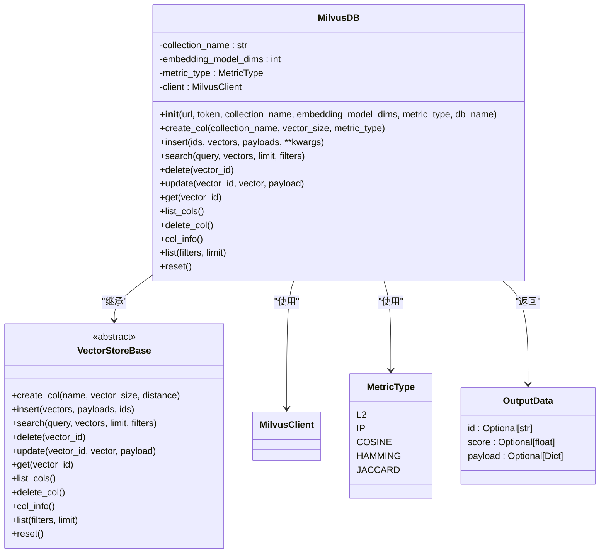
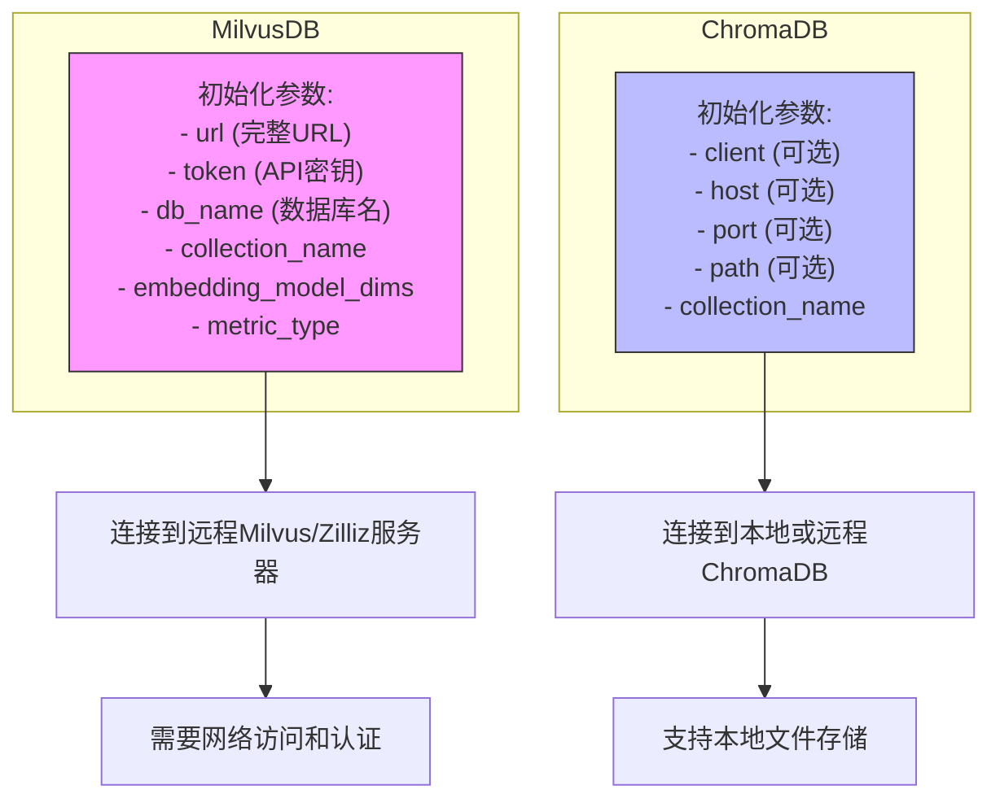
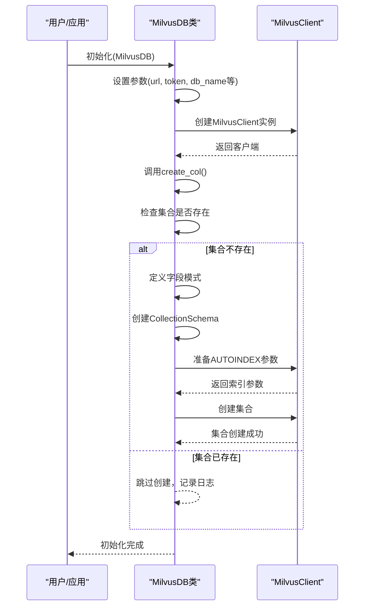
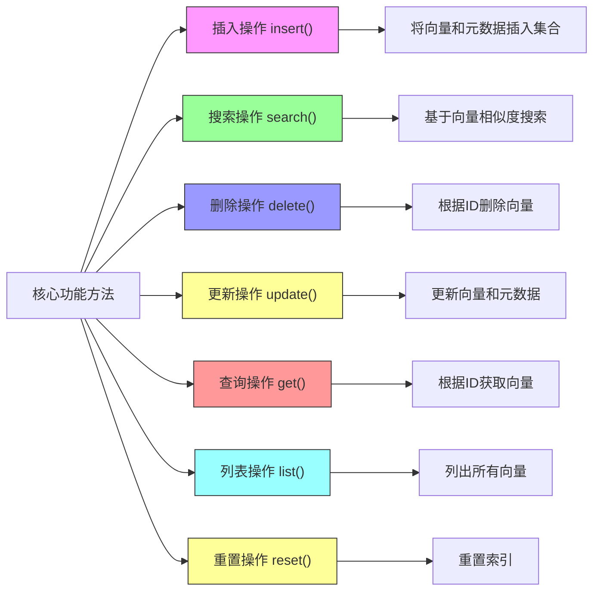

# Milvus 集成

## 目录
1. [Milvus集成概述](#milvus集成概述)
2. [MilvusDB类实现](#milvusdb类实现)
3. [与ChromaDB的差异](#与chromadb的差异)
4. [集合创建与索引配置](#集合创建与索引配置)
5. [相似度度量类型](#相似度度量类型)
6. [元数据存储机制](#元数据存储机制)
7. [配置启用方式](#配置启用方式)
8. [核心功能方法](#核心功能方法)

## Milvus集成概述

Milvus向量数据库集成是本项目中用于向量存储和检索的关键组件。通过`MilvusDB`类实现了`VectorStoreBase`抽象基类，提供了完整的向量数据库操作功能。该集成支持Milvus独立部署模式和轻量级模式，通过配置文件中的mode参数进行切换。

**Section sources**
- [milvus.py](https://github.com/Shy2593666979/AgentChat/tree/main/src/backend/agentchat/services/memory/vector_stores/milvus.py#L1-L262)
- [config.yaml](https://github.com/Shy2593666979/AgentChat/tree/main/src/backend/agentchat/config.yaml#L93-L98)

## MilvusDB类实现

`MilvusDB`类是`VectorStoreBase`的具体实现，封装了Milvus客户端的所有操作。该类在初始化时需要提供完整的连接URL、Token和数据库名，确保与Milvus/Zilliz服务器的安全连接。



**Diagram sources**
- [milvus.py](https://github.com/Shy2593666979/AgentChat/tree/main/src/backend/agentchat/services/memory/vector_stores/milvus.py#L39-L262)
- [base.py](https://github.com/Shy2593666979/AgentChat/tree/main/src/backend/agentchat/services/memory/vector_stores/base.py#L4-L58)

**Section sources**
- [milvus.py](https://github.com/Shy2593666979/AgentChat/tree/main/src/backend/agentchat/services/memory/vector_stores/milvus.py#L39-L262)
- [base.py](https://github.com/Shy2593666979/AgentChat/tree/main/src/backend/agentchat/services/memory/vector_stores/base.py#L4-L58)

## 与ChromaDB的差异

Milvus与ChromaDB在初始化和连接方式上存在显著差异。Milvus需要在初始化时提供完整的连接URL、Token和数据库名，而ChromaDB则支持多种连接方式。



**Diagram sources**
- [milvus.py](https://github.com/Shy2593666979/AgentChat/tree/main/src/backend/agentchat/services/memory/vector_stores/milvus.py#L40-L48)
- [chroma.py](https://github.com/Shy2593666979/AgentChat/tree/main/src/backend/agentchat/services/memory/vector_stores/chroma.py#L24-L31)

**Section sources**
- [milvus.py](https://github.com/Shy2593666979/AgentChat/tree/main/src/backend/agentchat/services/memory/vector_stores/milvus.py#L40-L48)
- [chroma.py](https://github.com/Shy2593666979/AgentChat/tree/main/src/backend/agentchat/services/memory/vector_stores/chroma.py#L24-L31)

## 集合创建与索引配置

Milvus的集合创建过程包含AUTOINDEX索引配置，这是其核心特性之一。当创建新集合时，系统会自动配置最优的索引策略。



**Diagram sources**
- [milvus.py](https://github.com/Shy2593666979/AgentChat/tree/main/src/backend/agentchat/services/memory/vector_stores/milvus.py#L69-L98)
- [milvus.py](https://github.com/Shy2593666979/AgentChat/tree/main/src/backend/agentchat/services/memory/vector_stores/milvus.py#L62-L67)

**Section sources**
- [milvus.py](https://github.com/Shy2593666979/AgentChat/tree/main/src/backend/agentchat/services/memory/vector_stores/milvus.py#L69-L98)

## 相似度度量类型

Milvus支持多种相似度度量类型，通过`MetricType`枚举类定义。这些度量类型用于向量搜索时的相似性计算。

```mermaid
classDiagram
class MetricType {
<<enumeration>>
L2
IP
COSINE
HAMMING
JACCARD
}
class MilvusDB {
-metric_type : MetricType
+__init__(..., metric_type : MetricType, ...)
+create_col(..., metric_type : MetricType = MetricType.COSINE)
}
MilvusDB --> MetricType : "使用"
note right of MetricType
L2 : 欧几里得距离
IP : 内积相似度
COSINE : 余弦相似度
HAMMING : 汉明距离
JACCARD : 杰卡德距离
end note
```

**Diagram sources**
- [milvus.py](https://github.com/Shy2593666979/AgentChat/tree/main/src/backend/agentchat/services/memory/vector_stores/milvus.py#L25-L38)
- [milvus.py](https://github.com/Shy2593666979/AgentChat/tree/main/src/backend/agentchat/services/memory/vector_stores/milvus.py#L46-L47)

**Section sources**
- [milvus.py](https://github.com/Shy2593666979/AgentChat/tree/main/src/backend/agentchat/services/memory/vector_stores/milvus.py#L25-L38)

## 元数据存储机制

Milvus使用JSON字段存储元数据，提供了灵活的元数据管理能力。所有元数据都存储在名为"metadata"的JSON类型字段中。

```mermaid
erDiagram
COLLECTION {
VARCHAR id PK
FLOAT_VECTOR vectors
JSON metadata
}
METADATA {
string user_id
string agent_id
string run_id
string file_id
string knowledge_id
string update_time
string file_name
string chunk_id
string summary
}
COLLECTION ||--o{ METADATA : "包含"
note right of COLLECTION
集合结构:
- id: 主键，VARCHAR类型
- vectors: 向量数据，FLOAT_VECTOR
- metadata: 元数据，JSON类型
end note
note right of METADATA
支持的元数据字段:
- 用户相关: user_id
- 代理相关: agent_id, run_id
- 文件相关: file_id, file_name
- 知识库相关: knowledge_id
- 内容相关: chunk_id, summary
end note
```

**Diagram sources**
- [milvus.py](https://github.com/Shy2593666979/AgentChat/tree/main/src/backend/agentchat/services/memory/vector_stores/milvus.py#L87-L90)
- [milvus.py](https://github.com/Shy2593666979/AgentChat/tree/main/src/backend/agentchat/services/memory/vector_stores/milvus.py#L111-L127)

**Section sources**
- [milvus.py](https://github.com/Shy2593666979/AgentChat/tree/main/src/backend/agentchat/services/memory/vector_stores/milvus.py#L87-L90)

## 配置启用方式

通过`config.yaml`文件中的`vector_db`配置，可以使用`mode: 'standalone'`或`'lite'`来启用Milvus。系统根据配置模式自动选择相应的客户端实现。

```mermaid
flowchart TD
A["读取config.yaml配置"] --> B{mode值判断}
B --> |mode == 'chroma'| C["使用ChromaClient"]
B --> |mode == 'lite'| D["使用MilvusLiteClient"]
B --> |其他值| E["使用MilvusClient"]
C --> F["连接到ChromaDB"]
D --> G["连接到轻量级Milvus"]
E --> H["连接到独立Milvus"]
style C fill:#f96,stroke:#333
style D fill:#6f9,stroke:#333
style E fill:#69f,stroke:#333
note right of B
配置路径:
rag.vector_db.mode
end note
note right of C
适用场景:
- 本地开发
- 轻量级应用
end note
note right of D
适用场景:
- 移动端
- 边缘计算
end note
note right of E
适用场景:
- 生产环境
- 高性能需求
end note
```

**Diagram sources**
- [config.yaml](https://github.com/Shy2593666979/AgentChat/tree/main/src/backend/agentchat/config.yaml#L94-L97)
- [__init__.py](https://github.com/Shy2593666979/AgentChat/tree/main/src/backend/agentchat/services/rag/vector_db/__init__.py#L7-L12)

**Section sources**
- [config.yaml](https://github.com/Shy2593666979/AgentChat/tree/main/src/backend/agentchat/config.yaml#L94-L97)
- [__init__.py](https://github.com/Shy2593666979/AgentChat/tree/main/src/backend/agentchat/services/rag/vector_db/__init__.py#L7-L12)

## 核心功能方法

MilvusDB类实现了VectorStoreBase定义的所有核心方法，提供了完整的向量数据库操作功能。



**Diagram sources**
- [milvus.py](https://github.com/Shy2593666979/AgentChat/tree/main/src/backend/agentchat/services/memory/vector_stores/milvus.py#L99-L261)

**Section sources**
- [milvus.py](https://github.com/Shy2593666979/AgentChat/tree/main/src/backend/agentchat/services/memory/vector_stores/milvus.py#L99-L261)
