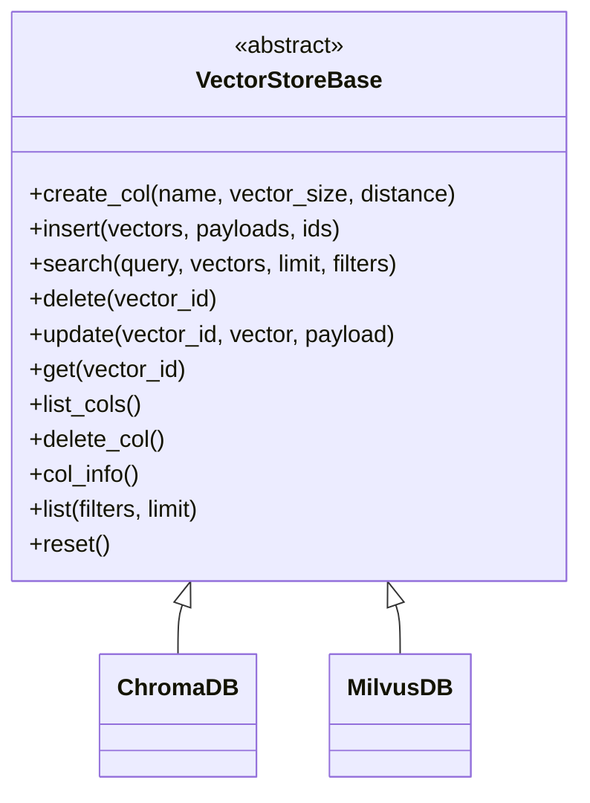
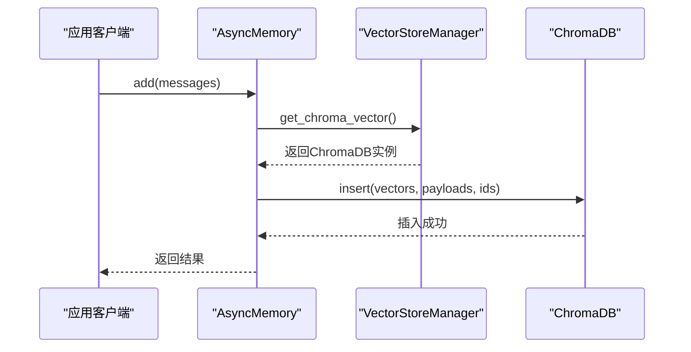
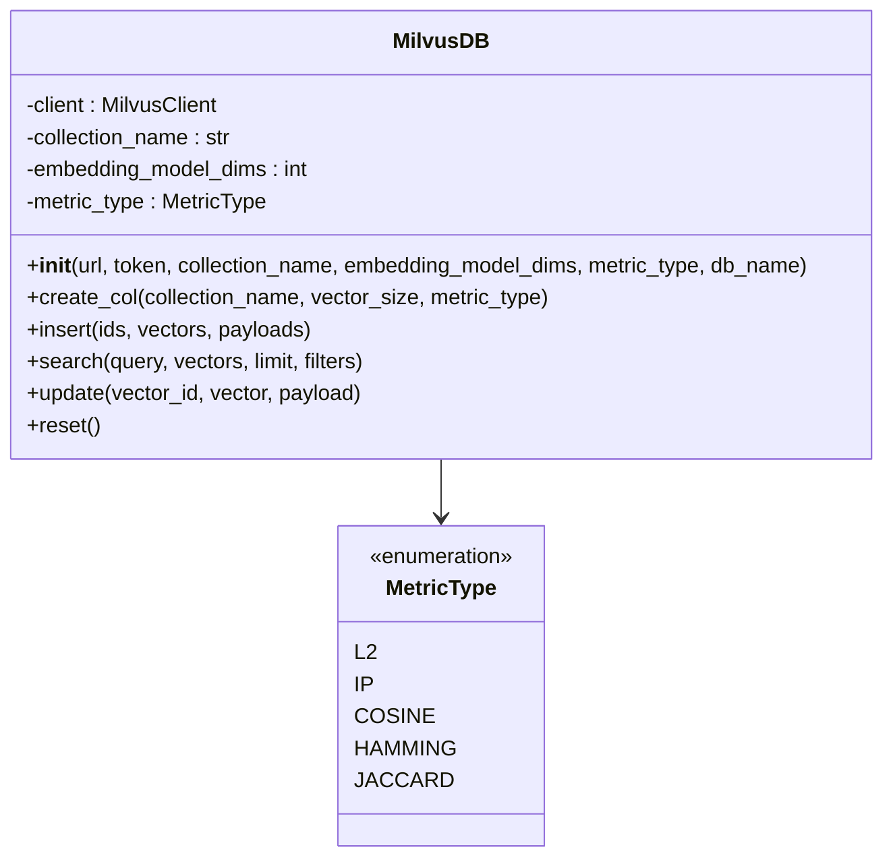
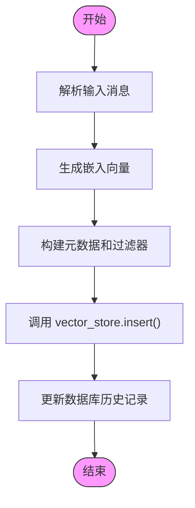

# 向量数据库集成

## 目录
1. [简介](#简介)
2. [统一向量存储接口设计](#统一向量存储接口设计)
3. [ChromaDB实现](#chromadb实现)
4. [Milvus实现](#milvus实现)
5. [向量数据库实现的关键差异](#向量数据库实现的关键差异)
6. [向量存储管理器](#向量存储管理器)
7. [向量数据操作流程](#向量数据操作流程)
8. [选择与迁移策略](#选择与迁移策略)
9. [结论](#结论)

## 简介
本文档详细介绍了基于`VectorStoreBase`抽象类的向量数据库集成方案，涵盖ChromaDB和Milvus两种实现。文档阐述了统一的向量存储接口设计原则，分析了两种具体实现类在连接配置、集合管理、相似度度量和持久化机制方面的关键差异，并解释了`VectorStoreManager`如何根据配置选择和实例化具体的向量数据库客户端。通过`client.py`中的方法，展示了向量数据的写入、检索和管理的实际调用流程。

## 统一向量存储接口设计
系统通过`VectorStoreBase`抽象基类定义了统一的向量存储接口，为上层应用提供了与具体数据库实现解耦的编程模型。该接口定义了向量数据库操作的核心方法，确保了不同实现之间的行为一致性。



**图示来源**
- [base.py](https://github.com/Shy2593666979/AgentChat/src/backend/agentchat/services/memory/vector_stores/base.py#L4-L58)

**本节来源**
- [base.py](https://github.com/Shy2593666979/AgentChat/src/backend/agentchat/services/memory/vector_stores/base.py#L4-L58)

### 核心接口方法
`VectorStoreBase`定义了以下核心方法：

- **create_col**: 创建新的集合，参数包括集合名称、向量维度和距离度量方式。
- **insert**: 将向量及其关联的元数据（payloads）和ID插入到集合中。
- **search**: 在集合中搜索与查询向量最相似的向量，支持限制返回数量和应用过滤器。
- **delete**: 根据ID删除指定的向量。
- **update**: 更新指定ID的向量数据和元数据。
- **get**: 根据ID检索向量及其元数据。
- **list_cols**: 列出所有可用的集合。
- **delete_col**: 删除整个集合。
- **col_info**: 获取集合的详细信息。
- **list**: 列出集合中的所有向量，支持过滤和分页。
- **reset**: 通过删除并重新创建集合来重置索引。

这种抽象设计使得上层应用可以使用相同的代码逻辑与不同的向量数据库交互，极大地提高了系统的可维护性和可扩展性。

## ChromaDB实现
ChromaDB的实现通过`ChromaDB`类完成，该类继承自`VectorStoreBase`，提供了具体的数据库操作逻辑。

### 连接与配置
`ChromaDB`的初始化方法支持多种连接模式：
- **现有客户端**: 可以传入一个已存在的`chromadb.Client`实例进行复用。
- **远程服务器**: 通过`host`和`port`参数连接到远程的ChromaDB服务器。
- **本地持久化**: 当未指定`host`和`port`时，会使用本地文件系统进行持久化，默认路径为`memory_db`。

其持久化机制通过`Settings`类的`persist_directory`和`is_persistent`属性实现，确保数据在应用重启后不会丢失。

### 集合管理
`create_col`方法使用`get_or_create_collection`来创建或获取集合。与基类接口不同，该方法的参数为`name`和可选的`embedding_fn`（嵌入函数），而不是`vector_size`和`distance`。这是因为ChromaDB的集合创建更侧重于指定嵌入函数，而向量维度和距离度量通常由嵌入函数本身决定。

### 相似度度量
ChromaDB的相似度度量是在创建集合时，通过嵌入函数的配置来隐式确定的，而不是在`create_col`方法中直接指定。这与基类的设计有所不同，体现了ChromaDB API的设计哲学。

### 数据操作
- **insert**: 调用`collection.add`方法，将向量、ID和元数据批量添加到集合中。
- **search**: 使用`collection.query`进行查询，通过`_generate_where_clause`方法将过滤器转换为ChromaDB支持的格式。
- **update**: 调用`collection.update`方法更新向量和元数据。
- **reset**: 通过`delete_col`和`create_col`的组合操作来重置集合。



**图示来源**
- [chroma.py](https://github.com/Shy2593666979/AgentChat/src/backend/agentchat/services/memory/vector_stores/chroma.py#L23-L232)
- [client.py](https://github.com/Shy2593666979/AgentChat/src/backend/agentchat/services/memory/client.py#L118-L800)

**本节来源**
- [chroma.py](https://github.com/Shy2593666979/AgentChat/src/backend/agentchat/services/memory/vector_stores/chroma.py#L23-L232)

## Milvus实现
Milvus的实现通过`MilvusDB`类完成，同样继承自`VectorStoreBase`，但其设计更紧密地遵循了Milvus原生API的特性。

### 连接与配置
`MilvusDB`的初始化需要更详细的连接信息：
- **url**: Milvus/Zilliz服务器的完整URL。
- **token**: 用于Zilliz云服务的认证令牌。
- **db_name**: 数据库名称。
- **collection_name**: 集合名称。
- **embedding_model_dims**: 嵌入模型的维度。
- **metric_type**: 明确指定的相似度度量类型。

它使用`MilvusClient`进行连接，这与ChromaDB的`Client`类在概念上相似，但API和配置方式不同。

### 集合管理
`create_col`方法在创建集合时，会显式地定义集合的模式（Schema），包括：
- `id`字段: 作为主键的字符串字段。
- `vectors`字段: 存储浮点向量的字段，其维度由`vector_size`参数指定。
- `metadata`字段: 存储JSON格式元数据的字段。

此外，它还会为向量字段创建索引，使用`AUTOINDEX`索引类型和指定的`metric_type`。

### 相似度度量
Milvus通过`MetricType`枚举类明确定义了支持的相似度度量方式，包括：
- **L2**: 欧几里得距离
- **IP**: 内积（Inner Product）
- **COSINE**: 余弦相似度
- **HAMMING**: 汉明距离
- **JACCARD**: 杰卡德距离

这与ChromaDB的隐式度量方式形成鲜明对比，提供了更精细的控制。

### 数据操作
- **insert**: 与ChromaDB不同，它需要将ID、向量和元数据组合成一个字典，然后调用`client.insert`。
- **search**: 使用`client.search`进行查询，通过`_create_filter`方法将过滤器转换为Milvus支持的字符串表达式（如`metadata["user_id"] == "123"`）。
- **update**: 调用`client.upsert`方法，该方法兼具更新和插入的功能。
- **reset**: 通过`drop_collection`和`create_col`的组合操作来重置集合。



**图示来源**
- [milvus.py](https://github.com/Shy2593666979/AgentChat/src/backend/agentchat/services/memory/vector_stores/milvus.py#L39-L262)

**本节来源**
- [milvus.py](https://github.com/Shy2593666979/AgentChat/src/backend/agentchat/services/memory/vector_stores/milvus.py#L39-L262)

## 向量数据库实现的关键差异
| 特性 | ChromaDB | Milvus |
| :--- | :--- | :--- |
| **连接配置** | 支持本地持久化路径或远程主机/端口 | 需要完整的URL、Token和数据库名称 |
| **集合管理** | 使用`get_or_create_collection`，更简单 | 显式定义Schema和索引，更复杂但更灵活 |
| **相似度度量** | 由嵌入函数隐式决定 | 通过`MetricType`枚举显式指定 |
| **持久化机制** | 通过`Settings`配置`persist_directory` | 由Milvus服务器本身管理，通常是持久化的 |
| **过滤器处理** | 将字典转换为ChromaDB的`$and`查询格式 | 将字典转换为字符串表达式（如`metadata["key"] == "value"`） |
| **更新操作** | `update`方法 | `upsert`方法（更新或插入） |
| **依赖库** | `chromadb` | `pymilvus` |

这些差异反映了两种数据库在设计理念上的不同：ChromaDB更注重易用性和快速上手，而Milvus则提供了更强大的功能和更精细的控制，适用于大规模、高性能的生产环境。

## 向量存储管理器
`VectorStoreManager`是一个工厂类，负责根据配置创建和返回具体的向量数据库客户端实例。

### 实现分析
目前的实现位于`vector_stores/__init__.py`文件中，其核心方法是`get_chroma_vector`和`get_milvus_vector`。

- **get_chroma_vector**: 该方法已实现，它从`app_settings`中读取`memory_collection_name`配置，然后创建并返回一个`ChromaDB`实例。这表明系统当前默认使用ChromaDB。
- **get_milvus_vector**: 该方法存在但未实现（`pass`），这说明Milvus的支持可能尚未完成或需要进一步配置。

```python
class VectorStoreManager:
    @classmethod
    def get_chroma_vector(cls):
        return ChromaDB(
            collection_name=app_settings.default_config.get("memory_collection_name")
        )

    @classmethod
    def get_milvus_vector(cls):
        pass # 未实现
```

这种设计模式允许上层应用通过`VectorStoreManager.get_chroma_vector()`这样的调用来获取客户端，而无需关心具体的实现细节。未来可以通过扩展`VectorStoreManager`，根据配置文件中的一个开关（如`vector_db_type: "milvus"`）来动态选择返回ChromaDB还是Milvus的实例。

**本节来源**
- [__init__.py](https://github.com/Shy2593666979/AgentChat/src/backend/agentchat/services/memory/vector_stores/__init__.py#L4-L14)

## 向量数据操作流程
向量数据的写入、检索和管理流程主要通过`AsyncMemory`类（位于`client.py`）协调完成。

### 写入流程 (_add_to_vector_store)
1.  **消息解析**: 应用调用`add`方法传入消息。
2.  **元数据构建**: `_build_filters_and_metadata`函数根据`user_id`、`agent_id`等参数构建存储元数据和查询过滤器。
3.  **嵌入生成**: 使用`embedding_model`将消息内容转换为向量。
4.  **内存创建**: 调用`_create_memory`方法。
5.  **向量插入**: 在`_create_memory`中，最终调用`vector_store.insert`方法，将生成的向量、ID和包含元数据的有效载荷插入到向量数据库中。
6.  **历史记录**: 同时，将操作记录到数据库的`MemoryHistoryDao`中。

### 检索流程 (_search_vector_store)
1.  **查询发起**: 应用调用`search`方法传入查询文本。
2.  **嵌入生成**: 使用`embedding_model`将查询文本转换为向量。
3.  **向量搜索**: 调用`vector_store.search`方法，传入查询向量和过滤器。
4.  **结果处理**: 将数据库返回的原始结果（包含ID、分数和元数据）解析为`MemoryItem`对象。
5.  **返回结果**: 将格式化后的结果返回给应用。



**图示来源**
- [client.py](https://github.com/Shy2593666979/AgentChat/src/backend/agentchat/services/memory/client.py#L203-L736)

**本节来源**
- [client.py](https://github.com/Shy2593666979/AgentChat/src/backend/agentchat/services/memory/client.py#L203-L736)

## 选择与迁移策略
### 选择策略
- **选择ChromaDB**: 适用于开发、测试或小型应用。其优势在于部署简单、易于使用、对Python生态集成良好，且支持本地文件持久化，非常适合快速原型开发。
- **选择Milvus**: 适用于需要高性能、高并发、大规模数据处理的生产环境。Milvus作为专业的向量数据库，在分布式架构、索引优化和查询性能上具有显著优势，尤其适合云原生和微服务架构。

### 迁移策略
从ChromaDB迁移到Milvus需要一个谨慎的计划：
1.  **评估与准备**: 评估数据量、查询负载和性能要求。准备Milvus服务器环境。
2.  **实现Milvus客户端**: 完成`VectorStoreManager.get_milvus_vector`方法的实现，确保其能正确连接到Milvus集群。
3.  **数据迁移**: 编写脚本，从ChromaDB中读取所有向量和元数据，然后使用Milvus客户端将其批量插入到新的Milvus集合中。注意处理ID和元数据的映射。
4.  **配置切换**: 修改应用配置，将`vector_db_type`从`chroma`切换到`milvus`。
5.  **测试与验证**: 在非生产环境中进行全面测试，验证数据完整性、查询准确性和性能表现。
6.  **上线部署**: 在确认无误后，将变更部署到生产环境。

由于`VectorStoreBase`的抽象设计，应用层的代码几乎不需要修改，主要工作集中在`VectorStoreManager`的配置和数据迁移脚本上。

## 结论
本文档详细分析了基于`VectorStoreBase`抽象类的向量数据库集成方案。系统通过统一的接口设计实现了对ChromaDB和Milvus的支持，`VectorStoreManager`作为工厂类负责实例化具体的客户端。ChromaDB实现侧重于易用性和便捷的本地持久化，而Milvus实现则提供了更强大的功能和更高的性能，适用于生产环境。尽管当前Milvus的工厂方法尚未实现，但整体架构为未来的扩展和迁移提供了坚实的基础。开发者可以根据应用的具体需求选择合适的向量数据库，并利用清晰的抽象层来管理数据的写入、检索和管理流程。
