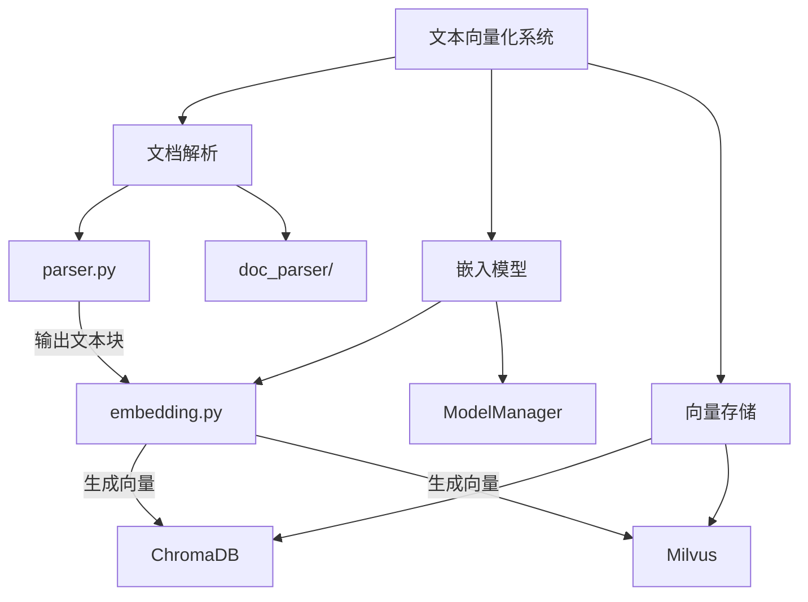
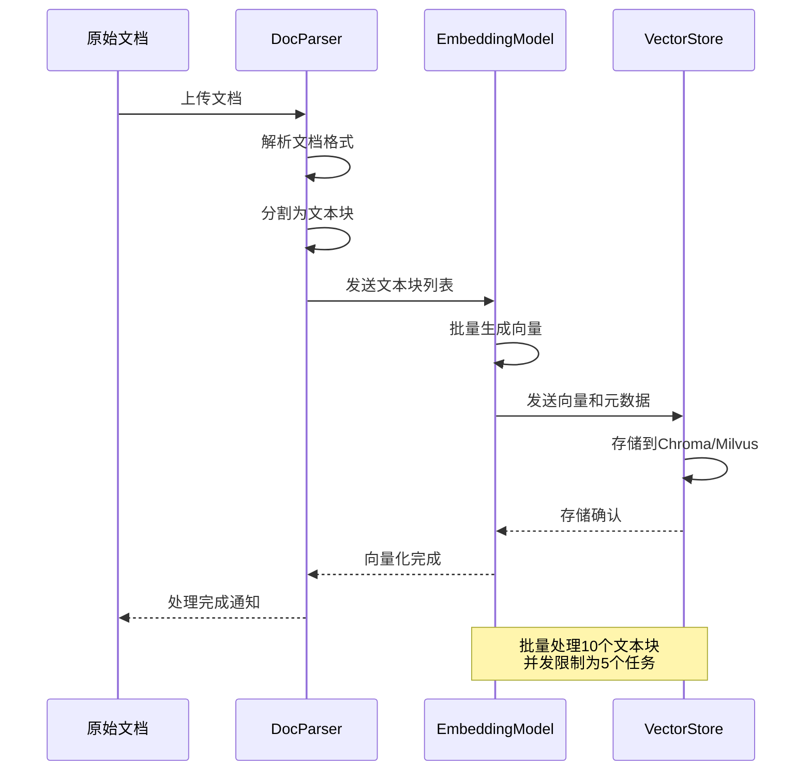
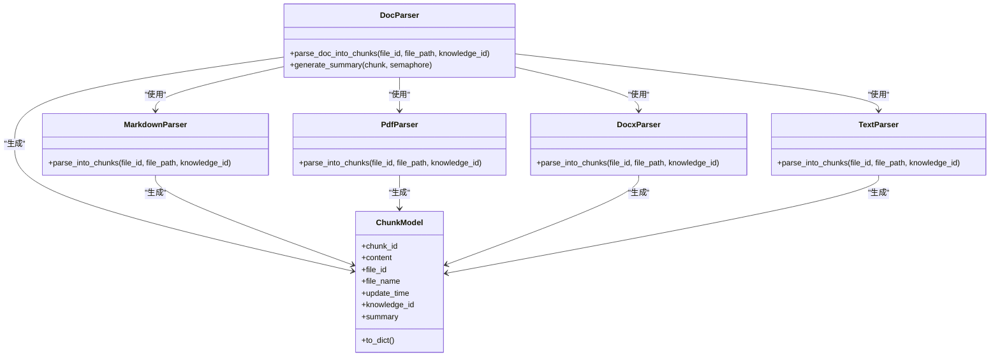
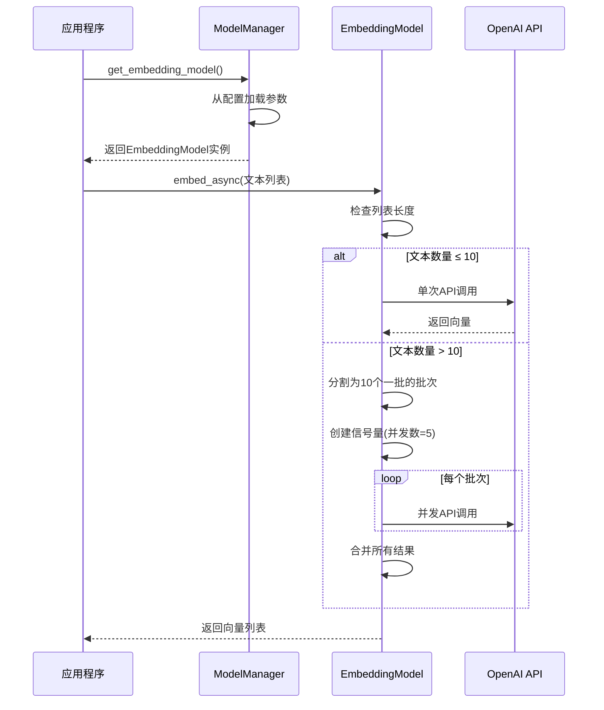
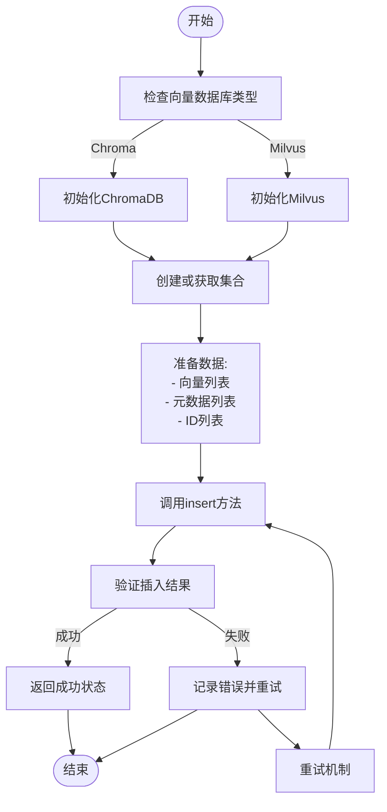
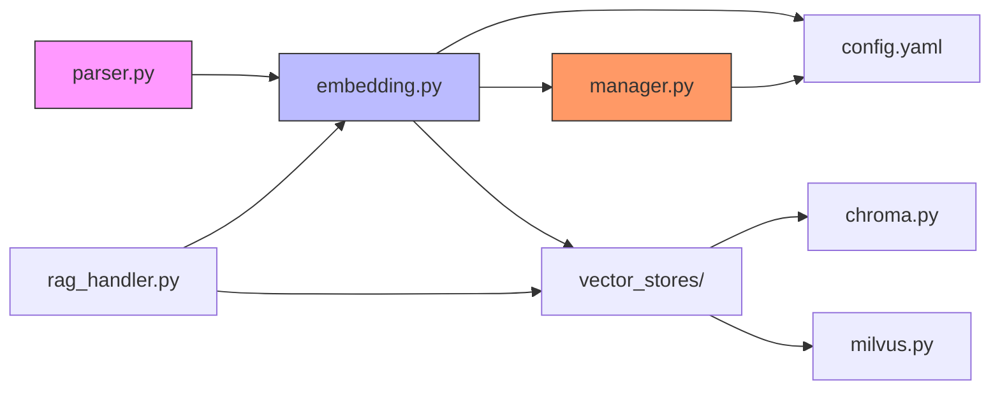

# 文本向量化

## 目录
1. [简介](#简介)
2. [项目结构](#项目结构)
3. [核心组件](#核心组件)
4. [架构概述](#架构概述)
5. [详细组件分析](#详细组件分析)
6. [依赖分析](#依赖分析)
7. [性能考虑](#性能考虑)
8. [故障排除指南](#故障排除指南)
9. [结论](#结论)

## 简介
本文档详细说明了AgentChat系统中文本向量化的实现过程。重点分析了`embedding.py`如何利用`ModelManager`加载配置的嵌入模型（如text-embedding系列），并将`parser.py`输出的文本块（ChunkModel）批量转换为向量表示。文档解释了向量化过程中的批处理机制、并发控制、错误重试策略以及与向量数据库（如Chroma/Milvus）的写入集成方式。通过代码示例展示了从文本块到向量存储的完整流水线，包括元数据注入、向量维度一致性校验和性能调优参数（如batch_size）。同时讨论了模型切换、向量质量评估及资源消耗监控等高级话题。

## 项目结构
AgentChat项目的文本向量化功能主要分布在`src/backend/agentchat`目录下的多个子模块中。核心功能分布在`core/models`和`services/rag`两个主要目录中，其中`core/models`包含基础模型管理，`services/rag`包含文档解析和向量处理服务。

**图示来源**
- [parser.py](https://github.com/Shy2593666979/AgentChat/tree/main/src/backend/agentchat/services/rag/parser.py#L1-L58)
- [embedding.py](https://github.com/Shy2593666979/AgentChat/tree/main/src/backend/agentchat/core/models/embedding.py#L1-L60)
- [chroma.py](https://github.com/Shy2593666979/AgentChat/tree/main/src/backend/agentchat/services/memory/vector_stores/chroma.py#L1-L255)
- [milvus.py](https://github.com/Shy2593666979/AgentChat/tree/main/src/backend/agentchat/services/memory/vector_stores/milvus.py)

**本节来源**
- [parser.py](https://github.com/Shy2593666979/AgentChat/tree/main/src/backend/agentchat/services/rag/parser.py)
- [embedding.py](https://github.com/Shy2593666979/AgentChat/tree/main/src/backend/agentchat/core/models/embedding.py)

## 核心组件
文本向量化流程的核心组件包括文档解析器（DocParser）、嵌入模型（EmbeddingModel）、模型管理器（ModelManager）和向量存储（VectorStore）。文档解析器负责将各种格式的文档分割成文本块，嵌入模型负责将文本块转换为向量表示，模型管理器负责加载和管理嵌入模型实例，向量存储负责持久化存储生成的向量。

**本节来源**
- [embedding.py](https://github.com/Shy2593666979/AgentChat/tree/main/src/backend/agentchat/core/models/embedding.py#L7-L60)
- [parser.py](https://github.com/Shy2593666979/AgentChat/tree/main/src/backend/agentchat/services/rag/parser.py#L13-L58)
- [manager.py](https://github.com/Shy2593666979/AgentChat/tree/main/src/backend/agentchat/core/models/manager.py#L10-L63)

## 架构概述
文本向量化系统的整体架构采用分层设计，从文档输入到向量存储形成完整的处理流水线。系统首先通过文档解析器将原始文档解析为结构化的文本块，然后通过嵌入模型将文本块转换为向量表示，最后将向量及其元数据存储到向量数据库中。

**图示来源**
- [parser.py](https://github.com/Shy2593666979/AgentChat/tree/main/src/backend/agentchat/services/rag/parser.py#L13-L58)
- [embedding.py](https://github.com/Shy2593666979/AgentChat/tree/main/src/backend/agentchat/core/models/embedding.py#L27-L59)
- [chroma.py](https://github.com/Shy2593666979/AgentChat/tree/main/src/backend/agentchat/services/memory/vector_stores/chroma.py#L113-L129)

## 详细组件分析

### 文档解析组件分析
文档解析组件（DocParser）负责处理多种格式的文档（PDF、DOCX、TXT、MD等），将其解析为统一的文本块结构。解析器根据文件后缀选择相应的解析器实现，并支持在解析后对文本块生成摘要。

#### 类图

**图示来源**
- [parser.py](https://github.com/Shy2593666979/AgentChat/tree/main/src/backend/agentchat/services/rag/parser.py#L13-L58)
- [chunk.py](https://github.com/Shy2593666979/AgentChat/tree/main/src/backend/agentchat/schema/chunk.py#L1-L20)
- [markdown.py](https://github.com/Shy2593666979/AgentChat/tree/main/src/backend/agentchat/services/rag/doc_parser/markdown.py)
- [pdf.py](https://github.com/Shy2593666979/AgentChat/tree/main/src/backend/agentchat/services/rag/doc_parser/pdf.py)

**本节来源**
- [parser.py](https://github.com/Shy2593666979/AgentChat/tree/main/src/backend/agentchat/services/rag/parser.py#L13-L58)
- [chunk.py](https://github.com/Shy2593666979/AgentChat/tree/main/src/backend/agentchat/schema/chunk.py#L1-L20)

### 嵌入模型组件分析
嵌入模型组件（EmbeddingModel）负责将文本内容转换为向量表示。模型通过ModelManager从配置中加载，并支持同步和异步两种调用方式。对于大量文本的处理，模型实现了批处理和并发控制机制。

#### 序列图

**图示来源**
- [embedding.py](https://github.com/Shy2593666979/AgentChat/tree/main/src/backend/agentchat/core/models/embedding.py#L7-L59)
- [manager.py](https://github.com/Shy2593666979/AgentChat/tree/main/src/backend/agentchat/core/models/manager.py#L57-L63)

**本节来源**
- [embedding.py](https://github.com/Shy2593666979/AgentChat/tree/main/src/backend/agentchat/core/models/embedding.py#L7-L59)
- [manager.py](https://github.com/Shy2593666979/AgentChat/tree/main/src/backend/agentchat/core/models/manager.py#L57-L63)

### 向量存储组件分析
向量存储组件负责将生成的向量及其元数据持久化存储到向量数据库中。系统支持Chroma和Milvus两种向量数据库，并通过统一的接口进行管理。

#### 流程图

**图示来源**
- [chroma.py](https://github.com/Shy2593666979/AgentChat/tree/main/src/backend/agentchat/services/memory/vector_stores/chroma.py#L23-L129)
- [milvus.py](https://github.com/Shy2593666979/AgentChat/tree/main/src/backend/agentchat/services/memory/vector_stores/milvus.py)
- [vector_stores/__init__.py](https://github.com/Shy2593666979/AgentChat/tree/main/src/backend/agentchat/services/memory/vector_stores/__init__.py#L4-L14)

**本节来源**
- [chroma.py](https://github.com/Shy2593666979/AgentChat/tree/main/src/backend/agentchat/services/memory/vector_stores/chroma.py#L23-L129)
- [vector_stores/__init__.py](https://github.com/Shy2593666979/AgentChat/tree/main/src/backend/agentchat/services/memory/vector_stores/__init__.py#L4-L14)

## 依赖分析
文本向量化系统的组件之间存在明确的依赖关系。文档解析器依赖于嵌入模型进行向量化处理，嵌入模型依赖于模型管理器进行实例化，而向量存储则依赖于嵌入模型生成的向量数据。

**图示来源**
- [parser.py](https://github.com/Shy2593666979/AgentChat/tree/main/src/backend/agentchat/services/rag/parser.py)
- [embedding.py](https://github.com/Shy2593666979/AgentChat/tree/main/src/backend/agentchat/core/models/embedding.py)
- [manager.py](https://github.com/Shy2593666979/AgentChat/tree/main/src/backend/agentchat/core/models/manager.py)
- [chroma.py](https://github.com/Shy2593666979/AgentChat/tree/main/src/backend/agentchat/services/memory/vector_stores/chroma.py)
- [rag_handler.py](https://github.com/Shy2593666979/AgentChat/tree/main/src/backend/agentchat/services/rag_handler.py)

**本节来源**
- [parser.py](https://github.com/Shy2593666979/AgentChat/tree/main/src/backend/agentchat/services/rag/parser.py)
- [embedding.py](https://github.com/Shy2593666979/AgentChat/tree/main/src/backend/agentchat/core/models/embedding.py)
- [manager.py](https://github.com/Shy2593666979/AgentChat/tree/main/src/backend/agentchat/core/models/manager.py)

## 性能考虑
文本向量化系统的性能优化主要体现在以下几个方面：

1. **批处理机制**：系统将文本块按每批10个进行分组处理，减少了API调用次数，提高了处理效率。
2. **并发控制**：通过`asyncio.Semaphore(5)`限制并发数为5，避免了对嵌入模型API的过度请求。
3. **异步处理**：采用异步编程模型，允许在等待API响应时处理其他任务，提高了资源利用率。
4. **配置优化**：通过配置文件集中管理嵌入模型的参数，便于性能调优和模型切换。

这些优化措施确保了系统在处理大量文档时仍能保持良好的性能表现。

## 故障排除指南
在文本向量化过程中可能遇到的常见问题及解决方案：

1. **API调用失败**：检查`config.yaml`中的API密钥和基础URL配置是否正确。
2. **向量维度不一致**：确保同一知识库中所有文档使用相同的嵌入模型。
3. **内存溢出**：对于超大文档，调整批处理大小或增加系统内存。
4. **向量数据库连接失败**：检查Chroma/Milvus服务是否正常运行，网络连接是否通畅。

**本节来源**
- [embedding.py](https://github.com/Shy2593666979/AgentChat/tree/main/src/backend/agentchat/core/models/embedding.py#L41-L42)
- [chroma.py](https://github.com/Shy2593666979/AgentChat/tree/main/src/backend/agentchat/services/memory/vector_stores/chroma.py#L23-L255)
- [config.yaml](https://github.com/Shy2593666979/AgentChat/tree/main/src/backend/agentchat/config.yaml)

## 结论
AgentChat系统的文本向量化实现了一个高效、可扩展的文档处理流水线。通过合理的架构设计和性能优化，系统能够稳定地将各种格式的文档转换为向量表示，并存储到向量数据库中。未来可以进一步优化的方向包括：实现更智能的批处理策略、增加向量质量评估机制、优化资源消耗监控等。
