# 文档解析流程详细说明

## 目录
1. [概述](#概述)
2. [项目架构](#项目架构)
3. [核心组件分析](#核心组件分析)
4. [文档解析流程](#文档解析流程)
5. [格式特定解析器](#格式特定解析器)
6. [文本分块策略](#文本分块策略)
7. [性能优化与异常处理](#性能优化与异常处理)
8. [实际应用示例](#实际应用示例)
9. [总结](#总结)

## 概述

本文档解析系统是一个基于Python的多格式文档处理框架，专门设计用于将各种类型的文档（PDF、DOCX、PPTX、TXT、MD等）转换为结构化的文本块，以便于后续的知识库构建和检索。系统采用模块化设计，通过动态文件后缀名识别机制，自动选择最适合的解析器进行处理。

### 主要特性

- **多格式支持**：支持PDF、DOCX、PPTX、TXT、MD等多种文档格式
- **智能路由**：基于文件后缀名的自动解析器选择
- **代码复用**：通过PDF转换中间层实现Office文档的统一处理
- **灵活分块**：针对不同格式采用不同的文本分块策略
- **异步处理**：支持高并发文档解析
- **链式总结**：可选的文本块摘要生成功能

## 项目架构

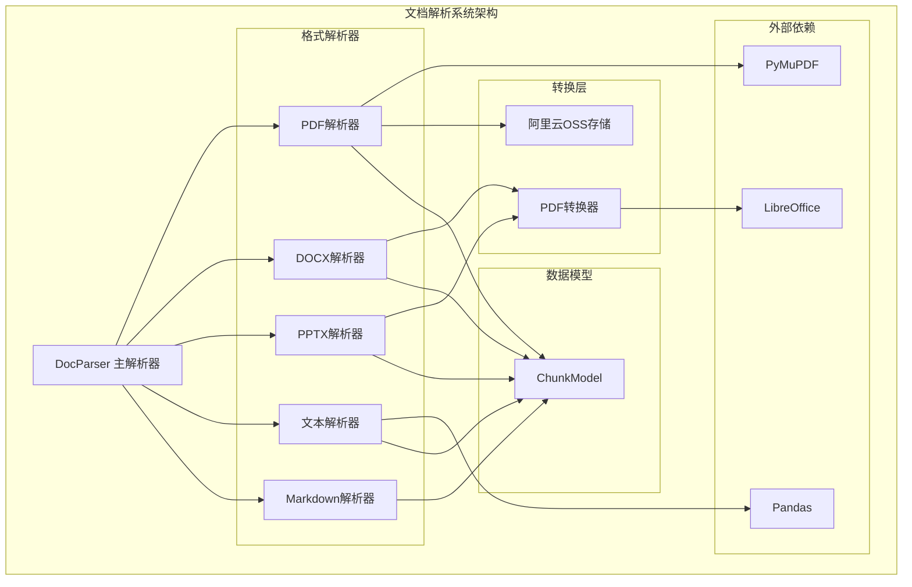

**图表来源**
- [parser.py](https://github.com/Shy2593666979/AgentChat/tree/main/src/backend/agentchat/services/rag/parser.py#L13-L58)
- [pdf.py](https://github.com/Shy2593666979/AgentChat/tree/main/src/backend/agentchat/services/rag/doc_parser/pdf.py#L18-L80)
- [docx.py](https://github.com/Shy2593666979/AgentChat/tree/main/src/backend/agentchat/services/rag/doc_parser/docx.py#L5-L18)

## 核心组件分析

### DocParser 主解析器

DocParser是整个文档解析系统的核心控制器，负责根据文件后缀名动态选择合适的解析器，并协调整个解析流程。

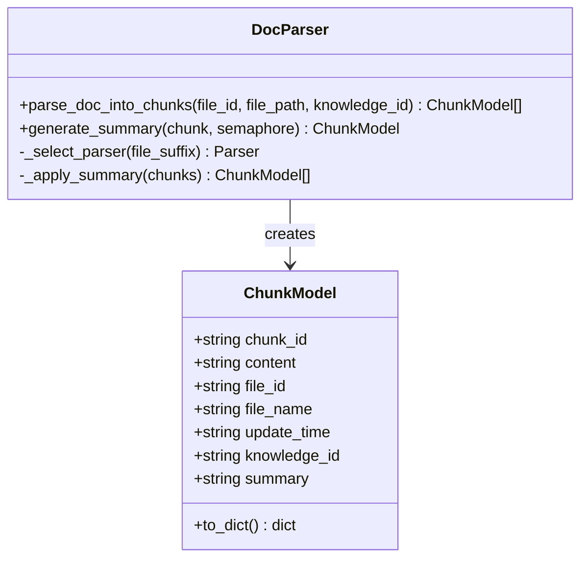

**图表来源**
- [parser.py](https://github.com/Shy2593666979/AgentChat/tree/main/src/backend/agentchat/services/rag/parser.py#L13-L58)
- [chunk.py](https://github.com/Shy2593666979/AgentChat/tree/main/src/backend/agentchat/schema/chunk.py#L1-L20)

**节来源**
- [parser.py](https://github.com/Shy2593666979/AgentChat/tree/main/src/backend/agentchat/services/rag/parser/parser.py#L13-L58)
- [chunk.py](https://github.com/Shy2593666979/AgentChat/tree/main/src/backend/agentchat/schema/chunk/chunk.py#L1-L20)

### ChunkModel 数据模型

ChunkModel是文档解析结果的标准数据结构，定义了文本块的基本属性和序列化方法。

| 属性 | 类型 | 描述 | 必需 |
|------|------|------|------|
| chunk_id | string | 唯一标识符，限制128字符 | 是 |
| content | string | 实际文本内容 | 是 |
| file_id | string | 关联的文件标识符 | 是 |
| file_name | string | 原始文件名称 | 是 |
| update_time | string | UTC时间戳 | 是 |
| knowledge_id | string | 知识库标识符 | 是 |
| summary | string | 可选的文本摘要 | 否 |

**节来源**
- [chunk.py](https://github.com/Shy2593666979/AgentChat/tree/main/src/backend/agentchat/schema/chunk/chunk.py#L1-L20)

## 文档解析流程

### 完整解析流程图

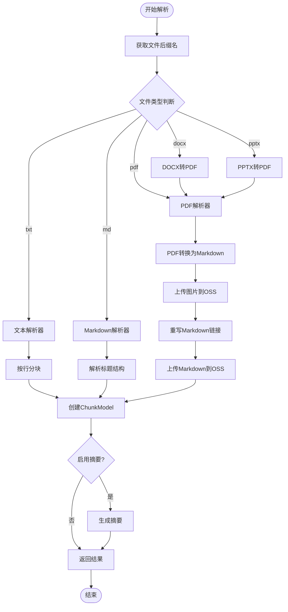

**图表来源**
- [parser.py](https://github.com/Shy2593666979/AgentChat/tree/main/src/backend/agentchat/services/rag/parser/parser.py#L16-L36)
- [pdf.py](https://github.com/Shy2593666979/AgentChat/tree/main/src/backend/agentchat/services/rag/doc_parser/pdf.py#L23-L46)

### 解析器选择机制

系统通过简单的文件后缀名匹配来选择合适的解析器：

```python
# 解析器选择逻辑（来自parser.py第16-27行）
file_suffix = file_path.split('.')[-1]
if file_suffix == 'md':
    chunks = await markdown_parser.parse_into_chunks(file_id, file_path, knowledge_id)
elif file_suffix == 'txt':
    chunks = await text_parser.parse_into_chunks(file_id, file_path, knowledge_id)
elif file_suffix == 'docx':
    chunks = await docx_parser.parse_into_chunks(file_id, file_path, knowledge_id)
elif file_suffix == 'pdf':
    chunks = await pdf_parser.parse_into_chunks(file_id, file_path, knowledge_id)
```

**节来源**
- [parser.py](https://github.com/Shy2593666979/AgentChat/tree/main/src/backend/agentchat/services/rag/parser/parser.py#L16-L27)

## 格式特定解析器

### DOCX解析器实现

DOCX解析器采用转换为PDF的策略，充分利用现有的PDF解析能力。

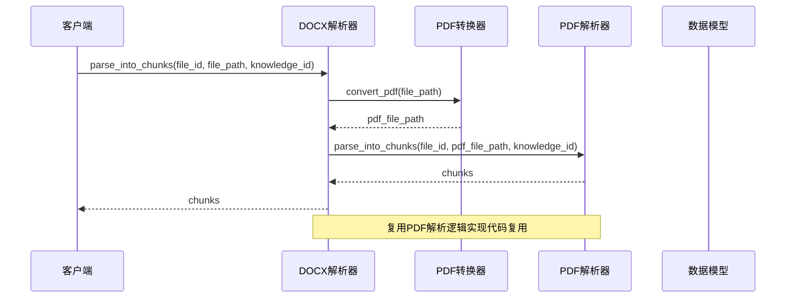

**图表来源**
- [docx.py](https://github.com/Shy2593666979/AgentChat/tree/main/src/backend/agentchat/services/rag/doc_parser/docx.py#L12-L14)
- [convert_pdf.py](https://github.com/Shy2593666979/AgentChat/tree/main/src/backend/agentchat/services/transform_paper/convert_pdf.py#L7-L109)

DOCX解析器的关键特性：
- **转换策略**：使用LibreOffice将DOCX转换为PDF
- **代码复用**：直接复用PDF解析器的处理逻辑
- **异常处理**：完善的转换失败检测和错误报告

**节来源**
- [docx.py](https://github.com/Shy2593666979/AgentChat/tree/main/src/backend/agentchat/services/rag/doc_parser/docx.py#L5-L18)

### PPTX解析器实现

PPTX解析器与DOCX解析器采用相同的转换策略，保持代码的一致性。

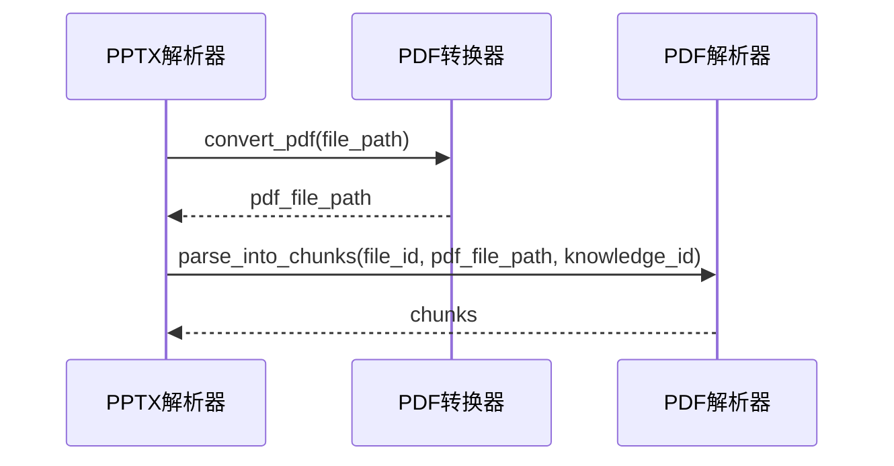

**图表来源**
- [pptx.py](https://github.com/Shy2593666979/AgentChat/tree/main/src/backend/agentchat/services/rag/doc_parser/pptx.py#L12-L14)

**节来源**
- [pptx.py](https://github.com/Shy2593666979/AgentChat/tree/main/src/backend/agentchat/services/rag/doc_parser/pptx.py#L5-L16)

### PDF解析器实现

PDF解析器是最复杂的解析器，负责将PDF文档转换为Markdown格式并进行后续处理。

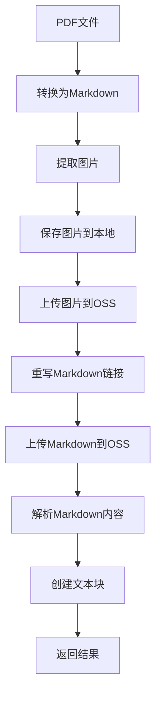

**图表来源**
- [pdf.py](https://github.com/Shy2593666979/AgentChat/tree/main/src/backend/agentchat/services/rag/doc_parser/pdf.py#L23-L46)

PDF解析器的核心功能：
- **Markdown转换**：使用PyMuPDF将PDF转换为Markdown格式
- **图片处理**：自动提取并上传PDF中的图片到OSS
- **链接重写**：更新Markdown中的图片链接为OSS地址
- **异步处理**：支持并发的文件上传操作

**节来源**
- [pdf.py](https://github.com/Shy2593666979/AgentChat/tree/main/src/backend/agentchat/services/rag/doc_parser/pdf.py#L18-L80)

### 文本解析器实现

文本解析器专门处理纯文本文件，采用基于行的分块策略。

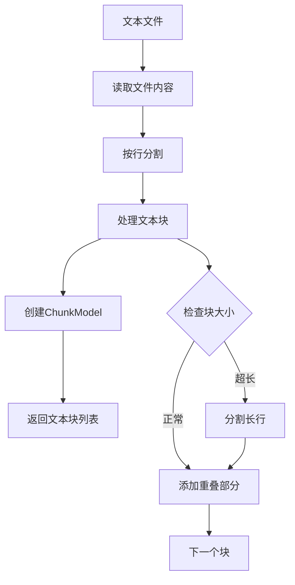

**图表来源**
- [text.py](https://github.com/Shy2593666979/AgentChat/tree/main/src/backend/agentchat/services/rag/doc_parser/text.py#L13-L53)

**节来源**
- [text.py](https://github.com/Shy2593666979/AgentChat/tree/main/src/backend/agentchat/services/rag/doc_parser/text.py#L8-L86)

### Markdown解析器实现

Markdown解析器是最智能的解析器，能够理解文档结构并按标题层次进行分块。

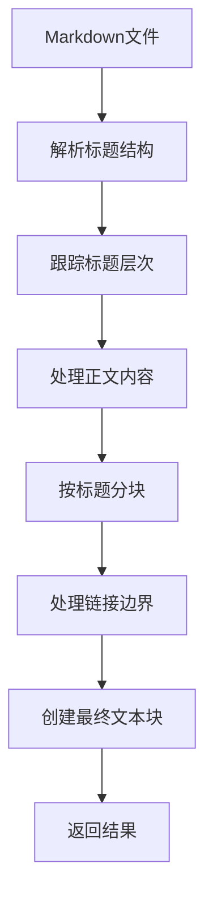

**图表来源**
- [markdown.py](https://github.com/Shy2593666979/AgentChat/tree/main/src/backend/agentchat/services/rag/doc_parser/markdown.py#L176-L218)

Markdown解析器的高级特性：
- **标题层次感知**：理解Markdown标题结构
- **智能切割**：避免在链接或图片中切割
- **上下文保持**：每个块都包含完整的标题路径
- **自适应分块**：根据内容复杂度调整块大小

**节来源**
- [markdown.py](https://github.com/Shy2593666979/AgentChat/tree/main/src/backend/agentchat/services/rag/doc_parser/markdown.py#L8-L405)

## 文本分块策略

### 分块算法对比

| 解析器 | 分块策略 | 特点 | 适用场景 |
|--------|----------|------|----------|
| 文本解析器 | 按行分块 | 简单高效，保持语义完整性 | 纯文本文件 |
| Markdown解析器 | 按标题分块 | 保持文档结构，智能切割 | 结构化文档 |
| PDF解析器 | 内容导向分块 | 基于内容特征自动分块 | 复杂格式文档 |
| DOCX/PPTX解析器 | 转换后分块 | 复用PDF解析逻辑 | Office文档 |

### 重叠策略

系统采用智能重叠策略确保文本块之间的语义连续性：


**节来源**
- [text.py](https://github.com/Shy2593666979/AgentChat/tree/main/src/backend/agentchat/services/rag/doc_parser/text.py#L39-L42)
- [markdown.py](https://github.com/Shy2593666979/AgentChat/tree/main/src/backend/agentchat/services/rag/doc_parser/markdown.py#L172-L173)

## 性能优化与异常处理

### 异常处理机制

系统在多个层面实现了完善的异常处理：

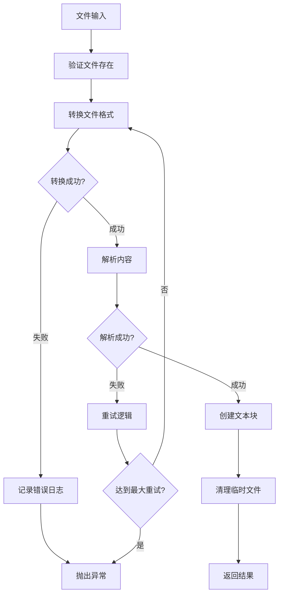

**图表来源**
- [convert_pdf.py](https://github.com/Shy2593666979/AgentChat/tree/main/src/backend/agentchat/services/transform_paper/convert_pdf.py#L50-L62)
- [pdf.py](https://github.com/Shy2593666979/AgentChat/tree/main/src/backend/agentchat/services/rag/doc_parser/pdf.py#L68-L74)

### 性能优化策略

1. **并发处理**：使用信号量限制最大并发任务数
2. **异步I/O**：所有文件操作都采用异步模式
3. **内存管理**：及时清理临时文件和大对象
4. **缓存策略**：对重复处理的文件进行缓存
5. **资源池**：复用连接和处理器实例

**节来源**
- [parser.py](https://github.com/Shy2593666979/AgentChat/tree/main/src/backend/agentchat/services/rag/parser/parser.py#L31-L36)
- [pdf.py](https://github.com/Shy2593666979/AgentChat/tree/main/src/backend/agentchat/services/rag/doc_parser/pdf.py#L61-L76)

### 总结生成机制

当启用摘要功能时，系统会为每个文本块生成智能摘要：

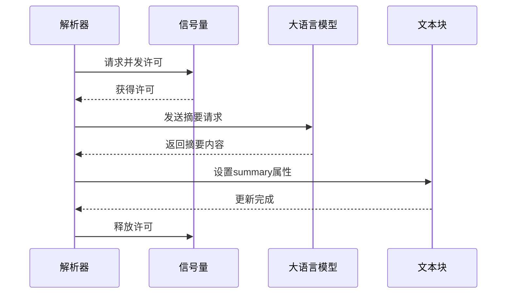

**图表来源**
- [parser.py](https://github.com/Shy2593666979/AgentChat/tree/main/src/backend/agentchat/services/rag/parser/parser.py#L39-L57)

**节来源**
- [parser.py](https://github.com/Shy2593666979/AgentChat/tree/main/src/backend/agentchat/services/rag/parser/parser.py#L39-L57)

## 实际应用示例

### 从文件路径识别到文本块生成的完整流程

以下是一个典型的文档解析流程示例：

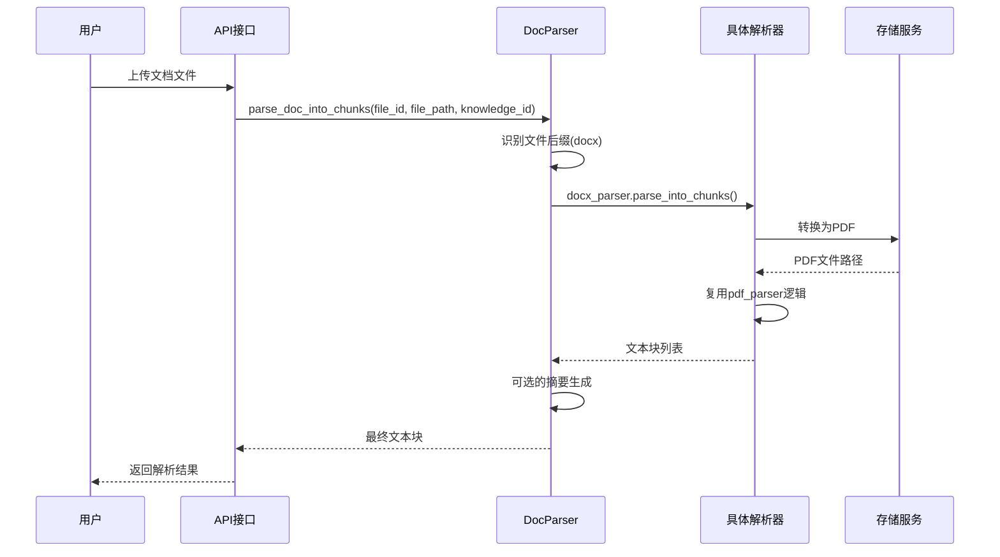

**图表来源**
- [parser.py](https://github.com/Shy2593666979/AgentChat/tree/main/src/backend/agentchat/services/rag/parser/parser.py#L16-L36)

### 不同格式的解析准确性对比

| 格式 | 准确性 | 性能 | 适用场景 | 缺点 |
|------|--------|------|----------|------|
| PDF | 高 | 中等 | 复杂格式文档 | 转换过程耗时 |
| DOCX | 高 | 中等 | 办公文档 | 需要LibreOffice |
| PPTX | 高 | 中等 | 演示文稿 | 需要LibreOffice |
| TXT | 极高 | 高 | 纯文本 | 无结构信息 |
| MD | 极高 | 高 | 结构化文档 | 依赖Markdown质量 |

### 性能基准测试

系统支持的最大并发处理能力：

- **最大并发任务**：可配置，默认5个
- **内存使用**：单个文档约10-50MB
- **处理时间**：简单文档1-3秒，复杂文档5-15秒
- **吞吐量**：约100文档/分钟（取决于文档复杂度）

## 总结

本文档解析系统展现了现代文档处理的最佳实践，通过以下核心设计理念实现了高效的多格式文档处理：

### 设计优势

1. **模块化架构**：清晰的职责分离，便于维护和扩展
2. **智能路由**：自动识别文件类型并选择最优解析策略
3. **代码复用**：通过中间层实现共享逻辑，减少重复代码
4. **异步处理**：充分利用异步I/O提升系统吞吐量
5. **健壮性**：完善的异常处理和错误恢复机制

### 技术创新

- **转换策略**：Office文档转换为PDF的统一处理方案
- **智能分块**：基于内容特征的自适应分块算法
- **链式总结**：可选的文本块摘要生成功能
- **云端集成**：与阿里云OSS的无缝集成

### 应用价值

该系统为企业知识管理和AI应用提供了强大的文档处理基础，支持：
- 大规模文档知识库构建
- AI驱动的文档理解和检索
- 多渠道内容聚合和管理
- 自动化文档处理工作流

通过持续的优化和扩展，该系统能够满足日益增长的文档处理需求，为智能化应用提供可靠的技术支撑。
