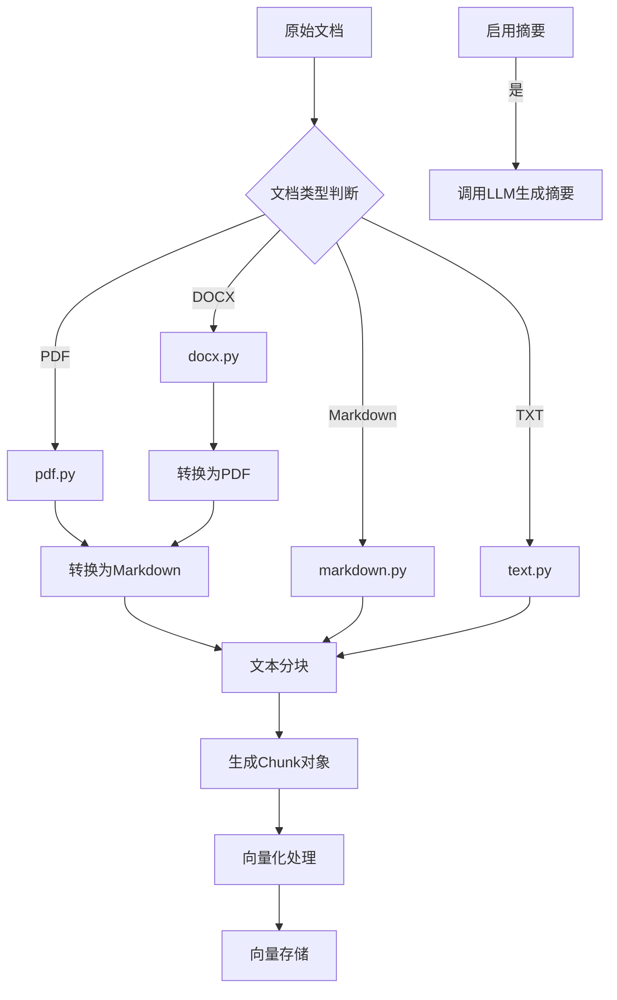
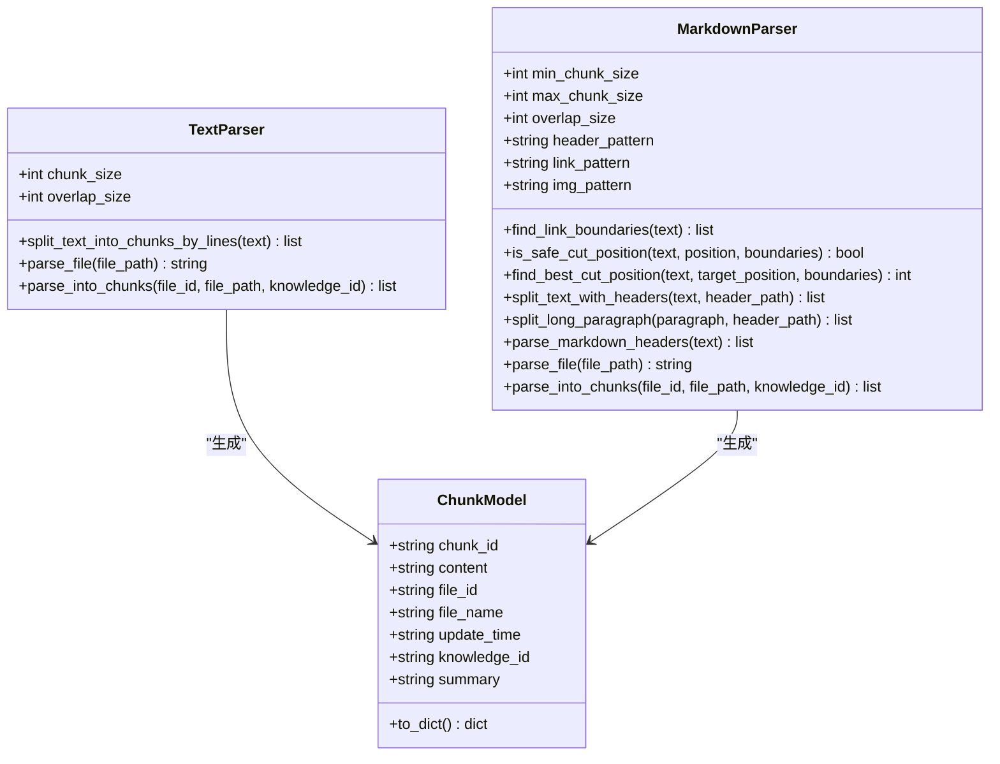
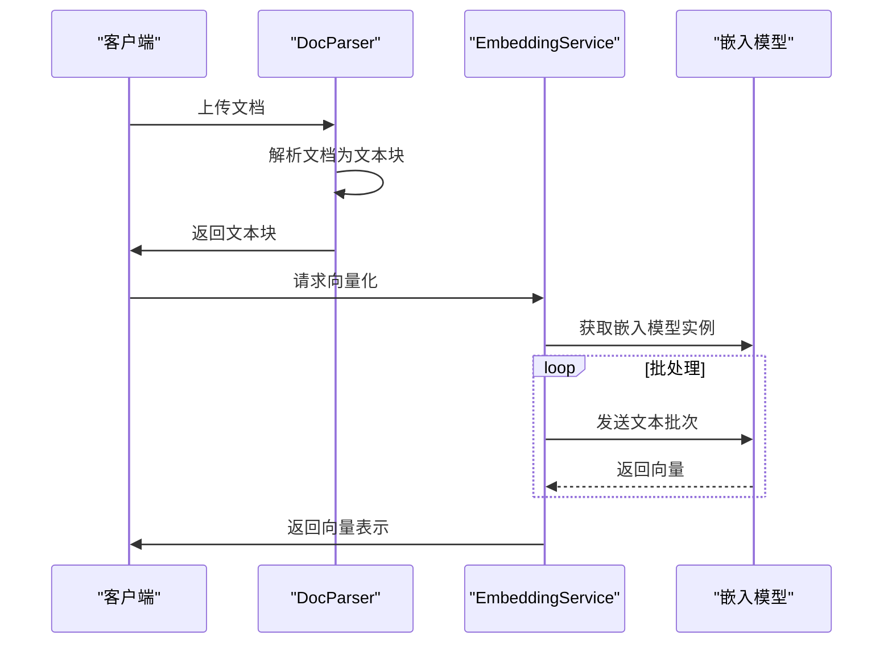
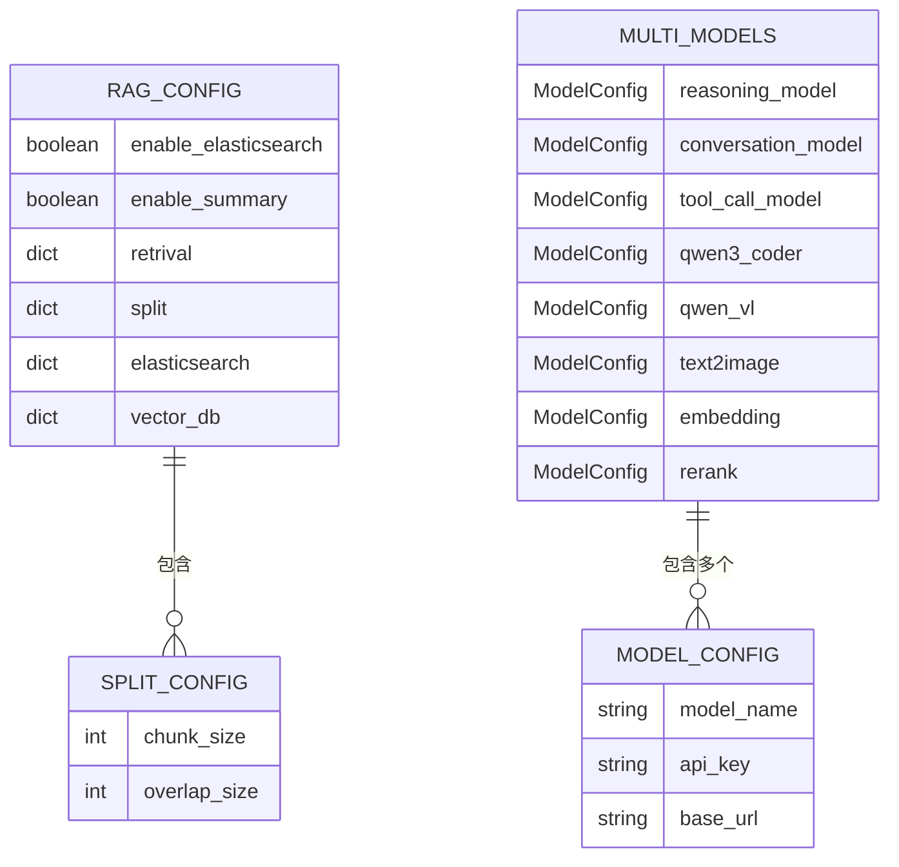
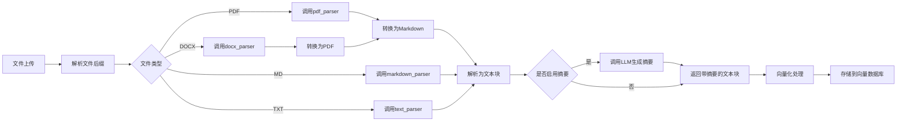

# 文档解析与向量化

## 目录
1. [简介](#简介)
2. [文档解析流程](#文档解析流程)
3. [文档解析器实现](#文档解析器实现)
4. [文本分块策略](#文本分块策略)
5. [向量化处理](#向量化处理)
6. [配置管理](#配置管理)
7. [完整处理流程](#完整处理流程)
8. [性能考量](#性能考量)

## 简介
本文档详细说明了文档解析与向量化流程的实现机制。系统通过`parser.py`协调不同文档类型的解析流程，利用`doc_parser`模块将原始文件转换为文本块（chunks），并通过`embedding.py`集成嵌入模型生成向量表示。文档还解释了文本分块策略和向量化过程中的批处理机制。

## 文档解析流程

**图示来源**
- [parser.py](https://github.com/Shy2593666979/AgentChat/src/backend/agentchat/services/rag/parser.py#L13-L37)
- [pdf.py](https://github.com/Shy2593666979/AgentChat/src/backend/agentchat/services/rag/doc_parser/pdf.py#L18-L49)
- [docx.py](https://github.com/Shy2593666979/AgentChat/src/backend/agentchat/services/rag/doc_parser/docx.py#L5-L14)

## 文档解析器实现

### PDF解析器
PDF解析器通过`pymupdf4llm`库将PDF文档转换为Markdown格式，同时提取并处理文档中的图片。转换后的Markdown文件会上传到阿里云OSS存储，并对图片链接进行重写。

**文档来源**
- [pdf.py](https://github.com/Shy2593666979/AgentChat/src/backend/agentchat/services/rag/doc_parser/pdf.py#L18-L80)

### DOCX解析器
DOCX解析器通过调用`convert_to_pdf`工具将Word文档转换为PDF格式，然后复用PDF解析器的流程进行处理。这种设计实现了代码复用，避免了重复实现相似功能。

**文档来源**
- [docx.py](https://github.com/Shy2593666979/AgentChat/src/backend/agentchat/services/rag/doc_parser/docx.py#L5-L17)

### Markdown解析器
Markdown解析器具有高级的文本分割能力，能够识别标题层级并保持上下文完整性。它会分析Markdown中的标题结构，为每个文本块添加相应的标题路径，确保语义完整性。

**文档来源**
- [markdown.py](https://github.com/Shy2593666979/AgentChat/src/backend/agentchat/services/rag/doc_parser/markdown.py#L8-L405)

### 文本解析器
文本解析器采用基于行的分割策略，按换行符切割文本，确保每个块的大小不超过配置的最大长度，并保留指定的重叠部分以维持上下文连贯性。

**文档来源**
- [text.py](https://github.com/Shy2593666979/AgentChat/src/backend/agentchat/services/rag/doc_parser/text.py#L8-L86)

## 文本分块策略

**图示来源**
- [chunk.py](https://github.com/Shy2593666979/AgentChat/src/backend/agentchat/schema/chunk.py#L1-L20)
- [text.py](https://github.com/Shy2593666979/AgentChat/src/backend/agentchat/services/rag/doc_parser/text.py#L8-L86)
- [markdown.py](https://github.com/Shy2593666979/AgentChat/src/backend/agentchat/services/rag/doc_parser/markdown.py#L8-L405)

## 向量化处理

**图示来源**
- [parser.py](https://github.com/Shy2593666979/AgentChat/src/backend/agentchat/services/rag/parser.py#L13-L37)
- [embedding.py](https://github.com/Shy2593666979/AgentChat/src/backend/agentchat/services/rag/embedding.py#L1-L50)
- [manager.py](https://github.com/Shy2593666979/AgentChat/src/backend/agentchat/core/models/manager.py#L10-L63)

### 嵌入模型管理
系统通过`ModelManager`统一管理各种模型实例，包括嵌入模型。`get_embedding_model`方法根据配置创建并返回嵌入模型实例，确保模型配置的一致性和可维护性。

**文档来源**
- [manager.py](https://github.com/Shy2593666979/AgentChat/src/backend/agentchat/core/models/manager.py#L57-L62)

### 批处理机制
向量化过程实现了智能批处理机制。对于少于等于10条的文本，直接处理；对于更多文本，则分成每组10条的批次，并通过信号量限制最大并发任务数为5，平衡了性能和资源消耗。

**文档来源**
- [embedding.py](https://github.com/Shy2593666979/AgentChat/src/backend/agentchat/services/rag/embedding.py#L24-L43)

## 配置管理

**图示来源**
- [settings.py](https://github.com/Shy2593666979/AgentChat/src/backend/agentchat/settings.py#L8-L62)
- [common.py](https://github.com/Shy2593666979/AgentChat/src/backend/agentchat/schema/common.py#L33-L66)

## 完整处理流程

**图示来源**
- [parser.py](https://github.com/Shy2593666979/AgentChat/src/backend/agentchat/services/rag/parser.py#L13-L37)
- [pdf.py](https://github.com/Shy2593666979/AgentChat/src/backend/agentchat/services/rag/doc_parser/pdf.py#L18-L80)
- [docx.py](https://github.com/Shy2593666979/AgentChat/src/backend/agentchat/services/rag/doc_parser/docx.py#L5-L17)

## 性能考量
系统在设计时充分考虑了性能优化。通过限制并发任务数、使用批处理机制和智能文本分割策略，确保了高效率的文档处理能力。同时，配置化的分块参数允许根据具体应用场景调整性能和精度的平衡。

**文档来源**
- [embedding.py](https://github.com/Shy2593666979/AgentChat/src/backend/agentchat/services/rag/embedding.py#L25-L26)
- [text.py](https://github.com/Shy2593666979/AgentChat/src/backend/agentchat/services/rag/doc_parser/text.py#L10-L11)
- [settings.py](https://github.com/Shy2593666979/AgentChat/src/backend/agentchat/settings.py#L21-L22)
