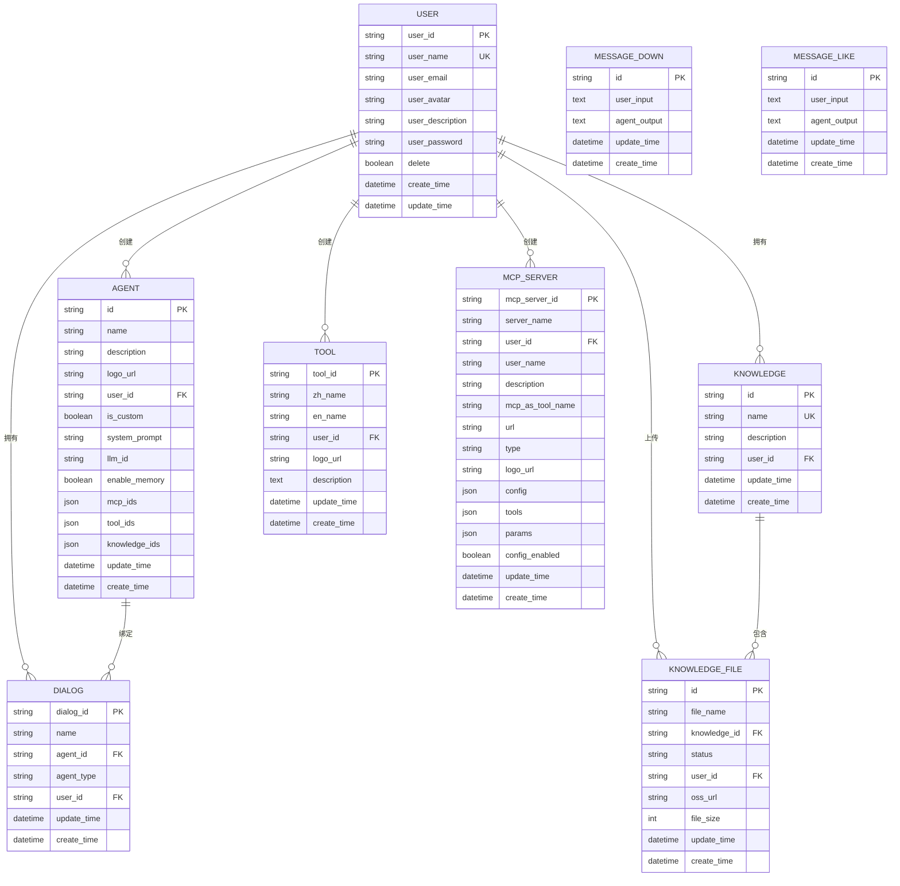

# 数据库设计

<cite>
**本文档中引用的文件**   
- [base.py](https://github.com/Shy2593666979/AgentChat/src/backend/agentchat/database/models/base.py)
- [user.py](https://github.com/Shy2593666979/AgentChat/src/backend/agentchat/database/models/user.py)
- [agent.py](https://github.com/Shy2593666979/AgentChat/src/backend/agentchat/database/models/agent.py)
- [dialog.py](https://github.com/Shy2593666979/AgentChat/src/backend/agentchat/database/models/dialog.py)
- [message.py](https://github.com/Shy2593666979/AgentChat/src/backend/agentchat/database/models/message.py)
- [knowledge.py](https://github.com/Shy2593666979/AgentChat/src/backend/agentchat/database/models/knowledge.py)
- [knowledge_file.py](https://github.com/Shy2593666979/AgentChat/src/backend/agentchat/database/models/knowledge_file.py)
- [tool.py](https://github.com/Shy2593666979/AgentChat/src/backend/agentchat/database/models/tool.py)
- [mcp_server.py](https://github.com/Shy2593666979/AgentChat/src/backend/agentchat/database/models/mcp_server.py)
- [es_index.py](https://github.com/Shy2593666979/AgentChat/src/backend/agentchat/config/es_index.py)
</cite>

## 目录
1. [简介](#简介)
2. [核心数据模型](#核心数据模型)
3. [实体关系图](#实体关系图)
4. [向量数据库与全文检索](#向量数据库与全文检索)
5. [查询性能优化建议](#查询性能优化建议)

## 简介
本项目采用SQLModel作为ORM框架，定义了多个核心数据实体，包括用户、Agent、对话、消息、知识库等。这些模型通过关系型数据库存储结构化数据，并结合向量数据库（ChromaDB/Milvus）和Elasticsearch处理非结构化数据的存储与检索。系统实现了完整的用户与Agent的1:N关系、对话与消息的1:N关系等业务逻辑。

## 核心数据模型

### 用户模型 (User)
用户表存储系统用户的基本信息和认证数据。

**字段说明：**
- `user_id`: 用户唯一标识符，主键
- `user_name`: 用户名，建立索引并保证唯一性
- `user_email`: 用户邮箱
- `user_avatar`: 用户头像URL
- `user_description`: 用户描述，默认值为"该用户很懒，没有留下一片云彩"
- `user_password`: 加密后的用户密码
- `delete`: 布尔值，标识用户是否被删除
- `create_time`: 创建时间，自动设置为当前时间戳，建立索引
- `update_time`: 更新时间，自动设置为当前时间戳，并在更新时自动更新

**业务含义：** 该模型是系统的基础身份认证实体，支持用户注册、登录和权限管理功能。

**Section sources**
- [user.py](https://github.com/Shy2593666979/AgentChat/src/backend/agentchat/database/models/user.py#L18-L112)

### Agent模型 (Agent)
Agent表存储Agent的配置信息和元数据。

**字段说明：**
- `id`: Agent唯一标识符，主键，使用UUID生成
- `name`: Agent名称
- `description`: Agent描述
- `logo_url`: Agent的logo地址，使用默认配置
- `user_id`: 绑定的用户ID，建立索引
- `is_custom`: 布尔值，标识Agent是否为用户自定义
- `system_prompt`: Agent的系统提示词
- `llm_id`: 绑定的LLM模型ID
- `enable_memory`: 布尔值，标识是否开启记忆功能
- `mcp_ids`: 绑定的MCP Server列表，使用JSON格式存储
- `tool_ids`: 绑定的工具列表，使用JSON格式存储
- `knowledge_ids`: 绑定的知识库列表，使用JSON格式存储
- `update_time`: 修改时间，自动设置为当前时间戳，并在更新时自动更新
- `create_time`: 创建时间，自动设置为当前时间戳

**业务含义：** 该模型定义了智能Agent的核心配置，支持用户创建和管理自定义Agent。

**Section sources**
- [agent.py](https://github.com/Shy2593666979/AgentChat/src/backend/agentchat/database/models/agent.py#L11-L47)

### 对话模型 (Dialog)
对话表存储对话会话的信息。

**字段说明：**
- `dialog_id`: 对话唯一标识符，主键，使用UUID生成
- `name`: 对话绑定的Agent名称
- `agent_id`: 对话绑定的Agent ID
- `agent_type`: 对话绑定的Agent类型，默认为"Agent"
- `user_id`: 对话的用户ID
- `update_time`: 修改时间，自动设置为当前时间戳，并在更新时自动更新
- `create_time`: 创建时间，自动设置为当前时间戳

**业务含义：** 该模型记录了用户与Agent之间的对话会话，支持对话历史的管理和恢复。

**Section sources**
- [dialog.py](https://github.com/Shy2593666979/AgentChat/src/backend/agentchat/database/models/dialog.py#L12-L36)

### 消息模型 (Message)
消息表存储消息记录，包括点赞和点踩的信息。

**字段说明：**
- `id`: 消息唯一标识符，主键，使用UUID生成
- `user_input`: 用户输入内容，使用Text类型存储
- `agent_output`: Agent输出内容，使用Text类型存储
- `update_time`: 修改时间，自动设置为当前时间戳，并在更新时自动更新
- `create_time`: 创建时间，自动设置为当前时间戳

**业务含义：** 该模型记录了用户与Agent之间的具体交互内容，分为点赞（message_like）和点踩（message_down）两种类型，用于收集用户反馈。

**Section sources**
- [message.py](https://github.com/Shy2593666979/AgentChat/src/backend/agentchat/database/models/message.py#L13-L58)

### 知识库模型 (Knowledge)
知识库表存储知识库条目的信息。

**字段说明：**
- `id`: 知识库唯一标识符，主键，使用自定义函数生成（前缀t_加UUID的前16位）
- `name`: 知识库名称，建立索引并保证唯一性，最大长度128字符
- `description`: 知识库描述，最大长度1024字符
- `user_id`: 创建用户ID，建立索引，最大长度128字符
- `update_time`: 修改时间，自动设置为当前时间戳，并在更新时自动更新
- `create_time`: 创建时间，自动设置为当前时间戳

**业务含义：** 该模型定义了知识库的基本信息，支持用户创建和管理自己的知识库。

**Section sources**
- [knowledge.py](https://github.com/Shy2593666979/AgentChat/src/backend/agentchat/database/models/knowledge.py#L14-L37)

### 知识库文件模型 (KnowledgeFile)
知识库文件表存储知识库文件的元数据。

**字段说明：**
- `id`: 文件唯一标识符，主键，使用UUID生成
- `file_name`: 文件名称，建立索引
- `knowledge_id`: 所属知识库ID，建立索引
- `status`: 文件解析状态，枚举值：fail（失败）、process（处理中）、success（成功），默认为success
- `user_id`: 用户ID，建立索引
- `oss_url`: 文件在OSS中的存储路径
- `file_size`: 文件大小（字节）
- `update_time`: 修改时间，自动设置为当前时间戳，并在更新时自动更新
- `create_time`: 创建时间，自动设置为当前时间戳

**业务含义：** 该模型记录了知识库中每个文件的详细信息和处理状态，支持文件上传、解析和管理。

**Section sources**
- [knowledge_file.py](https://github.com/Shy2593666979/AgentChat/src/backend/agentchat/database/models/knowledge_file.py#L16-L41)

### 工具模型 (Tool)
工具表存储工具定义的信息。

**字段说明：**
- `tool_id`: 工具唯一标识符，主键，使用UUID生成
- `zh_name`: 工具的中文名称，显示给用户
- `en_name`: 工具的英文名称，供大模型调用
- `user_id`: 创建该工具的用户ID
- `logo_url`: 工具的Logo地址
- `description`: 工具描述，使用Text类型存储，大模型根据此描述识别并调用该工具
- `update_time`: 修改时间，自动设置为当前时间戳，并在更新时自动更新
- `create_time`: 创建时间，自动设置为当前时间戳

**业务含义：** 该模型定义了可被Agent调用的工具，支持用户创建自定义工具。

**Section sources**
- [tool.py](https://github.com/Shy2593666979/AgentChat/src/backend/agentchat/database/models/tool.py#L12-L36)

### MCP服务模型 (MCP_Server)
MCP服务表存储MCP服务配置的信息。

**字段说明：**
- `mcp_server_id`: MCP服务唯一标识符，主键，使用UUID生成
- `server_name`: MCP服务名称，默认为"MCP Server"
- `user_id`: 创建该MCP服务的用户ID
- `user_name`: MCP服务创建者的名称
- `description`: MCP服务描述，用作子Agent
- `mcp_as_tool_name`: 用作子Agent时的名称
- `url`: MCP服务的连接地址
- `type`: 连接类型，限制为sse、websocket、stdio三种
- `logo_url`: MCP服务的logo地址
- `config`: 配置信息（如apikey等），使用JSON格式存储
- `tools`: MCP服务的工具列表，使用JSON格式存储
- `params`: 输入参数，使用JSON格式存储
- `config_enabled`: 布尔值，标识是否需要用户单独配置参数
- `update_time`: 修改时间，自动设置为当前时间戳，并在更新时自动更新
- `create_time`: 创建时间，自动设置为当前时间戳

**业务含义：** 该模型定义了MCP服务的配置，支持外部服务的集成和管理。

**Section sources**
- [mcp_server.py](https://github.com/Shy2593666979/AgentChat/src/backend/agentchat/database/models/mcp_server.py#L30-L62)

## 实体关系图

**Diagram sources**
- [user.py](https://github.com/Shy2593666979/AgentChat/src/backend/agentchat/database/models/user.py#L18-L112)
- [agent.py](https://github.com/Shy2593666979/AgentChat/src/backend/agentchat/database/models/agent.py#L11-L47)
- [dialog.py](https://github.com/Shy2593666979/AgentChat/src/backend/agentchat/database/models/dialog.py#L12-L36)
- [message.py](https://github.com/Shy2593666979/AgentChat/src/backend/agentchat/database/models/message.py#L13-L58)
- [knowledge.py](https://github.com/Shy2593666979/AgentChat/src/backend/agentchat/database/models/knowledge.py#L14-L37)
- [knowledge_file.py](https://github.com/Shy2593666979/AgentChat/src/backend/agentchat/database/models/knowledge_file.py#L16-L41)
- [tool.py](https://github.com/Shy2593666979/AgentChat/src/backend/agentchat/database/models/tool.py#L12-L36)
- [mcp_server.py](https://github.com/Shy2593666979/AgentChat/src/backend/agentchat/database/models/mcp_server.py#L30-L62)

## 向量数据库与全文检索

### Elasticsearch索引配置
系统使用Elasticsearch进行全文检索，索引配置如下：

**索引设置：**
- 分析器：使用ik_smart中文分词器
- 映射属性：
  - `chunk_id`: keyword类型
  - `content`: text类型，使用ik_analyzer分析器
  - `summary`: text类型，使用ik_analyzer分析器
  - `file_id`: keyword类型
  - `knowledge_id`: keyword类型
  - `file_name`: keyword类型
  - `update_time`: date类型

**查询模板：**
- 内容搜索：使用match查询，ik_smart分析器，操作符为and，最小匹配75%，支持模糊搜索，boost为2.0
- 摘要搜索：与内容搜索类似，针对摘要字段进行搜索
- 删除查询：根据file_id进行精确匹配删除

**业务含义：** 该配置支持对知识库内容的高效全文检索，特别优化了中文文本的搜索效果。

**Section sources**
- [es_index.py](https://github.com/Shy2593666979/AgentChat/src/backend/agentchat/config/es_index.py#L1-L84)

### 向量数据库（ChromaDB/Milvus）
虽然代码中没有直接体现向量数据库的具体实现，但从知识库ID的生成规则（`get_knowledge_id`函数返回以"t_"开头的ID）可以推断：
- 系统使用Milvus或ChromaDB作为向量数据库
- 知识库ID同时用作向量数据库中的集合名称
- 每个知识库对应一个独立的向量集合
- 支持基于向量相似度的语义搜索

## 查询性能优化建议

### 索引策略
1. **主键索引**：所有表都已正确设置主键，确保了数据的唯一性和快速查找。
2. **复合索引**：建议为高频查询字段创建复合索引，例如：
   - `dialog`表的`(user_id, create_time)`复合索引，优化用户对话历史查询
   - `knowledge_file`表的`(knowledge_id, status)`复合索引，优化知识库文件状态查询
3. **覆盖索引**：对于只查询部分字段的场景，考虑创建覆盖索引以避免回表查询。

### 数据分区
1. **时间分区**：对于`message_like`和`message_down`等可能快速增长的表，建议按时间（如按月）进行分区，提高查询效率和维护性能。
2. **用户分区**：对于用户相关的表，可以考虑按用户ID进行哈希分区，实现数据的水平扩展。

### 查询优化
1. **避免N+1查询**：在查询用户及其关联的Agent、对话等数据时，使用JOIN或批量查询避免多次数据库访问。
2. **分页优化**：对于大数据量的查询，使用游标分页而非基于OFFSET的分页，避免性能下降。
3. **缓存策略**：对于频繁访问但不常变更的数据（如工具列表、MCP服务列表），建议使用Redis等缓存机制。

### 其他建议
1. **JSON字段查询优化**：对于`mcp_ids`、`tool_ids`等JSON字段的查询，考虑创建GIN索引（PostgreSQL）或等效索引以提高查询性能。
2. **定期维护**：定期分析表统计信息，优化查询计划；定期清理过期数据，保持数据库性能。
3. **监控与调优**：建立数据库性能监控，及时发现慢查询并进行优化。