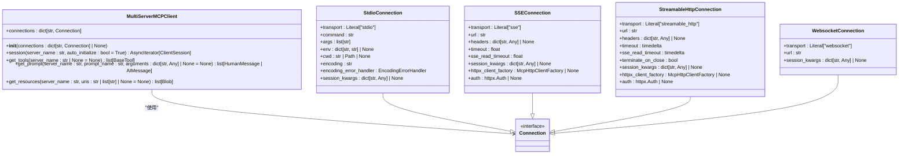
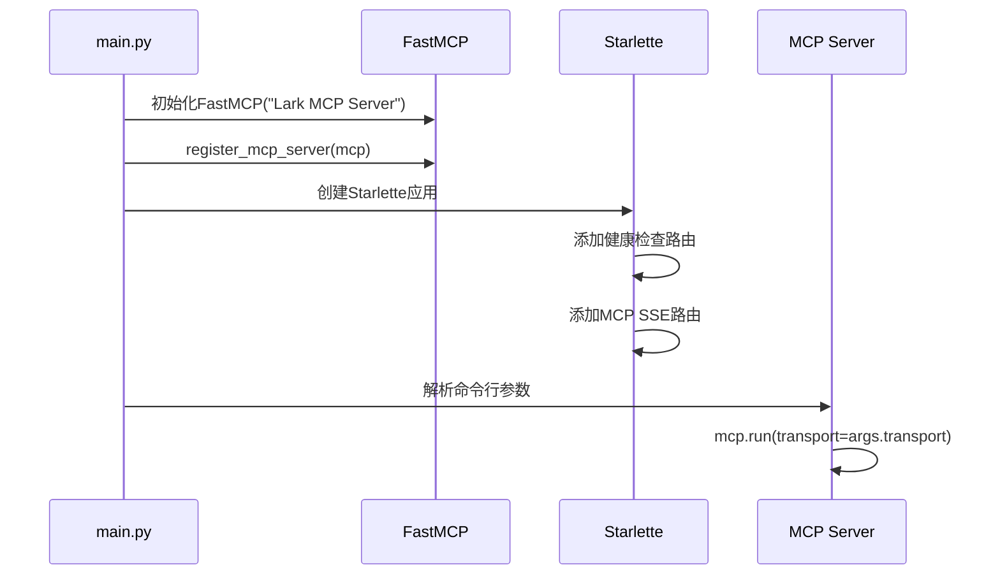
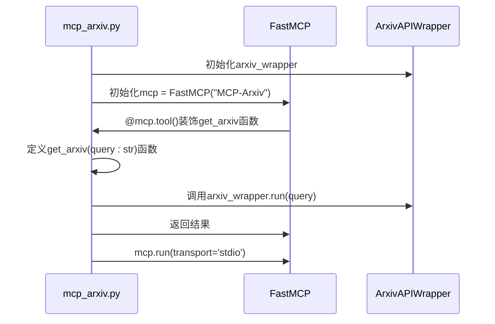
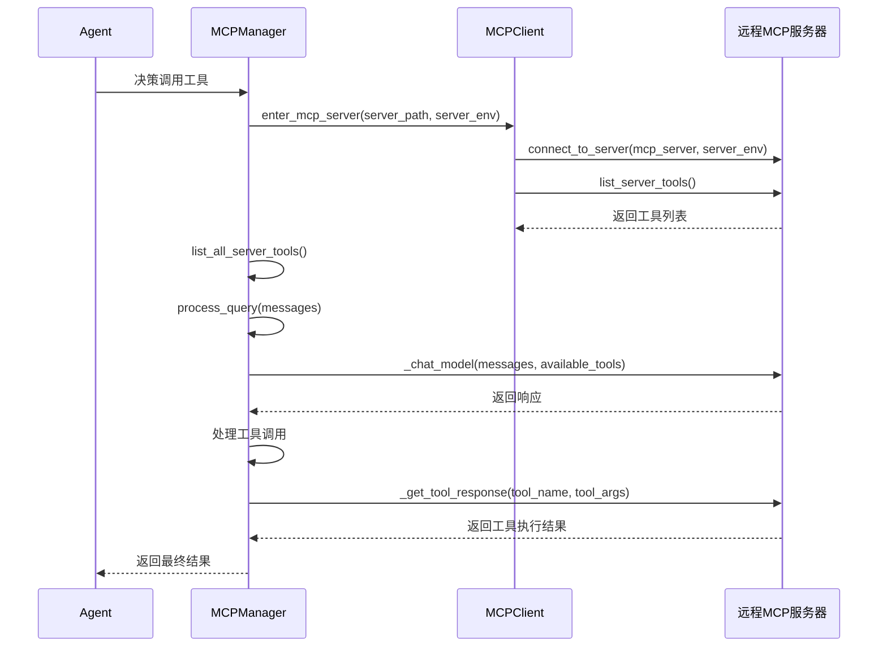
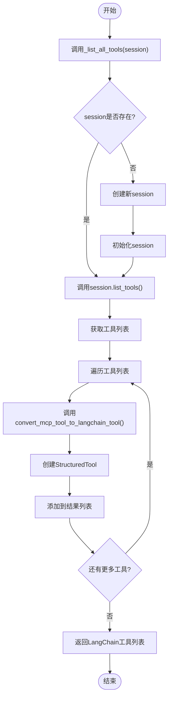
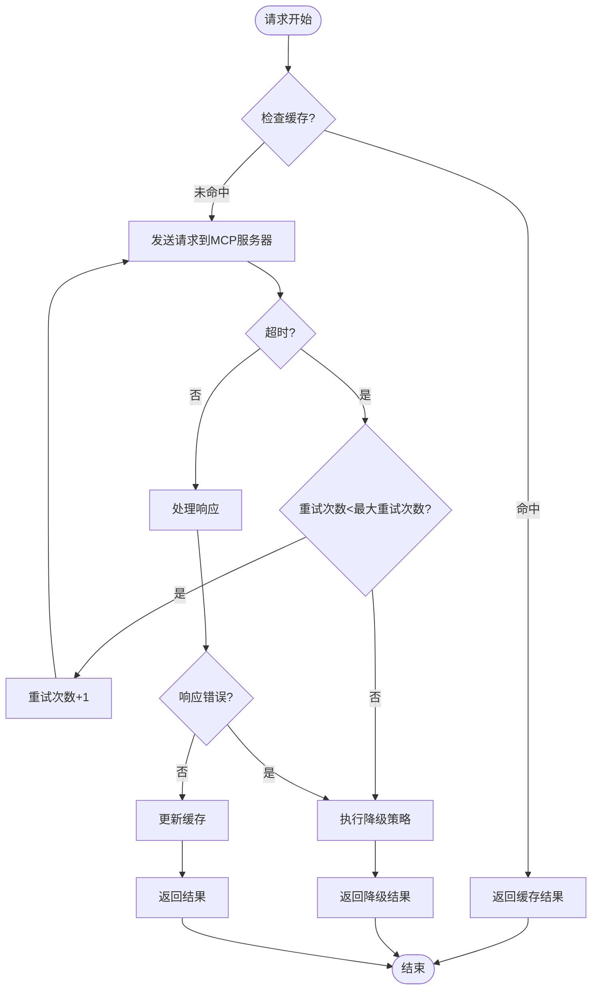

# MCP集成

<cite>
**本文档引用的文件**
- [mcp_server.json](https://github.com/Shy2593666979/AgentChat/src/backend/agentchat/config/mcp_server.json)
- [mcp_server.py](https://github.com/Shy2593666979/AgentChat/src/backend/agentchat/api/services/mcp_server.py)
- [mcp_server.py](https://github.com/Shy2593666979/AgentChat/src/backend/agentchat/api/v1/mcp_server.py)
- [mcp_manager.py](https://github.com/Shy2593666979/AgentChat/src/backend/agentchat/services/mcp_openai/mcp_manager.py)
- [mcp_client.py](https://github.com/Shy2593666979/AgentChat/src/backend/agentchat/services/mcp_openai/mcp_client.py)
- [multi_client.py](https://github.com/Shy2593666979/AgentChat/src/backend/agentchat/services/mcp/multi_client.py)
- [tools.py](https://github.com/Shy2593666979/AgentChat/src/backend/agentchat/services/mcp/load_mcp/tools.py)
- [prompts.py](https://github.com/Shy2593666979/AgentChat/src/backend/agentchat/services/mcp/load_mcp/prompts.py)
- [sessions.py](https://github.com/Shy2593666979/AgentChat/src/backend/agentchat/services/mcp/sessions.py)
- [mcp.py](https://github.com/Shy2593666979/AgentChat/src/backend/agentchat/schema/mcp.py)
- [mcp-server.vue](https://github.com/Shy2593666979/AgentChat/src/frontend/src/pages/mcp-server/mcp-server.vue)
- [mcp_arxiv.py](https://github.com/Shy2593666979/AgentChat/src/backend/agentchat/mcp_servers/arxiv/mcp_arxiv.py)
- [main.py](https://github.com/Shy2593666979/AgentChat/src/backend/agentchat/mcp_servers/lark_mcp/main.py)
</cite>

## 目录
1. [引言](#引言)
2. [MCP协议与系统定位](#mcp协议与系统定位)
3. [MCP服务器配置与管理](#mcp服务器配置与管理)
4. [MCP服务器启动流程](#mcp服务器启动流程)
5. [MCP工具调用链路](#mcp工具调用链路)
6. [前端界面集成](#前端界面集成)
7. [故障诊断与优化策略](#故障诊断与优化策略)
8. [结论](#结论)

## 引言

MCP（Modular Cognitive Platform）集成是本系统的核心扩展机制，它作为连接外部服务的标准接口，允许系统通过标准化协议集成各种第三方服务和工具。本文档将深入解析MCP集成的设计原理与实现细节，涵盖从配置管理、服务器启动、工具调用到前端集成的完整流程，并提供故障诊断和优化建议。

## MCP协议与系统定位

MCP协议是一种模块化认知平台协议，旨在为智能体系统提供一种标准化的方式来集成和调用外部服务。在本系统中，MCP扮演着连接器的角色，作为主系统与外部服务之间的桥梁。通过MCP协议，系统可以动态地发现、连接和调用各种外部工具和服务，从而极大地扩展了智能体的能力范围。

MCP协议支持多种传输方式，包括SSE（Server-Sent Events）、stdio、WebSocket和streamable HTTP，这使得它可以适应不同类型的外部服务。系统通过MCP协议实现了服务的即插即用，开发者可以轻松地将新的服务集成到系统中，而无需修改核心代码。

**Section sources**
- [mcp_server.json](https://github.com/Shy2593666979/AgentChat/src/backend/agentchat/config/mcp_server.json#L1-L40)
- [mcp.py](https://github.com/Shy2593666979/AgentChat/src/backend/agentchat/schema/mcp.py#L1-L46)

## MCP服务器配置与管理

### 配置文件结构

MCP服务器的配置主要通过`mcp_server.json`文件进行管理。该文件是一个JSON数组，每个元素代表一个MCP服务器的配置。配置项包括：

- **server_name**: 服务器名称
- **url**: 服务器地址
- **type**: 连接方式（SSE、Websocket等）
- **config**: 服务器配置信息
- **params**: 工具参数
- **config_enabled**: 是否需要配置
- **logo_url**: 服务器LOGO地址

```json
[
  {
    "server_name": "高德地图",
    "url": "https://mcp.api-inference.modelscope.net/77df8a09751e4c/sse",
    "type": "sse",
    "config": {},
    "params": {},
    "config_enabled": false,
    "logo_url": "https://agentchat.oss-cn-beijing.aliyuncs.com/icons/mcp/map.png"
  }
]
```

### 动态加载机制

系统通过`MultiServerMCPClient`类实现MCP服务器的动态加载。该类支持在运行时添加和管理多个MCP服务器连接。通过`connections`字典，系统可以映射服务器名称到连接配置，实现灵活的服务器管理。



**Diagram sources**
- [multi_client.py](https://github.com/Shy2593666979/AgentChat/src/backend/agentchat/services/mcp/multi_client.py#L42-L226)
- [sessions.py](https://github.com/Shy2593666979/AgentChat/src/backend/agentchat/services/mcp/sessions.py#L60-L177)

**Section sources**
- [mcp_server.json](https://github.com/Shy2593666979/AgentChat/src/backend/agentchat/config/mcp_server.json#L1-L40)
- [multi_client.py](https://github.com/Shy2593666979/AgentChat/src/backend/agentchat/services/mcp/multi_client.py#L42-L226)
- [sessions.py](https://github.com/Shy2593666979/AgentChat/src/backend/agentchat/services/mcp/sessions.py#L60-L177)

## MCP服务器启动流程

### lark_mcp服务器

lark_mcp服务器的启动流程通过`main.py`文件定义。服务器使用Starlette框架创建Web应用，并通过FastMCP库注册MCP服务。



**Diagram sources**
- [main.py](https://github.com/Shy2593666979/AgentChat/src/backend/agentchat/mcp_servers/lark_mcp/main.py#L1-L31)

### arxiv服务器

arxiv服务器的实现更为简洁，直接使用FastMCP装饰器定义工具函数。



**Diagram sources**
- [mcp_arxiv.py](https://github.com/Shy2593666979/AgentChat/src/backend/agentchat/mcp_servers/arxiv/mcp_arxiv.py#L1-L19)

**Section sources**
- [main.py](https://github.com/Shy2593666979/AgentChat/src/backend/agentchat/mcp_servers/lark_mcp/main.py#L1-L31)
- [mcp_arxiv.py](https://github.com/Shy2593666979/AgentChat/src/backend/agentchat/mcp_servers/arxiv/mcp_arxiv.py#L1-L19)

## MCP工具调用链路

### 工具调用完整链路

MCP工具调用的完整链路从Agent决策开始，经过mcp_client发送请求，最终在远程MCP服务器执行并返回结果。



**Diagram sources**
- [mcp_manager.py](https://github.com/Shy2593666979/AgentChat/src/backend/agentchat/services/mcp_openai/mcp_manager.py#L13-L118)
- [mcp_client.py](https://github.com/Shy2593666979/AgentChat/src/backend/agentchat/services/mcp_openai/mcp_client.py#L10-L53)

### 工具转换机制

系统通过`load_mcp_tools`函数将MCP工具转换为LangChain工具，实现工具的标准化。



**Diagram sources**
- [tools.py](https://github.com/Shy2593666979/AgentChat/src/backend/agentchat/services/mcp/load_mcp/tools.py#L149-L182)

**Section sources**
- [mcp_manager.py](https://github.com/Shy2593666979/AgentChat/src/backend/agentchat/services/mcp_openai/mcp_manager.py#L13-L118)
- [mcp_client.py](https://github.com/Shy2593666979/AgentChat/src/backend/agentchat/services/mcp_openai/mcp_client.py#L10-L53)
- [tools.py](https://github.com/Shy2593666979/AgentChat/src/backend/agentchat/services/mcp/load_mcp/tools.py#L149-L182)

## 前端界面集成

### 用户界面功能

前端通过`mcp-server.vue`组件提供MCP服务的管理界面，用户可以查看、启用和配置MCP服务。

```mermaid
classDiagram
class MCPServerPage {
+servers : MCPServer[]
+loading : boolean
+dialogVisible : boolean
+toolsDialogVisible : boolean
+configDialogVisible : boolean
+formLoading : boolean
+editingServer : MCPServer | null
+configuringServer : MCPServer | null
+selectedServerTools : MCPServerTool[]
+selectedServerName : string
+jsonEditor : IStandaloneCodeEditor | null
+configStatus : {valid : boolean, message : string}
+formData : CreateMCPServerRequest
+userConfigData : string
+formErrors : Record<string, string>
+fetchServers() : Promise<void>
+handleCreate() : void
+handleEdit(server : MCPServer) : void
+closeDialog() : void
+handleSubmit() : Promise<void>
+updateUserConfig() : Promise<void>
+handleDelete(server : MCPServer) : void
+viewTools(server : MCPServer) : void
+closeToolsDialog() : void
+handleConfig(server : MCPServer) : void
+initJsonEditor() : void
+validateJsonConfig() : void
+closeConfigDialog() : void
+handleConfigSubmit() : Promise<void>
+insertExampleConfig() : void
+handleImageError(event : Event) : void
+saveUserConfig() : Promise<void>
}
class MCPServer {
+mcp_server_id : string
+server_name : string
+url : string
+type : string
+config : any
+params : any
+config_enabled : boolean
+logo_url : string
+user_id : string
+user_name : string
+create_time : string
}
class MCPServerTool {
+name : string
+description : string
+inputSchema : any
}
class CreateMCPServerRequest {
+server_name : string
+url : string
+type : string
+config : any
}
class MCPUserConfigUpdateRequest {
+server_id : string
+config : any
}
MCPServerPage --> MCPServer : "管理"
MCPServerPage --> MCPServerTool : "显示"
MCPServerPage --> CreateMCPServerRequest : "创建"
MCPServerPage --> MCPUserConfigUpdateRequest : "更新配置"
```

**Diagram sources**
- [mcp-server.vue](https://github.com/Shy2593666979/AgentChat/src/frontend/src/pages/mcp-server/mcp-server.vue#L1-L800)

**Section sources**
- [mcp-server.vue](https://github.com/Shy2593666979/AgentChat/src/frontend/src/pages/mcp-server/mcp-server.vue#L1-L800)

## 故障诊断与优化策略

### 常见问题诊断

#### MCP连接失败

当MCP连接失败时，可能的原因包括：
- 服务器地址错误
- 网络连接问题
- 认证信息错误
- 服务器未启动

诊断方法：
1. 检查服务器URL是否正确
2. 使用健康检查接口验证服务器状态
3. 检查网络连接和防火墙设置
4. 验证认证信息是否正确

#### 响应超时

响应超时可能由以下原因引起：
- 服务器处理时间过长
- 网络延迟过高
- 客户端超时设置过短

解决方案：
- 增加客户端超时设置
- 优化服务器性能
- 使用异步处理机制

### 优化策略

#### 服务发现

实现动态服务发现机制，通过服务注册中心自动发现可用的MCP服务器，减少手动配置。

#### 负载均衡

对于高可用性要求的场景，可以实现负载均衡策略，将请求分发到多个相同的MCP服务器实例。

#### 容错处理

实现容错处理机制，包括：
- 自动重试机制
- 降级策略
- 熔断机制
- 缓存机制



**Diagram sources**
- [mcp_manager.py](https://github.com/Shy2593666979/AgentChat/src/backend/agentchat/services/mcp_openai/mcp_manager.py#L67-L114)
- [mcp_client.py](https://github.com/Shy2593666979/AgentChat/src/backend/agentchat/services/mcp_openai/mcp_client.py#L47-L48)

**Section sources**
- [mcp_manager.py](https://github.com/Shy2593666979/AgentChat/src/backend/agentchat/services/mcp_openai/mcp_manager.py#L67-L114)
- [mcp_client.py](https://github.com/Shy2593666979/AgentChat/src/backend/agentchat/services/mcp_openai/mcp_client.py#L47-L48)

## 结论

MCP集成通过标准化的协议和灵活的架构设计，为系统提供了强大的外部服务集成能力。从配置管理、服务器启动到工具调用，整个流程设计合理，易于扩展和维护。前端界面提供了友好的用户交互体验，使得MCP服务的管理变得简单直观。通过实施服务发现、负载均衡和容错处理等优化策略，可以进一步提升系统的稳定性和性能。