# 多Agent系统架构设计与实现机制

## 目录
1. [系统概述](#系统概述)
2. [核心架构设计](#核心架构设计)
3. [Agent类型与实现](#agent类型与实现)
4. [Agent生命周期管理](#agent生命周期管理)
5. [工具集成与绑定](#工具集成与绑定)
6. [多Agent协作机制](#多agent协作机制)
7. [前端交互与API设计](#前端交互与api设计)
8. [数据库模型与存储](#数据库模型与存储)
9. [性能优化与故障排除](#性能优化与故障排除)
10. [总结](#总结)

## 系统概述

AgentChat是一个基于多Agent架构的智能对话系统，采用模块化设计，支持多种Agent类型协同工作。系统核心特性包括：

- **多样化Agent类型**：支持ReAct、Plan-Execute、CodeAct等多种推理模式
- **灵活的工具集成**：通过MCP协议和插件系统实现外部服务集成
- **实时流式响应**：提供渐进式对话体验
- **可视化管理界面**：支持Agent的创建、配置和监控
- **强大的协作能力**：多个Agent可以组合完成复杂任务

## 核心架构设计

### 系统架构层次

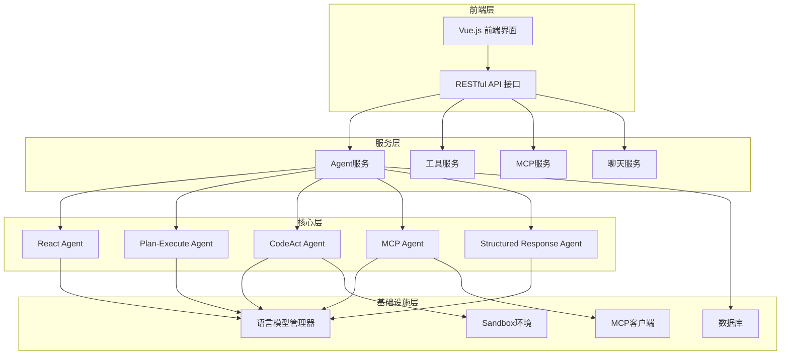

**图表来源**
- [agent.py](https://github.com/Shy2593666979/AgentChat/tree/main/src/backend/agentchat/api/services/agent.py#L1-L143)
- [manager.py](https://github.com/Shy2593666979/AgentChat/tree/main/src/backend/agentchat/core/models/manager.py#L1-L63)

### Agent抽象层设计

系统采用统一的Agent抽象接口，不同类型的Agent实现各自的推理逻辑：

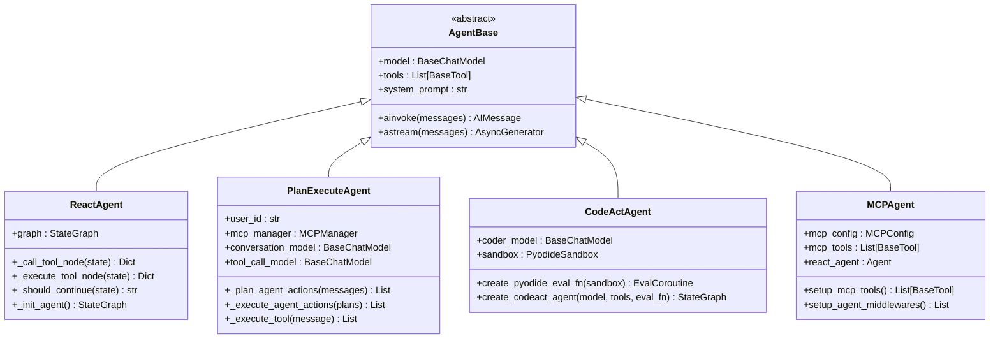

**图表来源**
- [react_agent.py](https://github.com/Shy2593666979/AgentChat/tree/main/src/backend/agentchat/core/agents/react_agent.py#L39-L279)
- [plan_execute_agent.py](https://github.com/Shy2593666979/AgentChat/tree/main/src/backend/agentchat/core/agents/plan_execute_agent.py#L18-L238)
- [codeact_agent.py](https://github.com/Shy2593666979/AgentChat/tree/main/src/backend/agentchat/core/agents/codeact_agent.py#L57-L226)
- [mcp_agent.py](https://github.com/Shy2593666979/AgentChat/tree/main/src/backend/agentchat/core/agents/mcp_agent.py#L26-L115)

## Agent类型与实现

### React Agent（推理与行动）

React Agent是最基础的Agent类型，基于ReAct（Reasoning and Acting）框架，具有以下特点：

- **核心特性**：
  - 支持流式输出和实时事件通知
  - 基于LangGraph的状态机设计
  - 自动工具选择和执行循环

- **工作流程**：
  ```mermaid
flowchart TD
Start([开始]) --> CallTool[调用模型选择工具]
CallTool --> HasTool{是否有工具调用?}
HasTool --> |是| ExecuteTool[执行工具]
HasTool --> |否| End([结束])
ExecuteTool --> ToolResult[获取工具结果]
ToolResult --> CallTool
```

**图表来源**
- [react_agent.py](https://github.com/Shy2593666979/AgentChat/tree/main/src/backend/agentchat/core/agents/react_agent.py#L82-L96)

**节来源**
- [react_agent.py](https://github.com/Shy2593666979/AgentChat/tree/main/src/backend/agentchat/core/agents/react_agent.py#L1-L279)

### Plan-Execute Agent（计划执行）

Plan-Execute Agent采用战略规划模式，先制定执行计划再执行：

- **核心特性**：
  - 分阶段的规划和执行分离
  - 支持MCP工具和插件工具混合使用
  - 自动JSON修复机制处理响应错误

- **执行流程**：
  ```mermaid
sequenceDiagram
participant User as 用户
participant Agent as Plan-Execute Agent
participant Planner as 计划器
participant Executor as 执行器
participant Tools as 工具集合
User->>Agent : 输入查询
Agent->>Planner : 分析并制定计划
Planner->>Agent : 返回执行计划
Agent->>Executor : 执行计划步骤
Executor->>Tools : 调用工具
Tools-->>Executor : 返回结果
Executor-->>Agent : 汇总执行结果
Agent-->>User : 返回最终响应
```

**图表来源**
- [plan_execute_agent.py](https://github.com/Shy2593666979/AgentChat/tree/main/src/backend/agentchat/core/agents/plan_execute_agent.py#L95-L157)

**节来源**
- [plan_execute_agent.py](https://github.com/Shy2593666979/AgentChat/tree/main/src/backend/agentchat/core/agents/plan_execute_agent.py#L1-L238)

### CodeAct Agent（代码行动）

CodeAct Agent专注于代码生成和执行，特别适用于编程任务：

- **核心特性**：
  - 内置Pyodide沙箱环境
  - 支持Python代码的动态执行
  - 代码块提取和组合功能

- **安全机制**：
  - 代码执行隔离
  - 输出捕获和错误处理
  - 上下文变量管理

**节来源**
- [codeact_agent.py](https://github.com/Shy2593666979/AgentChat/tree/main/src/backend/agentchat/core/agents/codeact_agent.py#L1-L226)

### MCP Agent（模型上下文协议）

MCP Agent专门处理Model Context Protocol服务：

- **核心特性**：
  - 支持多种MCP服务器
  - 中间件链式处理
  - 实时事件流式传输

**节来源**
- [mcp_agent.py](https://github.com/Shy2593666979/AgentChat/tree/main/src/backend/agentchat/core/agents/mcp_agent.py#L1-L115)

### Structured Response Agent（结构化响应）

提供结构化输出能力的基础Agent：

- **核心特性**：
  - 基于Pydantic的结构化输出
  - 灵活的响应格式定制
  - 与其他Agent的组合使用

**节来源**
- [structured_response_agent.py](https://github.com/Shy2593666979/AgentChat/tree/main/src/backend/agentchat/core/agents/structured_response_agent.py#L1-L21)

## Agent生命周期管理

### Agent创建与初始化

Agent的创建过程涉及多个组件的协调：

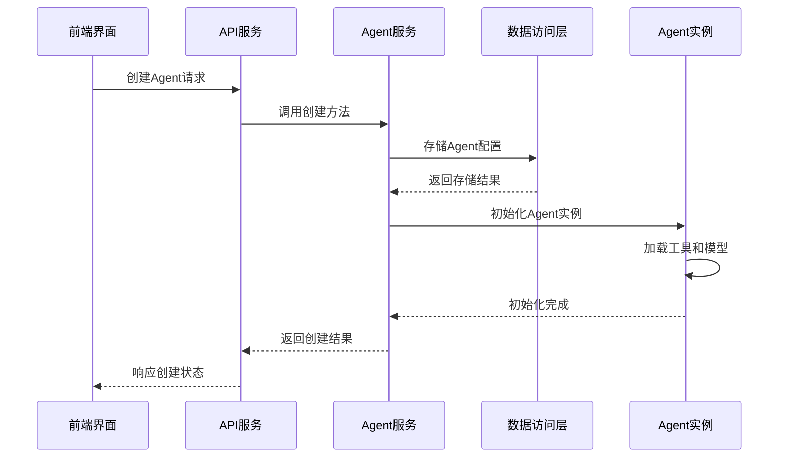

**图表来源**
- [agent.py](https://github.com/Shy2593666979/AgentChat/tree/main/src/backend/agentchat/api/services/agent.py#L11-L22)
- [agent.py](https://github.com/Shy2593666979/AgentChat/tree/main/src/backend/agentchat/api/v1/agent.py#L16-L37)

### 配置管理

Agent配置包括以下关键要素：

| 配置项 | 类型 | 描述 | 默认值 |
|--------|------|------|--------|
| name | str | Agent名称 | 必填 |
| description | str | Agent描述 | "" |
| system_prompt | str | 系统提示词 | 必填 |
| llm_id | str | 绑定的语言模型ID | 必填 |
| tool_ids | List[str] | 绑定的工具ID列表 | [] |
| mcp_ids | List[str] | 绑定的MCP服务器ID | [] |
| knowledge_ids | List[str] | 绑定的知识库ID | [] |
| enable_memory | bool | 是否启用记忆功能 | True |
| logo_url | str | Logo图片URL | 默认值 |

**节来源**
- [agent.py](https://github.com/Shy2593666979/AgentChat/tree/main/src/backend/agentchat/schema/agent.py#L1-L26)
- [agent.py](https://github.com/Shy2593666979/AgentChat/tree/main/src/backend/agentchat/database/models/agent.py#L1-L47)

### 状态管理

Agent状态管理采用分层架构：

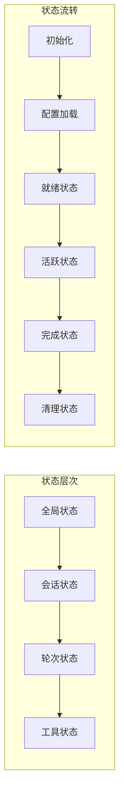

**图表来源**
- [react_agent.py](https://github.com/Shy2593666979/AgentChat/tree/main/src/backend/agentchat/core/agents/react_agent.py#L30-L35)

## 工具集成与绑定

### 工具类型分类

系统支持多种类型的工具集成：

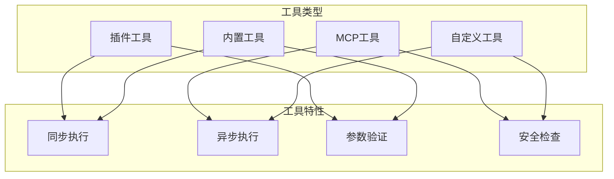

### MCP协议集成

MCP（Model Context Protocol）提供标准化的工具访问机制：

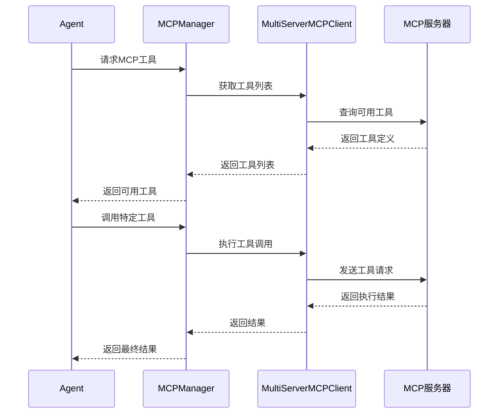

**图表来源**
- [manager.py](https://github.com/Shy2593666979/AgentChat/tree/main/src/backend/agentchat/services/mcp/manager.py#L27-L30)

**节来源**
- [manager.py](https://github.com/Shy2593666979/AgentChat/tree/main/src/backend/agentchat/services/mcp/manager.py#L1-L103)

### 工具绑定机制

工具绑定采用依赖注入模式，支持运行时动态加载：

- **插件工具绑定**：通过装饰器注册的函数工具
- **MCP工具绑定**：通过MCP协议发现和加载的远程工具
- **内置工具绑定**：系统预定义的核心功能工具

## 多Agent协作机制

### 协作模式

系统支持多种Agent协作模式：

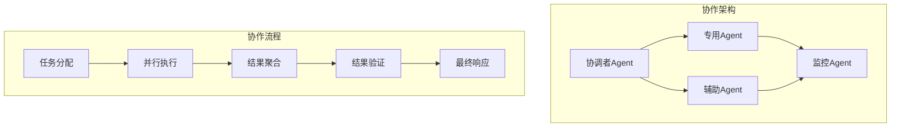

### 消息传递机制

Agent间的消息传递采用事件驱动架构：

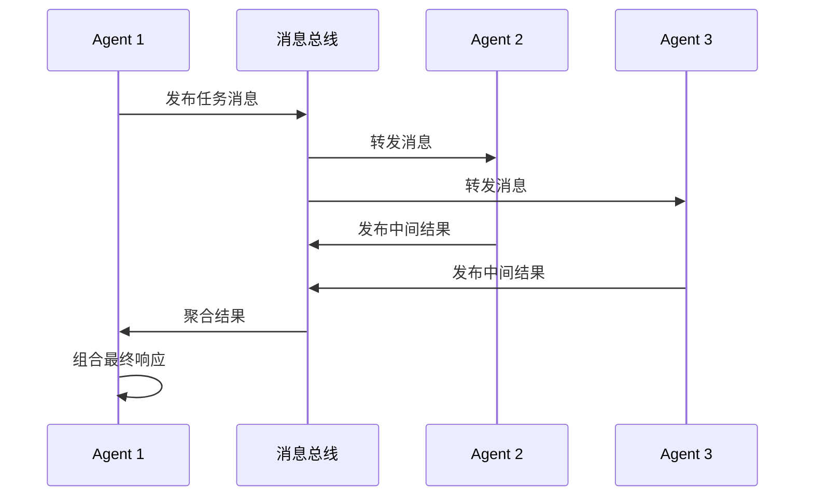

### 上下文共享策略

系统提供多种上下文共享机制：

- **全局上下文**：跨Agent的共享状态
- **会话上下文**：单次对话的上下文信息
- **工具上下文**：工具执行的环境变量
- **记忆上下文**：长期记忆和历史记录

## 前端交互与API设计

### API接口设计

Agent相关的API接口遵循RESTful设计原则：

| 接口路径 | 方法 | 功能 | 参数 |
|----------|------|------|------|
| `/api/v1/agent` | GET | 获取Agent列表 | 无 |
| `/api/v1/agent` | POST | 创建新Agent | AgentCreateRequest |
| `/api/v1/agent` | PUT | 更新Agent配置 | UpdateAgentRequest |
| `/api/v1/agent` | DELETE | 删除Agent | agent_id |
| `/api/v1/agent/search` | POST | 搜索Agent | name |

**节来源**
- [agent.py](https://github.com/Shy2593666979/AgentChat/tree/main/src/backend/agentchat/api/v1/agent.py#L1-L101)

### 前端组件架构

前端采用Vue.js构建，提供直观的Agent管理界面：

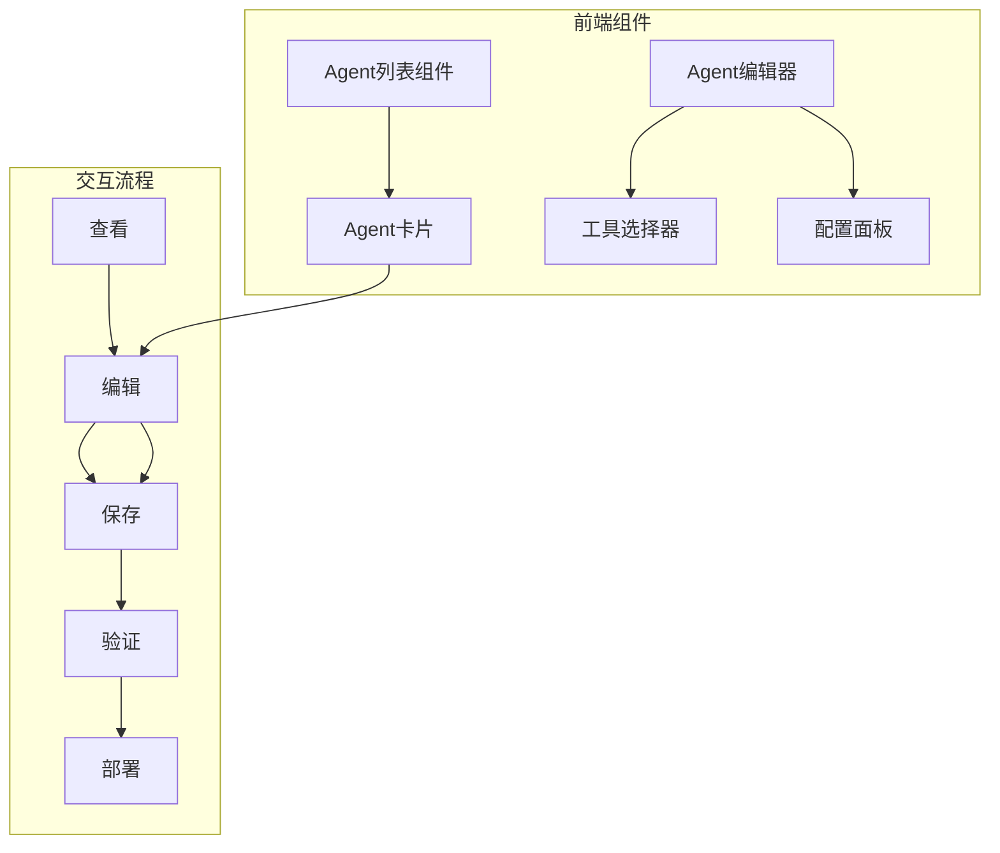

**图表来源**
- [agent.vue](https://github.com/Shy2593666979/AgentChat/tree/main/src/frontend/src/pages/agent/agent.vue#L1-L800)

**节来源**
- [agent.ts](https://github.com/Shy2593666979/AgentChat/tree/main/src/frontend/src/apis/agent.ts#L1-L163)

### 流式响应处理

前端通过Server-Sent Events (SSE)实现实时流式响应：

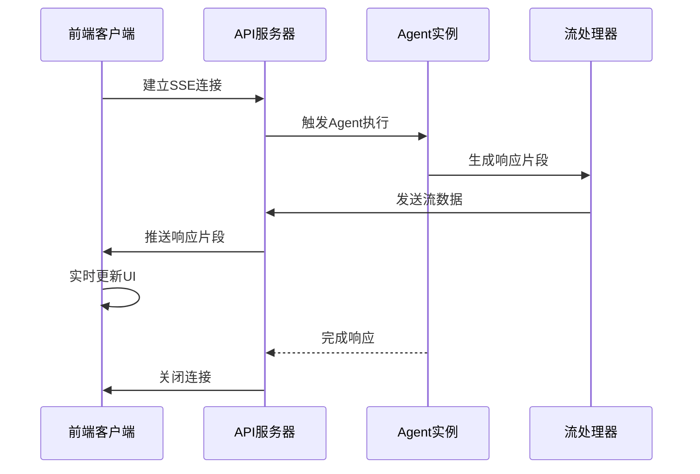

## 数据库模型与存储

### Agent模型结构

Agent在数据库中采用JSON字段存储复杂配置：

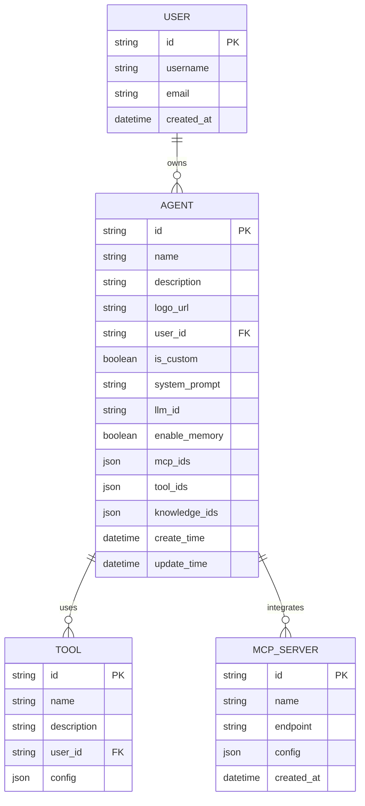

**图表来源**
- [agent.py](https://github.com/Shy2593666979/AgentChat/tree/main/src/backend/agentchat/database/models/agent.py#L11-L47)

### 数据关联关系

系统通过外键建立清晰的数据关联：

- **用户-Agent关系**：一对多，一个用户可以拥有多个Agent
- **Agent-工具关系**：多对多，Agent可以使用多个工具
- **Agent-MCP关系**：多对多，Agent可以集成多个MCP服务器
- **Agent-知识库关系**：多对多，Agent可以从多个知识库获取信息

**节来源**
- [agent.py](https://github.com/Shy2593666979/AgentChat/tree/main/src/backend/agentchat/database/models/agent.py#L1-L47)

## 性能优化与故障排除

### 性能优化策略

系统采用多层次的性能优化措施：

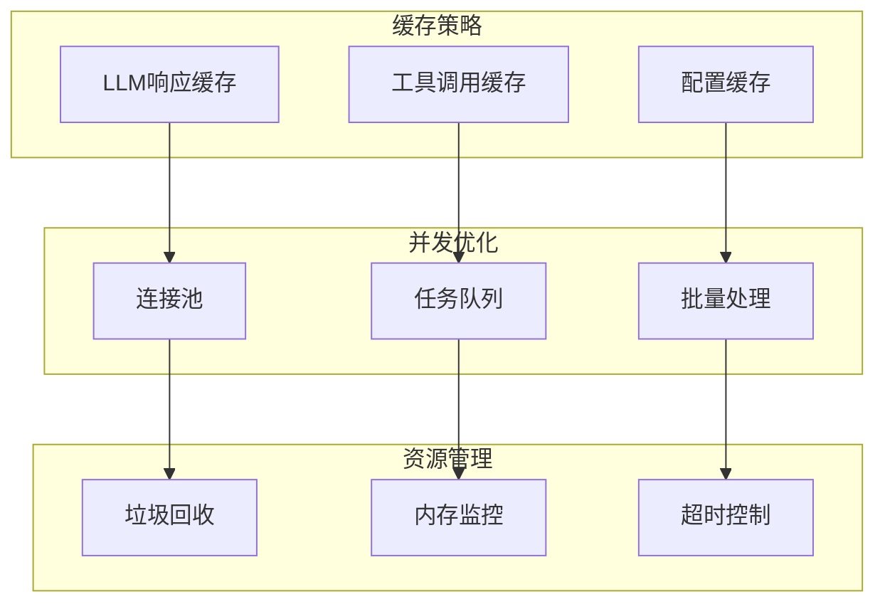

### 常见问题排查

#### Agent响应延迟

**可能原因**：
1. LLM模型调用耗时过长
2. 工具执行时间过长
3. 网络连接不稳定
4. 并发请求过多

**解决方案**：
- 实施请求限流和排队机制
- 优化工具调用逻辑
- 添加超时控制和重试机制
- 使用异步处理提高并发性

#### 逻辑错误诊断

**排查步骤**：
1. 检查Agent配置是否正确
2. 验证工具依赖是否完整
3. 分析日志输出定位问题
4. 测试独立功能模块

**节来源**
- [react_agent.py](https://github.com/Shy2593666979/AgentChat/tree/main/src/backend/agentchat/core/agents/react_agent.py#L270-L279)

### 监控与调试

系统提供完善的监控和调试功能：

- **实时日志**：详细的执行日志记录
- **性能指标**：响应时间和资源使用统计
- **错误追踪**：异常堆栈和错误报告
- **调试工具**：Agent状态检查和配置验证

## 总结

AgentChat多Agent系统展现了现代智能对话平台的设计精髓：

### 核心优势

1. **模块化架构**：清晰的职责分离和可扩展性
2. **多样化Agent类型**：适应不同应用场景的需求
3. **强大的工具集成**：支持插件和MCP协议
4. **实时协作能力**：多Agent协同完成复杂任务
5. **用户友好界面**：直观的管理和配置体验

### 技术创新

- **流式响应**：提供即时的用户体验
- **智能调度**：根据任务类型选择最优Agent
- **安全沙箱**：保障代码执行的安全性
- **事件驱动**：松耦合的组件通信机制

### 应用前景

该系统为构建下一代智能助手提供了坚实的技术基础，能够广泛应用于客服、教育、开发、运维等多个领域，具有广阔的应用前景和发展潜力。

通过持续的优化和功能扩展，AgentChat将不断演进，为用户提供更加智能、高效、可靠的对话体验。
