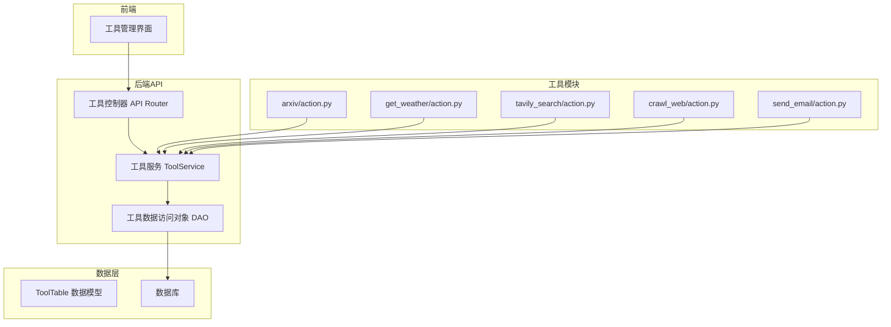
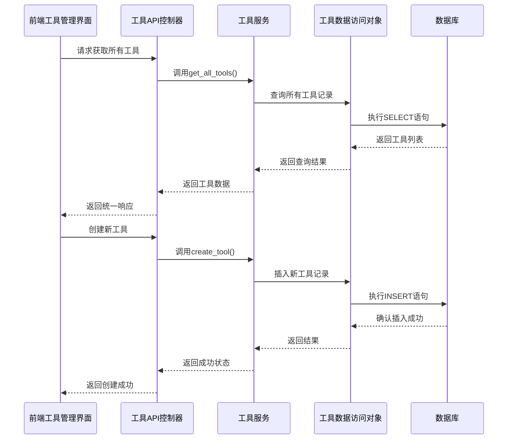
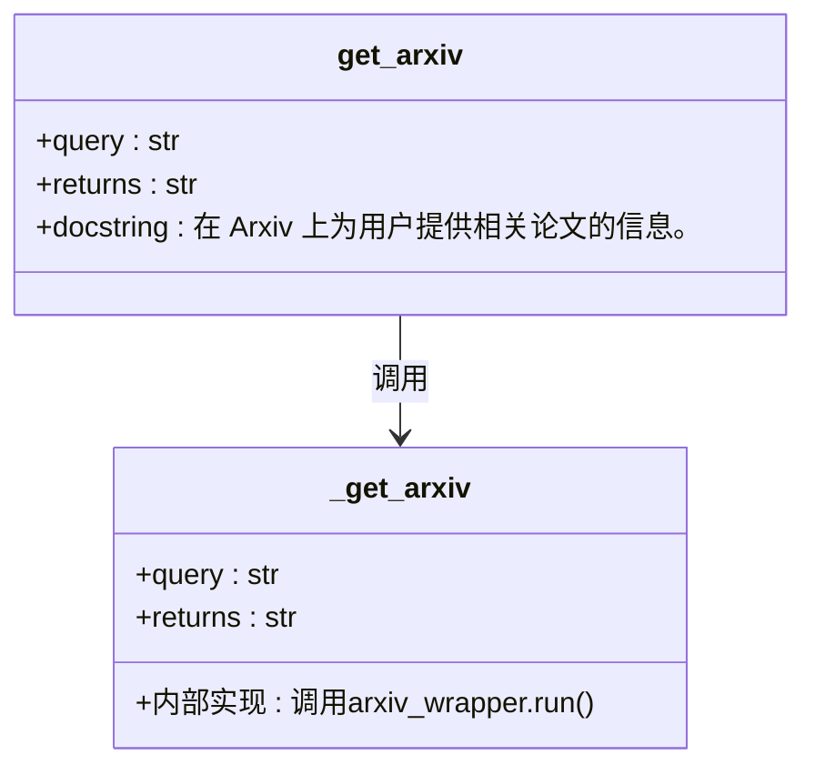
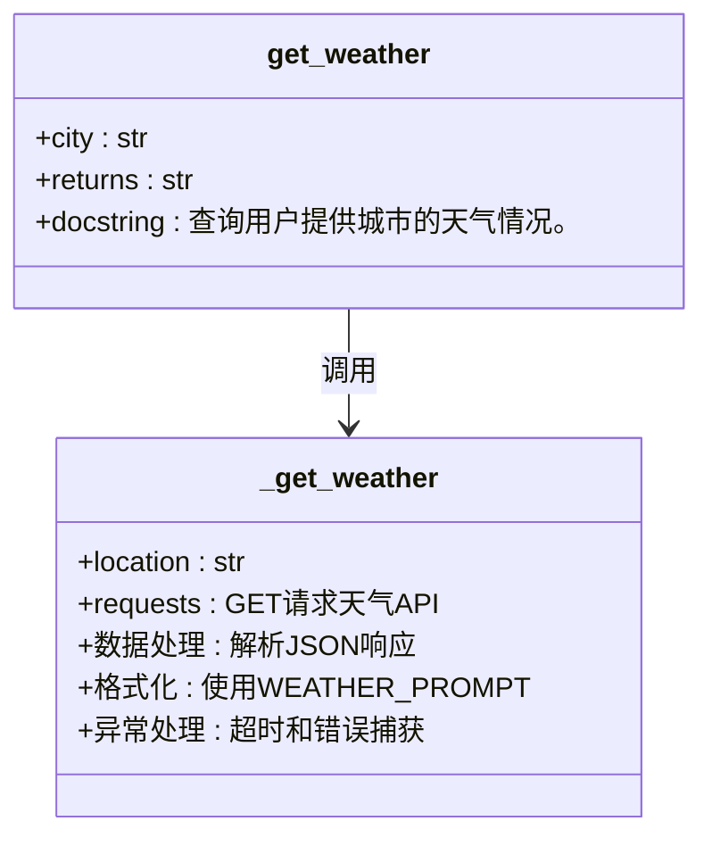
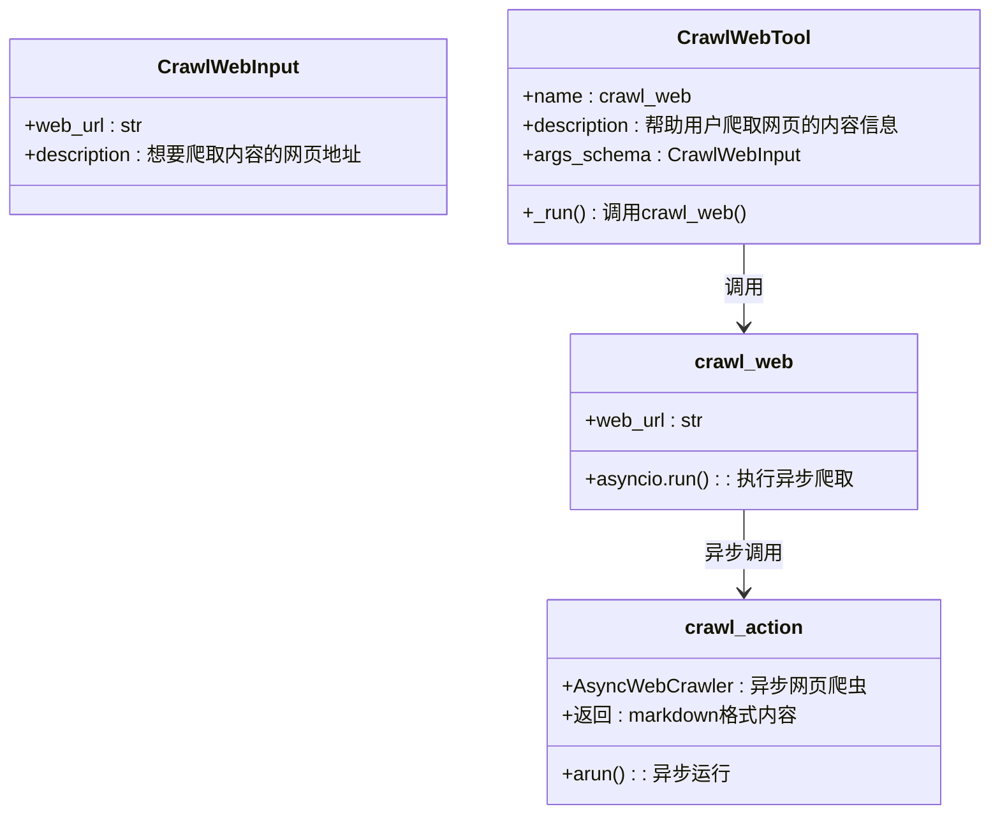
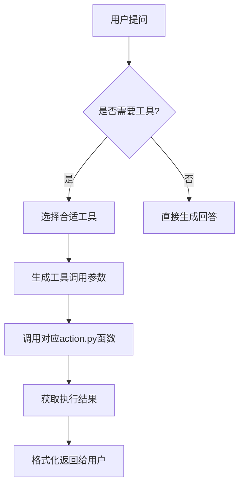
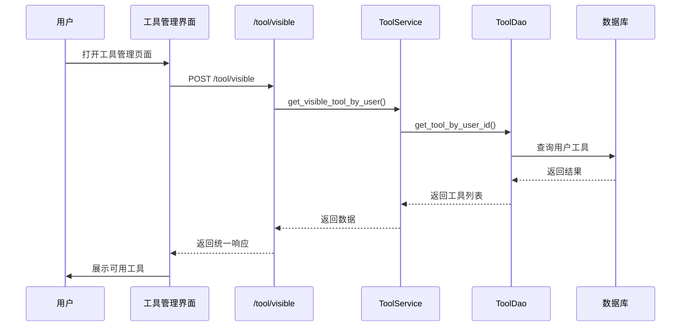
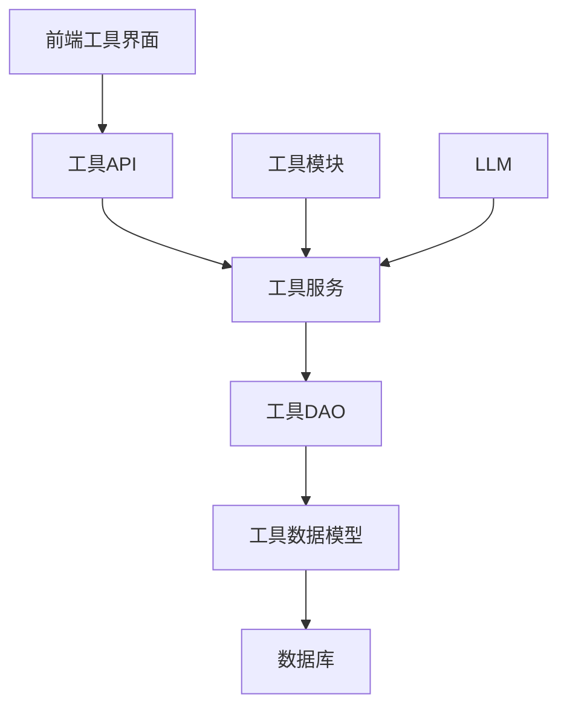

# 工具生态系统

## 目录
1. [引言](#引言)
2. [项目结构](#项目结构)
3. [核心组件](#核心组件)
4. [架构概述](#架构概述)
5. [详细组件分析](#详细组件分析)
6. [依赖分析](#依赖分析)
7. [性能考虑](#性能考虑)
8. [故障排除指南](#故障排除指南)
9. [结论](#结论)

## 引言
本项目构建了一个完整的工具生态系统，支持多种功能扩展，包括搜索、天气、邮件、网页抓取等。系统通过模块化设计实现了工具的注册、管理与调用机制，并结合LLM（大语言模型）实现智能识别与执行。前端提供了可视化工具管理界面，后端通过API服务和数据库持久化支持工具的全生命周期管理。

## 项目结构
工具生态系统采用分层架构设计，主要分为前端界面、后端API服务、工具实现模块和数据库持久化层。工具功能以独立模块形式组织在`tools`目录下，每个工具包含`action.py`作为核心执行逻辑。配置文件`tool.json`定义了系统内置工具的基本信息。

**图示来源**  
- [tool.vue](https://github.com/Shy2593666979/AgentChat/src/frontend/src/pages/tool/tool.vue)
- [tool.py](https://github.com/Shy2593666979/AgentChat/src/backend/agentchat/api/services/tool.py)
- [tool.py](https://github.com/Shy2593666979/AgentChat/src/backend/agentchat/database/models/tool.py)

## 核心组件
系统核心组件包括工具服务（ToolService）、工具数据模型（ToolTable）、工具API接口和前端工具管理界面。这些组件协同工作，实现工具的创建、查询、更新、删除（CRUD）操作以及在LLM中的注册与调用。

**组件来源**  
- [tool.py](https://github.com/Shy2593666979/AgentChat/src/backend/agentchat/api/services/tool.py#L9-L124)
- [tool.py](https://github.com/Shy2593666979/AgentChat/src/backend/agentchat/database/models/tool.py#L12-L36)

## 架构概述
系统采用典型的前后端分离架构，前端通过API调用与后端交互，后端服务封装业务逻辑并与数据库通信。工具模块通过LangChain的`@tool`装饰器注册为可调用函数，其描述信息用于LLM识别和调用决策。

**图示来源**  
- [tool.py](https://github.com/Shy2593666979/AgentChat/src/backend/agentchat/api/v1/tool.py#L27-L34)
- [tool.py](https://github.com/Shy2593666979/AgentChat/src/backend/agentchat/api/services/tool.py#L60-L65)
- [tool.py](https://github.com/Shy2593666979/AgentChat/src/backend/agentchat/database/dao/tool.py#L68-L72)

## 详细组件分析

### 工具函数定义规范
工具函数使用LangChain的`@tool`装饰器进行定义，支持从docstring中解析参数和描述信息。每个工具函数都有一个公共接口函数和一个私有实现函数（以`_`开头），确保调用逻辑清晰分离。

#### 示例：论文检索工具

**图示来源**  
- [arxiv/action.py](https://github.com/Shy2593666979/AgentChat/src/backend/agentchat/tools/arxiv/action.py#L6-L23)

#### 示例：天气查询工具

**图示来源**  
- [get_weather/action.py](https://github.com/Shy2593666979/AgentChat/src/backend/agentchat/tools/get_weather/action.py#L9-L54)

### 工具参数结构与执行逻辑
工具函数的参数通过类型注解和Pydantic模型严格定义。复杂参数使用自定义输入模型（如CrawlWebInput），简单参数直接在函数签名中声明。

#### 示例：网页爬取工具

**图示来源**  
- [crawl_web/action.py](https://github.com/Shy2593666979/AgentChat/src/backend/agentchat/tools/crawl_web/action.py#L7-L28)

### LLM工具识别与调用机制
系统通过工具描述（tool description）和JSON Schema使LLM能够识别并正确调用工具。工具的`description`字段存储在数据库中，供LLM决策使用。

**图示来源**  
- [tool.py](https://github.com/Shy2593666979/AgentChat/src/backend/agentchat/database/models/tool.py#L20)
- [action.py](https://github.com/Shy2593666979/AgentChat/src/backend/agentchat/tools/*/action.py)

### 前端工具管理界面
前端提供完整的工具管理功能，包括工具列表展示、创建、编辑和删除操作，通过API与后端交互。

**图示来源**  
- [tool.vue](https://github.com/Shy2593666979/AgentChat/src/frontend/src/pages/tool/tool.vue)
- [tool.py](https://github.com/Shy2593666979/AgentChat/src/backend/agentchat/api/v1/tool.py#L47-L54)

## 依赖分析
系统各组件之间存在明确的依赖关系，从前端到数据库形成完整的调用链路。

**图示来源**  
- [tool.py](https://github.com/Shy2593666979/AgentChat/src/backend/agentchat/api/v1/tool.py)
- [tool.py](https://github.com/Shy2593666979/AgentChat/src/backend/agentchat/api/services/tool.py)
- [tool.py](https://github.com/Shy2593666979/AgentChat/src/backend/agentchat/database/dao/tool.py)
- [tool.py](https://github.com/Shy2593666979/AgentChat/src/backend/agentchat/database/models/tool.py)

## 性能考虑
工具调用涉及网络请求和外部API调用，需注意超时控制和错误处理。例如天气查询工具设置了5秒超时，网页爬取使用异步处理提高效率。数据库操作通过SQLModel和连接池优化性能。

## 故障排除指南
常见问题包括工具调用失败、API密钥错误、网络超时等。系统通过日志记录（loguru）捕获异常信息，建议检查：
- 外部API密钥配置是否正确
- 网络连接是否正常
- 参数传递是否符合预期格式
- 数据库连接是否稳定

**故障排除来源**  
- [get_weather/action.py](https://github.com/Shy2593666979/AgentChat/src/backend/agentchat/tools/get_weather/action.py#L49-L51)
- [send_email/action.py](https://github.com/Shy2593666979/AgentChat/src/backend/agentchat/tools/send_email/action.py#L48-L50)

## 结论
该工具生态系统设计合理，具备良好的扩展性和可维护性。通过标准化的工具定义规范、完善的API接口和直观的前端管理界面，实现了工具的全生命周期管理。系统支持快速集成新工具，并能有效与LLM协同工作，为用户提供丰富的功能扩展能力。
